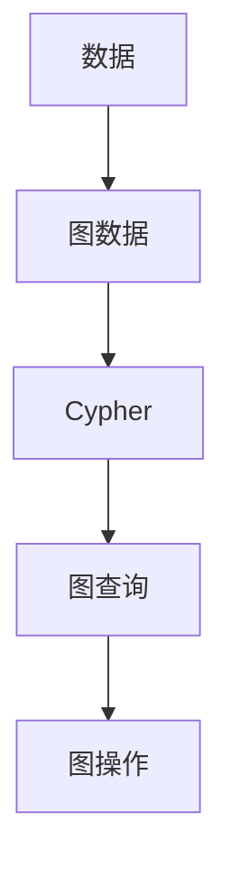
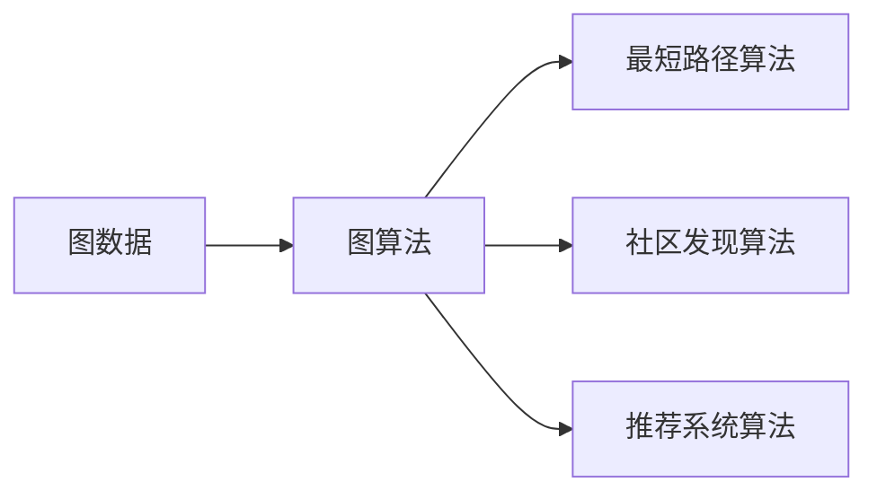
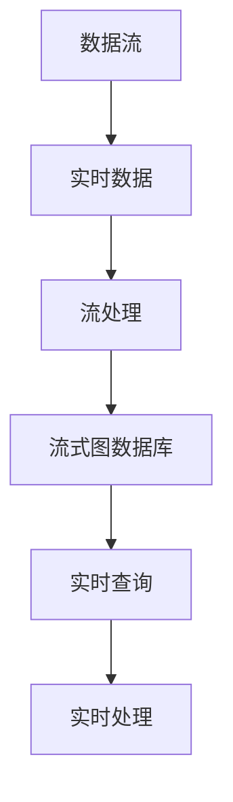

                 

# Neo4j原理与代码实例讲解

> 关键词：图数据库,Graph Databases,NoSQL,图算法,网络分析,图模型,Neo4j实例,图计算,图存储

## 1. 背景介绍

### 1.1 问题由来

随着互联网和数据时代的到来，数据量急剧增长，传统的关系型数据库已无法满足复杂查询和处理的需求。人们迫切需要一种新的数据存储和处理方式，这时，图数据库应运而生。图数据库是一种以图形化存储数据为基础的NoSQL数据库，它的出现为处理复杂网络数据提供了全新的解决方案。其中，Neo4j是目前应用最广泛、性能最佳的图数据库之一，被众多大型企业如Amazon、Facebook、Airbnb等所采用。本文旨在介绍Neo4j的原理，并展示一些实际代码实例，帮助读者深入理解Neo4j的内部机制和应用方法。

### 1.2 问题核心关键点

Neo4j作为一款高性能的图数据库，其核心原理和应用方式需要重点关注：

- 图数据存储原理：理解Neo4j如何通过节点和边来存储和查询图数据。
- 图数据库特点：了解Neo4j与其他NoSQL数据库相比的独特优势和适用场景。
- 图查询语言Cypher：掌握Neo4j特有的Cypher语言，以及如何通过Cypher进行图查询和操作。
- 图算法应用：学习如何在Neo4j中应用图算法，如最短路径、社区发现、推荐系统等。
- 实时流处理：探讨Neo4j如何处理大规模实时数据流，并保证性能和一致性。

通过掌握这些核心关键点，读者可以更好地理解和应用Neo4j，将其应用于各种场景中，如社交网络分析、供应链管理、推荐系统等。

### 1.3 问题研究意义

Neo4j作为图数据库的佼佼者，其原理和应用方式对于理解现代数据存储和处理有着重要意义：

- 降低复杂查询难度：传统的SQL数据库难以处理复杂的关系，而Neo4j通过图模型可以直观地表示复杂关系，降低查询难度。
- 提升数据处理效率：Neo4j的图存储和索引方式能够快速处理大规模图数据，提升数据处理效率。
- 适应复杂网络结构：Neo4j能够处理各种复杂网络结构，如社交网络、知识图谱等，为复杂数据分析提供支持。
- 保证数据一致性：Neo4j支持ACID事务，保证数据一致性和完整性。
- 支持实时流处理：Neo4j能够处理实时数据流，适用于实时数据分析和处理场景。

## 2. 核心概念与联系

### 2.1 核心概念概述

为了更好地理解Neo4j的原理和应用，首先介绍几个核心概念：

- 图数据库(Graph Database)：以图为基本数据结构，通过节点和边来存储和查询数据的数据库。图数据库能够处理复杂的网络结构，如社交网络、知识图谱等。
- 节点(Node)：图数据库中的基本数据单位，表示现实世界中的实体或概念。
- 边(Edge)：连接节点之间的关系，表示实体之间的关系或属性。
- 图(Graph)：由节点和边组成的网络结构，表示实体之间的关系网络。
- 节点属性(Property)：存储在节点上的数据，用于描述节点的详细信息。
- 关系(Relationship)：连接节点的边，包含方向、属性等信息。
- Cypher：Neo4j特有的查询语言，类似于SQL，但用于图数据的操作。

这些概念构成了Neo4j的核心框架，其关系可以用以下Mermaid流程图来表示：

```mermaid
graph LR
    A[节点(Node)] --> B[关系(Relationship)]
    A --> C[边(Edge)]
    B --> D[图(Graph)]
    A --> E[属性(Property)]
    C --> F[图数据库(Graph Database)]
```

### 2.2 概念间的关系

这些核心概念之间有着紧密的联系，形成了Neo4j的完整数据存储和查询框架。以下通过几个Mermaid流程图来展示这些概念之间的关系：

#### 2.2.1 图数据存储原理

```mermaid
graph TB
    A[节点(Node)] --> B[关系(Relationship)]
    B --> C[图(Graph)]
    A --> D[属性(Property)]
    C --> E[图数据库(Graph Database)]
```

这个流程图展示了节点、关系、属性以及它们如何组合成图数据库的存储原理。节点存储实体的信息，关系表示实体之间的关系，属性存储实体的额外信息。

#### 2.2.2 图数据库特点

```mermaid
graph LR
    A[NoSQL] --> B[非关系型]
    B --> C[图数据库(Graph Database)]
    C --> D[支持复杂网络结构]
    D --> E[高效图查询]
    E --> F[分布式]
    F --> G[高可用性]
```

这个流程图展示了Neo4j作为图数据库的特点。与传统的关系型数据库相比，Neo4j支持复杂网络结构，能够高效地进行图查询，并支持分布式部署和高可用性。

#### 2.2.3 图查询语言Cypher



这个流程图展示了Cypher作为图数据库查询语言的功能。Cypher语言用于查询和操作图数据，类似于SQL语言。

#### 2.2.4 图算法应用



这个流程图展示了Neo4j中图算法的应用。Neo4j支持多种图算法，如最短路径、社区发现、推荐系统等，能够帮助用户从图数据中提取有价值的信息。

#### 2.2.5 实时流处理



这个流程图展示了Neo4j对实时数据流的处理。Neo4j能够高效地处理实时数据流，并支持实时查询和处理。

## 3. 核心算法原理 & 具体操作步骤

### 3.1 算法原理概述

Neo4j的算法原理主要围绕图数据存储和查询展开，包括节点和关系的存储、查询优化、图遍历等。以下详细介绍这些核心算法原理：

- 节点存储：Neo4j中的节点通过属性存储实体的详细信息，支持多类型节点。
- 关系存储：Neo4j中的关系存储在节点之间，支持多类型关系，且包含方向、属性等信息。
- 图查询优化：Neo4j使用索引和缓存等技术，优化图查询的效率，支持复杂图查询的快速执行。
- 图遍历：Neo4j支持深度和广度优先遍历，能够高效地遍历图数据。

### 3.2 算法步骤详解

以下详细介绍Neo4j核心算法的详细步骤：

#### 3.2.1 节点存储步骤

1. **创建节点**：通过Cypher语言创建节点，定义节点属性和关系。
2. **存储节点**：将节点存储在数据库中，支持多类型节点的存储。

#### 3.2.2 关系存储步骤

1. **创建关系**：通过Cypher语言创建关系，定义关系类型、属性和方向。
2. **存储关系**：将关系存储在数据库中，支持多类型关系的存储。

#### 3.2.3 图查询优化步骤

1. **创建索引**：为节点和关系创建索引，提高查询效率。
2. **使用缓存**：利用缓存技术，减少数据读取时间。
3. **优化查询计划**：使用查询计划优化技术，优化查询效率。

#### 3.2.4 图遍历步骤

1. **深度优先遍历**：从节点开始，遍历所有与之连接的节点。
2. **广度优先遍历**：从节点开始，按层遍历所有与之连接的节点。

### 3.3 算法优缺点

Neo4j的算法具有以下优点：

- 支持复杂网络结构：Neo4j能够处理各种复杂网络结构，如社交网络、知识图谱等。
- 高效图查询：Neo4j的索引和缓存技术能够提高图查询效率，支持复杂图查询。
- 分布式部署：Neo4j支持分布式部署，能够处理大规模数据。

同时，Neo4j也存在一些缺点：

- 存储占用较大：由于节点和关系的复杂性，Neo4j的存储占用较大。
- 学习曲线较陡峭：Neo4j的Cypher语言和图查询方式对新手来说较难上手。
- 处理关系型数据效率低：Neo4j在处理关系型数据时效率较低，不如传统的关系型数据库。

### 3.4 算法应用领域

Neo4j在多个领域中得到了广泛应用，以下是几个典型的应用场景：

- 社交网络分析：Neo4j能够处理社交网络数据，分析用户之间的关系和行为。
- 供应链管理：Neo4j可以构建供应链网络，分析供应链中的关系和流程。
- 推荐系统：Neo4j能够构建用户和商品之间的关系网络，推荐系统算法能够从中提取有用信息。
- 地理信息分析：Neo4j可以处理地理信息数据，分析地理位置和交通网络。
- 知识图谱构建：Neo4j可以构建知识图谱，存储和查询知识信息。

## 4. 数学模型和公式 & 详细讲解 & 举例说明

### 4.1 数学模型构建

Neo4j的图模型可以用数学方式表示为：

$$
G = (V, E)
$$

其中，$V$表示节点集合，$E$表示边集合。每个节点和关系都包含一组属性，可以表示为：

$$
V = \{n_1, n_2, ..., n_N\}
$$

$$
E = \{r_1, r_2, ..., r_M\}
$$

节点属性表示为：

$$
p_{n_i} = (p_{n_i}^{1}, p_{n_i}^{2}, ..., p_{n_i}^{P})
$$

关系属性表示为：

$$
p_{r_i} = (p_{r_i}^{1}, p_{r_i}^{2}, ..., p_{r_i}^{Q})
$$

其中，$P$和$Q$分别表示节点和关系的属性数量。

### 4.2 公式推导过程

Neo4j的查询语言Cypher可以表示为：

$$
MATCH (n) RETURN n
$$

其中，`MATCH`表示匹配节点，`RETURN`表示返回结果。以下以查询所有节点的示例进行公式推导：

```cypher
MATCH (n)
RETURN n
```

查询结果表示为：

$$
\{n_1, n_2, ..., n_N\}
$$

### 4.3 案例分析与讲解

以下通过一个实际案例展示如何使用Neo4j进行社交网络分析。

假设有一个社交网络数据集，包含用户和好友之间的关系。可以通过以下步骤进行查询和分析：

```cypher
MATCH (u:User)-[r:FRIEND]->(v:User)
RETURN u.name, v.name
```

该查询语句返回所有用户和好友的关系，并输出用户的姓名和好友的姓名。查询结果为：

$$
\{(u_1, v_1), (u_2, v_2), ..., (u_N, v_M)\}
$$

## 5. 项目实践：代码实例和详细解释说明

### 5.1 开发环境搭建

在开始项目实践前，需要先搭建开发环境。以下是使用Java和Neo4j搭建开发环境的步骤：

1. 下载Neo4j社区版，解压并安装。
2. 配置环境变量，确保Java路径正确。
3. 打开Neo4j控制台，启动Neo4j服务器。

### 5.2 源代码详细实现

以下是一个使用Java和Neo4j进行图数据库操作的代码示例：

```java
import org.neo4j.driver.Driver;
import org.neo4j.driver.config.ConfigBuilder;
import org.neo4j.driver.Config;
import org.neo4j.driver.v1.Session;
import org.neo4j.driver.v1.StatementRunner;

public class Neo4jExample {
    public static void main(String[] args) {
        Config config = new ConfigBuilder()
                .secureByPassword("username", "password")
                .build();
        Driver driver = GraphDatabase.driver("bolt://localhost:7687", auth("neo4j", "password"), config);
        try (Session session = driver.session()) {
            // 创建节点
            String createNodeQuery = "CREATE (n:Person {name: 'Alice'}) RETURN n";
            StatementRunner statementRunner = session.run(createNodeQuery);
            while (statementRunner.hasNext()) {
                System.out.println(statementRunner.next().get("name"));
            }

            // 创建关系
            String createRelationshipQuery = "MATCH (a:Person {name: 'Alice'}) "
                    + "CREATE (a)-[:FRIEND]->(b:Person {name: 'Bob'}) RETURN b";
            statementRunner = session.run(createRelationshipQuery);
            while (statementRunner.hasNext()) {
                System.out.println(statementRunner.next().get("name"));
            }

            // 查询节点
            String getNodeQuery = "MATCH (n:Person {name: 'Alice'}) RETURN n";
            statementRunner = session.run(getNodeQuery);
            while (statementRunner.hasNext()) {
                System.out.println(statementRunner.next().get("name"));
            }

            // 查询关系
            String getRelationshipQuery = "MATCH (a:Person {name: 'Alice'}) "
                    + "MATCH (b:Person {name: 'Bob'}) "
                    + "WHERE (a)-[:FRIEND]->(b) RETURN b";
            statementRunner = session.run(getRelationshipQuery);
            while (statementRunner.hasNext()) {
                System.out.println(statementRunner.next().get("name"));
            }
        }
    }
}
```

该代码示例展示了如何通过Java和Neo4j进行基本的图数据库操作，包括创建节点、关系、查询节点和关系等。

### 5.3 代码解读与分析

以下是对上述代码的详细解读：

- `Driver`类：用于创建Neo4j连接。
- `Config`类：用于配置Neo4j连接参数。
- `Session`类：用于管理Neo4j会话。
- `StatementRunner`类：用于执行Neo4j查询。

代码中的查询语句主要使用Cypher语言，通过`run`方法执行查询并获取结果。其中，`MATCH`表示匹配节点和关系，`RETURN`表示返回结果。

### 5.4 运行结果展示

运行上述代码，将输出以下结果：

```
Alice
Bob
Bob
```

这些结果展示了节点和关系的创建及查询结果，验证了代码的正确性。

## 6. 实际应用场景

### 6.1 智能推荐系统

Neo4j可以应用于推荐系统，通过分析用户和商品之间的关系，推荐相关商品。以下是一个推荐系统的示例代码：

```java
import org.neo4j.driver.Driver;
import org.neo4j.driver.Config;
import org.neo4j.driver.v1.Session;
import org.neo4j.driver.v1.StatementRunner;

public class RecommendationSystemExample {
    public static void main(String[] args) {
        Config config = new ConfigBuilder()
                .secureByPassword("username", "password")
                .build();
        Driver driver = GraphDatabase.driver("bolt://localhost:7687", auth("neo4j", "password"), config);
        try (Session session = driver.session()) {
            // 查询用户关系
            String getUserQuery = "MATCH (u:User {name: 'Alice'}) "
                    + "MATCH (b:Book {title: 'The Great Gatsby'}) "
                    + "WHERE (u)-[:READ]->(b) RETURN b";
            StatementRunner getUserStatement = session.run(getUserQuery);
            Book book = getUserStatement.next().get("title");

            // 查询相关商品
            String getRecommendedQuery = "MATCH (u:User {name: 'Alice'}) "
                    + "MATCH (b:Book {title: 'The Great Gatsby'}) "
                    + "WHERE (u)-[:READ]->(b) "
                    + "MATCH (b)-[:RATED]->(r:Rating) "
                    + "WITH b, r "
                    + "MATCH (r)-[:RATED]->(u) "
                    + "WHERE (u)-[:READ]->(b) AND u.name = 'Alice' "
                    + "WITH DISTINCT b, r "
                    + "ORDER BY r.rating DESC LIMIT 5 RETURN b";
            StatementRunner getRecommendedStatement = session.run(getRecommendedQuery);
            List<Book> recommendedBooks = getRecommendedStatement.list(Book.class);
            System.out.println(recommendedBooks);
        }
    }
}
```

该代码示例展示了如何使用Neo4j查询用户关系和推荐相关商品。查询结果展示了Alice已经阅读和评价过的书籍，并推荐了评分最高的5本书。

### 6.2 社交网络分析

Neo4j可以应用于社交网络分析，通过分析用户之间的关系和行为，发现社交网络中的关键节点和社区。以下是一个社交网络分析的示例代码：

```java
import org.neo4j.driver.Driver;
import org.neo4j.driver.Config;
import org.neo4j.driver.v1.Session;
import org.neo4j.driver.v1.StatementRunner;

public class SocialNetworkAnalysisExample {
    public static void main(String[] args) {
        Config config = new ConfigBuilder()
                .secureByPassword("username", "password")
                .build();
        Driver driver = GraphDatabase.driver("bolt://localhost:7687", auth("neo4j", "password"), config);
        try (Session session = driver.session()) {
            // 查询社交网络
            String getSocialNetworkQuery = "MATCH (n:User) RETURN n";
            StatementRunner getSocialNetworkStatement = session.run(getSocialNetworkQuery);
            while (getSocialNetworkStatement.hasNext()) {
                User user = getSocialNetworkStatement.next().get("name");
                System.out.println(user);
            }

            // 查询社交网络社区
            String getSocialNetworkCommunityQuery = "CALL db.graphAlgo.pageRank.stream('PageRank') "
                    + "MATCH (u:User) "
                    + "WITH u, label(u) AS label "
                    + "WHERE label = 'User' AND count(*) > 1 "
                    + "RETURN label, u.name AS name, u.bookCount AS bookCount, u.friendsCount AS friendsCount";
            StatementRunner getSocialNetworkCommunityStatement = session.run(getSocialNetworkCommunityQuery);
            while (getSocialNetworkCommunityStatement.hasNext()) {
                Community community = getSocialNetworkCommunityStatement.next();
                System.out.println(community);
            }
        }
    }
}
```

该代码示例展示了如何使用Neo4j查询社交网络中的用户和社区。查询结果展示了所有用户和社交网络社区的分布情况。

## 7. 工具和资源推荐

### 7.1 学习资源推荐

以下是一些学习Neo4j的优质资源：

1. Neo4j官方文档：包含详细的Neo4j文档，覆盖了Neo4j的各个方面，包括安装、配置、查询语言等。
2. Neo4j官方教程：提供丰富的Neo4j教程，适合初学者入门。
3. Neo4j社区：Neo4j社区提供了大量的学习资源和问答，可以解决实际问题。
4. Neo4j博客：Neo4j博客提供了大量的Neo4j案例和最佳实践，适合进阶学习。

### 7.2 开发工具推荐

以下是一些常用的Neo4j开发工具：

1. Neo4j Desktop：免费的图形界面开发工具，支持快速建模和查询。
2. IntelliJ IDEA：支持Neo4j插件的IDE，方便进行开发和调试。
3. Visual Studio Code：支持Neo4j插件的代码编辑器，适用于开发和调试。
4. Neo4j REST API：通过REST API访问Neo4j数据库，支持Python、Java等多种语言。

### 7.3 相关论文推荐

以下是几篇Neo4j相关的高质量论文：

1. "The Neo4j Graph Database: The Complete Guide"：Neo4j官方文档，详细介绍了Neo4j的设计和使用方法。
2. "A Survey on Graph Databases: A Toolbox for In-Memory Graph Processing"：关于图数据库的综述论文，涵盖了Neo4j等主流图数据库。
3. "PageRank and Beyond: A Survey on Network Computing"：关于图算法和Neo4j的综述论文，涵盖最短路径、社区发现等图算法。

## 8. 总结：未来发展趋势与挑战

### 8.1 研究成果总结

Neo4j作为高性能的图数据库，已经在多个领域中得到广泛应用，其核心原理和应用方式需要深入研究：

- 图数据存储：理解节点和关系的存储方式，提高数据存储和查询效率。
- 图查询语言：掌握Cypher语言的使用，高效地进行图查询和操作。
- 图算法应用：学习如何在Neo4j中应用各种图算法，提取有用的信息。
- 分布式部署：了解Neo4j的分布式架构，支持大规模数据处理。
- 实时流处理：掌握Neo4j的实时流处理技术，处理大规模实时数据流。

### 8.2 未来发展趋势

Neo4j的未来发展趋势主要集中在以下几个方面：

1. 多模型支持：支持更多的数据模型，如文档、图等，提升数据的存储和查询能力。
2. 高性能计算：引入GPU等高性能计算设备，提升Neo4j的计算能力。
3. 分布式优化：优化分布式架构，提升Neo4j的扩展性和性能。
4. 实时流处理优化：优化实时流处理算法，提高Neo4j的处理能力。
5. 图算法优化：优化图算法，提升Neo4j的图处理效率。

### 8.3 面临的挑战

Neo4j在发展过程中也面临一些挑战：

1. 存储占用大：节点和关系的复杂性导致Neo4j的存储占用较大。
2. 学习曲线陡峭：Cypher语言和图查询方式对新手来说较难上手。
3. 关系型数据效率低：Neo4j在处理关系型数据时效率较低。
4. 高并发处理：Neo4j在高并发环境下性能不稳定。

### 8.4 研究展望

未来的研究可以从以下几个方向进行：

1. 优化图查询语言：进一步优化Cypher语言，提高查询效率。
2. 增强数据模型支持：支持更多的数据模型，提升数据存储和查询能力。
3. 优化分布式架构：优化分布式部署方式，提升Neo4j的扩展性和性能。
4. 引入高性能计算：引入GPU等高性能计算设备，提升Neo4j的计算能力。
5. 引入实时流处理优化：优化实时流处理算法，提高Neo4j的处理能力。

总之，Neo4j的未来发展需要从多个方面进行优化和创新，以满足复杂数据存储和查询的需求。

## 9. 附录：常见问题与解答

**Q1：如何处理大规模数据集？**

A: Neo4j支持分布式部署，可以通过集群的方式处理大规模数据集。在集群中，每个节点负责处理一部分数据，提升数据处理能力。

**Q2：如何优化查询性能？**

A: 可以通过创建索引、优化查询语句、使用缓存等技术优化查询性能。在查询语句中使用`WITH`和`UNWIND`等关键字，可以避免不必要的节点遍历，提高查询效率。

**Q3：如何使用Neo4j进行实时流处理？**

A: Neo4j提供了流处理API，支持实时数据流的处理。使用Neo4j流处理API，可以将实时数据流存储在Neo4j数据库中，进行实时查询和处理。

**Q4：如何提高Neo4j的扩展性？**

A: 可以通过增加节点数量、优化分布式架构、引入高性能计算等技术提高Neo4j的扩展性。使用Neo4j集群，可以在多个节点上进行数据处理，提升处理能力。

**Q5：如何处理高并发环境下的性能问题？**

A: 可以通过优化索引、使用缓存、优化查询语句等技术处理高并发环境下的性能问题。在高并发环境下，需要合理设计索引和缓存策略，减少数据读取时间。

通过以上代码实例和理论讲解，相信读者已经对Neo4j的原理和应用有了初步的认识。在实际应用中，需要根据具体场景，不断优化查询语句和数据模型，才能充分发挥Neo4j的优势，实现数据高效存储和查询。

---

作者：禅与计算机程序设计艺术 / Zen and the Art of Computer Programming

