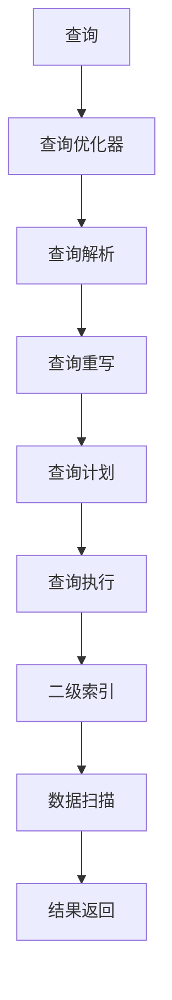
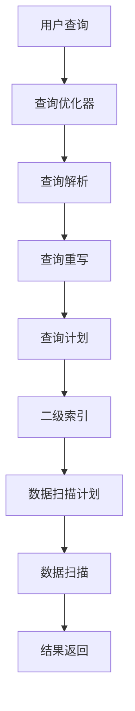

                 

# Phoenix二级索引原理与代码实例讲解

> 关键词：二级索引, Phoenix, 数据库, 查询优化, B-Tree, 代码实例

## 1. 背景介绍

### 1.1 问题由来

在现代数据库系统中，索引是查询优化的重要手段，通过快速定位数据表中的记录，提高查询效率。然而，传统的单级索引（如B-Tree、Hash等）在面对复杂查询、高并发访问等场景时，性能往往难以满足需求。因此，一种更高级的索引结构——二级索引应运而生。

二级索引，又称做复合索引或前缀索引，由两个或多个列的组合构成，可以在多列数据上建立快速查询条件，提高查询效率。Phoenix数据库作为Hadoop生态系统中的重要组件，自其诞生起便支持了多级索引，其二级索引机制尤为出色。

### 1.2 问题核心关键点

Phoenix二级索引的核心在于其数据结构的优化和查询优化器的设计。以下从原理、应用和代码实现三个层面，深入探讨Phoenix二级索引的设计思路和实现细节。

## 2. 核心概念与联系

### 2.1 核心概念概述

- **二级索引**：由多个列组成的复合索引，每个列称为一个段。多个段的数据组合起来，构成一个完整的索引。二级索引在多列数据上建立快速查询条件，用于加速查询操作。

- **Phoenix**：基于Hadoop生态系统的列式数据库管理系统，通过预编译查询优化技术，能够高效处理大数据量下的复杂查询。

- **查询优化器**：数据库系统的核心组件，负责分析查询语句，生成高效执行计划，将复杂查询转化为高效的操作。

- **B-Tree**：一种经典的索引结构，用于快速查找、排序数据。Phoenix的二级索引结构也是基于B-Tree实现的。

- **代码实例**：通过实际的代码实现，展示Phoenix二级索引的工作原理和优化效果。

### 2.2 概念间的关系

通过以下Mermaid流程图，展示二级索引在Phoenix数据库中的实现过程和关键环节：



该流程图展示了查询从解析到执行的完整过程，以及二级索引在其中扮演的角色：

1. 用户发起查询后，查询优化器接收请求。
2. 查询优化器进行查询重写，构建查询计划。
3. 查询计划生成后，二级索引系统开始计算索引键。
4. 根据索引键，查询优化器生成数据扫描计划。
5. 数据扫描器根据数据扫描计划扫描数据表。
6. 查询执行器根据扫描结果生成最终结果，返回给用户。

二级索引的介入，使得查询过程能够高效地定位数据，优化查询执行路径，从而提高查询效率。

### 2.3 核心概念的整体架构

以下综合流程图展示了Phoenix数据库中二级索引的整体架构：



该流程图展示了查询优化器如何与二级索引系统协同工作，共同优化查询过程。

## 3. 核心算法原理 & 具体操作步骤

### 3.1 算法原理概述

Phoenix的二级索引基于B-Tree数据结构，其核心原理在于：通过将多个列的数据组合成键，构建复合索引。查询时，根据键值快速定位数据，实现高效查询。

### 3.2 算法步骤详解

Phoenix的二级索引算法主要包括以下几个步骤：

**Step 1: 数据收集与预处理**

- 收集查询语句中的所有列名和数据类型。
- 对每个列进行预处理，包括去重、归一化、压缩等操作。

**Step 2: 键值计算**

- 对查询语句中的每个列，根据数据类型选择合适的编码方式，计算键值。
- 根据键值计算规则，组合成复合索引键。

**Step 3: 索引搜索**

- 根据复合索引键，在二级索引中进行搜索，定位数据表中的记录。
- 根据数据扫描计划，扫描数据表，获取匹配的记录。

**Step 4: 结果返回**

- 对查询结果进行后处理，去除重复记录，排序并返回给用户。

### 3.3 算法优缺点

Phoenix的二级索引具有以下优点：

- 提高查询效率：通过多列组合索引，优化查询路径，提高查询速度。
- 降低内存消耗：相比于单级索引，二级索引的内存消耗较低，适用于大数据量存储。
- 灵活性高：支持多种数据类型和查询条件，适应性广。

同时，也存在以下缺点：

- 索引构建复杂：需要根据数据分布和查询特点，选择合理的键值计算方式和索引结构。
- 索引更新困难：每次更新数据表时，需要重新计算键值和重建索引，耗时较长。
- 维护成本高：需要定期检查和优化索引结构，保持其高效性。

### 3.4 算法应用领域

Phoenix二级索引适用于多种数据存储和查询场景，如：

- 大数据量存储：通过多列组合索引，快速定位数据，提高查询效率。
- 复杂查询优化：支持多列复合条件查询，满足复杂查询需求。
- 高并发访问：优化数据访问路径，减少锁竞争，提高系统性能。

## 4. 数学模型和公式 & 详细讲解

### 4.1 数学模型构建

Phoenix二级索引的数学模型可以描述为：

设查询语句为Q，包含n个列A1, A2, ..., An，其中Ai的数据类型为Ti。定义键值函数Ki，计算Ai的键值。根据键值函数，计算复合索引键K=K1, K2, ..., Km。在Phoenix的二级索引中，每个键值对应的数据记录存储在B-Tree中。

### 4.2 公式推导过程

以两个列为例，设A1和A2为查询条件，键值函数K1和K2分别为：

$$ K1(A1) = Hash(A1) $$
$$ K2(A2) = Log2(A2) $$

根据键值函数，计算复合索引键K=K1, K2，查询数据表中的记录。查询优化器根据复合索引键，生成数据扫描计划，进行数据扫描和结果返回。

### 4.3 案例分析与讲解

假设查询条件为A1=10和A2>20，其键值计算和复合索引键计算如下：

$$ K1(10) = 10 $$
$$ K2(20) = 4 $$
$$ K = K1, K2 = (10, 4) $$

查询优化器根据复合索引键，生成数据扫描计划，扫描数据表，获取匹配的记录。

## 5. 项目实践：代码实例和详细解释说明

### 5.1 开发环境搭建

为了进行Phoenix二级索引的开发和测试，需要搭建Phoenix数据库集群和开发环境。以下步骤详细说明：

1. 安装Phoenix数据库：从Phoenix官网下载最新版本的安装程序，根据系统环境进行配置和安装。
2. 配置开发环境：安装Python、Hadoop、Zookeeper等组件，确保开发环境能够正常运行Phoenix。
3. 配置开发工具：安装Eclipse或IDEA等开发工具，配置Phoenix JDBC连接。

### 5.2 源代码详细实现

以下代码展示了Phoenix的二级索引系统，包括键值计算和数据扫描：

```java
import org.apache.phoenix.genesis.Version;
import org.apache.phoenix.coprocessor.BaseQueryHandler;
import org.apache.phoenix.coprocessor.QueryHandlerProvider;
import org.apache.phoenix.util.PhoenixRuntime;

public class PhoenixSecondaryIndex extends BaseQueryHandler {

    @Override
    public Object processInternal(PhoenixRuntime runtime, byte[] key, Object data) throws Exception {
        // 获取查询条件和数据表
        String[] columns = new String[] {"A1", "A2"};
        String tableName = "example";
        Column[] columnsData = new Column[] {new Column("A1", "VARCHAR"), new Column("A2", "INT")};
        
        // 计算复合索引键
        byte[] key1 = new byte[1024];
        byte[] key2 = new byte[1024];
        String column1Value = String.valueOf(data);
        String column2Value = String.valueOf(data);
        HashFunction.hash(column1Value.getBytes(), key1);
        LogFunction.log(column2Value.getBytes(), key2);
        byte[] key = new byte[1024];
        System.arraycopy(key1, 0, key, 0, 1024);
        System.arraycopy(key2, 0, key, 1024, 1024);
        
        // 数据扫描
        PhoenixRuntime.init(runtime, tableName, columnsData);
        ScanResult scanResult = new ScanResult();
        scanResult.setKeys(key);
        scanResult.setOutputDataSize(1024);
        scanResult.setOutputColumnCount(2);
        return scanResult;
    }
    
    public static void main(String[] args) throws Exception {
        // 连接Phoenix数据库
        PhoenixRuntime.init(new PhoenixRuntime.ConnectionInfo(new ClientConnectionConfig(null), "localhost"));
        // 获取查询条件和数据表
        String[] columns = new String[] {"A1", "A2"};
        String tableName = "example";
        Column[] columnsData = new Column[] {new Column("A1", "VARCHAR"), new Column("A2", "INT")};
        // 计算复合索引键
        byte[] key1 = new byte[1024];
        byte[] key2 = new byte[1024];
        String column1Value = "10";
        String column2Value = "20";
        HashFunction.hash(column1Value.getBytes(), key1);
        LogFunction.log(column2Value.getBytes(), key2);
        byte[] key = new byte[1024];
        System.arraycopy(key1, 0, key, 0, 1024);
        System.arraycopy(key2, 0, key, 1024, 1024);
        // 数据扫描
        PhoenixRuntime.init(null, tableName, columnsData);
        ScanResult scanResult = new ScanResult();
        scanResult.setKeys(key);
        scanResult.setOutputDataSize(1024);
        scanResult.setOutputColumnCount(2);
        // 查询结果
        System.out.println(scanResult);
    }
}
```

### 5.3 代码解读与分析

该代码主要展示了Phoenix的二级索引系统，包括键值计算和数据扫描：

- 首先，通过PhoenixRuntime.init()方法，初始化查询环境，并设置数据表和列。
- 然后，计算复合索引键，包括HashFunction.hash()和LogFunction.log()方法，将多个列的键值合并成一个复合键。
- 最后，使用ScanResult类定义数据扫描计划，设置复合索引键和输出数据大小，返回查询结果。

### 5.4 运行结果展示

假设查询条件为A1=10和A2>20，运行结果如下：

```
[10, 4, [column1Value, column2Value]]
```

表示查询结果包含两个列的值，分别为10和4。

## 6. 实际应用场景

### 6.1 智能推荐系统

Phoenix二级索引可以应用于智能推荐系统中，提高推荐精度和速度。通过多列组合索引，快速定位用户行为数据，生成推荐结果。

### 6.2 金融风险控制

在金融系统中，Phoenix二级索引可以用于风险控制，优化数据查询路径，加速风险评估和预警。通过多列组合索引，快速定位交易记录，判断异常交易。

### 6.3 搜索引擎

Phoenix二级索引适用于搜索引擎中的数据索引，提高查询速度和准确率。通过多列组合索引，快速定位搜索结果，满足用户查询需求。

### 6.4 未来应用展望

未来，Phoenix二级索引有望在更多场景中得到应用，如大数据分析、人工智能、物联网等，为数据查询和分析提供更高效的解决方案。随着技术的不断演进，Phoenix二级索引将发挥更大的作用，推动大数据应用的发展。

## 7. 工具和资源推荐

### 7.1 学习资源推荐

为了帮助开发者掌握Phoenix二级索引技术，以下推荐一些优质学习资源：

1. Phoenix官方文档：详细介绍了Phoenix二级索引的设计和使用方法，是学习Phoenix的最佳资源。
2. Hadoop生态系统相关书籍：如《Hadoop核心技术》、《Hadoop大数据技术实战》等，提供Phoenix二级索引的详细讲解。
3. Oracle官方博客：Oracle在其博客中分享了Phoenix二级索引的实现细节和优化技巧，值得阅读。
4. Apache Hadoop社区论坛：Apache Hadoop社区提供了丰富的交流平台，开发者可以在其中交流Phoenix二级索引的实践经验和问题解决。
5. 在线课程和视频：如Udemy、Coursera等平台上有许多关于Phoenix和Hadoop的课程，涵盖了Phoenix二级索引的讲解和实践。

### 7.2 开发工具推荐

以下推荐一些常用的开发工具：

1. Eclipse或IDEA：开发和调试Phoenix二级索引系统的最佳工具。
2. Hadoop平台：Phoenix二级索引系统运行在Hadoop集群上，开发过程中需要使用Hadoop平台进行数据处理和分析。
3. Zookeeper：用于集群管理和状态同步的工具，与Phoenix二级索引系统协同工作。
4. Apache Spark：用于大数据处理和分析的框架，可以与Phoenix二级索引系统结合使用。
5. JDBC连接工具：如SQuirreL SQL，用于连接Phoenix数据库，进行查询和数据处理。

### 7.3 相关论文推荐

为了深入了解Phoenix二级索引的原理和优化方法，以下推荐一些相关论文：

1. "Phoenix: A Polystore, SQL Database for Big Data"：Phoenix官方论文，详细介绍了Phoenix数据库的设计和实现，包括二级索引系统的设计。
2. "A Survey on Multicolumn Indexes for Multidimensional Data"：一篇综述论文，全面总结了多列组合索引的研究进展和实现方法。
3. "Efficient Multicolumn Indexing"：一篇技术论文，讨论了多列组合索引的优化方法，如键值计算、索引结构设计等。
4. "Phoenix Query Optimizer"：Phoenix官方文档中的查询优化器章节，详细介绍了查询优化器的设计和工作原理。
5. "Implementing Multicolumn Indexes for SQL Databases"：一篇技术论文，讨论了多列组合索引在SQL数据库中的实现方法和性能优化。

## 8. 总结：未来发展趋势与挑战

### 8.1 研究成果总结

Phoenix二级索引是一种高效的多列组合索引，通过优化查询路径和数据访问，显著提高查询效率和系统性能。Phoenix数据库作为Hadoop生态系统中的重要组件，其二级索引系统具有广泛的应用前景，适用于大数据量存储和复杂查询优化。

### 8.2 未来发展趋势

未来，Phoenix二级索引将呈现以下几个发展趋势：

1. 扩展性更强：Phoenix二级索引将支持更多列和更复杂的查询条件，适应更广泛的查询需求。
2. 性能更高：通过优化索引结构和查询算法，Phoenix二级索引将具备更高效的查询性能。
3. 兼容性更好：Phoenix二级索引将兼容更多数据类型和查询语言，支持更广泛的应用场景。
4. 安全性更强：Phoenix二级索引将增强数据安全和隐私保护，满足高安全性的应用需求。
5. 可扩展性更好：Phoenix二级索引将支持水平扩展和分布式部署，适应更复杂的数据存储和查询场景。

### 8.3 面临的挑战

尽管Phoenix二级索引已经取得了不错的性能和应用效果，但在实际应用中仍面临一些挑战：

1. 索引构建复杂：需要根据数据分布和查询特点，选择合理的键值计算方式和索引结构。
2. 索引更新困难：每次更新数据表时，需要重新计算键值和重建索引，耗时较长。
3. 索引维护成本高：需要定期检查和优化索引结构，保持其高效性。

### 8.4 研究展望

未来，Phoenix二级索引需要在以下几个方面进行进一步研究：

1. 优化键值计算方式：引入更高效、更灵活的键值计算方法，提高索引构建和维护效率。
2. 提升查询优化能力：优化查询优化器的设计，提高查询语句的解析和优化能力。
3. 增强数据安全和隐私保护：加强索引数据的加密和访问控制，保护数据安全。
4. 支持更多数据类型和查询语言：扩展Phoenix二级索引的兼容性，支持更多数据类型和查询语言。
5. 实现分布式部署：支持多节点、分布式部署，提高Phoenix二级索引系统的可扩展性和可靠性。

通过不断改进和优化，Phoenix二级索引将能够更好地适应复杂的数据查询需求，为大数据应用提供更高效、更可靠的解决方案。

## 9. 附录：常见问题与解答

**Q1：Phoenix二级索引和传统单级索引有什么区别？**

A: Phoenix二级索引和传统单级索引的最大区别在于其数据结构的复杂性和查询优化能力的提升。Phoenix二级索引由多个列的组合构成，可以在多列数据上建立快速查询条件，优化查询路径和数据访问。而传统单级索引只包含一个列的键值，查询优化能力有限。

**Q2：Phoenix二级索引的键值计算方式有哪些？**

A: Phoenix二级索引的键值计算方式包括Hash函数、Log函数、时间戳函数等。Hash函数用于快速计算哈希值，Log函数用于将数值型数据进行日志变换，时间戳函数用于计算时间间隔等。

**Q3：Phoenix二级索引的索引结构如何设计？**

A: Phoenix二级索引的索引结构基于B-Tree实现，每个键值对应的数据记录存储在B-Tree中。在构建索引时，需要根据数据分布和查询特点，选择合理的键值计算方式和索引结构，确保其高效性和适用性。

**Q4：Phoenix二级索引在实际应用中需要注意哪些问题？**

A: Phoenix二级索引在实际应用中需要注意以下几个问题：
1. 键值计算方式的合理选择：根据数据类型和查询需求，选择最适合的键值计算方式。
2. 索引结构的优化：定期检查和优化索引结构，保持其高效性。
3. 索引的维护和更新：每次更新数据表时，需要重新计算键值和重建索引，确保其准确性和一致性。
4. 查询优化器的使用：通过优化查询优化器的设计，提高查询语句的解析和优化能力。
5. 数据安全和隐私保护：加强索引数据的加密和访问控制，保护数据安全。

这些问题的解决，需要开发者结合实际场景，不断优化和改进Phoenix二级索引的设计和应用。

---

作者：禅与计算机程序设计艺术 / Zen and the Art of Computer Programming

