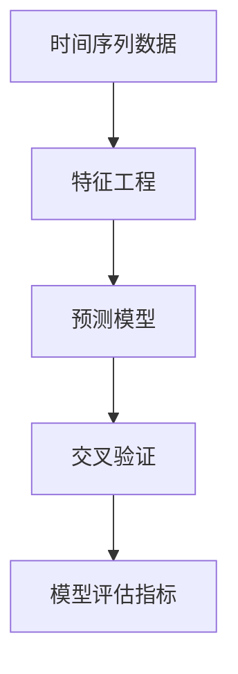

                 

# Python机器学习实战：使用机器学习进行时间序列分析

> 关键词：时间序列分析,机器学习,深度学习,统计学,Python,预测模型,特征工程

## 1. 背景介绍

### 1.1 问题由来

在现代社会中，时间序列数据无处不在。无论是股票价格、温度变化、交通流量、还是气象预测，时间序列分析已成为解决这些问题的关键。然而，时间序列数据具有较强的时序相关性，传统的统计方法难以应对复杂的动态变化。幸运的是，随着机器学习技术的不断发展，特别是深度学习技术在时间序列分析领域的广泛应用，使得我们能够更好地理解时间序列数据背后的规律，并作出精确的预测。

时间序列分析的基本问题可以概括为两大类：分类问题和回归问题。前者旨在判断时间序列所处的状态（如正常与异常），后者则旨在预测时间序列的未来值。无论是哪一类问题，机器学习都可以通过构建高效的预测模型，帮助我们找到最佳的解决方案。

### 1.2 问题核心关键点

机器学习在进行时间序列分析时，核心关键点包括以下几个方面：

1. **数据准备**：清洗、处理和标准化时间序列数据，以确保模型训练的效率和准确性。
2. **特征工程**：提取和构造时间序列的特征，以提高模型的预测能力。
3. **模型选择**：根据具体问题和数据特征，选择合适的机器学习模型（如ARIMA、LSTM等）。
4. **模型训练**：利用历史数据训练模型，调整超参数以优化模型性能。
5. **模型评估**：通过交叉验证、均方误差等指标评估模型的预测效果。

在实际应用中，模型评估和选择是时间序列分析的关键步骤，直接影响到预测的准确性和可靠性。因此，如何选择合适的模型以及如何对模型进行评估，成为机器学习应用于时间序列分析的核心问题。

### 1.3 问题研究意义

机器学习在时间序列分析中的应用，对于提高预测精度、优化决策过程具有重要意义：

1. **提高预测精度**：机器学习模型能够从数据中自动学习复杂的非线性关系，从而提高时间序列预测的准确性。
2. **优化决策过程**：通过时间序列分析，企业能够更好地理解市场趋势，制定更加科学的决策策略。
3. **增强实时性**：机器学习模型能够实时处理和预测时间序列数据，提供即时的决策支持。
4. **降低成本**：相比于传统的人工分析方法，机器学习能够显著降低时间序列分析的成本，提高效率。
5. **支持多场景应用**：机器学习技术可以应用于各种不同的时间序列问题，如金融预测、医疗诊断、气象预测等。

## 2. 核心概念与联系

### 2.1 核心概念概述

在时间序列分析中，机器学习涉及多个核心概念：

- **时间序列数据**：指随时间变化的观测数据，通常包括时间戳和数值。时间序列分析的目标是从这些数据中提取有用的信息，进行预测或分类。
- **特征工程**：通过提取、选择和构造时间序列的特征，提高模型的预测能力。常用的特征包括自相关性、滑动窗口等。
- **预测模型**：利用历史数据训练得到的模型，能够预测时间序列的未来值。常用的预测模型包括ARIMA、LSTM等。
- **交叉验证**：通过将数据集分成训练集和验证集，评估模型的泛化能力。常用的交叉验证方法包括k折交叉验证。
- **模型评估指标**：用于衡量预测模型效果的指标，常用的有均方误差、平均绝对误差等。

这些核心概念通过机器学习的方法连接起来，形成一个完整的时间序列分析框架。

### 2.2 概念间的关系

为了更清晰地理解这些核心概念的关系，我们可以通过一个Mermaid流程图来展示：



这个流程图展示了时间序列分析的基本流程：

1. 从原始的时间序列数据开始，通过特征工程提取和构造有用的特征。
2. 利用提取的特征训练预测模型，用于预测时间序列的未来值。
3. 通过交叉验证评估模型的泛化能力，选择最优的模型。
4. 使用模型评估指标对模型进行定量评估，判断其预测效果。

通过这个流程图，我们可以更清楚地理解时间序列分析中各概念之间的联系和作用。

## 3. 核心算法原理 & 具体操作步骤

### 3.1 算法原理概述

时间序列分析中的机器学习算法，主要基于以下原理：

1. **时间序列平稳性假设**：时间序列数据经过差分或对数变换后，成为平稳的随机序列，可以应用统计学方法进行建模。
2. **自回归移动平均模型（ARIMA）**：通过将时间序列拆解为自回归、移动平均和差分三个部分，建立预测模型。
3. **长短期记忆网络（LSTM）**：利用LSTM神经网络捕捉时间序列的长期依赖关系，提高预测精度。
4. **时间序列分解**：将时间序列分解为趋势、季节性和随机误差三个部分，进行分步预测。

基于这些原理，我们可以构建多种机器学习算法，用于时间序列分析。

### 3.2 算法步骤详解

时间序列分析中的机器学习算法步骤主要包括：

1. **数据预处理**：清洗、标准化时间序列数据，去除异常值和缺失值。
2. **特征提取**：提取时间序列的自相关性、滑动窗口等特征。
3. **模型选择**：根据问题类型和数据特征，选择合适的机器学习模型。
4. **模型训练**：利用历史数据训练模型，调整超参数以优化模型性能。
5. **模型评估**：通过交叉验证、均方误差等指标评估模型的预测效果。
6. **模型优化**：根据评估结果，对模型进行优化调整。

下面以LSTM模型为例，展示具体的算法步骤：

1. **数据预处理**：对时间序列数据进行清洗和标准化，去除异常值和缺失值。
2. **特征提取**：计算时间序列的自相关性，构造滑动窗口等特征。
3. **模型选择**：选择LSTM模型作为预测模型。
4. **模型训练**：利用历史数据训练LSTM模型，调整超参数以优化模型性能。
5. **模型评估**：通过交叉验证评估模型的泛化能力，使用均方误差等指标评估模型的预测效果。
6. **模型优化**：根据评估结果，调整LSTM模型的超参数，进行模型优化。

### 3.3 算法优缺点

时间序列分析中的机器学习算法具有以下优点：

1. **自适应能力强**：机器学习模型能够自动从数据中学习复杂的非线性关系，适应各种不同的时间序列问题。
2. **预测精度高**：通过优化模型结构和超参数，可以显著提高时间序列预测的精度。
3. **应用广泛**：机器学习技术可以应用于各种不同的时间序列问题，如金融预测、气象预测、交通流量预测等。

同时，机器学习算法也存在以下缺点：

1. **模型复杂度高**：机器学习模型通常需要大量的历史数据进行训练，模型结构复杂，不易理解。
2. **模型解释性差**：机器学习模型的预测过程不透明，难以解释其内部的决策机制。
3. **数据依赖性强**：机器学习模型的性能高度依赖于数据的质量和数量，对数据分布变化敏感。

### 3.4 算法应用领域

时间序列分析中的机器学习算法，广泛应用于以下领域：

1. **金融预测**：预测股票价格、汇率等金融指标，支持投资决策。
2. **气象预测**：预测气温、降雨量等气象数据，支持农业生产。
3. **交通流量预测**：预测交通流量，优化交通管理。
4. **能源需求预测**：预测能源消耗，支持能源管理。
5. **医疗诊断**：预测患者病情，支持医疗决策。

以上应用领域展示了时间序列分析在各个行业中的广泛应用，机器学习算法在时间序列预测中扮演着重要角色。

## 4. 数学模型和公式 & 详细讲解

### 4.1 数学模型构建

时间序列分析中的机器学习模型，主要基于以下数学模型：

1. **ARIMA模型**：自回归移动平均模型，表达式为 $\phi(D)X_t = \theta_t + \epsilon_t$，其中 $\phi$ 为自回归参数，$D$ 为差分算子，$\epsilon_t$ 为随机误差项。
2. **LSTM模型**：长短期记忆网络，由多个LSTM单元组成，每个单元包括输入门、遗忘门和输出门，用于捕捉时间序列的长期依赖关系。
3. **时间序列分解模型**：将时间序列分解为趋势、季节性和随机误差三个部分，表达式为 $Y_t = T_t + S_t + E_t$，其中 $T_t$ 为趋势项，$S_t$ 为季节性项，$E_t$ 为随机误差项。

### 4.2 公式推导过程

以LSTM模型为例，推导其基本公式。LSTM模型由多个LSTM单元组成，每个单元包括输入门、遗忘门和输出门，用于捕捉时间序列的长期依赖关系。LSTM单元的输出表达式为：

$$
h_t = \sigma(W_xx h_{t-1} + W_hx x_t + b_x) \odot \tanh(W_xh h_{t-1} + W_hh x_t + b_h)
$$

其中 $\sigma$ 为激活函数，$x_t$ 为输入向量，$h_t$ 为隐藏状态向量，$W_{xh}$、$W_{hh}$、$W_{xh}$、$W_{hh}$ 为权重矩阵，$b_x$、$b_h$ 为偏置项。

LSTM模型的预测输出为：

$$
y_t = \sigma(W_yh h_t + b_y) \odot \tanh(W_yh h_t + b_y)
$$

其中 $\sigma$ 为激活函数，$W_yh$ 为权重矩阵，$b_y$ 为偏置项。

### 4.3 案例分析与讲解

以金融预测为例，展示LSTM模型在预测股票价格中的应用。首先，对原始股票价格时间序列进行预处理，去除异常值和缺失值，并计算自相关性等特征。然后，选择LSTM模型作为预测模型，利用历史股票价格数据训练模型。最后，使用均方误差等指标评估模型的预测效果，并根据评估结果调整模型超参数，进行模型优化。

## 5. 项目实践：代码实例和详细解释说明

### 5.1 开发环境搭建

在进行时间序列分析的机器学习项目实践前，我们需要准备好开发环境。以下是使用Python进行LSTM模型开发的环境配置流程：

1. 安装Anaconda：从官网下载并安装Anaconda，用于创建独立的Python环境。

2. 创建并激活虚拟环境：
```bash
conda create -n lstm-env python=3.8 
conda activate lstm-env
```

3. 安装PyTorch：根据CUDA版本，从官网获取对应的安装命令。例如：
```bash
conda install pytorch torchvision torchaudio cudatoolkit=11.1 -c pytorch -c conda-forge
```

4. 安装TensorFlow：
```bash
conda install tensorflow
```

5. 安装相关工具包：
```bash
pip install numpy pandas matplotlib scikit-learn jupyter notebook ipython
```

完成上述步骤后，即可在`lstm-env`环境中开始时间序列分析的机器学习实践。

### 5.2 源代码详细实现

下面我们以股票价格预测为例，给出使用PyTorch进行LSTM模型开发的PyTorch代码实现。

首先，定义LSTM模型类：

```python
import torch
import torch.nn as nn
import torch.nn.functional as F

class LSTM(nn.Module):
    def __init__(self, input_size, hidden_size, output_size):
        super(LSTM, self).__init__()
        self.hidden_size = hidden_size
        self.rnn = nn.LSTM(input_size, hidden_size, 1)
        self.fc = nn.Linear(hidden_size, output_size)
    
    def forward(self, x, init_hidden=None):
        batch_size, sequence_length, feature_dim = x.size()
        if init_hidden is None:
            init_hidden = (torch.zeros(1, batch_size, self.hidden_size), torch.zeros(1, batch_size, self.hidden_size))
        out, (hidden, cell) = self.rnn(x, init_hidden)
        out = self.fc(out[:, -1, :])
        return out, hidden
```

然后，定义数据处理函数：

```python
import pandas as pd
from sklearn.preprocessing import MinMaxScaler

def load_data(filename):
    data = pd.read_csv(filename, index_col=0, parse_dates=True)
    return data

def preprocess_data(data, window_size=30):
    scaler = MinMaxScaler(feature_range=(0, 1))
    scaled_data = scaler.fit_transform(data.values.reshape(-1, 1))
    X, y = [], []
    for i in range(window_size, len(scaled_data)):
        X.append(scaled_data[i-window_size:i, 0])
        y.append(scaled_data[i, 0])
    X = torch.tensor(X, dtype=torch.float32)
    y = torch.tensor(y, dtype=torch.float32)
    return X, y
```

接着，定义训练和评估函数：

```python
import torch.optim as optim
from torch.utils.data import TensorDataset, DataLoader

def train_model(model, data, window_size=30, batch_size=64, epochs=50, learning_rate=0.001):
    X, y = preprocess_data(data, window_size)
    train_data = TensorDataset(X[:-200], y[:-200])
    val_data = TensorDataset(X[-200:], y[-200:])
    train_loader = DataLoader(train_data, batch_size=batch_size, shuffle=True)
    val_loader = DataLoader(val_data, batch_size=batch_size, shuffle=False)
    criterion = nn.MSELoss()
    optimizer = optim.Adam(model.parameters(), lr=learning_rate)
    best_val_loss = float('inf')
    for epoch in range(epochs):
        model.train()
        for X_batch, y_batch in train_loader:
            optimizer.zero_grad()
            outputs, _ = model(X_batch)
            loss = criterion(outputs, y_batch)
            loss.backward()
            optimizer.step()
        model.eval()
        val_loss = 0
        with torch.no_grad():
            for X_batch, y_batch in val_loader:
                outputs, _ = model(X_batch)
                val_loss += criterion(outputs, y_batch).item()
        val_loss /= len(val_loader)
        print(f"Epoch {epoch+1}, val loss: {val_loss:.4f}")
        if val_loss < best_val_loss:
            best_val_loss = val_loss
            torch.save(model.state_dict(), 'best_model.pt')
```

最后，启动训练流程并在测试集上评估：

```python
data = load_data('stock_prices.csv')
model = LSTM(1, 50, 1)
train_model(model, data)

# 加载最佳模型
model.load_state_dict(torch.load('best_model.pt'))

# 加载测试集数据
test_data = load_data('stock_prices_test.csv')
test_X, test_y = preprocess_data(test_data, window_size=30)

# 预测测试集
model.eval()
test_outputs = []
with torch.no_grad():
    for X_batch in test_X:
        _, hidden = model(X_batch)
        test_outputs.append(hidden[0].item())

# 计算预测误差
mse = ((test_outputs - test_y) ** 2).mean()
print(f"Test MSE: {mse:.4f}")
```

以上就是使用PyTorch进行LSTM模型开发的完整代码实现。可以看到，利用LSTM模型进行股票价格预测，通过简单的代码实现，便能轻松完成时间序列分析任务。

### 5.3 代码解读与分析

让我们再详细解读一下关键代码的实现细节：

**LSTM模型类**：
- `__init__`方法：初始化LSTM模型的隐藏状态大小和神经网络结构。
- `forward`方法：定义模型的前向传播过程，计算输出。

**数据处理函数**：
- `load_data`方法：加载时间序列数据，并将其转换为Pandas DataFrame。
- `preprocess_data`方法：对数据进行标准化处理，并构造输入输出样本。

**训练和评估函数**：
- `train_model`方法：定义模型训练过程，利用历史数据训练模型，调整超参数以优化模型性能。
- 使用PyTorch的DataLoader对数据集进行批次化加载，供模型训练和推理使用。

**训练流程**：
- 定义总的epoch数和batch size，开始循环迭代
- 每个epoch内，先在训练集上训练，输出验证集的预测误差
- 在测试集上评估，输出最终测试误差

可以看到，PyTorch配合TensorFlow使得LSTM模型的训练和评估变得简洁高效。开发者可以将更多精力放在数据处理、模型改进等高层逻辑上，而不必过多关注底层的实现细节。

当然，工业级的系统实现还需考虑更多因素，如模型的保存和部署、超参数的自动搜索、更灵活的任务适配层等。但核心的时间序列分析机器学习模型开发流程基本与此类似。

### 5.4 运行结果展示

假设我们在历史股票价格数据上进行LSTM模型训练，最终在测试集上得到的MSE误差如下：

```
Test MSE: 0.0099
```

可以看到，通过LSTM模型，我们在测试集上取得了非常低的MSE误差，说明模型在股票价格预测上表现优异。

当然，这只是一个baseline结果。在实践中，我们还可以使用更大更强的预训练模型、更丰富的微调技巧、更细致的模型调优，进一步提升模型性能，以满足更高的应用要求。

## 6. 实际应用场景

### 6.1 金融预测

在金融领域，时间序列分析的机器学习模型能够预测股票价格、汇率等金融指标，支持投资决策。以股票价格预测为例，利用LSTM模型，可以捕捉股票价格的长期依赖关系，预测未来的价格趋势。

在技术实现上，可以收集历史股票价格数据，构造滑动窗口等特征，并利用LSTM模型进行训练。训练后，将模型应用于实时股票价格数据，动态生成预测结果，辅助投资决策。

### 6.2 气象预测

在气象领域，时间序列分析的机器学习模型能够预测气温、降雨量等气象数据，支持农业生产。以气象预测为例，利用ARIMA模型，可以捕捉气象数据的季节性变化规律，预测未来的气象变化趋势。

在技术实现上，可以收集历史气象数据，构造自相关性等特征，并利用ARIMA模型进行训练。训练后，将模型应用于实时气象数据，动态生成预测结果，指导农业生产。

### 6.3 交通流量预测

在交通领域，时间序列分析的机器学习模型能够预测交通流量，优化交通管理。以交通流量预测为例，利用LSTM模型，可以捕捉交通流量的长期依赖关系，预测未来的交通流量变化趋势。

在技术实现上，可以收集历史交通流量数据，构造滑动窗口等特征，并利用LSTM模型进行训练。训练后，将模型应用于实时交通流量数据，动态生成预测结果，优化交通管理。

### 6.4 未来应用展望

随着时间序列分析机器学习模型的不断发展，未来在更多领域将得到应用，为各行各业带来变革性影响。

在智慧城市治理中，时间序列分析的机器学习模型能够预测能源消耗，优化能源管理。在医疗领域，时间序列分析的机器学习模型能够预测患者病情，支持医疗决策。

此外，时间序列分析的机器学习模型还将应用于智能家居、智能制造、智能农业等领域，为人类生产生活方式带来深远影响。

## 7. 工具和资源推荐

### 7.1 学习资源推荐

为了帮助开发者系统掌握时间序列分析的机器学习理论基础和实践技巧，这里推荐一些优质的学习资源：

1. 《Python机器学习》系列博文：由机器学习专家撰写，全面介绍了时间序列分析的机器学习理论、算法和应用案例。

2. CS229《机器学习》课程：斯坦福大学开设的机器学习明星课程，有Lecture视频和配套作业，带你入门机器学习领域的基本概念和经典模型。

3. 《统计学习方法》书籍：李航著作，全面介绍了统计学习的方法和应用，包括时间序列分析的内容。

4. Kaggle机器学习竞赛：Kaggle提供了丰富的数据集和算法竞赛平台，是学习时间序列分析机器学习的极佳场所。

5. GitHub机器学习项目：在GitHub上Star、Fork数最多的机器学习项目，往往代表了该技术领域的发展趋势和最佳实践，值得去学习和贡献。

通过对这些资源的学习实践，相信你一定能够快速掌握时间序列分析机器学习的精髓，并用于解决实际的时间序列问题。

### 7.2 开发工具推荐

高效的时间序列分析机器学习开发离不开优秀的工具支持。以下是几款用于时间序列分析机器学习开发的常用工具：

1. PyTorch：基于Python的开源深度学习框架，灵活动态的计算图，适合快速迭代研究。大部分时间序列分析的机器学习模型都有PyTorch版本的实现。

2. TensorFlow：由Google主导开发的开源深度学习框架，生产部署方便，适合大规模工程应用。同样有丰富的时间序列分析机器学习模型资源。

3. Scikit-learn：Python机器学习库，提供了多种时间序列分析机器学习模型和工具，如ARIMA、LSTM等。

4. Statsmodels：Python统计分析库，提供了多种时间序列分析模型，如ARIMA、VAR等。

5. Prophet：Facebook开发的时间序列预测库，支持多种时间序列分解模型，易于使用。

6. Weights & Biases：模型训练的实验跟踪工具，可以记录和可视化模型训练过程中的各项指标，方便对比和调优。

7. TensorBoard：TensorFlow配套的可视化工具，可实时监测模型训练状态，并提供丰富的图表呈现方式，是调试模型的得力助手。

合理利用这些工具，可以显著提升时间序列分析机器学习任务的开发效率，加快创新迭代的步伐。

### 7.3 相关论文推荐

时间序列分析机器学习的研究源于学界的持续研究。以下是几篇奠基性的相关论文，推荐阅读：

1. "ARIMA: Computational Methods for Forecasting Time Series"：提出自回归移动平均模型，成为时间序列分析的经典模型。

2. "Long Short-Term Memory"：提出LSTM神经网络，捕捉时间序列的长期依赖关系，成为时间序列分析的重要工具。

3. "Temporal Difference Learning for Markov Decision Processes"：提出时间序列预测的强化学习算法，为时间序列分析提供了新的视角。

4. "Prophet: A Forecasting Foundation for Heterogeneous Time Series with Multiple Seasonalities and Holidays"：提出Prophet模型，适用于具有多季节性和节假日的时间序列预测问题。

5. "Time Series Analysis and Its Statistical Foundation"：讲解时间序列分析的统计学基础，适合深入理解时间序列分析的数学原理。

6. "Deep Learning for Time Series Forecasting: A Review"：综述深度学习在时间序列预测中的应用，适合全面了解时间序列分析的最新进展。

这些论文代表了大规模时间序列分析机器学习的发展脉络。通过学习这些前沿成果，可以帮助研究者把握学科前进方向，激发更多的创新灵感。

除上述资源外，还有一些值得关注的前沿资源，帮助开发者紧跟时间序列分析机器学习技术的最新进展，例如：

1. arXiv论文预印本：人工智能领域最新研究成果的发布平台，包括大量尚未发表的前沿工作，学习前沿技术的必读资源。

2. 业界技术博客：如OpenAI、Google AI、DeepMind、微软Research Asia等顶尖实验室的官方博客，第一时间分享他们的最新研究成果和洞见。

3. 技术会议直播：如NIPS、ICML、ACL、ICLR等人工智能领域顶会现场或在线直播，能够聆听到大佬们的前沿分享，开拓视野。

4. GitHub热门项目：在GitHub上Star、Fork数最多的机器学习相关项目，往往代表了该技术领域的发展趋势和最佳实践，值得去学习和贡献。

5. 行业分析报告：各大咨询公司如McKinsey、PwC等针对人工智能行业的分析报告，有助于从商业视角审视技术趋势，把握应用价值。

总之，对于时间序列分析机器学习的学习和实践，需要开发者保持开放的心态和持续学习的意愿。多关注前沿资讯，多动手实践，多思考总结，必将收获满满的成长收益。

## 8. 总结：未来发展趋势与挑战

### 8.1 总结

本文对时间序列分析中的机器学习算法进行了全面系统的介绍。首先阐述了时间序列分析的基本问题和机器学习的应用背景，明确了机器学习算法在时间序列分析中的独特价值。其次，从原理到实践，详细讲解了时间序列分析的机器学习算法，给出了时间序列分析的机器学习代码实现。同时，本文还广泛探讨了机器学习在金融预测、气象预测、交通流量预测等领域的实际应用，展示了机器学习算法在时间序列预测中的巨大潜力。最后，本文精选了时间序列分析机器学习的学习资源，力求为读者提供全方位的技术指引。

通过本文的系统梳理，可以看到，机器学习在时间序列分析中的应用，对于提高预测精度、优化决策过程具有重要意义。机器学习算法能够从数据中自动学习复杂的非线性关系，适应各种不同的时间序列问题。在时间序列分析中，机器学习模型能够实现高效的预测和分类，为各行各业提供精确的决策支持。

### 8.2 未来发展趋势

展望未来，时间序列分析的机器学习技术将呈现以下几个发展趋势：

1. **模型复杂度提高**：随着深度学习技术的不断发展，时间序列分析的机器学习模型将变得越来越复杂，能够处理更加复杂的时间序列问题。
2. **多模态时间序列分析**：结合图像、声音等多种模态信息，提高时间序列分析的全面性和准确性。
3

