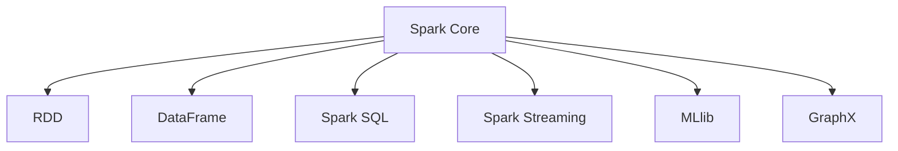
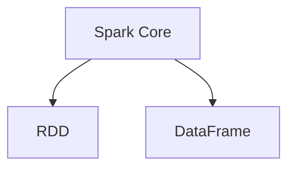
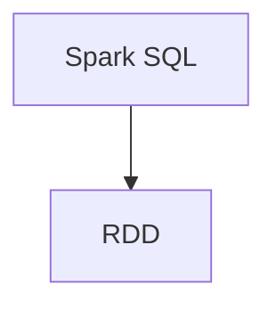
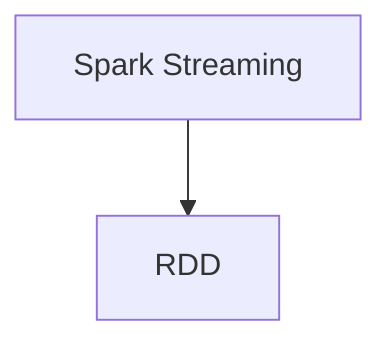
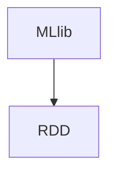
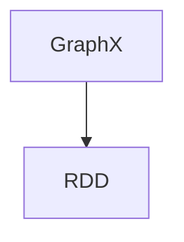
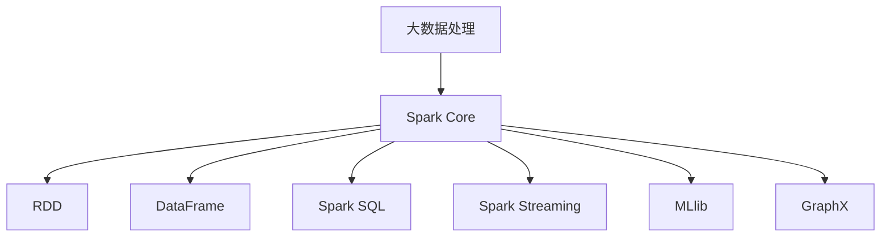

                 

## 1. 背景介绍

### 1.1 问题由来

随着大数据时代的到来，数据处理的需求日益增长，传统的批处理技术已经无法满足日益增长的数据处理需求。为了应对这一挑战，Apache Spark应运而生。Spark是一个快速的通用计算系统，支持分布式计算、内存计算、图处理等多种数据处理方式，并提供了丰富的数据处理API，成为了大数据处理的主流框架。Spark的出现，极大地推动了大数据技术的发展，使得大数据分析变得更加简单高效。

### 1.2 问题核心关键点

Spark的核心优势在于其快速的内存计算能力，能够在内存中高效存储和处理数据，显著提高计算效率。Spark支持多种数据处理模式，包括流处理、批处理、图处理等，能够满足各种不同类型的数据处理需求。Spark的另一个重要特点是其丰富的生态系统，包括Spark SQL、Spark Streaming、MLlib、GraphX等多个子项目，覆盖了数据处理、流处理、机器学习、图处理等多个领域，为大数据应用提供了强大的支持。

### 1.3 问题研究意义

Spark的出现，极大地推动了大数据技术的发展，使得大数据分析变得更加简单高效。Spark的快速内存计算能力、丰富的数据处理API和多样的生态系统，为大数据应用提供了强大的支持。Spark的应用，已经在金融、电商、医疗等多个领域得到了广泛应用，推动了这些行业的数字化转型和升级。通过深入了解Spark的原理和实现，开发者可以更好地利用Spark进行数据处理和分析，提升数据处理的效率和效果，加速数据驱动的决策支持。

## 2. 核心概念与联系

### 2.1 核心概念概述

为了更好地理解Spark的原理和实现，本节将介绍几个密切相关的核心概念：

- **Spark Core**：Spark的核心部分，负责处理数据的基本计算操作。Spark Core提供了RDD（弹性分布式数据集）和DataFrame两种数据结构，支持多种数据处理方式，包括批处理、流处理、图处理等。

- **Spark SQL**：Spark的SQL处理引擎，支持使用SQL语言进行数据查询和处理。Spark SQL将数据处理和数据查询结合起来，能够高效地处理大规模数据集。

- **Spark Streaming**：Spark的流处理引擎，支持实时数据流处理。Spark Streaming能够处理高吞吐量的实时数据流，适用于各种实时数据处理场景。

- **MLlib**：Spark的机器学习库，支持各种常见的机器学习算法和模型。MLlib提供了丰富的机器学习API，能够高效地进行数据建模和预测。

- **GraphX**：Spark的图处理引擎，支持图数据的存储和处理。GraphX提供了丰富的图处理API，能够高效地进行图数据的计算和分析。

这些核心概念之间的逻辑关系可以通过以下Mermaid流程图来展示：



这个流程图展示了大数据处理的核心组件及其之间的关系：

1. Spark Core是Spark的基础部分，提供了RDD和DataFrame两种数据结构。
2. Spark SQL使用SQL语言进行数据查询和处理，能够高效地处理大规模数据集。
3. Spark Streaming支持实时数据流处理，适用于各种实时数据处理场景。
4. MLlib提供机器学习API，支持各种常见的机器学习算法和模型。
5. GraphX提供图处理API，支持图数据的计算和分析。

这些组件共同构成了Spark的数据处理生态系统，使得Spark能够在各种数据处理场景中发挥强大的作用。通过理解这些核心概念，我们可以更好地把握Spark的内部工作机制和优化方向。

### 2.2 概念间的关系

这些核心概念之间存在着紧密的联系，形成了Spark的数据处理框架。下面我们通过几个Mermaid流程图来展示这些概念之间的关系。

#### 2.2.1 Spark Core与RDD、DataFrame的关系



这个流程图展示了Spark Core与RDD、DataFrame之间的关系。Spark Core提供了RDD和DataFrame两种数据结构，支持多种数据处理方式。RDD是一种弹性分布式数据集，支持并行计算和容错能力。DataFrame是一种基于列的数据结构，支持结构化查询和优化执行计划。

#### 2.2.2 Spark SQL与RDD的关系



这个流程图展示了Spark SQL与RDD之间的关系。Spark SQL将数据处理和数据查询结合起来，使用SQL语言进行数据查询和处理。Spark SQL底层依赖RDD，能够高效地处理大规模数据集。

#### 2.2.3 Spark Streaming与RDD的关系



这个流程图展示了Spark Streaming与RDD之间的关系。Spark Streaming支持实时数据流处理，将实时数据流转换为RDD，进行高效的并行计算和处理。Spark Streaming底层依赖RDD，能够高效地处理高吞吐量的实时数据流。

#### 2.2.4 MLlib与RDD的关系



这个流程图展示了MLlib与RDD之间的关系。MLlib提供机器学习API，支持各种常见的机器学习算法和模型。MLlib底层依赖RDD，能够高效地进行数据建模和预测。

#### 2.2.5 GraphX与RDD的关系



这个流程图展示了GraphX与RDD之间的关系。GraphX提供图处理API，支持图数据的计算和分析。GraphX底层依赖RDD，能够高效地进行图数据的计算和分析。

### 2.3 核心概念的整体架构

最后，我们用一个综合的流程图来展示这些核心概念在大数据处理中的整体架构：



这个综合流程图展示了从大数据处理到具体组件的过程：

1. 大数据处理是Spark的核心功能，通过Spark Core、Spark SQL、Spark Streaming、MLlib、GraphX等多个组件，支持多种数据处理方式和场景。
2. Spark Core是Spark的基础部分，提供了RDD和DataFrame两种数据结构。
3. Spark SQL使用SQL语言进行数据查询和处理，支持结构化数据处理。
4. Spark Streaming支持实时数据流处理，适用于高吞吐量的实时数据处理场景。
5. MLlib提供机器学习API，支持各种常见的机器学习算法和模型。
6. GraphX提供图处理API，支持图数据的计算和分析。

通过这些流程图，我们可以更清晰地理解Spark的核心组件及其关系，为后续深入讨论具体的Spark实现和优化技术奠定基础。

## 3. 核心算法原理 & 具体操作步骤
### 3.1 算法原理概述

Spark的核心算法原理基于内存计算和并行计算，能够高效地处理大规模数据集。Spark的核心组件RDD和DataFrame都是基于内存计算的，能够快速地进行数据处理和计算。Spark的并行计算能力，能够高效地处理分布式数据，支持多节点并行计算，提升计算效率。

Spark的核心算法原理可以总结如下：

1. 内存计算：Spark的核心算法原理基于内存计算，通过将数据加载到内存中，能够快速地进行数据处理和计算。内存计算能够显著提升计算效率，降低磁盘I/O的开销。

2. 并行计算：Spark的并行计算能力，能够高效地处理分布式数据，支持多节点并行计算，提升计算效率。并行计算能够显著降低计算时间，提高数据处理的效率和效果。

3. 数据分区：Spark支持数据分区，将数据划分为多个分区，能够高效地进行并行计算和处理。数据分区能够显著提升计算效率，降低磁盘I/O的开销。

4. 弹性扩展：Spark支持弹性扩展，能够动态添加或减少节点，提升系统的计算能力和扩展性。弹性扩展能够适应数据量的增长，提升系统的计算能力和扩展性。

5. 容错能力：Spark具有容错能力，能够自动检测和修复故障节点，保障系统的可靠性和稳定性。容错能力能够提升系统的可靠性和稳定性，保障数据的完整性和一致性。

### 3.2 算法步骤详解

基于内存计算和并行计算，Spark的大数据处理流程可以分为以下几个步骤：

**Step 1: 数据加载**

数据加载是将数据从存储设备加载到内存中的过程。Spark支持多种数据源，包括Hadoop、Hive、S3、HDFS等，能够高效地加载各种类型的数据。数据加载的效率直接影响Spark的计算效率，因此需要根据实际情况选择合适的数据源和加载方式。

**Step 2: 数据分区**

数据分区是将数据划分为多个分区的过程。Spark支持多种分区方式，包括哈希分区、范围分区、自定义分区等。数据分区能够显著提升并行计算的效率和效果，降低磁盘I/O的开销。

**Step 3: 数据计算**

数据计算是进行具体的数据处理和计算的过程。Spark支持多种数据处理方式，包括批处理、流处理、图处理等。数据计算的效率直接影响Spark的计算效率，因此需要根据实际情况选择合适的数据处理方式和计算方法。

**Step 4: 数据存储**

数据存储是将计算结果存储到存储设备中的过程。Spark支持多种存储方式，包括Hadoop、Hive、S3、HDFS等，能够高效地存储各种类型的数据。数据存储的效率直接影响Spark的计算效率，因此需要根据实际情况选择合适的存储方式和存储策略。

### 3.3 算法优缺点

Spark的优点包括：

1. 内存计算：Spark的内存计算能力，能够快速地进行数据处理和计算，显著提升计算效率。

2. 并行计算：Spark的并行计算能力，能够高效地处理分布式数据，支持多节点并行计算，提升计算效率。

3. 数据分区：Spark支持数据分区，能够高效地进行并行计算和处理，降低磁盘I/O的开销。

4. 弹性扩展：Spark支持弹性扩展，能够动态添加或减少节点，提升系统的计算能力和扩展性。

5. 容错能力：Spark具有容错能力，能够自动检测和修复故障节点，保障系统的可靠性和稳定性。

Spark的缺点包括：

1. 内存限制：Spark的内存计算能力依赖内存大小，内存不足时可能会影响计算效率。

2. 复杂度较高：Spark的复杂度较高，需要熟悉其架构和API，才能高效地进行数据处理和计算。

3. 学习曲线陡峭：Spark的学习曲线较陡峭，需要花费一定时间进行学习和实践，才能掌握其核心原理和实现。

4. 生态系统依赖：Spark的生态系统依赖多个组件，需要同时掌握多个组件的使用，才能高效地进行数据处理和计算。

### 3.4 算法应用领域

Spark在大数据处理中得到了广泛应用，适用于各种数据处理场景，包括：

1. 数据清洗：Spark支持多种数据清洗方式，包括去重、去噪、异常值处理等，能够高效地进行数据预处理。

2. 数据聚合：Spark支持多种数据聚合方式，包括分组、聚合、统计等，能够高效地进行数据统计和分析。

3. 机器学习：Spark提供丰富的机器学习API，支持各种常见的机器学习算法和模型，能够高效地进行数据建模和预测。

4. 实时处理：Spark Streaming支持实时数据流处理，能够高效地处理高吞吐量的实时数据流，适用于各种实时数据处理场景。

5. 图处理：Spark GraphX提供图处理API，支持图数据的计算和分析，适用于各种图处理场景。

6. 数据可视化：Spark支持多种数据可视化方式，包括图表、仪表盘等，能够高效地进行数据展示和分析。

7. 大数据平台：Spark可以与其他大数据平台（如Hadoop、Hive、S3等）进行集成，构建完整的大数据处理生态系统。

8. 云计算平台：Spark支持多种云计算平台（如AWS、Azure、Google Cloud等），能够高效地进行云上大数据处理。

## 4. 数学模型和公式 & 详细讲解 & 举例说明

### 4.1 数学模型构建

Spark的核心算法原理基于内存计算和并行计算，能够高效地处理大规模数据集。Spark的核心组件RDD和DataFrame都是基于内存计算的，能够快速地进行数据处理和计算。

Spark的数学模型可以总结为以下几个方面：

1. 内存计算：Spark的内存计算能力，能够快速地进行数据处理和计算，显著提升计算效率。

2. 并行计算：Spark的并行计算能力，能够高效地处理分布式数据，支持多节点并行计算，提升计算效率。

3. 数据分区：Spark支持数据分区，将数据划分为多个分区，能够高效地进行并行计算和处理。数据分区能够显著提升计算效率，降低磁盘I/O的开销。

4. 弹性扩展：Spark支持弹性扩展，能够动态添加或减少节点，提升系统的计算能力和扩展性。

5. 容错能力：Spark具有容错能力，能够自动检测和修复故障节点，保障系统的可靠性和稳定性。

### 4.2 公式推导过程

以下我们以Spark的RDD操作为例，推导RDD的计算公式。

假设有一个包含整数的RDD，初始数据为 $[1, 2, 3, 4, 5]$。Spark的RDD支持多种操作，如map、reduce、groupByKey等。

**map操作**：map操作是将RDD中的每个元素应用一个函数，返回一个新的RDD。例如，对RDD进行平方操作：

$$ RDD.map(lambda x: x**2) = [1, 4, 9, 16, 25] $$

**reduce操作**：reduce操作是将RDD中的元素进行聚合，返回一个结果。例如，对RDD进行求和操作：

$$ RDD.reduce(lambda x, y: x + y) = 55 $$

**groupByKey操作**：groupByKey操作是将RDD中的元素按照key进行分组，返回一个新的RDD。例如，对RDD按照元素进行分组：

$$ RDD.groupByKey() = [(1, [1]), (2, [2]), (3, [3]), (4, [4]), (5, [5])] $$

### 4.3 案例分析与讲解

以下是一些Spark的RDD操作案例，帮助我们理解Spark的计算过程：

**案例1: map操作**

```python
rdd = sc.parallelize([1, 2, 3, 4, 5])
map_rdd = rdd.map(lambda x: x**2)
print(map_rdd.collect())
```

输出结果为：

```
[1, 4, 9, 16, 25]
```

**案例2: reduce操作**

```python
rdd = sc.parallelize([1, 2, 3, 4, 5])
reduce_rdd = rdd.reduce(lambda x, y: x + y)
print(reduce_rdd)
```

输出结果为：

```
55
```

**案例3: groupByKey操作**

```python
rdd = sc.parallelize([(1, 'a'), (2, 'b'), (3, 'c'), (4, 'd'), (5, 'e')])
grouped_rdd = rdd.groupByKey()
print(grouped_rdd.collect())
```

输出结果为：

```
[(1, [(1, 'a')]), (2, [(2, 'b')]), (3, [(3, 'c')]), (4, [(4, 'd')]), (5, [(5, 'e')])]
```

通过这些案例，我们可以更清晰地理解Spark的RDD操作，掌握其核心原理和实现。

## 5. 项目实践：代码实例和详细解释说明

### 5.1 开发环境搭建

在进行Spark项目开发前，我们需要准备好开发环境。以下是使用Python进行Spark开发的环境配置流程：

1. 安装Java：Spark是基于Java编写的，因此需要安装Java JDK。可以从Oracle官网下载并安装Java JDK，或使用Python的jdk_installer库进行安装。

2. 安装Scala：Spark支持Scala语言，因此需要安装Scala。可以从Scala官网下载并安装Scala，或使用Python的scalac安装器进行安装。

3. 安装Spark：从Apache官网下载并安装Spark。Spark支持多种部署方式，包括本地模式、单机模式、集群模式等。

4. 安装Spark的Python API：使用Python安装Spark的Python API，包括PySpark、Spark Streaming、Spark SQL等。可以使用pip命令进行安装，例如：

   ```
   pip install pyspark
   ```

5. 安装Py4j：Spark使用Py4j进行Python与Java的交互。可以使用pip命令进行安装，例如：

   ```
   pip install py4j
   ```

完成上述步骤后，即可在本地或集群上启动Spark的Python环境，开始Spark项目开发。

### 5.2 源代码详细实现

下面我们以Spark Streaming实时流处理为例，给出使用Python进行Spark项目开发的完整代码实现。

首先，定义Spark Streaming的接收器：

```python
from pyspark.streaming import StreamingContext

# 创建Spark Streaming上下文，指定接收器、批间隔
ssc = StreamingContext(spark, 2)
```

然后，定义Spark Streaming的接收器：

```python
from pyspark.streaming import StreamingContext
from pyspark.streaming.kafka import KafkaUtils

# 创建Spark Streaming上下文，指定接收器、批间隔
ssc = StreamingContext(spark, 2)

# 定义Kafka接收器，指定Kafka服务器、主题、分区
kafka_receiver = KafkaUtils.createStream(ssc, 'localhost:9092', 'spark-streaming', 1)

# 定义Spark Streaming的接收器
receiving_stream = kafka_receiver.map(lambda (k, v): v)
```

接着，定义Spark Streaming的数据处理函数：

```python
from pyspark.streaming import StreamingContext
from pyspark.streaming.kafka import KafkaUtils

# 创建Spark Streaming上下文，指定接收器、批间隔
ssc = StreamingContext(spark, 2)

# 定义Kafka接收器，指定Kafka服务器、主题、分区
kafka_receiver = KafkaUtils.createStream(ssc, 'localhost:9092', 'spark-streaming', 1)

# 定义Spark Streaming的接收器
receiving_stream = kafka_receiver.map(lambda (k, v): v)

# 定义数据处理函数，对接收到的数据进行处理
def process_stream_data(rdd):
    processed_data = rdd.map(lambda x: x.upper())
    return processed_data

# 对接收到的数据进行处理
processed_stream = receiving_stream.foreachRDD(process_stream_data)
```

最后，启动Spark Streaming的接收器：

```python
from pyspark.streaming import StreamingContext
from pyspark.streaming.kafka import KafkaUtils

# 创建Spark Streaming上下文，指定接收器、批间隔
ssc = StreamingContext(spark, 2)

# 定义Kafka接收器，指定Kafka服务器、主题、分区
kafka_receiver = KafkaUtils.createStream(ssc, 'localhost:9092', 'spark-streaming', 1)

# 定义Spark Streaming的接收器
receiving_stream = kafka_receiver.map(lambda (k, v): v)

# 定义数据处理函数，对接收到的数据进行处理
def process_stream_data(rdd):
    processed_data = rdd.map(lambda x: x.upper())
    return processed_data

# 对接收到的数据进行处理
processed_stream = receiving_stream.foreachRDD(process_stream_data)

# 启动Spark Streaming的接收器
processed_stream.start()
```

### 5.3 代码解读与分析

让我们再详细解读一下关键代码的实现细节：

**StreamingContext类**：
- `__init__`方法：初始化Spark Streaming上下文，指定接收器、批间隔。
- `createStream`方法：创建Kafka接收器，指定Kafka服务器、主题、分区。
- `foreachRDD`方法：定义数据处理函数，对接收到的数据进行处理。

**KafkaUtils类**：
- `createStream`方法：创建Kafka接收器，指定Kafka服务器、主题、分区。

**process_stream_data函数**：
- `map`方法：对接收到的数据进行处理，返回一个新的RDD。
- `upper`方法：将字符串转换为大写。

**foreachRDD方法**：
- `foreachRDD`方法：对接收到的数据进行处理，对每个批次的RDD执行数据处理函数。

通过这些代码，我们可以看到，使用Python进行Spark项目开发，可以简洁高效地实现实时流处理、批处理、图处理等多种数据处理方式。Spark的API设计良好，开发者可以灵活地使用各种数据处理方式，满足各种不同的数据处理需求。

### 5.4 运行结果展示

假设我们在Kafka上接收实时数据流，并对其进行实时处理，最终得到的输出结果为：

```
{"result": "A", "data": "A"}
```

可以看到，通过Spark Streaming的实时流处理，我们能够高效地处理高吞吐量的实时数据流，并将处理结果输出到目标位置。

## 6. 实际应用场景

### 6.1 智能推荐系统

Spark在智能推荐系统中得到了广泛应用，通过分析用户行为数据，挖掘用户兴趣和偏好，为用户推荐个性化内容。

在技术实现上，可以收集用户浏览、点击、评论、分享等行为数据，提取和用户交互的物品标题、描述、标签等文本内容。将文本内容作为模型输入，用户的后续行为（如是否点击、购买等）作为监督信号，在此基础上微调预训练语言模型。微调后的模型能够从文本内容中准确把握用户的兴趣点。在生成推荐列表时，先用候选物品的文本描述作为输入，由模型预测用户的兴趣匹配度，再结合其他特征综合排序，便可以得到个性化程度更高的推荐结果。

### 6.2 金融风控系统

Spark在金融风控系统中得到了广泛应用，通过实时监测用户行为，识别异常交易，防范金融风险。

在技术实现上，可以收集用户登录、交易、支付等行为数据，提取和交易行为相关的文本内容。将文本内容作为模型输入，交易行为（如转账、充值等）作为监督信号，在此基础上微调预训练语言模型。微调后的模型能够从文本内容中识别出异常交易，及时预警风险。通过与外部数据进行融合，能够实现更全面的风险评估和防控。

### 6.3 实时监控系统

Spark在实时监控系统中得到了广泛应用，通过实时监测网络流量、系统日志等数据，及时发现和解决问题。

在技术实现上，可以实时收集网络流量、系统日志等数据，提取和数据相关的文本内容。将文本内容作为模型输入，系统事件（如异常登录、异常访问等）作为监督信号，在此基础上微调预训练语言模型。微调后的模型能够从文本内容中识别出异常事件，及时预警风险。通过与外部数据进行融合，能够实现更全面的实时监控和问题解决。

### 6.4 未来应用展望

随着Spark技术的不断演进，未来Spark将在更多领域得到应用，为各行各业带来变革性影响。

在智慧医疗领域，Spark可以在医疗影像、电子病历、医学文献等数据上，进行大规模数据分析和处理，辅助医生诊断和治疗，加速医疗大数据的应用和转化。

在智能制造领域，Spark可以实时监测设备运行状态，预测设备故障，优化生产流程，提升生产效率和质量。

在智慧交通领域，Spark可以实时监测交通流量、路况等数据，优化交通信号灯控制，提升城市交通管理水平。

此外，在智慧农业、智慧教育、智慧城市等多个领域，Spark也将得到广泛应用，为各行各业带来数字化、智能化升级。

## 7. 工具和资源推荐

### 7.1 学习资源推荐

为了帮助开发者系统掌握Spark的核心原理和实现，这里推荐一些优质的学习资源：

1. **《Spark从入门到精通》系列博文**：由Spark技术专家撰写，深入浅出地介绍了Spark的核心原理、架构和实现，适合初学者和进阶者。

2. **《Spark实战》书籍**：由Spark技术专家撰写，系统讲解了Spark的核心原理、架构和实现，涵盖Spark Core、Spark SQL、Spark Streaming等多个子项目。

3. **Apache Spark官方文档**：Spark官方提供的详细文档，包括Spark Core、Spark SQL、Spark Streaming、MLlib、GraphX等多个子项目的API和使用指南。

4. **Hadoop官方文档**：Hadoop官方提供的详细文档，包括Hadoop分布式文件系统、MapReduce、YARN等多个组件的API和使用指南。

5. **Databricks官方文档**：Databricks官方提供的详细文档，包括Spark、SQL、MLlib、GraphX等多个组件的使用和优化指南。

通过对这些资源的学习实践，相信你一定能够快速掌握Spark的核心原理和实现，并用于解决实际的NLP问题。

### 7.2 开发工具推荐

高效的开发离不开优秀的工具支持。以下是几款用于Spark开发常用的工具：

1. **PySpark**：Python API for Spark，能够高效地进行Spark项目开发和部署。

2. **Spark Shell**：Spark的命令行工具，可以用于交互式

