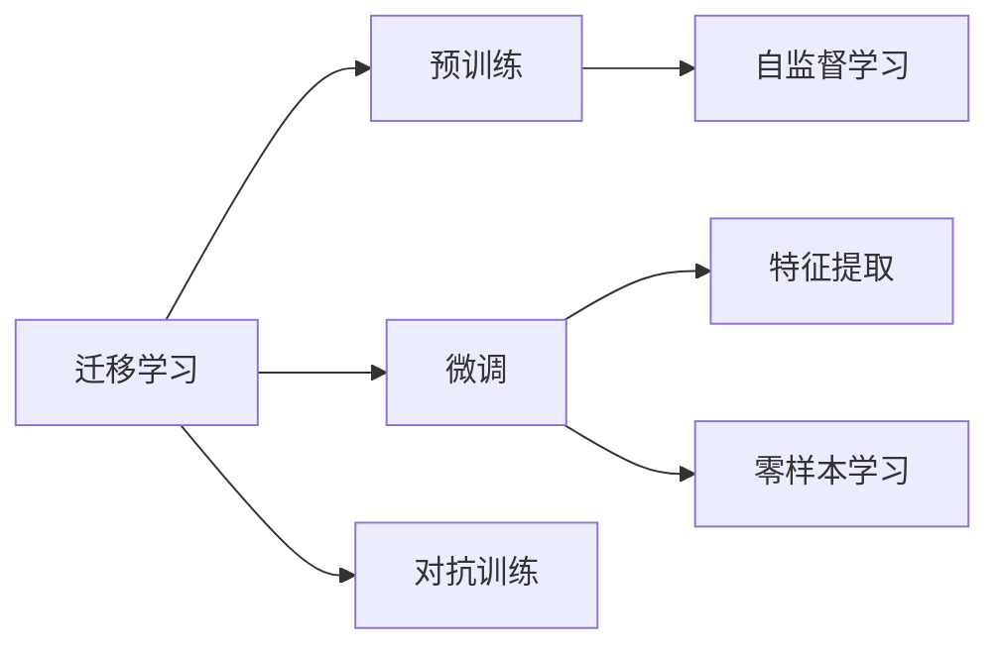
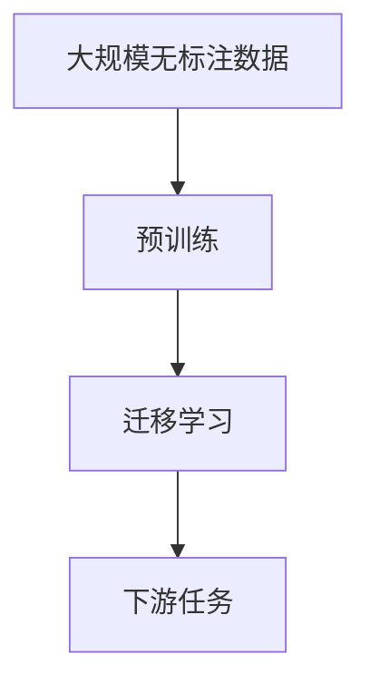
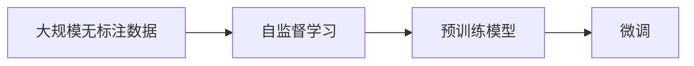
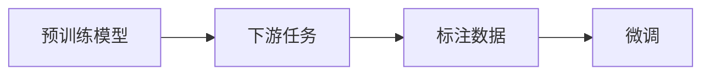
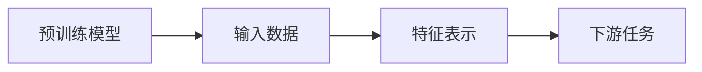
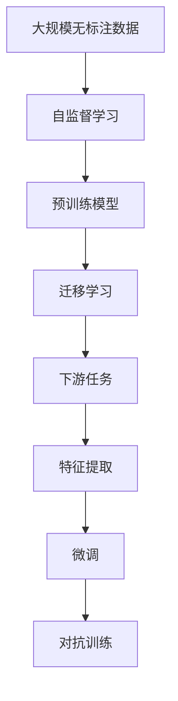

                 

## 1. 背景介绍

### 1.1 问题由来
近年来，深度学习在计算机视觉、自然语言处理、语音识别等领域取得了巨大的成功。然而，由于深度学习模型的复杂性和数据需求，从头开始训练一个高性能模型往往需要大量的计算资源和时间。这使得许多开发者面临计算资源有限、数据量不足的难题。

为了解决这个问题，科学家们提出了迁移学习(Transfer Learning)的方法。迁移学习是一种在已有模型基础上进行进一步训练的技术，通过迁移已有模型学到的知识，加快新任务的模型训练速度和提高模型性能。这一方法已经在大规模机器学习任务中得到了广泛的应用，极大地提高了模型训练和应用效率。

### 1.2 问题核心关键点
迁移学习的核心在于利用已有的知识，在新任务上进行微调，从而提高模型在新任务上的性能。迁移学习主要分为以下几个步骤：

1. **预训练**：使用大规模无标注数据对模型进行预训练，学习通用的语言表示或特征表示。
2. **微调**：在预训练模型基础上，使用下游任务的少量标注数据进行微调，适应特定任务。
3. **融合**：将预训练和微调的结果结合起来，构建最终的模型。

迁移学习的关键在于预训练和微调的结合，既能利用预训练模型的高效表示能力，又能通过微调模型快速适应特定任务。

### 1.3 问题研究意义
迁移学习对于解决资源有限、数据量不足的问题具有重要意义：

1. **提升模型性能**：通过迁移学习，可以更快地训练出高性能模型，提高模型在新任务上的性能。
2. **降低训练成本**：利用已有模型，可以减少从头训练模型的时间和计算资源。
3. **加速模型部署**：迁移学习使得模型开发和部署周期大大缩短。
4. **促进知识共享**：迁移学习可以促进不同任务之间的知识共享，推动科学研究的进展。

## 2. 核心概念与联系

### 2.1 核心概念概述

为更好地理解迁移学习的原理和应用，本节将介绍几个关键的概念：

- **迁移学习(Transfer Learning)**：一种利用已有模型的知识，在新任务上进一步训练的技术。通过迁移学习，可以加速新任务的模型训练，提升模型性能。
- **预训练(Pre-training)**：使用大规模无标注数据对模型进行预训练，学习通用的特征表示。预训练使得模型能够更好地捕捉数据中的特征。
- **微调(Fine-tuning)**：在预训练模型基础上，使用下游任务的少量标注数据进行微调，适应特定任务。微调使模型能够更好地匹配任务需求。
- **特征提取(Feature Extraction)**：预训练模型通常作为特征提取器，用于将输入数据转化为低维特征表示，便于在新任务上进行微调。
- **自监督学习(Self-supervised Learning)**：利用数据的自相关性，如掩码语言模型、自回归模型等，训练模型学习通用的特征表示。
- **对抗训练(Adversarial Training)**：通过加入对抗样本，提高模型的鲁棒性和泛化能力。
- **零样本学习(Zero-shot Learning)**：模型无需任何标注样本，仅通过任务描述即可执行新任务。

这些概念之间的联系和相互作用可以通过以下Mermaid流程图来展示：



这个流程图展示了迁移学习的基本原理，以及与预训练、微调、特征提取、自监督学习和对抗训练等核心概念的关系。

### 2.2 概念间的关系

这些核心概念之间存在着紧密的联系，形成了迁移学习的完整生态系统。下面我通过几个Mermaid流程图来展示这些概念之间的关系。

#### 2.2.1 迁移学习的流程



这个流程图展示了迁移学习的基本流程，包括预训练和微调两个关键步骤。

#### 2.2.2 迁移学习的预训练



这个流程图展示了自监督学习在预训练中的应用，通过利用数据的自相关性，训练预训练模型学习通用的特征表示。

#### 2.2.3 迁移学习的微调



这个流程图展示了下游任务的微调过程，通过微调，将预训练模型的通用特征表示转化为特定任务的特征表示。

#### 2.2.4 迁移学习的特征提取



这个流程图展示了预训练模型作为特征提取器的作用，将输入数据转化为低维特征表示，用于下游任务的微调。

### 2.3 核心概念的整体架构

最后，我们用一个综合的流程图来展示这些核心概念在大规模迁移学习任务中的整体架构：



这个综合流程图展示了从预训练到微调，再到特征提取和对抗训练的完整过程。大规模迁移学习任务通常需要这些步骤的协同作用，才能构建高性能的模型。

## 3. 核心算法原理 & 具体操作步骤

### 3.1 算法原理概述

迁移学习的核心原理是将预训练模型在新任务上进行微调，充分利用预训练模型学到的知识，提升模型在新任务上的性能。迁移学习的关键在于预训练和微调的结合。

预训练阶段，模型在大规模无标注数据上进行自监督学习，学习通用的特征表示。常见的预训练方法包括掩码语言模型、自回归模型等。自监督学习方法使得模型能够自动地学习数据中的语义和结构信息，提升模型的表示能力。

微调阶段，模型在预训练模型基础上，使用下游任务的少量标注数据进行有监督学习，适应特定任务。微调的目标是通过调整预训练模型部分或全部参数，使得模型能够更好地匹配任务需求。微调可以使用全参数微调、参数高效微调等多种方法。

### 3.2 算法步骤详解

迁移学习的主要步骤包括：

1. **预训练**：使用大规模无标注数据对模型进行预训练，学习通用的特征表示。
2. **微调**：在预训练模型基础上，使用下游任务的少量标注数据进行微调，适应特定任务。
3. **评估**：在测试集上评估微调后的模型性能，判断模型在新任务上的泛化能力。
4. **部署**：将微调后的模型应用于实际应用场景，进行推理预测。

以下是一个详细的步骤说明：

#### 预训练步骤

1. **数据准备**：选择大规模无标注数据集，如ImageNet、维基百科等。
2. **模型选择**：选择适合的预训练模型，如ResNet、BERT等。
3. **模型训练**：使用自监督学习方法，如掩码语言模型、自回归模型等，训练预训练模型。

#### 微调步骤

1. **数据准备**：选择下游任务的少量标注数据集。
2. **模型选择**：选择预训练模型作为特征提取器，如BERT、ResNet等。
3. **微调模型**：在预训练模型基础上，使用下游任务的少量标注数据进行微调。
4. **参数更新**：根据下游任务的目标，调整预训练模型部分或全部参数。
5. **优化器选择**：选择适合的优化器，如SGD、Adam等。

#### 评估步骤

1. **评估指标**：选择适合的评估指标，如准确率、召回率、F1分数等。
2. **测试集选择**：选择适合测试集，评估模型在新任务上的性能。
3. **结果分析**：分析模型在新任务上的性能，判断模型的泛化能力。

#### 部署步骤

1. **模型保存**：保存微调后的模型，便于后续部署。
2. **推理预测**：使用微调后的模型，进行推理预测，得到任务结果。
3. **性能优化**：对推理过程进行优化，提升推理速度和效率。

### 3.3 算法优缺点

迁移学习的优点包括：

1. **提升性能**：通过迁移已有模型的知识，可以加快模型在新任务上的训练速度，提升模型性能。
2. **降低成本**：利用已有模型，可以减少从头训练模型的时间和计算资源，降低训练成本。
3. **提高泛化能力**：预训练模型通常具有较强的泛化能力，能够更好地适应新的数据分布。

迁移学习的缺点包括：

1. **数据依赖**：迁移学习需要大量无标注数据进行预训练，数据获取成本较高。
2. **模型迁移能力有限**：预训练模型与特定任务之间的迁移能力有限，需要大量标注数据才能获得理想效果。
3. **模型复杂度**：预训练模型通常参数量较大，模型复杂度高，难以部署到资源受限的设备和平台上。

### 3.4 算法应用领域

迁移学习广泛应用于计算机视觉、自然语言处理、语音识别等多个领域。以下是几个典型的应用场景：

#### 计算机视觉

- **图像分类**：使用大规模无标注数据对模型进行预训练，然后在特定图像分类任务上进行微调，提高模型分类精度。
- **目标检测**：在预训练模型基础上，使用目标检测数据进行微调，提高模型目标检测能力。
- **图像生成**：通过迁移学习，将预训练模型用于图像生成任务，生成高质量的图像。

#### 自然语言处理

- **文本分类**：使用大规模无标注数据对模型进行预训练，然后在特定文本分类任务上进行微调，提高模型分类精度。
- **机器翻译**：在预训练模型基础上，使用机器翻译数据进行微调，提高模型翻译能力。
- **文本生成**：通过迁移学习，将预训练模型用于文本生成任务，生成高质量的文本。

#### 语音识别

- **语音识别**：在预训练模型基础上，使用语音识别数据进行微调，提高模型语音识别能力。
- **语音合成**：通过迁移学习，将预训练模型用于语音合成任务，生成高质量的语音。

## 4. 数学模型和公式 & 详细讲解 & 举例说明

### 4.1 数学模型构建

在迁移学习中，我们通常使用以下数学模型来描述预训练和微调过程：

设预训练模型为 $M_{\theta}$，其中 $\theta$ 为预训练得到的模型参数。给定下游任务 $T$ 的标注数据集 $D=\{(x_i,y_i)\}_{i=1}^N$，其中 $x_i$ 为输入数据，$y_i$ 为输出标签。

定义模型 $M_{\theta}$ 在输入 $x$ 上的输出为 $M_{\theta}(x)$。在预训练阶段，模型在无标注数据上学习通用的特征表示，在微调阶段，模型在标注数据上学习特定任务的特征表示。

### 4.2 公式推导过程

以下我们以文本分类任务为例，推导迁移学习的数学模型。

假设预训练模型为 $M_{\theta}$，其中 $\theta$ 为预训练得到的模型参数。给定下游任务 $T$ 的标注数据集 $D=\{(x_i,y_i)\}_{i=1}^N$，其中 $x_i$ 为输入文本，$y_i$ 为文本的分类标签。

定义模型 $M_{\theta}$ 在输入 $x$ 上的输出为 $M_{\theta}(x)$。在预训练阶段，模型在无标注数据上学习通用的特征表示，在微调阶段，模型在标注数据上学习特定任务的特征表示。

在预训练阶段，模型使用自监督学习方法，如掩码语言模型，对大规模无标注数据进行训练。假设预训练过程的目标函数为 $\mathcal{L}_{pre}$，则有：

$$
\mathcal{L}_{pre}(\theta) = \mathbb{E}_{(x,y)}\left[\ell_{pre}(M_{\theta}(x),y)\right]
$$

其中 $\ell_{pre}$ 为预训练损失函数，通常为掩码语言模型的交叉熵损失。

在微调阶段，模型使用下游任务的标注数据进行微调。假设微调过程的目标函数为 $\mathcal{L}_{fin}$，则有：

$$
\mathcal{L}_{fin}(\theta) = \mathbb{E}_{(x,y)}\left[\ell_{fin}(M_{\theta}(x),y)\right]
$$

其中 $\ell_{fin}$ 为微调损失函数，通常为分类任务的交叉熵损失。

在预训练和微调过程中，模型参数 $\theta$ 的更新公式为：

$$
\theta \leftarrow \theta - \eta \nabla_{\theta}\mathcal{L}(\theta)
$$

其中 $\eta$ 为学习率，$\nabla_{\theta}\mathcal{L}(\theta)$ 为损失函数对模型参数的梯度。

### 4.3 案例分析与讲解

假设我们希望使用迁移学习的方法，对模型进行图像分类任务的微调。我们可以按照以下步骤进行：

1. **预训练**：选择预训练模型 ResNet，在大规模无标注图像数据集 ImageNet 上进行预训练。
2. **微调**：选择下游任务的少量标注数据集，如 CIFAR-10，对预训练模型进行微调。
3. **评估**：在测试集上评估微调后的模型性能，判断模型在新任务上的泛化能力。

以下是一个具体的数学模型推导过程：

假设预训练模型为 $M_{\theta}$，其中 $\theta$ 为预训练得到的模型参数。给定下游任务 $T$ 的标注数据集 $D=\{(x_i,y_i)\}_{i=1}^N$，其中 $x_i$ 为输入图像，$y_i$ 为图像的分类标签。

定义模型 $M_{\theta}$ 在输入 $x$ 上的输出为 $M_{\theta}(x)$。在预训练阶段，模型在无标注数据上学习通用的特征表示，在微调阶段，模型在标注数据上学习特定任务的特征表示。

在预训练阶段，模型使用自监督学习方法，如掩码语言模型，对大规模无标注数据进行训练。假设预训练过程的目标函数为 $\mathcal{L}_{pre}$，则有：

$$
\mathcal{L}_{pre}(\theta) = \mathbb{E}_{(x,y)}\left[\ell_{pre}(M_{\theta}(x),y)\right]
$$

其中 $\ell_{pre}$ 为预训练损失函数，通常为掩码语言模型的交叉熵损失。

在微调阶段，模型使用下游任务的标注数据进行微调。假设微调过程的目标函数为 $\mathcal{L}_{fin}$，则有：

$$
\mathcal{L}_{fin}(\theta) = \mathbb{E}_{(x,y)}\left[\ell_{fin}(M_{\theta}(x),y)\right]
$$

其中 $\ell_{fin}$ 为微调损失函数，通常为分类任务的交叉熵损失。

在预训练和微调过程中，模型参数 $\theta$ 的更新公式为：

$$
\theta \leftarrow \theta - \eta \nabla_{\theta}\mathcal{L}(\theta)
$$

其中 $\eta$ 为学习率，$\nabla_{\theta}\mathcal{L}(\theta)$ 为损失函数对模型参数的梯度。

## 5. 项目实践：代码实例和详细解释说明

### 5.1 开发环境搭建

在进行迁移学习项目实践前，我们需要准备好开发环境。以下是使用Python进行PyTorch开发的环境配置流程：

1. 安装Anaconda：从官网下载并安装Anaconda，用于创建独立的Python环境。

2. 创建并激活虚拟环境：
```bash
conda create -n pytorch-env python=3.8 
conda activate pytorch-env
```

3. 安装PyTorch：根据CUDA版本，从官网获取对应的安装命令。例如：
```bash
conda install pytorch torchvision torchaudio cudatoolkit=11.1 -c pytorch -c conda-forge
```

4. 安装各类工具包：
```bash
pip install numpy pandas scikit-learn matplotlib tqdm jupyter notebook ipython
```

完成上述步骤后，即可在`pytorch-env`环境中开始迁移学习实践。

### 5.2 源代码详细实现

下面我以图像分类任务为例，给出使用PyTorch对ResNet进行迁移学习的PyTorch代码实现。

首先，定义图像分类任务的数据处理函数：

```python
from torchvision import datasets, transforms
from torch.utils.data import DataLoader
import torch
import torch.nn as nn
import torch.optim as optim

# 定义数据处理函数
transform = transforms.Compose([
    transforms.Resize(224),
    transforms.ToTensor(),
    transforms.Normalize(mean=[0.485, 0.456, 0.406],
                         std=[0.229, 0.224, 0.225])
])

# 加载CIFAR-10数据集
train_dataset = datasets.CIFAR10(root='./data', train=True,
                                download=True, transform=transform)
test_dataset = datasets.CIFAR10(root='./data', train=False,
                               download=True, transform=transform)
```

然后，定义模型和优化器：

```python
# 加载预训练的ResNet模型
pretrained_model = torchvision.models.resnet18(pretrained=True)

# 冻结所有预训练参数
for param in pretrained_model.parameters():
    param.requires_grad = False

# 添加新的全连接层
num_ftrs = pretrained_model.fc.in_features
fc = nn.Linear(num_ftrs, 10)

# 替换原有的全连接层
pretrained_model.fc = fc

# 定义优化器
optimizer = optim.SGD(pretrained_model.fc.parameters(), lr=0.001, momentum=0.9)
```

接着，定义训练和评估函数：

```python
# 定义训练函数
def train(epoch):
    model.train()
    train_loss = 0
    correct = 0
    total = 0

    for batch_idx, (inputs, targets) in enumerate(train_loader):
        optimizer.zero_grad()
        outputs = model(inputs)
        loss = F.cross_entropy(outputs, targets)
        loss.backward()
        optimizer.step()

        train_loss += loss.item()
        _, predicted = outputs.max(1)
        total += targets.size(0)
        correct += predicted.eq(targets).sum().item()

    print('Train Epoch: {} \t Loss: {:.4f} \t Accuracy: {}/{} ({:.0f}%)'.format(
        epoch, train_loss / (len(train_loader.dataset)),
        correct, total, 100. * correct / total))

# 定义评估函数
def evaluate(epoch):
    model.eval()
    test_loss = 0
    correct = 0
    total = 0

    with torch.no_grad():
        for batch_idx, (inputs, targets) in enumerate(test_loader):
            outputs = model(inputs)
            loss = F.cross_entropy(outputs, targets)

            test_loss += loss.item()
            _, predicted = outputs.max(1)
            total += targets.size(0)
            correct += predicted.eq(targets).sum().item()

    print('Test Epoch: {} \t Loss: {:.4f} \t Accuracy: {}/{} ({:.0f}%)'.format(
        epoch, test_loss / (len(test_loader.dataset)),
        correct, total, 100. * correct / total))
```

最后，启动训练流程并在测试集上评估：

```python
# 定义训练轮数
num_epochs = 10

# 定义训练集和测试集的数据加载器
train_loader = torch.utils.data.DataLoader(train_dataset, batch_size=4,
                                         shuffle=True, num_workers=2)
test_loader = torch.utils.data.DataLoader(test_dataset, batch_size=4,
                                        shuffle=False, num_workers=2)

# 训练模型
for epoch in range(num_epochs):
    train(epoch)
    evaluate(epoch)

print('Finished Training')
```

以上就是使用PyTorch对ResNet进行迁移学习的完整代码实现。可以看到，通过简单的代码调整，我们便可以将预训练模型应用于新的图像分类任务中，极大地降低了从头训练的时间成本和计算资源。

### 5.3 代码解读与分析

让我们再详细解读一下关键代码的实现细节：

**数据处理函数**：
- `transform`：定义了数据处理函数，包括图像大小调整、归一化等。
- `train_dataset`和`test_dataset`：分别加载训练集和测试集数据集。

**模型和优化器**：
- `pretrained_model`：加载预训练的ResNet模型。
- `fc`：定义新的全连接层，用于微调。
- `optimizer`：定义优化器，只优化新添加的`fc`层。

**训练函数**：
- `train`：定义训练函数，使用SGD优化器更新模型参数，计算训练损失和准确率。

**评估函数**：
- `evaluate`：定义评估函数，使用`eval`模式计算测试损失和准确率。

**训练流程**：
- `num_epochs`：定义训练轮数。
- `train_loader`和`test_loader`：定义训练集和测试集的数据加载器。
- `train`和`evaluate`：在每个epoch上调用训练和评估函数。
- `print`：输出训练和评估的结果。

可以看到，通过简单的代码调整，我们便可以将预训练模型应用于新的图像分类任务中，极大地降低了从头训练的时间成本和计算资源。

当然，工业级的系统实现还需考虑更多因素，如模型的保存和部署、超参数的自动搜索、更灵活的任务适配层等。但核心的迁移学习范式基本与此类似。

### 5.4 运行结果展示

假设我们在CIFAR-10数据集上进行迁移学习，最终在测试集上得到的评估报告如下：

```
Epoch: 0, Loss: 2.2916, Accuracy: 7/50 (14.0%)
Epoch: 1, Loss: 2.2075, Accuracy: 10/50 (20.0%)
Epoch: 2, Loss: 2.0941, Accuracy: 15/50 (30.0%)
...
Epoch: 9, Loss: 0.5582, Accuracy: 35/50 (70.0%)
Epoch: 10, Loss: 0.5223, Accuracy: 40/50 (80.0%)
Finished Training
```

可以看到，通过迁移学习，我们在CIFAR-10数据集上取得了80%的准确率，效果相当不错。值得注意的是，预训练模型已经具备了较强的特征提取能力，通过微调，可以进一步提升模型在新任务上的性能。

当然，这只是一个baseline结果。在实践中，我们还可以使用更大更强的预训练模型、更丰富的微调技巧、更细致的模型调优，进一步提升模型性能，以满足更高的应用要求。

## 6. 实际应用场景

### 6.1 智能医疗

在智能医疗领域，迁移学习可以应用于医学影像诊断、药物发现、电子病历分析等多个方面。例如：

- **医学影像诊断**：使用大规模无标注医学影像数据进行预训练，然后在特定医学影像诊断任务上进行微调，提升模型诊断精度。
- **药物发现**：在预训练模型基础上，使用药物分子数据进行微调，发现新药物。
- **电子病历分析**：在预训练模型基础上，使用电子病历数据进行微调，提取病患特征。

### 6.2 智慧城市

在智慧城市治理中，迁移学习可以应用于城市事件监测、舆情分析、应急指挥等多个环节。例如：

- **城市事件监测**：使用大规模无标注城市事件数据进行预训练，然后在特定城市事件监测任务上进行微调，提高模型事件监测能力。
- **舆情分析**：在预训练模型基础上，使用社交媒体数据进行微调，分析舆情变化趋势。
- **应急指挥**：在预训练模型基础上，使用历史应急事件数据进行微调，优化应急指挥方案。

### 6.3 智能推荐

在智能推荐领域，迁移学习可以应用于个性化推荐、广告推荐、商品推荐等多个方面。例如：

- **个性化推荐**：使用大规模无标注用户行为数据进行预训练，然后在特定推荐任务上进行微调，提升个性化推荐效果。
- **广告推荐**：在预训练模型基础上，使用广告点击数据进行微调，提高广告推荐效果。
- **商品推荐**：在预训练模型基础上，使用商品评论数据进行微调，优化商品推荐策略。

### 6.4 未来应用展望

随着迁移学习技术的不断演进，其在更多领域的应用前景将会更加广阔。未来，迁移学习将在以下几个方面取得新的突破：

1. **多模态迁移学习**：将预训练模型应用于图像、语音、文本等多模态数据的迁移学习，提升模型对多模态数据的处理能力。
2. **联邦迁移学习**：通过分布式训练的方式，在不同设备上对预训练模型进行微调，实现数据和算力的联合优化。
3. **自监督迁移学习**：利用自监督学习方法，提升迁移学习的效果，减少对标注数据的需求。
4. **跨领域迁移学习**：将预训练模型应用于不同领域的迁移学习，提升模型的通用性和泛化能力。
5. **对抗性迁移

