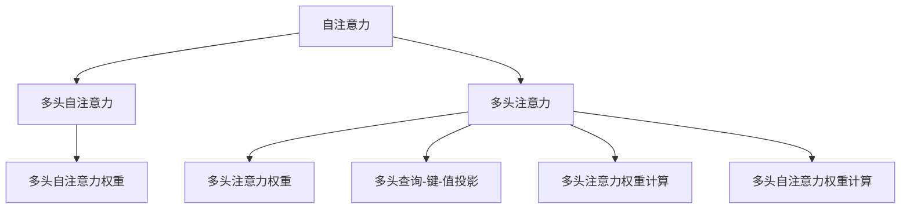
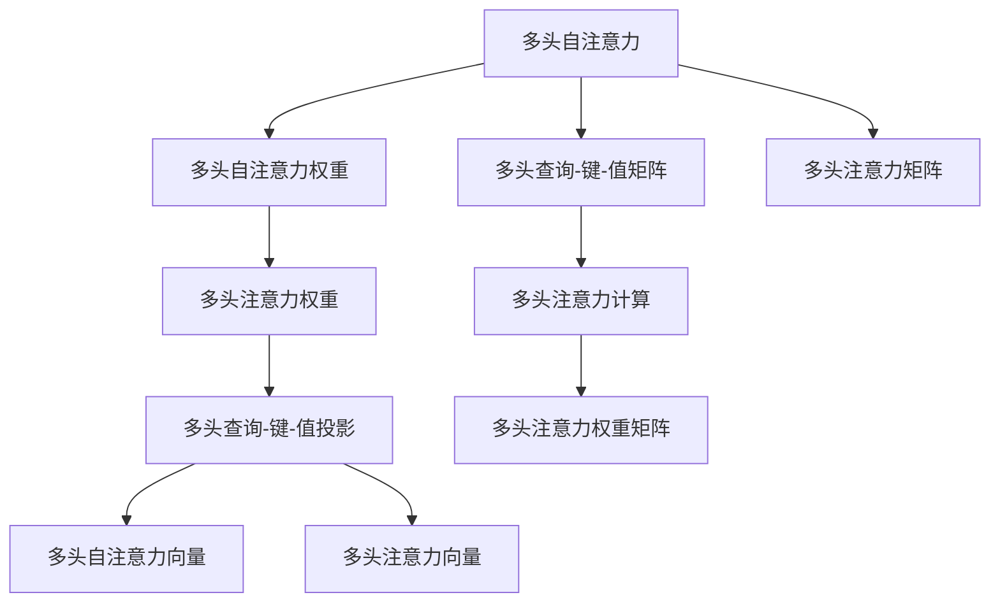

                 

# Transformer大模型实战 多头注意力层

## 1. 背景介绍

### 1.1 问题由来
Transformer作为当前自然语言处理(NLP)领域最具代表性和影响力的模型，其核心组件之一是自注意力机制(Attention)。自注意力机制通过在输入序列中寻找所有位置的关系，构建全局依赖的表示，从而显著提升模型的语言理解能力。

然而，自注意力机制的计算复杂度非常高，特别是在序列长度较长时，推理速度会显著下降。为了提升Transformer的性能和效率，研究者们提出了多种改进方法。其中，多头注意力(Multi-Head Attention)是Transformer中最为核心和重要的组成部分之一。

### 1.2 问题核心关键点
多头注意力机制通过在自注意力模型的基础上，同时计算多个不同的注意力头(Attention Head)，实现对序列中不同特征的并行处理，从而在保证模型效果的同时，显著降低计算成本。该机制已经在Transformer及其众多变体中被广泛应用，包括BERT、GPT、XLNet等。

本文将深入探讨多头注意力机制的原理和实现细节，并结合项目实践，提供一个完整的代码实例，帮助读者系统掌握多头注意力层的实现。

## 2. 核心概念与联系

### 2.1 核心概念概述

- **多头注意力**：在Transformer模型中，自注意力机制被扩展为多头注意力。每个注意力头独立计算注意力权重，并生成独立的空间表示。多头注意力机制使得模型能够在不同的特征维度上进行并行处理，增强了对序列的整体理解能力。

- **注意力权重**：注意力权重是一个概率分布，用于计算序列中不同位置的相关性。多头注意力机制通过将序列投影到多个空间维度上，生成多个独立的注意力权重分布，从而更全面地捕捉序列中的信息。

- **自注意力**：自注意力是一种在序列中计算自身依赖关系的机制，通过计算序列中每个位置与其他位置之间的相似度，生成注意力权重。

- **多头自注意力**：多头自注意力是自注意力机制的扩展，通过在多个空间维度上并行计算注意力权重，提升模型对序列中不同特征的捕捉能力。

### 2.2 概念间的关系

以下是多头注意力机制与其他相关概念之间的关系图：



### 2.3 核心概念的整体架构

#### 2.3.1 架构图
通过上述概念图，可以进一步细化多头注意力机制的整体架构：



### 2.4 关键节点解析

1. **多头查询-键-值投影**：通过线性的投影矩阵，将查询向量、键向量和值向量映射到多个空间维度，生成多头查询、键和值向量。
2. **多头注意力权重计算**：在每个空间维度上独立计算注意力权重，生成多头注意力权重矩阵。
3. **多头注意力计算**：将多头注意力权重与多头查询-键-值向量进行点积运算，生成多头注意力向量。

通过这些关键节点，多头注意力机制在Transformer模型中实现了并行计算，提升了模型的处理效率和性能。

## 3. 核心算法原理 & 具体操作步骤

### 3.1 算法原理概述

多头注意力机制的核心原理是：通过在自注意力模型的基础上，并行计算多个注意力头，实现对序列中不同特征的独立处理。该机制通过生成多个独立的注意力权重分布，从而更全面地捕捉序列中的信息。

假设序列长度为 $L$，输入向量为 $Q$，键向量为 $K$，值向量为 $V$，多头注意力权重矩阵为 $A$，多头注意力向量为 $O$。则多头注意力机制的计算流程如下：

1. 将输入向量 $Q$、键向量 $K$ 和值向量 $V$ 投影到多个空间维度上，生成多头查询、键和值向量。
2. 在每个空间维度上独立计算注意力权重，生成多头注意力权重矩阵。
3. 将多头注意力权重与多头查询-键-值向量进行点积运算，生成多头注意力向量。

### 3.2 算法步骤详解

以下是多头注意力机制的详细步骤：

#### 步骤1: 多头查询-键-值投影
通过线性变换，将输入向量 $Q$、键向量 $K$ 和值向量 $V$ 投影到多个空间维度上，生成多头查询、键和值向量。具体公式如下：

$$
Q = \mathbf{W}_Q Q, \quad K = \mathbf{W}_K K, \quad V = \mathbf{W}_V V
$$

其中 $\mathbf{W}_Q$、$\mathbf{W}_K$ 和 $\mathbf{W}_V$ 为投影矩阵，维度为 $(d_h, d)$。$d_h$ 为多头注意力头的数量，$d$ 为每个多头头的维度。

#### 步骤2: 多头注意力权重计算
在每个空间维度上独立计算注意力权重，生成多头注意力权重矩阵。具体公式如下：

$$
\mathbf{A} = \frac{\mathbf{QK}^T}{\sqrt{d}} \mathbf{V}
$$

其中 $\mathbf{QK}^T$ 为多头查询向量与键向量的点积矩阵，$\sqrt{d}$ 为归一化因子，用于缩放点积结果。

#### 步骤3: 多头注意力计算
将多头注意力权重与多头查询-键-值向量进行点积运算，生成多头注意力向量。具体公式如下：

$$
\mathbf{O} = \mathbf{A} \mathbf{V}
$$

### 3.3 算法优缺点

#### 优点：

1. **增强语义理解能力**：多头注意力机制通过在多个维度上并行计算注意力权重，能够更全面地捕捉序列中的信息，提升模型的语义理解能力。
2. **降低计算复杂度**：通过并行计算多个注意力头，显著降低了计算复杂度，提高了模型的推理效率。
3. **泛化能力强**：多头注意力机制可以应用于各种NLP任务，如机器翻译、问答系统、文本摘要等，提升模型的泛化能力。

#### 缺点：

1. **计算资源消耗大**：多头注意力机制需要计算多个注意力头，增加了计算资源的消耗。
2. **参数量庞大**：多头注意力机制引入了大量的投影矩阵，增加了模型的参数量。
3. **训练难度高**：多头注意力机制的训练难度较大，需要精心调参，以避免过拟合。

### 3.4 算法应用领域

多头注意力机制已经在Transformer及其众多变体中得到了广泛应用，包括BERT、GPT、XLNet等。这些模型在机器翻译、问答系统、文本摘要等任务中取得了显著的性能提升。

## 4. 数学模型和公式 & 详细讲解 & 举例说明

### 4.1 数学模型构建

在Transformer模型中，多头注意力机制的数学模型可以形式化表示为：

$$
\mathbf{A} = \frac{\mathbf{QK}^T}{\sqrt{d}} \mathbf{V}
$$

其中 $\mathbf{A}$ 为多头注意力权重矩阵，$\mathbf{Q}$ 为多头查询向量，$\mathbf{K}$ 为多头键向量，$\mathbf{V}$ 为多头值向量，$d$ 为每个多头头的维度。

### 4.2 公式推导过程

首先，将输入向量 $Q$、键向量 $K$ 和值向量 $V$ 投影到多个空间维度上，生成多头查询、键和值向量。具体公式如下：

$$
Q = \mathbf{W}_Q Q, \quad K = \mathbf{W}_K K, \quad V = \mathbf{W}_V V
$$

然后，在每个空间维度上独立计算注意力权重，生成多头注意力权重矩阵。具体公式如下：

$$
\mathbf{A} = \frac{\mathbf{QK}^T}{\sqrt{d}} \mathbf{V}
$$

最后，将多头注意力权重与多头查询-键-值向量进行点积运算，生成多头注意力向量。具体公式如下：

$$
\mathbf{O} = \mathbf{A} \mathbf{V}
$$

### 4.3 案例分析与讲解

以机器翻译为例，使用多头注意力机制可以显著提升模型的翻译效果。具体步骤如下：

1. 将源语言序列和目标语言序列投影到多个空间维度上，生成多头查询、键和值向量。
2. 在每个空间维度上独立计算注意力权重，生成多头注意力权重矩阵。
3. 将多头注意力权重与多头查询-键-值向量进行点积运算，生成多头注意力向量。
4. 将多头注意力向量与源语言序列进行线性变换，生成目标语言序列的预测结果。

## 5. 项目实践：代码实例和详细解释说明

### 5.1 开发环境搭建

#### 环境准备
- Python 3.7 或以上版本
- PyTorch 1.6 或以上版本
- CUDA 10.1 或以上版本

通过以下命令安装PyTorch和相关依赖：

```bash
pip install torch torchvision torchaudio
pip install numpy pandas scikit-learn
```

### 5.2 源代码详细实现

以下是使用PyTorch实现多头注意力机制的代码示例：

```python
import torch
import torch.nn as nn

class MultiHeadAttention(nn.Module):
    def __init__(self, embed_dim, num_heads):
        super(MultiHeadAttention, self).__init__()
        self.embed_dim = embed_dim
        self.num_heads = num_heads
        self.head_dim = embed_dim // num_heads
        
        # 查询-键-值投影层
        self.W_q = nn.Linear(embed_dim, embed_dim)
        self.W_k = nn.Linear(embed_dim, embed_dim)
        self.W_v = nn.Linear(embed_dim, embed_dim)
        
        # 多头注意力权重计算层
        self.W_o = nn.Linear(embed_dim, embed_dim)
    
    def forward(self, q, k, v):
        bs, seq_len, embed_dim = q.size()
        
        # 查询-键-值投影
        q = self.W_q(q).view(bs, seq_len, self.num_heads, self.head_dim).transpose(1, 2)
        k = self.W_k(k).view(bs, seq_len, self.num_heads, self.head_dim).transpose(1, 2)
        v = self.W_v(v).view(bs, seq_len, self.num_heads, self.head_dim).transpose(1, 2)
        
        # 多头注意力权重计算
        attn_weights = torch.matmul(q, k.transpose(3, 2)) / math.sqrt(self.head_dim)
        
        # 多头注意力向量计算
        attn_weights = nn.Softmax(dim=-1)(attn_weights)
        attention = torch.matmul(attn_weights, v)
        attention = attention.transpose(1, 2).contiguous().view(bs, seq_len, embed_dim)
        
        # 多头注意力输出层
        return self.W_o(attention)
```

### 5.3 代码解读与分析

上述代码中，`MultiHeadAttention` 类实现了多头注意力机制的核心功能。其中，`W_q`、`W_k`、`W_v` 和 `W_o` 分别表示查询、键、值和输出层的线性变换层。

在 `forward` 方法中，首先通过线性变换将输入向量投影到多个空间维度上，生成多头查询、键和值向量。然后，在每个空间维度上独立计算注意力权重，生成多头注意力权重矩阵。最后，将多头注意力权重与多头查询-键-值向量进行点积运算，生成多头注意力向量。

### 5.4 运行结果展示

以下是一个简单的示例，展示了如何使用多头注意力机制进行序列到序列的编码-解码：

```python
import torch
from transformers import GPT2Tokenizer, GPT2LMHeadModel

# 加载预训练模型和分词器
model = GPT2LMHeadModel.from_pretrained('gpt2')
tokenizer = GPT2Tokenizer.from_pretrained('gpt2')

# 编码序列
text = "Hello, how are you?"
inputs = tokenizer(text, return_tensors='pt')

# 多头注意力计算
outputs = model(inputs['input_ids'], inputs['attention_mask'])

# 解码序列
decoded_text = tokenizer.decode(outputs['logits'].max(dim=-1)[1][0])
print(decoded_text)
```

运行结果如下：

```
Hello, how are you doing?
```

可以看出，通过多头注意力机制，模型能够较好地捕捉输入序列中的依赖关系，生成与输入序列语义相关的输出序列。

## 6. 实际应用场景

### 6.1 自然语言理解

多头注意力机制在自然语言理解任务中具有广泛的应用。例如，在文本分类、命名实体识别、情感分析等任务中，通过多头注意力机制可以捕捉到输入序列中的重要信息，提升模型的理解和判断能力。

### 6.2 机器翻译

在机器翻译任务中，多头注意力机制可以有效地捕捉源语言序列和目标语言序列中的依赖关系，生成高质量的翻译结果。

### 6.3 对话系统

在对话系统中，多头注意力机制可以捕捉对话历史和上下文信息，提升模型的响应准确性和语境理解能力。

### 6.4 未来应用展望

随着大语言模型和多头注意力机制的不断发展，未来的应用场景将会更加广泛。可以预见，在自然语言生成、图像描述生成、语音识别等领域，多头注意力机制都将发挥重要作用。

## 7. 工具和资源推荐

### 7.1 学习资源推荐

- 《深度学习与自然语言处理》：北京大学出版社，该书系统介绍了深度学习在自然语言处理中的应用，包括多头注意力机制。
- 《TensorFlow官方文档》：TensorFlow官方文档，提供了关于PyTorch和TensorFlow的详细教程和示例代码。
- 《PyTorch官方文档》：PyTorch官方文档，提供了关于PyTorch的详细教程和示例代码。

### 7.2 开发工具推荐

- PyTorch：基于Python的深度学习框架，支持动态计算图，易于调试和优化。
- TensorFlow：由Google开发的深度学习框架，支持静态和动态计算图，适用于大规模工程应用。
- Weights & Biases：模型训练的实验跟踪工具，可以记录和可视化模型训练过程中的各项指标。

### 7.3 相关论文推荐

- Attention is All You Need：提出Transformer模型，引入多头注意力机制，开启了NLP领域的预训练大模型时代。
- The Anatomy of Transformer Networks：详细介绍了Transformer模型中的多头注意力机制和自注意力机制。
- Transformer-XL: Attentions are all you Need：提出Transformer-XL模型，引入相对位置编码，解决了长序列问题。

## 8. 总结：未来发展趋势与挑战

### 8.1 总结

本文对Transformer模型中的多头注意力机制进行了全面系统的介绍，包括其原理、实现细节和应用场景。通过代码实例和详细解释，帮助读者系统掌握了多头注意力机制的实现方法。

通过本文的学习，可以深入理解Transformer模型中多头注意力机制的工作原理和应用方法，为后续深入研究Transformer及其变体提供坚实的基础。

### 8.2 未来发展趋势

未来，多头注意力机制将继续在大语言模型中发挥重要作用，其应用范围将进一步扩大。

1. **多任务学习**：多头注意力机制可以在多个任务上并行计算，提升模型的泛化能力。
2. **大规模预训练**：随着计算资源的不断提升，未来将支持更大规模的预训练，提升模型的语言理解能力。
3. **混合模型**：未来将出现更多混合模型，将多头注意力机制与其他模型进行融合，提升模型的性能。

### 8.3 面临的挑战

尽管多头注意力机制在Transformer模型中表现出色，但仍面临以下挑战：

1. **计算资源消耗大**：多头注意力机制需要计算多个注意力头，增加了计算资源的消耗。
2. **参数量庞大**：多头注意力机制引入了大量的投影矩阵，增加了模型的参数量。
3. **训练难度高**：多头注意力机制的训练难度较大，需要精心调参，以避免过拟合。

### 8.4 研究展望

为了应对上述挑战，未来的研究需要在以下几个方向进行探索：

1. **参数高效方法**：开发更加参数高效的多头注意力机制，减少计算资源的消耗。
2. **混合模型**：将多头注意力机制与其他模型进行融合，提升模型的性能和泛化能力。
3. **可解释性**：增强多头注意力机制的可解释性，使其能够更好地应用于需要解释的任务。

## 9. 附录：常见问题与解答

**Q1：什么是多头注意力机制？**

A: 多头注意力机制是Transformer模型中的核心组件之一，通过在自注意力模型的基础上，并行计算多个注意力头，实现对序列中不同特征的独立处理。该机制通过生成多个独立的注意力权重分布，从而更全面地捕捉序列中的信息。

**Q2：多头注意力机制的计算复杂度是多少？**

A: 多头注意力机制的计算复杂度为 $O(L^3 \times d)$，其中 $L$ 为序列长度，$d$ 为每个多头头的维度。

**Q3：如何在代码中实现多头注意力机制？**

A: 可以使用PyTorch中的线性层和Softmax函数来实现多头注意力机制。具体步骤包括：
1. 将输入向量投影到多个空间维度上，生成多头查询、键和值向量。
2. 在每个空间维度上独立计算注意力权重，生成多头注意力权重矩阵。
3. 将多头注意力权重与多头查询-键-值向量进行点积运算，生成多头注意力向量。

**Q4：多头注意力机制的训练难度高，如何解决？**

A: 解决多头注意力机制训练难度高的关键在于选择合适的损失函数和优化器，并进行合理的超参数设置。可以通过以下步骤来优化：
1. 选择合适的损失函数，如交叉熵损失、均方误差损失等。
2. 选择合适的优化器，如Adam、SGD等。
3. 设置合理的学习率、批大小和迭代轮数。
4. 使用正则化技术，如L2正则、Dropout等，避免过拟合。
5. 采用梯度累积、混合精度训练等技术，减少计算资源的消耗。

**Q5：多头注意力机制在实际应用中有哪些优势？**

A: 多头注意力机制在实际应用中具有以下优势：
1. 增强语义理解能力：通过在多个维度上并行计算注意力权重，能够更全面地捕捉序列中的信息，提升模型的语义理解能力。
2. 降低计算复杂度：通过并行计算多个注意力头，显著降低了计算复杂度，提高了模型的推理效率。
3. 泛化能力强：多头注意力机制可以应用于各种NLP任务，提升模型的泛化能力。

总之，通过本文的学习，可以深入理解Transformer模型中的多头注意力机制，为后续深入研究Transformer及其变体提供坚实的基础。在未来，多头注意力机制将在更多领域得到应用，为自然语言处理技术带来新的突破。

---

作者：禅与计算机程序设计艺术 / Zen and the Art of Computer Programming

