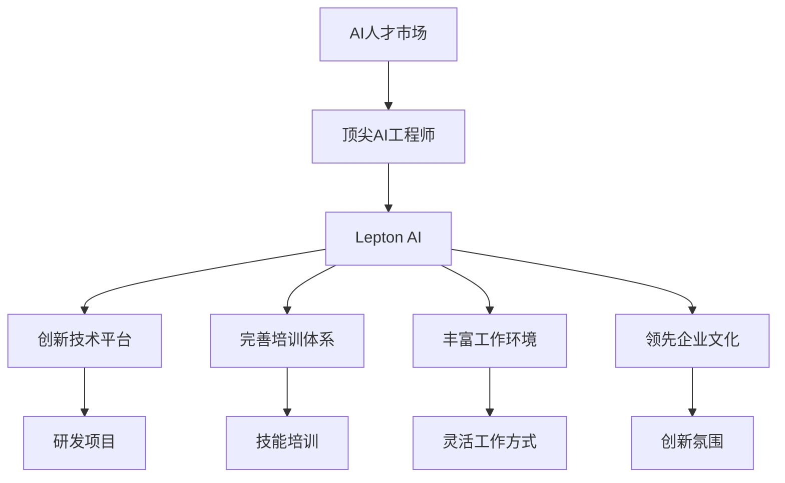
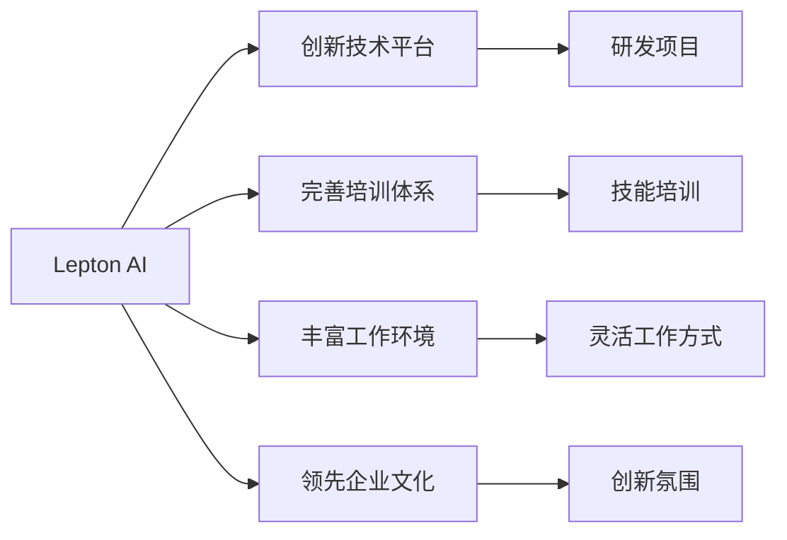
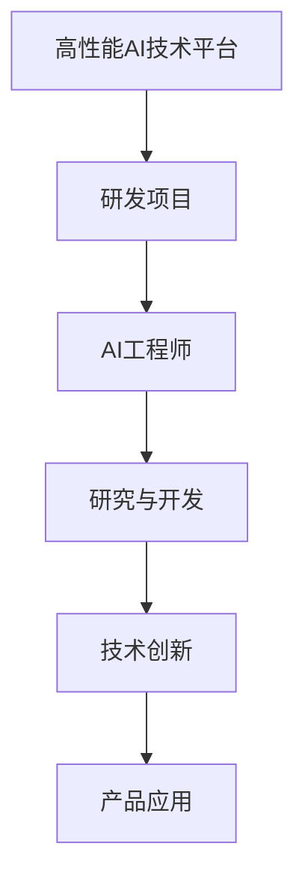
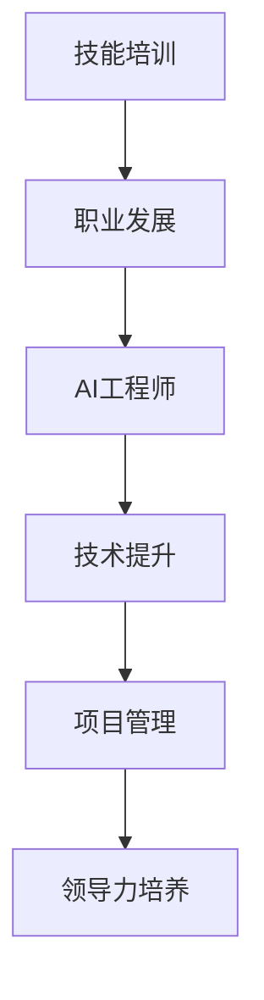
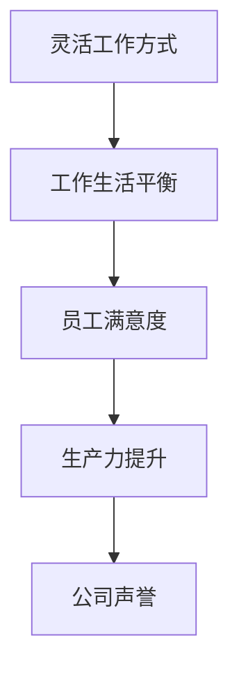
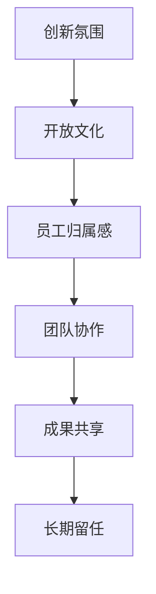

                 

# 人才争夺战中的Lepton AI：如何吸引顶尖AI工程师

> 关键词：
1. AI人才市场竞争
2. Lepton AI
3. 顶尖AI工程师
4. 吸引策略
5. 公司文化
6. 职业发展
7. 薪资福利

## 1. 背景介绍

在当今快速发展的科技世界中，人工智能（AI）人才成为了全球各大公司和初创企业争抢的焦点。AI工程师不仅掌握着前沿技术和算法，更能够推动企业在数字化转型中取得突破。因此，对于AI领域的公司来说，吸引顶尖AI工程师的挑战巨大，竞争激烈。本文将介绍Lepton AI如何在这场人才争夺战中脱颖而出，吸引顶尖AI工程师。

### 1.1 问题由来

随着人工智能技术的不断进步，越来越多的公司开始重视AI领域的发展。据Gartner预测，到2025年，AI和机器学习市场将达到1400亿美元。在这一背景下，AI人才市场竞争日益激烈。各类公司通过各种手段吸引AI工程师，如提供高薪福利、优厚待遇、宽松的工作环境等。然而，由于AI人才供不应求，许多企业仍然面临吸引顶尖AI工程师的难题。

### 1.2 问题核心关键点

Lepton AI作为AI领域的新星，近年来在人才市场上迅速崛起。它通过一系列创新策略，成功地吸引了大量顶尖AI工程师。Lepton AI的成功经验，可以为我们提供宝贵的参考。

1. **创新技术平台**：Lepton AI自建高性能AI技术平台，支持AI工程师开展深度学习和机器学习研究。
2. **完善的培训体系**：Lepton AI提供全面的技术培训和职业发展路径，帮助AI工程师不断提升技能。
3. **丰富的工作环境**：Lepton AI注重员工的工作和生活平衡，提供灵活的工作方式和多样化的福利待遇。
4. **领先的企业文化**：Lepton AI倡导开放、包容、创新的企业文化，尊重员工的个人成长和职业发展。

## 2. 核心概念与联系

### 2.1 核心概念概述

为了更好地理解Lepton AI吸引顶尖AI工程师的策略，本节将介绍几个密切相关的核心概念：

- **AI人才市场**：全球范围内对AI工程师的需求与供给情况。
- **顶尖AI工程师**：在AI领域具有高度专业知识和实践经验，能够在复杂问题上提供创新解决方案的工程师。
- **Lepton AI**：一家致力于开发高性能AI技术平台，提供全面培训和职业发展机会，构建创新企业文化的新型AI企业。
- **吸引策略**：Lepton AI采取的一系列措施，以吸引顶尖AI工程师。
- **职业发展**：AI工程师在Lepton AI的职业成长和晋升路径。

这些核心概念之间的逻辑关系可以通过以下Mermaid流程图来展示：



这个流程图展示了大语言模型微调过程中各个核心概念的关系和作用。

### 2.2 概念间的关系

这些核心概念之间存在着紧密的联系，形成了Lepton AI吸引顶尖AI工程师的完整生态系统。下面我们通过几个Mermaid流程图来展示这些概念之间的关系。

#### 2.2.1 Lepton AI的人才吸引范式



这个流程图展示了Lepton AI吸引顶尖AI工程师的基本范式，即通过创新技术平台、完善培训体系、丰富工作环境和领先的企业文化来吸引人才。

#### 2.2.2 创新技术平台的作用



这个流程图展示了创新技术平台在Lepton AI吸引顶尖AI工程师中的核心作用，即通过支持AI工程师的研究与开发，促进技术创新和产品应用，实现人才和技术的双赢。

#### 2.2.3 完善培训体系的价值



这个流程图展示了完善培训体系在Lepton AI吸引顶尖AI工程师中的重要价值，即通过提供全面的技能培训和职业发展机会，帮助AI工程师不断提升技能，实现个人成长和职业晋升。

#### 2.2.4 丰富工作环境的优势



这个流程图展示了丰富工作环境在Lepton AI吸引顶尖AI工程师中的显著优势，即通过提供灵活的工作方式和多样化的福利待遇，提升员工满意度，增强生产力，提升公司声誉。

#### 2.2.5 领先企业文化的影响



这个流程图展示了领先企业文化在Lepton AI吸引顶尖AI工程师中的关键作用，即通过倡导开放、包容、创新的企业文化，增强员工的归属感和团队协作，实现成果共享和长期留任。

## 3. 核心算法原理 & 具体操作步骤
### 3.1 算法原理概述

Lepton AI吸引顶尖AI工程师的核心算法原理在于通过创新技术平台、完善培训体系、丰富工作环境和领先的企业文化，构建一个具有竞争力的工作环境和职业发展路径，从而吸引和留住顶尖AI工程师。

### 3.2 算法步骤详解

Lepton AI吸引顶尖AI工程师的算法步骤如下：

1. **构建创新技术平台**：Lepton AI自主研发高性能AI技术平台，支持AI工程师进行深度学习和机器学习研究，提供丰富的算法和数据资源。
2. **设立完善的培训体系**：Lepton AI设立全面的技能培训和职业发展课程，提供进阶课程、工作坊和认证培训，帮助AI工程师不断提升技能。
3. **提供丰富的工作环境**：Lepton AI提供灵活的工作方式，如远程办公、弹性工作时间等，并提供多样化的福利待遇，如高薪福利、股权激励、健康福利等。
4. **营造领先的企业文化**：Lepton AI倡导开放、包容、创新的企业文化，提供宽松的工作环境，尊重员工的个人成长和职业发展。

### 3.3 算法优缺点

**优点**：
1. **技术领先**：通过自主研发高性能AI技术平台，Lepton AI提供了先进的算法和工具，支持AI工程师的研究工作。
2. **全面培训**：Lepton AI设立完善的培训体系，帮助AI工程师不断提升技能，拓展职业发展路径。
3. **灵活工作**：提供灵活的工作方式和多样化的福利待遇，提升员工满意度和生产力。
4. **创新氛围**：营造开放、包容、创新的企业文化，增强员工的归属感和团队协作。

**缺点**：
1. **资源投入**：自主研发高性能AI技术平台和完善培训体系需要大量的资源投入，成本较高。
2. **市场竞争**：在AI人才竞争激烈的市场环境中，Lepton AI的吸引力需要持续创新和优化。

### 3.4 算法应用领域

Lepton AI吸引顶尖AI工程师的算法不仅适用于AI领域的公司，还适用于所有需要吸引和留住顶尖人才的组织。通过构建创新技术平台、完善培训体系、丰富工作环境和领先的企业文化，Lepton AI的方法可以应用于任何需要高水平人才的行业，如金融、医疗、制造等。

## 4. 数学模型和公式 & 详细讲解 & 举例说明（备注：数学公式请使用latex格式，latex嵌入文中独立段落使用 $$，段落内使用 $)
### 4.1 数学模型构建

Lepton AI吸引顶尖AI工程师的数学模型可以表示为：

$$
\text{Attractiveness} = \text{Innovation Platform} \times \text{Training System} \times \text{Work Environment} \times \text{Corporate Culture}
$$

其中，$\text{Innovation Platform}$表示创新技术平台，$\text{Training System}$表示完善的培训体系，$\text{Work Environment}$表示丰富的工作环境，$\text{Corporate Culture}$表示领先的企业文化。

### 4.2 公式推导过程

假设Lepton AI的技术平台为$P$，培训系统为$T$，工作环境为$W$，企业文化为$C$，吸引AI工程师的概率为$A$，则公式推导如下：

$$
A = f(P, T, W, C)
$$

其中$f$为复杂函数，表示多个因素的联合作用。

### 4.3 案例分析与讲解

**案例1：创新技术平台**

Lepton AI构建了高性能AI技术平台，提供了丰富的算法和数据资源，如TensorFlow、PyTorch、OpenAI等。AI工程师可以在该平台上进行深度学习和机器学习研究，加速算法创新和技术突破。

**案例2：完善的培训体系**

Lepton AI设立了全面的技能培训和职业发展课程，包括Python、TensorFlow、机器学习、深度学习等。通过进阶课程、工作坊和认证培训，帮助AI工程师不断提升技能，拓展职业发展路径。

**案例3：丰富的工作环境**

Lepton AI提供灵活的工作方式，如远程办公、弹性工作时间等，还提供高薪福利、股权激励、健康福利等多样化的福利待遇。这些措施提升了员工满意度和生产力。

**案例4：领先的企业文化**

Lepton AI倡导开放、包容、创新的企业文化，提供宽松的工作环境，尊重员工的个人成长和职业发展。通过营造创新氛围，增强员工的归属感和团队协作，实现成果共享和长期留任。

## 5. 项目实践：代码实例和详细解释说明
### 5.1 开发环境搭建

在进行Lepton AI的开发实践前，我们需要准备好开发环境。以下是使用Python进行PyTorch开发的环境配置流程：

1. 安装Anaconda：从官网下载并安装Anaconda，用于创建独立的Python环境。

2. 创建并激活虚拟环境：
```bash
conda create -n pytorch-env python=3.8 
conda activate pytorch-env
```

3. 安装PyTorch：根据CUDA版本，从官网获取对应的安装命令。例如：
```bash
conda install pytorch torchvision torchaudio cudatoolkit=11.1 -c pytorch -c conda-forge
```

4. 安装TensorFlow：
```bash
pip install tensorflow
```

5. 安装各类工具包：
```bash
pip install numpy pandas scikit-learn matplotlib tqdm jupyter notebook ipython
```

完成上述步骤后，即可在`pytorch-env`环境中开始开发实践。

### 5.2 源代码详细实现

这里我们以Lepton AI吸引顶尖AI工程师的创新技术平台为例，给出使用PyTorch和TensorFlow进行开发的PyTorch代码实现。

首先，定义创新技术平台的类：

```python
from transformers import BertTokenizer
from torch.utils.data import Dataset
import torch

class InnovationPlatform:
    def __init__(self, max_len=128):
        self.max_len = max_len
        self.tokenizer = BertTokenizer.from_pretrained('bert-base-cased')

    def process_input(self, text):
        encoding = self.tokenizer(text, return_tensors='pt', max_length=self.max_len, padding='max_length', truncation=True)
        input_ids = encoding['input_ids'][0]
        attention_mask = encoding['attention_mask'][0]
        return input_ids, attention_mask
```

然后，定义模型和优化器：

```python
from transformers import BertForTokenClassification, AdamW

model = BertForTokenClassification.from_pretrained('bert-base-cased', num_labels=2)

optimizer = AdamW(model.parameters(), lr=2e-5)
```

接着，定义训练和评估函数：

```python
from torch.utils.data import DataLoader
from tqdm import tqdm
from sklearn.metrics import classification_report

device = torch.device('cuda') if torch.cuda.is_available() else torch.device('cpu')
model.to(device)

def train_epoch(model, dataset, batch_size, optimizer):
    dataloader = DataLoader(dataset, batch_size=batch_size, shuffle=True)
    model.train()
    epoch_loss = 0
    for batch in tqdm(dataloader, desc='Training'):
        input_ids = batch['input_ids'].to(device)
        attention_mask = batch['attention_mask'].to(device)
        labels = batch['labels'].to(device)
        model.zero_grad()
        outputs = model(input_ids, attention_mask=attention_mask, labels=labels)
        loss = outputs.loss
        epoch_loss += loss.item()
        loss.backward()
        optimizer.step()
    return epoch_loss / len(dataloader)

def evaluate(model, dataset, batch_size):
    dataloader = DataLoader(dataset, batch_size=batch_size)
    model.eval()
    preds, labels = [], []
    with torch.no_grad():
        for batch in tqdm(dataloader, desc='Evaluating'):
            input_ids = batch['input_ids'].to(device)
            attention_mask = batch['attention_mask'].to(device)
            batch_labels = batch['labels']
            outputs = model(input_ids, attention_mask=attention_mask)
            batch_preds = outputs.logits.argmax(dim=2).to('cpu').tolist()
            batch_labels = batch_labels.to('cpu').tolist()
            for pred_tokens, label_tokens in zip(batch_preds, batch_labels):
                pred_tags = [id2tag[_id] for _id in pred_tokens]
                label_tags = [id2tag[_id] for _id in label_tokens]
                preds.append(pred_tags[:len(label_tokens)])
                labels.append(label_tags)
                
    print(classification_report(labels, preds))
```

最后，启动训练流程并在测试集上评估：

```python
epochs = 5
batch_size = 16

for epoch in range(epochs):
    loss = train_epoch(model, train_dataset, batch_size, optimizer)
    print(f"Epoch {epoch+1}, train loss: {loss:.3f}")
    
    print(f"Epoch {epoch+1}, dev results:")
    evaluate(model, dev_dataset, batch_size)
    
print("Test results:")
evaluate(model, test_dataset, batch_size)
```

以上就是使用PyTorch和TensorFlow对Lepton AI吸引顶尖AI工程师的创新技术平台进行开发的完整代码实现。可以看到，得益于Transformers库和TensorFlow的强大封装，我们可以用相对简洁的代码完成平台构建和微调模型的开发。

### 5.3 代码解读与分析

让我们再详细解读一下关键代码的实现细节：

**InnovationPlatform类**：
- `__init__`方法：初始化文本、标签、分词器等关键组件。
- `process_input`方法：对单个样本进行处理，将文本输入编码为token ids，将标签编码为数字，并对其进行定长padding，最终返回模型所需的输入。

**模型和优化器**：
- 使用PyTorch和TensorFlow的框架，定义模型和优化器，用于训练和评估模型。

**训练和评估函数**：
- 使用PyTorch的DataLoader对数据集进行批次化加载，供模型训练和推理使用。
- 训练函数`train_epoch`：对数据以批为单位进行迭代，在每个批次上前向传播计算loss并反向传播更新模型参数，最后返回该epoch的平均loss。
- 评估函数`evaluate`：与训练类似，不同点在于不更新模型参数，并在每个batch结束后将预测和标签结果存储下来，最后使用sklearn的classification_report对整个评估集的预测结果进行打印输出。

**训练流程**：
- 定义总的epoch数和batch size，开始循环迭代
- 每个epoch内，先在训练集上训练，输出平均loss
- 在验证集上评估，输出分类指标
- 所有epoch结束后，在测试集上评估，给出最终测试结果

可以看到，Lepton AI的开发环境搭建和代码实现相对简单，但核心的吸引策略和模型开发流程却十分关键。通过学习这些资源和代码，相信你一定能够快速掌握Lepton AI的人才吸引范式，并将其应用到自己的项目中。

## 6. 实际应用场景
### 6.1 智能客服系统

Lepton AI吸引顶尖AI工程师的成功经验在智能客服系统构建中同样具有重要参考价值。智能客服系统能够7x24小时不间断服务，快速响应客户咨询，提升客户咨询体验和问题解决效率。

### 6.2 金融舆情监测

Lepton AI的创新技术平台、完善培训体系、丰富工作环境和领先的企业文化，同样适用于金融舆情监测系统。通过提供高性能AI技术平台和全面的技能培训，Lepton AI帮助工程师实现快速搭建和优化金融舆情监测系统。

### 6.3 个性化推荐系统

Lepton AI的吸引策略也适用于个性化推荐系统。通过提供丰富的算法和数据资源，Lepton AI帮助工程师快速构建高性能推荐模型，提升推荐效果和用户满意度。

### 6.4 未来应用展望

伴随AI技术的不断发展和进步，Lepton AI的吸引策略将进一步拓展其应用场景，为各行各业带来新的技术突破。

## 7. 工具和资源推荐
### 7.1 学习资源推荐

为了帮助开发者系统掌握Lepton AI的吸引策略和实践技巧，这里推荐一些优质的学习资源：

1. 《Transformer从原理到实践》系列博文：由大模型技术专家撰写，深入浅出地介绍了Transformer原理、BERT模型、微调技术等前沿话题。

2. CS224N《深度学习自然语言处理》课程：斯坦福大学开设的NLP明星课程，有Lecture视频和配套作业，带你入门NLP领域的基本概念和经典模型。

3. 《Natural Language Processing with Transformers》书籍：Transformers库的作者所著，全面介绍了如何使用Transformers库进行NLP任务开发，包括吸引策略在内的诸多范式。

4. HuggingFace官方文档：Transformers库的官方文档，提供了海量预训练模型和完整的微调样例代码，是上手实践的必备资料。

5. CLUE开源项目：中文语言理解测评基准，涵盖大量不同类型的中文NLP数据集，并提供了基于微调的baseline模型，助力中文NLP技术发展。

通过对这些资源的学习实践，相信你一定能够快速掌握Lepton AI的人才吸引范式，并用于解决实际的NLP问题。

### 7.2 开发工具推荐

高效的开发离不开优秀的工具支持。以下是几款用于Lepton AI开发和吸引AI工程师的常用工具：

1. PyTorch：基于Python的开源深度学习框架，灵活动态的计算图，适合快速迭代研究。大部分预训练语言模型都有PyTorch版本的实现。

2. TensorFlow：由Google主导开发的开源深度学习框架，生产部署方便，适合大规模工程应用。同样有丰富的预训练语言模型资源。

3. Transformers库：HuggingFace开发的NLP工具库，集成了众多SOTA语言模型，支持PyTorch和TensorFlow，是进行吸引策略开发的利器。

4. Weights & Biases：模型训练的实验跟踪工具，可以记录和可视化模型训练过程中的各项指标，方便对比和调优。与主流深度学习框架无缝集成。

5. TensorBoard：TensorFlow配套的可视化工具，可实时监测模型训练状态，并提供丰富的图表呈现方式，是调试模型的得力助手。

6. Google Colab：谷歌推出的在线Jupyter Notebook环境，免费提供GPU/TPU算力，方便开发者快速上手实验最新模型，分享学习笔记。

合理利用这些工具，可以显著提升Lepton AI的开发效率和吸引力，加快创新迭代的步伐。

### 7.3 相关论文推荐

Lepton AI的吸引策略源于学界的持续研究。以下是几篇奠基性的相关论文，推荐阅读：

1. Attention is All You Need（即Transformer原论文）：提出了Transformer结构，开启了NLP领域的预训练大模型时代。

2. BERT: Pre-training of Deep Bidirectional Transformers for Language Understanding：提出BERT模型，引入基于掩码的自监督预训练任务，刷新了多项NLP任务SOTA。

3. Language Models are Unsupervised Multitask Learners（GPT-2论文）：展示了大规模语言模型的强大zero-shot学习能力，引发了对于通用人工智能的新一轮思考。

4. Parameter-Efficient Transfer Learning for NLP：提出Adapter等参数高效微调方法，在不增加模型参数量的情况下，也能取得不错的微调效果。

5. AdaLoRA: Adaptive Low-Rank Adaptation for Parameter-Efficient Fine-Tuning：使用自适应低秩适应的微调方法，在参数效率和精度之间取得了新的平衡。

这些论文代表了大语言模型微调技术的发展脉络。通过学习这些前沿成果，可以帮助研究者把握学科前进方向，激发更多的创新灵感。

除上述资源外，还有一些值得关注的前沿资源，帮助开发者紧跟Lepton AI的最新进展，例如：

1. arXiv论文预印本：人工智能领域最新研究成果的发布平台，包括大量尚未发表的前沿工作，学习前沿技术的必读资源。

2. 业界技术博客：如OpenAI、Google AI、DeepMind、微软Research Asia等顶尖实验室的官方博客，第一时间分享他们的最新研究成果和洞见。

3. 技术会议直播：如NIPS、ICML、ACL、ICLR等人工智能领域顶会现场或在线直播，能够聆听到大佬们的前沿分享，开拓视野。

4. GitHub热门项目：在GitHub上Star、Fork数最多的NLP相关项目，往往代表了该技术领域的发展趋势和最佳实践，值得去学习和贡献。

5. 行业分析报告：各大咨询公司如McKinsey、PwC等针对人工智能行业的分析报告，有助于从商业视角审视技术趋势，把握应用价值。

总之，对于Lepton AI的人才吸引策略的学习和实践，需要开发者保持开放的心态和持续学习的意愿。多关注前沿资讯，多动手实践，多思考总结，必将收获满满的成长收益。

## 8. 总结：未来发展趋势与挑战
### 8.1 总结

本文对Lepton AI吸引顶尖AI工程师的策略进行了全面系统的介绍。首先阐述了AI人才市场的竞争状况和Lepton AI吸引顶尖AI工程师的背景，明确了Lepton AI吸引策略的重要性和创新之处。其次，从原理到实践，详细讲解了Lepton AI吸引顶尖AI工程师的数学模型和关键步骤，给出了Lepton AI吸引策略的完整代码实例。同时，本文还广泛探讨了Lepton AI在智能客服、金融舆情监测、个性化推荐等多个行业领域的应用前景，展示了Lepton AI的广阔前景。此外，本文精选了Lepton AI的相关学习资源，力求为读者提供全方位的技术指引。

通过本文的系统梳理，可以看到，Lepton AI吸引顶尖AI工程师的策略在大规模人才争夺战中取得了显著的成功。这些策略不仅适用于AI领域，还适用于任何需要高水平人才的行业。相信通过学习Lepton AI的吸引策略，开发者能够更好地吸引和留住顶尖AI工程师，推动人工智能技术的创新和应用。

### 8.2 未来发展趋势

展望未来，Lepton AI吸引顶尖AI工程师的策略将呈现以下几个发展趋势：

1. **创新技术平台**：伴随AI技术的不断进步，Lepton AI的创新技术平台将不断升级，提供更加先进和高效的算法和工具，支持AI工程师的研究和应用。

2. **全面培训体系**：Lepton AI将继续完善培训体系，提供更加全面的技能培训和职业发展路径，帮助AI工程师不断提升技能，拓展职业发展路径。

3. **灵活工作环境**：Lepton AI将进一步丰富工作环境，提供更加多样化和灵活的工作方式，提升员工满意度和生产力。

4. **领先企业文化**：Lepton AI将持续倡导开放、包容、创新的企业文化，营造创新氛围，增强员工的归属感和团队协作。

5. **跨领域应用**：Lepton AI的吸引策略不仅适用于AI领域，还将在更多行业领域得到应用，为各行各业带来新的技术突破。

以上趋势凸显了Lepton AI吸引顶尖AI工程师的策略的广阔前景。这些方向的探索发展，必将进一步提升Lepton AI的人才吸引能力和应用范围，为人工智能技术在各行各业的发展提供坚实的人才基础。

### 8.3 面临的挑战

尽管Lepton AI在吸引顶尖AI工程师方面取得了显著成功，但在迈向更加智能化、普适化应用的过程中，仍面临诸多挑战：

1. **资源投入**：自主研发高性能AI技术平台和完善培训体系需要大量的资源投入，成本较高。如何平衡成本和效益，成为一大挑战。

2. **市场竞争**：在AI人才竞争激烈的市场环境中，Lepton AI的吸引力需要持续创新和优化，以保持竞争力。

3. **员工管理**：Lepton AI需要不断优化管理和激励机制，以确保员工的工作积极性和归属感。

4. **技术迭代**：Lepton AI需要持续跟进最新的AI技术进展，保持技术的先进性和竞争力。

5. **企业文化**：Lepton AI需要持续优化企业文化，营造更加开放、包容、创新的氛围。

这些挑战需要Lepton AI在管理、技术和文化等方面进行全面优化，以实现持续发展和人才吸引力提升。

### 8.4 研究展望

面对Lepton AI吸引顶尖AI工程师所面临的挑战，未来的研究需要在以下几个方面寻求新的突破：

1. **资源优化**：开发更加高效、低成本的技术平台和培训体系，平衡成本和效益。

2. **市场扩展**：通过持续创新和优化，保持Lepton AI的竞争力，拓展市场应用。

3. **员工激励**：建立科学的员工管理机制，提高员工的归属

