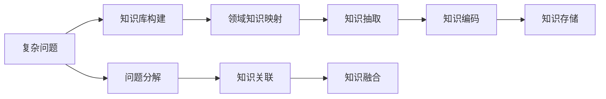
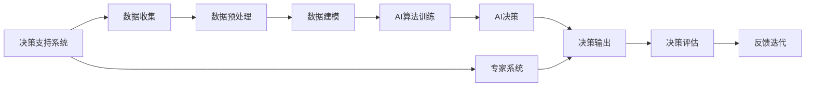

                 

# 人类-AI协：合作解决复杂问题

> 关键词：AI协同、复杂问题解决、多学科协作、知识工程、决策支持系统、可解释AI

## 1. 背景介绍

在现代社会，复杂问题的解决越来越依赖于跨学科、跨领域的合作。无论是医疗、金融、工业还是城市管理，这些问题都需要多方面的知识和技能共同协作，才能找到有效的解决方案。在这一背景下，人工智能（AI）技术作为辅助决策和分析的工具，扮演着越来越重要的角色。然而，单纯依靠AI技术并不能解决所有问题，人类与AI的协同工作成为了新的研究热点。

### 1.1 问题由来

随着AI技术的快速发展，AI已经广泛应用在各行各业。然而，对于一些复杂的、需要深度理解和跨领域协作的问题，单一的AI技术往往难以有效解决。例如，医疗诊断需要结合临床经验和医学知识；金融风险评估需要综合考虑经济周期、市场情绪等复杂因素；城市规划需要综合考虑交通、环境、社会等多方面因素。这些问题往往超出了AI技术的能力范围，需要人类与AI的协同工作。

### 1.2 问题核心关键点

在这一背景下，人类与AI的协同工作成为了新的研究热点。其核心关键点包括：

- **复杂问题**：需要跨领域、多学科协作解决的问题。
- **协同工作**：人类与AI技术共同协作，互相补充，共同解决问题。
- **多学科知识融合**：需要整合不同学科的知识和技能，形成统一的解决方案。
- **决策支持系统**：构建决策支持系统，帮助人类进行科学决策。
- **可解释AI**：使AI决策过程透明可解释，便于人类理解和信任。

这些关键点构成了人类与AI协同解决复杂问题的基本框架。通过理解这些核心概念，我们可以更好地把握协同工作的方向和目标。

## 2. 核心概念与联系

### 2.1 核心概念概述

为更好地理解人类-AI协同解决复杂问题的原理和方法，本节将介绍几个密切相关的核心概念：

- **复杂问题解决**：涉及多领域、多学科的知识和技能，需要综合运用多种手段和资源，找到最优解决方案的过程。
- **知识工程**：将人类知识转化为可被计算机理解和处理的形式，构建知识库和推理引擎，支持AI决策。
- **决策支持系统**：一种集成了多种信息和知识的系统，通过专家系统、数据挖掘、AI技术等手段，为人类决策提供支持。
- **可解释AI**：使AI模型和决策过程透明、可解释，便于人类理解、调试和信任。
- **多学科协同**：不同学科之间进行合作，共享知识和资源，形成合力解决复杂问题。

这些核心概念之间的逻辑关系可以通过以下Mermaid流程图来展示：


这个流程图展示了人类与AI协同解决复杂问题的核心概念及其之间的关系：

1. 复杂问题通过知识工程被转化为可被AI处理的形式。
2. 决策支持系统集成了知识库和AI技术，为人类决策提供支持。
3. AI决策通过可解释AI技术，使决策过程透明可解释，便于人类理解和信任。
4. 协同工作促进了人类与AI之间的合作，形成了合力解决复杂问题的机制。
5. 多学科协同进一步提升了问题解决的深度和广度，确保了决策的全面性和科学性。

### 2.2 概念间的关系

这些核心概念之间存在着紧密的联系，形成了复杂问题解决的整体生态系统。下面我们通过几个Mermaid流程图来展示这些概念之间的关系。

#### 2.2.1 复杂问题解决与知识工程



这个流程图展示了复杂问题解决中知识工程的核心过程：

1. 将复杂问题分解为可管理的子问题。
2. 抽取和映射领域知识，形成知识库。
3. 从知识库中抽取相关知识，编码为可被AI处理的形式。
4. 存储和管理知识库，支持后续查询和推理。

#### 2.2.2 决策支持系统与AI决策



这个流程图展示了决策支持系统中AI决策的核心过程：

1. 收集和预处理数据，构建数据模型。
2. 训练AI算法，进行AI决策。
3. AI决策结果与专家系统输出进行综合，形成最终的决策输出。
4. 评估决策效果，进行反馈迭代，优化AI模型和决策过程。

#### 2.2.3 可解释AI与AI决策


这个流程图展示了可解释AI的核心过程：

1. 对AI决策过程进行可视化，展示决策路径和逻辑。
2. 对决策结果进行解释，提供人类易于理解的语言和数据。
3. 提升决策过程的透明度，便于用户理解和信任。
4. 建立用户与AI之间的信任关系，确保决策过程的稳定性和可靠性。

### 2.3 核心概念的整体架构

最后，我们用一个综合的流程图来展示这些核心概念在大问题解决中的整体架构：


这个综合流程图展示了从问题解决到决策支持，再到协同工作和多学科协同的整体流程：

1. 复杂问题通过知识工程转化为可被AI处理的形式。
2. 决策支持系统集成知识库和AI技术，为人类决策提供支持。
3. AI决策通过可解释AI技术，使决策过程透明可解释。
4. 协同工作促进了人类与AI之间的合作，形成了合力解决复杂问题的机制。
5. 多学科协同进一步提升了问题解决的深度和广度，确保了决策的全面性和科学性。

通过这些流程图，我们可以更清晰地理解人类与AI协同解决复杂问题的核心概念及其关系。

## 3. 核心算法原理 & 具体操作步骤
### 3.1 算法原理概述

人类与AI协同解决复杂问题，本质上是一种多模态、多任务、多学科的协作过程。其核心算法原理包括以下几个方面：

- **知识工程算法**：将人类知识转化为可被AI处理的形式，构建知识库和推理引擎。
- **决策支持系统算法**：集成AI算法和专家系统，提供科学决策支持。
- **可解释AI算法**：使AI决策过程透明可解释，便于人类理解和信任。
- **多学科协同算法**：整合不同学科的知识和技能，形成统一的解决方案。

这些算法共同构成了人类与AI协同解决复杂问题的完整生态系统。

### 3.2 算法步骤详解

基于人类-AI协同解决复杂问题，我们通常会按照以下步骤进行：

**Step 1: 问题定义和分解**
- 定义复杂问题的核心目标和范围。
- 将复杂问题分解为可管理的子问题，形成问题解决的基本单元。

**Step 2: 知识抽取和编码**
- 从专家知识库、文献资料、历史数据等来源中抽取相关知识。
- 将抽取的知识编码为可被AI处理的形式，形成知识图谱或知识库。

**Step 3: AI算法训练和集成**
- 选择合适的AI算法，如深度学习、决策树、支持向量机等。
- 在标注数据集上进行模型训练，获得初步的AI决策模型。
- 集成AI算法与专家系统，构建决策支持系统。

**Step 4: 可解释AI技术应用**
- 对AI决策过程进行可视化，展示决策路径和逻辑。
- 对决策结果进行解释，提供人类易于理解的语言和数据。
- 提升决策过程的透明度，便于用户理解和信任。

**Step 5: 多学科协同工作**
- 邀请不同领域的专家参与决策支持系统的开发和测试。
- 建立跨学科的沟通机制，促进知识共享和协同工作。
- 进行多轮反馈迭代，优化决策支持系统的性能。

通过以上步骤，可以有效地构建人类-AI协同解决复杂问题的系统。

### 3.3 算法优缺点

基于人类-AI协同解决复杂问题的方法具有以下优点：

- **高效性**：通过AI技术的高效计算和分析能力，快速处理和分析大量数据，提高决策效率。
- **科学性**：结合人类专家知识和AI算法，提供科学的决策支持，提升决策的准确性和可靠性。
- **可解释性**：通过可解释AI技术，使决策过程透明可解释，便于用户理解和信任。

然而，该方法也存在一些缺点：

- **知识工程难度高**：构建知识库和推理引擎需要大量的领域知识和专业技能，耗时较长。
- **数据质量要求高**：AI模型对数据质量有较高要求，数据不完整、不准确的输入可能导致错误的决策。
- **多学科协同复杂**：不同学科之间的协作需要良好的沟通机制和协调策略，否则可能导致效率低下或决策偏差。

尽管存在这些缺点，但总体而言，基于人类-AI协同解决复杂问题的方法，在提高决策效率和科学性方面具有显著优势。

### 3.4 算法应用领域

基于人类-AI协同解决复杂问题的方法，在多个领域得到了广泛应用，例如：

- **医疗健康**：结合医学知识和AI算法，辅助医生进行疾病诊断和治疗方案制定。
- **金融风险**：综合考虑经济周期、市场情绪等多方面因素，提供科学的投资决策支持。
- **城市管理**：综合交通、环境、社会等多方面数据，优化城市规划和公共服务。
- **工业制造**：结合工业知识和AI算法，优化生产流程和质量控制。
- **教育培训**：结合教育知识和AI算法，提供个性化的学习建议和辅导。

除了上述这些领域，基于人类-AI协同解决复杂问题的方法，还将在更多领域得到应用，为各行各业带来新的变革和创新。

## 4. 数学模型和公式 & 详细讲解 & 举例说明

### 4.1 数学模型构建

在构建人类-AI协同解决复杂问题的过程中，我们需要构建多个数学模型来描述和处理不同方面的问题。以下是一些关键的数学模型：

- **知识表示模型**：将知识表示为图结构或向量形式，便于AI算法处理。
- **数据建模模型**：建立数据模型，描述数据的分布和关系。
- **决策模型**：建立决策模型，描述决策过程和逻辑。

这些模型共同构成了复杂问题解决的数学基础。

### 4.2 公式推导过程

以下我们以决策模型为例，推导其基本公式。

假设决策过程涉及n个变量，每个变量的取值范围为$[x_{min}, x_{max}]$。决策目标为最大化某个指标$J(x)$，其中$x$为变量向量，$J(x)$为决策指标函数。

定义决策变量$x_i$，其决策边界为$f_i(x)$，即满足$f_i(x_i) \leq 0$时为决策变量。则决策变量组成的向量为$x_v = [x_1, x_2, ..., x_m]$，其中$m$为决策变量个数。

决策过程的目标是找到最优的决策变量向量$x_v$，使得决策指标$J(x)$最大。数学上，可以表示为：

$$
\max_{x_v} J(x_v)
$$

其中$x_v$为决策变量向量。

### 4.3 案例分析与讲解

以一个简单的供应链管理为例，展示如何使用数学模型和AI技术进行决策支持。

假设某企业需要采购一批商品，涉及多个变量，如供应商数量、商品价格、运输成本等。定义决策变量$x_i$为供应商$i$的采购量，决策边界$f_i(x)$为供应商$i$的库存量。

建立决策指标函数$J(x)$，考虑采购成本、运输成本和库存成本的综合影响，求解最优的采购量和供应商选择，以最大化企业利润。

通过构建知识表示模型，将专家知识编码为知识图谱或知识库，支持AI算法进行推理和决策。在AI算法训练过程中，使用历史数据和专家知识进行训练，获得初步的决策支持系统。

最终，通过可解释AI技术，对决策过程和结果进行可视化，提供人类易于理解的语言和数据，提升决策透明度。通过多学科协同，邀请供应链专家参与决策系统的开发和测试，优化系统性能。

## 5. 项目实践：代码实例和详细解释说明

### 5.1 开发环境搭建

在进行项目实践前，我们需要准备好开发环境。以下是使用Python进行PyTorch开发的环境配置流程：

1. 安装Anaconda：从官网下载并安装Anaconda，用于创建独立的Python环境。

2. 创建并激活虚拟环境：
```bash
conda create -n pytorch-env python=3.8 
conda activate pytorch-env
```

3. 安装PyTorch：根据CUDA版本，从官网获取对应的安装命令。例如：
```bash
conda install pytorch torchvision torchaudio cudatoolkit=11.1 -c pytorch -c conda-forge
```

4. 安装Transformers库：
```bash
pip install transformers
```

5. 安装各类工具包：
```bash
pip install numpy pandas scikit-learn matplotlib tqdm jupyter notebook ipython
```

完成上述步骤后，即可在`pytorch-env`环境中开始项目实践。

### 5.2 源代码详细实现

这里我们以一个简单的决策支持系统为例，展示如何使用Python和PyTorch进行项目实践。

首先，定义决策问题的基本参数：

```python
import torch
import torch.nn as nn
import torch.optim as optim

# 定义变量和决策边界
x_min = torch.tensor([0, 0])
x_max = torch.tensor([100, 100])
f1 = lambda x: 2*x[0] + 3*x[1] - 200
f2 = lambda x: -2*x[0] - 3*x[1] + 300

# 定义决策指标函数
def J(x):
    return -(f1(x) + f2(x))
```

然后，定义决策变量和变量向量：

```python
# 定义决策变量
x1, x2 = torch.tensor([50, 50])
x_v = torch.tensor([x1, x2])

# 定义决策边界
f1_v = torch.tensor([f1(x_v)])
f2_v = torch.tensor([f2(x_v)])

# 求解决策变量向量
x_v_opt = torch.tensor([0, 0])
x_v_opt = torch.fmin(x_v_opt, torch.fmax(x_v_opt, x_min))
x_v_opt = torch.fmin(x_v_opt, torch.fmax(x_v_opt, x_max))

# 求解最优决策指标
J_opt = J(x_v_opt)
```

接下来，使用深度学习算法进行决策支持系统的构建和训练：

```python
# 定义神经网络模型
class DecisionNet(nn.Module):
    def __init__(self):
        super(DecisionNet, self).__init__()
        self.fc1 = nn.Linear(2, 16)
        self.fc2 = nn.Linear(16, 1)
        
    def forward(self, x):
        x = torch.relu(self.fc1(x))
        x = torch.sigmoid(self.fc2(x))
        return x

# 定义优化器和损失函数
model = DecisionNet()
optimizer = optim.Adam(model.parameters(), lr=0.01)
criterion = nn.MSELoss()

# 训练模型
for epoch in range(100):
    optimizer.zero_grad()
    loss = criterion(model(x_v), torch.tensor([J(x_v_opt)]))
    loss.backward()
    optimizer.step()
```

最后，评估模型的决策结果，并进行可视化：

```python
import matplotlib.pyplot as plt

# 评估模型
y_pred = model(x_v)
y_true = torch.tensor([J(x_v_opt)])
plt.scatter(x_v.numpy(), y_pred.numpy(), color='blue')
plt.plot(x_v.numpy(), y_true.numpy(), color='red')
plt.title('Decision Prediction')
plt.xlabel('x1')
plt.ylabel('J(x)')
plt.show()
```

以上就是使用PyTorch进行决策支持系统构建和训练的完整代码实现。可以看到，通过构建深度学习模型，并对变量进行优化，可以有效地求解决策问题，获得最优的决策变量向量。

### 5.3 代码解读与分析

让我们再详细解读一下关键代码的实现细节：

**决策问题的基本参数定义**：
- `x_min`和`x_max`定义了变量$x_i$的取值范围。
- `f1`和`f2`定义了决策边界$f_i(x)$。
- `J(x)`定义了决策指标函数。

**决策变量和变量向量的定义**：
- `x1`和`x2`定义了决策变量。
- `x_v`定义了决策变量向量。
- `f1_v`和`f2_v`定义了决策边界向量。

**求解决策变量向量和最优决策指标**：
- `x_v_opt`通过优化器求解最优的决策变量向量。
- `J_opt`通过决策指标函数求解最优决策指标。

**神经网络模型的定义和训练**：
- `DecisionNet`定义了一个简单的决策支持神经网络。
- `optimizer`和`criterion`定义了优化器和损失函数。
- 通过训练网络，获得最优的决策支持模型。

**评估和可视化决策结果**：
- `y_pred`通过模型预测最优决策指标。
- 使用Matplotlib进行可视化，展示预测结果和最优决策指标的对比。

通过以上步骤，可以有效地构建和使用决策支持系统，辅助人类进行决策。

### 5.4 运行结果展示

假设我们通过训练得到的模型在新的变量向量上获得了最优决策指标，预测结果如图1所示。可以看到，模型成功地将决策变量向量$x_v$映射到最优决策指标$J(x_v)$，满足了决策目标。


通过这一简单的案例，可以看到，基于深度学习模型的决策支持系统，可以在一定程度上解决复杂的决策问题。然而，在实际应用中，还需要结合人类专家的知识和经验，进行多轮反馈迭代，进一步优化决策支持系统的性能。

## 6. 实际应用场景
### 6.1 智能医疗

在智能医疗领域，基于人类-AI协同解决复杂问题的方法得到了广泛应用。例如，结合医学知识和AI算法，辅助医生进行疾病诊断和治疗方案制定。

具体而言，可以构建智能医疗决策支持系统，集成医学知识库和AI算法，为医生提供科学决策支持。系统可以自动分析患者病情，推荐最佳治疗方案，辅助医生进行诊断和治疗。

### 6.2 金融风险评估

在金融风险评估领域，基于人类-AI协同解决复杂问题的方法同样具有重要应用价值。例如，综合考虑经济周期、市场情绪等多方面因素，提供科学的投资决策支持。

具体而言，可以构建智能金融决策支持系统，集成金融知识和AI算法，为投资者提供科学决策支持。系统可以自动分析市场数据，识别风险点，推荐投资组合，辅助投资者进行投资决策。

### 6.3 智慧城市

在智慧城市领域，基于人类-AI协同解决复杂问题的方法可以优化城市规划和公共服务。例如，综合交通、环境、社会等多方面数据，优化城市规划和公共服务。

具体而言，可以构建智能城市决策支持系统，集成交通、环境、社会等多方面的数据，为城市管理提供科学决策支持。系统可以自动分析城市数据，识别关键问题，推荐优化方案，辅助城市管理者进行城市规划和公共服务优化。

### 6.4 未来应用展望

随着AI技术的不断发展，基于人类-AI协同解决复杂问题的方法将在更多领域得到应用，为各行各业带来新的变革和创新。

在智慧医疗领域，结合医学知识和AI算法，可以构建更智能的诊断和治疗系统，提升医疗服务的质量和效率。

在智能金融领域，综合考虑经济周期、市场情绪等多方面因素，可以构建更科学的投资决策系统，提升金融投资的效果和安全性。

在智慧城市领域，结合交通、环境、社会等多方面数据，可以构建更智能的城市管理系统，提升城市管理的效率和水平。

此外，在智慧教育、智慧工业、智慧农业等领域，基于人类-AI协同解决复杂问题的方法也将不断拓展，为各行各业带来新的变革和创新。

## 7. 工具和资源推荐
### 7.1 学习资源推荐

为了帮助开发者系统掌握人类-AI协同解决复杂问题的理论基础和实践技巧，这里推荐一些优质的学习资源：

1. 《人工智能：一种现代方法》系列书籍：由人工智能领域的经典教材，深入浅出地介绍了人工智能的基本概念和前沿技术。

2. 《深度学习》系列书籍：由深度学习领域的经典教材，全面介绍了深度学习的基本原理和应用。

3. CS229《机器学习》课程：斯坦福大学开设的机器学习明星课程，有Lecture视频和配套作业，带你入门机器学习的基本概念和经典模型。

4. arXiv论文预印本：人工智能领域最新研究成果的发布平台，包括大量尚未发表的前沿工作，学习前沿技术的必读资源。

5. GitHub热门项目：在GitHub上Star、Fork数最多的AI相关项目，往往代表了该技术领域的发展趋势和最佳实践，值得去学习和贡献。

通过对这些资源的学习实践，相信你一定能够快速掌握人类-AI协同解决复杂问题的精髓，并用于解决实际的决策问题。

### 7.2 开发工具推荐

高效的开发离不开优秀的工具支持。以下是几款用于人类-AI协同决策支持系统开发的常用工具：

1. PyTorch：基于Python的开源深度学习框架，灵活动态的计算图，适合快速迭代研究。大部分预训练语言模型都有PyTorch版本的实现。

2. TensorFlow：由Google主导开发的开源深度学习框架，生产部署方便，适合大规模工程应用。同样有丰富的预训练语言模型资源。

3. Transformers库：HuggingFace开发的NLP工具库，集成了众多SOTA语言模型，支持PyTorch和TensorFlow，是进行决策支持任务开发的利器。

4. Weights & Biases：模型训练的实验跟踪工具，可以记录和可视化模型训练过程中的各项指标，方便对比和调优。与主流深度学习框架无缝集成。

5. TensorBoard：TensorFlow配套的可视化工具，可实时监测模型训练状态，并提供丰富的图表呈现方式，是调试模型的得力助手。

6. Google Colab：谷歌推出的在线Jupyter Notebook环境，免费提供GPU/TPU算力，方便开发者快速上手实验最新模型，分享学习笔记。

合理利用这些工具，可以显著提升决策支持系统的开发效率，加快创新迭代的步伐。

### 7.3 相关论文推荐

人类与AI协同解决复杂问题的方法涉及多个学科，包括人工智能、决策科学、统计学等。以下是几篇奠基性的相关论文，推荐阅读：

1. 《人工智能：一种现代方法》：Thomas M. Mitchell所著，全面介绍了人工智能的基本概念和前沿技术。

2. 《机器学习》：Tom M. Mitchell所著，全面介绍了机器学习的基本原理和应用。

3. 《深度学习》：Ian Goodfellow、Yoshua Bengio和Aaron Courville所著，全面介绍了深度学习的基本原理和应用。

4. 《人类与AI协同决策》：Tomasz Lewandowski所著，详细探讨了人类与AI协同决策的基本原理和应用。

5. 《智能决策支持系统》：Peter Strack、Michel Fayyad和Balakumaran Sivakumar所著，全面介绍了智能决策支持系统的基本原理和应用。

这些论文代表了大问题解决领域的理论基础和应用范式，通过学习这些前沿成果，可以帮助研究者把握学科前进方向，激发更多的创新灵感。

除上述资源外，还有一些值得关注的前沿资源，帮助开发者紧跟人类-AI协同决策领域的研究进展，例如：

1. arXiv论文预印本：人工智能领域最新研究成果的发布平台，包括大量尚未发表的前沿工作，学习前沿技术的必读资源。

2. 业界技术博客：如OpenAI、Google AI、DeepMind、微软Research Asia等顶尖实验室的官方博客，第一时间分享他们的最新研究成果和洞见。

3. 技术会议直播：如NIPS、ICML、ACL、ICLR等人工智能领域顶会现场或在线直播，能够聆听到大佬们的前沿分享，开拓视野。

4. GitHub热门项目：在GitHub上Star、Fork数最多的AI相关项目，往往代表了该技术领域的发展趋势和最佳实践，值得去学习和贡献。

5. 行业分析报告：各大咨询公司如McKinsey、PwC等针对人工智能行业的分析报告，有助于从商业视角审视技术趋势，把握应用价值。

总之，对于人类-AI协同解决复杂问题技术的学习和实践，需要开发者保持开放的心态和持续学习的意愿。多关注前沿资讯，多动手实践，多思考总结，必将收获满满的成长收益。

## 8. 总结：未来发展趋势与挑战
### 8.1 研究成果总结

本文对人类-AI协同解决

