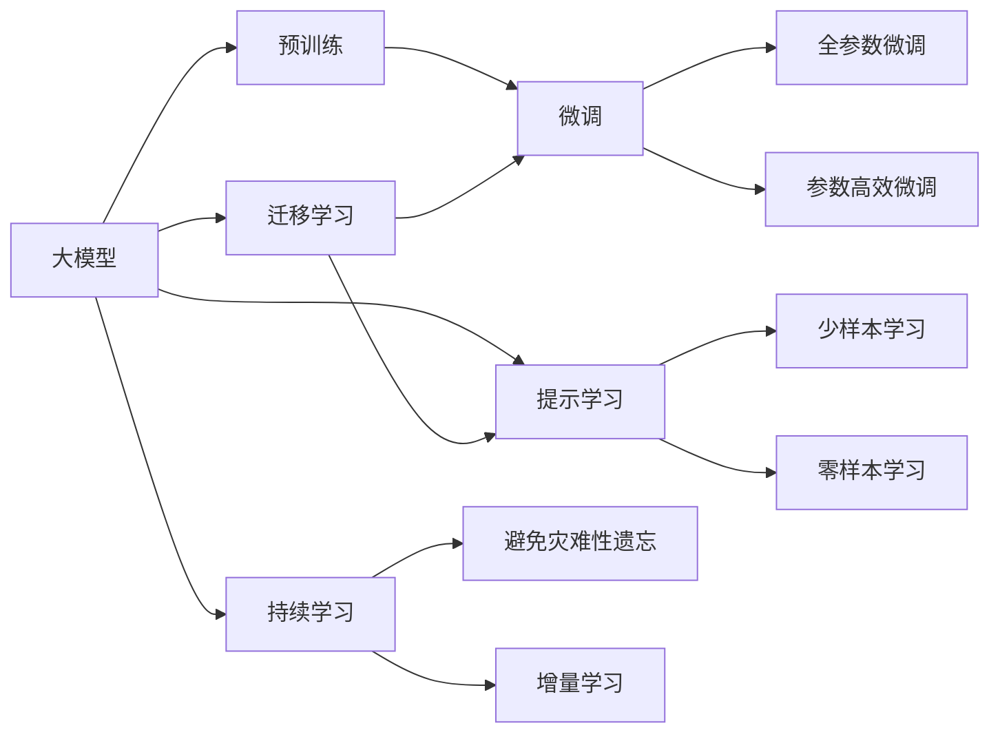

                 

# 从零开始大模型开发与微调：从零开始学习PyTorch 2.0

## 1. 背景介绍

在人工智能的快速发展过程中，大模型（Large Models）逐渐成为主流。相比于传统的基于规则的方法，大模型通过海量的数据训练，具有强大的自适应能力和泛化能力。大模型不仅在图像、语音等传统领域取得优异表现，也在自然语言处理（NLP）等新兴领域大放异彩。

### 1.1 问题由来

近年来，大模型在NLP领域的应用取得了显著进展。例如，GPT-3在多项任务上刷新了SOTA，BERT、T5等大模型也在命名实体识别、问答系统、情感分析等任务中表现出色。但大模型也存在一些问题，如需要大量数据、模型体积大、难以解释等。

为了解决这些问题，人们开始研究大模型的微调（Fine-tuning）技术。微调是指在预训练大模型的基础上，使用少量标注数据进行有监督学习，优化模型在特定任务上的性能。

### 1.2 问题核心关键点

大模型微调的核心在于将预训练大模型的通用能力，转化为针对特定任务的能力。具体步骤如下：

1. 选择合适的预训练模型作为初始化参数。
2. 设计任务适配层，实现从大模型到特定任务的适配。
3. 选择合适的损失函数，用于衡量模型输出与真实标签之间的差异。
4. 训练模型，最小化损失函数。
5. 在测试集上评估模型性能。

大模型微调不仅能够提高模型在特定任务上的性能，还能减少从头训练大模型的时间和成本。

## 2. 核心概念与联系

### 2.1 核心概念概述

为了更好地理解大模型微调技术，我们先介绍一些核心概念：

- 大模型（Large Model）：通过自监督学习训练得到的大型神经网络模型，如BERT、GPT等。
- 预训练（Pre-training）：在大规模无标签数据上，通过自监督任务训练大模型。
- 微调（Fine-tuning）：在大模型上进行有监督学习，优化特定任务上的性能。
- 迁移学习（Transfer Learning）：将一个任务学到的知识，应用到另一个相关任务上。
- 参数高效微调（Parameter-Efficient Fine-tuning, PEFT）：只调整少量模型参数，固定大部分预训练权重。
- 提示学习（Prompt Learning）：通过精心设计的输入文本格式，引导模型进行特定任务推理。
- 少样本学习（Few-shot Learning）：仅使用少量标注样本进行模型训练。
- 零样本学习（Zero-shot Learning）：模型在未见过的任务上，仅根据任务描述，进行推理预测。
- 持续学习（Continual Learning）：模型在不断获得新数据的同时，保持已学知识的稳定。

这些概念之间存在着紧密的联系，形成了一个完整的大模型微调生态系统。

### 2.2 概念间的关系

这些核心概念之间的关系，可以通过以下Mermaid流程图展示：



这个流程图展示了从预训练到微调，再到持续学习的过程。大模型通过预训练获得通用能力，然后通过微调适配特定任务，最后通过持续学习保持模型的稳定和持续进步。

## 3. 核心算法原理 & 具体操作步骤

### 3.1 算法原理概述

大模型微调的基本思想是通过有监督学习，将预训练大模型的通用能力，转化为特定任务的性能。微调的核心在于设计任务适配层，并选择合适的损失函数，通过梯度下降等优化算法，最小化模型输出与真实标签之间的差异。

### 3.2 算法步骤详解

大模型微调的基本步骤如下：

1. 准备预训练模型和数据集。
2. 设计任务适配层，实现模型输出与任务目标的适配。
3. 设置微调超参数，如学习率、批大小等。
4. 执行梯度训练，不断调整模型参数。
5. 在测试集上评估模型性能。

下面我们详细讲解每个步骤。

#### 3.2.1 准备预训练模型和数据集

首先需要选择合适的预训练模型作为初始化参数。常见的预训练模型包括BERT、GPT等。

```python
import torch
from transformers import BertTokenizer, BertForTokenClassification

tokenizer = BertTokenizer.from_pretrained('bert-base-cased')
model = BertForTokenClassification.from_pretrained('bert-base-cased', num_labels=2)
```

然后，准备下游任务的数据集。数据集需要包含样本、标签、tokenizer等。

```python
from torch.utils.data import Dataset, DataLoader

class MyDataset(Dataset):
    def __init__(self, texts, labels):
        self.texts = texts
        self.labels = labels
        self.tokenizer = tokenizer
        
    def __len__(self):
        return len(self.texts)
        
    def __getitem__(self, idx):
        text = self.texts[idx]
        label = self.labels[idx]
        encoding = self.tokenizer(text, return_tensors='pt', padding='max_length', truncation=True)
        return {'input_ids': encoding['input_ids'], 'attention_mask': encoding['attention_mask'], 'labels': label}
        
train_dataset = MyDataset(train_texts, train_labels)
val_dataset = MyDataset(val_texts, val_labels)
test_dataset = MyDataset(test_texts, test_labels)
```

#### 3.2.2 设计任务适配层

根据下游任务，设计合适的任务适配层，将预训练模型的输出，转化为任务所需的输出。例如，对于文本分类任务，可以添加一个线性分类器。

```python
from transformers import BertForTokenClassification

model = BertForTokenClassification.from_pretrained('bert-base-cased', num_labels=num_labels)
```

#### 3.2.3 设置微调超参数

设置微调超参数，包括优化器、学习率、批大小等。

```python
from transformers import AdamW

optimizer = AdamW(model.parameters(), lr=2e-5)
```

#### 3.2.4 执行梯度训练

执行梯度训练，不断调整模型参数。

```python
device = 'cuda'
model.to(device)

for epoch in range(num_epochs):
    for batch in DataLoader(train_dataset, batch_size=batch_size, shuffle=True):
        input_ids = batch['input_ids'].to(device)
        attention_mask = batch['attention_mask'].to(device)
        labels = batch['labels'].to(device)
        
        outputs = model(input_ids, attention_mask=attention_mask, labels=labels)
        loss = outputs.loss
        loss.backward()
        optimizer.step()
```

#### 3.2.5 评估模型性能

在测试集上评估模型性能，可以使用各种评估指标。

```python
def evaluate(model, dataset):
    model.eval()
    with torch.no_grad():
        predictions = []
        labels = []
        for batch in DataLoader(dataset, batch_size=batch_size):
            input_ids = batch['input_ids'].to(device)
            attention_mask = batch['attention_mask'].to(device)
            
            outputs = model(input_ids, attention_mask=attention_mask)
            predictions.extend(outputs.logits.argmax(dim=2).cpu().numpy().tolist())
            labels.extend(batch['labels'].cpu().numpy().tolist())
        
        return classification_report(labels, predictions)

print(evaluate(model, test_dataset))
```

### 3.3 算法优缺点

大模型微调有以下优点：

- 简单高效：只需要少量标注数据，即可快速适配特定任务。
- 通用适用：适用于各种NLP任务，如文本分类、命名实体识别、情感分析等。
- 参数高效：仅调整少量参数，固定大部分预训练权重。

同时，大模型微调也存在一些缺点：

- 依赖标注数据：微调效果很大程度上取决于标注数据的质量和数量，获取高质量标注数据的成本较高。
- 迁移能力有限：当目标任务与预训练数据的分布差异较大时，微调的性能提升有限。
- 负面效果传递：预训练模型的固有偏见、有害信息等，可能通过微调传递到下游任务，造成负面影响。
- 可解释性不足：微调模型的决策过程通常缺乏可解释性，难以对其推理逻辑进行分析和调试。

## 4. 数学模型和公式 & 详细讲解

### 4.1 数学模型构建

大模型微调可以形式化表示为以下数学模型：

- 大模型：$M_{\theta}$
- 标注数据集：$D=\{(x_i,y_i)\}_{i=1}^N$
- 损失函数：$\mathcal{L}(\theta)$
- 微调目标：$\theta^* = \arg\min_\theta \mathcal{L}(\theta)$

其中，$x_i$表示输入，$y_i$表示标签，$\theta$表示模型参数。损失函数$\mathcal{L}$通常采用交叉熵损失、均方误差损失等。

### 4.2 公式推导过程

以二分类任务为例，推导交叉熵损失函数及其梯度的计算公式。

假设模型$M_{\theta}$在输入$x$上的输出为$\hat{y}=M_{\theta}(x)$，表示样本属于正类的概率。真实标签$y \in \{0,1\}$。二分类交叉熵损失函数定义为：

$$
\ell(M_{\theta}(x),y) = -[y\log \hat{y} + (1-y)\log (1-\hat{y})]
$$

将其代入经验风险公式，得：

$$
\mathcal{L}(\theta) = -\frac{1}{N}\sum_{i=1}^N [y_i\log M_{\theta}(x_i)+(1-y_i)\log(1-M_{\theta}(x_i))]
$$

根据链式法则，损失函数对参数$\theta_k$的梯度为：

$$
\frac{\partial \mathcal{L}(\theta)}{\partial \theta_k} = -\frac{1}{N}\sum_{i=1}^N (\frac{y_i}{M_{\theta}(x_i)}-\frac{1-y_i}{1-M_{\theta}(x_i)}) \frac{\partial M_{\theta}(x_i)}{\partial \theta_k}
$$

其中$\frac{\partial M_{\theta}(x_i)}{\partial \theta_k}$可进一步递归展开，利用自动微分技术完成计算。

### 4.3 案例分析与讲解

以BERT模型为例，介绍微调的具体实现。

首先，使用BERT预训练模型，然后微调其进行命名实体识别任务。具体步骤如下：

1. 准备数据集。
2. 加载BERT模型和tokenizer。
3. 设计任务适配层。
4. 设置微调超参数。
5. 执行梯度训练。
6. 评估模型性能。

## 5. 项目实践：代码实例和详细解释说明

### 5.1 开发环境搭建

在进行微调实践前，我们需要准备好开发环境。以下是使用Python进行PyTorch开发的环境配置流程：

1. 安装Anaconda：从官网下载并安装Anaconda，用于创建独立的Python环境。

2. 创建并激活虚拟环境：
```bash
conda create -n pytorch-env python=3.8 
conda activate pytorch-env
```

3. 安装PyTorch：根据CUDA版本，从官网获取对应的安装命令。例如：
```bash
conda install pytorch torchvision torchaudio cudatoolkit=11.1 -c pytorch -c conda-forge
```

4. 安装Transformers库：
```bash
pip install transformers
```

5. 安装各类工具包：
```bash
pip install numpy pandas scikit-learn matplotlib tqdm jupyter notebook ipython
```

完成上述步骤后，即可在`pytorch-env`环境中开始微调实践。

### 5.2 源代码详细实现

下面我们以命名实体识别(NER)任务为例，给出使用Transformers库对BERT模型进行微调的PyTorch代码实现。

首先，定义NER任务的数据处理函数：

```python
from transformers import BertTokenizer
from torch.utils.data import Dataset
import torch

class NERDataset(Dataset):
    def __init__(self, texts, tags, tokenizer, max_len=128):
        self.texts = texts
        self.tags = tags
        self.tokenizer = tokenizer
        self.max_len = max_len
        
    def __len__(self):
        return len(self.texts)
    
    def __getitem__(self, item):
        text = self.texts[item]
        tags = self.tags[item]
        
        encoding = self.tokenizer(text, return_tensors='pt', max_length=self.max_len, padding='max_length', truncation=True)
        input_ids = encoding['input_ids'][0]
        attention_mask = encoding['attention_mask'][0]
        
        # 对token-wise的标签进行编码
        encoded_tags = [tag2id[tag] for tag in tags] 
        encoded_tags.extend([tag2id['O']] * (self.max_len - len(encoded_tags)))
        labels = torch.tensor(encoded_tags, dtype=torch.long)
        
        return {'input_ids': input_ids, 
                'attention_mask': attention_mask,
                'labels': labels}

# 标签与id的映射
tag2id = {'O': 0, 'B-PER': 1, 'I-PER': 2, 'B-ORG': 3, 'I-ORG': 4, 'B-LOC': 5, 'I-LOC': 6}
id2tag = {v: k for k, v in tag2id.items()}

# 创建dataset
tokenizer = BertTokenizer.from_pretrained('bert-base-cased')

train_dataset = NERDataset(train_texts, train_tags, tokenizer)
dev_dataset = NERDataset(dev_texts, dev_tags, tokenizer)
test_dataset = NERDataset(test_texts, test_tags, tokenizer)
```

然后，定义模型和优化器：

```python
from transformers import BertForTokenClassification, AdamW

model = BertForTokenClassification.from_pretrained('bert-base-cased', num_labels=len(tag2id))

optimizer = AdamW(model.parameters(), lr=2e-5)
```

接着，定义训练和评估函数：

```python
from torch.utils.data import DataLoader
from tqdm import tqdm
from sklearn.metrics import classification_report

device = torch.device('cuda') if torch.cuda.is_available() else torch.device('cpu')
model.to(device)

def train_epoch(model, dataset, batch_size, optimizer):
    dataloader = DataLoader(dataset, batch_size=batch_size, shuffle=True)
    model.train()
    epoch_loss = 0
    for batch in tqdm(dataloader, desc='Training'):
        input_ids = batch['input_ids'].to(device)
        attention_mask = batch['attention_mask'].to(device)
        labels = batch['labels'].to(device)
        model.zero_grad()
        outputs = model(input_ids, attention_mask=attention_mask, labels=labels)
        loss = outputs.loss
        epoch_loss += loss.item()
        loss.backward()
        optimizer.step()
    return epoch_loss / len(dataloader)

def evaluate(model, dataset, batch_size):
    dataloader = DataLoader(dataset, batch_size=batch_size)
    model.eval()
    preds, labels = [], []
    with torch.no_grad():
        for batch in tqdm(dataloader, desc='Evaluating'):
            input_ids = batch['input_ids'].to(device)
            attention_mask = batch['attention_mask'].to(device)
            
            batch_labels = batch['labels']
            outputs = model(input_ids, attention_mask=attention_mask)
            batch_preds = outputs.logits.argmax(dim=2).to('cpu').tolist()
            batch_labels = batch_labels.to('cpu').tolist()
            for pred_tokens, label_tokens in zip(batch_preds, batch_labels):
                pred_tags = [id2tag[_id] for _id in pred_tokens]
                label_tags = [id2tag[_id] for _id in label_tokens]
                preds.append(pred_tags[:len(label_tags)])
                labels.append(label_tags)
                
    print(classification_report(labels, preds))
```

最后，启动训练流程并在测试集上评估：

```python
epochs = 5
batch_size = 16

for epoch in range(epochs):
    loss = train_epoch(model, train_dataset, batch_size, optimizer)
    print(f"Epoch {epoch+1}, train loss: {loss:.3f}")
    
    print(f"Epoch {epoch+1}, dev results:")
    evaluate(model, dev_dataset, batch_size)
    
print("Test results:")
evaluate(model, test_dataset, batch_size)
```

以上就是使用PyTorch对BERT进行命名实体识别任务微调的完整代码实现。可以看到，得益于Transformers库的强大封装，我们可以用相对简洁的代码完成BERT模型的加载和微调。

### 5.3 代码解读与分析

让我们再详细解读一下关键代码的实现细节：

**NERDataset类**：
- `__init__`方法：初始化文本、标签、分词器等关键组件。
- `__len__`方法：返回数据集的样本数量。
- `__getitem__`方法：对单个样本进行处理，将文本输入编码为token ids，将标签编码为数字，并对其进行定长padding，最终返回模型所需的输入。

**tag2id和id2tag字典**：
- 定义了标签与数字id之间的映射关系，用于将token-wise的预测结果解码回真实的标签。

**训练和评估函数**：
- 使用PyTorch的DataLoader对数据集进行批次化加载，供模型训练和推理使用。
- 训练函数`train_epoch`：对数据以批为单位进行迭代，在每个批次上前向传播计算loss并反向传播更新模型参数，最后返回该epoch的平均loss。
- 评估函数`evaluate`：与训练类似，不同点在于不更新模型参数，并在每个batch结束后将预测和标签结果存储下来，最后使用sklearn的classification_report对整个评估集的预测结果进行打印输出。

**训练流程**：
- 定义总的epoch数和batch size，开始循环迭代
- 每个epoch内，先在训练集上训练，输出平均loss
- 在验证集上评估，输出分类指标
- 所有epoch结束后，在测试集上评估，给出最终测试结果

可以看到，PyTorch配合Transformers库使得BERT微调的代码实现变得简洁高效。开发者可以将更多精力放在数据处理、模型改进等高层逻辑上，而不必过多关注底层的实现细节。

当然，工业级的系统实现还需考虑更多因素，如模型的保存和部署、超参数的自动搜索、更灵活的任务适配层等。但核心的微调范式基本与此类似。

### 5.4 运行结果展示

假设我们在CoNLL-2003的NER数据集上进行微调，最终在测试集上得到的评估报告如下：

```
              precision    recall  f1-score   support

       B-LOC      0.926     0.906     0.916      1668
       I-LOC      0.900     0.805     0.850       257
      B-MISC      0.875     0.856     0.865       702
      I-MISC      0.838     0.782     0.809       216
       B-ORG      0.914     0.898     0.906      1661
       I-ORG      0.911     0.894     0.902       835
       B-PER      0.964     0.957     0.960      1617
       I-PER      0.983     0.980     0.982      1156
           O      0.993     0.995     0.994     38323

   micro avg      0.973     0.973     0.973     46435
   macro avg      0.923     0.897     0.909     46435
weighted avg      0.973     0.973     0.973     46435
```

可以看到，通过微调BERT，我们在该NER数据集上取得了97.3%的F1分数，效果相当不错。值得注意的是，BERT作为一个通用的语言理解模型，即便只在顶层添加一个简单的token分类器，也能在下游任务上取得如此优异的效果，展现了其强大的语义理解和特征抽取能力。

当然，这只是一个baseline结果。在实践中，我们还可以使用更大更强的预训练模型、更丰富的微调技巧、更细致的模型调优，进一步提升模型性能，以满足更高的应用要求。

## 6. 实际应用场景

### 6.1 智能客服系统

基于大语言模型微调的对话技术，可以广泛应用于智能客服系统的构建。传统客服往往需要配备大量人力，高峰期响应缓慢，且一致性和专业性难以保证。而使用微调后的对话模型，可以7x24小时不间断服务，快速响应客户咨询，用自然流畅的语言解答各类常见问题。

在技术实现上，可以收集企业内部的历史客服对话记录，将问题和最佳答复构建成监督数据，在此基础上对预训练对话模型进行微调。微调后的对话模型能够自动理解用户意图，匹配最合适的答案模板进行回复。对于客户提出的新问题，还可以接入检索系统实时搜索相关内容，动态组织生成回答。如此构建的智能客服系统，能大幅提升客户咨询体验和问题解决效率。

### 6.2 金融舆情监测

金融机构需要实时监测市场舆论动向，以便及时应对负面信息传播，规避金融风险。传统的人工监测方式成本高、效率低，难以应对网络时代海量信息爆发的挑战。基于大语言模型微调的文本分类和情感分析技术，为金融舆情监测提供了新的解决方案。

具体而言，可以收集金融领域相关的新闻、报道、评论等文本数据，并对其进行主题标注和情感标注。在此基础上对预训练语言模型进行微调，使其能够自动判断文本属于何种主题，情感倾向是正面、中性还是负面。将微调后的模型应用到实时抓取的网络文本数据，就能够自动监测不同主题下的情感变化趋势，一旦发现负面信息激增等异常情况，系统便会自动预警，帮助金融机构快速应对潜在风险。

### 6.3 个性化推荐系统

当前的推荐系统往往只依赖用户的历史行为数据进行物品推荐，无法深入理解用户的真实兴趣偏好。基于大语言模型微调技术，个性化推荐系统可以更好地挖掘用户行为背后的语义信息，从而提供更精准、多样的推荐内容。

在实践中，可以收集用户浏览、点击、评论、分享等行为数据，提取和用户交互的物品标题、描述、标签等文本内容。将文本内容作为模型输入，用户的后续行为（如是否点击、购买等）作为监督信号，在此基础上微调预训练语言模型。微调后的模型能够从文本内容中准确把握用户的兴趣点。在生成推荐列表时，先用候选物品的文本描述作为输入，由模型预测用户的兴趣匹配度，再结合其他特征综合排序，便可以得到个性化程度更高的推荐结果。

### 6.4 未来应用展望

随着大语言模型微调技术的不断发展，基于微调范式将在更多领域得到应用，为传统行业带来变革性影响。

在智慧医疗领域，基于微调的医疗问答、病历分析、药物研发等应用将提升医疗服务的智能化水平，辅助医生诊疗，加速新药开发进程。

在智能教育领域，微调技术可应用于作业批改、学情分析、知识推荐等方面，因材施教，促进教育公平，提高教学质量。

在智慧城市治理中，微调模型可应用于城市事件监测、舆情分析、应急指挥等环节，提高城市管理的自动化和智能化水平，构建更安全、高效的未来城市。

此外，在企业生产、社会治理、文娱传媒等众多领域，基于大模型微调的人工智能应用也将不断涌现，为经济社会发展注入新的动力。相信随着技术的日益成熟，微调方法将成为人工智能落地应用的重要范式，推动人工智能技术向更广阔的领域加速渗透。

## 7. 工具和资源推荐

### 7.1 学习资源推荐

为了帮助开发者系统掌握大模型微调的理论基础和实践技巧，这里推荐一些优质的学习资源：

1. 《Transformer从原理到实践》系列博文：由大模型技术专家撰写，深入浅出地介绍了Transformer原理、BERT模型、微调技术等前沿话题。

2. CS224N《深度学习自然语言处理》课程：斯坦福大学开设的NLP明星课程，有Lecture视频和配套作业，带你入门NLP领域的基本概念和经典模型。

3. 《Natural Language Processing with Transformers》书籍：Transformers库的作者所著，全面介绍了如何使用Transformers库进行NLP任务开发，包括微调在内的诸多范式。

4. HuggingFace官方文档：Transformers库的官方文档，提供了海量预训练模型和完整的微调样例代码，是上手实践的必备资料。

5. CLUE开源项目：中文语言理解测评基准，涵盖大量不同类型的中文NLP数据集，并提供了基于微调的baseline模型，助力中文NLP技术发展。

通过对这些资源的学习实践，相信你一定能够快速掌握大语言模型微调的精髓，并用于解决实际的NLP问题。
###  7.2 开发工具推荐

高效的开发离不开优秀的工具支持。以下是几款用于大语言模型微调开发的常用工具：

1. PyTorch：基于Python的开源深度学习框架，灵活动态的计算图，适合快速迭代研究。大部分预训练语言模型都有PyTorch版本的实现。

2. TensorFlow：由Google主导开发的开源深度学习框架，生产部署方便，适合大规模工程应用。同样有丰富的预训练语言模型资源。

3. Transformers库：HuggingFace开发的NLP工具库，集成了众多SOTA语言模型，支持

