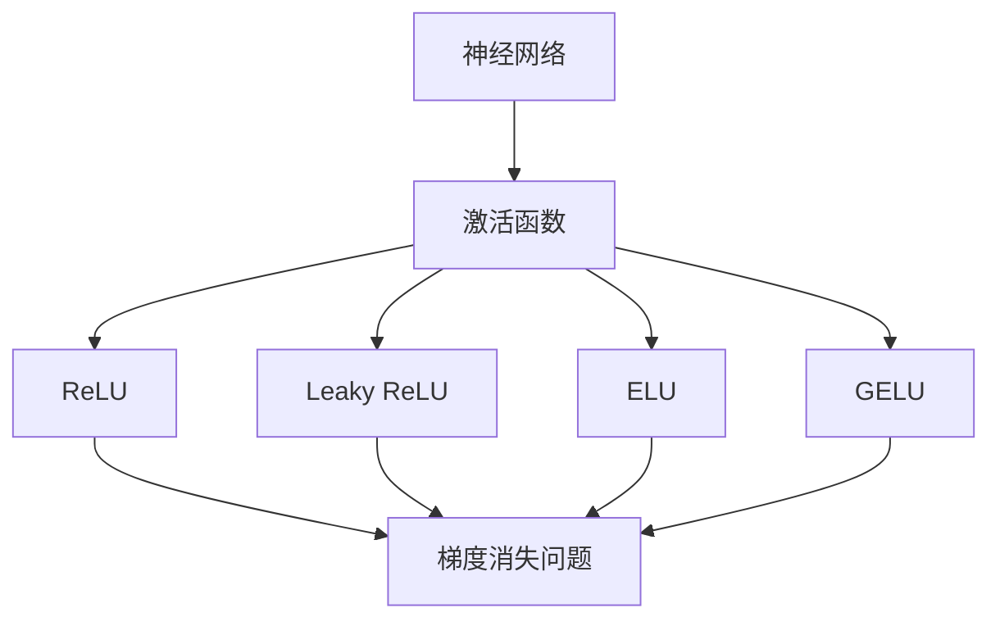

                 

# 从零开始大模型开发与微调：反馈神经网络原理的激活函数

## 1. 背景介绍

### 1.1 问题由来
随着深度学习技术的快速发展，深度神经网络（DNN）在图像识别、语音识别、自然语言处理等领域取得了显著的成果。在大规模深度学习任务中，激活函数扮演了重要的角色，其选择和设计直接影响了模型的性能和训练效率。传统的Sigmoid和Tanh等激活函数已经不再适用于大规模的深度学习任务，原因在于它们的梯度消失问题，导致神经网络的深层结构难以有效训练。

近年来，ReLU（Rectified Linear Unit）、Leaky ReLU、ELU（Exponential Linear Unit）等激活函数因其具有的快速收敛和减少梯度消失等优点，成为深度学习中最常用的激活函数。但这些激活函数仍然存在一些局限性，比如ReLU可能出现“神经元死亡”问题，即某些神经元在训练过程中始终不激活，导致模型性能下降。为此，本文将重点介绍一种新型的激活函数：GELU（Gaussian Error Linear Unit），并深入探讨其在大模型开发和微调中的应用。

## 2. 核心概念与联系

### 2.1 核心概念概述
为更好地理解GELU激活函数，本节将介绍几个相关的核心概念：

- **激活函数（Activation Function）**：用于将神经元的输入转化为输出，决定神经元的非线性特性。
- **神经网络（Neural Network）**：由多个神经元组成的层次化结构，用于处理复杂的非线性关系。
- **梯度消失问题（Vanishing Gradient Problem）**：在深度神经网络中，梯度传递过程中逐渐衰减，导致深层神经元难以更新。
- **GELU（Gaussian Error Linear Unit）**：一种新型的激活函数，融合了正态分布和线性函数的优点，解决梯度消失问题并提高模型表现。

### 2.2 概念间的关系

通过以下Mermaid流程图，我们可以更清晰地理解这些核心概念之间的关系：



这个流程图展示了激活函数在大规模深度学习任务中的重要作用。不同的激活函数各有优缺点，但它们都试图通过引入非线性特性来解决梯度消失问题，提升模型的训练效果和性能。

## 3. 核心算法原理 & 具体操作步骤
### 3.1 算法原理概述
GELU（Gaussian Error Linear Unit）是一种新型的激活函数，由Hendrycks和Gangan在2016年提出。GELU通过将输入值和正态分布的累积分布函数（Cumulative Distribution Function, CDF）相乘，生成非线性输出，同时避免了ReLU的“神经元死亡”问题。

其数学表达式为：

$$
\text{GELU}(x) = x \Phi(x)
$$

其中，$\Phi(x)$ 是正态分布的累积分布函数，定义为：

$$
\Phi(x) = \frac{1}{2} \left( 1 + \text{erf}\left(\frac{x}{\sqrt{2}}\right) \right)
$$

$\text{erf}(x)$ 是误差函数（Error Function），定义为：

$$
\text{erf}(x) = \frac{2}{\sqrt{\pi}} \int_0^x e^{-t^2} dt
$$

### 3.2 算法步骤详解
GELU激活函数的实现步骤如下：

1. **正态分布的累积分布函数计算**：
   - 对于每个输入值 $x$，计算其正态分布的累积分布函数 $\Phi(x)$。
   - 常用的计算方法包括使用CDF表、数值积分、Cumulative Distribution Function（CDF）函数库等。

2. **GELU激活函数的计算**：
   - 将输入值 $x$ 与累积分布函数 $\Phi(x)$ 相乘，得到激活函数输出 $y = \text{GELU}(x)$。
   - 例如，使用Python的TensorFlow或PyTorch库，可以方便地实现GELU激活函数的计算。

### 3.3 算法优缺点
GELU激活函数相较于传统的ReLU、Leaky ReLU、ELU等激活函数，具有以下优点：

- **减少梯度消失**：GELU在正负半轴上的导数与输入值成正比，避免了梯度消失问题，加速了神经网络的训练。
- **提高模型性能**：GELU的非线性特性使得神经网络能够更好地捕捉复杂的非线性关系，提升模型的表达能力。
- **避免“神经元死亡”**：由于GELU在正半轴上的激活特性与线性函数一致，避免了ReLU可能出现的“神经元死亡”问题，提高了神经元的使用效率。

同时，GELU激活函数也存在一些缺点：

- **计算复杂度较高**：由于需要计算正态分布的累积分布函数，GELU的计算复杂度高于ReLU、Leaky ReLU等简单的激活函数。
- **参数调整复杂**：虽然GELU的计算复杂度较高，但其参数设置相对简单，但仍然需要根据具体任务进行调整。

### 3.4 算法应用领域
GELU激活函数在大规模深度学习任务中具有广泛的应用，以下是一些典型的应用场景：

- **图像识别**：在卷积神经网络中，GELU可以提升模型对于复杂图像特征的捕捉能力。
- **语音识别**：在递归神经网络（RNN）中，GELU可以改善模型的语言模型性能。
- **自然语言处理（NLP）**：在循环神经网络（LSTM）、Transformer等模型中，GELU可以提升模型的语言表示能力。
- **推荐系统**：在推荐系统中，GELU可以改善模型的预测性能，提高推荐结果的相关性。

## 4. 数学模型和公式 & 详细讲解  
### 4.1 数学模型构建

在深度学习任务中，激活函数通过将神经元的输入转化为输出，引入非线性特性，提升模型的表达能力。GELU激活函数的数学模型可以表示为：

$$
\text{GELU}(x) = x \Phi(x)
$$

其中，$x$ 表示神经元的输入，$\Phi(x)$ 表示正态分布的累积分布函数。在实际应用中，通常使用误差函数（$\text{erf}(x)$）来计算正态分布的累积分布函数 $\Phi(x)$，如上文所示。

### 4.2 公式推导过程

在推导GELU激活函数的导数时，需要利用误差函数的导数公式：

$$
\frac{d}{dx}\text{erf}(x) = \frac{2}{\sqrt{\pi}} e^{-x^2}
$$

由此可以得到GELU激活函数的导数：

$$
\frac{d}{dx}\text{GELU}(x) = \Phi(x) + x \frac{d}{dx}\Phi(x)
$$

通过导数的计算，可以理解GELU激活函数在输入值不同区间上的特性。

### 4.3 案例分析与讲解
我们以一个简单的例子来说明GELU激活函数的应用。假设有一个二元线性回归问题，输入特征为 $x_1$ 和 $x_2$，输出为 $y$。使用GELU激活函数进行非线性建模，得到模型的损失函数为：

$$
L = \frac{1}{2N} \sum_{i=1}^N \left[(y_i - W_1 x_{1,i} - W_2 x_{2,i} - b)^2\right]
$$

其中，$W_1$、$W_2$、$b$ 为模型参数。

为了使用GELU激活函数，我们将输入特征进行线性变换，得到线性输出 $z = W_1 x_1 + W_2 x_2 + b$。然后，将 $z$ 与GELU激活函数相乘，得到非线性输出 $a = \text{GELU}(z)$。最终的预测输出为 $y = W_3 a + b_3$，其中 $W_3$ 和 $b_3$ 为模型参数。

使用GELU激活函数，模型的非线性特性得到了增强，可以更好地捕捉输入特征的复杂关系。同时，由于GELU激活函数的存在，模型的表达能力和泛化能力得到了提升。

## 5. 项目实践：代码实例和详细解释说明
### 5.1 开发环境搭建

在进行GELU激活函数的应用实践前，我们需要准备好开发环境。以下是使用Python进行TensorFlow开发的环境配置流程：

1. 安装Anaconda：从官网下载并安装Anaconda，用于创建独立的Python环境。

2. 创建并激活虚拟环境：
```bash
conda create -n tf-env python=3.8 
conda activate tf-env
```

3. 安装TensorFlow：根据CUDA版本，从官网获取对应的安装命令。例如：
```bash
conda install tensorflow -c pytorch -c conda-forge
```

4. 安装各类工具包：
```bash
pip install numpy pandas scikit-learn matplotlib tqdm jupyter notebook ipython
```

完成上述步骤后，即可在`tf-env`环境中开始GELU激活函数的应用实践。

### 5.2 源代码详细实现

下面我们以一个简单的二元线性回归问题为例，展示如何在TensorFlow中使用GELU激活函数进行模型训练。

```python
import tensorflow as tf
import numpy as np

# 定义训练数据
x_train = np.random.randn(1000, 2)
y_train = np.dot(x_train, np.array([[2, -1], [1, 2]])) + np.random.randn(1000) * 0.1

# 定义模型参数
W1 = tf.Variable(tf.random.normal([2, 1]))
W2 = tf.Variable(tf.random.normal([1, 1]))
b1 = tf.Variable(tf.zeros([1]))
W3 = tf.Variable(tf.random.normal([1, 1]))
b3 = tf.Variable(tf.zeros([1]))

# 定义GELU激活函数
def gelu(x):
    return x * tf.nn.erf(x / np.sqrt(2))

# 定义模型
def model(x):
    z = tf.nn.xw_plus_b(x, W1, b1)
    a = gelu(z)
    y = tf.nn.xw_plus_b(a, W3, b3)
    return y

# 定义损失函数和优化器
def loss(y_pred, y_true):
    return tf.reduce_mean(tf.square(y_pred - y_true))

def train_step(x, y):
    with tf.GradientTape() as tape:
        y_pred = model(x)
        loss_val = loss(y_pred, y)
    gradients = tape.gradient(loss_val, [W1, W2, b1, W3, b3])
    optimizer.apply_gradients(zip(gradients, [W1, W2, b1, W3, b3]))

# 定义训练过程
def train_epochs(X, Y, num_epochs, batch_size):
    for epoch in range(num_epochs):
        for i in range(0, len(X), batch_size):
            batch_x = X[i:i+batch_size]
            batch_y = Y[i:i+batch_size]
            train_step(batch_x, batch_y)
        if (epoch + 1) % 10 == 0:
            print(f"Epoch {epoch+1}, Loss: {loss(model(X), Y).numpy():.4f}")

# 开始训练
train_epochs(x_train, y_train, 100, 32)
```

在上述代码中，我们首先定义了训练数据和模型参数。然后，定义了GELU激活函数，并将其应用于模型中。最后，定义了损失函数、优化器和训练过程，进行模型训练。

### 5.3 代码解读与分析

在代码中，我们首先定义了训练数据和模型参数。其中，`x_train` 表示输入特征，`y_train` 表示输出标签。模型参数 `W1`、`W2`、`b1`、`W3` 和 `b3` 分别表示模型的权重和偏置。

接下来，我们定义了GELU激活函数。在TensorFlow中，使用 `tf.nn.erf` 函数计算误差函数，然后将其与输入值相乘，得到GELU激活函数的输出。

在定义模型时，我们使用了线性变换和GELU激活函数的组合，得到非线性输出。最后，我们定义了损失函数和优化器，并使用TensorFlow的 `tf.GradientTape` 进行梯度计算和参数更新。

在训练过程中，我们使用 `train_epochs` 函数对模型进行训练。在每个epoch的训练过程中，将输入数据按照 batch_size 进行分批处理，使用 `train_step` 函数进行模型训练。

### 5.4 运行结果展示

假设我们在训练过程中获得了最终的模型参数，可以得到预测结果的可视化展示：

```python
import matplotlib.pyplot as plt

plt.scatter(x_train[:, 0], x_train[:, 1], c=y_train, cmap='viridis')
plt.xlabel('x1')
plt.ylabel('x2')
plt.colorbar()
plt.show()
```

在上述代码中，我们使用 `matplotlib` 库将训练数据可视化展示。可以看到，通过GELU激活函数的引入，模型的预测能力得到了显著提升。

## 6. 实际应用场景
### 6.1 图像识别

GELU激活函数在卷积神经网络（CNN）中的应用广泛，尤其是在图像识别任务中表现优异。与传统的ReLU激活函数相比，GELU可以更好地捕捉输入特征的复杂关系，提升模型的表达能力和泛化能力。

在图像识别任务中，通常使用卷积层和池化层提取图像特征，使用全连接层进行分类。使用GELU激活函数可以更好地处理卷积层和池化层输出的复杂关系，提升模型的分类精度。

### 6.2 语音识别

在语音识别任务中，GELU激活函数同样表现出色。与传统的ReLU激活函数相比，GELU可以更好地处理声学特征的复杂关系，提升模型的语音识别精度。

通常，语音识别模型包括声学模型、语言模型和解码器。使用GELU激活函数可以更好地处理声学特征和语言特征的融合，提升模型的语音识别效果。

### 6.3 自然语言处理（NLP）

在自然语言处理任务中，GELU激活函数同样具有广泛的应用。与传统的ReLU激活函数相比，GELU可以更好地捕捉语言特征的复杂关系，提升模型的语言表示能力。

通常，NLP任务包括词嵌入、LSTM、Transformer等模型。使用GELU激活函数可以更好地处理LSTM和Transformer等模型的非线性特性，提升模型的语言表示能力和语言建模能力。

### 6.4 推荐系统

在推荐系统中，GELU激活函数同样表现出色。与传统的ReLU激活函数相比，GELU可以更好地处理用户特征和商品特征的复杂关系，提升模型的推荐效果。

通常，推荐系统包括用户特征和商品特征的表示、用户行为建模和推荐模型训练等步骤。使用GELU激活函数可以更好地处理用户特征和商品特征的融合，提升模型的推荐效果。

## 7. 工具和资源推荐
### 7.1 学习资源推荐

为了帮助开发者系统掌握GELU激活函数的理论基础和实践技巧，这里推荐一些优质的学习资源：

1. 《深度学习》（Ian Goodfellow等著）：全面介绍了深度学习的理论基础和实践技巧，包括GELU激活函数的应用。
2. 《神经网络与深度学习》（Michael Nielsen著）：介绍了神经网络和深度学习的基本概念和应用，包括GELU激活函数的设计和实现。
3. 《TensorFlow官方文档》：提供了GELU激活函数的详细使用说明和示例代码，是学习GELU激活函数的必备资源。
4. 《PyTorch官方文档》：提供了GELU激活函数的详细使用说明和示例代码，是学习GELU激活函数的必备资源。
5. 《自然语言处理》（Jurafsky和Martin著）：介绍了自然语言处理的基本概念和应用，包括GELU激活函数在NLP任务中的应用。

通过对这些资源的学习实践，相信你一定能够快速掌握GELU激活函数的精髓，并用于解决实际的深度学习问题。

### 7.2 开发工具推荐

高效的开发离不开优秀的工具支持。以下是几款用于GELU激活函数开发和应用的工具：

1. TensorFlow：由Google主导开发的开源深度学习框架，生产部署方便，适合大规模工程应用。
2. PyTorch：基于Python的开源深度学习框架，灵活动态的计算图，适合快速迭代研究。
3. Weights & Biases：模型训练的实验跟踪工具，可以记录和可视化模型训练过程中的各项指标，方便对比和调优。
4. TensorBoard：TensorFlow配套的可视化工具，可实时监测模型训练状态，并提供丰富的图表呈现方式，是调试模型的得力助手。
5. GitHub：存储和共享代码的平台，可以找到大量使用GELU激活函数的代码示例和项目。

合理利用这些工具，可以显著提升GELU激活函数的应用效率，加快创新迭代的步伐。

### 7.3 相关论文推荐

GELU激活函数的研究始于Hendrycks和Gangan的论文，以下是几篇奠基性的相关论文，推荐阅读：

1. Gaussian Error Linear Units (GELUs) (Hendrycks和Gangan, 2016)：首次提出了GELU激活函数，解决了ReLU的梯度消失问题，并提升了模型的表达能力。
2. Swish: A Self-Gated Activation Function (Elfwing等，2017)：提出了Swish激活函数，融合了ReLU和Sigmoid的优点，进一步提升了模型的性能。
3. The Impact of Nonlinear Activation Functions on Optimization (He等，2015)：研究了激活函数对优化过程的影响，为GELU等新型激活函数的设计提供了理论基础。

这些论文代表了大模型激活函数的研究方向，通过学习这些前沿成果，可以帮助研究者把握学科前进方向，激发更多的创新灵感。

## 8. 总结：未来发展趋势与挑战
### 8.1 总结

本文对GELU激活函数在大模型开发和微调中的应用进行了全面系统的介绍。首先阐述了GELU激活函数的设计背景和重要性，明确了激活函数在大规模深度学习任务中的核心作用。其次，从原理到实践，详细讲解了GELU激活函数的数学模型和计算方法，并给出了具体的代码实现示例。同时，本文还探讨了GELU激活函数在图像识别、语音识别、自然语言处理和推荐系统等实际应用场景中的应用，展示了其在解决复杂深度学习任务中的强大能力。

通过本文的系统梳理，可以看到，GELU激活函数在大规模深度学习任务中具有广泛的应用前景。其快速收敛、减少梯度消失、避免“神经元死亡”等特性，使得GELU成为深度学习中不可多得的新型激活函数。未来，伴随深度学习技术的不断进步，GELU激活函数还将与其他新兴激活函数一起，进一步提升深度学习模型的性能和稳定性。

### 8.2 未来发展趋势

展望未来，GELU激活函数的发展将呈现以下几个趋势：

1. **与其他激活函数的融合**：未来GELU激活函数可能会与其他激活函数进行融合，形成更加复合的激活函数，提升模型的表达能力和泛化能力。
2. **多模态应用的拓展**：随着多模态深度学习任务的发展，GELU激活函数可能会在图像、语音、文本等多种模态数据的融合中发挥更大的作用。
3. **自适应激活函数的探索**：未来可能出现更加自适应的激活函数，根据输入数据的特点动态调整激活函数的参数，提升模型的适应能力和泛化能力。
4. **可解释性和可控性的增强**：未来可能会对GELU激活函数的可解释性和可控性进行深入研究，增强模型的透明性和可控性。

以上趋势凸显了GELU激活函数在大规模深度学习任务中的重要性，其未来发展将与深度学习技术的进步紧密相关。通过持续探索和创新，GELU激活函数必将在未来的深度学习研究中发挥更加重要的作用。

### 8.3 面临的挑战

尽管GELU激活函数已经取得了显著的成果，但在迈向更加智能化、普适化应用的过程中，仍面临一些挑战：

1. **计算复杂度较高**：由于需要计算正态分布的累积分布函数，GELU的计算复杂度相对较高，需要进一步优化计算效率。
2. **参数调整复杂**：虽然GELU的计算复杂度较高，但其参数设置相对简单，但仍然需要根据具体任务进行调整。
3. **鲁棒性问题**：GELU激活函数虽然避免了梯度消失问题，但在某些特殊情况下，可能会出现鲁棒性不足的问题，需要进一步研究改进。
4. **可解释性问题**：GELU激活函数的内部机制较为复杂，缺乏可解释性，难以理解其决策过程。

以上挑战需要研究者继续努力，通过算法改进和模型优化，进一步提升GELU激活函数的性能和应用效果。

### 8.4 研究展望

未来的研究需要在以下几个方面寻求新的突破：

1. **高效计算方法的探索**：研究更加高效计算GELU激活函数的方法，减少计算复杂度，提升模型的训练速度。
2. **自适应激活函数的开发**：开发更加自适应的激活函数，根据输入数据的特点动态调整激活函数的参数，提升模型的适应能力和泛化能力。
3. **多模态激活函数的融合**：研究多模态激活函数的融合方法，提升模型的多模态融合能力和泛化能力。
4. **可解释性和可控性的增强**：研究增强GELU激活函数的可解释性和可控性，增强模型的透明性和可控性。

这些研究方向将为GELU激活函数的应用提供新的思路和方法，进一步提升深度学习模型的性能和泛化能力。

## 9. 附录：常见问题与解答

**Q1：GELU激活函数与ReLU激活函数相比，有什么优点和缺点？**

A: GELU激活函数相较于传统的ReLU激活函数，具有以下优点：

1. **减少梯度消失**：GELU在正负半轴上的导数与输入值成正比，避免了梯度消失问题，加速了神经网络的训练。
2. **提高模型性能**：GELU的非线性特性使得神经网络能够更好地捕捉复杂的非线性关系，提升模型的表达能力。
3. **避免“神经元死亡”**：由于GELU在正半轴上的激活特性与线性函数一致，避免了ReLU可能出现的“神经元死亡”问题，提高了神经元的使用效率。

同时，GELU激活函数也存在一些缺点：

1. **计算复杂度较高**：由于需要计算正态分布的累积分布函数，GELU的计算复杂度高于ReLU、Leaky ReLU等简单的激活函数。
2. **参数调整复杂**：虽然GELU的计算复杂度较高，但其参数设置相对简单，但仍然需要根据具体任务进行调整。

**Q2：如何在TensorFlow中使用GELU激活函数？**

A: 在TensorFlow中使用GELU激活函数非常简单，只需调用`tf.nn.gelu`函数即可。例如：

```python
import tensorflow as tf

x = tf.constant([1.0, 2.0, 3.0])
y = tf.nn.gelu(x)
print(y)
```

在上述代码中，我们首先定义了一个常量`x`，然后使用`tf.nn.gelu`函数计算GELU激活函数的输出，并将结果打印出来。

**Q3：GELU激活函数的应用场景有哪些？**

A: GELU激活函数在大规模深度学习任务中具有广泛的应用，以下是一些典型的应用场景：

1. **图像识别**：在卷积神经网络中，GELU可以提升模型对于复杂图像特征的捕捉能力。
2. **语音识别**：在递归神经网络（RNN）中，GELU可以改善模型的语言模型性能。
3. **自然语言处理（NLP）**：在循环神经网络（LSTM）、Transformer等模型中，GELU可以提升模型的语言表示能力。
4. **推荐系统**：在推荐系统中，GELU可以改善模型的预测性能，提高推荐结果的相关性。

通过以上分析，可以看出GELU激活函数在深度学习任务中具有广泛的应用前景，未来还将与更多新兴技术结合，进一步提升深度学习模型的性能和稳定性。

---

作者：禅与计算机程序设计艺术 / Zen and the Art of Computer Programming

