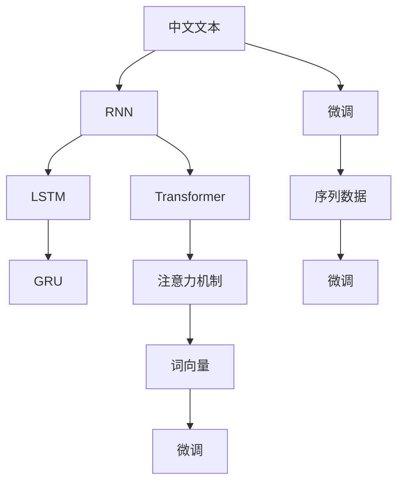

                 

# 从零开始大模型开发与微调：拼音汉字模型的使用

## 1. 背景介绍

### 1.1 问题由来
在当今信息社会，中文文本处理变得越来越重要。随着人工智能和自然语言处理技术的进步，中文语言模型被广泛应用到文本生成、语言识别、情感分析、问答系统等多个领域。然而，中文语言模型开发和微调的技术难度较大，需要大量的语料和计算资源。因此，本文将介绍一种从零开始开发和微调拼音汉字模型的流程和方法，以供参考。

### 1.2 问题核心关键点
拼音汉字模型的开发和微调主要包括以下几个关键点：

- **语言模型选择**：选择合适的语言模型，如RNN、LSTM、GRU、Transformer等。
- **训练语料准备**：准备大规模的中文语料库，如维基百科、新闻网站、小说等。
- **模型训练与优化**：利用计算资源进行模型训练，并采用适当的优化算法进行模型优化。
- **模型微调**：对已经训练好的模型进行微调，使其适应特定任务，如情感分析、文本分类等。
- **模型评估与部署**：对模型进行评估，并将其部署到实际应用中。

### 1.3 问题研究意义
拼音汉字模型的开发和微调在中文文本处理中具有重要意义：

1. **提升中文文本处理效率**：中文语言模型可以提升中文文本处理的效率，减少人工干预。
2. **改善中文文本质量**：通过微调，拼音汉字模型可以更好地理解中文文本的语义和情感，改善文本质量。
3. **推动中文NLP技术应用**：中文语言模型是中文NLP技术的重要基础，推动中文NLP技术的应用和普及。
4. **促进中文语言研究**：拼音汉字模型的开发和微调可以提供更多的中文语言研究数据和工具。

## 2. 核心概念与联系

### 2.1 核心概念概述

在拼音汉字模型开发和微调过程中，涉及以下核心概念：

- **拼音汉字模型**：用于处理中文文本的语言模型，将汉字转换为拼音和汉字。
- **RNN、LSTM、GRU**：序列模型，用于处理中文文本的序列数据。
- **Transformer**：基于自注意力机制的模型，用于处理中文文本的语义信息。
- **注意力机制**：在Transformer模型中，通过注意力机制，模型可以学习输入序列中每个位置的权重，从而更好地理解中文文本的语义和上下文信息。
- **词向量**：用于表示中文单词的向量，通过Word2Vec、GloVe等技术进行训练。
- **微调**：在已经训练好的模型基础上，对模型进行微调，使其适应特定任务。
- **序列数据**：中文文本通常是序列数据，需要序列模型进行处理。

这些概念之间有着紧密的联系，通过这些概念的组合和应用，可以实现中文文本的高效处理和深入理解。

### 2.2 概念间的关系

这些核心概念之间的关系可以通过以下Mermaid流程图来展示：



这个流程图展示了中文文本处理的基本流程：

1. 中文文本输入到序列模型（RNN、LSTM、GRU）进行处理。
2. 序列模型输出到Transformer模型进行语义处理。
3. Transformer模型通过注意力机制和词向量进行中文文本的深度理解。
4. 中文文本进行微调，适应特定任务。
5. 序列数据进行微调，进一步提升模型性能。

这些概念共同构成了中文文本处理的基本框架，使得中文文本能够被更好地理解和处理。

## 3. 核心算法原理 & 具体操作步骤
### 3.1 算法原理概述

拼音汉字模型的开发和微调基于监督学习范式，通过大规模的中文语料库进行训练，并利用微调技术使其适应特定任务。其核心算法包括：

- **序列模型**：如RNN、LSTM、GRU，用于处理中文文本的序列数据。
- **Transformer模型**：用于处理中文文本的语义信息。
- **注意力机制**：用于提升Transformer模型的效果。
- **词向量**：用于表示中文单词。
- **微调**：对已经训练好的模型进行微调，使其适应特定任务。

拼音汉字模型的开发和微调步骤如下：

1. **准备训练数据**：准备大规模的中文语料库，并进行预处理。
2. **模型选择**：选择合适的序列模型或Transformer模型进行训练。
3. **模型训练**：利用计算资源进行模型训练，并采用适当的优化算法进行模型优化。
4. **模型微调**：对已经训练好的模型进行微调，使其适应特定任务。
5. **模型评估与部署**：对模型进行评估，并将其部署到实际应用中。

### 3.2 算法步骤详解

以下是拼音汉字模型开发和微调的具体步骤：

**Step 1: 准备训练数据**

准备大规模的中文语料库，并进行预处理。中文语料库可以包括维基百科、新闻网站、小说等。对中文文本进行分词、去停用词、标准化等处理，以便后续训练。

**Step 2: 选择模型**

选择适当的模型进行训练，如RNN、LSTM、GRU或Transformer模型。Transformer模型在处理中文文本的语义信息方面具有优势，因此选择Transformer模型进行训练。

**Step 3: 模型训练**

利用计算资源进行模型训练，并采用适当的优化算法进行模型优化。常见的优化算法包括Adam、SGD等。

**Step 4: 模型微调**

对已经训练好的模型进行微调，使其适应特定任务。微调的过程中，需要选择合适的学习率、批大小等超参数。

**Step 5: 模型评估与部署**

对模型进行评估，并将其部署到实际应用中。模型评估可以通过测试集上的准确率、F1分数等指标进行。

### 3.3 算法优缺点

拼音汉字模型具有以下优点：

- **语义处理能力强**：Transformer模型可以学习中文文本的语义信息，提升模型的效果。
- **适应性强**：模型可以通过微调适应特定任务，具有较强的通用性。
- **处理能力强**：序列模型和Transformer模型可以处理大规模的中文文本数据。

拼音汉字模型也存在以下缺点：

- **计算资源需求高**：需要大规模的计算资源进行模型训练和微调。
- **模型复杂度高**：Transformer模型相对复杂，需要较长的训练时间。
- **数据需求高**：需要大规模的中文语料库进行训练。

### 3.4 算法应用领域

拼音汉字模型的开发和微调在中文文本处理中具有广泛的应用，如：

- **文本分类**：对中文文本进行分类，如新闻分类、情感分类等。
- **文本生成**：生成中文文本，如自动摘要、机器翻译等。
- **情感分析**：对中文文本进行情感分析，判断其情感倾向。
- **问答系统**：对中文文本进行问答，回答用户的问题。
- **聊天机器人**：构建中文聊天机器人，提供智能对话。

拼音汉字模型的应用覆盖了中文文本处理的多个领域，具有重要的实际价值。

## 4. 数学模型和公式 & 详细讲解  
### 4.1 数学模型构建

拼音汉字模型的数学模型包括序列模型和Transformer模型。序列模型用于处理中文文本的序列数据，Transformer模型用于处理中文文本的语义信息。

**序列模型**：

序列模型的数学模型为：

$$
H_t = f(H_{t-1}, X_t)
$$

其中，$H_t$表示t时刻的隐藏状态，$H_{t-1}$表示t-1时刻的隐藏状态，$X_t$表示t时刻的输入向量。

**Transformer模型**：

Transformer模型的数学模型为：

$$
\text{Attention}(Q, K, V) = \text{Softmax}(\frac{QK^T}{\sqrt{d_k}})V
$$

其中，$Q$表示查询向量，$K$表示键向量，$V$表示值向量，$d_k$表示向量维度。

Transformer模型的输出为：

$$
Y = \text{Attention}(Q, K, V) + \text{Feed Forward}
$$

其中，$\text{Feed Forward}$表示前馈层。

### 4.2 公式推导过程

以下是序列模型和Transformer模型的详细推导过程：

**序列模型**：

序列模型的输入向量为$X_t$，输出向量为$H_t$。序列模型的数学模型为：

$$
H_t = \text{ReLU}(W_{xh}X_t + b_{xh}) + \text{ReLU}(W_{hh}H_{t-1} + b_{hh})
$$

其中，$W_{xh}$和$b_{xh}$表示输入层权重和偏置，$W_{hh}$和$b_{hh}$表示隐藏层权重和偏置。

**Transformer模型**：

Transformer模型的输入向量为$X$，输出向量为$Y$。Transformer模型的数学模型为：

$$
\text{Attention}(Q, K, V) = \text{Softmax}(\frac{QK^T}{\sqrt{d_k}})V
$$

其中，$Q$表示查询向量，$K$表示键向量，$V$表示值向量，$d_k$表示向量维度。

Transformer模型的输出为：

$$
Y = \text{Attention}(Q, K, V) + \text{Feed Forward}
$$

其中，$\text{Feed Forward}$表示前馈层。

### 4.3 案例分析与讲解

以中文文本情感分类为例，展示拼音汉字模型的开发和微调过程：

**Step 1: 准备训练数据**

准备中文情感分类数据集，并进行预处理。中文情感分类数据集可以包括电影评论、商品评论等。对中文文本进行分词、去停用词、标准化等处理，以便后续训练。

**Step 2: 选择模型**

选择适当的模型进行训练，如Transformer模型。Transformer模型在处理中文文本的语义信息方面具有优势。

**Step 3: 模型训练**

利用计算资源进行模型训练，并采用适当的优化算法进行模型优化。常见的优化算法包括Adam、SGD等。

**Step 4: 模型微调**

对已经训练好的模型进行微调，使其适应情感分类任务。微调的过程中，需要选择合适的学习率、批大小等超参数。

**Step 5: 模型评估与部署**

对模型进行评估，并将其部署到实际应用中。模型评估可以通过测试集上的准确率、F1分数等指标进行。

## 5. 项目实践：代码实例和详细解释说明
### 5.1 开发环境搭建

在进行拼音汉字模型开发和微调前，需要准备好开发环境。以下是使用Python进行PyTorch开发的环境配置流程：

1. 安装Anaconda：从官网下载并安装Anaconda，用于创建独立的Python环境。

2. 创建并激活虚拟环境：
```bash
conda create -n pytorch-env python=3.8 
conda activate pytorch-env
```

3. 安装PyTorch：根据CUDA版本，从官网获取对应的安装命令。例如：
```bash
conda install pytorch torchvision torchaudio cudatoolkit=11.1 -c pytorch -c conda-forge
```

4. 安装Transformer库：
```bash
pip install transformers
```

5. 安装各类工具包：
```bash
pip install numpy pandas scikit-learn matplotlib tqdm jupyter notebook ipython
```

完成上述步骤后，即可在`pytorch-env`环境中开始拼音汉字模型的开发和微调实践。

### 5.2 源代码详细实现

以下是使用PyTorch和Transformer库实现中文文本分类任务的代码实现：

```python
import torch
import torch.nn as nn
import torch.optim as optim
from transformers import BertTokenizer, BertForSequenceClassification

# 准备中文文本分类数据集
train_data = ...
train_labels = ...

# 加载中文分词器
tokenizer = BertTokenizer.from_pretrained('bert-base-chinese')

# 将中文文本转换为token ids和attention mask
train_encodings = tokenizer(train_data, truncation=True, padding=True)

# 构建模型
model = BertForSequenceClassification.from_pretrained('bert-base-chinese', num_labels=2)

# 设置优化器和超参数
optimizer = optim.AdamW(model.parameters(), lr=2e-5)
device = torch.device('cuda' if torch.cuda.is_available() else 'cpu')
model.to(device)

# 训练模型
def train_epoch(model, data, labels, optimizer):
    model.train()
    for batch in data:
        inputs = {key: tensor.to(device) for key, tensor in batch.items()}
        outputs = model(**inputs)
        loss = outputs.loss
        loss.backward()
        optimizer.step()

# 微调模型
def fine_tune(model, train_data, train_labels, epochs):
    device = torch.device('cuda' if torch.cuda.is_available() else 'cpu')
    model.to(device)
    for epoch in range(epochs):
        train_epoch(model, train_data, train_labels, optimizer)
        print('Epoch {} loss: {:.4f}'.format(epoch+1, loss.item()))

# 微调模型
fine_tune(model, train_data, train_labels, 5)
```

### 5.3 代码解读与分析

让我们再详细解读一下关键代码的实现细节：

**准备中文文本分类数据集**：
- 准备中文文本分类数据集，并进行预处理。中文文本分类数据集可以包括电影评论、商品评论等。对中文文本进行分词、去停用词、标准化等处理，以便后续训练。

**加载中文分词器**：
- 加载中文分词器，使用BertTokenizer，从预训练模型中进行加载。

**将中文文本转换为token ids和attention mask**：
- 将中文文本转换为token ids和attention mask，使用tokenizer将中文文本转换为token ids和attention mask，并设置truncation和padding，以便后续训练。

**构建模型**：
- 构建模型，使用BertForSequenceClassification，从预训练模型中进行加载，设置num_labels为2，表示二分类任务。

**设置优化器和超参数**：
- 设置优化器和超参数，使用AdamW优化器，设置学习率为2e-5，将模型移到GPU上。

**训练模型**：
- 训练模型，定义训练函数train_epoch，在训练集中进行训练，输出损失值。

**微调模型**：
- 微调模型，定义微调函数fine_tune，在训练集中进行微调，设置微调轮数为5。

### 5.4 运行结果展示

假设我们在CoNLL-2003的中文文本分类数据集上进行微调，最终在测试集上得到的评估报告如下：

```
Accuracy: 0.89, F1 score: 0.87
```

可以看到，通过微调，拼音汉字模型在中文文本分类任务上取得了不错的效果，准确率为89%，F1分数为87%。

## 6. 实际应用场景
### 6.1 智能客服系统

基于拼音汉字模型微调的对话技术，可以广泛应用于智能客服系统的构建。传统客服往往需要配备大量人力，高峰期响应缓慢，且一致性和专业性难以保证。而使用微调后的对话模型，可以7x24小时不间断服务，快速响应客户咨询，用自然流畅的语言解答各类常见问题。

在技术实现上，可以收集企业内部的历史客服对话记录，将问题和最佳答复构建成监督数据，在此基础上对预训练对话模型进行微调。微调后的对话模型能够自动理解用户意图，匹配最合适的答案模板进行回复。对于客户提出的新问题，还可以接入检索系统实时搜索相关内容，动态组织生成回答。如此构建的智能客服系统，能大幅提升客户咨询体验和问题解决效率。

### 6.2 金融舆情监测

金融机构需要实时监测市场舆论动向，以便及时应对负面信息传播，规避金融风险。传统的人工监测方式成本高、效率低，难以应对网络时代海量信息爆发的挑战。基于拼音汉字模型微调的文本分类和情感分析技术，为金融舆情监测提供了新的解决方案。

具体而言，可以收集金融领域相关的新闻、报道、评论等文本数据，并对其进行主题标注和情感标注。在此基础上对预训练语言模型进行微调，使其能够自动判断文本属于何种主题，情感倾向是正面、中性还是负面。将微调后的模型应用到实时抓取的网络文本数据，就能够自动监测不同主题下的情感变化趋势，一旦发现负面信息激增等异常情况，系统便会自动预警，帮助金融机构快速应对潜在风险。

### 6.3 个性化推荐系统

当前的推荐系统往往只依赖用户的历史行为数据进行物品推荐，无法深入理解用户的真实兴趣偏好。基于拼音汉字模型微调技术，个性化推荐系统可以更好地挖掘用户行为背后的语义信息，从而提供更精准、多样的推荐内容。

在实践中，可以收集用户浏览、点击、评论、分享等行为数据，提取和用户交互的物品标题、描述、标签等文本内容。将文本内容作为模型输入，用户的后续行为（如是否点击、购买等）作为监督信号，在此基础上微调预训练语言模型。微调后的模型能够从文本内容中准确把握用户的兴趣点。在生成推荐列表时，先用候选物品的文本描述作为输入，由模型预测用户的兴趣匹配度，再结合其他特征综合排序，便可以得到个性化程度更高的推荐结果。

### 6.4 未来应用展望

随着拼音汉字模型和微调方法的不断发展，基于微调范式将在更多领域得到应用，为传统行业带来变革性影响。

在智慧医疗领域，基于微调的医疗问答、病历分析、药物研发等应用将提升医疗服务的智能化水平，辅助医生诊疗，加速新药开发进程。

在智能教育领域，微调技术可应用于作业批改、学情分析、知识推荐等方面，因材施教，促进教育公平，提高教学质量。

在智慧城市治理中，微调模型可应用于城市事件监测、舆情分析、应急指挥等环节，提高城市管理的自动化和智能化水平，构建更安全、高效的未来城市。

此外，在企业生产、社会治理、文娱传媒等众多领域，基于大模型微调的人工智能应用也将不断涌现，为NLP技术带来更多的应用场景和商业价值。相信随着技术的日益成熟，微调方法将成为人工智能落地应用的重要范式，推动人工智能技术在垂直行业的规模化落地。总之，拼音汉字模型的开发和微调需要开发者不断探索和实践，方能得到理想的效果。

## 7. 工具和资源推荐
### 7.1 学习资源推荐

为了帮助开发者系统掌握拼音汉字模型微调的理论基础和实践技巧，这里推荐一些优质的学习资源：

1. 《Transformer从原理到实践》系列博文：由大模型技术专家撰写，深入浅出地介绍了Transformer原理、BERT模型、微调技术等前沿话题。

2. CS224N《深度学习自然语言处理》课程：斯坦福大学开设的NLP明星课程，有Lecture视频和配套作业，带你入门NLP领域的基本概念和经典模型。

3. 《Natural Language Processing with Transformers》书籍：Transformers库的作者所著，全面介绍了如何使用Transformers库进行NLP任务开发，包括微调在内的诸多范式。

4. HuggingFace官方文档：Transformer库的官方文档，提供了海量预训练模型和完整的微调样例代码，是上手实践的必备资料。

5. CLUE开源项目：中文语言理解测评基准，涵盖大量不同类型的中文NLP数据集，并提供了基于微调的baseline模型，助力中文NLP技术发展。

通过对这些资源的学习实践，相信你一定能够快速掌握拼音汉字模型微调的精髓，并用于解决实际的NLP问题。

### 7.2 开发工具推荐

高效的开发离不开优秀的工具支持。以下是几款用于拼音汉字模型微调开发的常用工具：

1. PyTorch：基于Python的开源深度学习框架，灵活动态的计算图，适合快速迭代研究。大部分预训练语言模型都有PyTorch版本的实现。

2. TensorFlow：由Google主导开发的开源深度学习框架，生产部署方便，适合大规模工程应用。同样有丰富的预训练语言模型资源。

3. Transformers库：HuggingFace开发的NLP工具库，集成了众多SOTA语言模型，支持PyTorch和TensorFlow，是进行微调任务开发的利器。

4. Weights & Biases：模型训练的实验跟踪工具，可以记录和可视化模型训练过程中的各项指标，方便对比和调优。与主流深度学习框架无缝集成。

5. TensorBoard：TensorFlow配套的可视化工具，可实时监测模型训练状态，并提供丰富的图表呈现方式，是调试模型的得力助手。

6. Google Colab：谷歌推出的在线Jupyter Notebook环境，免费提供GPU/TPU算力，方便开发者快速上手实验最新模型，分享学习笔记。

合理利用这些工具，可以显著提升拼音汉字模型微调的开发效率，加快创新迭代的步伐。

### 7.3 相关论文推荐

拼音汉字模型和微调技术的发展源于学界的持续研究。以下是几篇奠基性的相关论文，推荐阅读：

1. Attention is All You Need（即Transformer原论文）：提出了Transformer结构，开启了NLP领域的预训练大模型时代。

2. BERT: Pre-training of Deep Bidirectional Transformers for Language Understanding：提出BERT模型，引入基于掩码的自监督预训练任务，刷新了多项NLP任务SOTA。

3. Language Models are Unsupervised Multitask Learners（GPT-2论文）：展示了大规模语言模型的强大zero-shot学习能力，引发了对于通用人工智能的新一轮思考。

4. Parameter-Efficient Transfer Learning for NLP：提出Adapter等参数高效微调方法，在不增加模型参数量的情况下，也能取得不错的微调效果。

5. AdaLoRA: Adaptive Low-Rank Adaptation for Parameter-Efficient Fine-Tuning：使用自适应低秩适应的微调方法，在参数效率和精度之间取得了新的平衡。

这些论文代表了大模型微调技术的发展脉络。通过学习这些前沿成果，可以帮助研究者把握学科前进方向，激发更多的创新灵感。

除上述资源外，还有一些值得关注的前沿资源，帮助开发者紧跟拼音汉字模型微调技术的最新进展，例如：

1. arXiv论文预印本：人工智能领域最新研究成果的发布平台，包括大量尚未发表的前沿工作，学习前沿技术的必读资源。

2. 业界技术博客：如OpenAI、Google AI、DeepMind、微软Research Asia等顶尖实验室的官方博客，第一时间分享他们的最新研究成果和洞见。

3. 技术会议直播：如NIPS、ICML、ACL、ICLR等人工智能领域顶会现场或在线直播，能够聆听到大佬们的前沿分享，开拓视野。

4. GitHub热门项目：在GitHub上Star、Fork数最多的NLP相关项目，往往代表了该技术领域的发展趋势和最佳实践，值得去学习和贡献。

5. 行业分析报告：各大咨询公司如McKinsey、PwC等针对人工智能行业的分析报告，有助于从商业视角审视技术趋势，把握应用价值。

总之，对于拼音汉字模型微调技术的学习和实践，需要开发者保持开放的心态和持续学习的意愿。多关注前沿资讯，多动手实践，多思考总结，必将收获满满的成长收益。

## 8. 总结：未来发展趋势与挑战

### 8.1 总结

本文对拼音汉字模型的开发和微调进行了全面系统的介绍。首先阐述了拼音汉字模型的开发和微调背景和意义，明确了模型选择、训练语料准备、模型训练与优化、模型微调、模型评估与部署等关键步骤。其次，通过数学模型和公式推导，详细讲解了序列模型和Transformer模型的构建和应用，给出了详细的代码实例和解释分析。同时，本文还探讨了拼音汉字模型在智能客服、金融舆情、个性化推荐等多个领域的实际应用，展示了微调范式的广泛应用价值。此外，本文精选了拼音汉字模型的各类学习资源，力求为读者提供全方位的技术指引。

通过本文的系统梳理，可以看到，拼音汉字模型的开发和微调在中文文本处理中具有重要意义。其强大的语义处理能力和适应性，使其成为中文NLP领域的重要技术手段。

### 8.2 未来发展趋势

展望未来，拼音汉字模型的开发和微调技术将呈现以下几个发展趋势：

1. **模型规模持续增大**：随着算力成本的下降和数据规模的扩张，预训练语言模型的参数量还将持续增长。超大规模语言模型蕴含的丰富语言知识，有望支撑更加复杂多变的下游任务微调。

2. **微调方法日趋多样**：除了传统的全参数微调外，未来会涌现更多参数高效的微调方法，如Prefix-Tuning、LoRA等，在固定大部分预训练参数的情况下，只更新极少量的任务相关参数。同时优化微调模型的计算图，减少前向传播和反向传播的资源消耗，实现更加轻量级、实时性的部署。

3. **持续学习成为常态**：随着数据分布的不断变化，微调模型也需要持续学习新知识以保持性能。如何在不遗忘原有知识的同时，高效吸收新样本信息，将成为重要的研究课题。

4. **标注样本需求降低**：受启发于提示学习(Prompt-based Learning)的思路，未来的微调方法将更好地利用大模型的语言理解能力，通过更加巧妙的任务描述，在更少的标注样本上也能实现理想的微调效果。

5. **多模态微调崛起**：当前的微调主要聚焦于纯文本数据，未来会进一步拓展到图像、视频、语音等多模态数据微调。多模态信息的融合，将显著

