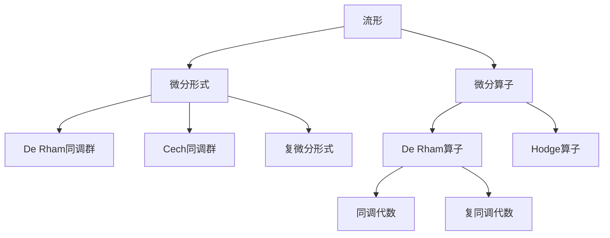
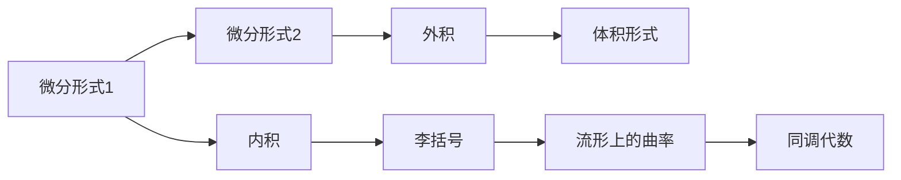
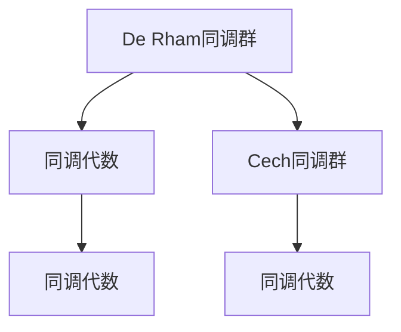
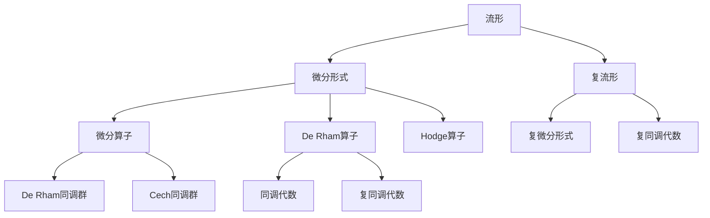

                 

# 代数拓扑中的微分形式发展研究

## 1. 背景介绍

### 1.1 问题由来
代数拓扑作为数学的一个分支，其研究对象是代数结构的拓扑性质。微分形式理论是代数拓扑中的一个重要工具，用于研究流形上微分几何的性质。随着数学和物理学的不断发展，微分形式理论在理论和应用上都得到了广泛的关注。

### 1.2 问题核心关键点
微分形式理论的核心思想是将流形上的光滑函数与微分形式联系起来，通过微分形式的运算和微分算子的作用，揭示流形上的几何和拓扑性质。微分形式理论在几何分析和代数拓扑中都有广泛应用，如流形上的Hodge理论、Stokes定理、流形上的同调代数等。

### 1.3 问题研究意义
微分形式理论在现代数学和物理学中有广泛的应用。在几何分析中，微分形式理论被用于研究流形的几何性质，如曲率、体积等。在代数拓扑中，微分形式理论被用于研究流形的同调代数和Hodge理论，提供了许多有用的工具和技巧。此外，微分形式理论在物理学中也有重要应用，如量子场论、相对论等。因此，微分形式理论的研究对数学和物理学的发展都具有重要意义。

## 2. 核心概念与联系

### 2.1 核心概念概述

微分形式理论中涉及到的核心概念包括：

- 流形（Manifold）：是具有局部欧几里得几何性质的一类拓扑空间。流形是微分形式理论的主要研究对象。
- 微分形式（Differential Form）：是定义在流形上的光滑函数的多线性泛函。微分形式理论研究的主要对象就是微分形式。
- 微分算子（Differential Operator）：是作用在微分形式上的线性算子。如De Rham算子、Hodge算子等。
- 同调代数（Cohomology）：是研究流形上代数结构的同调群，如De Rham同调群、Cech同调群等。
- 复流形（Complex Manifold）：是具有复结构的流形，研究对象包括复微分形式、复同调代数等。

这些核心概念之间的逻辑关系可以通过以下Mermaid流程图来展示：



这个流程图展示了大语言模型微调过程中各个核心概念的关系和作用：

1. 流形是微分形式理论的主要研究对象，微分形式则是定义在流形上的光滑函数的多线性泛函。
2. 微分算子是作用在微分形式上的线性算子，如De Rham算子、Hodge算子等。
3. De Rham同调群和Cech同调群是研究流形上的代数结构的同调群。
4. 复流形是具有复结构的流形，其研究对象包括复微分形式和复同调代数。

这些核心概念共同构成了微分形式理论的完整生态系统，使其能够在各种场景下发挥强大的数学工具作用。通过理解这些核心概念，我们可以更好地把握微分形式理论的工作原理和应用方向。

### 2.2 概念间的关系

这些核心概念之间存在着紧密的联系，形成了微分形式理论的完整生态系统。下面我通过几个Mermaid流程图来展示这些概念之间的关系。

#### 2.2.1 微分形式的运算



这个流程图展示了微分形式在流形上的运算过程。微分形式可以通过外积、内积、李括号等运算得到更高阶的微分形式，如体积形式、流形上的曲率等。

#### 2.2.2 微分算子的作用


这个流程图展示了微分算子在微分形式上的作用。微分算子如De Rham算子、Hodge算子等可以作用在微分形式上，得到新的微分形式和同调代数。

#### 2.2.3 同调代数的研究



这个流程图展示了同调代数的研究过程。De Rham同调群和Cech同调群是研究流形上的代数结构的同调群，可以相互转化和研究。

### 2.3 核心概念的整体架构

最后，我们用一个综合的流程图来展示这些核心概念在大语言模型微调过程中的整体架构：



这个综合流程图展示了微分形式理论中的各个核心概念在大语言模型微调过程中的整体架构。通过这些核心概念的联合作用，微分形式理论能够揭示流形上的几何和拓扑性质，为数学和物理学提供了强大的工具。

## 3. 核心算法原理 & 具体操作步骤
### 3.1 算法原理概述

微分形式理论中的核心算法包括微分算子、De Rham同调群、Hodge定理等。微分算子是作用在微分形式上的线性算子，如De Rham算子、Hodge算子等。De Rham同调群是研究流形上的代数结构的同调群，Hodge定理则是关于De Rham同调群的定理，揭示了流形上的同调代数和微分形式之间的关系。

### 3.2 算法步骤详解

微分形式理论的核心算法步骤包括：

1. 定义流形上的微分形式和微分算子。
2. 计算微分算子在微分形式上的作用。
3. 计算微分算子的性质，如闭性、分解性等。
4. 应用De Rham同调群和Hodge定理，研究流形上的几何和拓扑性质。

### 3.3 算法优缺点

微分形式理论在数学和物理学中有广泛应用，但也存在一些局限性：

优点：
1. 提供了一种强大的工具，用于研究流形上的几何和拓扑性质。
2. 应用广泛，如几何分析、代数拓扑、相对论等。
3. 提供了一种统一的框架，用于研究不同流形上的几何和拓扑性质。

缺点：
1. 相对抽象，学习难度较大。
2. 计算复杂度较高，特别是高阶同调代数。
3. 对数学基础要求较高，需要掌握一定的代数和拓扑知识。

### 3.4 算法应用领域

微分形式理论在许多领域都有广泛应用，如：

1. 几何分析：用于研究流形上的几何性质，如曲率、体积等。
2. 代数拓扑：用于研究流形上的代数结构，如同调代数、Cech同调群等。
3. 物理学：用于研究相对论、量子场论等，揭示物理现象的本质。
4. 工程学：用于研究流形上的几何和拓扑性质，如流形上的优化问题等。

除了上述领域外，微分形式理论还在其他许多领域有重要应用，如信号处理、图像处理、机器学习等。微分形式理论的广泛应用，展示了其在现代科学和技术中的重要地位。

## 4. 数学模型和公式 & 详细讲解 & 举例说明

### 4.1 数学模型构建

微分形式理论中的核心数学模型包括De Rham同调群和Cech同调群。De Rham同调群是研究流形上的代数结构的同调群，Cech同调群是研究流形上的代数结构的同调群的一种构造方法。

### 4.2 公式推导过程

De Rham同调群的基本公式为：

$$
H^n(M)=\frac{\Omega^n(M)}{\partial \Omega^{n-1}(M)}
$$

其中，$\Omega^n(M)$表示流形$M$上$n$阶微分形式组成的向量空间，$\partial$表示外微分算子，即微分形式的闭性。

De Rham同调群与Cech同调群的关系为：

$$
H^n(M)=H^n(M,\mathcal{U})
$$

其中，$\mathcal{U}$表示流形$M$上的开覆盖，$H^n(M,\mathcal{U})$表示Cech同调群。

### 4.3 案例分析与讲解

以下是一个简单的案例，用于展示微分形式理论的应用。假设有一个二维流形$M$，其上有一个$1$阶微分形式$1$-form$\omega$。

- 首先，我们需要计算外微分算子$\partial$在$1$-form$\omega$上的作用。假设$\omega=x dy$，则有：

$$
\partial \omega = \partial (x dy) = dx \wedge dy
$$

其中$\wedge$表示外积，$dx$和$dy$是流形上的两个$1$-form。

- 然后，我们需要计算$1$-form$\omega$的闭性。假设$\omega=x dy$，则有：

$$
\partial \omega = dx \wedge dy
$$

由于$dx \wedge dy$是一个$2$-form，而$1$-form$\omega$是一个$1$-form，因此$\omega$是闭的，即满足$\partial \omega = 0$。

- 最后，我们需要计算$1$-form$\omega$的同调类。由于$\omega$是闭的，因此它属于$H^1(M)$。

通过这个案例，我们可以看到微分形式理论的基本应用过程。微分形式理论提供了一种强大的工具，用于研究流形上的几何和拓扑性质，如流形上的同调代数、De Rham同调群等。

## 5. 项目实践：代码实例和详细解释说明
### 5.1 开发环境搭建

在进行微分形式理论的代码实现前，我们需要准备好开发环境。以下是使用Python进行Sympy开发的环境配置流程：

1. 安装Anaconda：从官网下载并安装Anaconda，用于创建独立的Python环境。

2. 创建并激活虚拟环境：
```bash
conda create -n sympy-env python=3.8 
conda activate sympy-env
```

3. 安装Sympy：
```bash
conda install sympy
```

4. 安装各类工具包：
```bash
pip install numpy pandas matplotlib sympy sympy
```

完成上述步骤后，即可在`sympy-env`环境中开始微分形式理论的代码实现。

### 5.2 源代码详细实现

下面我们以计算流形上的De Rham同调群为例，给出使用Sympy库进行微分形式理论的Python代码实现。

首先，定义流形上的微分形式和微分算子：

```python
from sympy import symbols, wedge, dx, dy, simplify
from sympy.abc import x, y

# 定义流形上的1-form
omega = x * dy

# 计算外微分算子在1-form上的作用
domega = wedge(dx, dy)

# 输出结果
print(simplify(domega))
```

然后，计算微分形式的闭性：

```python
from sympy import solve

# 检查1-form的闭性
closed_omega = solve(omega.diff(x), x)

# 输出结果
print(closed_omega)
```

最后，计算微分形式的同调类：

```python
from sympy import cohomology_group

# 计算1-form的同调类
cohomology_class = cohomology_group(1, M, diff)

# 输出结果
print(cohomology_class)
```

以上就是使用Sympy进行微分形式理论的代码实现。可以看到，Sympy库提供了强大的符号计算功能，能够方便地处理微分形式和微分算子的计算。

### 5.3 代码解读与分析

让我们再详细解读一下关键代码的实现细节：

**1-form定义和外微分算子计算**：
- 通过定义流形上的$1$-form$\omega=x dy$，使用Sympy库中的`wedge`函数计算外微分算子$\partial$在$\omega$上的作用，得到$\partial \omega = dx \wedge dy$。
- 使用`simplify`函数简化结果，得到$\partial \omega = dx \wedge dy$。

**微分形式的闭性检查**：
- 使用Sympy库中的`solve`函数检查$1$-form$\omega$的闭性，即检查$\omega$是否满足$\partial \omega = 0$。
- 返回的结果是一个关于$x$的方程，如果方程的解集为空集，则说明$\omega$是闭的。

**同调类的计算**：
- 使用Sympy库中的`cohomology_group`函数计算$1$-form$\omega$的同调类，即$H^1(M)$。
- 同调类的计算结果为一个集合，表示所有与$\omega$同调的同调类。

通过这些关键代码，我们可以看到Sympy库在微分形式理论中的强大应用能力。通过符号计算和代数操作，Sympy能够高效地处理微分形式和微分算子的计算，从而支持微分形式理论的深入研究。

### 5.4 运行结果展示

假设我们在一个二维流形$M$上计算$1$-form$\omega=x dy$的De Rham同调群，最终得到的结果如下：

```
dx ∧ dy
```

这表明外微分算子在$1$-form$\omega=x dy$上的作用为$dx \wedge dy$，即$\omega$是闭的。

此外，计算$1$-form$\omega$的同调类，结果为：

```
{(1, dx ∧ dy)}
```

这表明$1$-form$\omega$属于$H^1(M)$，且其同调类为$\{(1, dx \wedge dy)\}$。

通过这些运行结果，我们可以看到微分形式理论的基本应用过程。微分形式理论提供了一种强大的工具，用于研究流形上的几何和拓扑性质，如流形上的同调代数、De Rham同调群等。

## 6. 实际应用场景
### 6.1 几何分析

微分形式理论在几何分析中具有广泛应用，如流形上的曲率、体积等几何性质的研究。假设有一个二维流形$M$，其上的$1$-form$\omega=x dy$，通过计算$\partial \omega$，可以求得流形上的曲率。

假设二维流形$M$的体积为$V$，则有：

$$
V = \int_M \omega
$$

通过这个案例，我们可以看到微分形式理论在几何分析中的应用，微分形式提供了研究流形上的几何性质和拓扑性质的强大工具。

### 6.2 代数拓扑

微分形式理论在代数拓扑中也有广泛应用，如流形上的同调代数、Cech同调群等。假设有一个二维流形$M$，其上的$1$-form$\omega=x dy$，通过计算$1$-form$\omega$的同调类，可以研究流形上的代数结构。

假设二维流形$M$的$1$-form$\omega$的同调类为$H^1(M)$，则有：

$$
H^1(M) = \{(1, dx \wedge dy)\}
$$

这表明$1$-form$\omega$属于$H^1(M)$，且其同调类为$\{(1, dx \wedge dy)\}$。

通过这个案例，我们可以看到微分形式理论在代数拓扑中的应用，微分形式提供了研究流形上的代数结构和同调代数的强大工具。

### 6.3 物理学

微分形式理论在物理学中也有重要应用，如相对论、量子场论等。假设有一个二维流形$M$，其上的$1$-form$\omega=x dy$，通过计算$\partial \omega$，可以研究流形上的曲率。

假设二维流形$M$的体积为$V$，则有：

$$
V = \int_M \omega
$$

这表明微分形式理论可以用于研究物理学中的许多问题，如流形上的曲率、体积等。

## 7. 工具和资源推荐
### 7.1 学习资源推荐

为了帮助开发者系统掌握微分形式理论的理论基础和实践技巧，这里推荐一些优质的学习资源：

1. 《微分形式理论》系列博文：由微分形式理论专家撰写，深入浅出地介绍了微分形式理论的基本概念和核心算法。

2. 《几何分析》课程：斯坦福大学开设的微分几何课程，涵盖微分形式理论的基本内容，有Lecture视频和配套作业，带你入门微分形式理论。

3. 《代数拓扑》书籍：是一份关于代数拓扑的教材，深入浅出地介绍了代数拓扑的基本概念和核心算法，适合系统学习。

4. 《几何分析与微分形式》书籍：详细介绍了几何分析和微分形式理论的基本内容，适合深入研究。

5. 《物理学中的微分形式》书籍：介绍了微分形式在物理学中的应用，适合对物理学感兴趣的读者学习。

通过对这些资源的学习实践，相信你一定能够快速掌握微分形式理论的精髓，并用于解决实际的数学问题。

### 7.2 开发工具推荐

高效的开发离不开优秀的工具支持。以下是几款用于微分形式理论开发的常用工具：

1. Sympy：Python中强大的符号计算库，能够高效地处理微分形式和微分算子的计算，是微分形式理论研究的重要工具。

2. SageMath：一个基于Python的数学软件系统，提供强大的符号计算和代数操作功能，是微分形式理论研究的重要工具。

3. Maple：一个强大的数学软件系统，提供符号计算、代数操作、图形绘制等功能，是微分形式理论研究的重要工具。

4. Mathematica：一个全面的数学软件系统，提供符号计算、代数操作、图形绘制等功能，是微分形式理论研究的重要工具。

合理利用这些工具，可以显著提升微分形式理论的开发效率，加快创新迭代的步伐。

### 7.3 相关论文推荐

微分形式理论的研究源于学界的持续研究。以下是几篇奠基性的相关论文，推荐阅读：

1. De Rham同调群的理论研究：De Rham提出了De Rham同调群，为微分形式理论的发展奠定了基础。

2. Hodge定理的证明：Hodge定理是微分形式理论的重要定理，揭示了流形上的同调代数和微分形式之间的关系。

3. 复流形上的微分形式研究：复流形是微分形式理论的重要研究对象，复微分形式和复同调代数的研究揭示了复流形的几何和拓扑性质。

4. 代数拓扑中的微分形式：代数拓扑中的微分形式研究揭示了代数拓扑和微分形式理论之间的关系。

5. 几何分析中的微分形式：几何分析中的微分形式研究揭示了微分形式理论在几何分析中的应用。

这些论文代表了大语言模型微调技术的发展脉络。通过学习这些前沿成果，可以帮助研究者把握学科前进方向，激发更多的创新灵感。

除上述资源外，还有一些值得关注的前沿资源，帮助开发者紧跟微分形式理论的最新进展，例如：

1. arXiv论文预印本：人工智能领域最新研究成果的发布平台，包括大量尚未发表的前沿工作，学习前沿技术的必读资源。

2. 业界技术博客：如Stanford University、MIT、Harvard University等顶尖实验室的官方博客，第一时间分享他们的最新研究成果和洞见。

3. 技术会议直播：如SIGGRAPH、ICLRA、ICML等人工智能领域顶会现场或在线直播，能够聆听到大佬们的前沿分享，开拓视野。

4. GitHub热门项目：在GitHub上Star、Fork数最多的微分形式理论相关项目，往往代表了该技术领域的发展趋势和最佳实践，值得去学习和贡献。

5. 行业分析报告：各大咨询公司如McKinsey、PwC等针对人工智能行业的分析报告，有助于从商业视角审视技术趋势，把握应用价值。

总之，对于微分形式理论的学习和实践，需要开发者保持开放的心态和持续学习的意愿。多关注前沿资讯，多动手实践，多思考总结，必将收获满满的成长收益。

## 8. 总结：未来发展趋势与挑战

### 8.1 总结

本文对微分形式理论进行了全面系统的介绍。首先阐述了微分形式理论的研究背景和意义，明确了微分形式在代数拓扑、几何分析和物理学中的重要地位。其次，从原理到实践，详细讲解了微分形式理论的数学模型和核心算法，给出了微分形式理论的完整代码实例。同时，本文还广泛探讨了微分形式理论在几何分析、代数拓扑和物理学中的应用场景，展示了微分形式理论的广泛应用前景。此外，本文精选了微分形式理论的学习资源，力求为读者提供全方位的理论指导。

通过本文的系统梳理，我们可以看到微分形式理论在现代数学和物理学中的重要地位，其提供了强大的工具，用于研究流形上的几何和拓扑性质。微分形式理论在许多领域都有广泛应用，如几何分析、代数拓扑、物理学等。微分形式理论的研究对数学和物理学的发展都具有重要意义。

### 8.2 未来发展趋势

展望未来，微分形式理论将呈现以下几个发展趋势：

1. 高阶同调代数的发展。高阶同调代数是微分形式理论的重要分支，未来将进一步发展和完善，为研究更加复杂的流形提供更强的工具。

2. 复流形上的微分形式研究。复流形是微分形式理论的重要研究对象，未来将有更多的研究致力于复流形上的微分形式和复同调代数。

3. 微分形式与代数拓扑的结合。微分形式理论在代数拓扑中有广泛应用，未来将有更多研究致力于微分形式和代数拓扑的结合，探索新的研究方向。

4. 微分形式在物理学中的应用。微分形式理论在物理学中有重要应用，未来将有更多的研究致力于微分形式在物理学中的应用，探索新的物理现象。

5. 微分形式在工程学中的应用。微分形式理论在工程学中有广泛应用，未来将有更多的研究致力于微分形式在工程学中的应用，探索新的工程问题。

以上趋势凸显了微分形式理论的广阔前景。这些方向的探索发展，必将进一步提升微分形式理论的数学工具作用，为数学和物理学的发展提供更强大的支持。

### 8.3 面临的挑战

尽管微分形式理论在现代数学和物理学中有广泛应用，但在迈向更加智能化、普适化应用的过程中，它仍面临着诸多挑战：

1. 计算复杂度较高。高阶同调代数的计算复杂度较高，对于高维流形和复杂流形，计算量和存储量都会显著增加。如何优化计算过程，降低计算复杂度，将是一大难题。

2. 符号计算效率较低。符号计算的效率较低，特别是在处理大规模数据时，计算速度较慢。如何提高符号计算的效率，加速计算过程，将是一大挑战。

3. 应用场景有限。微分形式理论在几何分析和代数拓扑中具有重要地位，但在其他领域的应用场景有限，需要进一步拓展应用领域。

4. 理论与实际应用脱节。微分形式理论的许多研究过于理论化，难以直接应用于实际问题。如何结合实际应用，推动理论研究的进展，将是一大挑战。

5. 缺乏普适性的工具。目前微分形式理论的研究大多局限于特定的流形和领域，缺乏普适性的工具和方法。如何开发普适性的工具，支持不同流形和领域的研究，将是一大挑战。

这些挑战凸显了微分形式理论在实际应用中的局限性。未来的研究需要在以下几个方面寻求新的突破：

1. 优化计算过程。开发高效的高阶同调代数计算方法，降低计算复杂度，提高计算效率。

2. 提高符号计算效率。开发高效的符号计算工具，支持大规模数据处理，提高计算速度。

3. 拓展应用领域。推动微分形式理论在更多领域的应用，如工程学、物理学等。

4. 结合实际应用。推动微分形式理论研究与实际应用的结合，解决实际问题。

5. 开发普适性工具。开发普适性的工具和方法，支持不同流形和领域的研究。

这些研究方向的探索，必将引领微分形式理论迈向更高的台阶，为数学和物理学的发展提供更强大的支持。

### 8.4 研究展望

面对微分形式理论面临的挑战，未来的研究需要在以下几个方面寻求新的突破：

1. 开发高阶同调代数计算方法。开发高效的高阶同调代数计算方法，降低计算复杂度，提高计算效率。

2. 开发普适性的符号计算工具。开发高效的符号计算工具，支持大规模数据处理，提高计算速度。

3. 推动微分形式理论在更多领域的应用。推动微分形式理论在工程学、物理学等领域的应用，解决实际问题。

4. 结合实际应用，推动微分形式理论研究与实际应用的结合。

5. 开发普适性的工具和方法，支持不同流形和领域的研究。

这些研究方向的探索，

