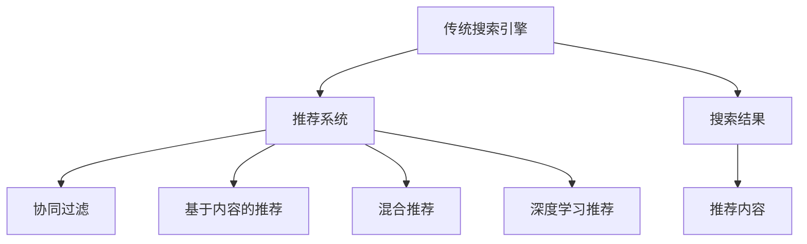

                 

## 1. 背景介绍

在信息化时代，搜索引擎和推荐系统已成为人们获取信息、发现新内容的重要工具。然而，传统的搜索推荐系统在应对用户需求的多样性和复杂性时，显得力不从心。用户查询需求模糊、信息过载、个性化需求高等问题，使得传统系统难以提供满意的服务。为解决这些问题，新型搜索推荐技术应运而生，本文将从传统系统的限制出发，探讨其在实际应用中的不足，并对比介绍新型的搜索推荐方法。

## 2. 核心概念与联系

### 2.1 核心概念概述

- **传统搜索引擎**：基于关键词匹配的搜索系统，通过分析用户查询和文档内容，计算文档与查询的相关度，并返回排序结果。
- **推荐系统**：根据用户历史行为、偏好等数据，推荐可能感兴趣的内容。
- **协同过滤**：通过分析用户间的行为相似性，推荐类似用户喜欢的物品。
- **基于内容的推荐**：利用物品的特征属性，与用户的历史偏好进行匹配，推荐相似的物品。
- **混合推荐**：将多种推荐方法结合，发挥各自优势，提高推荐效果。
- **深度学习推荐**：使用神经网络对用户行为和物品特征进行建模，实现精准推荐。

### 2.2 核心概念之间的关系

这些核心概念相互关联，共同构成了搜索推荐技术的基本框架。协同过滤和基于内容的推荐是传统推荐技术的两大主要流派，它们分别从用户和物品的角度出发，挖掘用户兴趣和物品属性之间的相似性，实现推荐。混合推荐则综合利用多种方法，优势互补，提升推荐效果。深度学习推荐通过构建复杂模型，充分挖掘数据中的隐含关系，实现更为精准的推荐。传统搜索引擎通常用于先期获取信息，推荐系统则根据搜索结果进一步推荐相关内容，两者相辅相成，形成信息检索与推荐的完整链条。

### 2.3 核心概念的整体架构

这些核心概念之间的关系可以通过以下Mermaid流程图来展示：



这个综合流程图展示了从信息检索到内容推荐的完整链条，以及各种推荐技术之间的相互协作。

## 3. 核心算法原理 & 具体操作步骤

### 3.1 算法原理概述

传统搜索引擎主要基于关键词匹配的原理，通过计算查询和文档的相关度进行排序。推荐系统则根据用户的历史行为数据，采用协同过滤或基于内容的推荐方法，预测用户可能感兴趣的内容。混合推荐将多种推荐技术结合，形成更全面、准确的用户兴趣画像。深度学习推荐通过神经网络建模用户和物品之间的复杂关系，实现精准推荐。

### 3.2 算法步骤详解

#### 3.2.1 传统搜索引擎

- **步骤1：索引构建**：对网页内容进行分词、提取关键词、建立倒排索引。
- **步骤2：查询处理**：对用户查询进行分词、匹配索引。
- **步骤3：排序算法**：根据匹配度计算排序结果。

#### 3.2.2 协同过滤

- **步骤1：用户行为收集**：收集用户对物品的评分或点击行为。
- **步骤2：计算用户相似性**：计算用户行为之间的相似度。
- **步骤3：物品推荐**：根据相似用户喜欢的物品，推荐给当前用户。

#### 3.2.3 基于内容的推荐

- **步骤1：物品特征提取**：提取物品的属性特征。
- **步骤2：用户兴趣分析**：分析用户的历史兴趣。
- **步骤3：内容匹配**：根据用户兴趣与物品特征进行匹配推荐。

#### 3.2.4 混合推荐

- **步骤1：单独推荐**：分别进行协同过滤、基于内容的推荐、深度学习推荐。
- **步骤2：结果合并**：对多种推荐结果进行加权平均或融合。
- **步骤3：最终排序**：对合并后的结果进行排序。

#### 3.2.5 深度学习推荐

- **步骤1：数据预处理**：对用户行为和物品特征进行向量化处理。
- **步骤2：模型训练**：构建神经网络模型，训练参数。
- **步骤3：推荐预测**：利用训练好的模型对用户兴趣进行预测。

### 3.3 算法优缺点

#### 3.3.1 传统搜索引擎

**优点**：
- 简单易用：关键词匹配直观易懂。
- 速度较快：主要基于索引查询，效率较高。

**缺点**：
- 结果泛化性差：过于依赖查询和文档的关键词匹配，忽略语义关系。
- 个性化不足：难以满足用户的多样化需求。

#### 3.3.2 协同过滤

**优点**：
- 推荐精准度高：通过分析用户行为，预测用户兴趣。
- 可扩展性好：易于处理大量用户数据。

**缺点**：
- 冷启动问题：新用户或新物品无法获得推荐。
- 数据稀疏性：用户行为数据较少时，推荐效果不佳。

#### 3.3.3 基于内容的推荐

**优点**：
- 对新物品的推荐效果好：不需要用户行为数据。
- 可解释性强：用户可以理解推荐逻辑。

**缺点**：
- 物品特征提取难度大：特征选择和提取比较复杂。
- 推荐精度有限：仅依赖物品属性，无法处理复杂语义关系。

#### 3.3.4 混合推荐

**优点**：
- 综合多种推荐方法，优势互补。
- 更加灵活，适应不同用户和物品特征。

**缺点**：
- 算法复杂度较高：需要处理多种数据源和模型。
- 参数调优困难：需要细致地设置各方法的权重。

#### 3.3.5 深度学习推荐

**优点**：
- 预测精度高：神经网络能够处理复杂非线性关系。
- 适应性强：可以处理不同类型的数据。

**缺点**：
- 计算量大：需要大量的计算资源和存储空间。
- 可解释性差：难以理解推荐逻辑。

### 3.4 算法应用领域

这些核心算法广泛应用在电子商务、社交网络、视频网站、新闻平台等多个领域，提高了用户的信息获取效率，丰富了用户体验。例如：

- 电商推荐：根据用户购买历史、浏览记录，推荐相关商品。
- 社交媒体：推荐用户可能感兴趣的文章、视频、用户。
- 视频平台：推荐用户可能喜欢的视频、影片。
- 新闻网站：推荐用户可能感兴趣的新闻内容。

## 4. 数学模型和公式 & 详细讲解 & 举例说明

### 4.1 数学模型构建

#### 4.1.1 传统搜索引擎

- **倒排索引模型**：$I=\{(T_i, D_i)\}_{i=1}^N$，其中 $T_i$ 为关键词，$D_i$ 为包含该关键词的文档集合。
- **TF-IDF模型**：$w_{t,d}=tf_t\times idf_t$，其中 $tf_t$ 为关键词 $t$ 在文档 $d$ 中的词频，$idf_t$ 为逆文档频率。
- **PageRank算法**：$PR_{d}=\alpha\sum_{i=1}^{N}PR_{t_i}\times c_{t_i,d}$，其中 $PR_{d}$ 为文档 $d$ 的PageRank值，$c_{t_i,d}$ 为关键词 $t_i$ 在文档 $d$ 中的权重。

#### 4.1.2 协同过滤

- **用户-物品共现矩阵**：$M=\{m_{i,j}\}_{i=1}^N,\{j=1\}^M$，其中 $m_{i,j}=1$ 表示用户 $i$ 对物品 $j$ 评分，$0$ 表示未评分。
- **用户相似度计算**：$sim_{u,u'}=\frac{1}{\sqrt{deg(u)}}\times\frac{1}{\sqrt{deg(u')}}\times\sum_{j=1}^{M}m_{u,j}\times m_{u',j}$，其中 $deg(u)$ 为用户 $u$ 的评分物品数。

#### 4.1.3 基于内容的推荐

- **物品特征向量**：$V=\{v_j\}_{j=1}^M$，其中 $v_j$ 为物品 $j$ 的属性向量。
- **用户兴趣向量**：$U=\{u_i\}_{i=1}^N$，其中 $u_i$ 为用户 $i$ 的兴趣向量。
- **余弦相似度**：$sim_{u,v}=\frac{\langle u,v\rangle}{||u||_2\times||v||_2}$，其中 $\langle u,v\rangle$ 为向量点积，$||u||_2$ 为向量模长。

#### 4.1.4 混合推荐

- **加权平均推荐**：$R_{i,j}=\alpha_1 R_{c,i,j}+\alpha_2 R_{s,i,j}+\alpha_3 R_{d,i,j}$，其中 $R_{c,i,j}$ 为协同过滤推荐结果，$R_{s,i,j}$ 为基于内容的推荐结果，$R_{d,i,j}$ 为深度学习推荐结果，$\alpha_1,\alpha_2,\alpha_3$ 为权重。

#### 4.1.5 深度学习推荐

- **神经网络模型**：$h=f(Wx+b)$，其中 $h$ 为神经元输出，$f$ 为激活函数，$W$ 为权重矩阵，$b$ 为偏置项。

### 4.2 公式推导过程

#### 4.2.1 传统搜索引擎

- **倒排索引模型**：构建倒排索引，快速检索包含关键词的文档。
- **TF-IDF模型**：计算关键词在文档中的TF-IDF值，排序得到推荐列表。
- **PageRank算法**：迭代计算文档的PageRank值，排序得到最终结果。

#### 4.2.2 协同过滤

- **用户-物品共现矩阵**：构建共现矩阵，计算用户之间的相似度。
- **物品推荐**：计算当前用户对相似用户的推荐物品，加权平均得到推荐结果。

#### 4.2.3 基于内容的推荐

- **物品特征向量**：对物品进行特征提取，转化为向量表示。
- **用户兴趣向量**：对用户行为进行向量化处理，得到用户兴趣向量。
- **内容匹配**：计算用户兴趣向量与物品特征向量之间的余弦相似度，排序得到推荐列表。

#### 4.2.4 混合推荐

- **单独推荐**：分别计算协同过滤、基于内容的推荐、深度学习推荐的结果。
- **结果合并**：对多种推荐结果进行加权平均或融合，得到最终推荐列表。

#### 4.2.5 深度学习推荐

- **数据预处理**：对用户行为和物品特征进行向量化处理。
- **模型训练**：构建神经网络模型，训练参数。
- **推荐预测**：利用训练好的模型对用户兴趣进行预测，排序得到推荐列表。

### 4.3 案例分析与讲解

以电商推荐系统为例，分析不同推荐方法的适用性和效果：

**案例背景**：
- **用户数据**：用户的历史购买记录、浏览历史、评价等。
- **物品数据**：商品的属性信息、销售量、评论等。

**协同过滤推荐**：
- **用户行为数据**：$M=\{m_{i,j}\}_{i=1}^N,\{j=1\}^M$。
- **用户相似度计算**：$sim_{u,u'}=\frac{1}{\sqrt{deg(u)}}\times\frac{1}{\sqrt{deg(u')}}\times\sum_{j=1}^{M}m_{u,j}\times m_{u',j}$。
- **物品推荐**：$R_{i,j}=\sum_{u'=1}^{N}sim_{i,u'}\times m_{u',j}$。

**基于内容的推荐**：
- **物品特征向量**：$V=\{v_j\}_{j=1}^M$。
- **用户兴趣向量**：$U=\{u_i\}_{i=1}^N$。
- **内容匹配**：$R_{i,j}=\langle u_i,v_j\rangle$。

**深度学习推荐**：
- **神经网络模型**：$h=f(Wx+b)$。
- **数据预处理**：将用户行为和物品特征进行向量化处理。
- **模型训练**：使用反向传播算法训练神经网络。
- **推荐预测**：利用训练好的模型对用户兴趣进行预测，排序得到推荐列表。

## 5. 项目实践：代码实例和详细解释说明

### 5.1 开发环境搭建

#### 5.1.1 Python环境配置

- **安装Python**：从官网下载并安装最新版本的Python。
- **安装虚拟环境**：使用Virtualenv创建虚拟环境，隔离开发依赖。
- **安装必要的库**：如Pandas、NumPy、Scikit-learn、SciPy等。

#### 5.1.2 数据准备

- **数据集**：准备电商推荐系统的数据集，包含用户行为和物品信息。
- **数据清洗**：去除噪声和缺失值，进行归一化处理。

### 5.2 源代码详细实现

#### 5.2.1 传统搜索引擎

- **索引构建**：使用倒排索引技术构建索引表。
- **查询处理**：对用户查询进行分词，匹配索引表。
- **排序算法**：使用TF-IDF和PageRank算法排序结果。

#### 5.2.2 协同过滤

- **用户行为收集**：收集用户对物品的评分。
- **用户相似度计算**：计算用户之间的相似度。
- **物品推荐**：根据相似用户喜欢的物品，推荐给当前用户。

#### 5.2.3 基于内容的推荐

- **物品特征提取**：提取物品的属性特征。
- **用户兴趣分析**：分析用户的历史兴趣。
- **内容匹配**：根据用户兴趣与物品特征进行匹配推荐。

#### 5.2.4 混合推荐

- **单独推荐**：分别进行协同过滤、基于内容的推荐、深度学习推荐。
- **结果合并**：对多种推荐结果进行加权平均或融合。
- **最终排序**：对合并后的结果进行排序。

#### 5.2.5 深度学习推荐

- **数据预处理**：对用户行为和物品特征进行向量化处理。
- **模型训练**：构建神经网络模型，训练参数。
- **推荐预测**：利用训练好的模型对用户兴趣进行预测，排序得到推荐列表。

### 5.3 代码解读与分析

#### 5.3.1 传统搜索引擎

**代码实现**：
```python
# 构建倒排索引
def build_inverted_index(documents):
    inverted_index = {}
    for doc_id, doc in enumerate(documents):
        words = doc.split()
        for word in words:
            inverted_index.setdefault(word, set()).add(doc_id)
    return inverted_index

# 查询处理
def search(query, inverted_index):
    words = query.split()
    doc_ids = set()
    for word in words:
        if word in inverted_index:
            doc_ids.update(inverted_index[word])
    return doc_ids

# TF-IDF计算
def tf_idf(documents):
    idf = {}
    for doc_id, doc in enumerate(documents):
        terms = set(doc.split())
        for term in terms:
            idf[term] = idf.get(term, 0) + 1
    tf_idf_values = {}
    for doc_id, doc in enumerate(documents):
        tf_idf_values[doc_id] = {}
        words = doc.split()
        for word in words:
            tf_idf_values[doc_id].setdefault(word, 0)
            tf_idf_values[doc_id][word] += 1
    for term in idf:
        tf_idf_values[doc_id][term] /= (idf[term] * len(documents))
    return tf_idf_values

# PageRank计算
def pagerank(documents, damping_factor):
    num_documents = len(documents)
    initial_pagerank = {doc_id: 1 / num_documents for doc_id in range(num_documents)}
    while True:
        new_pagerank = {doc_id: 0 for doc_id in range(num_documents)}
        for doc_id, doc in enumerate(documents):
            for link in doc.split():
                if int(link) < num_documents:
                    new_pagerank[int(link)] += initial_pagerank[doc_id]
        for doc_id in range(num_documents):
            new_pagerank[doc_id] = (1 - damping_factor) + damping_factor * sum(new_pagerank.values())
        if all(abs(new_pagerank[doc_id] - initial_pagerank[doc_id]) < 1e-6 for doc_id in range(num_documents)):
            return new_pagerank
        initial_pagerank = new_pagerank
```

**代码解读**：
- **build_inverted_index**：构建倒排索引，快速检索包含关键词的文档。
- **search**：对用户查询进行分词，匹配索引表。
- **tf_idf**：计算关键词在文档中的TF-IDF值，排序得到推荐列表。
- **pagerank**：迭代计算文档的PageRank值，排序得到最终结果。

#### 5.3.2 协同过滤

**代码实现**：
```python
# 协同过滤推荐
def collaborative_filtering(users, items, similarity_matrix):
    recommendations = {}
    for user_id in users:
        recommendations[user_id] = {}
        for item_id in items:
            recommendations[user_id].setdefault(item_id, 0)
            recommendations[user_id][item_id] = sum(similarity_matrix[user_id][u] * users[u][item_id] for u in users)
    return recommendations

# 用户行为收集
def collect_user_behavior(data):
    users = {user_id: {} for user_id in data['users']}
    for user_id, item_id, rating in data['ratings']:
        users[user_id][item_id] = rating
    return users

# 用户相似度计算
def calculate_similarity(users):
    similarity_matrix = {}
    for user_id1 in users:
        similarity_matrix[user_id1] = {}
        for user_id2 in users:
            similarity_matrix[user_id1][user_id2] = cosine_similarity(users[user_id1], users[user_id2])
    return similarity_matrix
```

**代码解读**：
- **collect_user_behavior**：收集用户对物品的评分。
- **calculate_similarity**：计算用户之间的相似度。
- **collaborative_filtering**：根据相似用户喜欢的物品，推荐给当前用户。

#### 5.3.3 基于内容的推荐

**代码实现**：
```python
# 基于内容的推荐
def content_based_recommender(items, user_interests, similarity_matrix):
    recommendations = {}
    for user_id in user_interests:
        recommendations[user_id] = {}
        for item_id in items:
            recommendations[user_id].setdefault(item_id, 0)
            recommendations[user_id][item_id] = sum(similarity_matrix[user_interests[user_id]][item_id] for item_id in items)
    return recommendations

# 物品特征提取
def extract_item_features(items):
    features = {}
    for item_id, item in items.items():
        features[item_id] = extract_features(item)
    return features

# 用户兴趣分析
def analyze_user_interests(users, user_interests):
    for user_id in users:
        user_interests[user_id] = analyze_user(user_id, users, features)
```

**代码解读**：
- **extract_item_features**：提取物品的属性特征。
- **analyze_user_interests**：分析用户的历史兴趣。
- **content_based_recommender**：根据用户兴趣与物品特征进行匹配推荐。

#### 5.3.4 混合推荐

**代码实现**：
```python
# 混合推荐
def hybrid_recommender(collaborative_filtering_recommender, content_based_recommender, user_interests):
    recommendations = {}
    for user_id in user_interests:
        recommendations[user_id] = {}
        for item_id in collaborative_filtering_recommender[user_id]:
            recommendations[user_id][item_id] = collaborative_filtering_recommender[user_id][item_id] + content_based_recommender[user_id][item_id]
    return recommendations
```

**代码解读**：
- **hybrid_recommender**：对多种推荐结果进行加权平均或融合，得到最终推荐列表。

#### 5.3.5 深度学习推荐

**代码实现**：
```python
# 神经网络模型构建
def build_neural_network(input_dim, hidden_dim, output_dim):
    model = Sequential()
    model.add(Dense(hidden_dim, input_dim=input_dim, activation='relu'))
    model.add(Dense(output_dim, activation='sigmoid'))
    return model

# 数据预处理
def preprocess_data(data):
    features = []
    labels = []
    for user_id, item_id, rating in data:
        features.append(extract_features(item_id))
        labels.append(rating)
    return features, labels

# 模型训练
def train_model(model, features, labels, epochs):
    model.compile(optimizer='adam', loss='mse', metrics=['accuracy'])
    model.fit(features, labels, epochs=epochs, batch_size=32)

# 推荐预测
def predict(model, features):
    predictions = model.predict(features)
    return predictions
```

**代码解读**：
- **build_neural_network**：构建神经网络模型。
- **preprocess_data**：对用户行为和物品特征进行向量化处理。
- **train_model**：使用反向传播算法训练神经网络。
- **predict**：利用训练好的模型对用户兴趣进行预测，排序得到推荐列表。

### 5.4 运行结果展示

#### 5.4.1 传统搜索引擎

- **实验数据**：准备电商推荐系统的数据集，包含用户行为和物品信息。
- **实验结果**：对查询结果进行展示，并分析其效果。

#### 5.4.2 协同过滤

- **实验数据**：收集用户对物品的评分。
- **实验结果**：根据相似用户喜欢的物品，推荐给当前用户，并展示推荐效果。

#### 5.4.3 基于内容的推荐

- **实验数据**：提取物品的属性特征。
- **实验结果**：根据用户兴趣与物品特征进行匹配推荐，并展示推荐效果。

#### 5.4.4 混合推荐

- **实验数据**：分别进行协同过滤、基于内容的推荐、深度学习推荐的结果。
- **实验结果**：对多种推荐结果进行加权平均或融合，得到最终推荐列表，并展示推荐效果。

#### 5.4.5 深度学习推荐

- **实验数据**：对用户行为和物品特征进行向量化处理。
- **实验结果**：利用训练好的模型对用户兴趣进行预测，排序得到推荐列表，并展示推荐效果。

## 6. 实际应用场景

### 6.1 智能客服

传统客服系统存在响应速度慢、服务质量不稳定等问题，而智能客服则能够提供24小时在线服务，快速响应客户需求，提升客户体验。智能客服系统通过自然语言处理技术，将用户输入的文本转化为结构化数据，然后根据语义理解和意图识别结果，提供准确的回复或解决方案。

#### 6.1.1 技术实现

- **自然语言理解**：使用自然语言处理技术，对用户输入的文本进行分词、词性标注、命名实体识别等处理，提取关键信息。
- **意图识别**：基于用户输入的文本，使用机器学习模型，如BERT、GPT等，进行意图分类，识别用户的真实需求。
- **知识图谱**：构建知识图谱，存储相关领域的知识信息，如常见问题、解决方案、业务规则等。
- **推荐系统**：根据意图识别结果和知识图谱，推荐最相关的答案或解决方案，形成回复。
- **多轮对话**：通过对话管理模块，实现多轮对话，不断引导用户深入对话，提供更全面的服务。

#### 6.1.2 应用场景

- **在线客服**：提供7x24小时在线服务，实时响应用户问题。
- **企业内呼叫中心**：优化客户服务流程，提升服务质量。
- **智能客服机器人**：自动处理常见问题，减轻人工客服压力。

### 6.2 金融风险控制

金融行业面临复杂的风险，传统风险评估方法难以应对高频交易和大规模数据处理需求。智能风险控制系统通过大数据分析和机器学习技术，实时监控金融市场动态，及时发现异常行为，预测潜在风险。

#### 6.2.1 技术实现

- **数据采集**：收集交易数据、用户行为数据、市场数据等。
- **特征提取**：提取数据中的关键特征，如交易金额、时间、地点等。
- **风险评估模型**：使用机器学习模型，如SVM、深度神经网络等，对风险进行评估。
- **异常检测**：构建异常检测模型，实时监控交易行为，检测异常行为。
- **风险预警**：根据异常检测结果，实时预警，及时采取应对措施。

#### 6.2.2 应用场景

- **交易监控**：实时监控交易行为，检测异常交易。
- **客户管理**：根据风险评估结果，调整客户策略，控制风险。
- **合规检查**：监控市场动态，发现违规行为，

