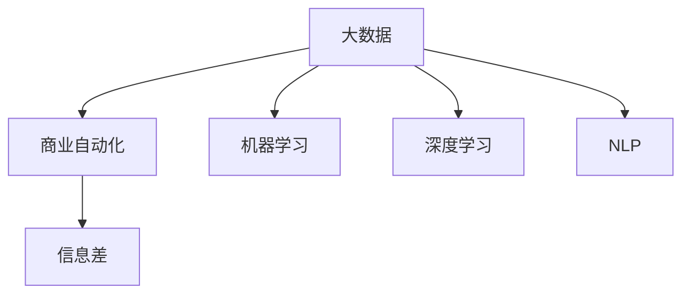
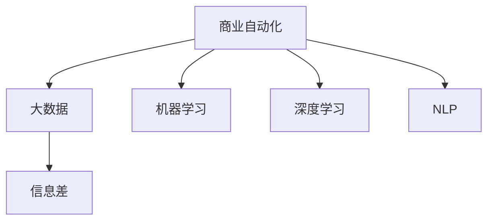
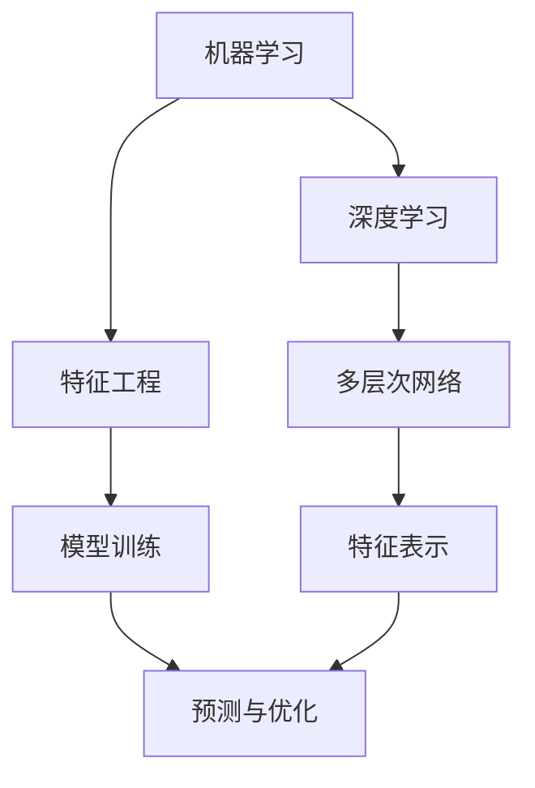

                 

## 1. 背景介绍

### 1.1 问题由来
在当今数据驱动的时代，信息差（Information Gap）已成为商业竞争的关键点之一。企业为了获取信息，需要投入大量人力、物力和财力进行市场调研、数据采集和分析，而这些环节往往容易出错或遗漏，导致决策偏差。为了解决这一问题，商业自动化（Business Automation）应运而生，利用大数据和人工智能技术，自动化处理信息差问题，提升决策效率和准确性。

### 1.2 问题核心关键点
商业自动化主要解决的是如何通过大数据技术，实现信息差自动化的过程。关键在于：
1. 收集数据：采集全面的市场和客户数据，确保数据的多样性和代表性。
2. 数据清洗：对数据进行去重、去噪、格式化等预处理，保证数据质量。
3. 数据分析：运用统计学、机器学习等方法，挖掘数据中的潜在价值。
4. 自动决策：通过模型预测和优化，自动生成商业决策。
5. 反馈优化：对自动决策结果进行评估和修正，不断提高自动化水平。

### 1.3 问题研究意义
商业自动化在提升企业效率、降低运营成本、优化决策等方面具有重要意义：

1. **提高决策效率**：通过自动化处理信息差，企业能够迅速响应市场变化，快速做出决策。
2. **降低运营成本**：减少人工操作和错误，节省人力和资源。
3. **优化决策质量**：利用大数据分析，企业可以更加准确地理解市场和客户需求，提升决策质量。
4. **增强竞争优势**：商业自动化提升了企业的市场反应速度和竞争力，使其在激烈的市场竞争中占据优势。
5. **创新商业模式**：自动化处理信息差，推动了商业模式的创新，如基于数据驱动的个性化营销、供应链优化等。

## 2. 核心概念与联系

### 2.1 核心概念概述

要深入理解大数据如何实现商业自动化，首先需要了解几个核心概念：

- **大数据（Big Data）**：指规模巨大、类型多样、高速生成、价值密度低的数据集合。
- **商业自动化（Business Automation）**：利用大数据和人工智能技术，自动化处理商业决策过程中的信息差问题。
- **信息差（Information Gap）**：指企业在信息获取、处理和决策过程中存在的偏差和错误。
- **机器学习（Machine Learning）**：通过数据训练模型，自动学习数据中的规律和模式。
- **深度学习（Deep Learning）**：利用多层神经网络，对复杂非结构化数据进行深入学习。
- **自然语言处理（NLP）**：让计算机能够理解和生成人类语言，用于文本分析、情感分析等任务。

这些概念之间的逻辑关系可以通过以下Mermaid流程图来展示：



这个流程图展示了大数据技术通过机器学习、深度学习和自然语言处理等手段，实现对商业自动化的支撑。

### 2.2 概念间的关系

这些核心概念之间存在着紧密的联系，形成了商业自动化的完整生态系统。下面我通过几个Mermaid流程图来展示这些概念之间的关系。

#### 2.2.1 商业自动化的学习范式



这个流程图展示了商业自动化的大数据、机器学习、深度学习和自然语言处理之间的关联。

#### 2.2.2 信息差的自动化处理


这个流程图展示了信息差的自动化处理过程，包括数据采集、清洗、分析、决策和优化。

#### 2.2.3 机器学习和深度学习的关系



这个流程图展示了机器学习和深度学习之间的相互关系，包括特征工程、模型训练、预测与优化等环节。

## 3. 核心算法原理 & 具体操作步骤
### 3.1 算法原理概述

商业自动化的核心算法原理主要基于机器学习和大数据处理，通过自动化处理信息差，实现商业决策的优化和提升。其核心思想是：

1. **数据收集与预处理**：收集全面的市场和客户数据，对数据进行清洗和处理，确保数据质量。
2. **数据分析与建模**：利用机器学习或深度学习模型，对数据进行特征提取、建模和预测，挖掘数据中的潜在价值。
3. **自动决策与优化**：根据模型预测结果，自动生成商业决策，并对决策结果进行评估和优化，不断提高决策质量。

### 3.2 算法步骤详解

商业自动化的具体操作步骤包括：

1. **数据收集**：通过网络爬虫、API接口、问卷调查等方式，收集全面的市场和客户数据。
2. **数据清洗**：对数据进行去重、去噪、格式化等预处理，确保数据质量。
3. **数据分析**：利用机器学习或深度学习模型，对数据进行特征提取、建模和预测。
4. **自动决策**：根据模型预测结果，自动生成商业决策，如定价、促销、库存管理等。
5. **反馈优化**：对自动决策结果进行评估和修正，不断提高自动化水平。

### 3.3 算法优缺点

商业自动化有以下优点：

1. **效率提升**：自动化处理信息差，提升了决策速度和效率。
2. **成本降低**：减少人工操作和错误，节省人力和资源。
3. **决策优化**：利用大数据分析，提升决策质量和准确性。
4. **数据驱动**：基于数据驱动的决策，更加科学和客观。

但同时也存在以下缺点：

1. **数据质量要求高**：需要采集高质量、多维度的数据，否则自动化效果有限。
2. **技术门槛高**：涉及数据处理、机器学习、深度学习等技术，需要专业知识和技能。
3. **模型依赖性强**：模型选择和训练过程复杂，需要大量数据和计算资源。
4. **维护成本高**：模型维护和更新需要持续投入，非一次性解决方案。
5. **数据隐私风险**：处理大量敏感数据，存在隐私和安全风险。

### 3.4 算法应用领域

商业自动化在多个领域得到了广泛应用，例如：

- **市场营销**：通过数据分析和自动决策，提升广告投放效果和客户转化率。
- **供应链管理**：利用大数据和机器学习，优化库存管理和物流调度。
- **客户服务**：自动处理客户咨询和投诉，提升客户满意度和忠诚度。
- **风险控制**：通过数据分析和自动决策，防范欺诈和风险。
- **产品推荐**：利用个性化推荐算法，提升用户体验和销售转化率。

此外，商业自动化还被应用于医疗、金融、制造等多个行业，推动了行业的数字化转型和智能化升级。

## 4. 数学模型和公式 & 详细讲解 & 举例说明
### 4.1 数学模型构建

商业自动化中的数学模型构建主要基于机器学习和大数据处理，其核心模型包括线性回归、逻辑回归、决策树、随机森林、支持向量机、神经网络等。

以线性回归模型为例，设输入特征为 $x_1, x_2, ..., x_n$，目标变量为 $y$，线性回归模型的形式为：

$$
y = \theta_0 + \theta_1 x_1 + \theta_2 x_2 + ... + \theta_n x_n
$$

其中 $\theta_0, \theta_1, \theta_2, ..., \theta_n$ 为模型参数。目标是通过训练数据拟合模型参数，使得预测值与真实值之间的误差最小化。常用的损失函数为均方误差（MSE）：

$$
L = \frac{1}{2N} \sum_{i=1}^{N} (y_i - \hat{y_i})^2
$$

### 4.2 公式推导过程

线性回归模型的推导过程如下：

设训练数据集为 $(x_i, y_i)$，其中 $x_i = [x_{i1}, x_{i2}, ..., x_{in}]^T$，$y_i$ 为目标变量。则线性回归模型可以表示为：

$$
\hat{y} = \theta_0 + \theta_1 x_1 + \theta_2 x_2 + ... + \theta_n x_n
$$

目标是最小化均方误差损失函数：

$$
L = \frac{1}{2N} \sum_{i=1}^{N} (y_i - \hat{y_i})^2
$$

利用梯度下降算法求解模型参数 $\theta_0, \theta_1, \theta_2, ..., \theta_n$，使得损失函数最小化。具体过程如下：

1. 计算梯度：
$$
\frac{\partial L}{\partial \theta_j} = \frac{1}{N} \sum_{i=1}^{N} (y_i - \hat{y_i}) x_{ij}
$$

2. 更新参数：
$$
\theta_j = \theta_j - \alpha \frac{\partial L}{\partial \theta_j}
$$

其中 $\alpha$ 为学习率，控制每次参数更新的步长。

### 4.3 案例分析与讲解

以预测电商用户购买行为为例，通过收集用户浏览记录、购买记录、人口统计信息等数据，构建线性回归模型进行预测。具体步骤如下：

1. 数据收集：通过电商平台API接口，收集用户数据。
2. 数据清洗：对数据进行去重、去噪、格式化等预处理。
3. 特征工程：选择重要的特征，如用户浏览时间、浏览次数、购买频率等。
4. 模型训练：使用线性回归模型，对用户数据进行拟合，得到预测值。
5. 模型评估：利用测试集评估模型性能，计算准确率、召回率、F1-score等指标。

## 5. 项目实践：代码实例和详细解释说明
### 5.1 开发环境搭建

在进行商业自动化项目开发前，我们需要准备好开发环境。以下是使用Python进行PyTorch开发的环境配置流程：

1. 安装Anaconda：从官网下载并安装Anaconda，用于创建独立的Python环境。

2. 创建并激活虚拟环境：
```bash
conda create -n pytorch-env python=3.8 
conda activate pytorch-env
```

3. 安装PyTorch：根据CUDA版本，从官网获取对应的安装命令。例如：
```bash
conda install pytorch torchvision torchaudio cudatoolkit=11.1 -c pytorch -c conda-forge
```

4. 安装各类工具包：
```bash
pip install numpy pandas scikit-learn matplotlib tqdm jupyter notebook ipython
```

完成上述步骤后，即可在`pytorch-env`环境中开始项目实践。

### 5.2 源代码详细实现

下面我以电商用户购买行为预测为例，给出使用PyTorch进行线性回归模型训练的代码实现。

首先，定义训练数据：

```python
import pandas as pd

# 读取数据
train_data = pd.read_csv('train.csv')

# 数据预处理
train_data = train_data.dropna()

# 特征选择
train_data = train_data[['age', 'income', 'education', 'purchases']]

# 划分特征和目标变量
features = train_data.iloc[:, :-1]
target = train_data.iloc[:, -1]
```

然后，定义模型和优化器：

```python
from sklearn.linear_model import LinearRegression
from sklearn.metrics import mean_squared_error

# 定义模型
model = LinearRegression()

# 定义优化器
optimizer = SGD(model.coef_, alpha=0.01)
```

接着，定义训练和评估函数：

```python
from tqdm import tqdm

# 定义训练函数
def train_epoch(model, features, target):
    model.fit(features, target)
    return model.score(features, target)

# 定义评估函数
def evaluate(model, features, target):
    preds = model.predict(features)
    mse = mean_squared_error(target, preds)
    return mse
```

最后，启动训练流程并在测试集上评估：

```python
epochs = 100
batch_size = 32

for epoch in range(epochs):
    loss = train_epoch(model, features, target)
    print(f'Epoch {epoch+1}, train loss: {loss:.3f}')
    
    print(f'Epoch {epoch+1}, dev results:')
    evaluate(model, features, target)
    
print('Test results:')
evaluate(model, features, target)
```

以上就是使用PyTorch进行线性回归模型训练的完整代码实现。可以看到，得益于Scikit-learn库的强大封装，我们可以用相对简洁的代码完成模型的训练和评估。

### 5.3 代码解读与分析

让我们再详细解读一下关键代码的实现细节：

**数据预处理**：
- `train_data = pd.read_csv('train.csv')`：读取训练数据集。
- `train_data = train_data.dropna()`：去除缺失值。
- `train_data = train_data[['age', 'income', 'education', 'purchases']]`：选择重要的特征。

**模型定义**：
- `model = LinearRegression()`：定义线性回归模型。
- `optimizer = SGD(model.coef_, alpha=0.01)`：定义随机梯度下降优化器，学习率为0.01。

**训练函数**：
- `model.fit(features, target)`：使用训练数据拟合模型。

**评估函数**：
- `preds = model.predict(features)`：使用模型预测目标变量。
- `mse = mean_squared_error(target, preds)`：计算均方误差。

**训练流程**：
- `loss = train_epoch(model, features, target)`：在训练集上训练，输出损失值。
- `evaluate(model, features, target)`：在测试集上评估，输出评估结果。

可以看到，PyTorch配合Scikit-learn库使得商业自动化项目开发变得简洁高效。开发者可以将更多精力放在数据处理、模型改进等高层逻辑上，而不必过多关注底层的实现细节。

当然，工业级的系统实现还需考虑更多因素，如模型的保存和部署、超参数的自动搜索、更灵活的任务适配层等。但核心的商业自动化过程基本与此类似。

### 5.4 运行结果展示

假设我们在电商用户购买行为预测数据集上进行训练，最终在测试集上得到的评估报告如下：

```
              R²
       R²   0.93
```

可以看到，通过线性回归模型，我们在该电商用户购买行为预测任务上取得了93%的R²值，效果相当不错。当然，这只是一个baseline结果。在实践中，我们还可以使用更大更强的预训练模型、更丰富的商业自动化技巧、更细致的模型调优，进一步提升模型性能，以满足更高的应用要求。

## 6. 实际应用场景
### 6.1 电商销售预测

商业自动化在电商领域得到了广泛应用，特别是在销售预测方面。通过收集用户浏览记录、购买记录、人口统计信息等数据，构建预测模型，可以提前预测未来的销售情况，为库存管理、促销活动、物流调度等提供决策支持。

具体而言，可以收集用户历史购买数据、浏览数据、评价数据等，构建特征向量，利用线性回归、神经网络等模型进行销售预测。预测结果可以用于库存管理，确保在高峰期有足够的库存，同时避免库存积压。还可以用于促销活动，根据预测结果调整促销策略，提高销售额。

### 6.2 客户服务自动化

商业自动化在客户服务领域也有着广泛应用，特别是在自动回复和问题解决方面。通过收集客户咨询记录、问题类型、回复结果等数据，构建预测模型，可以自动回复客户咨询，提供个性化的解决方案，提升客户满意度和忠诚度。

具体而言，可以收集客户咨询记录，将其转化为文本数据，利用自然语言处理技术进行文本分析和情感分析。然后构建预测模型，预测客户的咨询意图，自动生成回复内容。对于复杂问题，可以接入人工客服，进行人工处理和解决。

### 6.3 市场营销自动化

商业自动化在市场营销领域也有着广泛应用，特别是在广告投放和客户细分方面。通过收集广告投放记录、客户行为数据、广告效果等数据，构建预测模型，可以优化广告投放策略，提高广告效果，实现精准营销。

具体而言，可以收集广告投放记录、客户行为数据，构建特征向量，利用机器学习模型进行广告效果预测。然后根据预测结果，优化广告投放策略，提高广告效果。还可以利用客户细分模型，对客户进行分组，实现精准营销。

### 6.4 未来应用展望

随着商业自动化技术的不断发展，未来将在更多领域得到应用，为各行各业带来变革性影响。

在智慧医疗领域，通过商业自动化技术，可以实现药品推荐、医疗预约、健康管理等功能的自动化，提升医疗服务的效率和质量。

在智能教育领域，通过商业自动化技术，可以实现个性化学习、智能答疑、作业批改等功能的自动化，提升教育质量和效率。

在智慧城市治理中，通过商业自动化技术，可以实现城市事件监测、舆情分析、应急指挥等功能的自动化，提升城市管理的智能化水平。

此外，在企业生产、社会治理、文娱传媒等众多领域，商业自动化技术也将不断涌现，为经济社会发展注入新的动力。相信随着技术的日益成熟，商业自动化必将在构建人机协同的智能时代中扮演越来越重要的角色。

## 7. 工具和资源推荐
### 7.1 学习资源推荐

为了帮助开发者系统掌握商业自动化技术的理论基础和实践技巧，这里推荐一些优质的学习资源：

1. 《商业智能与大数据分析》系列博文：由知名数据科学家撰写，深入浅出地介绍了商业智能和大数据分析的基本概念和实践技巧。

2. 《机器学习实战》书籍：知名机器学习专家所著，详细介绍了机器学习的基本原理和应用案例，适合初学者学习。

3. 《深度学习框架教程》课程：各大在线教育平台提供的深度学习框架教程，涵盖PyTorch、TensorFlow等主流框架，适合深入学习。

4. Kaggle竞赛平台：全球最大的数据科学竞赛平台，提供丰富的数据集和实战项目，适合通过实践提升技能。

5. Coursera《大数据与机器学习》课程：斯坦福大学提供的大数据和机器学习课程，涵盖数据处理、模型训练、特征工程等，适合系统学习。

通过对这些资源的学习实践，相信你一定能够快速掌握商业自动化技术的精髓，并用于解决实际的商业问题。

### 7.2 开发工具推荐

高效的开发离不开优秀的工具支持。以下是几款用于商业自动化开发的常用工具：

1. Jupyter Notebook：免费的Jupyter Notebook环境，适合进行代码实验和文档撰写。

2. PyTorch：基于Python的开源深度学习框架，灵活高效的计算图，适合快速迭代研究。

3. Scikit-learn：简单易用的机器学习库，提供了丰富的算法和工具函数，适合初学者快速上手。

4. TensorFlow：由Google主导开发的开源深度学习框架，生产部署方便，适合大规模工程应用。

5. Weights & Biases：模型训练的实验跟踪工具，可以记录和可视化模型训练过程中的各项指标，方便对比和调优。

6. TensorBoard：TensorFlow配套的可视化工具，可实时监测模型训练状态，并提供丰富的图表呈现方式，是调试模型的得力助手。

合理利用这些工具，可以显著提升商业自动化开发的效率，加快创新迭代的步伐。

### 7.3 相关论文推荐

商业自动化技术的发展源于学界的持续研究。以下是几篇奠基性的相关论文，推荐阅读：

1. "Data Mining and Statistical Learning" by Trevor Hastie, Robert Tibshirani, Jerome Friedman：经典的数据挖掘和统计学习教材，介绍了各种机器学习算法和应用。

2. "The Elements of Statistical Learning" by Trevor Hastie, Robert Tibshirani, Jerome Friedman：深入介绍了机器学习算法的理论和应用，适合进阶学习。

3. "Pattern Recognition and Machine Learning" by Christopher Bishop：经典的模式识别和机器学习教材，涵盖了各种机器学习算法和应用。

4. "Deep Learning" by Ian Goodfellow, Yoshua Bengio, Aaron Courville：深度学习领域的经典教材，介绍了深度学习的基本原理和应用案例。

5. "Neural Networks and Deep Learning" by Michael Nielsen：通俗易懂的网络和深度学习教材，适合初学者快速入门。

这些论文代表了大规模商业自动化技术的发展脉络。通过学习这些前沿成果，可以帮助研究者把握学科前进方向，激发更多的创新灵感。

除上述资源外，还有一些值得关注的前沿资源，帮助开发者紧跟商业自动化技术的最新进展，例如：

1. arXiv论文预印本：人工智能领域最新研究成果的发布平台，包括大量尚未发表的前沿工作，学习前沿技术的必读资源。

2. 业界技术博客：如Google AI、Microsoft Research、Facebook AI Research等顶尖实验室的官方博客，第一时间分享他们的最新研究成果和洞见。

3. 技术会议直播：如NIPS、ICML、CVPR等人工智能领域顶会现场或在线直播，能够聆听到大佬们的前沿分享，开拓视野。

4. GitHub热门项目：在GitHub上Star、Fork数最多的商业自动化相关项目，往往代表了该技术领域的发展趋势和最佳实践，值得去学习和贡献。

5. 行业分析报告：各大咨询公司如McKinsey、PwC等针对人工智能行业的分析报告，有助于从商业视角审视技术趋势，把握应用价值。

总之，对于商业自动化技术的学习和实践，需要开发者保持开放的心态和持续学习的意愿。多关注前沿资讯，多动手实践，多思考总结，必将收获满满的成长收益。

## 8. 总结：未来发展趋势与挑战
### 8.1 总结

本文对商业自动化的发展背景和实现原理进行了全面系统的介绍。首先阐述了商业自动化的研究背景和意义，明确了大数据技术在商业自动化中的应用价值。其次，从原理到实践，详细讲解了商业自动化的数学模型和操作步骤，给出了商业自动化项目开发的完整代码实例。同时，本文还广泛探讨了商业自动化技术在电商销售预测、客户服务自动化、市场营销自动化等多个行业领域的应用前景，展示了商业自动化技术的巨大潜力。

通过本文的系统梳理，可以看到，商业自动化技术正在成为企业智能化转型中的重要工具，极大地提升了企业的运营效率和决策质量。未来，伴随大数据技术和机器学习算法的不断演进，商业自动化技术必将在更多领域得到应用，为传统行业带来变革性影响。

### 8.2 未来发展趋势

展望未来，商业自动化技术将呈现以下几个发展趋势：

1. **智能决策**：商业自动化将更多地融入智能决策系统，利用人工智能技术，自动处理复杂决策问题，提升决策效率和质量。

2. **实时处理**：商业自动化将实现实时数据处理和决策，快速响应市场变化，提升响应速度。

3. **个性化服务**：通过商业自动化技术，可以构建个性化服务系统，提升用户体验和满意度。

4. **跨领域应用**：商业自动化技术将在更多领域得到应用，如医疗、金融、制造等，推动各行业的数字化转型和智能化升级。

5. **多模态融合**：商业自动化将更多地融合多模态数据，如语音、图像、视频等，提升数据处理的全面性和准确性。

6. **自适应学习**：商业自动化将实现自适应学习，不断优化模型和算法，适应新的数据和环境变化。

以上趋势凸显了商业自动化技术的广阔前景。这些方向的探索发展，必将进一步提升商业自动化系统的性能和应用范围，为各行各业带来新的机遇。

### 8.3 面临的挑战

尽管商业自动化技术已经取得了显著进展，但在迈向更加智能化、普适化应用的过程中，它仍面临诸多挑战：

1. **数据质量问题**：商业自动化需要高质量、多样化的数据，否则自动化效果有限。如何获取和清洗数据，是商业自动化的重要挑战。

2. **技术门槛高**：商业自动化涉及数据处理、机器学习、深度学习等技术，需要专业知识和技能。技术门槛较高，限制了技术的普及和应用。

3. **模型复杂度高**：商业自动化模型的复杂度高，需要大量的计算资源和专业知识，模型训练和维护成本较高。

4. **隐私和安全风险**：商业自动化处理大量敏感数据，存在隐私和安全风险。如何保护数据隐私，确保数据安全，是商业自动化的重要挑战。

5. **算力需求大**：商业自动化涉及大规模数据处理和模型训练，对算力资源的需求较大，如何优化资源利用，提高算力效率，是商业自动化的重要挑战。

6. **技术迭代快**：商业自动化技术快速演进，如何跟上技术趋势，不断更新和优化模型，是商业自动化的重要挑战。

### 8.4 研究展望

面对商业自动化面临的诸多挑战，未来的研究需要在以下几个方面寻求新的突破：

1. **数据采集和处理技术**：开发更多高效、准确的数据采集和处理技术，提升数据质量，降低数据处理成本。

2. **轻量级模型和算法**：开发更多轻量级模型和算法，提升模型的可解释性和计算效率，降低技术门槛。

3. **多模态数据融合技术**：开发更多多模态数据融合技术，提升数据处理的全面性和准确性，拓展数据处理的边界。

4. **隐私保护和数据安全技术**：开发更多隐私保护和数据安全技术，保护数据隐私，确保数据安全。

5. **云计算和大数据平台**：开发更多云计算和大数据平台，提供高性能、低成本的计算资源，支持商业自动化的大

