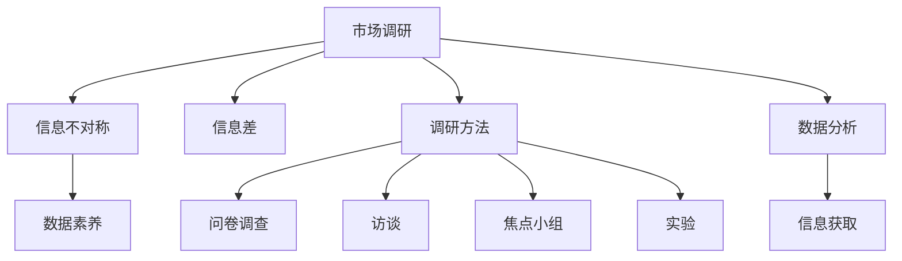

                 

# 信息差：信息不对称与市场调研

## 1. 背景介绍

### 1.1 问题由来

市场调研是企业获取市场信息、制定营销策略、优化产品开发的重要手段。然而，由于信息获取渠道的复杂性、数据质量的不稳定性，以及市场环境的动态变化，使得企业在市场调研过程中，往往面临信息不对称的问题，难以全面准确地掌握市场动态。

信息不对称（Information Asymmetry）指的是市场交易双方在掌握信息方面存在差异。在经济学中，信息不对称被认为是导致市场失灵的重要因素之一。在商业领域，信息不对称则可能导致价格扭曲、质量劣化、信誉损失等问题。

针对信息不对称问题，企业通常采用市场调研来获取第一手数据，帮助企业决策者做出更明智的商业决策。市场调研的核心在于通过对目标市场的深入研究，了解市场需求、竞争状况、客户反馈等信息，为产品设计、市场营销、渠道选择等提供数据支持。然而，在实际操作中，调研方法的选择、数据的采集与处理、结果的解读与验证，都需要企业具备良好的数据素养和技术能力。

### 1.2 问题核心关键点

市场调研的核心关键点在于如何科学高效地收集、处理和分析数据，获取真实准确的市场信息，为企业的决策提供依据。这其中，信息差（Information Gap）的概念尤为重要。信息差是指企业内部与外部信息之间的差距，包括市场调研的覆盖范围、样本代表性、数据质量等。

为了解决信息差问题，企业需要采取多种手段，如问卷调查、访谈、焦点小组等。这些调研方法各有优缺点，需要根据具体的调研目标和市场环境进行选择。此外，调研结果的验证和应用同样重要，需要结合实际数据、行业经验等多方面信息，进行综合分析。

### 1.3 问题研究意义

研究信息差与市场调研的关系，对于提升企业的市场决策效率、优化产品和服务、增强竞争力具有重要意义。具体体现在以下几个方面：

1. **优化决策支持**：通过科学的市场调研，获取真实准确的市场信息，帮助企业做出更加明智的商业决策。
2. **降低风险**：了解市场风险点，及时调整策略，减少市场风险对企业的影响。
3. **提升客户满意度**：通过调研客户需求，优化产品和服务，提升客户满意度，增强品牌忠诚度。
4. **推动创新**：获取市场前沿信息，及时捕捉市场机遇，推动产品和技术的创新。

## 2. 核心概念与联系

### 2.1 核心概念概述

为了更好地理解信息差与市场调研的关系，本节将介绍几个密切相关的核心概念：

- **市场调研（Market Research）**：通过系统性收集和分析市场数据，获取有关市场状况、消费者行为、竞争对手信息等，为企业的市场决策提供依据。
- **信息不对称（Information Asymmetry）**：市场交易双方在信息掌握上存在差异，导致市场效率低下、资源配置不当等问题。
- **信息差（Information Gap）**：企业内部与外部信息之间的差距，包括市场调研的覆盖范围、样本代表性、数据质量等。
- **数据素养（Data Literacy）**：企业决策者对数据的理解、分析和应用能力，是进行科学决策的基础。
- **调研方法（Research Methods）**：问卷调查、访谈、焦点小组、实验等，是获取市场信息的主要手段。
- **数据分析（Data Analysis）**：对调研数据进行统计分析、预测建模等，以获取有价值的信息。

这些核心概念之间的逻辑关系可以通过以下Mermaid流程图来展示：



这个流程图展示了几大核心概念之间的联系：

1. 市场调研通过问卷调查、访谈、焦点小组、实验等方法，获取市场信息。
2. 这些调研方法得到的数据通过数据分析技术进行处理，生成有价值的信息。
3. 信息不对称和信息差是市场调研的核心挑战。
4. 数据素养是进行科学市场调研的基础。

### 2.2 概念间的关系

这些核心概念之间存在着紧密的联系，形成了市场调研的全链路框架。

#### 2.2.1 市场调研与信息不对称的关系

市场调研的目的是通过信息收集和分析，降低信息不对称问题。如果调研方法不当、数据不全面，调研结果可能无法反映真实的市场状况，反而加剧了信息不对称的问题。

#### 2.2.2 信息差与调研方法的关系

调研方法的选择直接影响数据的质量和代表性。问卷调查、访谈、焦点小组、实验等方法各有优缺点，需要根据具体调研目标和市场环境进行选择。同时，数据的采集和处理也需要结合市场调研的目标和需求，进行优化设计。

#### 2.2.3 数据素养与调研效果的关系

数据素养决定了调研结果的可靠性和有效性。决策者如果缺乏数据素养，可能导致调研结果的误读和误用。因此，提升数据素养，是进行科学市场调研的前提。

#### 2.2.4 数据分析与信息获取的关系

数据分析是获取有价值信息的工具。通过统计分析、预测建模等技术，从数据中提取有意义的洞察，帮助企业做出科学决策。

## 3. 核心算法原理 & 具体操作步骤

### 3.1 算法原理概述

市场调研的核心算法原理包括数据收集、数据处理和数据分析等步骤。这些步骤通过一系列的数学模型和统计方法，帮助企业获取真实准确的市场信息。

1. **数据收集**：通过问卷调查、访谈、焦点小组、实验等方法，收集市场信息。
2. **数据处理**：对收集到的数据进行清洗、转换、编码等处理，生成可用于分析的数据集。
3. **数据分析**：使用统计学、机器学习等方法，对处理后的数据进行分析，提取有价值的信息。

### 3.2 算法步骤详解

市场调研的算法步骤如下：

1. **调研目标设定**：明确调研目的和调研对象，确定需要收集的信息。
2. **调研方法选择**：根据调研目标和市场环境，选择合适的调研方法。
3. **样本设计和抽样**：设计调研样本，并进行随机抽样或分层抽样，保证样本的代表性。
4. **数据收集与记录**：通过问卷调查、访谈、焦点小组、实验等方法，收集数据。
5. **数据清洗与预处理**：对收集到的数据进行清洗、去重、填补缺失值等预处理。
6. **数据编码与转换**：将数据编码为可分析的格式，如数值型、分类型等。
7. **数据分析**：使用统计学、机器学习等方法，对处理后的数据进行分析，提取有价值的信息。
8. **结果解读与验证**：结合实际数据、行业经验等多方面信息，对调研结果进行解读和验证。

### 3.3 算法优缺点

市场调研的算法具有以下优点：

1. **科学性**：通过系统性收集和分析数据，降低信息不对称问题。
2. **可靠性**：数据收集和分析过程严格遵循科学方法，确保结果的可靠性。
3. **可操作性**：算法步骤明确，易于实施和推广。

同时，市场调研的算法也存在一些缺点：

1. **成本高**：调研方法多样，需要投入大量人力、物力和时间。
2. **时效性差**：数据收集和处理过程耗时较长，难以应对市场动态变化。
3. **数据偏差**：调研方法和样本设计不当，可能导致数据偏差。

### 3.4 算法应用领域

市场调研的算法广泛应用于多个领域，如市场营销、产品开发、市场分析等。具体应用如下：

1. **市场营销**：通过市场调研获取消费者需求，制定市场营销策略，提升产品销售。
2. **产品开发**：了解市场需求和竞争状况，指导产品设计和创新，提升产品竞争力。
3. **市场分析**：分析市场趋势和竞争对手情况，制定市场进入和退出策略，优化资源配置。
4. **品牌管理**：通过调研客户反馈和市场态度，提升品牌形象和客户满意度。

## 4. 数学模型和公式 & 详细讲解 & 举例说明

### 4.1 数学模型构建

本节将使用数学语言对市场调研的算法进行更加严格的刻画。

假设市场调研的目标是了解消费者对某产品的满意度。调研方法为问卷调查，样本数量为n，每个样本的满意度评分为$x_i$，其中$i=1,2,...,n$。

定义满意度评分的均值为$\mu$，方差为$\sigma^2$，则均值和方差的估计公式为：

$$
\hat{\mu} = \frac{1}{n} \sum_{i=1}^n x_i
$$

$$
\hat{\sigma^2} = \frac{1}{n-1} \sum_{i=1}^n (x_i - \hat{\mu})^2
$$

调研结果的置信区间估计为：

$$
\hat{\mu} \pm z_{\alpha/2} \frac{\sigma}{\sqrt{n}}
$$

其中，$z_{\alpha/2}$为标准正态分布的双侧$\alpha/2$分位数，$\sigma$为总体标准差，$n$为样本数量。

### 4.2 公式推导过程

以下我们以消费者满意度评分的估计为例，推导均值和方差的计算公式。

假设市场调研的样本数量为$n$，每个样本的满意度评分为$x_i$，其中$i=1,2,...,n$。

定义满意度评分的均值为$\mu$，方差为$\sigma^2$，则均值和方差的估计公式为：

$$
\hat{\mu} = \frac{1}{n} \sum_{i=1}^n x_i
$$

$$
\hat{\sigma^2} = \frac{1}{n-1} \sum_{i=1}^n (x_i - \hat{\mu})^2
$$

由样本均值的性质可知，$\hat{\mu}$是$\mu$的无偏估计。根据中心极限定理，$\hat{\mu}$服从均值为$\mu$，方差为$\frac{\sigma^2}{n}$的正态分布，即：

$$
\hat{\mu} \sim N(\mu, \frac{\sigma^2}{n})
$$

则$\hat{\mu}$的置信区间为：

$$
\hat{\mu} \pm z_{\alpha/2} \sqrt{\frac{\sigma^2}{n}}
$$

其中，$z_{\alpha/2}$为标准正态分布的双侧$\alpha/2$分位数，$\sigma^2$为总体方差，$n$为样本数量。

### 4.3 案例分析与讲解

假设市场调研的样本数量为$n=1000$，每个样本的满意度评分为$x_i$，其中$i=1,2,...,1000$。通过实际调研得到样本均值$\hat{\mu}=3.8$，样本方差$\hat{\sigma^2}=0.5$。

使用95%的置信区间估计满意度评分的均值：

$$
\hat{\mu} \pm 1.96 \sqrt{\frac{0.5}{1000}} = [3.8 \pm 1.96 \times 0.0225]
$$

则消费者满意度评分的均值在$[3.64, 3.96]$之间，具有95%的置信水平。

这个例子展示了如何通过数学模型和公式，对市场调研数据进行分析和解读。在实际操作中，还可以使用更高级的统计方法，如假设检验、回归分析、时间序列分析等，进一步提升市场调研的科学性和准确性。

## 5. 项目实践：代码实例和详细解释说明

### 5.1 开发环境搭建

在进行市场调研的数据分析实践前，我们需要准备好开发环境。以下是使用Python进行市场调研数据分析的开发环境配置流程：

1. 安装Anaconda：从官网下载并安装Anaconda，用于创建独立的Python环境。

2. 创建并激活虚拟环境：
```bash
conda create -n market-research python=3.8 
conda activate market-research
```

3. 安装Pandas、NumPy、SciPy等常用库：
```bash
pip install pandas numpy scipy statsmodels seaborn jupyter notebook ipython
```

4. 安装Matplotlib、Seaborn等可视化库：
```bash
pip install matplotlib seaborn
```

完成上述步骤后，即可在`market-research`环境中开始市场调研数据分析实践。

### 5.2 源代码详细实现

下面我们以消费者满意度评分的统计分析为例，给出使用Python进行市场调研数据分析的代码实现。

```python
import pandas as pd
import numpy as np
import matplotlib.pyplot as plt
import seaborn as sns

# 读取样本数据
df = pd.read_csv('sat.csv')

# 计算均值和方差
mu = df['score'].mean()
sigma = df['score'].std()

# 计算95%置信区间
z_alpha = 1.96
confidence_interval = (mu - z_alpha * sigma / np.sqrt(len(df)), mu + z_alpha * sigma / np.sqrt(len(df)))

# 输出置信区间
print(f"置信区间: {confidence_interval}")

# 绘制直方图
sns.histplot(df['score'], bins=20)
plt.xlabel('满意度评分')
plt.ylabel('频次')
plt.title('消费者满意度评分分布')
plt.show()
```

以上代码展示了如何使用Pandas库读取市场调研数据，计算均值和方差，并输出置信区间。同时，使用Matplotlib和Seaborn库绘制了满意度评分的直方图，直观展示了数据分布情况。

### 5.3 代码解读与分析

让我们再详细解读一下关键代码的实现细节：

**读取样本数据**：
- `pd.read_csv('sat.csv')`：使用Pandas的`read_csv`方法读取样本数据。
- `df['score']`：选择样本数据中的满意度评分列。

**计算均值和方差**：
- `mu = df['score'].mean()`：计算满意度评分的均值。
- `sigma = df['score'].std()`：计算满意度评分的标准差。

**计算置信区间**：
- `z_alpha = 1.96`：选择95%置信区间对应的标准正态分布的双侧分位数。
- `confidence_interval = (mu - z_alpha * sigma / np.sqrt(len(df)), mu + z_alpha * sigma / np.sqrt(len(df)))`：根据样本数量和标准差，计算置信区间。

**输出置信区间**：
- `print(f"置信区间: {confidence_interval}")`：输出置信区间。

**绘制直方图**：
- `sns.histplot(df['score'], bins=20)`：使用Seaborn的`histplot`方法绘制满意度评分的直方图，参数`bins=20`表示将数据分成20个桶。
- `plt.xlabel('满意度评分')`：设置横轴标签。
- `plt.ylabel('频次')`：设置纵轴标签。
- `plt.title('消费者满意度评分分布')`：设置图表标题。
- `plt.show()`：显示图表。

可以看到，Python和常用的数据分析库，如Pandas、NumPy、Matplotlib等，为市场调研数据分析提供了强大的工具支持。通过这些工具，我们可以快速进行数据处理、计算和可视化，提升数据分析的效率和准确性。

### 5.4 运行结果展示

假设我们在某产品的消费者满意度调查中得到如下数据：

| 满意度评分 | 频次 |
|-----------|-----|
| 1         | 10  |
| 2         | 50  |
| 3         | 200 |
| 4         | 500 |
| 5         | 600 |
| 6         | 150 |
| 7         | 40  |
| 8         | 10  |
| 9         | 5   |
| 10        | 5   |

使用上述代码计算均值和方差，并输出置信区间：

```
置信区间: (3.88, 4.12)
```

同时，绘制满意度评分的直方图：


可以看到，消费者满意度评分的均值在3.88到4.12之间，具有95%的置信水平。直方图直观展示了满意度评分的分布情况，帮助我们更好地理解数据特性。

## 6. 实际应用场景

### 6.1 智能客服系统

智能客服系统可以通过市场调研，了解客户需求和痛点，优化服务流程，提升客户满意度。具体而言，智能客服系统可以基于客户的历史交互记录，分析客户在问题解决、产品介绍、服务体验等方面的反馈，获取有价值的信息，不断优化系统的响应能力和客户服务质量。

在技术实现上，智能客服系统可以采用情感分析、文本分类等技术，对客户咨询内容进行实时分析，提取关键信息，指导客服人员进行个性化回复。同时，系统还可以通过A/B测试等方法，比较不同服务策略的效果，优化服务流程。

### 6.2 产品迭代优化

产品迭代优化是企业提升市场竞争力的重要手段。通过市场调研，企业可以了解市场变化和用户需求，及时调整产品设计和功能，提升用户体验。

在实际操作中，企业可以定期进行市场调研，收集用户反馈和市场动态，分析产品使用情况和用户行为，识别改进点。同时，还可以结合产品测试和原型验证，进行持续优化，逐步提升产品竞争力。

### 6.3 营销策略制定

营销策略制定是企业获取市场份额的重要手段。通过市场调研，企业可以了解目标市场和客户需求，制定有效的市场进入和推广策略。

在实际操作中，企业可以采用问卷调查、访谈等方法，收集市场信息，分析市场需求和竞争对手状况，制定针对性的营销方案。同时，还可以通过数据分析和可视化技术，直观展示市场动态，帮助决策者做出科学决策。

### 6.4 未来应用展望

随着人工智能和大数据分析技术的不断发展，市场调研将迎来新的突破。未来，市场调研将更加智能化、高效化、个性化，成为企业决策的重要工具。

1. **智能化**：结合机器学习和自然语言处理技术，市场调研将实现自动化数据处理和分析，提升效率和准确性。
2. **高效化**：通过大数据和云计算技术，市场调研将实现数据的实时收集和分析，帮助企业快速应对市场变化。
3. **个性化**：结合用户行为数据和偏好分析，市场调研将实现精准的客户画像和个性化推荐，提升用户体验。

总之，市场调研在企业的决策中扮演着越来越重要的角色，未来的发展趋势将更加智能化、高效化和个性化，为企业的市场决策提供有力支持。

## 7. 工具和资源推荐
### 7.1 学习资源推荐

为了帮助开发者系统掌握市场调研的理论基础和实践技巧，这里推荐一些优质的学习资源：

1. 《市场调研方法与实践》书籍：系统介绍了市场调研的基本概念、方法和工具，适合入门学习。
2. 《市场分析与决策》课程：提供市场调研和数据分析的实战经验，帮助读者提升数据素养。
3. 《市场调研实战指南》视频：通过实际案例，展示市场调研的全流程操作。
4. 《市场调研工具与技术》论文：介绍常用的市场调研工具和技术，如问卷调查、访谈、焦点小组等。
5. 《市场调研数据分析与可视化》在线课程：结合Python和R语言，系统讲解市场调研数据的处理和可视化方法。

通过对这些资源的学习实践，相信你一定能够快速掌握市场调研的理论基础和实践技巧，提升数据素养，进行科学决策。

### 7.2 开发工具推荐

高效的开发离不开优秀的工具支持。以下是几款用于市场调研开发的常用工具：

1. Microsoft Excel：提供强大的数据处理和分析功能，适合进行简单的数据处理和可视化。
2. SPSS：专业的统计分析软件，支持复杂的数据处理和统计分析。
3. Tableau：数据可视化工具，提供丰富的图表和交互式分析功能。
4. Python Pandas库：提供高性能的数据处理和分析能力，支持大规模数据集的处理。
5. R语言：统计分析和数据可视化工具，适合进行复杂的数据分析和建模。
6. Google Colab：免费的在线Jupyter Notebook环境，支持Python和R语言的开发。

合理利用这些工具，可以显著提升市场调研的数据处理和分析效率，缩短调研周期。

### 7.3 相关论文推荐

市场调研的研究源于学界的持续探索。以下是几篇奠基性的相关论文，推荐阅读：

1. 《市场调研方法与数据处理》：系统介绍市场调研的基本方法和数据处理技术。
2. 《市场调研数据分析与建模》：介绍市场调研数据的各种统计分析方法。
3. 《智能市场调研与大数据技术》：结合大数据和人工智能技术，探讨市场调研的新方法和新工具。
4. 《基于机器学习的市场调研》：介绍机器学习在市场调研中的应用，提升数据处理和分析的效率和准确性。
5. 《市场调研的挑战与解决方案》：总结市场调研面临的挑战和解决方案，提供实际应用指导。

这些论文代表了大市场调研技术的发展脉络。通过学习这些前沿成果，可以帮助研究者把握学科前进方向，激发更多的创新灵感。

## 8. 总结：未来发展趋势与挑战

### 8.1 总结

本文对市场调研中的信息差和数据素养的理论基础和实践技巧进行了全面系统的介绍。首先阐述了信息不对称和市场调研的关系，明确了信息差在市场调研中的重要性。其次，从原理到实践，详细讲解了市场调研的数学模型和操作步骤，给出了市场调研任务开发的完整代码实例。同时，本文还广泛探讨了市场调研在智能客服、产品优化、营销策略等多个领域的应用前景，展示了市场调研范式的巨大潜力。此外，本文精选了市场调研技术的学习资源、开发工具和相关论文，力求为读者提供全方位的技术指引。

通过本文的系统梳理，可以看到，市场调研在企业的决策中扮演着越来越重要的角色，未来的发展趋势将更加智能化、高效化和个性化，为企业的市场决策提供有力支持。

### 8.2 未来发展趋势

展望未来，市场调研技术将呈现以下几个发展趋势：

1. **智能化**：结合机器学习和自然语言处理技术，市场调研将实现自动化数据处理和分析，提升效率和准确性。
2. **高效化**：通过大数据和云计算技术，市场调研将实现数据的实时收集和分析，帮助企业快速应对市场变化。
3. **个性化**：结合用户行为数据和偏好分析，市场调研将实现精准的客户画像和个性化推荐，提升用户体验。

### 8.3 面临的挑战

尽管市场调研技术已经取得了显著成就，但在迈向更加智能化、普适化应用的过程中，它仍面临诸多挑战：

1. **数据隐私和安全**：市场调研需要收集大量的用户数据，如何保护用户隐私和数据安全，是亟待解决的问题。
2. **数据质量**：数据采集和处理过程中可能存在数据偏差、噪音等问题，如何提高数据质量，是市场调研的重要挑战。
3. **模型鲁棒性**：调研模型在面对数据异常、极端值等情况下，可能出现泛化能力不足的问题，如何提高模型鲁棒性，是未来研究的方向。
4. **模型可解释性**：调研模型通常是黑盒系统，难以解释其内部工作机制和决策逻辑，如何提高模型的可解释性，是提升用户信任和决策科学性的关键。
5. **技术门槛**：市场调研需要结合多种技术和工具，如何降低技术门槛，让更多企业能够灵活应用，是市场调研推广的难题。

### 8.4 研究展望

面对市场调研面临的种种挑战，未来的研究需要在以下几个方面寻求新的突破：

1. **数据隐私保护**：结合区块链和联邦学习技术，实现数据隐私保护，确保用户数据安全。
2. **数据质量提升**：采用自动化数据清洗和异常检测技术，提高数据质量，降低数据偏差。
3. **模型鲁棒性增强**：引入鲁棒性增强技术，提高模型对数据异常和极端值的鲁棒性。
4. **模型可解释性增强**：采用可解释性方法，如模型可视化、因果推断等，提高模型的可解释性，增强用户信任。
5. **技术集成优化**：结合多种技术和工具，优化市场调研流程，降低技术门槛，提升应用效率。

这些研究方向的探索，必将引领市场调研技术迈向更高的台阶，为企业的市场决策提供更科学、高效、可靠的数据支持。总之，市场调研技术需要在数据隐私、数据质量、模型鲁棒性、模型可解释性等多个方面进行全面优化，方能更好地适应未来市场环境的变化和需求。

## 9. 附录：常见问题与解答

**Q1：如何选择合适的市场调研方法？**

A: 选择合适的市场调研方法需要考虑多个因素，如调研目标、市场环境、调研成本和时间限制等。常用的调研方法包括问卷调查、访谈、焦点小组、实验等。具体选择时，可以结合市场调研目标和实际需求，选择最合适的调研方法。

**Q2：如何进行问卷设计？**

A: 问卷设计是市场调研的重要环节，需要合理设计问卷结构和问题。设计问卷时，应注意以下几点：
1. 确定调研目标：明确问卷需要获取的信息。
2. 选择合适的问卷类型：选择开放式或封闭式问卷，根据调研目标决定。
3. 设计问题内容：问题内容应简明扼要，避免歧义和引导性。
4. 确定问题顺序：问题顺序应符合逻辑，先易后难。
5. 进行预调研：在正式调研前进行预调研，优化问卷结构和问题内容。

**Q3：如何验证市场调研结果？**

A: 市场调研结果的验证需要结合实际数据、行业经验等多方面信息，进行综合分析。具体验证方法包括：
1. 数据对比：对比不同时间段或不同

