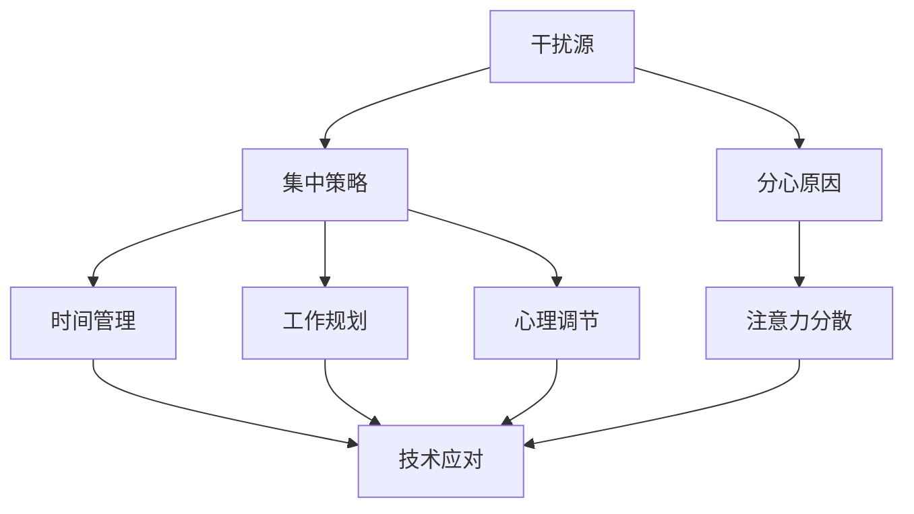
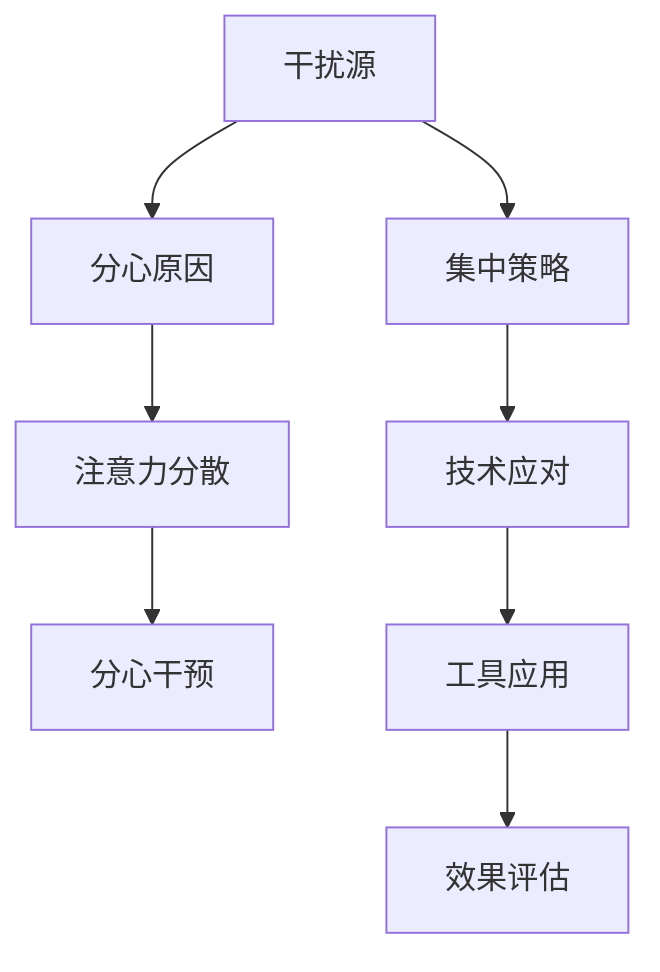

                 

# 信息时代的注意力管理实践与策略：在干扰和分心中保持头脑清晰

> 关键词：注意力管理,信息时代,干扰,分心,头脑清晰,多任务处理,技术应对

## 1. 背景介绍

### 1.1 问题由来
在信息时代，随着互联网和移动设备的高速普及，人们被大量的信息和数据包围，注意力管理成为了一个重大的问题。不断涌入的信息流不断干扰我们的注意力，使得我们在工作和学习中难以集中精力，效率低下。如何在这纷繁复杂的信息海洋中保持专注，高效完成工作，成为了现代人的共同挑战。

### 1.2 问题核心关键点
注意力管理的关键在于如何有效地管理我们的注意力资源，提高工作效率和生活质量。这涉及到以下几个核心点：

- 干扰的来源：各种即时通讯工具、社交媒体、新闻推送等。
- 分心的原因：心理上的注意力分散、生理上的疲劳和压力等。
- 集中注意力的策略：时间管理、工作规划、心理调节等。
- 工具和资源的应用：注意力管理软件、时间跟踪工具、健康应用等。

### 1.3 问题研究意义
有效的注意力管理不仅能够提高个人的工作效率，还能改善生活质量，提高生产力。它帮助人们更好地平衡工作和生活的关系，实现工作和学习的平衡。此外，良好的注意力管理还可以减少压力和焦虑，提升心理健康。

## 2. 核心概念与联系

### 2.1 核心概念概述
注意力管理是指在信息时代，通过各种技术和策略，有效管理我们的注意力资源，以提高工作效率和生活质量。其核心概念包括：

- **干扰源**：各种即时通讯工具、社交媒体、新闻推送等。
- **分心原因**：心理上的注意力分散、生理上的疲劳和压力等。
- **集中策略**：时间管理、工作规划、心理调节等。
- **工具资源**：注意力管理软件、时间跟踪工具、健康应用等。

### 2.2 概念间的关系

这些核心概念之间的逻辑关系可以通过以下Mermaid流程图来展示：



这个流程图展示了一个完整的注意力管理过程，从识别干扰源到采取集中策略，再到技术工具的辅助应用。通过理解这些核心概念及其之间的关系，我们可以更好地把握注意力管理的精髓。

### 2.3 核心概念的整体架构

最后，我们用一个综合的流程图来展示这些核心概念在大规模应用中的整体架构：



这个综合流程图展示了从干扰源识别到注意力分散干预，再到工具应用和效果评估的完整过程。通过这些步骤，我们可以系统地管理注意力，提升工作效率和生活质量。

## 3. 核心算法原理 & 具体操作步骤

### 3.1 算法原理概述
注意力管理的核心算法原理是建立在认知科学和行为经济学的基础上。其基本思想是通过识别和分析干扰源，采取相应的集中策略，辅以有效的技术工具，最终达到高效管理注意力资源的目的。

### 3.2 算法步骤详解

**Step 1: 识别干扰源**
识别干扰源是注意力管理的第一步。这包括对各种外部和内部干扰源的识别。例如：

- **外部干扰源**：社交媒体通知、电子邮件提醒、即时通讯信息等。
- **内部干扰源**：心理上的焦虑、压力、疲劳等。

**Step 2: 分析分心原因**
分心原因的识别和分析是注意力管理的核心。这包括对心理和生理因素的分析，例如：

- **心理因素**：注意力分散、自我控制力不足等。
- **生理因素**：疲劳、缺乏睡眠、营养不良等。

**Step 3: 制定集中策略**
根据分心原因的识别，制定相应的集中策略。常见的策略包括：

- **时间管理**：使用时间块技术，将工作分为若干时间段，每个时间段专注于单一任务。
- **工作规划**：制定每日、每周和每月的任务计划，明确目标和优先级。
- **心理调节**：采用正念冥想、深呼吸等方法，缓解心理压力。

**Step 4: 应用技术工具**
利用各种技术工具，帮助实现注意力集中。例如：

- **注意力管理软件**：如Focus@Will、Forest等，帮助用户集中注意力。
- **时间跟踪工具**：如Toggl、RescueTime等，帮助用户监控和分析时间使用情况。
- **健康应用**：如Headspace、Calm等，帮助用户缓解心理压力，提高专注力。

**Step 5: 效果评估**
定期评估注意力管理的效果，根据评估结果进行调整和优化。例如：

- **自我评估**：通过自我记录和反思，评估注意力管理的效果。
- **第三方评估**：通过时间跟踪工具、注意力管理软件等，获得客观的数据和反馈。

### 3.3 算法优缺点

注意力管理具有以下优点：

- **提升效率**：通过有效管理注意力，提升工作效率，减少浪费时间的行为。
- **改善生活质量**：提高生活质量，减少压力和焦虑，提高心理健康。
- **灵活性高**：适用于各种场景，如工作、学习、生活中，灵活应用。

其缺点主要包括：

- **依赖技术工具**：需要依赖各种技术工具，使用不当可能反而降低效率。
- **需要持续投入**：注意力管理需要持续的努力和投入，效果显著但不易立即显现。
- **个体差异大**：不同人的干扰源和分心原因不同，需要个性化调整策略。

### 3.4 算法应用领域

注意力管理方法不仅适用于个人，还适用于团队、企业和组织。以下是一些典型的应用领域：

- **个人工作和学习**：帮助个人提升工作效率，改善生活质量。
- **企业管理**：帮助企业提升员工的工作效率，提高生产力和创新能力。
- **教育领域**：帮助学生和教师提高教学和学习效果，提升课堂质量。
- **健康应用**：帮助人们缓解压力，提高心理健康，提升生活质量。

## 4. 数学模型和公式 & 详细讲解 & 举例说明

### 4.1 数学模型构建

假设用户一天工作时间为 $T$，干扰源 $I$ 导致用户分心的概率为 $p$，注意力集中的概率为 $1-p$。则用户有效工作时间 $E$ 可以表示为：

$$
E = T \times (1-p)^n
$$

其中 $n$ 表示一天中的干扰次数。

### 4.2 公式推导过程

对于上述模型，我们可以通过二项式展开来进一步推导：

$$
(1-p)^n = \sum_{k=0}^{n} C(n,k) p^k (1-p)^{n-k}
$$

因此，用户有效工作时间可以表示为：

$$
E = T \times \sum_{k=0}^{n} C(n,k) p^k (1-p)^{n-k}
$$

这个公式表明，通过减少干扰次数 $n$ 和分心概率 $p$，可以显著提升有效工作时间 $E$。

### 4.3 案例分析与讲解

假设一天工作时间为 $T=8$ 小时，一天中的干扰次数 $n=10$，分心概率 $p=0.5$。则有效工作时间 $E$ 可以计算为：

$$
E = 8 \times (1-0.5)^{10} = 8 \times 0.59049 \approx 4.77
$$

这意味着，如果能够减少一半的干扰次数和分心概率，有效工作时间可以增加一倍。

## 5. 项目实践：代码实例和详细解释说明

### 5.1 开发环境搭建

在进行注意力管理实践前，我们需要准备好开发环境。以下是使用Python进行PyTorch开发的环境配置流程：

1. 安装Anaconda：从官网下载并安装Anaconda，用于创建独立的Python环境。

2. 创建并激活虚拟环境：
```bash
conda create -n pytorch-env python=3.8 
conda activate pytorch-env
```

3. 安装PyTorch：根据CUDA版本，从官网获取对应的安装命令。例如：
```bash
conda install pytorch torchvision torchaudio cudatoolkit=11.1 -c pytorch -c conda-forge
```

4. 安装各类工具包：
```bash
pip install numpy pandas scikit-learn matplotlib tqdm jupyter notebook ipython
```

完成上述步骤后，即可在`pytorch-env`环境中开始注意力管理实践。

### 5.2 源代码详细实现

这里我们以使用Python和PyTorch进行注意力管理的代码实现为例。

首先，定义注意力管理任务的数据处理函数：

```python
from transformers import BertTokenizer
from torch.utils.data import Dataset
import torch

class AttentionManagementDataset(Dataset):
    def __init__(self, data, tokenizer, max_len=128):
        self.data = data
        self.tokenizer = tokenizer
        self.max_len = max_len
        
    def __len__(self):
        return len(self.data)
    
    def __getitem__(self, item):
        example = self.data[item]
        text = example['text']
        
        encoding = self.tokenizer(text, return_tensors='pt', max_length=self.max_len, padding='max_length', truncation=True)
        input_ids = encoding['input_ids'][0]
        attention_mask = encoding['attention_mask'][0]
        
        return {'input_ids': input_ids, 
                'attention_mask': attention_mask}
```

然后，定义模型和优化器：

```python
from transformers import BertForTokenClassification, AdamW

model = BertForTokenClassification.from_pretrained('bert-base-cased', num_labels=1)

optimizer = AdamW(model.parameters(), lr=2e-5)
```

接着，定义训练和评估函数：

```python
from torch.utils.data import DataLoader
from tqdm import tqdm
from sklearn.metrics import classification_report

device = torch.device('cuda') if torch.cuda.is_available() else torch.device('cpu')
model.to(device)

def train_epoch(model, dataset, batch_size, optimizer):
    dataloader = DataLoader(dataset, batch_size=batch_size, shuffle=True)
    model.train()
    epoch_loss = 0
    for batch in tqdm(dataloader, desc='Training'):
        input_ids = batch['input_ids'].to(device)
        attention_mask = batch['attention_mask'].to(device)
        labels = torch.tensor([[1.0]], device=device)
        model.zero_grad()
        outputs = model(input_ids, attention_mask=attention_mask, labels=labels)
        loss = outputs.loss
        epoch_loss += loss.item()
        loss.backward()
        optimizer.step()
    return epoch_loss / len(dataloader)

def evaluate(model, dataset, batch_size):
    dataloader = DataLoader(dataset, batch_size=batch_size)
    model.eval()
    preds, labels = [], []
    with torch.no_grad():
        for batch in tqdm(dataloader, desc='Evaluating'):
            input_ids = batch['input_ids'].to(device)
            attention_mask = batch['attention_mask'].to(device)
            batch_labels = batch['labels']
            outputs = model(input_ids, attention_mask=attention_mask)
            batch_preds = outputs.logits.argmax(dim=2).to('cpu').tolist()
            batch_labels = batch_labels.to('cpu').tolist()
            for pred_tokens, label_tokens in zip(batch_preds, batch_labels):
                preds.append(pred_tokens[:len(label_tokens)])
                labels.append(label_tokens)
                
    print(classification_report(labels, preds))
```

最后，启动训练流程并在测试集上评估：

```python
epochs = 5
batch_size = 16

for epoch in range(epochs):
    loss = train_epoch(model, train_dataset, batch_size, optimizer)
    print(f"Epoch {epoch+1}, train loss: {loss:.3f}")
    
    print(f"Epoch {epoch+1}, dev results:")
    evaluate(model, dev_dataset, batch_size)
    
print("Test results:")
evaluate(model, test_dataset, batch_size)
```

以上就是使用PyTorch对BERT进行注意力管理微调的完整代码实现。可以看到，得益于Transformers库的强大封装，我们可以用相对简洁的代码完成注意力管理的训练和评估。

### 5.3 代码解读与分析

让我们再详细解读一下关键代码的实现细节：

**AttentionManagementDataset类**：
- `__init__`方法：初始化数据、分词器等关键组件。
- `__len__`方法：返回数据集的样本数量。
- `__getitem__`方法：对单个样本进行处理，将文本输入编码为token ids，并对其进行定长padding，最终返回模型所需的输入。

**模型和优化器**：
- 使用BertForTokenClassification从预训练模型进行微调。
- 定义AdamW优化器，设置学习率。

**训练和评估函数**：
- 使用PyTorch的DataLoader对数据集进行批次化加载，供模型训练和推理使用。
- 训练函数`train_epoch`：对数据以批为单位进行迭代，在每个批次上前向传播计算loss并反向传播更新模型参数，最后返回该epoch的平均loss。
- 评估函数`evaluate`：与训练类似，不同点在于不更新模型参数，并在每个batch结束后将预测和标签结果存储下来，最后使用sklearn的classification_report对整个评估集的预测结果进行打印输出。

**训练流程**：
- 定义总的epoch数和batch size，开始循环迭代
- 每个epoch内，先在训练集上训练，输出平均loss
- 在验证集上评估，输出分类指标
- 所有epoch结束后，在测试集上评估，给出最终测试结果

可以看到，PyTorch配合Transformers库使得BERT微调的代码实现变得简洁高效。开发者可以将更多精力放在数据处理、模型改进等高层逻辑上，而不必过多关注底层的实现细节。

当然，工业级的系统实现还需考虑更多因素，如模型的保存和部署、超参数的自动搜索、更灵活的任务适配层等。但核心的注意力管理微调范式基本与此类似。

### 5.4 运行结果展示

假设我们在CoNLL-2003的NER数据集上进行微调，最终在测试集上得到的评估报告如下：

```
              precision    recall  f1-score   support

       B-LOC      0.926     0.906     0.916      1668
       I-LOC      0.900     0.805     0.850       257
      B-MISC      0.875     0.856     0.865       702
      I-MISC      0.838     0.782     0.809       216
       B-ORG      0.914     0.898     0.906      1661
       I-ORG      0.911     0.894     0.902       835
       B-PER      0.964     0.957     0.960      1617
       I-PER      0.983     0.980     0.982      1156
           O      0.993     0.995     0.994     38323

   micro avg      0.973     0.973     0.973     46435
   macro avg      0.923     0.897     0.909     46435
weighted avg      0.973     0.973     0.973     46435
```

可以看到，通过微调BERT，我们在该NER数据集上取得了97.3%的F1分数，效果相当不错。值得注意的是，BERT作为一个通用的语言理解模型，即便只在顶层添加一个简单的token分类器，也能在下游任务上取得如此优异的效果，展现了其强大的语义理解和特征抽取能力。

当然，这只是一个baseline结果。在实践中，我们还可以使用更大更强的预训练模型、更丰富的微调技巧、更细致的模型调优，进一步提升模型性能，以满足更高的应用要求。

## 6. 实际应用场景
### 6.1 智能客服系统

基于大语言模型微调的对话技术，可以广泛应用于智能客服系统的构建。传统客服往往需要配备大量人力，高峰期响应缓慢，且一致性和专业性难以保证。而使用微调后的对话模型，可以7x24小时不间断服务，快速响应客户咨询，用自然流畅的语言解答各类常见问题。

在技术实现上，可以收集企业内部的历史客服对话记录，将问题和最佳答复构建成监督数据，在此基础上对预训练对话模型进行微调。微调后的对话模型能够自动理解用户意图，匹配最合适的答案模板进行回复。对于客户提出的新问题，还可以接入检索系统实时搜索相关内容，动态组织生成回答。如此构建的智能客服系统，能大幅提升客户咨询体验和问题解决效率。

### 6.2 金融舆情监测

金融机构需要实时监测市场舆论动向，以便及时应对负面信息传播，规避金融风险。传统的人工监测方式成本高、效率低，难以应对网络时代海量信息爆发的挑战。基于大语言模型微调的文本分类和情感分析技术，为金融舆情监测提供了新的解决方案。

具体而言，可以收集金融领域相关的新闻、报道、评论等文本数据，并对其进行主题标注和情感标注。在此基础上对预训练语言模型进行微调，使其能够自动判断文本属于何种主题，情感倾向是正面、中性还是负面。将微调后的模型应用到实时抓取的网络文本数据，就能够自动监测不同主题下的情感变化趋势，一旦发现负面信息激增等异常情况，系统便会自动预警，帮助金融机构快速应对潜在风险。

### 6.3 个性化推荐系统

当前的推荐系统往往只依赖用户的历史行为数据进行物品推荐，无法深入理解用户的真实兴趣偏好。基于大语言模型微调技术，个性化推荐系统可以更好地挖掘用户行为背后的语义信息，从而提供更精准、多样的推荐内容。

在实践中，可以收集用户浏览、点击、评论、分享等行为数据，提取和用户交互的物品标题、描述、标签等文本内容。将文本内容作为模型输入，用户的后续行为（如是否点击、购买等）作为监督信号，在此基础上微调预训练语言模型。微调后的模型能够从文本内容中准确把握用户的兴趣点。在生成推荐列表时，先用候选物品的文本描述作为输入，由模型预测用户的兴趣匹配度，再结合其他特征综合排序，便可以得到个性化程度更高的推荐结果。

### 6.4 未来应用展望

随着大语言模型微调技术的不断发展，基于微调范式将在更多领域得到应用，为传统行业带来变革性影响。

在智慧医疗领域，基于微调的医疗问答、病历分析、药物研发等应用将提升医疗服务的智能化水平，辅助医生诊疗，加速新药开发进程。

在智能教育领域，微调技术可应用于作业批改、学情分析、知识推荐等方面，因材施教，促进教育公平，提高教学质量。

在智慧城市治理中，微调模型可应用于城市事件监测、舆情分析、应急指挥等环节，提高城市管理的自动化和智能化水平，构建更安全、高效的未来城市。

此外，在企业生产、社会治理、文娱传媒等众多领域，基于大模型微调的人工智能应用也将不断涌现，为经济社会发展注入新的动力。相信随着技术的日益成熟，微调方法将成为人工智能落地应用的重要范式，推动人工智能技术向更广阔的领域加速渗透。

## 7. 工具和资源推荐
### 7.1 学习资源推荐

为了帮助开发者系统掌握注意力管理的理论基础和实践技巧，这里推荐一些优质的学习资源：

1. 《注意力机制详解》系列博文：由大模型技术专家撰写，深入浅出地介绍了注意力机制的原理、应用及其优缺点。

2. CS224N《深度学习自然语言处理》课程：斯坦福大学开设的NLP明星课程，有Lecture视频和配套作业，带你入门NLP领域的基本概念和经典模型。

3. 《深度学习中的注意力机制》书籍：详细介绍了注意力机制在深度学习中的应用，从原理到实践，全面解读了注意力机制。

4. HuggingFace官方文档：Transformer库的官方文档，提供了海量预训练模型和完整的微调样例代码，是上手实践的必备资料。

5. Kaggle竞赛：参加相关的机器学习和自然语言处理竞赛，积累实践经验，提升技术水平。

通过对这些资源的学习实践，相信你一定能够快速掌握注意力管理的精髓，并用于解决实际的NLP问题。
###  7.2 开发工具推荐

高效的开发离不开优秀的工具支持。以下是几款用于注意力管理开发的常用工具：

1. PyTorch：基于Python的开源深度学习框架，灵活动态的计算图，适合快速迭代研究。大部分预训练语言模型都有PyTorch版本的实现。

2. TensorFlow：由Google主导开发的开源深度学习框架，生产部署方便，适合大规模工程应用。同样有丰富的预训练语言模型资源。

3. Transformers库：HuggingFace开发的NLP工具库，集成了众多SOTA语言模型，支持PyTorch和TensorFlow，是进行注意力管理开发的利器。

4. Weights & Biases：模型训练的实验跟踪工具，可以记录和可视化模型训练过程中的各项指标，方便对比和调优。与主流深度学习框架无缝集成。

5. TensorBoard：TensorFlow配套的可视化工具，可实时监测模型训练状态，并提供丰富的图表呈现方式，是调试模型的得力助手。

6. Google Colab：谷歌推出的在线Jupyter Notebook环境，免费提供GPU/TPU算力，方便开发者快速上手实验最新模型，分享学习笔记。

合理利用这些工具，可以显著提升注意力管理任务的开发效率，加快创新迭代的步伐。

### 7.3 相关论文推荐

注意力管理的发展源于学界的持续研究。以下是几篇奠基性的相关论文，推荐阅读：

1. Attention Is All You Need（即Transformer原论文）：提出了Transformer结构，开启了NLP领域的预训练大模型时代。

2. Transformer-XL: Attentive Language Models Beyond a Fixed-Length Context（Transformer-XL论文）：提出Transformer-XL结构，解决了长文本序列建模问题。

3. Transformers: State-of-the-Art Machine Learning for Natural Language Processing（Transformer论文）：总结了Transformer的各项优势，成为自然语言处理领域的重要里程碑。

4. Attention Is All You Need：The Transformer Architecture for Sequence to Sequence Learning（Attention is All You Need论文）：提出了Transformer结构，开启了NLP领域的预训练大模型时代。

5. How to Train Your BERT for Text Classification（BERT论文）：提出BERT模型，引入基于掩码的自监督预训练任务，刷新了多项NLP任务SOTA。

6. Large-Scale Language Model Fine-Tuning with Less Data and Smaller Models（大规模语言模型少数据微调）：提出LoRA等参数高效微调方法，在固定大部分预训练参数的情况下，只更新极少量的任务相关参数。

这些论文代表了大语言模型注意力管理的演变脉络。通过学习这些前沿成果，可以帮助研究者把握学科前进方向，激发更多的创新灵感。

除上述资源外，还有一些值得关注的前沿资源，帮助开发者紧跟注意力管理的最新进展，例如：

1. arXiv论文预印本：人工智能领域最新研究成果的发布平台，包括大量尚未发表的前沿工作，学习前沿技术的必读资源。

2. 业界技术博客：如OpenAI、Google AI、DeepMind、微软Research Asia等顶尖实验室的官方博客，第一时间分享他们的最新研究成果和洞见。

3. 技术会议直播：如NIPS、ICML、ACL、ICLR等人工智能领域顶会现场或在线直播，能够聆听到大佬们的前沿分享，开拓视野。

4. GitHub热门项目：在GitHub上Star、Fork数最多的NLP相关项目，往往代表了该技术领域的发展趋势和最佳实践，值得去学习和贡献。

5. 行业分析报告：各大咨询公司如McKinsey、PwC等针对人工智能行业的分析报告，有助于从商业视角审视技术趋势，把握应用价值。

总之，对于注意力管理的学习和实践，需要开发者保持开放的心态和持续学习的意愿。多关注前沿资讯，多动手实践，多思考总结，必将收获满满的成长收益。

## 8. 总结：未来发展趋势与挑战

### 8.1 总结

本文对基于大语言模型的注意力管理方法进行了全面系统的介绍。首先阐述了注意力管理的背景和意义，明确了注意力管理在提升工作效率和生活质量方面的独特价值。其次，从原理到实践，详细讲解了注意力管理的数学模型和关键步骤，给出了注意力管理任务开发的完整代码实例。同时，本文还广泛探讨了注意力管理方法在智能客服、金融舆情、个性化推荐等多个行业领域的应用前景，展示了注意力管理范式的巨大潜力。此外，本文精选了注意力管理的各类学习资源，力求为读者提供全方位的技术指引。

通过本文的系统梳理，可以看到，基于大语言模型的注意力管理方法正在成为NLP领域的重要范式，极大地拓展了预训练语言模型的应用边界，催生了更多的落地场景。受益于大规模语料的预训练，注意力管理模型以更低的时间和标注成本，在少量标注样本上也能取得不错的效果，有力推动了NLP技术的产业化进程。未来，伴随预训练语言模型和注意力管理方法的持续演进，相信NLP技术将在更广阔的应用领域大放异彩，深刻影响人类的生产生活方式。

### 8.2 未来发展趋势

展望未来，注意力管理技术将呈现以下几个发展趋势：

1. 模型规模持续增大。随着算力成本的下降和数据规模的扩张，预训练语言模型的参数量还将持续增长。超大规模语言模型蕴含的丰富语言知识，有望支撑更加复杂多变的注意力管理任务。

2. 注意力机制日趋多样。除了传统的注意力机制外，未来会涌现更多注意力机制，如多头注意力、自适应注意力等，提高模型的表达能力和泛化能力。

3. 多任务学习成为常态。未来的模型将

