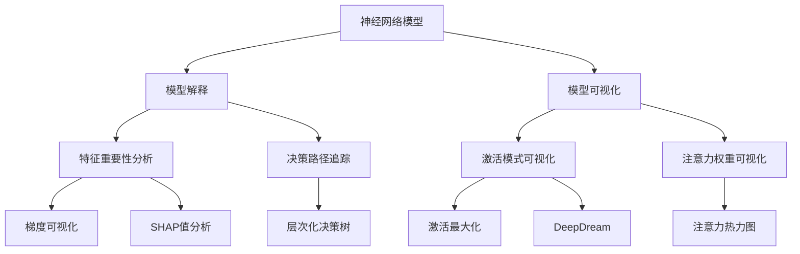

# Python深度学习实践：解读神经网络的解释与可视化

## 1. 背景介绍

### 1.1 问题的由来

在过去十年中，深度学习已经成为人工智能领域最具革命性的技术之一。神经网络在计算机视觉、自然语言处理、语音识别等众多领域展现出了出色的性能。然而,尽管神经网络模型已经被广泛应用,但它们的内部工作机制仍然是一个"黑箱"。这种缺乏可解释性和透明度,使得人们难以完全信任和理解这些模型的决策过程,从而限制了它们在一些关键领域(如医疗、金融等)的应用。

### 1.2 研究现状

为了提高神经网络模型的可解释性和透明度,研究人员提出了多种解释和可视化技术。这些技术旨在揭示神经网络内部的决策过程,帮助人们更好地理解模型是如何工作的。目前,一些常见的解释技术包括:

- **梯度可视化(Gradient Visualization)**: 通过计算输入数据对模型输出的梯度,可视化哪些输入特征对模型决策有重要影响。
- **激活最大化(Activation Maximization)**: 通过优化输入数据,使得特定神经元的激活值最大化,从而可视化该神经元所关注的模式。
- **注意力可视化(Attention Visualization)**: 在序列模型(如机器翻译)中,可视化注意力机制如何分配权重,从而了解模型关注的部分。

### 1.3 研究意义

提高神经网络模型的可解释性和透明度,对于促进人工智能的发展和应用具有重要意义:

1. **增强信任度**: 通过解释模型的决策过程,用户和决策者可以更好地理解和信任模型的输出,从而促进人工智能技术在关键领域的应用。

2. **发现模型缺陷**: 可视化技术有助于发现模型存在的偏差、错误或不合理的决策,从而促进模型的改进和优化。

3. **提高模型可靠性**: 通过解释模型的内部机制,可以更好地评估模型的泛化能力和鲁棒性,从而提高模型的可靠性。

4. **推动算法创新**: 对神经网络内部机制的深入理解,有助于设计出更加高效、可解释的新型神经网络架构。

### 1.4 本文结构

本文将围绕神经网络的解释与可视化技术展开讨论。首先,我们将介绍相关的核心概念和技术之间的联系。然后,重点阐述几种常见的解释和可视化算法的原理和具体操作步骤。接下来,我们将详细讲解相关的数学模型和公式,并结合实际案例进行分析和说明。此外,本文还将提供一个基于Python的项目实践,包括代码实例和详细解释。最后,我们将探讨这些技术在实际应用场景中的作用,并推荐相关的工具和资源,总结未来的发展趋势和挑战。

## 2. 核心概念与联系

解释和可视化神经网络是一个复杂的过程,涉及多个核心概念和技术,它们之间存在着密切的联系。下面是一些关键概念及其相互关系:

上图展示了神经网络模型解释和可视化技术之间的关系。神经网络模型是基础,模型解释和可视化则是两个主要的方向。

- **模型解释**侧重于揭示模型内部的决策逻辑,包括特征重要性分析(如梯度可视化、SHAP值分析)和决策路径追踪(如层次化决策树)。
- **模型可视化**则着重于直观展现模型内部的计算过程,包括激活模式可视化(如激活最大化、DeepDream)和注意力权重可视化(如注意力热力图)。

这些技术相互关联、相辅相成,共同为我们提供了解释和理解神经网络模型的途径。

## 3. 核心算法原理 & 具体操作步骤

### 3.1 算法原理概述

在深入探讨具体算法之前,让我们先概述一下解释和可视化神经网络的一般原理。

解释神经网络模型的核心思想是**追踪模型的决策过程**,并量化每个输入特征对最终输出的贡献程度。常见的方法包括:

- 计算输入特征对模型输出的梯度或其他相关性指标(如SHAP值),从而评估特征的重要性。
- 构建代理模型(如决策树)来近似神经网络的决策过程,使其更易于解释。

可视化神经网络模型的主要思路是**直观展现模型内部的计算过程**,包括:

- 可视化神经元的激活模式,了解它们所关注的输入模式。
- 可视化注意力机制的权重分布,理解模型关注的输入区域。

下面,我们将详细介绍几种常见的解释和可视化算法。

### 3.2 算法步骤详解

#### 3.2.1 梯度可视化(Gradient Visualization)

梯度可视化是一种常用的解释技术,它通过计算输入特征对模型输出的梯度,来量化每个特征的重要性。具体步骤如下:

1. 选择一个输入样本,并通过模型进行前向传播,获得模型输出。
2. 计算输入特征对模型输出的梯度,即$\frac{\partial y}{\partial x_i}$,其中$y$是模型输出,$x_i$是第$i$个输入特征。
3. 将梯度值映射到输入数据上(如图像),生成梯度热力图。梯度值越大(正或负),表示该特征对模型输出的影响越大。
4. 分析梯度热力图,了解模型关注的输入区域和特征。

#### 3.2.2 激活最大化(Activation Maximization)

激活最大化是一种可视化技术,它通过优化输入数据,使得特定神经元的激活值最大化,从而可视化该神经元所关注的模式。算法步骤如下:

1. 选择一个目标神经元,并初始化一个随机输入图像。
2. 通过反向传播,计算输入图像对目标神经元激活值的梯度$\frac{\partial a}{\partial x}$,其中$a$是神经元激活值,$x$是输入图像。
3. 根据梯度,更新输入图像$x$,使得$a$最大化:$x_{new} = x_{old} + \lambda \frac{\partial a}{\partial x}$,其中$\lambda$是学习率。
4. 重复步骤2和3,直到达到最大迭代次数或收敛。
5. 输出最终优化的输入图像,它可视化了目标神经元所关注的模式。

#### 3.2.3 注意力可视化(Attention Visualization)

注意力机制是序列模型(如机器翻译)中的一种重要组件,它通过分配不同的权重来关注输入序列的不同部分。注意力可视化技术可以直观展现这种注意力分布,算法步骤如下:

1. 选择一个输入序列和对应的注意力权重矩阵$A$,其中$A_{i,j}$表示解码时刻$i$对输入序列第$j$个元素的注意力权重。
2. 对于每个解码时刻$i$,将注意力权重$A_{i,:}$映射到输入序列上,生成注意力热力图。
3. 分析注意力热力图序列,了解模型在不同解码时刻关注的输入区域。

### 3.3 算法优缺点

上述算法在提高神经网络可解释性方面具有一定效果,但也存在一些局限性:

**优点**:

- 直观性强,可以清晰地展现模型内部的计算过程和决策逻辑。
- 操作简单,只需少量计算和可视化步骤即可实现。
- 适用范围广,可应用于不同类型的神经网络模型。

**缺点**:

- 解释能力有限,只能揭示模型的局部行为,难以完全解释整体决策过程。
- 可视化结果受到主观解释的影响,不同人对同一结果可能有不同理解。
- 对于复杂模型,可视化结果可能难以解读和理解。

### 3.4 算法应用领域

解释和可视化技术在多个领域具有广泛的应用前景:

- **计算机视觉**: 可视化CNN模型对图像的理解,分析模型关注的目标区域和特征。
- **自然语言处理**: 可视化序列模型(如机器翻译)的注意力分布,了解模型对输入文本的关注程度。
- **医疗诊断**: 解释模型对医疗图像(如CT扫描)的诊断依据,提高医生对模型决策的信任度。
- **金融风险管理**: 解释模型对贷款申请的审批决策,确保决策过程的公平性和透明度。
- **自动驾驶**: 可视化自动驾驶模型对道路场景的理解,提高安全性和可靠性。

## 4. 数学模型和公式 & 详细讲解 & 举例说明

### 4.1 数学模型构建

在探讨具体公式之前,我们先构建一个简单的神经网络模型,作为后续讲解的基础。假设我们有一个二分类问题,输入是$n$维特征向量$\mathbf{x} = (x_1, x_2, \ldots, x_n)$,输出是二元标签$y \in \{0, 1\}$。我们使用一个单层神经网络进行建模:

$$
\begin{aligned}
z &= \mathbf{w}^\top \mathbf{x} + b \
\hat{y} &= \sigma(z)
\end{aligned}
$$

其中$\mathbf{w} = (w_1, w_2, \ldots, w_n)$是权重向量,$b$是偏置项,$\sigma(\cdot)$是sigmoid激活函数。该模型的目标是通过学习合适的$\mathbf{w}$和$b$,使得$\hat{y}$尽可能接近真实标签$y$。

### 4.2 公式推导过程

#### 4.2.1 梯度可视化公式推导

在梯度可视化中,我们需要计算输入特征$x_i$对模型输出$\hat{y}$的梯度$\frac{\partial \hat{y}}{\partial x_i}$。根据链式法则,我们有:

$$
\begin{aligned}
\frac{\partial \hat{y}}{\partial x_i} &= \frac{\partial \hat{y}}{\partial z} \cdot \frac{\partial z}{\partial x_i} \
&= \sigma'(z) \cdot w_i
\end{aligned}
$$

其中$\sigma'(\cdot)$是sigmoid函数的导数。这个公式表明,输入特征$x_i$对模型输出的影响程度由两部分决定:

1. 该特征的权重$w_i$,权重越大,影响越大。
2. 当前神经元的激活强度$\sigma'(z)$,激活强度越高,影响越大。

#### 4.2.2 激活最大化公式推导

在激活最大化中,我们希望通过优化输入$\mathbf{x}$,使得某个神经元的激活值$a$最大化。假设我们要最大化第$k$个神经元的激活值$a_k$,根据模型定义,我们有:

$$
a_k = \sigma(z_k) = \sigma(\mathbf{w}_k^\top \mathbf{x} + b_k)
$$

其中$\mathbf{w}_k$是第$k$个神经元的权重向量。为了最大化$a_k$,我们可以计算$a_k$对$\mathbf{x}$的梯度:

$$
\frac{\partial a_k}{\partial \mathbf{x}} = \sigma'(z_k) \cdot \mathbf{w}_k
$$

然后,我们可以沿着梯度方向更新$\mathbf{x}$,使得$a_k$不断增大:

$$
\mathbf{x}_{new} = \mathbf{x}_{old} + \lambda \frac