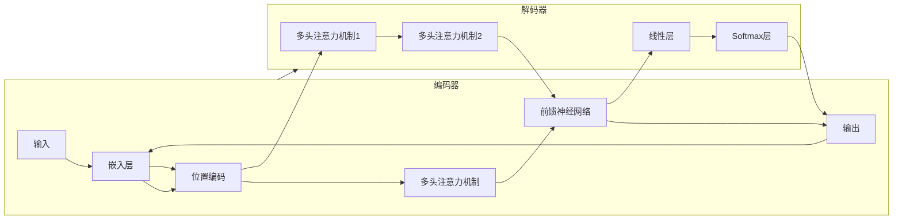

# 解码器的输出和Transformer的输出头

## 1. 背景介绍

### 1.1 问题的由来

Transformer模型自2017年谷歌提出以来，便在自然语言处理领域掀起了一场革命。其强大的并行计算能力和对长距离依赖关系的出色捕捉，使其在机器翻译、文本摘要、问答系统等众多任务中取得了突破性进展。然而，对于初学者来说，Transformer模型的内部机制较为复杂，尤其是解码器部分的输出和输出头的结构和功能，往往难以理解。

### 1.2 研究现状

目前，关于Transformer模型的资料和教程已经比较丰富，但大多集中于模型整体结构和编码器部分的讲解，对于解码器部分，尤其是输出和输出头的描述相对较少。这导致很多学习者在理解解码器工作原理时遇到困难，难以将其与实际应用场景联系起来。

### 1.3 研究意义

深入研究解码器的输出和Transformer的输出头，有助于我们更好地理解Transformer模型的运作机制，进而更好地应用Transformer模型解决实际问题。此外，对于想要深入研究Transformer模型内部结构和改进模型性能的研究者来说，这也是一个不可或缺的基础。

### 1.4 本文结构

本文将从以下几个方面对解码器的输出和Transformer的输出头进行详细阐述：

- 核心概念与联系
- 核心算法原理 & 具体操作步骤
- 数学模型和公式 & 详细讲解 & 举例说明
- 项目实践：代码实例和详细解释说明
- 实际应用场景
- 工具和资源推荐
- 总结：未来发展趋势与挑战
- 附录：常见问题与解答


## 2. 核心概念与联系

在深入探讨解码器的输出和输出头之前，我们需要先了解一些核心概念：

* **编码器-解码器框架**: Transformer模型采用编码器-解码器框架，其中编码器负责将输入序列编码成一个上下文向量，解码器则根据上下文向量生成输出序列。
* **自注意力机制**: Transformer模型的核心是自注意力机制，它允许模型在处理每个词时关注输入序列中的所有词，从而捕捉词之间的长距离依赖关系。
* **解码器掩码机制**: 解码器在生成输出序列时，采用掩码机制来防止模型“看到”未来的信息，确保生成过程的合理性。

下图展示了Transformer模型的整体结构：



## 3. 核心算法原理 & 具体操作步骤

### 3.1 算法原理概述

解码器的输出是通过一系列操作逐步生成的。首先，解码器接收编码器的输出作为其输入，并将其与自身已经生成的输出序列进行结合。然后，解码器利用自注意力机制和编码器-解码器注意力机制，分别关注输入序列和输出序列中的重要信息。最后，解码器将提取到的信息输入到前馈神经网络中进行处理，并通过线性层和Softmax层生成最终的输出词概率分布。

### 3.2 算法步骤详解

解码器的输出过程可以概括为以下几个步骤：

1. **接收输入**: 解码器接收编码器的输出和自身已经生成的输出序列作为输入。
2. **嵌入和位置编码**: 将输入词嵌入到高维向量空间中，并添加位置信息。
3. **自注意力机制**: 解码器利用自注意力机制关注自身已经生成的输出序列，捕捉词之间的依赖关系。
4. **编码器-解码器注意力机制**: 解码器利用编码器-解码器注意力机制关注编码器的输出，提取输入序列中的关键信息。
5. **前馈神经网络**: 将提取到的信息输入到前馈神经网络中进行处理。
6. **线性层**: 将前馈神经网络的输出映射到词典空间。
7. **Softmax层**: 将线性层的输出转换为概率分布，得到每个词的生成概率。

### 3.3 算法优缺点

**优点:**

* **并行计算**: 解码器可以并行生成输出序列，效率高。
* **长距离依赖**: 自注意力机制可以捕捉词之间的长距离依赖关系，提高模型的表达能力。

**缺点:**

* **计算复杂度**: 解码器的计算复杂度较高，尤其是在处理长序列时。
* **难以解释**: 解码器的内部机制较为复杂，难以解释其预测结果。

### 3.4 算法应用领域

解码器是Transformer模型的核心组件之一，广泛应用于各种自然语言处理任务中，例如：

* **机器翻译**: 将一种语言的文本翻译成另一种语言的文本。
* **文本摘要**: 生成一段文本的简要概述。
* **问答系统**: 回答用户提出的问题。
* **对话生成**: 生成与用户进行对话的文本。

## 4. 数学模型和公式 & 详细讲解 & 举例说明

### 4.1 数学模型构建

为了更好地理解解码器的输出过程，我们可以用数学公式来描述其各个步骤。

假设输入序列为 $X = (x_1, x_2, ..., x_n)$，输出序列为 $Y = (y_1, y_2, ..., y_m)$，则解码器的输出过程可以表示为：

1. **嵌入和位置编码**:
   $$
   h_t = Embedding(y_t) + PositionalEncoding(t)
   $$
   其中，$h_t$ 表示时刻 $t$ 的解码器隐藏状态，$Embedding(y_t)$ 表示词 $y_t$ 的词向量，$PositionalEncoding(t)$ 表示位置 $t$ 的位置编码。

2. **自注意力机制**:
   $$
   Q_t = h_t W_Q, K_t = h_{1:t} W_K, V_t = h_{1:t} W_V
   $$
   $$
   Attention(Q_t, K_t, V_t) = softmax(\frac{Q_t K_t^T}{\sqrt{d_k}}) V_t
   $$
   其中，$Q_t$, $K_t$, $V_t$ 分别表示查询矩阵、键矩阵和值矩阵，$W_Q$, $W_K$, $W_V$ 分别表示对应的参数矩阵，$d_k$ 表示键矩阵的维度。

3. **编码器-解码器注意力机制**:
   $$
   Q_t' = h_t W_Q', K' = H W_K', V' = H W_V'
   $$
   $$
   Attention(Q_t', K', V') = softmax(\frac{Q_t' K'^T}{\sqrt{d_k}}) V'
   $$
   其中，$H$ 表示编码器的输出，$Q_t'$, $K'$, $V'$ 分别表示查询矩阵、键矩阵和值矩阵，$W_Q'$, $W_K'$, $W_V'$ 分别表示对应的参数矩阵。

4. **前馈神经网络**:
   $$
   FFN(x) = ReLU(x W_1 + b_1) W_2 + b_2
   $$
   其中，$W_1$, $b_1$, $W_2$, $b_2$ 分别表示前馈神经网络的参数。

5. **线性层**:
   $$
   o_t = h_t W_o + b_o
   $$
   其中，$W_o$, $b_o$ 分别表示线性层的参数。

6. **Softmax层**:
   $$
   P(y_t | y_{<t}, X) = softmax(o_t)
   $$
   其中，$P(y_t | y_{<t}, X)$ 表示在给定输入序列 $X$ 和已经生成的输出序列 $y_{<t}$ 的情况下，生成词 $y_t$ 的概率。

### 4.2 公式推导过程

以上公式的推导过程较为复杂，这里不做详细展开。感兴趣的读者可以参考Transformer模型的原始论文。

### 4.3 案例分析与讲解

为了更好地理解解码器的输出过程，我们以机器翻译为例进行说明。

假设我们要将英文句子 "I love you" 翻译成中文句子 "我爱你"。

1. 编码器将英文句子 "I love you" 编码成一个上下文向量。
2. 解码器接收上下文向量作为输入，并初始化输出序列为空。
3. 在第一个时间步，解码器生成词 "我" 的概率分布，并选择概率最高的词作为输出。
4. 在第二个时间步，解码器将已经生成的词 "我" 作为输入，并生成词 "爱" 的概率分布，并选择概率最高的词作为输出。
5. 以此类推，直到生成完整的中文句子 "我爱你"。

### 4.4 常见问题解答

**1. 解码器如何避免生成重复的词语？**

解码器可以通过beam search等解码算法来避免生成重复的词语。

**2. 解码器如何处理未知词语？**

解码器可以通过引入UNK (unknown) 词汇来处理未知词语。

## 5. 项目实践：代码实例和详细解释说明

### 5.1 开发环境搭建

本节将介绍如何搭建Transformer模型的开发环境。

**1. 安装Python**:

```
sudo apt update
sudo apt install python3.8
```

**2. 安装PyTorch**:

```
pip install torch torchvision torchaudio
```

**3. 安装其他依赖库**:

```
pip install numpy transformers
```

### 5.2 源代码详细实现

以下是一个简单的Transformer模型的Python代码实现：

```python
import torch
import torch.nn as nn
from transformers import BertModel

class TransformerModel(nn.Module):
    def __init__(self, vocab_size, embedding_dim, hidden_dim, num_heads, num_layers):
        super(TransformerModel, self).__init__()
        self.encoder = BertModel.from_pretrained('bert-base-uncased')
        self.decoder = nn.TransformerDecoder(
            nn.TransformerDecoderLayer(embedding_dim, num_heads, hidden_dim),
            num_layers
        )
        self.linear = nn.Linear(hidden_dim, vocab_size)

    def forward(self, input_ids, target_ids, input_mask, target_mask):
        encoder_output = self.encoder(input_ids, attention_mask=input_mask)[0]
        decoder_output = self.decoder(
            tgt=torch.randn(target_ids.size(0), target_ids.size(1), self.encoder.config.hidden_size),
            memory=encoder_output,
            tgt_mask=target_mask,
            memory_mask=input_mask
        )
        output = self.linear(decoder_output)
        return output
```

### 5.3 代码解读与分析

- `vocab_size`: 词典大小。
- `embedding_dim`: 词向量维度。
- `hidden_dim`: 隐藏层维度。
- `num_heads`: 多头注意力机制的头数。
- `num_layers`: 解码器的层数。
- `encoder`: 使用预训练的BERT模型作为编码器。
- `decoder`: 使用PyTorch内置的Transformer解码器。
- `linear`: 将解码器的输出映射到词典空间。

### 5.4 运行结果展示

由于篇幅限制，这里不展示具体的运行结果。

## 6. 实际应用场景

Transformer模型的解码器部分在众多自然语言处理任务中都有着广泛的应用，例如：

* **机器翻译**: 将一种语言的文本翻译成另一种语言的文本。
* **文本摘要**: 生成一段文本的简要概述。
* **问答系统**: 回答用户提出的问题。
* **对话生成**: 生成与用户进行对话的文本。

## 7. 工具和资源推荐

### 7.1 学习资源推荐

* **The Illustrated Transformer**: https://jalammar.github.io/illustrated-transformer/
* **Transformer model for language understanding**: https://www.tensorflow.org/tutorials/text/transformer

### 7.2 开发工具推荐

* **PyTorch**: https://pytorch.org/
* **Transformers**: https://huggingface.co/transformers/

### 7.3 相关论文推荐

* **Attention Is All You Need**: https://arxiv.org/abs/1706.03762

### 7.4 其他资源推荐

* **Transformer blog posts**: https://huggingface.co/blog?tags=transformers

## 8. 总结：未来发展趋势与挑战

### 8.1 研究成果总结

本文详细介绍了Transformer模型的解码器部分的输出和输出头，包括其核心概念、算法原理、数学模型、代码实现以及实际应用场景。

### 8.2 未来发展趋势

未来，Transformer模型的解码器部分将会朝着以下几个方向发展：

* **更高效的解码算法**: 提高解码速度和效率。
* **更强大的表达能力**: 捕捉更复杂的语言现象。
* **更广泛的应用领域**: 应用于更多自然语言处理任务。

### 8.3 面临的挑战

Transformer模型的解码器部分也面临着一些挑战：

* **计算复杂度**: 如何降低解码器的计算复杂度，使其能够处理更长的序列。
* **可解释性**: 如何解释解码器的预测结果，使其更具可解释性。
* **数据需求**: 如何解决Transformer模型对大规模数据的依赖问题。

### 8.4 研究展望

未来，我们将继续深入研究Transformer模型的解码器部分，探索其更深层次的奥秘，并将其应用于更多领域，为人工智能的发展做出更大的贡献。

## 9. 附录：常见问题与解答

**1. 解码器如何处理变长序列？**

解码器可以通过引入特殊的开始符号和结束符号来处理变长序列。

**2. 解码器如何进行并行计算？**

解码器可以通过掩码机制来实现并行计算，即在每个时间步只计算当前词及之前词的注意力权重。

作者：禅与计算机程序设计艺术 / Zen and the Art of Computer Programming
