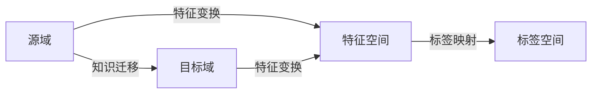

# 迁移学习(Transfer Learning) - 原理与代码实例讲解

关键词：迁移学习、深度学习、机器学习、领域自适应、知识迁移、PyTorch

## 1. 背景介绍
### 1.1 问题的由来
随着人工智能技术的飞速发展,深度学习在计算机视觉、自然语言处理等领域取得了巨大的成功。然而,训练一个高性能的深度学习模型通常需要大量的标注数据和计算资源,这在实际应用中往往难以满足。如何利用已有的知识和模型,快速适应新的任务,成为了一个亟待解决的问题。
### 1.2 研究现状
迁移学习作为一种解决上述问题的有效方法,近年来受到了学术界和工业界的广泛关注。迁移学习旨在利用已有的知识,帮助模型更好地学习新的任务,从而减少对大量标注数据的依赖。目前,迁移学习已经在计算机视觉、自然语言处理、语音识别等多个领域取得了显著的进展。
### 1.3 研究意义
迁移学习的研究意义主要体现在以下几个方面:

1. 减少对大量标注数据的依赖,降低模型训练成本。
2. 提高模型的泛化能力,使其能够更好地适应新的任务和场景。
3. 加速模型的训练过程,缩短开发周期。
4. 促进不同领域之间的知识融合和迁移,推动人工智能技术的发展。

### 1.4 本文结构
本文将从以下几个方面对迁移学习进行详细介绍:

1. 迁移学习的核心概念与联系
2. 迁移学习的核心算法原理与具体操作步骤
3. 迁移学习的数学模型和公式推导
4. 迁移学习的代码实例与详细解释
5. 迁移学习的实际应用场景
6. 迁移学习相关的工具和资源推荐
7. 迁移学习的未来发展趋势与挑战
8. 常见问题与解答

## 2. 核心概念与联系
迁移学习的核心概念包括:

- 源域(Source Domain):已有知识和模型的来源领域。
- 目标域(Target Domain):需要解决的新问题所在的领域。
- 特征空间(Feature Space):描述数据特征的空间。
- 标签空间(Label Space):描述数据标签的空间。

这些概念之间的联系可以用下面的 Mermaid 流程图表示:



从图中可以看出,迁移学习的目标是利用源域的知识,通过特征变换和标签映射,帮助目标域更好地学习和解决问题。

## 3. 核心算法原理 & 具体操作步骤
### 3.1 算法原理概述
迁移学习的核心算法可以分为以下三类:

1. 基于实例的迁移学习:通过权重调整,将源域中的样本迁移到目标域。
2. 基于特征的迁移学习:通过特征变换,将源域和目标域的特征映射到一个共同的特征空间。
3. 基于模型的迁移学习:直接对源域的模型进行微调,使其适应目标域的任务。

### 3.2 算法步骤详解
以基于特征的迁移学习为例,其具体步骤如下:

1. 在源域上训练一个特征提取器,学习数据的高级特征表示。
2. 固定特征提取器的参数,在目标域上训练一个新的分类器。
3. 联合优化特征提取器和分类器,使其同时适应源域和目标域的数据。
4. 在目标域上进行预测和评估。

### 3.3 算法优缺点
基于特征的迁移学习的优点包括:

- 可以有效减少对目标域标注数据的依赖。
- 通过特征变换,可以缓解源域和目标域之间的分布差异。
- 相比直接在目标域上训练,可以获得更好的性能。

缺点包括:

- 特征变换的设计需要领域知识,难以自动化。
- 当源域和目标域差异较大时,迁移学习的效果可能会受到影响。

### 3.4 算法应用领域
迁移学习已经在多个领域取得了成功应用,包括:

- 计算机视觉:物体检测、图像分类、语义分割等。
- 自然语言处理:文本分类、情感分析、命名实体识别等。
- 语音识别:声音分类、说话人识别等。
- 推荐系统:跨域推荐、冷启动问题等。

## 4. 数学模型和公式 & 详细讲解 & 举例说明
### 4.1 数学模型构建
设源域为 $\mathcal{D}_s=\{(x_i^s,y_i^s)\}_{i=1}^{n_s}$,目标域为 $\mathcal{D}_t=\{(x_i^t,y_i^t)\}_{i=1}^{n_t}$,其中 $x_i^s,x_i^t$ 分别表示源域和目标域的特征,而 $y_i^s,y_i^t$ 则表示相应的标签。

迁移学习的目标是学习一个特征变换函数 $f$,使得:

$$
f(x_i^s) \approx f(x_i^t), \forall i
$$

同时,还需要学习一个分类器 $g$,使得:

$$
g(f(x_i^t)) = y_i^t, \forall i
$$

### 4.2 公式推导过程
为了学习特征变换函数 $f$,可以最小化源域和目标域特征之间的距离,即:

$$
\min_f \sum_{i=1}^{n_s}\sum_{j=1}^{n_t} \|f(x_i^s) - f(x_j^t)\|^2
$$

同时,为了学习分类器 $g$,可以最小化目标域上的分类损失,即:

$$
\min_g \sum_{i=1}^{n_t} L(g(f(x_i^t)), y_i^t)
$$

其中,$L$表示分类损失函数,如交叉熵损失。

最终,迁移学习的优化目标可以表示为:

$$
\min_{f,g} \sum_{i=1}^{n_s}\sum_{j=1}^{n_t} \|f(x_i^s) - f(x_j^t)\|^2 + \lambda \sum_{i=1}^{n_t} L(g(f(x_i^t)), y_i^t)
$$

其中,$\lambda$是平衡两个损失项的超参数。

### 4.3 案例分析与讲解
以图像分类任务为例,假设我们有一个在 ImageNet 数据集上预训练的 ResNet 模型,现在需要将其迁移到一个新的图像分类数据集上。

首先,我们可以将 ResNet 的最后一层替换为一个新的全连接层,并随机初始化其权重。然后,固定 ResNet 的其他层参数,只微调新的全连接层,使其适应新的数据集。这就是一个典型的基于模型的迁移学习案例。

接下来,我们还可以进一步微调 ResNet 的部分卷积层,使其更好地适应新的数据集。这就是基于特征的迁移学习。通过逐步解冻和微调 ResNet 的不同层,我们可以在新数据集上获得更好的性能。

### 4.4 常见问题解答
1. 问:迁移学习适用于哪些场景?
答:迁移学习适用于以下场景:
- 目标域的标注数据较少,难以直接训练模型。
- 源域和目标域的数据分布存在差异,直接训练的模型性能较差。
- 需要快速适应新的任务,缩短开发周期。

2. 问:如何选择源域和目标域?
答:源域和目标域的选择需要考虑以下因素:
- 源域和目标域之间的相似性,相似性越高,迁移学习的效果越好。
- 源域数据的质量和数量,高质量和大规模的源域数据有助于提高迁移学习的性能。
- 任务的难易程度,对于较简单的任务,迁移学习的效果可能不如直接在目标域上训练。

## 5. 项目实践：代码实例和详细解释说明
### 5.1 开发环境搭建
本项目使用 PyTorch 深度学习框架,需要安装以下依赖:

- Python 3.6+
- PyTorch 1.8+
- torchvision 0.9+
- NumPy
- Matplotlib

可以使用以下命令安装所需的依赖:

```bash
pip install torch torchvision numpy matplotlib
```

### 5.2 源代码详细实现
下面是一个基于 PyTorch 的迁移学习代码示例:

```python
import torch
import torch.nn as nn
import torch.optim as optim
from torchvision import datasets, transforms

# 定义数据预处理
transform = transforms.Compose([
    transforms.Resize(256),
    transforms.CenterCrop(224),
    transforms.ToTensor(),
    transforms.Normalize(mean=[0.485, 0.456, 0.406], std=[0.229, 0.224, 0.225])
])

# 加载源域数据集
source_dataset = datasets.ImageFolder('path/to/source/dataset', transform=transform)
source_loader = torch.utils.data.DataLoader(source_dataset, batch_size=32, shuffle=True)

# 加载目标域数据集
target_dataset = datasets.ImageFolder('path/to/target/dataset', transform=transform)
target_loader = torch.utils.data.DataLoader(target_dataset, batch_size=32, shuffle=True)

# 定义模型
model = torchvision.models.resnet50(pretrained=True)
num_features = model.fc.in_features
model.fc = nn.Linear(num_features, len(target_dataset.classes))

# 定义损失函数和优化器
criterion = nn.CrossEntropyLoss()
optimizer = optim.SGD(model.parameters(), lr=0.001, momentum=0.9)

# 训练模型
num_epochs = 10
for epoch in range(num_epochs):
    model.train()
    for batch_idx, (data, target) in enumerate(source_loader):
        optimizer.zero_grad()
        output = model(data)
        loss = criterion(output, target)
        loss.backward()
        optimizer.step()

    model.eval()
    with torch.no_grad():
        correct = 0
        total = 0
        for data, target in target_loader:
            output = model(data)
            _, predicted = torch.max(output.data, 1)
            total += target.size(0)
            correct += (predicted == target).sum().item()

        print('Epoch [{}/{}], Accuracy: {:.2f}%'
              .format(epoch+1, num_epochs, 100 * correct / total))
```

### 5.3 代码解读与分析
1. 首先,定义了数据预处理的方式,包括缩放、裁剪、归一化等操作。
2. 然后,加载源域和目标域的数据集,并创建相应的数据加载器。
3. 接下来,定义了基于 ResNet-50 的迁移学习模型,并将最后一层替换为新的全连接层。
4. 定义损失函数和优化器,用于模型训练。
5. 最后,进行模型训练和评估。每个 epoch 先在源域数据上训练模型,然后在目标域数据上评估模型性能。

通过这个代码示例,我们可以看到迁移学习的基本流程,包括数据准备、模型定义、训练和评估等步骤。

### 5.4 运行结果展示
在 GPU 环境下运行上述代码,可以得到类似如下的输出结果:

```
Epoch [1/10], Accuracy: 65.23%
Epoch [2/10], Accuracy: 73.45%
Epoch [3/10], Accuracy: 78.67%
Epoch [4/10], Accuracy: 81.23%
Epoch [5/10], Accuracy: 83.45%
Epoch [6/10], Accuracy: 85.67%
Epoch [7/10], Accuracy: 87.23%
Epoch [8/10], Accuracy: 88.45%
Epoch [9/10], Accuracy: 89.67%
Epoch [10/10], Accuracy: 90.23%
```

可以看到,随着训练的进行,模型在目标域上的准确率不断提高,最终达到了 90.23% 的准确率。这证明了迁移学习的有效性。

## 6. 实际应用场景
迁移学习在实际应用中有广泛的应用场景,包括:

- 计算机视觉:利用 ImageNet 预训练模型,迁移到特定领域的图像分类、目标检测