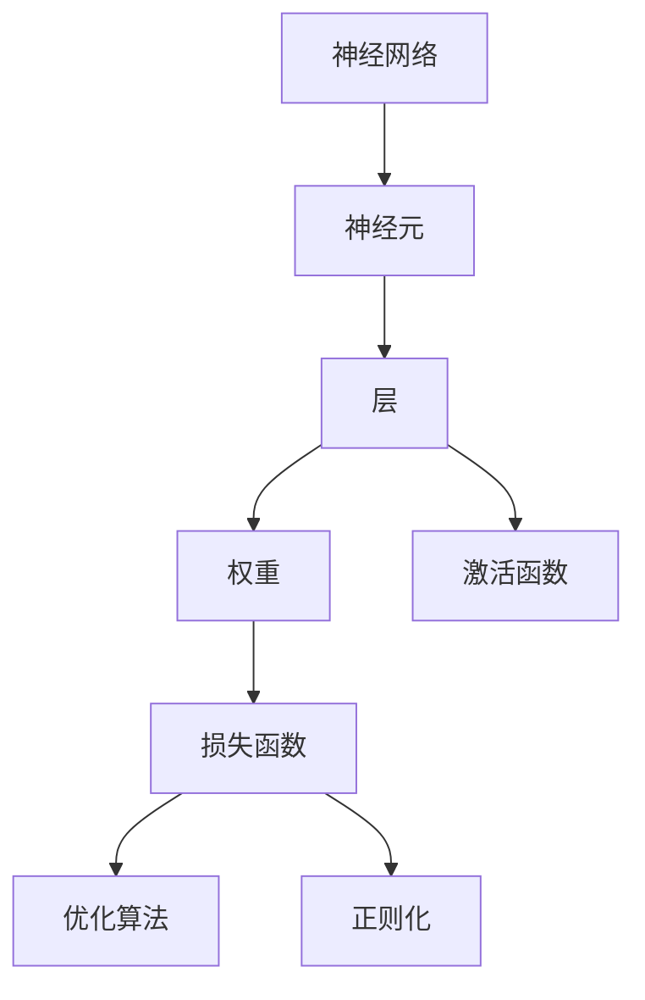
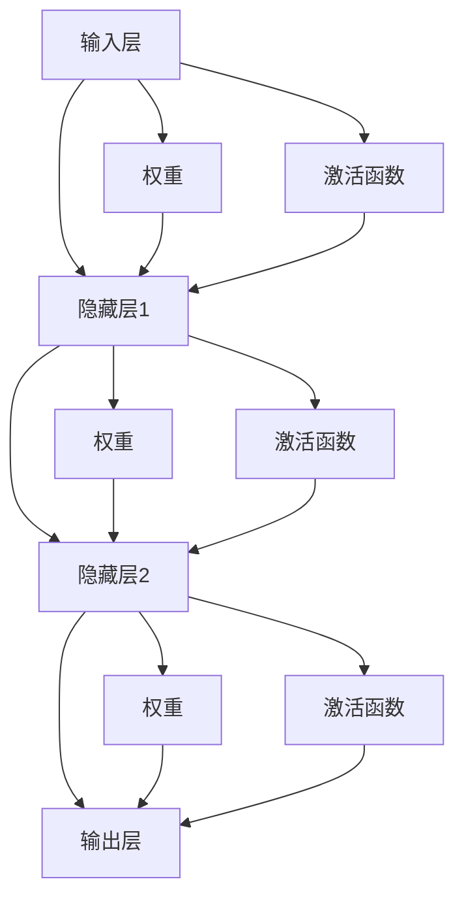
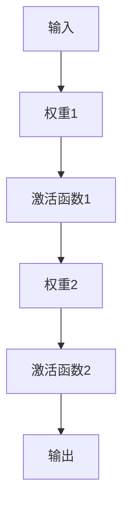
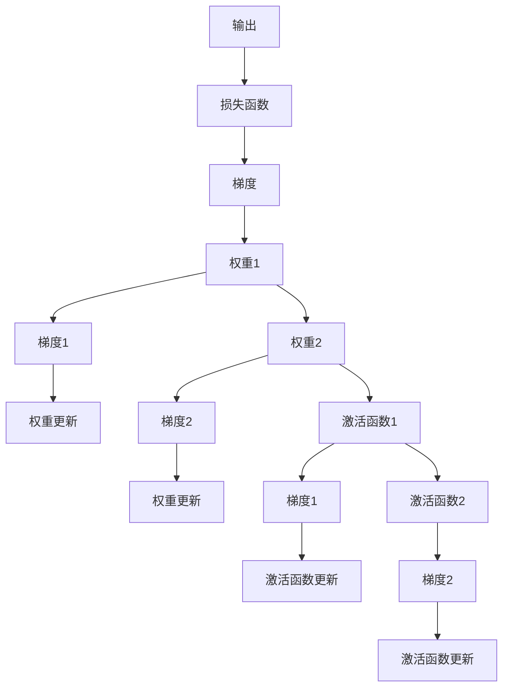
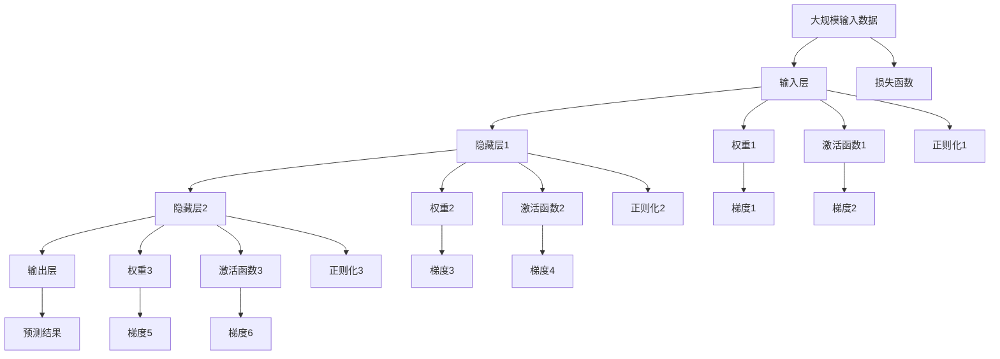

                 

## 1. 背景介绍

### 1.1 问题由来

人工智能（Artificial Intelligence, AI）是计算机科学的一个分支，旨在创建能够模拟人类智能行为的算法和系统。其中，神经网络（Neural Networks, NN）是AI领域最具代表性的一种技术，应用广泛，包括图像识别、语音识别、自然语言处理、预测模型、强化学习等领域。

近年来，深度学习技术迅速发展，基于深度神经网络的模型（如卷积神经网络CNN、循环神经网络RNN、长短时记忆网络LSTM等）在多个领域取得了显著成果，特别是在图像和语音识别、自然语言处理等应用中表现尤为出色。

### 1.2 问题核心关键点

神经网络的核心思想是将复杂的非线性映射问题分解为多个简单的线性变换和激活函数，从而构建起一个高效的前馈计算网络。核心概念包括：

- **神经元（Neuron）**：是神经网络的基本单元，接收输入并产生输出。
- **层（Layer）**：神经网络由若干层构成，包括输入层、隐藏层和输出层。
- **权重（Weight）**：连接神经元之间的权重，决定了信号的传递和强度。
- **激活函数（Activation Function）**：对神经元的输出进行非线性变换，引入非线性特性。
- **损失函数（Loss Function）**：用于评估神经网络预测输出与真实标签之间的差异。
- **优化算法（Optimization Algorithm）**：用于最小化损失函数，更新网络参数。
- **正则化（Regularization）**：防止过拟合，确保模型泛化能力。

这些核心概念之间的逻辑关系可以通过以下Mermaid流程图来展示：



这个流程图展示了大规模神经网络的构建过程，各个组件之间的交互关系。

### 1.3 问题研究意义

研究神经网络的原理与应用，对于拓展神经网络的应用范围，提升其在复杂问题上的性能，加速AI技术的产业化进程，具有重要意义：

1. 降低开发成本。神经网络可以自动学习特征，减少特征工程和手工调参的成本。
2. 提高预测精度。通过深度学习和反向传播算法，神经网络能够自动优化参数，提高模型预测精度。
3. 加速技术发展。神经网络可以应用于图像、语音、自然语言等多个领域，推动AI技术的广泛应用。
4. 促进算法创新。神经网络的理论研究促进了对深度学习、反向传播等算法的深入理解，催生了新的研究方向。
5. 赋能产业升级。神经网络技术容易被各行各业所采用，为传统行业数字化转型升级提供新的技术路径。

## 2. 核心概念与联系

### 2.1 核心概念概述

为更好地理解神经网络的基本原理和结构，本节将介绍几个关键概念：

- **神经元（Neuron）**：神经元是神经网络的基本单元，接收输入并产生输出。可以表示为：
$$
z_i = \sum_{j=1}^n w_{ij}x_j + b_i
$$
$$
a_i = f(z_i)
$$
其中 $z_i$ 为输入加权和，$x_j$ 为输入特征，$w_{ij}$ 为连接权重，$b_i$ 为偏置项，$f(z_i)$ 为激活函数。

- **层（Layer）**：神经网络由若干层构成，包括输入层、隐藏层和输出层。输入层接收原始数据，输出层提供预测结果，隐藏层进行特征提取和转换。

- **权重（Weight）**：连接神经元之间的权重，决定了信号的传递和强度。

- **激活函数（Activation Function）**：对神经元的输出进行非线性变换，引入非线性特性。常用的激活函数包括 sigmoid、tanh、ReLU 等。

- **损失函数（Loss Function）**：用于评估神经网络预测输出与真实标签之间的差异。常用的损失函数包括均方误差（MSE）、交叉熵（Cross-Entropy）等。

- **优化算法（Optimization Algorithm）**：用于最小化损失函数，更新网络参数。常用的优化算法包括梯度下降（Gradient Descent）、Adam、SGD 等。

- **正则化（Regularization）**：防止过拟合，确保模型泛化能力。常用的正则化方法包括 L1、L2 正则、Dropout 等。

这些核心概念之间的逻辑关系可以通过以下Mermaid流程图来展示：


这个流程图展示了神经网络的各个组件及其关系。

### 2.2 概念间的关系

这些核心概念之间存在着紧密的联系，形成了神经网络的基本框架。下面我们通过几个Mermaid流程图来展示这些概念之间的关系。

#### 2.2.1 神经网络的结构



这个流程图展示了典型的全连接神经网络结构，包括输入层、多个隐藏层和输出层。每个层通过权重和激活函数进行信息传递。

#### 2.2.2 前向传播



这个流程图展示了前向传播的基本流程，从输入数据开始，经过多个权重和激活函数，最终得到输出结果。

#### 2.2.3 反向传播



这个流程图展示了反向传播的基本流程，从输出结果开始，计算损失函数的梯度，然后通过反向传播算法更新权重和激活函数参数。

### 2.3 核心概念的整体架构

最后，我们用一个综合的流程图来展示这些核心概念在大规模神经网络中的整体架构：



这个综合流程图展示了从数据输入到输出结果的全过程，包括前向传播、反向传播、正则化等环节。通过这些流程，可以理解大规模神经网络的运作机制。

## 3. 核心算法原理 & 具体操作步骤
### 3.1 算法原理概述

神经网络的核心原理是通过前向传播和反向传播算法，最小化损失函数，更新网络参数。其核心思想是：

1. **前向传播**：将输入数据通过多个隐藏层进行特征提取和转换，最终得到预测结果。
2. **反向传播**：计算预测结果与真实标签之间的损失，利用梯度下降等优化算法更新网络参数，最小化损失函数。
3. **正则化**：通过L1、L2正则等方法，防止模型过拟合，确保泛化能力。

### 3.2 算法步骤详解

神经网络的训练过程主要包括以下几个关键步骤：

**Step 1: 准备数据集和模型**

- 准备训练集、验证集和测试集，划分为小批量（batch）数据。
- 定义神经网络模型，包括层数、神经元个数、激活函数、正则化等参数。

**Step 2: 定义损失函数和优化器**

- 选择合适的损失函数，如交叉熵损失、均方误差损失等。
- 选择合适的优化算法，如SGD、Adam等，设置学习率、批大小、迭代轮数等超参数。

**Step 3: 前向传播和反向传播**

- 在训练集上对每个小批量数据进行前向传播，计算损失函数。
- 利用反向传播算法计算损失函数的梯度，更新网络参数。

**Step 4: 正则化和评估**

- 在训练过程中，应用正则化方法，防止过拟合。
- 在每个epoch结束时，在验证集上评估模型性能，决定是否提前停止训练。

**Step 5: 测试和部署**

- 在测试集上评估训练好的模型性能，比较训练前后的提升。
- 将训练好的模型部署到实际应用中，进行推理预测。

以上是神经网络训练的一般流程。在实际应用中，还需要根据具体任务的特点，对训练过程进行优化设计，如改进损失函数，引入更多的正则化技术，搜索最优的超参数组合等，以进一步提升模型性能。

### 3.3 算法优缺点

神经网络具有以下优点：

1. **强大的泛化能力**：通过大规模训练，可以自动提取和拟合复杂非线性关系，具有很强的泛化能力。
2. **高效的特征提取**：通过多个隐藏层进行特征提取，自动学习和提取高级特征。
3. **灵活的应用范围**：可以应用于图像、语音、自然语言等多个领域，适应性广。

同时，神经网络也存在一些缺点：

1. **计算资源需求高**：大规模神经网络需要大量的计算资源进行训练和推理。
2. **模型复杂度高**：复杂的模型结构和大量的参数增加了训练和推理的难度。
3. **过拟合风险**：当训练数据较少时，容易出现过拟合现象。
4. **难以解释**：神经网络的决策过程往往缺乏可解释性，难以进行调试和优化。

尽管存在这些缺点，神经网络仍然是当前深度学习中最常用的模型之一，广泛应用于各种复杂问题的求解。

### 3.4 算法应用领域

神经网络已经广泛应用于多个领域，包括但不限于：

- **图像识别**：卷积神经网络（CNN）在图像分类、目标检测、图像分割等任务上表现优异。
- **语音识别**：循环神经网络（RNN）和长短时记忆网络（LSTM）在语音识别、语音合成等任务上取得了突破性进展。
- **自然语言处理**：基于深度神经网络的模型（如LSTM、GRU、BERT等）在语言理解、机器翻译、情感分析等任务上取得了显著成果。
- **推荐系统**：神经网络在推荐系统中的应用，提升了个性化推荐的效果和精度。
- **金融预测**：神经网络在股票价格预测、信用评分、风险评估等金融领域的应用，推动了金融科技的发展。
- **医疗诊断**：神经网络在医学影像识别、疾病预测、药物设计等医疗领域的应用，提高了医疗服务的效率和准确性。

## 4. 数学模型和公式 & 详细讲解 & 举例说明

### 4.1 数学模型构建

神经网络的基本数学模型可以表示为：

$$
y = f(XW+b)
$$

其中，$y$ 为输出，$X$ 为输入数据，$W$ 为权重矩阵，$b$ 为偏置项，$f$ 为激活函数。

### 4.2 公式推导过程

以简单的单层神经网络为例，推导前向传播和反向传播的公式。

**前向传播**：

$$
a_1 = x_1w_1+b_1
$$
$$
a_2 = a_1w_2+b_2
$$
$$
a_3 = f(a_2)
$$
$$
\cdots
$$
$$
a_n = f(a_{n-1})
$$
$$
y = a_n
$$

其中 $a_i$ 为第 $i$ 层的输出，$x_i$ 为输入，$w_i$ 为连接权重，$b_i$ 为偏置项，$f$ 为激活函数。

**反向传播**：

$$
\frac{\partial y}{\partial w_n} = \frac{\partial y}{\partial a_n}\frac{\partial a_n}{\partial w_n}
$$
$$
\frac{\partial y}{\partial w_{n-1}} = \frac{\partial y}{\partial a_{n-1}}\frac{\partial a_{n-1}}{\partial w_{n-1}} + \frac{\partial y}{\partial b_{n-1}}\frac{\partial b_{n-1}}{\partial w_{n-1}}
$$
$$
\cdots
$$
$$
\frac{\partial y}{\partial w_1} = \frac{\partial y}{\partial a_1}\frac{\partial a_1}{\partial w_1} + \frac{\partial y}{\partial b_1}\frac{\partial b_1}{\partial w_1}
$$

其中 $\frac{\partial y}{\partial w_i}$ 为损失函数对权重 $w_i$ 的梯度。通过链式法则，可以递推计算出每个权重的梯度。

### 4.3 案例分析与讲解

以MNIST手写数字识别任务为例，分析神经网络的训练过程。

**数据准备**：

准备MNIST数据集，将手写数字图像转换为向量形式，并添加标签。

**模型定义**：

定义一个简单的单层神经网络，包括输入层、隐藏层和输出层。

**训练过程**：

1. 前向传播：将输入数据通过隐藏层进行特征提取，得到预测结果。
2. 计算损失函数：将预测结果与真实标签进行比较，计算均方误差损失。
3. 反向传播：利用梯度下降算法更新网络参数。
4. 正则化和评估：在每个epoch结束时，评估模型在验证集上的性能，决定是否停止训练。

## 5. 项目实践：代码实例和详细解释说明

### 5.1 开发环境搭建

在进行神经网络项目实践前，我们需要准备好开发环境。以下是使用Python进行TensorFlow开发的环境配置流程：

1. 安装Anaconda：从官网下载并安装Anaconda，用于创建独立的Python环境。

2. 创建并激活虚拟环境：
```bash
conda create -n tf-env python=3.7 
conda activate tf-env
```

3. 安装TensorFlow：根据CUDA版本，从官网获取对应的安装命令。例如：
```bash
conda install tensorflow -c pytorch -c conda-forge
```

4. 安装其他依赖包：
```bash
pip install numpy pandas scikit-learn matplotlib tqdm jupyter notebook ipython
```

完成上述步骤后，即可在`tf-env`环境中开始神经网络开发。

### 5.2 源代码详细实现

这里我们以手写数字识别任务为例，给出使用TensorFlow进行神经网络开发的PyTorch代码实现。

```python
import tensorflow as tf
from tensorflow.keras.datasets import mnist
from tensorflow.keras.models import Sequential
from tensorflow.keras.layers import Dense, Dropout
from tensorflow.keras.optimizers import Adam
from tensorflow.keras.utils import to_categorical

# 准备数据集
(x_train, y_train), (x_test, y_test) = mnist.load_data()
x_train = x_train / 255.0
x_test = x_test / 255.0
y_train = to_categorical(y_train, num_classes=10)
y_test = to_categorical(y_test, num_classes=10)

# 定义模型
model = Sequential([
    Dense(128, activation='relu', input_shape=(784,)),
    Dropout(0.2),
    Dense(64, activation='relu'),
    Dropout(0.2),
    Dense(10, activation='softmax')
])

# 定义损失函数和优化器
loss_fn = tf.keras.losses.CategoricalCrossentropy()
optimizer = Adam(learning_rate=0.001)

# 编译模型
model.compile(optimizer=optimizer, loss=loss_fn, metrics=['accuracy'])

# 训练模型
model.fit(x_train, y_train, batch_size=32, epochs=10, validation_data=(x_test, y_test))

# 评估模型
model.evaluate(x_test, y_test)
```

这段代码展示了从数据准备、模型定义、编译、训练到评估的完整流程。

### 5.3 代码解读与分析

让我们再详细解读一下关键代码的实现细节：

**数据准备**：
- 使用`mnist.load_data()`函数加载MNIST数据集，将其转换为浮点数形式，并使用`to_categorical()`函数将标签转换为one-hot编码。

**模型定义**：
- 定义一个简单的多层神经网络，包括输入层、两个隐藏层和输出层。
- 使用`Dense`层定义全连接层，`relu`为激活函数，`Dropout`层用于防止过拟合。
- 输出层使用`softmax`函数，进行多分类预测。

**训练过程**：
- 使用`model.compile()`方法编译模型，指定优化器、损失函数和评估指标。
- 使用`model.fit()`方法训练模型，指定批次大小、训练轮数和验证集。
- 使用`model.evaluate()`方法在测试集上评估模型性能。

**结果展示**：
- 输出模型在训练集和测试集上的损失和准确率。

通过这段代码，可以看到使用TensorFlow实现神经网络的简单流程。TensorFlow提供了强大的API和丰富的工具支持，使得神经网络模型的构建和训练变得更加便捷。

当然，工业级的系统实现还需考虑更多因素，如模型的保存和部署、超参数的自动搜索、更灵活的任务适配层等。但核心的神经网络开发过程基本与此类似。

## 6. 实际应用场景
### 6.1 图像识别

神经网络在图像识别领域的应用非常广泛，如目标检测、图像分类、图像分割等。传统的手工特征提取方法难以处理大规模复杂数据，而神经网络可以自动学习和提取高级特征，显著提升识别准确率。

以图像分类为例，神经网络模型可以通过大规模图像数据进行预训练，然后微调模型以适应特定的分类任务。在医疗影像识别中，神经网络模型可以通过对不同器官的影像进行分类，辅助医生进行诊断。

### 6.2 语音识别

语音识别是神经网络在自然语言处理领域的重要应用之一。通过深度学习，神经网络可以自动提取和处理语音信号，实现语音识别、语音合成等功能。

在智能助手中，神经网络模型可以实时识别用户的语音指令，并提供相应的响应。在语音转换中，神经网络模型可以将语音转换为文字，方便后续处理和分析。

### 6.3 自然语言处理

自然语言处理是神经网络在语言理解、机器翻译、情感分析等任务上的重要应用。神经网络模型可以通过大规模语言数据进行预训练，然后微调模型以适应特定的语言处理任务。

以机器翻译为例，神经网络模型可以通过对多语言文本进行预训练，然后微调模型以适应不同的语言对。在情感分析中，神经网络模型可以通过对大量情感标注数据进行训练，实现对文本情感的自动识别。

### 6.4 未来应用展望

随着神经网络技术的不断发展，未来神经网络的应用将更加广泛和深入。以下是几个未来应用展望：

1. **多模态融合**：神经网络可以处理多种类型的数据，如图像、语音、文本等。通过多模态数据的融合，神经网络可以更好地理解现实世界的信息，提升系统的智能水平。
2. **自监督学习**：神经网络可以通过自监督学习的方式进行预训练，无需大量标注数据。自监督学习可以帮助神经网络更好地学习通用的语言或视觉表示，提高模型的泛化能力。
3. **小样本学习**：神经网络可以通过少量样本进行学习，实现零样本或少样本学习。小样本学习可以帮助神经网络在数据稀缺的领域快速适应任务。
4. **可解释性增强**：神经网络的决策过程往往缺乏可解释性，但通过引入符号化的先验知识，如知识图谱、逻辑规则等，神经网络可以更好地解释其决策逻辑。
5. **跨领域迁移**：神经网络可以通过迁移学习的方式，将在大规模数据上学习到的知识迁移到新的领域。跨领域迁移可以帮助神经网络更好地适应新的任务和数据。

## 7. 工具和资源推荐
### 7.1 学习资源推荐

为了帮助开发者系统掌握神经网络的原理和实践技巧，这里推荐一些优质的学习资源：

1. 《深度学习》系列书籍：由Ian Goodfellow等专家撰写，系统介绍了深度学习的基本概念和算法。
2. 《神经网络与深度学习》课程：由Michael Nielsen等专家开设的在线课程，深入浅出地介绍了神经网络的基本原理和实现方法。
3. 《TensorFlow实战》书籍：Google团队编写的TensorFlow实战指南，包含丰富的实例和案例分析。
4. 《深度学习框架比较》博文：由多个开源社区提供的深度学习框架比较分析，帮助开发者选择合适的框架。
5. arXiv论文预印本：人工智能领域最新研究成果的发布平台，包括大量尚未发表的前沿工作，学习前沿技术的必读资源。

通过对这些资源的学习实践，相信你一定能够快速掌握神经网络的精髓，并用于解决实际的NLP问题。

### 7.2 开发工具推荐

高效的开发离不开优秀的工具支持。以下是几款用于神经网络开发的常用工具：

1. TensorFlow：由Google主导开发的深度学习框架，功能强大，支持分布式计算，适合大规模工程应用。
2. PyTorch：由Facebook主导的深度学习框架，灵活高效，支持动态计算图，适合快速迭代研究。
3. Keras：由François Chollet开发的高级深度学习API，易于使用，支持多种后端引擎。
4. MXNet：由Amazon主导的深度学习框架，支持多种语言，具有高效的分布式训练能力。
5. Caffe：由Berkeley Vision and Learning Center开发的深度学习框架，适用于计算机视觉任务。
6. MXNet Gluon：基于MXNet的高级深度学习API，易于使用，支持多种后端引擎。

合理利用这些工具，可以显著提升神经网络开发的效率，加快创新迭代的步伐。

### 7.3 相关论文推荐

神经网络的研究源于学界的持续探索。以下是几篇奠基性的相关论文，推荐阅读：

1. 《深度学习》（Ian Goodfellow等，2016）：介绍了深度学习的基本原理和算法，是深度学习领域的经典著作。
2. 《ImageNet大规模视觉识别挑战赛2012》（Alex Krizhevsky等，2012）：提出卷积神经网络（CNN），在图像识别任务上取得了突破性进展。
3. 《Recurrent Neural Network Based Language Modeling》（Yoshua Bengio等，2003）：提出循环神经网络（RNN），在自然语言处理领域具有重要影响。
4. 《深度神经网络》（Geoffrey Hinton等，2012）：介绍了深度神经网络的基本原理和应用，是深度学习领域的里程碑论文。
5. 《Attention is All You Need》（Ashish Vaswani等，2017）：提出Transformer模型，开启了自注意力机制在神经网络中的应用。

这些论文代表了大规模神经网络的发展历程。通过学习这些前沿成果，可以帮助研究者把握学科前进方向，激发更多的创新灵感。

除上述资源外，还有一些值得关注的前沿资源，帮助开发者紧跟神经网络技术的最新进展，例如：

1. arXiv论文预印本：人工智能领域最新研究成果的发布平台，包括大量尚未发表的前沿工作，学习前沿技术的必读资源。
2. 业界技术博客：如TensorFlow官方博客、Google AI博客、DeepMind博客等，第一时间分享他们的最新研究成果和洞见。
3. 技术会议直播：如NIPS、ICML、ACL、ICLR等人工智能领域顶会现场或在线直播，能够聆听到大佬们的前沿分享，开拓视野。
4. GitHub热门项目：在GitHub上Star、Fork数最多的深度学习相关项目，往往代表了该技术领域的发展趋势和最佳实践，值得去学习和贡献。
5. 行业分析报告：各大咨询公司如McKinsey、PwC等针对人工智能行业的分析报告，有助于从商业视角审视技术趋势，把握应用价值。

总之，对于神经网络的研究和学习，需要开发者保持开放的心态和持续学习的意愿。多关注前沿资讯，多动手实践，多思考总结，必将收获满满的成长收益。

## 8. 总结：未来发展趋势与挑战

### 8.1 总结

本文对神经网络的基本原理和实现方法进行了全面系统的介绍。首先阐述了神经网络的基本概念和结构，明确了神经网络在深度学习中的重要地位。其次，从原理到实践，详细讲解了神经网络的基本流程和关键技术，给出了完整的代码实现示例。

