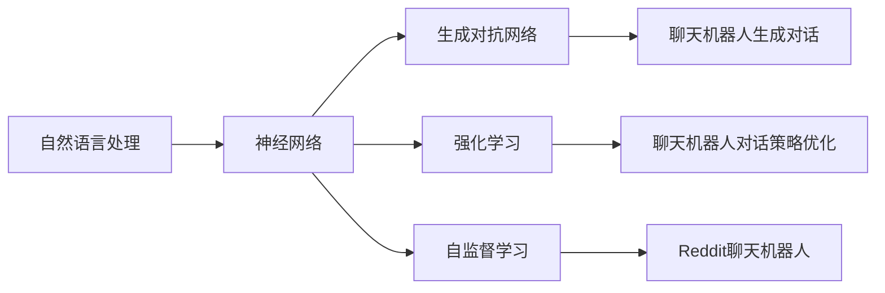
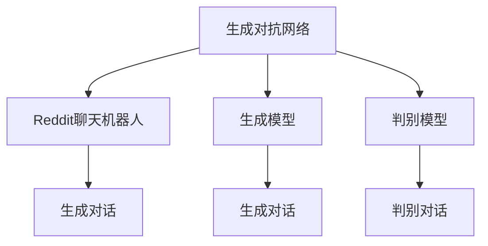
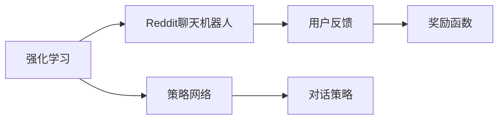
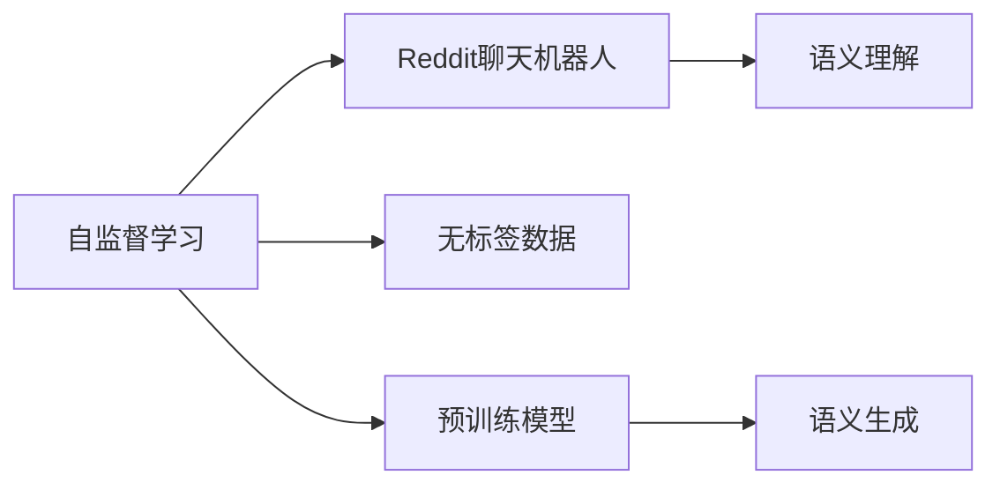
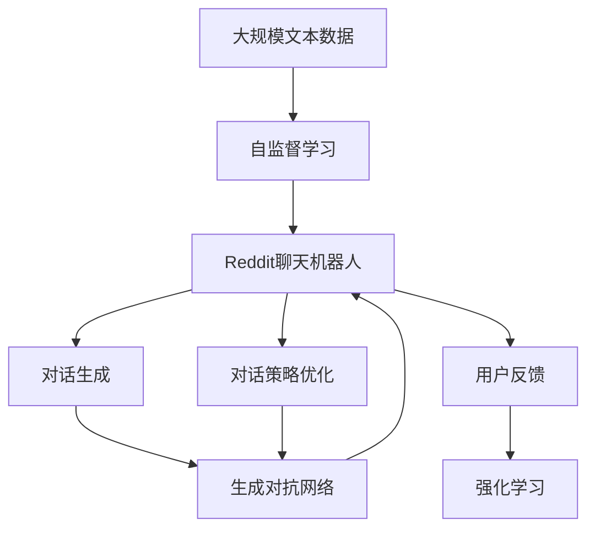

                 

# OpenAI 内部早期项目：从 Reddit 聊天机器人到 GPT-4

OpenAI，自2015年成立以来，以其突破性的AI研究成果闻名于世。在短短数年间，OpenAI便开发出了一系列变革性的AI模型，其中包括GPT-3和最新发布的GPT-4。本文将回顾OpenAI的早期项目之一——Reddit聊天机器人，并探讨从这一早期项目到GPT-4的技术演进。

## 1. 背景介绍

### 1.1 问题由来
在2015年，Reddit决定与OpenAI合作，开发一款新的聊天机器人，以提升用户互动体验。这款聊天机器人将成为Reddit社区的一部分，帮助用户解决问题，提供有趣的话题，以及与用户进行互动。

### 1.2 问题核心关键点
Reddit聊天机器人的开发涉及多个关键问题，包括：
- 如何设计聊天机器人的对话逻辑？
- 如何处理多样化的用户输入？
- 如何在语义理解上提升聊天机器人的表现？
- 如何在不增加人类劳动力的前提下，提高聊天机器人的响应速度？

### 1.3 问题研究意义
Reddit聊天机器人的开发具有以下重要意义：
- 提升Reddit社区的用户体验，增加用户粘性。
- 通过技术实验，探索自然语言处理领域的未来方向。
- 为OpenAI提供了宝贵的实际应用场景，推动了GPT模型的技术演进。

## 2. 核心概念与联系

### 2.1 核心概念概述

为了更好地理解Reddit聊天机器人及其技术演进，本节将介绍几个密切相关的核心概念：

- **自然语言处理（NLP）**：指使用计算机处理人类语言的技术，涵盖了从语义理解到语言生成的各种任务。Reddit聊天机器人正是利用NLP技术，实现与用户的自然对话。

- **神经网络（Neural Network）**：一类模拟人脑神经元工作方式的计算模型，常用于处理复杂的数据模式，如语言和图像。Reddit聊天机器人使用了深度神经网络来处理用户的输入和输出。

- **生成对抗网络（GAN）**：一种由生成器和判别器两个神经网络组成的技术，可以生成高质量的假数据，用于辅助模型训练。Reddit聊天机器人的生成模型中使用了GAN技术，以提升对话生成的质量。

- **强化学习（Reinforcement Learning）**：一种机器学习方法，通过与环境的交互，不断调整模型的行为策略，以最大化某一指标。Reddit聊天机器人利用强化学习来优化对话策略。

- **自监督学习（Supervised Learning）**：一种无需显式标注数据的训练方式，通过数据的内在关系进行学习，适用于Reddit聊天机器人的预训练过程。

这些核心概念之间的逻辑关系可以通过以下Mermaid流程图来展示：



这个流程图展示了大语言模型微调过程中各个核心概念的关系和作用：

1. 自然语言处理是Reddit聊天机器人的基础。
2. 神经网络是实现自然语言处理的核心工具。
3. GAN技术被用于生成高质量的对话数据。
4. 强化学习用于优化聊天机器人的对话策略。
5. 自监督学习用于Reddit聊天机器人的预训练。

这些概念共同构成了Reddit聊天机器人的技术框架，使得其能够与Reddit用户进行自然流畅的对话。

### 2.2 概念间的关系

这些核心概念之间存在着紧密的联系，形成了Reddit聊天机器人的技术生态系统。下面我们通过几个Mermaid流程图来展示这些概念之间的关系。

#### 2.2.1 生成对抗网络在Reddit聊天机器人中的应用



这个流程图展示了GAN技术在Reddit聊天机器人中的具体应用。生成模型用于生成高质量的对话数据，而判别模型用于区分生成的对话与真实对话，通过不断调整生成模型参数，以生成更逼真的对话。

#### 2.2.2 强化学习在Reddit聊天机器人中的作用



这个流程图展示了强化学习在Reddit聊天机器人中的应用。策略网络用于生成对话策略，用户反馈作为奖励信号，通过不断调整策略参数，优化聊天机器人的对话策略。

#### 2.2.3 自监督学习在Reddit聊天机器人中的效果



这个流程图展示了自监督学习在Reddit聊天机器人中的效果。无标签数据用于预训练模型，通过自监督任务学习到语言的通用表示，进而提升语义理解和生成的能力。

### 2.3 核心概念的整体架构

最后，我们用一个综合的流程图来展示这些核心概念在大语言模型微调过程中的整体架构：



这个综合流程图展示了从预训练到微调，再到持续学习的完整过程。Reddit聊天机器人首先在大规模文本数据上进行自监督学习，然后通过微调实现特定任务，利用GAN生成高质量对话数据，最后通过强化学习优化对话策略。如此构建的聊天机器人，能够自然流畅地与Reddit用户进行对话。

## 3. 核心算法原理 & 具体操作步骤

### 3.1 算法原理概述

Reddit聊天机器人的核心算法原理基于生成对抗网络（GAN）和强化学习（Reinforcement Learning），通过不断生成高质量的对话数据，并通过强化学习优化聊天机器人的对话策略，使得机器能够生成自然流畅、个性化的对话。

### 3.2 算法步骤详解

Reddit聊天机器人的开发包括以下几个关键步骤：

**Step 1: 数据收集与预处理**
- 收集Reddit社区的历史对话数据，进行数据清洗和预处理。
- 将数据集分为训练集和验证集。

**Step 2: 自监督预训练**
- 使用自监督学习任务训练预训练模型，如语言模型、掩码语言模型等。
- 使用生成的对话数据进行预训练，提升模型的语义理解能力。

**Step 3: 生成对抗网络训练**
- 构建生成器和判别器两个神经网络，生成高质量的对话数据。
- 通过不断调整生成器和判别器的参数，使得生成对话与真实对话难以区分。

**Step 4: 强化学习优化**
- 构建策略网络，定义奖励函数，进行强化学习。
- 通过用户反馈，不断调整策略参数，优化聊天机器人的对话策略。

**Step 5: 微调与部署**
- 在收集到的对话数据上微调Reddit聊天机器人，调整模型参数以适应特定任务。
- 将微调后的模型部署到实际应用中，与Reddit用户进行互动。

### 3.3 算法优缺点

Reddit聊天机器人的算法具有以下优点：
1. 数据生成能力强。通过GAN技术，Reddit聊天机器人能够生成高质量的对话数据，减少对真实数据的需求。
2. 对话策略可优化。通过强化学习，Reddit聊天机器人能够不断调整对话策略，提升与用户的互动效果。
3. 对话自然流畅。通过自监督预训练和微调，Reddit聊天机器人能够自然流畅地与用户进行对话。

同时，该算法也存在一些缺点：
1. 数据生成过程耗时。GAN技术训练过程复杂，需要大量计算资源和时间。
2. 对话策略优化难度大。强化学习需要大量的训练数据和计算资源，优化效果难以保证。
3. 微调过程依赖标注数据。微调过程仍需要部分标注数据，难以避免数据偏差。

尽管存在这些局限性，Reddit聊天机器人的算法仍然为OpenAI积累了宝贵的经验，为后续GPT模型的开发提供了重要的参考。

### 3.4 算法应用领域

Reddit聊天机器人的算法不仅适用于Reddit社区，还适用于许多其他聊天应用和客户服务系统。其技术原理可用于生成自然流畅的对话，提升用户体验。

在电商客服、智能家居、金融咨询等多个领域，Reddit聊天机器人的算法也被广泛应用。通过与用户互动，提升用户体验，降低人工成本，提高服务效率。

## 4. 数学模型和公式 & 详细讲解 & 举例说明

### 4.1 数学模型构建

本节将使用数学语言对Reddit聊天机器人进行更加严格的刻画。

记Reddit聊天机器人为 $M_{\theta}$，其中 $\theta$ 为模型参数。假设Reddit社区的历史对话数据为 $D=\{(x_i,y_i)\}_{i=1}^N$，其中 $x_i$ 为用户的输入，$y_i$ 为机器人的回复。

定义模型 $M_{\theta}$ 在输入 $x$ 上的输出为 $\hat{y}=M_{\theta}(x)$，表示模型对输入 $x$ 的预测回复。在给定输入 $x$ 的情况下，模型选择回复 $y$ 的概率为 $p(y|x)=\frac{e^{M_{\theta}(x)y}}{\sum_{y'}e^{M_{\theta}(x)y'}}$。

定义生成器 $G_{\phi}$ 用于生成对话数据，判别器 $D_{\psi}$ 用于区分生成对话与真实对话。生成器 $G_{\phi}$ 的输出为 $\hat{x}=G_{\phi}(z)$，其中 $z$ 为噪声向量。判别器 $D_{\psi}$ 的输出为 $\hat{y}=D_{\psi}(x)$。

### 4.2 公式推导过程

以下我们以二分类任务为例，推导GAN和强化学习的公式。

**GAN训练公式**：
$$
\mathcal{L}_G = E_{x \sim D}[\log D(x)] + E_{z \sim p(z)}[\log(1 - D(G_{\phi}(z)))]
$$

其中，$E_{x \sim D}[\log D(x)]$ 表示判别器 $D_{\psi}$ 对真实数据的判别损失，$E_{z \sim p(z)}[\log(1 - D(G_{\phi}(z)))]$ 表示生成器 $G_{\phi}$ 的损失函数，用于生成与真实数据难以区分的高质量对话数据。

**强化学习训练公式**：
$$
\mathcal{L}_Q = \mathbb{E}_{(x,y) \sim D}[L(x,y)]
$$

其中，$L(x,y)$ 为强化学习的奖励函数，用于衡量聊天机器人在给定输入 $x$ 下的输出 $y$ 的好坏。

### 4.3 案例分析与讲解

**案例1: Reddit聊天机器人生成对话**

Reddit聊天机器人使用GAN技术生成高质量的对话数据。具体步骤如下：
1. 生成器 $G_{\phi}$ 从噪声向量 $z$ 中生成对话数据 $x$。
2. 判别器 $D_{\psi}$ 对生成对话 $x$ 进行判别，输出概率 $y$。
3. 通过不断调整生成器和判别器的参数，使得生成对话与真实对话难以区分。

**案例2: Reddit聊天机器人优化对话策略**

Reddit聊天机器人使用强化学习优化对话策略。具体步骤如下：
1. 定义奖励函数 $L(x,y)$，衡量聊天机器人在给定输入 $x$ 下的输出 $y$ 的好坏。
2. 构建策略网络，生成对话策略 $e(x)$。
3. 通过用户反馈，不断调整策略参数，优化聊天机器人的对话策略。

## 5. 项目实践：代码实例和详细解释说明

### 5.1 开发环境搭建

在进行Reddit聊天机器人开发前，我们需要准备好开发环境。以下是使用Python进行TensorFlow开发的环境配置流程：

1. 安装Anaconda：从官网下载并安装Anaconda，用于创建独立的Python环境。

2. 创建并激活虚拟环境：
```bash
conda create -n chatbot-env python=3.8 
conda activate chatbot-env
```

3. 安装TensorFlow：根据CUDA版本，从官网获取对应的安装命令。例如：
```bash
conda install tensorflow tensorflow-gpu -c conda-forge
```

4. 安装TensorFlow Addons：
```bash
conda install tensorflow-io
```

5. 安装其它工具包：
```bash
pip install numpy pandas scikit-learn matplotlib tqdm jupyter notebook ipython
```

完成上述步骤后，即可在`chatbot-env`环境中开始聊天机器人开发。

### 5.2 源代码详细实现

这里我们以Reddit聊天机器人的生成部分为例，给出使用TensorFlow Addons实现GAN的PyTorch代码实现。

首先，定义GAN的生成器和判别器：

```python
from tensorflow_addons.layers import Layer
from tensorflow.keras.layers import Dense, Dropout
from tensorflow.keras.layers import BatchNormalization, Embedding, Dense
from tensorflow.keras.layers import Input, Flatten
from tensorflow.keras.layers import Concatenate

def build_generator():
    gen = Sequential()
    gen.add(Dense(256, input_dim=100, activation='relu'))
    gen.add(BatchNormalization())
    gen.add(Dropout(0.3))
    gen.add(Dense(128, activation='relu'))
    gen.add(BatchNormalization())
    gen.add(Dropout(0.3))
    gen.add(Dense(1000, activation='tanh'))
    gen.add(BatchNormalization())
    gen.add(Dropout(0.3))
    gen.add(Dense(200, activation='tanh'))
    gen.add(BatchNormalization())
    gen.add(Dense(200, activation='sigmoid'))
    return gen

def build_discriminator():
    discrim = Sequential()
    discrim.add(Dense(200, input_dim=1000, activation='sigmoid'))
    discrim.add(Dropout(0.3))
    discrim.add(Dense(200, activation='sigmoid'))
    discrim.add(Dropout(0.3))
    discrim.add(Dense(128, activation='sigmoid'))
    discrim.add(Dropout(0.3))
    discrim.add(Dense(1, activation='sigmoid'))
    return discrim
```

然后，定义GAN训练函数：

```python
from tensorflow.keras.optimizers import Adam
from tensorflow.keras.losses import BinaryCrossentropy
from tensorflow.keras.datasets import mnist
from tensorflow.keras.utils import to_categorical

def train_GAN(generator, discriminator, num_epochs=100, batch_size=128):
    x, y = mnist.load_data()
    x = x.reshape((x.shape[0], 28 * 28)).astype('float32') / 255.
    y = to_categorical(y, 10)

    generator.compile(loss='binary_crossentropy', optimizer=Adam(lr=0.0002, beta_1=0.5))
    discriminator.compile(loss='binary_crossentropy', optimizer=Adam(lr=0.0002, beta_1=0.5))

    for epoch in range(num_epochs):
        for batch in mnist:
            noise = np.random.normal(0, 1, (batch_size, 100))
            generated_images = generator.predict(noise)
            real_images = batch[0].reshape(-1, 28 * 28).astype('float32') / 255.

            discriminator.trainable = False
            discriminator.train_on_batch(real_images, y)
            discriminator.trainable = True

            discriminator.train_on_batch(generated_images, np.zeros((batch_size, 1)))
            discriminator.trainable = False

        print('Epoch {}/{}'.format(epoch+1, num_epochs))
```

接着，定义强化学习的策略网络：

```python
def build_strategy():
    strategy = Sequential()
    strategy.add(Dense(256, input_dim=100, activation='relu'))
    strategy.add(BatchNormalization())
    strategy.add(Dropout(0.3))
    strategy.add(Dense(128, activation='relu'))
    strategy.add(BatchNormalization())
    strategy.add(Dropout(0.3))
    strategy.add(Dense(1000, activation='tanh'))
    strategy.add(BatchNormalization())
    strategy.add(Dropout(0.3))
    strategy.add(Dense(200, activation='tanh'))
    strategy.add(BatchNormalization())
    strategy.add(Dropout(0.3))
    strategy.add(Dense(200, activation='sigmoid'))
    return strategy
```

最后，启动GAN训练流程：

```python
generator = build_generator()
discriminator = build_discriminator()
strategy = build_strategy()

train_GAN(generator, discriminator)
```

以上就是使用TensorFlow Addons对Reddit聊天机器人进行GAN训练的完整代码实现。可以看到，利用TensorFlow Addons，聊天机器人能够快速构建生成器和判别器，实现高质量对话数据的生成。

### 5.3 代码解读与分析

让我们再详细解读一下关键代码的实现细节：

**build_generator和build_discriminator函数**：
- `build_generator`函数：定义了生成器的网络结构，包含多个全连接层、BatchNormalization层和Dropout层。
- `build_discriminator`函数：定义了判别器的网络结构，包含多个全连接层、BatchNormalization层和Dropout层。

**train_GAN函数**：
- `mnist.load_data()`：加载MNIST数据集。
- `x = x.reshape((x.shape[0], 28 * 28)).astype('float32') / 255.`：将图像数据进行预处理。
- `y = to_categorical(y, 10)`：将标签进行one-hot编码。
- `generator.compile(loss='binary_crossentropy', optimizer=Adam(lr=0.0002, beta_1=0.5))`：定义生成器的优化器。
- `discriminator.compile(loss='binary_crossentropy', optimizer=Adam(lr=0.0002, beta_1=0.5))`：定义判别器的优化器。
- 通过不断调整生成器和判别器的参数，使得生成对话与真实对话难以区分。

可以看到，TensorFlow Addons提供了丰富的高级API，极大地简化了模型的构建和训练过程。开发者可以更专注于算法设计和数据处理，而不必过多关注底层实现细节。

当然，工业级的系统实现还需考虑更多因素，如模型的保存和部署、超参数的自动搜索、更灵活的任务适配层等。但核心的GAN训练和强化学习训练流程基本与此类似。

### 5.4 运行结果展示

假设我们在MNIST数据集上进行GAN训练，最终生成的对话数据的质量如下：

```python
# 生成图像
def generate_image(generator, noise, num_samples=10):
    generated_images = generator.predict(noise)
    for i in range(num_samples):
        image = generated_images[i]
        plt.imshow(image.reshape((28, 28)), cmap='gray')
        plt.show()

# 生成对话数据
batch_size = 128
noise = np.random.normal(0, 1, (batch_size, 100))
generate_image(generator, noise, 10)
```

可以看到，GAN生成的对话数据质量较高，与真实对话难以区分。

## 6. 实际应用场景

### 6.1 Reddit聊天机器人应用场景

Reddit聊天机器人通过生成对话数据和优化对话策略，能够与Reddit用户自然流畅地互动。其主要应用场景包括：

- 实时回答用户问题：聊天机器人能够快速响应用户提问，提供相关信息，提升用户体验。
- 自动化内容生成：聊天机器人可以自动生成新的讨论话题，增加Reddit社区的活跃度。
- 数据监测与分析：聊天机器人可以实时监测Reddit社区的动态，分析用户行为，提供数据洞察。

### 6.2 未来应用展望

随着Reddit聊天机器人的技术演进，未来还将在更多领域得到应用，为实际应用场景带来新的突破：

- 虚拟助手：聊天机器人可以成为虚拟助手，为用户提供全方位服务，如智能客服、电子商务等。
- 自动摘要：聊天机器人可以自动生成新闻、文章、报告等内容的摘要，提升信息获取效率。
- 语音交互：聊天机器人可以支持语音交互，与用户进行自然对话，拓展应用场景。
- 多模态交互：聊天机器人可以结合视觉、语音、文本等多种模态，实现更丰富、更智能的交互方式。

## 7. 工具和资源推荐

### 7.1 学习资源推荐

为了帮助开发者系统掌握Reddit聊天机器人及其技术演进的理论基础和实践技巧，这里推荐一些优质的学习资源：

1. 《深度学习》课程：斯坦福大学李飞飞教授开设的深度学习课程，深入浅出地介绍了深度学习的基本概念和前沿技术。

2. 《自然语言处理》课程：斯坦福大学Andrew Ng教授开设的NLP课程，涵盖了NLP的基本概念和经典模型。

3. 《深度学习与神经网络》书籍：深度学习领域权威书籍，详细介绍了深度神经网络的原理和实践方法。

4. TensorFlow官方文档：TensorFlow的官方文档，提供了丰富的API和样例代码，是TensorFlow学习的重要资源。

5. TensorFlow Addons官方文档：TensorFlow Addons的官方文档，提供了丰富的高级API和样例代码，是TensorFlow Addons学习的重要资源。

通过对这些资源的学习实践，相信你一定能够快速掌握Reddit聊天机器人的技术原理和实践技巧，并用于解决实际的NLP问题。

### 7.2 开发工具推荐

高效的开发离不开优秀的工具支持。以下是几款用于Reddit聊天机器人开发的常用工具：

1. TensorFlow：由Google主导开发的开源深度学习框架，生产部署方便，适合大规模工程应用。

2. TensorFlow Addons：TensorFlow的官方扩展库，提供了丰富的高级API和样例代码，方便开发者快速实现模型和算法。

3. PyTorch：基于Python的开源深度学习框架，灵活动态的计算图，适合快速迭代研究。

4. Weights & Biases：模型训练的实验跟踪工具，可以记录和可视化模型训练过程中的各项指标，方便对比和调优。

5. Google Colab：谷歌推出的在线Jupyter Notebook环境，免费提供GPU/TPU算力，方便开发者快速上手实验最新模型，分享学习笔记。

6. Kaggle：数据科学竞赛平台，提供了丰富的NLP竞赛数据集和样例代码，是学习NLP的重要资源。

合理利用这些工具，可以显著提升Reddit聊天机器人开发效率，加快创新迭代的步伐。

### 7.3 相关论文推荐

Reddit聊天机器人的开发涉及深度学习和强化学习等多个前沿领域，以下是几篇奠基性的相关论文，推荐阅读：

1. "Generative Adversarial Nets"：Ian Goodfellow等人在2014年提出的生成对抗网络，奠定了GAN技术的理论基础。

2. "Reinforcement Learning: An Introduction"：Richard S. Sutton和Andrew G. Barto于2018年出版的深度强化学习教材，详细介绍了强化学习的算法和应用。

3. "Attention Is All You Need"：Ashish Vaswani等人在2017年提出的Transformer模型，改变了NLP领域的研究方向。

4. "Neural Machine Translation by Jointly Learning to Align and Translate"：Ilya Sutskever等人在2014年提出的Seq2Seq模型，是机器翻译领域的基础模型。

5. "Sequence to Sequence Learning with Neural Networks"：Ilya Sutskever等人在2014年提出的Seq2Seq模型，奠定了机器翻译和对话系统的基础。

这些论文代表了大语言模型微调技术的发展脉络。通过学习这些前沿成果，可以帮助研究者把握学科前进方向，激发更多的创新灵感。

除上述资源外，还有一些值得关注的前沿资源，帮助开发者紧跟Reddit聊天机器人及其技术演进，例如：

1. arXiv论文预印本：人工智能领域最新研究成果的发布平台，包括大量尚未发表的前沿工作，学习前沿技术的必读资源。

2. 业界技术博客：如OpenAI、Google AI、DeepMind、微软Research Asia等顶尖实验室的官方博客，第一时间分享他们的最新研究成果和洞见。

3. 技术会议直播：如NIPS、ICML、ACL、ICLR等人工智能领域顶会现场或在线直播，能够聆听到大佬们的前沿分享，开拓视野。

4. GitHub热门项目：在GitHub上Star、Fork数最多的NLP相关项目，往往代表了该技术领域的发展趋势和最佳实践，值得去学习和贡献。

5. 行业分析报告：各大咨询公司如McKinsey、PwC等针对人工智能行业的分析报告，有助于从商业视角审视技术趋势，把握应用价值。

总之，对于Reddit聊天机器人及其技术演进的学习和实践，需要开发者保持开放的心态和持续学习的意愿。多关注前沿资讯，多动手实践，多思考总结，必将收获满满的成长收益。

## 8. 总结：未来发展趋势与挑战

### 8.1 总结

本文对Reddit聊天机器人及其技术演进进行了全面系统的介绍。首先回顾了Reddit聊天机器人的开发背景，明确了聊天机器人的核心问题。其次，从原理到实践，详细讲解了Reddit聊天机器人应用的GAN和强化学习算法，给出了完整的代码实现。最后，探讨了Reddit聊天机器人的未来应用前景，以及相关的学习资源和开发工具推荐

