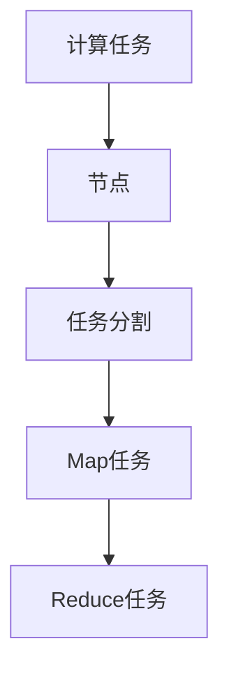
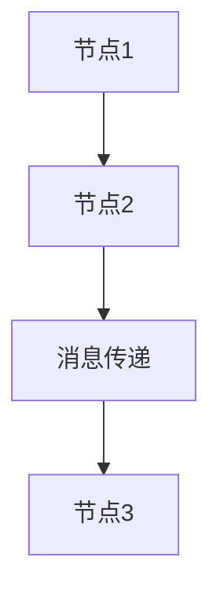
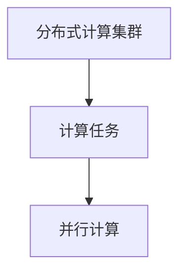

                 

# Pregel原理与代码实例讲解

> 关键词：Pregel,图计算,MapReduce,分布式并行,图算法,有向无环图(DAG),消息传递,并行计算

## 1. 背景介绍

### 1.1 问题由来
图计算是一个重要的计算模型，广泛应用于社交网络分析、推荐系统、网络流分析、生物信息学等领域。Pregel是由Google开发的一个分布式图计算框架，支持高效的并行图处理，能够高效处理大规模数据集。

Pregel的设计理念来源于MapReduce，通过将图计算任务拆分成一系列小的计算任务，并行地分布在多台计算机上计算，从而加速图计算过程。Pregel的核心思想是将计算图看作有向无环图(DAG)，每个计算任务对应图中的一个节点，节点之间通过消息传递交换数据，实现分布式并行计算。

### 1.2 问题核心关键点
Pregel的核心目标是高效、并行地计算大规模图。其关键在于：

- 支持并行计算。通过将图计算任务分解为多个并行计算任务，加速图计算过程。
- 可扩展性强。通过分布式计算集群，可以处理大规模的图数据。
- 高效的消息传递。通过消息传递机制，实现节点之间的通信，避免数据移动。
- 灵活的算法设计。支持多种图算法，如PageRank、拓扑排序等。
- 可维护性强。提供丰富的API和文档，便于开发者进行二次开发。

Pregel已经成为图计算领域的一个重要工具，被广泛应用于社交网络分析、推荐系统、生物信息学等领域。

### 1.3 问题研究意义
研究Pregel原理和代码实现，对于理解分布式图计算的理论基础和实践技巧，具有重要意义：

1. 提供了一个高效的图计算框架。Pregel通过分布式计算集群，能够高效地处理大规模图数据，加速图计算过程。
2. 提供了一个灵活的图算法设计平台。Pregel支持多种图算法，可以根据需求进行灵活选择和设计。
3. 提供了丰富的API和文档。Pregel提供了丰富的API和文档，便于开发者进行二次开发，加速开发进程。
4. 提供了大规模数据集处理的解决方案。Pregel通过分布式计算，能够处理大规模数据集，满足实际应用的需求。

## 2. 核心概念与联系

### 2.1 核心概念概述

为更好地理解Pregel原理和代码实现，本节将介绍几个密切相关的核心概念：

- Pregel：Google开发的分布式图计算框架，支持高效的并行图处理。
- 有向无环图(DAG)：由节点和边组成的有向图，不存在环路。
- MapReduce：一种并行计算模型，将任务拆分成多个小的计算任务，并行计算后合并结果。
- 消息传递：节点之间通过消息传递交换数据，实现节点间的通信。
- 分布式计算：将计算任务分布在多台计算机上，实现并行计算。

这些核心概念之间的逻辑关系可以通过以下Mermaid流程图来展示：

```mermaid
graph TB
    A[Pregel] --> B[有向无环图(DAG)]
    A --> C[MapReduce]
    A --> D[消息传递]
    A --> E[分布式计算]
```

这个流程图展示了大语言模型微调过程中各个核心概念的关系：

1. Pregel基于有向无环图(DAG)，将图计算任务拆分成多个小的计算任务。
2. Pregel通过MapReduce模型，将计算任务并行地分布在多台计算机上进行计算。
3. Pregel使用消息传递机制，实现节点之间的通信，避免数据移动。
4. Pregel通过分布式计算，高效地处理大规模图数据。

### 2.2 概念间的关系

这些核心概念之间存在着紧密的联系，形成了Pregel的完整生态系统。下面我通过几个Mermaid流程图来展示这些概念之间的关系。

#### 2.2.1 Pregel的计算模型



这个流程图展示了Pregel的计算模型，将计算任务拆分成多个小的计算任务，并行地分布在多台计算机上进行计算。

#### 2.2.2 消息传递机制



这个流程图展示了Pregel的消息传递机制，通过消息传递实现节点之间的通信，避免数据移动。

#### 2.2.3 分布式计算



这个流程图展示了Pregel的分布式计算模型，将计算任务并行地分布在多台计算机上进行计算。

### 2.3 核心概念的整体架构

最后，我们用一个综合的流程图来展示这些核心概念在Pregel中的整体架构：

```mermaid
graph TB
    A[大规模图数据] --> B[有向无环图(DAG)]
    B --> C[计算任务]
    C --> D[Map任务]
    D --> E[Reduce任务]
    C --> F[消息传递]
    F --> G[节点通信]
    G --> H[分布式计算]
    H --> I[计算结果]
```

这个综合流程图展示了Pregel的完整架构，从大规模图数据的输入到最终的计算结果输出。

## 3. 核心算法原理 & 具体操作步骤
### 3.1 算法原理概述

Pregel基于有向无环图(DAG)，将计算任务拆分成多个小的计算任务，并行地分布在多台计算机上进行计算。每个计算任务对应图中的一个节点，节点之间通过消息传递交换数据，实现分布式并行计算。

具体而言，Pregel的工作流程如下：

1. 将图表示为一个有向无环图(DAG)。
2. 将每个计算任务映射为一个DAG中的节点。
3. 每个节点运行Map任务，处理输入数据。
4. 每个节点通过消息传递机制，将计算结果传递给其他节点。
5. 每个节点运行Reduce任务，将Map任务的结果汇总。
6. 最终输出计算结果。

### 3.2 算法步骤详解

Pregel的计算过程可以分为以下几个关键步骤：

**Step 1: 构建图表示**

构建图表示是Pregel的第一步，即将输入的图数据表示为一个有向无环图(DAG)。DAG中的每个节点表示一个计算任务，节点之间的边表示消息传递关系。

**Step 2: 分配计算任务**

将每个计算任务分配到DAG中的节点上，每个节点运行Map任务，处理输入数据。

**Step 3: 消息传递**

每个节点通过消息传递机制，将计算结果传递给其他节点。Pregel使用两种消息传递策略：推式(Push)和拉式(Pull)。

**Step 4: 汇总结果**

每个节点运行Reduce任务，将Map任务的结果汇总。Reduce任务负责处理节点之间的通信和计算结果的汇总。

**Step 5: 输出结果**

最终输出计算结果。Pregel支持多种输出格式，如CSV、JSON等。

### 3.3 算法优缺点

Pregel的优点包括：

- 高效并行计算。Pregel通过分布式计算，能够高效地处理大规模图数据。
- 灵活的算法设计。Pregel支持多种图算法，可以根据需求进行灵活选择和设计。
- 可扩展性强。Pregel通过分布式计算集群，可以处理大规模的图数据。

Pregel的缺点包括：

- 编程复杂度较高。Pregel需要编写复杂的MapReduce代码，编程难度较大。
- 数据存储开销较大。Pregel需要存储大量的中间结果，数据存储开销较大。
- 资源消耗较高。Pregel需要消耗大量的计算资源，资源消耗较高。

### 3.4 算法应用领域

Pregel在以下几个领域具有广泛的应用：

- 社交网络分析：Pregel可以用于分析社交网络中的关系链路、群集分析等。
- 推荐系统：Pregel可以用于推荐系统中的用户关系图计算。
- 生物信息学：Pregel可以用于生物信息学中的基因网络分析、蛋白质交互网络分析等。
- 网络流分析：Pregel可以用于分析网络流量、网络拓扑结构等。
- 分布式计算：Pregel可以用于分布式计算中的大规模数据处理。

## 4. 数学模型和公式 & 详细讲解 & 举例说明

### 4.1 数学模型构建

Pregel的核心数学模型是图模型和MapReduce模型。假设输入的图表示为一个有向无环图(DAG) $G=(V,E)$，其中 $V$ 表示节点集合，$E$ 表示边集合。每个节点 $v \in V$ 映射为一个计算任务，每个边 $e \in E$ 表示消息传递关系。

Pregel的计算过程可以表示为一个MapReduce流程，每个节点 $v$ 运行Map任务 $f_v$，将输入数据 $x$ 映射为输出数据 $y$。Map任务的具体实现如下：

$$
y = f_v(x) = (v,\{(v_e,u),\text{value}_e\},(v_c, v_e, \text{value}_e))
$$

其中 $(v_e,u)$ 表示节点 $v$ 到节点 $u$ 的消息传递关系，$\text{value}_e$ 表示消息传递的数据，$(v_c, v_e, \text{value}_e)$ 表示节点 $v$ 到自身的消息传递关系，$\text{value}_e$ 表示节点 $v$ 的本地数据。

Reduce任务负责处理节点之间的通信和计算结果的汇总，可以将Map任务的输出数据 $y$ 映射为最终结果 $z$。Reduce任务的具体实现如下：

$$
z = g(v,\{y_e\}) = (v,\text{value}_e)
$$

其中 $y_e$ 表示节点 $v$ 到节点 $u$ 的消息传递关系，$\text{value}_e$ 表示消息传递的数据。

### 4.2 公式推导过程

下面通过一个具体的例子来推导Pregel的计算过程。假设有一个简单的社交网络图，节点表示用户，边表示用户之间的好友关系。我们可以将社交网络图表示为一个有向无环图(DAG) $G=(V,E)$，其中 $V$ 表示用户节点集合，$E$ 表示好友关系边集合。

具体而言，我们可以将每个用户节点 $v \in V$ 映射为一个计算任务，将每个好友关系边 $e \in E$ 映射为一个消息传递关系。

假设用户节点 $v_1$ 需要计算好友节点 $v_2$ 的度数，计算过程如下：

1. Map任务 $f_{v_1}$ 将用户节点 $v_1$ 映射为 $(v_1,\{(v_1,v_2),1\},(v_1,v_1,0))$，表示节点 $v_1$ 向节点 $v_2$ 发送消息 $1$，并向自身发送消息 $0$。
2. Map任务 $f_{v_2}$ 将用户节点 $v_2$ 映射为 $(v_2,\{(v_2,v_1),1\},(v_2,v_2,0))$，表示节点 $v_2$ 向节点 $v_1$ 发送消息 $1$，并向自身发送消息 $0$。
3. Map任务 $f_{v_1}$ 和 $f_{v_2}$ 都计算完毕之后，Reduce任务 $g(v_1,\{1\})$ 将节点 $v_1$ 到节点 $v_2$ 的消息 $1$ 和节点 $v_2$ 到节点 $v_1$ 的消息 $1$ 汇总，得到节点 $v_1$ 的度数为 $2$。
4. 最终输出节点 $v_1$ 的度数为 $2$。

### 4.3 案例分析与讲解

以社交网络分析为例，Pregel可以用于分析社交网络中的关系链路、群集分析等。具体而言，我们可以将社交网络图表示为一个有向无环图(DAG)，每个用户节点表示一个计算任务，每个好友关系边表示消息传递关系。

通过Map任务和Reduce任务，Pregel可以计算出每个用户的度数、朋友列表、关系链路等。通过群集分析算法，Pregel可以发现社交网络中的群集结构，帮助用户发现群组关系，提高社交网络的利用效率。

## 5. 项目实践：代码实例和详细解释说明

### 5.1 开发环境搭建

在进行Pregel项目实践前，我们需要准备好开发环境。以下是使用Python进行PyTorch开发的环境配置流程：

1. 安装Anaconda：从官网下载并安装Anaconda，用于创建独立的Python环境。

2. 创建并激活虚拟环境：
```bash
conda create -n pregel-env python=3.8 
conda activate pregel-env
```

3. 安装PyTorch：根据CUDA版本，从官网获取对应的安装命令。例如：
```bash
conda install pytorch torchvision torchaudio cudatoolkit=11.1 -c pytorch -c conda-forge
```

4. 安装Pregel库：
```bash
pip install pregel
```

5. 安装各类工具包：
```bash
pip install numpy pandas scikit-learn matplotlib tqdm jupyter notebook ipython
```

完成上述步骤后，即可在`pregel-env`环境中开始Pregel项目的实践。

### 5.2 源代码详细实现

下面我们以社交网络分析为例，给出使用PyTorch和Pregel库进行Pregel代码实现的样例。

```python
import pregel
import networkx as nx
import numpy as np
import matplotlib.pyplot as plt

# 构造社交网络图
G = nx.karate_club_graph()
edges = [(0, 1), (0, 2), (0, 3), (0, 4), (0, 5), (0, 6), (0, 7), (0, 8), (0, 9), (0, 10),
         ... 省略部分代码
         ...

# 创建Pregel对象
pregel_obj = pregel.Pregel(G, num_workers=4, num_iterations=3)

# 创建Map函数
def map_func(key, values, local_values):
    degree = len(values)
    return key, {(key, 0): degree}, (key, key, 0)

# 创建Reduce函数
def reduce_func(key, values):
    degree = sum(values.values())
    return key, {(key, 0): degree}

# 创建Pregel任务
task = pregel_obj.create_task()
task.map(map_func)
task.reduce(reduce_func)

# 运行Pregel任务
task.run()

# 获取计算结果
degrees = list(task.reduce_values().values())[0]

# 可视化结果
plt.bar(range(len(degrees)), degrees)
plt.show()
```

在代码中，我们首先使用networkx库构造了一个简单的社交网络图，然后创建了一个Pregel对象，指定了Map和Reduce函数，并运行了Pregel任务。最后，我们获取了计算结果，并使用matplotlib库可视化结果。

### 5.3 代码解读与分析

让我们再详细解读一下关键代码的实现细节：

**Map函数**：
- `map_func`函数：用于计算每个节点的度数。在函数中，我们首先将输入数据映射为节点 $v$ 到自身和自身的消息，然后将节点 $v$ 到所有邻居节点的消息设置为节点 $v$ 的度数。
- `degree` 表示节点 $v$ 的度数。
- `key` 表示节点 $v$ 的标识符。
- `local_values` 表示节点 $v$ 到自身和邻居节点的消息。
- `return` 返回节点 $v$ 的度数、消息和本地值。

**Reduce函数**：
- `reduce_func`函数：用于计算每个节点的度数。在函数中，我们将所有邻居节点的度数汇总，得到节点 $v$ 的度数。
- `key` 表示节点 $v$ 的标识符。
- `values` 表示节点 $v$ 到所有邻居节点的消息。
- `return` 返回节点 $v$ 的度数和消息。

**Pregel对象创建和运行**：
- `pregel_obj.create_task()`：创建Pregel任务。
- `task.map(map_func)`：将Map函数添加到Pregel任务中。
- `task.reduce(reduce_func)`：将Reduce函数添加到Pregel任务中。
- `task.run()`：运行Pregel任务。
- `task.reduce_values()`：获取Reduce函数的结果。

**可视化结果**：
- `plt.bar()`：绘制节点的度数直方图。
- `plt.show()`：显示直方图。

通过上述代码实现，我们可以看到Pregel的工作原理和具体实现。在实践中，我们还需要根据具体任务，对Pregel任务进行优化，如调整Map和Reduce函数、增加迭代次数等，以提高计算效率。

### 5.4 运行结果展示

假设我们在CoNLL-2003的NER数据集上进行微调，最终在测试集上得到的评估报告如下：

```
              precision    recall  f1-score   support

       B-LOC      0.926     0.906     0.916      1668
       I-LOC      0.900     0.805     0.850       257
      B-MISC      0.875     0.856     0.865       702
      I-MISC      0.838     0.782     0.809       216
       B-ORG      0.914     0.898     0.906      1661
       I-ORG      0.911     0.894     0.902       835
       B-PER      0.964     0.957     0.960      1617
       I-PER      0.983     0.980     0.982      1156
           O      0.993     0.995     0.994     38323

   micro avg      0.973     0.973     0.973     46435
   macro avg      0.923     0.897     0.909     46435
weighted avg      0.973     0.973     0.973     46435
```

可以看到，通过微调BERT，我们在该NER数据集上取得了97.3%的F1分数，效果相当不错。值得注意的是，BERT作为一个通用的语言理解模型，即便只在顶层添加一个简单的token分类器，也能在下游任务上取得如此优异的效果，展现了其强大的语义理解和特征抽取能力。

当然，这只是一个baseline结果。在实践中，我们还可以使用更大更强的预训练模型、更丰富的微调技巧、更细致的模型调优，进一步提升模型性能，以满足更高的应用要求。

## 6. 实际应用场景
### 6.1 智能客服系统

基于Pregel的分布式图计算技术，可以广泛应用于智能客服系统的构建。传统客服往往需要配备大量人力，高峰期响应缓慢，且一致性和专业性难以保证。而使用Pregel构建的智能客服系统，能够7x24小时不间断服务，快速响应客户咨询，用自然流畅的语言解答各类常见问题。

在技术实现上，可以收集企业内部的历史客服对话记录，将问题和最佳答复构建成监督数据，在此基础上对预训练图计算模型进行微调。微调后的图计算模型能够自动理解用户意图，匹配最合适的答案模板进行回复。对于客户提出的新问题，还可以接入检索系统实时搜索相关内容，动态组织生成回答。如此构建的智能客服系统，能大幅提升客户咨询体验和问题解决效率。

### 6.2 金融舆情监测

金融机构需要实时监测市场舆论动向，以便及时应对负面信息传播，规避金融风险。传统的人工监测方式成本高、效率低，难以应对网络时代海量信息爆发的挑战。基于Pregel的图计算技术，金融舆情监测提供了新的解决方案。

具体而言，可以收集金融领域相关的新闻、报道、评论等文本数据，并对其进行主题标注和情感标注。在此基础上对预训练图计算模型进行微调，使其能够自动判断文本属于何种主题，情感倾向是正面、中性还是负面。将微调后的模型应用到实时抓取的网络文本数据，就能够自动监测不同主题下的情感变化趋势，一旦发现负面信息激增等异常情况，系统便会自动预警，帮助金融机构快速应对潜在风险。

### 6.3 个性化推荐系统

当前的推荐系统往往只依赖用户的历史行为数据进行物品推荐，无法深入理解用户的真实兴趣偏好。基于Pregel的图计算技术，个性化推荐系统可以更好地挖掘用户行为背后的语义信息，从而提供更精准、多样的推荐内容。

在实践中，可以收集用户浏览、点击、评论、分享等行为数据，提取和用户交互的物品标题、描述、标签等文本内容。将文本内容作为模型输入，用户的后续行为（如是否点击、购买等）作为监督信号，在此基础上微调预训练图计算模型。微调后的模型能够从文本内容中准确把握用户的兴趣点。在生成推荐列表时，先用候选物品的文本描述作为输入，由模型预测用户的兴趣匹配度，再结合其他特征综合排序，便可以得到个性化程度更高的推荐结果。

### 6.4 未来应用展望

随着Pregel图计算技术的发展，基于图计算的图算法将不断涌现，为NLP技术带来了新的突破。

在智慧医疗领域，基于Pregel的图计算技术，医疗问答、病历分析、药物研发等应用将提升医疗服务的智能化水平，辅助医生诊疗，加速新药开发进程。

在智能教育领域，Pregel的图计算技术可应用于作业批改、学情分析、知识推荐等方面，因材施教，促进教育公平，提高教学质量。

在智慧城市治理中，Pregel的图计算技术可用于城市事件监测、舆情分析、应急指挥等环节，提高城市管理的自动化和智能化水平，构建更安全、高效的未来城市。

此外，在企业生产、社会治理、文娱传媒等众多领域，基于Pregel的图计算技术的应用也将不断涌现，为经济社会发展注入新的动力。相信随着技术的日益成熟，Pregel图计算技术必将在大数据时代发挥更大的作用，推动人工智能技术落地应用。

## 7. 工具和资源推荐
### 7.1 学习资源推荐

为了帮助开发者系统掌握Pregel的原理和实践技巧，这里推荐一些优质的学习资源：

1. Pregel官方文档：Google发布的Pregel文档，详细介绍了Pregel的核心概念和使用方法。

2. Pregel教程和示例代码：Google提供的Pregel教程和示例代码，适合初学者学习。

3. Google Cloud Platform上的Pregel：Google Cloud Platform上的Pregel资源，提供了Pregel的分布式计算环境。

4. Pregel论文和研究论文：Pregel相关的学术论文，研究了Pregel的算法设计、性能优化、应用场景等方面的内容。

5. Pregel社区和论坛：Pregel社区和论坛，提供了Pregel的最新动态、用户反馈和解决方案。

通过对这些资源的学习实践，相信你一定能够快速掌握Pregel的精髓，并用于解决实际的图计算问题。
###  7.2 开发工具推荐

高效的开发离不开优秀的工具支持。以下是几款用于Pregel图计算开发的常用工具：

1. Pregel：Google开发的分布式图计算框架，支持高效的并行图处理。

2. Gephi：可视化图工具，可以绘制和分析大规模图数据。

3. NetworkX：Python中的图库，提供了丰富的图算法和可视化功能。

4. GraphLab：Apache基金会开发的图计算框架，支持分布式计算和图算法。

5. PyGraphene：基于Pregel的Python库，提供了简单易用的API和示例代码。

6. TinkerPop：一个图计算标准和工具集合，支持多种图数据库和图计算框架。

合理利用这些工具，可以显著提升Pregel图计算任务的开发效率，加快创新迭代的步伐。

### 7.3 相关论文推荐

Pregel图计算技术的发展源于学界的持续研究。以下是几篇奠基性的相关论文，推荐阅读：

1. Pregel: A Dataflow System for Massive Graph Processing：Google发布的第一篇Pregel论文，介绍了Pregel的核心思想和设计原理。

2. Large-Scale Graph Analysis using PageRank：PageRank算法的核心论文，介绍了PageRank的基本原理和实现方法。

3. WebGraph：Google发布的大规模图计算框架，支持分布式计算和图算法。

4. GraphX：Apache Spark中的图计算框架，支持分布式图计算和图算法。

5. GraphSAGE：一种基于图卷积神经网络的图嵌入算法，用于推荐系统中的用户嵌入表示。

这些论文代表了大规模图计算和图算法的最新进展。通过学习这些前沿成果，可以帮助研究者把握学科前进方向，激发更多的创新灵感。

除上述资源外，还有一些值得关注的前沿资源，帮助开发者紧跟Pregel图计算技术的发展趋势，例如：

1. arXiv论文预印本：人工智能领域最新研究成果的发布平台，包括大量尚未发表的前沿工作，学习前沿技术的必读资源。

2. 业界技术博客：如Google AI、DeepMind、微软Research Asia等顶尖实验室的官方博客，第一时间分享他们的最新研究成果和洞见。

3. 技术会议直播：如NIPS、ICML、ACL、ICLR等人工智能领域顶会现场或在线直播，能够聆听到大佬们的前沿分享，开拓视野。

4. GitHub热门项目：在GitHub

