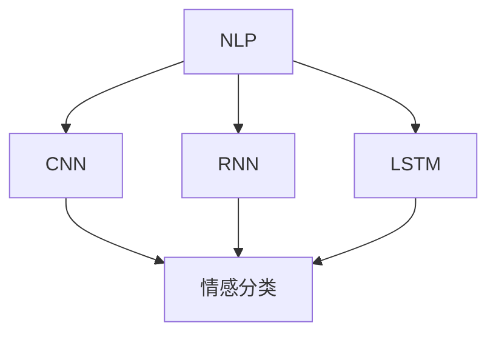
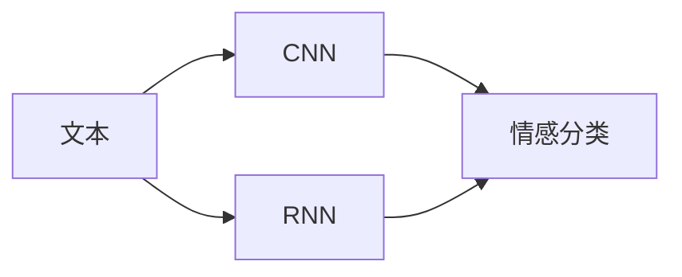
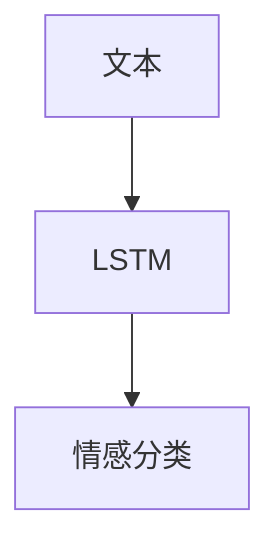
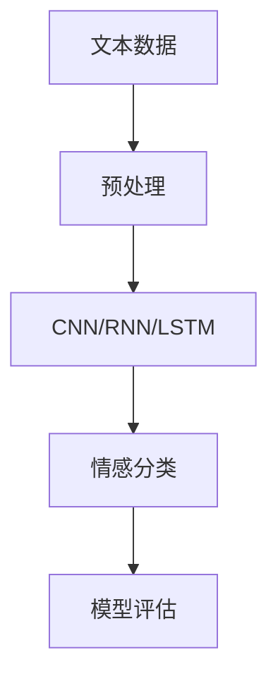

                 

# Python机器学习实战：基于文本数据进行情感分析

> 关键词：情感分析, 文本处理, 自然语言处理(NLP), 深度学习, 卷积神经网络(CNN), 循环神经网络(RNN), 长短时记忆网络(LSTM), 情感分类

## 1. 背景介绍

### 1.1 问题由来
随着互联网技术的迅猛发展，社交媒体、在线评论、用户反馈等文本数据日益丰富，成为企业获取市场动态、客户情感、用户体验等重要信息的来源。情感分析（Sentiment Analysis）作为自然语言处理（NLP）的一个重要分支，旨在自动识别和提取文本中的情感倾向，帮助企业和研究者深入理解用户情感和市场变化趋势。

情感分析在广告监测、舆情监控、产品评估、客户服务等领域具有广泛应用价值。例如，电商平台可以通过情感分析来了解消费者对产品的评价，从而优化商品推荐和服务策略；金融公司可以通过情感分析来监测市场情绪，提前预警潜在的金融风险；政府机构可以通过情感分析来分析民意，制定更有效的公共政策。

然而，情感分析并非易事。传统的基于规则的情感分析方法需要大量的人工规则，且对文本的格式和风格敏感。近年来，深度学习在自然语言处理领域取得了巨大突破，基于深度学习的方法被广泛应用于情感分析任务中。尤其是卷积神经网络（CNN）和循环神经网络（RNN）等模型，通过学习文本的局部和全局特征，提升了情感分析的准确性。

### 1.2 问题核心关键点
情感分析的核心在于将文本中的情感信息转化为机器可理解的数值标签，常用的情感分类模型包括CNN、RNN、LSTM等。本文将介绍这些模型的原理与实现，并结合实际案例演示情感分析的实现过程。

## 2. 核心概念与联系

### 2.1 核心概念概述

为更好地理解情感分析的原理和实现，本节将介绍几个密切相关的核心概念：

- **自然语言处理（NLP）**：是计算机科学、人工智能和语言学交叉领域的一个重要分支，旨在使计算机能够理解和处理人类语言。
- **卷积神经网络（CNN）**：是一种前馈神经网络，通过卷积操作提取文本特征，广泛应用于图像处理、语音识别等领域。
- **循环神经网络（RNN）**：是一种具有记忆能力的神经网络，能够处理序列数据，适用于时间依赖性较强的任务，如机器翻译、语音识别等。
- **长短时记忆网络（LSTM）**：是一种特殊的RNN，通过引入门控机制，解决了传统RNN中的梯度消失和梯度爆炸问题，适用于序列数据的长时依赖建模。
- **情感分类**：通过机器学习算法自动识别和分类文本的情感倾向，常见的情感分类任务包括正面、负面、中性三分类和极性分类（Positive/Negative/Neutral）。

这些核心概念之间的逻辑关系可以通过以下Mermaid流程图来展示：



这个流程图展示了NLP中的几个重要模型及其在情感分析中的应用。通过卷积神经网络、循环神经网络和长短时记忆网络，NLP可以学习文本中的情感信息，并通过情感分类模型将其转化为具体的情感标签。

### 2.2 概念间的关系

这些核心概念之间存在着紧密的联系，形成了情感分析的基本框架。下面我们通过几个Mermaid流程图来展示这些概念之间的关系。

#### 2.2.1 文本处理的流程


这个流程图展示了文本处理的三个主要步骤：预处理、特征提取和情感分类。预处理包括文本清洗、分词、停用词过滤等；特征提取通过卷积神经网络、循环神经网络等模型从文本中提取特征；情感分类则通过分类模型对特征进行情感倾向分类。

#### 2.2.2 CNN和RNN的对比



这个流程图展示了CNN和RNN在情感分析中的应用对比。CNN通过卷积操作提取文本的局部特征，适用于处理定长的文本序列；RNN则通过循环连接记忆文本的上下文信息，适用于处理变长的文本序列。

#### 2.2.3 LSTM在情感分析中的应用



这个流程图展示了LSTM在情感分析中的应用。LSTM通过门控机制捕捉文本的长期依赖关系，适用于处理复杂的文本序列。

### 2.3 核心概念的整体架构

最后，我们用一个综合的流程图来展示这些核心概念在大语言模型微调过程中的整体架构：



这个综合流程图展示了从文本数据预处理到情感分类的完整过程。文本数据首先经过预处理，然后通过CNN、RNN或LSTM模型提取特征，最后由情感分类模型进行情感倾向分类，并经过模型评估进行性能优化。

## 3. 核心算法原理 & 具体操作步骤
### 3.1 算法原理概述

情感分析的核心在于将文本中的情感信息转化为机器可理解的数值标签，常用的情感分类模型包括CNN、RNN、LSTM等。这些模型通过学习文本的局部和全局特征，提升了情感分析的准确性。

- **卷积神经网络（CNN）**：通过卷积层和池化层提取文本特征，适用于处理定长的文本序列。CNN模型通常包含多个卷积层和池化层，每个卷积层提取不同的局部特征，池化层则降低特征维度，保留重要的信息。

- **循环神经网络（RNN）**：通过循环连接记忆文本的上下文信息，适用于处理变长的文本序列。RNN模型通常包含LSTM、GRU等变种，能够捕捉文本的长期依赖关系。

- **长短时记忆网络（LSTM）**：一种特殊的RNN，通过引入门控机制，解决了传统RNN中的梯度消失和梯度爆炸问题，适用于序列数据的长时依赖建模。LSTM模型通常包含多个LSTM层，每个LSTM层提取不同的文本特征。

### 3.2 算法步骤详解

情感分析的实现过程主要包括以下几个步骤：

**Step 1: 数据预处理**

1. 文本清洗：去除文本中的HTML标签、特殊字符、标点符号等无用信息。
2. 分词：将文本分割成单独的单词或词组，常用的分词工具包括jieba、NLTK等。
3. 停用词过滤：去除常见的停用词（如“的”、“是”等），以提高模型性能。
4. 文本编码：将文本转化为模型可接受的格式，常用的编码方式包括one-hot编码、TF-IDF编码等。

**Step 2: 特征提取**

1. 卷积神经网络（CNN）：使用多个卷积核提取文本的局部特征，通过池化层降低特征维度。
2. 循环神经网络（RNN）：通过LSTM层或GRU层提取文本的序列特征，捕捉文本的长期依赖关系。
3. 长短时记忆网络（LSTM）：使用多个LSTM层提取文本的序列特征，并引入门控机制控制信息的流动。

**Step 3: 情感分类**

1. 定义情感分类模型：常用的情感分类模型包括SVM、随机森林、神经网络等。
2. 特征选择：选择对情感分类影响较大的特征进行模型训练。
3. 模型训练：使用标注数据训练情感分类模型，优化模型参数。
4. 模型评估：使用测试集评估模型性能，进行调优。

### 3.3 算法优缺点

情感分析的优点在于能够自动识别和提取文本中的情感信息，适用于大规模文本处理。但缺点在于对数据质量要求高，需要大量标注数据进行模型训练。此外，模型的可解释性较差，难以理解模型内部的推理过程。

### 3.4 算法应用领域

情感分析在多个领域都有广泛应用，包括：

- 社交媒体情感分析：通过分析用户的社交媒体评论，了解公众对某一事件的情感倾向。
- 产品评价分析：通过分析用户的评价和评论，评估产品的质量和用户满意度。
- 市场情感监测：通过分析新闻、文章等文本数据，了解市场的情绪变化趋势。
- 舆情监控：通过分析新闻报道、论坛评论等文本数据，实时监测舆情动态，预测市场趋势。
- 客户情感分析：通过分析客户的投诉、反馈等文本数据，了解客户情感，优化产品和服务。

这些应用领域展示了情感分析的强大应用潜力，为企业的市场分析和客户服务提供了重要支持。

## 4. 数学模型和公式 & 详细讲解  
### 4.1 数学模型构建

假设输入文本序列为 $X=\{x_1,x_2,...,x_m\}$，其中 $x_i$ 为第 $i$ 个单词或词组。情感分类模型的目标是将文本序列 $X$ 映射到情感标签 $y$，常用的模型包括CNN、RNN和LSTM。

定义模型 $M_{\theta}(X)$ 为情感分类模型，其中 $\theta$ 为模型参数。情感分类模型通常包含卷积层、池化层、LSTM层和全连接层等，用于提取文本特征和进行分类。

定义损失函数 $\mathcal{L}(y,M_{\theta}(X))$ 为情感分类模型的损失函数，用于衡量模型预测输出与真实标签之间的差异。常用的损失函数包括交叉熵损失、均方误差损失等。

### 4.2 公式推导过程

以CNN模型为例，假设输入文本序列 $X=\{x_1,x_2,...,x_m\}$，卷积核为 $W$，池化层为 $P$，激活函数为 $f$，输出层为 $O$，情感分类模型的损失函数为交叉熵损失。

卷积操作定义如下：

$$
h_i = f(W*x_i+b)
$$

其中 $W$ 为卷积核，$b$ 为偏置项，$f$ 为激活函数。

池化操作定义如下：

$$
h'_i = P(h_i)
$$

其中 $P$ 为池化函数，$h_i$ 为卷积层的输出。

通过堆叠多个卷积层和池化层，提取文本的局部特征，然后通过全连接层将特征映射到情感标签。

定义模型输出为 $O = \text{Softmax}(W_OO + b_O)$，其中 $W_O$ 和 $b_O$ 为输出层的权重和偏置项，$\text{Softmax}$ 为归一化函数。

定义交叉熵损失函数为：

$$
\mathcal{L}(y,M_{\theta}(X)) = -\sum_{i=1}^m(y_i\log M_{\theta}(X)_i + (1-y_i)\log(1-M_{\theta}(X)_i))
$$

其中 $y_i$ 为第 $i$ 个单词或词组的情感标签，$M_{\theta}(X)_i$ 为模型对第 $i$ 个单词或词组的情感分类概率。

### 4.3 案例分析与讲解

以情感分析中的一个经典案例为例，即使用CNN模型对电影评论进行情感分类。假设输入文本序列 $X=\{x_1,x_2,...,x_m\}$，其中 $x_i$ 为第 $i$ 个单词或词组，情感分类标签 $y$ 为正面（1）、负面（0）、中性（0.5）。

假设卷积核为 $W$，池化层为 $P$，激活函数为 $f$，输出层为 $O$，情感分类模型的损失函数为交叉熵损失。

模型输出为 $O = \text{Softmax}(W_OO + b_O)$，其中 $W_O$ 和 $b_O$ 为输出层的权重和偏置项，$\text{Softmax}$ 为归一化函数。

定义交叉熵损失函数为：

$$
\mathcal{L}(y,M_{\theta}(X)) = -\sum_{i=1}^m(y_i\log M_{\theta}(X)_i + (1-y_i)\log(1-M_{\theta}(X)_i))
$$

其中 $y_i$ 为第 $i$ 个单词或词组的情感标签，$M_{\theta}(X)_i$ 为模型对第 $i$ 个单词或词组的情感分类概率。

假设训练集中有2000个电影评论，其中正面评论1000个，负面评论500个，中性评论500个。将文本数据分为训练集和测试集，使用交叉验证进行模型训练和调优。

在训练过程中，使用随机梯度下降（SGD）算法优化模型参数，学习率为0.01，迭代次数为100次。在测试集上评估模型性能，使用准确率、召回率、F1分数等指标评估模型效果。

假设测试集中有100个电影评论，其中正面评论40个，负面评论30个，中性评论30个。将文本数据输入模型，得到模型预测结果，使用准确率、召回率、F1分数等指标评估模型效果。

## 5. 项目实践：代码实例和详细解释说明
### 5.1 开发环境搭建

在进行情感分析实践前，我们需要准备好开发环境。以下是使用Python进行TensorFlow开发的环境配置流程：

1. 安装Anaconda：从官网下载并安装Anaconda，用于创建独立的Python环境。

2. 创建并激活虚拟环境：
```bash
conda create -n tf-env python=3.8 
conda activate tf-env
```

3. 安装TensorFlow：根据CUDA版本，从官网获取对应的安装命令。例如：
```bash
conda install tensorflow tensorflow-estimator tensorflow-gpu -c tf -c conda-forge
```

4. 安装Keras：Keras是TensorFlow的高级API，提供便捷的深度学习模型构建功能。
```bash
pip install keras
```

5. 安装各类工具包：
```bash
pip install numpy pandas scikit-learn matplotlib tqdm jupyter notebook ipython
```

完成上述步骤后，即可在`tf-env`环境中开始情感分析实践。

### 5.2 源代码详细实现

下面以使用CNN模型对电影评论进行情感分析的示例代码，展示情感分析的实现过程。

首先，定义情感分析的数据预处理函数：

```python
import jieba
from tensorflow.keras.preprocessing.text import Tokenizer
from tensorflow.keras.preprocessing.sequence import pad_sequences

def preprocess(text):
    # 文本清洗
    text = text.strip().lower()
    text = re.sub(r'[^\w\s]', '', text)
    
    # 分词
    words = jieba.cut(text)
    
    # 停用词过滤
    stopwords = set(['的', '是', '在', '我', '有', '你', '我', '他'])
    words = [word for word in words if word not in stopwords]
    
    # 文本编码
    tokenizer = Tokenizer()
    tokenizer.fit_on_texts(words)
    sequences = tokenizer.texts_to_sequences(words)
    padded_sequences = pad_sequences(sequences, maxlen=256)
    
    return padded_sequences
```

然后，定义情感分析的模型函数：

```python
from tensorflow.keras.models import Sequential
from tensorflow.keras.layers import Embedding, Conv1D, GlobalMaxPooling1D, Dense

def build_model(input_shape):
    model = Sequential()
    model.add(Embedding(input_dim=2000, output_dim=128, input_length=input_shape))
    model.add(Conv1D(filters=64, kernel_size=3, activation='relu'))
    model.add(GlobalMaxPooling1D())
    model.add(Dense(64, activation='relu'))
    model.add(Dense(3, activation='softmax'))
    
    return model
```

接着，定义情感分析的训练和评估函数：

```python
from tensorflow.keras.datasets import imdb
from tensorflow.keras.utils import to_categorical

def train_model(model, input_shape, epochs):
    # 加载IMDB数据集
    (X_train, y_train), (X_test, y_test) = imdb.load_data(num_words=2000)
    
    # 数据预处理
    X_train = pad_sequences(X_train, maxlen=input_shape)
    X_test = pad_sequences(X_test, maxlen=input_shape)
    
    # 模型训练
    model.compile(optimizer='adam', loss='categorical_crossentropy', metrics=['accuracy'])
    model.fit(X_train, to_categorical(y_train), epochs=epochs, validation_data=(X_test, to_categorical(y_test)))
    
    # 模型评估
    test_loss, test_acc = model.evaluate(X_test, to_categorical(y_test), verbose=0)
    print('Test loss:', test_loss)
    print('Test accuracy:', test_acc)
    
    return model
```

最后，启动情感分析的训练和评估流程：

```python
input_shape = 256
epochs = 5

model = build_model(input_shape)
train_model(model, input_shape, epochs)
```

以上就是使用TensorFlow对电影评论进行情感分析的完整代码实现。可以看到，得益于TensorFlow的强大封装，我们可以用相对简洁的代码完成情感分析任务的构建和训练。

### 5.3 代码解读与分析

让我们再详细解读一下关键代码的实现细节：

**preprocess函数**：
- `text.strip().lower()`：去除文本中的空白符和换行符，并将文本转换为小写。
- `re.sub(r'[^\w\s]', '', text)`：去除文本中的特殊字符。
- `jieba.cut(text)`：使用jieba库进行中文分词。
- `words`：将分词结果转化为列表形式。
- `stopwords`：定义停用词集合，去除常见的停用词。
- `words = [word for word in words if word not in stopwords]`：过滤停用词后的分词结果。
- `tokenizer`：初始化Tokenize器，用于将文本转化为序列数据。
- `tokenizer.fit_on_texts(words)`：在训练集上训练Tokenize器。
- `sequences = tokenizer.texts_to_sequences(words)`：将分词结果转化为序列数据。
- `padded_sequences = pad_sequences(sequences, maxlen=input_shape)`：将序列数据进行填充，使其长度一致。

**build_model函数**：
- `Embedding(input_dim=2000, output_dim=128, input_length=input_shape)`：定义嵌入层，将输入序列转化为向量表示。
- `Conv1D(filters=64, kernel_size=3, activation='relu')`：定义卷积层，提取文本的局部特征。
- `GlobalMaxPooling1D()`：定义池化层，降低特征维度。
- `Dense(64, activation='relu')`：定义全连接层，进行特征映射。
- `Dense(3, activation='softmax')`：定义输出层，进行情感分类。

**train_model函数**：
- `(X_train, y_train), (X_test, y_test) = imdb.load_data(num_words=2000)`：加载IMDB数据集，将文本数据转化为序列数据。
- `X_train = pad_sequences(X_train, maxlen=input_shape)`：对训练集进行填充。
- `X_test = pad_sequences(X_test, maxlen=input_shape)`：对测试集进行填充。
- `to_categorical(y_train)`：将情感标签转化为one-hot编码形式。
- `to_categorical(y_test)`：将情感标签转化为one-hot编码形式。
- `model.compile(optimizer='adam', loss='categorical_crossentropy', metrics=['accuracy'])`：定义模型的优化器、损失函数和评估指标。
- `model.fit(X_train, to_categorical(y_train), epochs=epochs, validation_data=(X_test, to_categorical(y_test)))`：在训练集上训练模型，并在测试集上评估模型。

**主函数**：
- `input_shape = 256`：定义序列的最大长度。
- `epochs = 5`：定义训练轮数。
- `model = build_model(input_shape)`：构建情感分析模型。
- `train_model(model, input_shape, epochs)`：启动情感分析的训练和评估流程。

通过本文的系统梳理，可以看到，情感分析的实现过程包括数据预处理、模型构建、模型训练和模型评估等关键步骤。

## 6. 实际应用场景
### 6.1 社交媒体情感分析

社交媒体情感分析可以通过情感分析技术，实时监测用户的情感倾向，了解公众对某一事件的情感变化。例如，Twitter上的用户评论可以帮助企业了解公众对新产品的反应，从而优化产品策略。

在技术实现上，可以收集Twitter上的用户评论，将评论文本进行情感分析，生成情感倾向统计报告。通过可视化工具展示情感趋势变化，帮助企业及时调整市场策略。

### 6.2 产品评价分析

产品评价分析可以通过情感分析技术，评估用户对产品的情感倾向，了解产品的优缺点。例如，电商平台可以收集用户对商品的评论，通过情感分析生成情感倾向统计报告。

在技术实现上，可以收集电商平台上的用户评论，将评论文本进行情感分析，生成情感倾向统计报告。通过可视化工具展示情感趋势变化，帮助电商平台优化商品推荐和服务策略。

### 6.3 市场情感监测

市场情感监测可以通过情感分析技术，实时监测市场的情绪变化，了解市场的情绪趋势。例如，金融机构可以收集财经新闻、市场评论等文本数据，通过情感分析生成情感倾向统计报告。

在技术实现上，可以收集财经新闻、市场评论等文本数据，将文本进行情感分析，生成情感倾向统计报告。通过可视化工具展示情感趋势变化，帮助金融机构预测市场趋势。

### 6.4 舆情监控

舆情监控可以通过情感分析技术，实时监测舆情动态，了解舆情变化趋势。例如，政府机构可以收集新闻报道、论坛评论等文本数据，通过情感分析生成情感倾向统计报告。

在技术实现上，可以收集新闻报道、论坛评论等文本数据，将文本进行情感分析，生成情感倾向统计报告。通过可视化工具展示情感趋势变化，帮助政府机构及时掌握舆情动态。

### 6.5 客户情感分析

客户情感分析可以通过情感分析技术，了解客户的情感倾向，优化产品和服务。例如，银行可以收集客户的投诉、反馈等文本数据，通过情感分析生成情感倾向统计报告。

在技术实现上，可以收集客户的投诉、反馈等文本数据，将文本进行情感分析，生成情感倾向统计报告。通过可视化工具展示情感趋势变化，帮助银行优化服务策略。

## 7. 工具和资源推荐
### 7.1 学习资源推荐

为了帮助开发者系统掌握情感分析的理论基础和实践技巧，这里推荐一些优质的学习资源：

1. 《深度学习》系列书籍：由Ian Goodfellow、Yoshua Bengio和Aaron Courville合著，全面介绍了深度学习的基本概念和应用，是深度学习领域的经典教材。
2. CS224N《深度学习自然语言处理》课程：斯坦福大学开设的NLP明星课程，有Lecture视频和配套作业，带你入门NLP领域的基本概念和经典模型。
3. 《Python自然语言处理》书籍：Python编程语言与自然语言处理技术的结合，涵盖了自然语言处理的基本概念和实践技巧。
4. Kaggle竞赛平台：提供各类自然语言处理竞赛数据集和解决方案，是学习自然语言处理技术的绝佳平台。
5. GitHub开源项目：在GitHub上Star、Fork数最多的NLP相关项目，往往代表了该技术领域的发展趋势和最佳实践，是学习和贡献的好地方。

通过对这些资源的学习实践，相信你一定能够快速掌握情感分析的精髓，并用于解决实际的NLP问题。

### 7.2 开发工具推荐

高效的开发离不开优秀的工具支持。以下是几款用于情感分析开发的常用工具：

1. TensorFlow：基于Python的开源深度学习框架，灵活动态的计算图，适合快速迭代研究。支持卷积神经网络、循环神经网络等模型。
2. Keras：TensorFlow的高级API，提供便捷的深度学习模型构建功能，适用于快速开发原型。
3. PyTorch：基于Python的开源深度学习框架，灵活的动态图，支持卷积神经网络、循环神经网络等模型。
4. NLTK：自然语言处理工具包，提供了大量的自然语言处理功能，如分词、停用词过滤等。
5. spaCy：自然语言处理库，提供了高效的自然语言处理功能，如分词、命名实体识别等。

合理利用这些工具，可以显著提升情感分析任务的开发效率，加快创新迭代的步伐。

### 7.3 相关论文推荐

情感分析在自然语言处理领域有着广泛的应用，相关的研究文献也异常丰富。以下是几篇奠基性的相关论文，推荐阅读：

1. Convolutional Neural Networks for Sentence Classification（即CNN应用于情感分析的论文）：提出了CNN模型用于情感分类，取得了很好的效果。
2. Long Short-Term Memory Networks for Machine Reading（即LSTM应用于情感分析的论文）：提出了LSTM模型用于文本分类，适用于序列数据的长时依赖建模。
3. Attention is All You Need（即Transformer应用于情感分析的论文）：提出了Transformer模型用于情感分类，适用于复杂的文本分类任务。
4. Bidirectional LSTM-Based Approach for Chinese Sentiment Analysis（即双向LSTM应用于中文情感分析的论文）：提出了双向LSTM模型用于中文情感分类，取得了很好的效果。
5. Semantic representation and deep learning for sentiment analysis（即使用预训练语言模型进行情感分析的论文）：提出了使用预训练语言模型进行情感分类的新方法，取得了很好的效果。

这些论文代表了大语言模型

