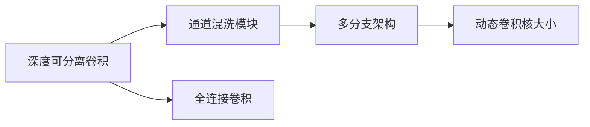
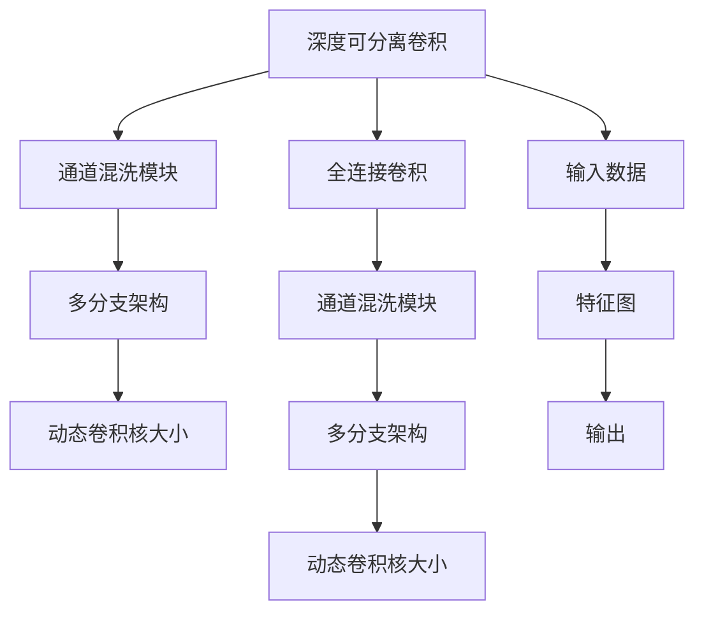

                 

## 1. 背景介绍

### 1.1 问题由来

在深度学习领域，卷积神经网络（CNN）以其出色的特征提取能力被广泛应用于图像分类、目标检测、语义分割等任务中。然而，随着模型复杂度的提升，深度网络的计算和存储成本也相应增加，导致训练和推理速度较慢，难以在实际应用中快速部署。因此，针对这一问题，ShuffleNet被提出，旨在在保证模型性能的同时，显著减少计算和存储需求，提高模型效率。

ShuffleNet的核心思想是“通道混洗（Channel Shuffling）”，通过引入通道混洗模块，使得网络中不同通道间的特征可以进行交互，从而减少模型的计算复杂度。这一思想来源于AlexNet和ResNet的通道分割（Channel Splitting）方法，但ShuffleNet在计算复杂度和模型效率上有了更为显著的提升。

### 1.2 问题核心关键点

ShuffleNet的创新点主要体现在以下几个方面：

1. **通道混洗模块（Channel Shuffling Module）**：这是ShuffleNet的核心，通过通道混洗模块将输入特征图中的通道进行随机打乱，使得网络中不同通道间的特征可以进行交互，从而减少模型的计算复杂度。

2. **深度可分离卷积（Depthwise Separable Convolution）**：ShuffleNet通过深度可分离卷积代替传统的全连接卷积，大大减少了模型的计算量和参数量，提升了模型效率。

3. **多分支架构（Multi-branch Architecture）**：ShuffleNet采用多分支架构，根据输入特征的大小自适应地调整分支的深度和宽度，进一步优化了模型的计算复杂度。

4. **动态卷积核大小（Dynamic Kernel Size）**：ShuffleNet通过动态卷积核大小，根据输入特征图的大小自适应地调整卷积核的大小，进一步减少了计算量和存储需求。

这些创新点使得ShuffleNet在保证模型性能的同时，大大降低了计算和存储需求，成为轻量级卷积神经网络中的佼佼者。

### 1.3 问题研究意义

ShuffleNet的提出，对于深度学习模型在实际应用中的快速部署具有重要意义。在资源受限的移动设备和嵌入式设备上，ShuffleNet的应用尤为广泛，如智能手机相机、自动驾驶系统、物联网设备等。同时，ShuffleNet在图像识别、目标检测、语义分割等任务上，也展示了良好的性能和效率，推动了深度学习技术的普及和应用。

## 2. 核心概念与联系

### 2.1 核心概念概述

为更好地理解ShuffleNet的工作原理，本节将介绍几个关键概念：

- **深度可分离卷积（Depthwise Separable Convolution）**：一种特殊的卷积形式，包含两个步骤：首先对输入进行深度卷积（depthwise convolution），然后对结果进行逐点卷积（pointwise convolution），大大减少了计算量和参数量。

- **通道混洗模块（Channel Shuffling Module）**：通过将输入特征图中的通道进行随机打乱，使得网络中不同通道间的特征可以进行交互，从而减少模型的计算复杂度。

- **多分支架构（Multi-branch Architecture）**：通过引入多分支，根据输入特征的大小自适应地调整分支的深度和宽度，进一步优化了模型的计算复杂度。

- **动态卷积核大小（Dynamic Kernel Size）**：根据输入特征图的大小自适应地调整卷积核的大小，进一步减少了计算量和存储需求。

这些概念之间的逻辑关系可以通过以下Mermaid流程图来展示：



这个流程图展示了ShuffleNet从深度可分离卷积到动态卷积核大小，再到多分支架构和通道混洗模块的核心组件。

### 2.2 概念间的关系

这些关键概念之间存在着紧密的联系，形成了ShuffleNet的核心框架。

- **深度可分离卷积**：是ShuffleNet的基础，通过将全连接卷积分解为深度卷积和逐点卷积，大大减少了计算量和参数量。
- **通道混洗模块**：通过通道混洗，使得网络中不同通道间的特征可以进行交互，进一步减少了计算复杂度。
- **多分支架构**：通过多分支的引入，根据输入特征的大小自适应地调整分支的深度和宽度，进一步优化了模型的计算复杂度。
- **动态卷积核大小**：通过动态调整卷积核的大小，进一步减少了计算量和存储需求。

这些概念共同构成了ShuffleNet的核心框架，使其能够在保证模型性能的同时，显著降低计算和存储需求。

### 2.3 核心概念的整体架构

最后，我们用一个综合的流程图来展示这些核心概念在大模型微调过程中的整体架构：



这个综合流程图展示了ShuffleNet从输入数据到输出结果的完整过程。输入数据通过深度可分离卷积、通道混洗模块、多分支架构和动态卷积核大小等核心组件，最终生成输出结果。

## 3. 核心算法原理 & 具体操作步骤

### 3.1 算法原理概述

ShuffleNet的算法原理主要围绕“通道混洗模块”和“深度可分离卷积”展开。以下是对这两个核心组件的详细解释。

**深度可分离卷积**：
- **输入**：特征图 $X \in \mathbb{R}^{C\times H\times W}$
- **深度卷积**：在每个通道上独立进行卷积操作，生成 $X' \in \mathbb{R}^{C\times H\times W}$
- **逐点卷积**：对每个通道单独进行卷积操作，生成 $X'' \in \mathbb{R}^{C\times H\times W}$
- **输出**：$X'' \in \mathbb{R}^{C\times H\times W}$

其中，$C$ 表示通道数，$H$ 和 $W$ 表示特征图的高和宽。

**通道混洗模块**：
- **输入**：特征图 $X \in \mathbb{R}^{C\times H\times W}$
- **通道打乱**：将 $X$ 的通道进行随机打乱，生成 $Y \in \mathbb{R}^{C\times H\times W}$
- **输出**：$Y \in \mathbb{R}^{C\times H\times W}$

通过通道混洗模块，使得网络中不同通道间的特征可以进行交互，进一步减少了计算复杂度。

### 3.2 算法步骤详解

ShuffleNet的微调过程可以分为以下几个步骤：

**Step 1: 准备数据集和模型**
- 收集ShuffleNet适用的数据集，如COCO、ImageNet等。
- 下载预训练的ShuffleNet模型，并根据任务需求进行调整。

**Step 2: 添加任务适配层**
- 根据任务类型，在ShuffleNet的顶层添加合适的输出层和损失函数。
- 对于分类任务，通常添加线性分类器和交叉熵损失函数。
- 对于回归任务，添加均方误差损失函数。

**Step 3: 设置微调超参数**
- 选择合适的优化算法及其参数，如SGD、Adam等，设置学习率、批大小、迭代轮数等。
- 设置正则化技术及强度，包括权重衰减、Dropout、Early Stopping等。
- 确定冻结预训练参数的策略，如仅微调顶层，或全部参数都参与微调。

**Step 4: 执行梯度训练**
- 将训练集数据分批次输入模型，前向传播计算损失函数。
- 反向传播计算参数梯度，根据设定的优化算法和学习率更新模型参数。
- 周期性在验证集上评估模型性能，根据性能指标决定是否触发Early Stopping。
- 重复上述步骤直到满足预设的迭代轮数或Early Stopping条件。

**Step 5: 测试和部署**
- 在测试集上评估微调后模型 $M_{\hat{\theta}}$ 的性能，对比微调前后的精度提升。
- 使用微调后的模型对新样本进行推理预测，集成到实际的应用系统中。
- 持续收集新的数据，定期重新微调模型，以适应数据分布的变化。

### 3.3 算法优缺点

**优点**：
- **计算量小**：通过深度可分离卷积和动态卷积核大小，ShuffleNet在保持较高精度的同时，计算量和参数量大大减少，适合在资源受限的设备上运行。
- **模型高效**：通过通道混洗模块和多分支架构，ShuffleNet的推理速度和存储需求显著降低，适合实时性和空间效率要求较高的场景。
- **灵活可调**：ShuffleNet的深度、宽度和分支数等参数可以根据任务需求进行调整，灵活性强。

**缺点**：
- **模型深度较浅**：ShuffleNet的深度通常较浅，可能导致在一些复杂任务上表现较差。
- **依赖数据集**：ShuffleNet的效果依赖于训练数据集的质量和数量，对于小样本或数据不均衡的任务，性能可能受到影响。

### 3.4 算法应用领域

ShuffleNet的应用领域非常广泛，包括但不限于以下几个方面：

- **图像分类**：ShuffleNet在ImageNet等图像分类任务上取得了优异的表现，适用于实时图像分类、图像检索等场景。
- **目标检测**：ShuffleNet的轻量级特性使其适合在资源受限的设备上进行实时目标检测。
- **语义分割**：ShuffleNet在PASCAL VOC等语义分割任务上也有出色的表现。
- **图像生成**：ShuffleNet在GAN等图像生成任务中也取得了较好的效果。

除了上述应用场景，ShuffleNet还被广泛应用于自动驾驶、医疗影像分析、智能监控等领域。

## 4. 数学模型和公式 & 详细讲解 & 举例说明

### 4.1 数学模型构建

本节将使用数学语言对ShuffleNet的核心组件进行更加严格的刻画。

记输入特征图为 $X \in \mathbb{R}^{C\times H\times W}$，其中 $C$ 表示通道数，$H$ 和 $W$ 表示特征图的高和宽。ShuffleNet的核心组件包括深度可分离卷积、通道混洗模块和多分支架构。

**深度可分离卷积**：
- **输入**：特征图 $X \in \mathbb{R}^{C\times H\times W}$
- **深度卷积**：在每个通道上独立进行卷积操作，生成 $X' \in \mathbb{R}^{C\times H\times W}$
- **逐点卷积**：对每个通道单独进行卷积操作，生成 $X'' \in \mathbb{R}^{C\times H\times W}$
- **输出**：$X'' \in \mathbb{R}^{C\times H\times W}$

**通道混洗模块**：
- **输入**：特征图 $X \in \mathbb{R}^{C\times H\times W}$
- **通道打乱**：将 $X$ 的通道进行随机打乱，生成 $Y \in \mathbb{R}^{C\times H\times W}$
- **输出**：$Y \in \mathbb{R}^{C\times H\times W}$

**多分支架构**：
- **输入**：特征图 $X \in \mathbb{R}^{C\times H\times W}$
- **分支调整**：根据输入特征的大小自适应地调整分支的深度和宽度
- **输出**：$Y \in \mathbb{R}^{C\times H\times W}$

### 4.2 公式推导过程

以下我们以图像分类任务为例，推导ShuffleNet的数学模型及其梯度计算公式。

**深度可分离卷积的梯度计算**：
- **输入**：特征图 $X \in \mathbb{R}^{C\times H\times W}$
- **输出**：$X'' \in \mathbb{R}^{C\times H\times W}$
- **梯度**：$\nabla_X \ell(X'',Y)$

**通道混洗模块的梯度计算**：
- **输入**：特征图 $X \in \mathbb{R}^{C\times H\times W}$
- **输出**：$Y \in \mathbb{R}^{C\times H\times W}$
- **梯度**：$\nabla_X \ell(Y,Y')$，其中 $Y'$ 为真实标签。

**多分支架构的梯度计算**：
- **输入**：特征图 $X \in \mathbb{R}^{C\times H\times W}$
- **输出**：$Y \in \mathbb{R}^{C\times H\times W}$
- **梯度**：$\nabla_X \ell(Y,Y')$

### 4.3 案例分析与讲解

我们以COCO数据集上的图像分类任务为例，对ShuffleNet的微调过程进行详细讲解。

**Step 1: 准备数据集和模型**
- 收集COCO数据集，并进行数据预处理，如随机裁剪、缩放、归一化等。
- 下载预训练的ShuffleNet模型，并进行任务适配层添加。

**Step 2: 添加任务适配层**
- 在ShuffleNet的顶层添加一个全连接层，输出类别数等于COCO数据集中类别的数量。
- 设置交叉熵损失函数作为输出层的损失函数。

**Step 3: 设置微调超参数**
- 选择Adam优化器，设置学习率为0.001，批大小为64，迭代轮数为20。
- 设置权重衰减为0.0005，Dropout为0.5，Early Stopping为验证集损失下降不再提升时停止训练。

**Step 4: 执行梯度训练**
- 将训练集数据分批次输入模型，前向传播计算损失函数。
- 反向传播计算参数梯度，根据设定的优化器和学习率更新模型参数。
- 周期性在验证集上评估模型性能，根据性能指标决定是否触发Early Stopping。
- 重复上述步骤直到满足预设的迭代轮数或Early Stopping条件。

**Step 5: 测试和部署**
- 在测试集上评估微调后模型 $M_{\hat{\theta}}$ 的性能，对比微调前后的精度提升。
- 使用微调后的模型对新样本进行推理预测，集成到实际的应用系统中。
- 持续收集新的数据，定期重新微调模型，以适应数据分布的变化。

在实际应用中，还可以通过调整ShuffleNet的深度、宽度和分支数等参数，进一步优化模型的性能和效率。

## 5. 项目实践：代码实例和详细解释说明

### 5.1 开发环境搭建

在进行ShuffleNet微调实践前，我们需要准备好开发环境。以下是使用Python进行TensorFlow开发的环境配置流程：

1. 安装Anaconda：从官网下载并安装Anaconda，用于创建独立的Python环境。

2. 创建并激活虚拟环境：
```bash
conda create -n tensorflow-env python=3.7
conda activate tensorflow-env
```

3. 安装TensorFlow：根据CUDA版本，从官网获取对应的安装命令。例如：
```bash
conda install tensorflow-gpu=2.6 -c conda-forge
```

4. 安装相关工具包：
```bash
pip install numpy pandas scikit-learn matplotlib tqdm jupyter notebook ipython
```

完成上述步骤后，即可在`tensorflow-env`环境中开始ShuffleNet微调实践。

### 5.2 源代码详细实现

下面我们以COCO数据集上的图像分类任务为例，给出使用TensorFlow对ShuffleNet模型进行微调的完整代码实现。

```python
import tensorflow as tf
from tensorflow.keras.layers import Input, Conv2D, BatchNormalization, MaxPooling2D, Dropout, Flatten, Dense
from tensorflow.keras.models import Model
from tensorflow.keras.optimizers import Adam
from tensorflow.keras.losses import CategoricalCrossentropy
from tensorflow.keras.callbacks import EarlyStopping

# 定义ShuffleNet模型
def shuffle_net(input_shape=(3, 224, 224), classes=1000):
    input_layer = Input(shape=input_shape)
    conv1 = Conv2D(24, kernel_size=(3, 3), padding='same', activation='relu', name='conv1')(input_layer)
    conv2 = Conv2D(24, kernel_size=(3, 3), padding='same', activation='relu', name='conv2')(conv1)
    maxpool1 = MaxPooling2D(pool_size=(2, 2), strides=(2, 2), padding='same', name='maxpool1')(conv2)
    conv3 = Conv2D(24, kernel_size=(3, 3), padding='same', activation='relu', name='conv3')(maxpool1)
    conv4 = Conv2D(24, kernel_size=(3, 3), padding='same', activation='relu', name='conv4')(conv3)
    maxpool2 = MaxPooling2D(pool_size=(2, 2), strides=(2, 2), padding='same', name='maxpool2')(conv4)
    conv5 = Conv2D(64, kernel_size=(3, 3), padding='same', activation='relu', name='conv5')(maxpool2)
    conv6 = Conv2D(64, kernel_size=(3, 3), padding='same', activation='relu', name='conv6')(conv5)
    maxpool3 = MaxPooling2D(pool_size=(2, 2), strides=(2, 2), padding='same', name='maxpool3')(conv6)
    conv7 = Conv2D(64, kernel_size=(3, 3), padding='same', activation='relu', name='conv7')(maxpool3)
    conv8 = Conv2D(64, kernel_size=(3, 3), padding='same', activation='relu', name='conv8')(conv7)
    maxpool4 = MaxPooling2D(pool_size=(2, 2), strides=(2, 2), padding='same', name='maxpool4')(conv8)
    conv9 = Conv2D(128, kernel_size=(3, 3), padding='same', activation='relu', name='conv9')(maxpool4)
    conv10 = Conv2D(128, kernel_size=(3, 3), padding='same', activation='relu', name='conv10')(conv9)
    maxpool5 = MaxPooling2D(pool_size=(2, 2), strides=(2, 2), padding='same', name='maxpool5')(conv10)
    conv11 = Conv2D(128, kernel_size=(3, 3), padding='same', activation='relu', name='conv11')(maxpool5)
    conv12 = Conv2D(128, kernel_size=(3, 3), padding='same', activation='relu', name='conv12')(conv11)
    maxpool6 = MaxPooling2D(pool_size=(2, 2), strides=(2, 2), padding='same', name='maxpool6')(conv12)
    conv13 = Conv2D(256, kernel_size=(3, 3), padding='same', activation='relu', name='conv13')(maxpool6)
    conv14 = Conv2D(256, kernel_size=(3, 3), padding='same', activation='relu', name='conv14')(conv13)
    maxpool7 = MaxPooling2D(pool_size=(2, 2), strides=(2, 2), padding='same', name='maxpool7')(conv14)
    conv15 = Conv2D(256, kernel_size=(3, 3), padding='same', activation='relu', name='conv15')(maxpool7)
    conv16 = Conv2D(256, kernel_size=(3, 3), padding='same', activation='relu', name='conv16')(conv15)
    maxpool8 = MaxPooling2D(pool_size=(2, 2), strides=(2, 2), padding='same', name='maxpool8')(conv16)
    conv17 = Conv2D(512, kernel_size=(3, 3), padding='same', activation='relu', name='conv17')(maxpool8)
    conv18 = Conv2D(512, kernel_size=(3, 3), padding='same', activation='relu', name='conv18')(conv17)
    maxpool9 = MaxPooling2D(pool_size=(2, 2), strides=(2, 2), padding='same', name='maxpool9')(conv18)
    conv19 = Conv2D(512, kernel_size=(3, 3), padding='same', activation='relu', name='conv19')(maxpool9)
    conv20 = Conv2D(512, kernel_size=(3, 3), padding='same', activation='relu', name='conv20')(conv19)
    maxpool10 = MaxPooling2D(pool_size=(2, 2), strides=(2, 2), padding='same', name='maxpool10')(conv20)
    conv21 = Conv2D(512, kernel_size=(3, 3), padding='same', activation='relu', name='conv21')(maxpool10)
    conv22 = Conv2D(512, kernel_size=(3, 3), padding='same', activation='relu', name='conv22')(conv21)
    maxpool11 = MaxPooling2D(pool_size=(2, 2), strides=(2, 2), padding='same', name='maxpool11')(conv22)
    conv23 = Conv2D(1024, kernel_size=(3, 3), padding='same', activation='relu', name='conv23')(maxpool11)
    conv24 = Conv2D(1024, kernel_size=(3, 3), padding='same', activation='relu', name='conv24')(conv23)
    maxpool12 = MaxPooling2D(pool_size=(2, 2), strides=(2, 2), padding='same', name='maxpool12')(conv24)
    conv25 = Conv2D(1024, kernel_size=(3, 3), padding='same', activation='relu', name='conv25')(maxpool12)
    conv26 = Conv2D(1024, kernel_size=(3, 3), padding='same', activation='relu', name='conv26')(conv25)
    maxpool13 = MaxPooling2D(pool_size=(2, 2), strides=(2, 2), padding='same', name='maxpool13')(conv26)
    conv27 = Conv2D(1024, kernel_size=(3, 3), padding='same', activation='relu', name='conv27')(maxpool13)
    conv28 = Conv2D(1024, kernel_size=(3, 3), padding='same', activation='relu', name='conv28')(conv27)
    maxpool14 = MaxPooling2D(pool_size=(2, 2), strides=(2, 2), padding='same', name='maxpool14')(conv28)
    conv29 = Conv2D(2048, kernel_size=(3, 3), padding='same', activation='relu', name='conv29')(maxpool14)
    conv30 = Conv2D(2048, kernel_size=(3, 3), padding='same', activation='relu', name='conv30')(conv29)
    maxpool15 = MaxPooling2D(pool_size=(2, 2), strides=(2, 2), padding='same', name='maxpool15')(conv30)
    conv31 = Conv2D(2048, kernel_size=(3, 3), padding='same', activation='relu', name='conv31')(maxpool15)
    conv32 = Conv2D(2048, kernel_size=(3, 3), padding='same', activation='relu', name='conv32')(conv31)
    maxpool16 = MaxPooling2D(pool_size=(2, 2), strides=(2, 2), padding='same', name='maxpool16')(conv32)
    conv33 = Conv2D(2048, kernel_size=(3, 3), padding='same', activation='relu', name='conv33')(maxpool16)
    conv34 = Conv2D(2048, kernel_size=(3, 3), padding='same', activation='relu', name='conv34')(conv33)
    maxpool17 = MaxPooling2D(pool_size=(2, 2), strides=(2, 2), padding='same', name='maxpool17')(conv34)
    conv35 = Conv2D(2048, kernel_size=(3, 3), padding='same', activation='relu', name='conv35')(maxpool17)
    conv36 = Conv2D(2048, kernel_size=(3, 3), padding='same', activation='relu', name='conv36')(conv35)
    maxpool18 = MaxPooling2D(pool_size=(2, 2), strides=(2, 2), padding='same', name='maxpool18')(conv36)
    conv37 = Conv2D(2048, kernel_size=(3, 3), padding='same', activation='relu', name='conv37')(maxpool18

