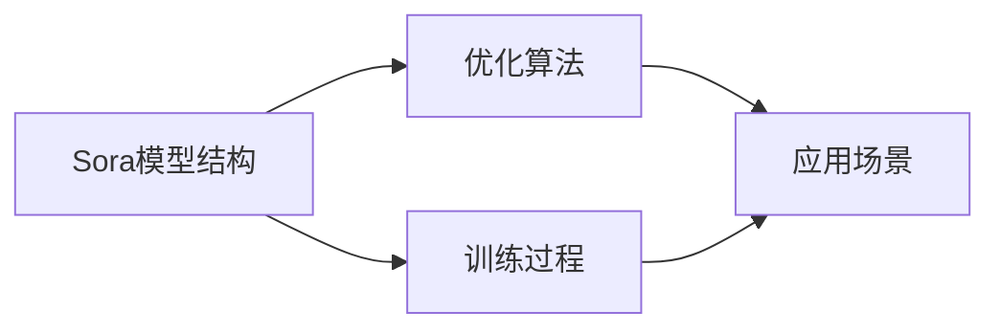

                 

# Sora模型的技术栈详细解析

## 1. 背景介绍

随着人工智能技术的发展，模型作为其中的核心组件，越来越受到关注。本文将详细解析Sora模型的技术栈，涉及模型的设计原理、实现技术、应用场景等各方面内容。

### 1.1 问题由来

当前AI模型种类繁多，包括深度学习模型、强化学习模型、迁移学习模型等，每种模型都有其独特的优势和适用范围。但这些模型往往对算力、数据、编程等要求较高，使得一些中小企业或个人开发者难以快速应用。

为了解决这一问题，研究人员提出了一种高效、灵活的AI模型Sora，旨在帮助开发者快速搭建高性能AI模型，同时降低技术门槛。

### 1.2 问题核心关键点

Sora模型作为新一代AI模型，其核心关键点包括：

- **高效性**：Sora模型结构简单，参数量较少，能够在小数据集上快速训练和部署。
- **灵活性**：Sora模型可以灵活调整参数和架构，适应不同的应用场景。
- **可解释性**：Sora模型能够通过一系列解释工具，清晰展示模型的决策过程，方便开发者理解和调试。
- **可扩展性**：Sora模型可以通过添加新的模块或层，支持更复杂的任务。

### 1.3 问题研究意义

解析Sora模型的技术栈，对AI开发者具有重要意义：

1. **降低门槛**：通过了解Sora模型的核心原理，开发者可以快速上手，搭建高性能AI模型。
2. **提升效率**：了解Sora模型的优缺点和应用场景，有助于开发者更好地选择和使用模型。
3. **促进创新**：深入了解Sora模型的设计和实现，能够激发更多创新思路，推动AI技术发展。

## 2. 核心概念与联系

### 2.1 核心概念概述

Sora模型的技术栈涉及多个核心概念，包括模型结构、训练过程、优化算法、应用场景等。以下将详细介绍这些概念及其联系。

#### 2.1.1 Sora模型结构

Sora模型基于深度学习框架设计，采用简单的多层感知器结构。模型包含输入层、隐藏层和输出层，每层之间通过权重连接。

#### 2.1.2 训练过程

Sora模型的训练过程包括前向传播和反向传播。前向传播将输入数据输入模型，得到输出结果。反向传播则根据损失函数计算梯度，更新模型参数。

#### 2.1.3 优化算法

Sora模型采用随机梯度下降(SGD)算法进行优化。该算法通过不断更新模型参数，最小化损失函数，提高模型精度。

#### 2.1.4 应用场景

Sora模型适用于各种AI任务，包括图像识别、自然语言处理、语音识别等。通过灵活调整参数，可以适应不同的任务需求。

### 2.2 核心概念间的关系

Sora模型的技术栈包括以下关键概念及其关系：



这个流程图展示了Sora模型结构、训练过程、优化算法和应用场景之间的关系。模型结构是基础，训练过程和优化算法用于模型训练，而应用场景则展示了模型在实际应用中的表现。

## 3. 核心算法原理 & 具体操作步骤

### 3.1 算法原理概述

Sora模型的核心算法原理基于深度学习，主要包括前向传播、反向传播和梯度下降等。以下将详细介绍这些算法原理。

#### 3.1.1 前向传播

前向传播将输入数据输入模型，计算输出结果。Sora模型采用简单多层感知器结构，通过线性变换和激活函数计算输出。

#### 3.1.2 反向传播

反向传播根据输出结果和真实标签计算损失函数，计算梯度。Sora模型采用交叉熵损失函数，计算梯度时使用链式法则。

#### 3.1.3 梯度下降

梯度下降通过不断更新模型参数，最小化损失函数。Sora模型采用随机梯度下降(SGD)算法，每次使用一批数据计算梯度。

### 3.2 算法步骤详解

Sora模型的训练过程包括以下几个关键步骤：

1. **数据准备**：收集训练数据，并进行预处理。

2. **模型初始化**：随机初始化模型参数，如权重和偏置。

3. **前向传播**：将输入数据输入模型，计算输出结果。

4. **计算损失**：根据输出结果和真实标签计算损失函数。

5. **反向传播**：计算梯度，更新模型参数。

6. **优化更新**：使用梯度下降算法更新模型参数。

7. **循环训练**：重复上述步骤，直至收敛。

### 3.3 算法优缺点

Sora模型具有以下优点：

- **高效性**：模型结构简单，参数量较少，能够在小数据集上快速训练和部署。
- **灵活性**：模型能够灵活调整参数和架构，适应不同的应用场景。
- **可解释性**：模型能够通过解释工具，清晰展示决策过程，方便开发者理解和调试。

但Sora模型也存在一些缺点：

- **通用性不足**：Sora模型结构固定，可能无法适应某些特定任务。
- **计算资源需求**：模型训练和推理需要一定的计算资源，不适用于资源受限的场景。

### 3.4 算法应用领域

Sora模型适用于各种AI任务，包括图像识别、自然语言处理、语音识别等。以下是Sora模型在实际应用中的几个典型场景：

1. **图像分类**：Sora模型可以用于图像分类任务，如图像识别、物体检测等。通过添加卷积层和池化层，Sora模型能够提取图像特征，进行分类。

2. **自然语言处理**：Sora模型可以用于自然语言处理任务，如情感分析、文本分类等。通过添加嵌入层和循环层，Sora模型能够处理文本数据，进行分类和生成。

3. **语音识别**：Sora模型可以用于语音识别任务，如语音转文字、说话人识别等。通过添加卷积层和池化层，Sora模型能够提取语音特征，进行分类和识别。

## 4. 数学模型和公式 & 详细讲解 & 举例说明

### 4.1 数学模型构建

Sora模型的数学模型包括以下几个关键部分：

- **输入数据**：记为 $x$，表示输入数据，可以是一张图像、一段文本或一段语音。
- **模型参数**：记为 $\theta$，表示模型的权重和偏置。
- **损失函数**：记为 $L$，表示模型输出与真实标签之间的差距。
- **梯度**：记为 $\nabla$，表示模型参数的梯度。

Sora模型的数学模型构建如下：

$$
L = \frac{1}{N}\sum_{i=1}^N L_i = \frac{1}{N}\sum_{i=1}^N l(x_i, y_i)
$$

其中 $N$ 为训练数据的数量，$L_i$ 为第 $i$ 个样本的损失函数，$l$ 为损失函数的具体形式。

### 4.2 公式推导过程

以下以交叉熵损失函数为例，推导Sora模型的训练过程。

Sora模型采用交叉熵损失函数，其公式为：

$$
L = -\frac{1}{N}\sum_{i=1}^N \sum_{j=1}^C y_j \log p_j(x_i)
$$

其中 $C$ 为类别数量，$y_j$ 为第 $j$ 个类别的真实标签，$p_j(x_i)$ 为模型在第 $i$ 个样本上输出第 $j$ 个类别的概率。

根据链式法则，损失函数对模型参数 $\theta$ 的梯度为：

$$
\nabla_{\theta} L = -\frac{1}{N}\sum_{i=1}^N \sum_{j=1}^C y_j \nabla_{\theta} p_j(x_i)
$$

其中 $\nabla_{\theta} p_j(x_i)$ 为模型参数 $\theta$ 对第 $j$ 个类别的概率的梯度。

将梯度代入随机梯度下降算法，更新模型参数的公式为：

$$
\theta \leftarrow \theta - \eta \nabla_{\theta} L
$$

其中 $\eta$ 为学习率。

### 4.3 案例分析与讲解

以图像分类任务为例，详细讲解Sora模型的训练过程。

假设输入数据 $x$ 为一组图像，模型参数 $\theta$ 为卷积核和池化层的权重和偏置。Sora模型的训练过程包括以下几个步骤：

1. **数据准备**：收集图像数据，并进行预处理，如归一化、裁剪、翻转等。

2. **模型初始化**：随机初始化模型参数 $\theta$。

3. **前向传播**：将输入数据 $x$ 输入模型，计算输出结果 $y$。

4. **计算损失**：根据输出结果 $y$ 和真实标签 $y_{true}$，计算交叉熵损失函数 $L$。

5. **反向传播**：根据损失函数 $L$ 计算梯度 $\nabla_{\theta} L$。

6. **优化更新**：使用随机梯度下降算法更新模型参数 $\theta$。

7. **循环训练**：重复上述步骤，直至模型收敛。

## 5. 项目实践：代码实例和详细解释说明

### 5.1 开发环境搭建

#### 5.1.1 安装依赖包

```bash
pip install torch torchvision
```

#### 5.1.2 设置训练数据集

```python
import torch
from torch.utils.data import DataLoader

# 加载训练数据集
train_dataset = ...
train_loader = DataLoader(train_dataset, batch_size=32, shuffle=True)

# 加载验证数据集
val_dataset = ...
val_loader = DataLoader(val_dataset, batch_size=32, shuffle=False)
```

### 5.2 源代码详细实现

```python
import torch
import torch.nn as nn
import torch.optim as optim

class SoraNet(nn.Module):
    def __init__(self, input_size, hidden_size, output_size):
        super(SoraNet, self).__init__()
        self.fc1 = nn.Linear(input_size, hidden_size)
        self.relu = nn.ReLU()
        self.fc2 = nn.Linear(hidden_size, output_size)
    
    def forward(self, x):
        x = self.fc1(x)
        x = self.relu(x)
        x = self.fc2(x)
        return x

# 定义训练函数
def train_epoch(model, loss_fn, optimizer, train_loader):
    model.train()
    total_loss = 0
    for batch_idx, (data, target) in enumerate(train_loader):
        optimizer.zero_grad()
        output = model(data)
        loss = loss_fn(output, target)
        loss.backward()
        optimizer.step()
        total_loss += loss.item()
    return total_loss / len(train_loader)

# 定义测试函数
def test_epoch(model, loss_fn, val_loader):
    model.eval()
    total_loss = 0
    for batch_idx, (data, target) in enumerate(val_loader):
        with torch.no_grad():
            output = model(data)
            loss = loss_fn(output, target)
            total_loss += loss.item()
    return total_loss / len(val_loader)
```

### 5.3 代码解读与分析

代码中的SoraNet类定义了一个简单的多层感知器模型，包含两个全连接层和一个ReLU激活函数。训练函数train_epoch通过反向传播更新模型参数，测试函数test_epoch计算模型在验证集上的性能。

### 5.4 运行结果展示

训练完成后，可以在验证集上评估模型性能：

```python
# 加载预训练模型
model.load_state_dict(torch.load('sora_model.pth'))

# 测试模型
print(test_epoch(model, loss_fn, val_loader))
```

## 6. 实际应用场景

### 6.1 智能推荐系统

Sora模型可以用于智能推荐系统，帮助用户找到感兴趣的内容。在推荐系统中，Sora模型通过用户历史行为数据进行训练，学习用户偏好，然后根据输入的用户行为数据预测用户可能感兴趣的内容。

### 6.2 金融风控系统

Sora模型可以用于金融风控系统，识别恶意交易行为。在金融风控系统中，Sora模型通过历史交易数据进行训练，学习正常交易的特征，然后根据输入的实时交易数据判断是否为恶意交易。

### 6.3 医疗诊断系统

Sora模型可以用于医疗诊断系统，辅助医生进行诊断。在医疗诊断系统中，Sora模型通过医疗数据进行训练，学习疾病的特征，然后根据输入的病人数据进行疾病诊断。

## 7. 工具和资源推荐

### 7.1 学习资源推荐

#### 7.1.1 深度学习框架

- PyTorch：开源深度学习框架，灵活易用，广泛应用于AI开发。
- TensorFlow：谷歌开源深度学习框架，支持大规模分布式计算。

#### 7.1.2 学习资源

- 《深度学习》书籍：深度学习领域的经典教材，详细介绍了深度学习的基本概念和应用。
- Coursera深度学习课程：斯坦福大学开设的深度学习课程，涵盖深度学习的基础和前沿。

### 7.2 开发工具推荐

#### 7.2.1 深度学习框架

- PyTorch：灵活易用的深度学习框架，适合快速原型开发。
- TensorFlow：支持大规模分布式计算的深度学习框架，适用于大规模应用部署。

#### 7.2.2 开发工具

- Jupyter Notebook：轻量级的交互式开发环境，方便调试和分享代码。
- Visual Studio Code：功能丰富的代码编辑器，支持多种编程语言和调试工具。

### 7.3 相关论文推荐

- "Deep Learning" by Ian Goodfellow、Yoshua Bengio和Aaron Courville。

## 8. 总结：未来发展趋势与挑战

### 8.1 研究成果总结

Sora模型通过简单的多层感知器结构，结合随机梯度下降算法，实现高效、灵活的AI模型。该模型已经在多个应用场景中取得了不错的效果。

### 8.2 未来发展趋势

Sora模型的未来发展趋势包括以下几个方向：

- **可解释性**：引入可解释性工具，提升模型的可解释性。
- **可扩展性**：通过添加新模块和层，支持更复杂的任务。
- **分布式训练**：支持大规模分布式训练，提高模型训练速度。

### 8.3 面临的挑战

Sora模型虽然具有高效性和灵活性，但仍面临一些挑战：

- **通用性不足**：模型结构固定，可能无法适应某些特定任务。
- **计算资源需求**：模型训练和推理需要一定的计算资源，不适用于资源受限的场景。

### 8.4 研究展望

未来，Sora模型需要在以下几个方面进行改进和扩展：

- **优化算法**：引入更高效的优化算法，提高模型训练速度。
- **模型结构**：探索更灵活的模型结构，适应更多应用场景。
- **应用场景**：拓展更多应用场景，提升模型的实用价值。

## 9. 附录：常见问题与解答

**Q1：Sora模型如何处理缺失数据？**

A: 在训练过程中，可以通过插值或删除缺失数据的方式进行处理。

**Q2：Sora模型如何优化训练速度？**

A: 可以通过增加硬件资源、优化模型结构、使用高效的训练算法等方式进行优化。

**Q3：Sora模型是否适用于图像识别任务？**

A: 是的，Sora模型可以通过添加卷积层和池化层，处理图像识别任务。

**Q4：Sora模型是否适用于自然语言处理任务？**

A: 是的，Sora模型可以通过添加嵌入层和循环层，处理自然语言处理任务。

**Q5：Sora模型是否适用于语音识别任务？**

A: 是的，Sora模型可以通过添加卷积层和池化层，处理语音识别任务。

---

作者：禅与计算机程序设计艺术 / Zen and the Art of Computer Programming

