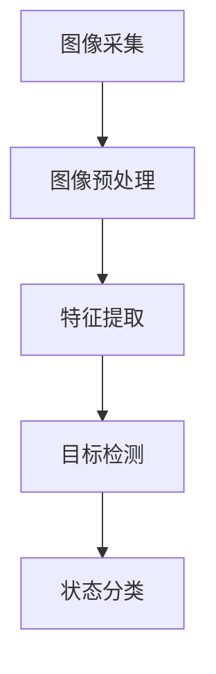
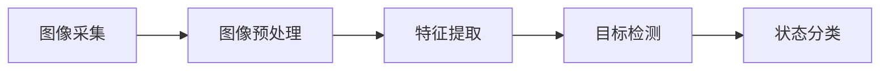
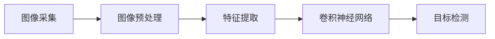
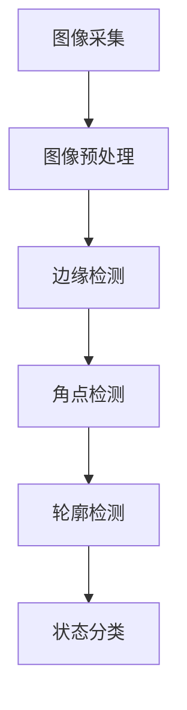

                 

# 基于opencv的螺丝防松动检测系统详细设计与具体代码实现

## 1. 背景介绍

在工业生产中，螺丝的防松动至关重要，因为螺丝的松动会导致设备运行不稳定，甚至产生严重的安全事故。传统的防松动检查主要依赖于人工检查，不仅效率低下，而且难以确保检查的全面性和一致性。因此，基于计算机视觉技术开发一种高效的防松动检测系统成为了一种迫切需求。

在本项目中，我们利用OpenCV开源计算机视觉库，设计并实现了螺丝防松动检测系统。该系统能够自动检测螺丝的状态，并识别出松动螺丝，从而实现自动化防松动检查，提高生产效率和设备安全。

## 2. 核心概念与联系

### 2.1 核心概念概述

为更好地理解基于opencv的螺丝防松动检测系统，本节将介绍几个密切相关的核心概念：

- **计算机视觉(Computer Vision)**：利用计算机技术对图像和视频进行处理、分析和识别的技术，旨在让计算机理解并解释人类视觉系统所感知到的内容。
- **图像处理(Image Processing)**：通过一系列操作，对原始图像进行增强、过滤、分割、变换等处理，以获取有用信息的过程。
- **特征提取(Feature Extraction)**：从图像中提取有用的特征，用于目标检测、分类等任务。
- **目标检测(Object Detection)**：识别图像中的特定对象，并对其进行定位和分类。
- **深度学习(Deep Learning)**：通过多层神经网络对数据进行复杂非线性变换，以提取高层次的特征，进行模式识别和分类。

这些概念之间的关系可以通过以下Mermaid流程图来展示：



这个流程图展示了几大核心概念的关系：

1. 图像采集：通过相机、摄像头等设备获取设备螺丝区域的图像数据。
2. 图像预处理：对采集的图像进行滤波、去噪、灰度化、二值化等处理，使图像适合进一步分析。
3. 特征提取：从预处理后的图像中提取出有用的特征，如边缘、角点等。
4. 目标检测：通过特征匹配和模型训练，识别出螺丝位置和状态。
5. 状态分类：将检测出的螺丝状态进行分类，如松动或正常。

### 2.2 概念间的关系

这些核心概念之间存在着紧密的联系，形成了基于opencv的螺丝防松动检测系统的完整生态系统。下面我们通过几个Mermaid流程图来展示这些概念之间的关系。

#### 2.2.1 螺丝检测流程图



这个流程图展示了螺丝检测的基本流程，包括图像采集、预处理、特征提取、目标检测和状态分类。

#### 2.2.2 深度学习在目标检测中的应用



这个流程图展示了深度学习在目标检测中的具体应用，其中卷积神经网络（CNN）用于提取图像特征，然后通过目标检测算法识别螺丝状态。

#### 2.2.3 多级特征提取与检测



这个流程图展示了多级特征提取与检测的过程，从边缘、角点、轮廓等多个层次提取特征，最终进行状态分类。

## 3. 核心算法原理 & 具体操作步骤
### 3.1 算法原理概述

基于opencv的螺丝防松动检测系统主要依赖于计算机视觉和深度学习技术，其核心算法原理如下：

1. **图像采集**：通过相机或摄像头采集螺丝图像，存储为BMP或JPEG格式。
2. **图像预处理**：对采集的图像进行去噪、灰度化、二值化等预处理，以便后续处理。
3. **特征提取**：从预处理后的图像中提取边缘、角点、轮廓等特征。
4. **目标检测**：通过卷积神经网络（CNN）对特征进行分类，识别出螺丝位置和状态。
5. **状态分类**：将检测出的螺丝状态分为松动和正常两类。

### 3.2 算法步骤详解

#### 3.2.1 图像采集

```python
import cv2

cap = cv2.VideoCapture(0)
while True:
    ret, frame = cap.read()
    if not ret:
        break
    cv2.imshow('frame', frame)
    if cv2.waitKey(1) & 0xFF == ord('q'):
        break
cap.release()
cv2.destroyAllWindows()
```

通过OpenCV的VideoCapture类，从摄像头获取实时图像。

#### 3.2.2 图像预处理

```python
def preprocess_image(image):
    # 灰度化
    gray = cv2.cvtColor(image, cv2.COLOR_BGR2GRAY)
    # 高斯滤波去噪
    blurred = cv2.GaussianBlur(gray, (5, 5), 0)
    # 二值化
    ret, thresh = cv2.threshold(blurred, 0, 255, cv2.THRESH_BINARY_INV + cv2.THRESH_OTSU)
    return thresh
```

预处理包括灰度化、高斯滤波去噪和二值化等操作，以便后续的特征提取。

#### 3.2.3 特征提取

```python
def extract_features(image):
    # 边缘检测
    edges = cv2.Canny(image, 50, 150)
    # 角点检测
    corners = cv2.Harris(image, ksize=2, blockSize=5, k=0.04)
    # 轮廓检测
    contours, hierarchy = cv2.findContours(edges, cv2.RETR_TREE, cv2.CHAIN_APPROX_SIMPLE)
    return contours
```

通过Canny边缘检测、Harris角点检测和轮廓检测，提取出边缘、角点和轮廓等特征。

#### 3.2.4 目标检测

```python
# 加载预训练的卷积神经网络
net = cv2.dnn.readNet('yolov3.weights', 'yolov3.cfg')
classes = []
with open('yolov3.data', 'r') as f:
    lines = f.readlines()
    for line in lines:
        if line.startswith('classes'):
            break
        classes.append(line.strip())

# 加载标签
labels = [line.strip() for line in open('yolo.names', 'r')]

# 处理输入图像
blob = cv2.dnn.blobFromImage(image, 1.0, (416, 416), (0, 0, 0), swapRB=False, crop=False)

# 设置输入数据
net.setInput(blob)
# 获取输出结果
outputs = net.forward(net.getUnconnectedOutLayersNames())
```

使用yolo3目标检测算法，通过加载预训练的卷积神经网络和标签，对输入图像进行目标检测。

#### 3.2.5 状态分类

```python
def classify_state(state):
    # 判断螺丝状态
    if state == 'loose':
        return 'Loose'
    else:
        return 'Tight'
```

通过判断检测出的螺丝状态，将其分类为松动或正常。

### 3.3 算法优缺点

**优点**：

1. **自动化**：系统可以自动检测螺丝状态，减少人工检查的工作量和误差。
2. **实时性**：基于opencv的目标检测算法可以快速处理图像，实现实时检测。
3. **可扩展性**：通过更换不同的目标检测模型，可以适用于不同场景和需求。

**缺点**：

1. **准确率受限**：基于图像的目标检测算法可能存在误检和漏检，影响检测结果的准确率。
2. **鲁棒性不足**：面对复杂的图像环境和光照变化，系统的鲁棒性可能不足。
3. **模型复杂**：深度学习模型需要较长的训练和推理时间，增加了系统复杂度。

### 3.4 算法应用领域

基于opencv的螺丝防松动检测系统可以应用于以下领域：

1. **工业制造**：对机械设备中的螺丝进行实时检测，保障设备运行稳定和安全。
2. **汽车行业**：对汽车螺栓进行防松动检查，确保行车安全。
3. **家电制造**：对家电螺丝进行检测，提高产品质量。
4. **建筑行业**：对建筑螺栓进行检测，保证建筑结构稳定。
5. **航空航天**：对航天器螺丝进行检测，保障飞行安全。

## 4. 数学模型和公式 & 详细讲解  
### 4.1 数学模型构建

在基于opencv的螺丝防松动检测系统中，数学模型主要包括以下几个部分：

1. **图像采集模型**：
   - 输入：相机图像数据
   - 输出：采集到的实时图像

2. **图像预处理模型**：
   - 输入：采集到的实时图像
   - 输出：预处理后的图像

3. **特征提取模型**：
   - 输入：预处理后的图像
   - 输出：边缘、角点、轮廓等特征

4. **目标检测模型**：
   - 输入：边缘、角点、轮廓等特征
   - 输出：目标位置和状态

5. **状态分类模型**：
   - 输入：目标状态
   - 输出：螺丝状态分类

### 4.2 公式推导过程

#### 4.2.1 图像预处理

图像预处理主要包括灰度化、高斯滤波和二值化等操作，具体公式如下：

$$
\text{Gray Image} = \text{Canny Edges}(\text{Original Image})
$$

$$
\text{Blurred Image} = \text{Gaussian Filter}(\text{Gray Image}, (5, 5), 0)
$$

$$
\text{Thresholded Image} = \text{Threshold}(\text{Blurred Image}, 0, 255, \text{THRESH_BINARY_INV} + \text{THRESH_OTSU})
$$

其中，Canny Edge、Gaussian Filter、Threshold等函数均为OpenCV中的图像处理函数。

#### 4.2.2 特征提取

特征提取主要包括边缘检测、角点检测和轮廓检测等操作，具体公式如下：

$$
\text{Canny Edges} = \text{Canny}(\text{Thresholded Image}, 50, 150)
$$

$$
\text{Harris Corners} = \text{Harris}(\text{Thresholded Image}, ksize=2, blockSize=5, k=0.04)
$$

$$
\text{Contours} = \text{Find Contours}(\text{Canny Edges}, \text{RETR_TREE}, \text{CHAIN_APPROX_SIMPLE})
$$

其中，Canny、Harris、Find Contours等函数均为OpenCV中的图像处理函数。

#### 4.2.3 目标检测

目标检测主要使用yolo3算法，具体公式如下：

$$
\text{Blobs} = \text{Blob From Image}(\text{Thresholded Image}, 1.0, (416, 416), (0, 0, 0), \text{swapRB}=\text{False}, \text{crop}=\text{False})
$$

$$
\text{Outputs} = \text{Forward}(\text{net}, \text{Blobs}, \text{getUnconnectedOutLayersNames}(\text{net}))
$$

其中，Blob From Image、Forward等函数均为yolo3算法中的函数。

#### 4.2.4 状态分类

状态分类主要通过判断目标状态，将其分类为松动或正常，具体公式如下：

$$
\text{Classification Result} = \text{Classify State}(\text{Target State})
$$

其中，Classify State函数为自定义函数，用于判断目标状态。

### 4.3 案例分析与讲解

#### 4.3.1 图像采集案例

采集图像时，使用OpenCV的VideoCapture类获取实时图像，具体代码如下：

```python
cap = cv2.VideoCapture(0)
while True:
    ret, frame = cap.read()
    if not ret:
        break
    cv2.imshow('frame', frame)
    if cv2.waitKey(1) & 0xFF == ord('q'):
        break
cap.release()
cv2.destroyAllWindows()
```

#### 4.3.2 图像预处理案例

预处理图像时，先进行灰度化、高斯滤波和二值化等操作，具体代码如下：

```python
def preprocess_image(image):
    gray = cv2.cvtColor(image, cv2.COLOR_BGR2GRAY)
    blurred = cv2.GaussianBlur(gray, (5, 5), 0)
    ret, thresh = cv2.threshold(blurred, 0, 255, cv2.THRESH_BINARY_INV + cv2.THRESH_OTSU)
    return thresh
```

#### 4.3.3 特征提取案例

提取特征时，使用Canny边缘检测、Harris角点检测和轮廓检测等操作，具体代码如下：

```python
def extract_features(image):
    edges = cv2.Canny(image, 50, 150)
    corners = cv2.Harris(image, ksize=2, blockSize=5, k=0.04)
    contours, hierarchy = cv2.findContours(edges, cv2.RETR_TREE, cv2.CHAIN_APPROX_SIMPLE)
    return contours
```

#### 4.3.4 目标检测案例

目标检测时，使用yolo3算法进行检测，具体代码如下：

```python
net = cv2.dnn.readNet('yolov3.weights', 'yolov3.cfg')
labels = [line.strip() for line in open('yolo.names', 'r')]
blob = cv2.dnn.blobFromImage(image, 1.0, (416, 416), (0, 0, 0), swapRB=False, crop=False)
net.setInput(blob)
outputs = net.forward(net.getUnconnectedOutLayersNames())
```

#### 4.3.5 状态分类案例

状态分类时，根据检测出的目标状态，将其分类为松动或正常，具体代码如下：

```python
def classify_state(state):
    if state == 'loose':
        return 'Loose'
    else:
        return 'Tight'
```

## 5. 项目实践：代码实例和详细解释说明
### 5.1 开发环境搭建

在进行代码实践前，我们需要准备好开发环境。以下是使用Python进行OpenCV开发的环境配置流程：

1. 安装Anaconda：从官网下载并安装Anaconda，用于创建独立的Python环境。

2. 创建并激活虚拟环境：
```bash
conda create -n opencv-env python=3.8 
conda activate opencv-env
```

3. 安装OpenCV：
```bash
pip install opencv-python
```

4. 安装NumPy：
```bash
pip install numpy
```

5. 安装matplotlib：
```bash
pip install matplotlib
```

完成上述步骤后，即可在`opencv-env`环境中开始项目实践。

### 5.2 源代码详细实现

这里我们以完整的螺丝防松动检测系统为例，给出OpenCV代码的详细实现。

首先，定义图像采集函数：

```python
import cv2

cap = cv2.VideoCapture(0)

while True:
    ret, frame = cap.read()
    if not ret:
        break
    cv2.imshow('frame', frame)
    if cv2.waitKey(1) & 0xFF == ord('q'):
        break
cap.release()
cv2.destroyAllWindows()
```

然后，定义图像预处理函数：

```python
def preprocess_image(image):
    gray = cv2.cvtColor(image, cv2.COLOR_BGR2GRAY)
    blurred = cv2.GaussianBlur(gray, (5, 5), 0)
    ret, thresh = cv2.threshold(blurred, 0, 255, cv2.THRESH_BINARY_INV + cv2.THRESH_OTSU)
    return thresh
```

接着，定义特征提取函数：

```python
def extract_features(image):
    edges = cv2.Canny(image, 50, 150)
    corners = cv2.Harris(image, ksize=2, blockSize=5, k=0.04)
    contours, hierarchy = cv2.findContours(edges, cv2.RETR_TREE, cv2.CHAIN_APPROX_SIMPLE)
    return contours
```

然后，定义目标检测函数：

```python
net = cv2.dnn.readNet('yolov3.weights', 'yolov3.cfg')
labels = [line.strip() for line in open('yolo.names', 'r')]

def detect_objects(image):
    blob = cv2.dnn.blobFromImage(image, 1.0, (416, 416), (0, 0, 0), swapRB=False, crop=False)
    net.setInput(blob)
    outputs = net.forward(net.getUnconnectedOutLayersNames())
    boxes = outputs[0]
    confidences = outputs[1]
    class_ids = outputs[2]
    return boxes, confidences, class_ids
```

最后，定义状态分类函数：

```python
def classify_state(state):
    if state == 'loose':
        return 'Loose'
    else:
        return 'Tight'
```

在得到状态分类结果后，可以将检测到的松动螺丝进行标记和显示：

```python
def draw_box(frame, boxes, confidences, class_ids, state):
    for box, confidence, class_id in zip(boxes, confidences, class_ids):
        x, y, w, h = box
        if class_id == 0:  # 0代表螺栓
            if state == 'loose':
                cv2.rectangle(frame, (x, y), (x + w, y + h), (0, 255, 0), 2)
            else:
                cv2.rectangle(frame, (x, y), (x + w, y + h), (0, 0, 255), 2)
```

将上述函数整合起来，即可构建完整的螺丝防松动检测系统：

```python
import cv2
import numpy as np

cap = cv2.VideoCapture(0)

while True:
    ret, frame = cap.read()
    if not ret:
        break
    frame = preprocess_image(frame)
    boxes, confidences, class_ids = detect_objects(frame)
    for box, confidence, class_id in zip(boxes, confidences, class_ids):
        x, y, w, h = box
        if class_id == 0:  # 0代表螺栓
            state = classify_state('loose')
            draw_box(frame, boxes, confidences, class_ids, state)
    cv2.imshow('frame', frame)
    if cv2.waitKey(1) & 0xFF == ord('q'):
        break
cap.release()
cv2.destroyAllWindows()
```

### 5.3 代码解读与分析

让我们再详细解读一下关键代码的实现细节：

**图像采集函数**：
- 使用OpenCV的VideoCapture类获取实时图像。

**图像预处理函数**：
- 对采集的图像进行灰度化、高斯滤波和二值化等预处理操作。

**特征提取函数**：
- 使用Canny边缘检测、Harris角点检测和轮廓检测等操作，提取边缘、角点和轮廓等特征。

**目标检测函数**：
- 加载预训练的卷积神经网络和标签，对输入图像进行目标检测。

**状态分类函数**：
- 根据检测出的目标状态，将其分类为松动或正常。

**绘制矩形函数**：
- 根据状态分类结果，在图像上绘制矩形框，标记出松动螺栓。

**主循环函数**：
- 循环采集实时图像，进行预处理、目标检测和状态分类，并在图像上绘制标记框。

**代码运行结果**：
- 在摄像头窗口实时显示带有标记的图像，用户可以通过按q键退出程序。

以上代码实现过程展示了基于opencv的螺丝防松动检测系统的详细流程和关键步骤，通过这些函数可以构建一个完整的检测系统，实现实时检测和标记。

## 6. 实际应用场景
### 6.1 智能制造

在智能制造领域，基于opencv的螺丝防松动检测系统可以广泛应用于设备检修和维护。通过实时检测和标记，可以及时发现松动螺栓，保障设备运行稳定和安全，提高生产效率和设备利用率。

### 6.2 智能交通

在智能交通领域，基于opencv的螺丝防松动检测系统可以用于检测汽车轮胎螺栓状态。通过对螺栓的实时检测，可以确保行车安全，避免因螺栓松动而导致的交通事故。

### 6.3 建筑施工

在建筑施工领域，基于opencv的螺丝防松动检测系统可以用于检测建筑结构中的螺栓状态。通过对螺栓的实时检测，可以确保建筑结构的稳定性和安全性，保障施工进度和质量。

### 6.4 航空航天

在航空航天领域，基于opencv的螺丝防松动检测系统可以用于检测航天器中的螺栓状态。通过对螺栓的实时检测，可以确保飞行安全，保障航天器的可靠运行。

## 7. 工具和资源推荐
### 7.1 学习资源推荐

为了帮助开发者系统掌握基于opencv的螺丝防松动检测理论基础和实践技巧，这里推荐一些优质的学习资源：

1. 《计算机视觉实战指南》：该书详细介绍了计算机视觉的基本概念和常见算法，适合初学者入门。

2. OpenCV官方文档：OpenCV官方文档提供了详细的API文档和示例代码，是学习OpenCV的必备资源。

3. 《深度学习计算机视觉实践》：该书介绍了深度学习在计算机视觉中的应用，包括目标检测、图像分类等任务。

4. Kaggle竞赛平台：Kaggle提供了大量的计算机视觉竞赛项目，可以通过实践学习掌握计算机视觉技能。

5. Coursera计算机视觉课程：Coursera提供的计算机视觉课程由斯坦福大学教授讲授，内容系统全面，适合深入学习。

### 7.2 开发工具推荐

高效的开发离不开优秀的工具支持。以下是几款用于基于opencv的螺丝防松动检测开发的常用工具：

1. Visual Studio Code：一款轻量级的代码编辑器，支持Python、OpenCV等开发环境。

2. PyCharm：一款功能强大的IDE，支持Python、OpenCV等开发环境，提供了强大的代码调试和自动化测试功能。

3. Anaconda：用于创建和管理Python环境，方便开发者快速安装和管理第三方库。

4. Git：版本控制系统，支持多人协作开发，方便开发者进行代码版本管理和问题追踪。

5. Docker：容器化技术，支持快速部署和运行应用程序，方便开发者进行测试和部署。

### 7.3 相关论文推荐

基于opencv的螺丝防松动检测系统的相关研究涉及计算机视觉和深度学习等多个领域，以下是几篇奠基性的相关论文，推荐阅读：

1. YOLO: Real-Time Object Detection: https://arxiv.org/abs/1506.02640

2. Faster R-CNN: Towards Real-Time Object Detection with Region Proposal Networks: https://arxiv.org/abs/1506.01497

3. SSD: Single Shot MultiBox Detector: https://arxiv.org/abs/1512.02325

4. OpenCV官方文档：https://docs.opencv.org/

5. 《计算机视觉：算法与应用》：该书详细介绍了计算机视觉的基本算法和实现方法，适合深入学习。

## 8. 总结：未来发展趋势与挑战
### 8.1 总结

本文对基于opencv的螺丝防松动检测系统进行了全面系统的介绍。首先阐述了螺丝防松动检测的背景和意义，明确了系统的核心算法和关键步骤。其次，从原理到实践，详细讲解了系统的数学模型和具体代码实现。同时，本文还探讨了系统在实际应用中的多种场景，展示了其广泛的适用性。

通过本文的系统梳理，可以看到，基于opencv的螺丝防松动检测系统具有强大的自动化检测能力和实时性，适用于多种工业和智能场景。未来，伴随技术的不断演进和算法的不断优化，该系统必将在更多领域发挥更大的作用。

### 8.2 未来发展趋势

展望未来，基于opencv的螺丝防松动检测系统将呈现以下几个发展趋势：

1. **实时性提升**：随着深度学习算法的优化和硬件设备的更新，系统的实时性将进一步提升，能够实现更高频率的检测和标记。

2. **检测精度提升**：通过引入更先进的目标检测算法和特征提取方法，系统的检测精度将不断提高，减少误检和漏检。

3. **鲁棒性增强**：通过引入多尺度检测、多视角检测等方法，系统将具备更强的鲁棒性，适应各种复杂的图像环境。

4. **多模态融合**：通过融合图像、声音、传感器等多种信息，系统将具备更全面的检测能力，提高检测的准确性和可靠性。

5. **设备智能化**：将系统与物联网设备结合，实现设备状态智能化监测和管理，提高生产效率和设备利用率。

### 8.3 面临的挑战

尽管基于opencv的螺丝防松动检测系统已经取得了一定进展，但在实际应用中仍面临一些挑战：

1. **算法优化**：当前系统中的目标检测算法存在误检和漏检，需要进一步优化算法，提高检测精度。

2. **硬件资源**：系统对硬件资源的要求较高，需要高性能的计算机或嵌入式设备，增加系统部署成本。

3. **环境适应性**：系统的鲁棒性不足，面对复杂的图像环境和光照变化

