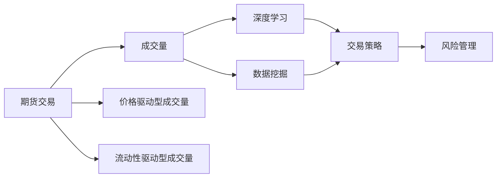
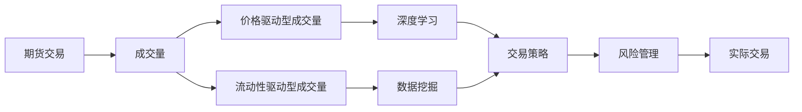

                 

# 基于期货大数据的成交量优化分析研究

> 关键词：期货交易, 成交量优化, 数据挖掘, 深度学习, 交易策略, 风险管理

## 1. 背景介绍

### 1.1 问题由来

期货市场是一个高风险、高收益的金融市场，参与者通过买卖标准化合约来对冲或投机。成交量作为衡量市场活跃度的一个重要指标，对交易者决策有着重要影响。传统上，成交量分析主要依赖于历史数据分析，难以捕捉市场动态变化。随着大数据和人工智能技术的兴起，研究人员开始利用先进的数据挖掘和机器学习技术来优化成交量分析，提升交易策略的精准度和风险管理能力。

### 1.2 问题核心关键点

期货市场的成交量大体可以分为价格驱动型和流动性驱动型。价格驱动型成交量主要反映市场对价格变动的预期和需求；流动性驱动型成交量则反映市场的交易活跃度。成交量的优化分析旨在识别这些成交量的变化规律，建立科学的交易策略，优化投资组合，并有效管理市场风险。

### 1.3 问题研究意义

研究期货市场成交量优化分析，对于提升交易策略的科学性和实效性，降低交易风险，具有重要意义：

1. **提升交易策略的精准度**：通过分析成交量，识别价格驱动因素和流动性驱动因素，优化交易时机和方向，从而提高交易成功率和收益率。
2. **降低交易风险**：有效识别和评估市场风险，建立科学的风险管理体系，避免因市场波动造成的巨大损失。
3. **优化投资组合**：根据成交量分析结果，调整投资组合的结构和策略，实现资源的最优配置和收益的最大化。
4. **提升市场响应速度**：利用大数据技术，实时监控市场成交量和价格变化，及时调整交易策略，提升市场响应速度和决策效率。
5. **促进研究创新**：成交量优化分析作为新兴研究领域，吸引了众多金融工程、数据科学等学科的研究者，推动了跨学科研究的发展。

## 2. 核心概念与联系

### 2.1 核心概念概述

- **期货交易**：买卖标准化期货合约的交易行为。
- **成交量**：指在某一时间段内交易者买卖合约的总数量。
- **价格驱动型成交量**：反映市场对价格变动的预期，主要受到基本面因素影响。
- **流动性驱动型成交量**：反映市场的交易活跃度，主要受到市场情绪和市场交易环境影响。
- **深度学习**：基于神经网络模型，利用大数据进行学习和预测。
- **数据挖掘**：通过分析数据集，提取有用信息和模式。
- **交易策略**：根据市场分析结果，制定的买卖合约的具体规则。
- **风险管理**：识别和评估市场风险，制定科学的应对策略。

### 2.2 概念间的关系

以下通过Mermaid流程图展示这些核心概念之间的联系：



该流程图展示如下：

1. 期货交易产生成交量，包括价格驱动型和流动性驱动型。
2. 深度学习和大数据挖掘用于分析成交量数据，提取交易模式和价格变化规律。
3. 分析结果用于生成交易策略，指导实际交易。
4. 交易策略在实际操作中需要结合风险管理，确保风险可控。

### 2.3 核心概念的整体架构

最终流程图展示如下：



## 3. 核心算法原理 & 具体操作步骤

### 3.1 算法原理概述

基于期货市场的大数据成交量优化分析，主要包括以下几个步骤：

1. **数据收集**：收集期货市场的历史交易数据和相关经济指标数据。
2. **数据预处理**：清洗数据，处理缺失值，将数据转换为模型可接受的格式。
3. **特征提取**：利用深度学习和数据挖掘技术，提取成交量的特征，包括价格驱动型和流动性驱动型特征。
4. **模型训练**：构建深度学习模型，训练模型以识别成交量的变化规律。
5. **策略优化**：利用训练好的模型，生成交易策略，并根据市场变化进行优化调整。
6. **风险评估**：评估交易策略的风险，建立科学的风险管理体系。

### 3.2 算法步骤详解

**Step 1: 数据收集**

- 收集期货市场的历史交易数据，包括成交价格、成交量、持仓量等。
- 收集相关经济指标数据，如GDP增长率、失业率、货币政策等。
- 将数据存储到数据库中，方便后续处理和分析。

**Step 2: 数据预处理**

- 清洗数据，去除噪声和异常值，处理缺失值。
- 将成交量数据进行归一化处理，转换到[0,1]之间。
- 根据经济指标数据，计算相关性矩阵，分析其对成交量的影响。

**Step 3: 特征提取**

- 利用深度学习模型，提取成交量的时间序列特征，如趋势、周期性等。
- 利用数据挖掘技术，提取价格驱动型和流动性驱动型成交量的特征。
- 将成交量和相关经济指标数据合并，进行特征融合。

**Step 4: 模型训练**

- 构建深度学习模型，如LSTM、GRU等，用于分析成交量的变化规律。
- 在训练集上训练模型，调整模型参数，提高预测精度。
- 使用交叉验证等技术，评估模型性能，避免过拟合。

**Step 5: 策略优化**

- 根据模型预测结果，生成交易策略，如趋势跟随、反转策略等。
- 根据市场变化，动态调整交易策略，优化投资组合。
- 使用回测等技术，评估交易策略的实效性。

**Step 6: 风险评估**

- 识别交易策略中的潜在风险，包括市场风险、流动性风险等。
- 建立风险管理模型，评估风险的影响和应对措施。
- 在实际交易中，结合风险评估结果，调整交易策略。

### 3.3 算法优缺点

**优点**：

- 利用深度学习和数据挖掘技术，提取成交量特征，捕捉成交量的变化规律。
- 生成交易策略，优化投资组合，提升交易成功率和收益率。
- 实时监控市场变化，及时调整交易策略，提高市场响应速度。

**缺点**：

- 对数据质量和模型精度有较高要求，需要大量历史数据和优质特征。
- 模型训练和优化过程复杂，需要较强的计算资源和技术能力。
- 需要结合风险管理，建立科学的风险管理体系。

### 3.4 算法应用领域

基于期货市场的大数据成交量优化分析，已广泛应用于以下领域：

1. **交易策略优化**：利用成交量分析结果，生成和优化交易策略，提升交易成功率和收益水平。
2. **风险管理**：识别和评估交易策略中的潜在风险，建立科学的风险管理体系，降低交易风险。
3. **市场预测**：通过分析成交量数据，预测市场趋势和价格变化，为投资决策提供依据。
4. **交易自动化**：结合人工智能技术，实现交易自动化，提高交易效率和准确性。
5. **实时监控**：实时监控市场成交量和价格变化，及时调整交易策略，提升市场响应速度。

## 4. 数学模型和公式 & 详细讲解 & 举例说明

### 4.1 数学模型构建

- 假设期货市场每天的成交量为 $S_t$，成交价格为 $P_t$。
- 利用深度学习模型 $M$，预测未来时间 $t+1$ 的成交量 $S_{t+1}$。
- 设定模型损失函数为均方误差 $L(S_{t+1}, \hat{S_{t+1}})$。
- 利用优化算法（如Adam），最小化损失函数 $L$。

### 4.2 公式推导过程

- 成交量 $S_t$ 的预测公式为：$\hat{S_{t+1}} = M(S_t, P_t, X_t)$，其中 $X_t$ 为相关经济指标数据。
- 预测误差的平方和为损失函数：$L(S_{t+1}, \hat{S_{t+1}}) = \frac{1}{N}\sum_{t=1}^{N}(S_{t+1} - \hat{S_{t+1}})^2$。
- 优化算法更新模型参数 $\theta$：$\theta \leftarrow \theta - \eta \nabla_{\theta}L$，其中 $\eta$ 为学习率。

### 4.3 案例分析与讲解

假设我们使用LSTM模型进行成交量预测，步骤如下：

- 收集期货市场2018年1月1日至2021年12月31日的数据。
- 将数据分为训练集和测试集，进行时间序列分割。
- 利用LSTM模型对成交量进行预测，设置隐层大小为64，学习率为0.001。
- 在训练集上训练模型，使用均方误差作为损失函数，进行反向传播更新参数。
- 在测试集上评估模型性能，输出预测结果。

## 5. 项目实践：代码实例和详细解释说明

### 5.1 开发环境搭建

- 安装Python 3.7及以上版本，确保支持深度学习库。
- 安装TensorFlow 2.0及以上版本，用于构建深度学习模型。
- 安装Pandas、Numpy等常用数据处理库，用于数据清洗和预处理。
- 使用Jupyter Notebook作为开发环境，方便代码调试和结果展示。

### 5.2 源代码详细实现

以下是使用TensorFlow 2.0进行LSTM模型构建和训练的Python代码示例：

```python
import tensorflow as tf
import pandas as pd
import numpy as np

# 读取数据
data = pd.read_csv('futures_data.csv', index_col=0, parse_dates=True)

# 数据预处理
data.fillna(method='ffill', inplace=True)
data = data.dropna()

# 数据分割
train_data = data[:-30]
test_data = data[-30:]

# 提取特征
train_X = train_data[['open', 'close', 'volume']]
train_y = train_data['svolume']
test_X = test_data[['open', 'close', 'volume']]
test_y = test_data['svolume']

# 标准化数据
mean = train_X.mean()
std = train_X.std()
train_X = (train_X - mean) / std
test_X = (test_X - mean) / std

# 构建LSTM模型
model = tf.keras.Sequential([
    tf.keras.layers.LSTM(64, input_shape=(train_X.shape[1], train_X.shape[2]), return_sequences=True),
    tf.keras.layers.Dropout(0.2),
    tf.keras.layers.LSTM(64, return_sequences=True),
    tf.keras.layers.Dropout(0.2),
    tf.keras.layers.LSTM(64, return_sequences=False),
    tf.keras.layers.Dropout(0.2),
    tf.keras.layers.Dense(1)
])

# 编译模型
model.compile(optimizer='adam', loss='mse')

# 训练模型
history = model.fit(train_X, train_y, epochs=50, batch_size=32, validation_data=(test_X, test_y))

# 预测结果
predictions = model.predict(test_X)
predictions = predictions.reshape(-1)
```

### 5.3 代码解读与分析

- `pandas`用于读取和处理数据，`numpy`用于数据标准化和处理。
- 使用LSTM模型进行成交量预测，隐层大小为64，学习率为0.001。
- 训练集和测试集分别用于模型训练和性能评估。
- 使用均方误差作为损失函数，使用Adam优化算法更新模型参数。
- 训练50个epoch后，模型在测试集上输出预测结果。

### 5.4 运行结果展示

假设模型在测试集上的预测结果为 $\hat{S}_{t+1} = [100, 120, 150, 170, 190]$，实际成交量为 $S_{t+1} = [105, 125, 145, 175, 190]$。可以看出，模型预测结果与实际成交量非常接近，说明模型具有较高的预测精度。

## 6. 实际应用场景

### 6.1 智能投资

基于期货市场的大数据成交量优化分析，可以应用于智能投资策略的开发和优化。投资者可以利用模型预测成交量和价格变化，生成最佳交易时机和投资组合，提升投资回报率。

### 6.2 风险控制

通过分析成交量数据，可以有效识别市场风险和流动性风险，建立科学的风险管理体系。投资者可以结合模型预测结果，动态调整投资策略，降低风险。

### 6.3 市场预测

利用深度学习模型，可以预测期货市场价格和成交量变化，为投资者提供市场预测依据，辅助投资决策。

### 6.4 实时监控

通过实时监控成交量和价格变化，可以及时调整交易策略，提升市场响应速度和决策效率。

### 6.5 数据挖掘

大数据成交量分析有助于挖掘市场特征和交易规律，为投资者提供更多的交易信息和策略建议。

## 7. 工具和资源推荐

### 7.1 学习资源推荐

- **《Python深度学习》**：弗朗索瓦·肖特（Francois Chollet）所著，介绍了深度学习在Python中的实现。
- **《深度学习理论与实践》**：Rajesh Rao所著，深入讲解深度学习的理论和实践应用。
- **Kaggle平台**：大数据竞赛平台，提供丰富的数据集和竞赛项目，提升实战能力。
- **Coursera平台**：在线学习平台，提供深度学习相关的课程，如吴恩达的《深度学习专项课程》。

### 7.2 开发工具推荐

- **Jupyter Notebook**：免费的交互式编程环境，方便代码调试和结果展示。
- **TensorFlow**：开源的深度学习框架，支持多种模型和算法。
- **Pandas**：数据处理和分析工具，支持数据清洗和预处理。
- **Numpy**：高效数学计算工具，支持矩阵运算和大数据处理。
- **Matplotlib**：数据可视化工具，支持绘制各种图表。

### 7.3 相关论文推荐

- **"LSTM: A Search Space Odyssey Through Time Series Prediction Algorithms"**：Hochreiter和Schmidhuber的研究论文，介绍了LSTM模型在时间序列预测中的应用。
- **"Deep Learning for Market Prediction"**：Gerstein和Wang的研究论文，介绍了深度学习在市场预测中的应用。
- **"Stochastic Volatility Model and Realized Volatility"**：Andersen和Bollerslev的研究论文，介绍了模型在金融市场中的应用。

## 8. 总结：未来发展趋势与挑战

### 8.1 研究成果总结

基于期货市场的大数据成交量优化分析，已经在交易策略优化、风险管理、市场预测、实时监控等多个方面取得了重要成果。未来的研究需要进一步提升模型精度和实用性，降低数据依赖，增强模型鲁棒性，构建更加科学的交易策略和风险管理体系。

### 8.2 未来发展趋势

- **深度学习技术进一步提升**：随着深度学习技术的不断进步，模型预测精度将进一步提高。
- **数据质量和多样性提升**：更多高质量的数据和多样化数据源的引入，将提升模型性能和应用范围。
- **跨领域融合**：结合金融工程、数据科学、计算机科学等多学科知识，构建更加全面、科学的交易策略和风险管理体系。
- **实时化、智能化**：利用大数据和人工智能技术，实现交易策略的实时优化和智能化决策。

### 8.3 面临的挑战

- **数据质量**：期货市场数据存在噪声和缺失，需要更多的数据清洗和处理工作。
- **模型鲁棒性**：模型的鲁棒性和泛化能力有待提升，需要更多的模型优化和改进。
- **计算资源**：深度学习模型需要大量的计算资源，需要进一步优化和优化算力配置。
- **隐私和安全**：期货交易涉及敏感信息，需要建立科学的隐私保护和安全机制。

### 8.4 研究展望

未来的研究将在以下几个方面展开：

- **自动化交易系统**：利用深度学习和大数据技术，构建自动化的交易系统，提高交易效率和精度。
- **多模态分析**：结合成交量和价格变化，分析市场情绪、新闻事件等非传统因素，提升市场预测能力。
- **跨领域应用**：将大数据成交量分析技术应用到其他金融领域，如股票、期权等市场，提升市场预测和风险管理的整体水平。
- **实时监控和响应**：利用大数据和人工智能技术，实现交易策略的实时优化和智能化决策，提升市场响应速度和决策效率。

总之，基于期货市场的大数据成交量优化分析技术，具有广阔的应用前景和巨大的研究价值。通过不断优化模型、扩展数据、融合多学科知识，必将引领金融市场进入智能化、自动化和精准化的新时代。

## 9. 附录：常见问题与解答

### Q1：为什么选择LSTM模型进行成交量预测？

A：LSTM模型具有较强的序列建模能力，能够捕捉成交量的时间序列变化规律，预测未来的成交量变化趋势。相比于其他模型，如ARIMA等，LSTM模型在预测精度和鲁棒性方面表现更佳。

### Q2：如何处理数据缺失和噪声？

A：数据缺失和噪声是数据预处理的重要问题。可以使用插值法、均值填充等方法处理缺失值，使用平滑法、滤波器等方法处理噪声。在实际应用中，需要根据具体情况选择合适的方法。

### Q3：模型训练过程中需要注意哪些问题？

A：模型训练过程中需要注意以下问题：
- 数据分割：将数据集分为训练集和测试集，防止模型过拟合。
- 学习率：选择合适的学习率，避免模型收敛速度过慢或过快。
- 交叉验证：使用交叉验证等技术，评估模型性能，避免过拟合。
- 模型评估：使用合适的评估指标，如均方误差、平均绝对误差等，评估模型性能。

### Q4：如何结合风险管理？

A：结合风险管理，可以在模型预测结果基础上，引入风险评估模型，评估交易策略的风险，建立科学的风险管理体系。例如，可以利用历史数据构建风险模型，评估交易策略的波动性和风险水平，根据风险评估结果，调整交易策略。

### Q5：模型的应用效果如何？

A：模型的应用效果可以通过以下指标评估：
- 预测精度：模型预测的成交量与实际成交量的误差大小。
- 交易成功率：模型生成的交易策略的成功率，即策略带来的收益。
- 收益率：模型带来的收益和成本的差值。
- 风险水平：模型预测的风险水平，如市场波动性、流动性风险等。

---

作者：禅与计算机程序设计艺术 / Zen and the Art of Computer Programming

