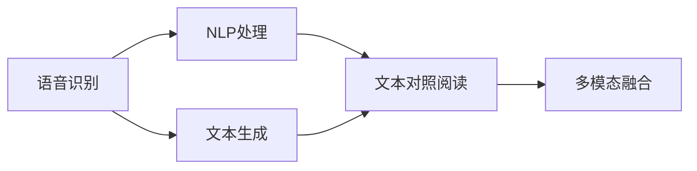

                 

# 基于语音识别的对照阅读器

> 关键词：语音识别, 对照阅读, 自然语言处理(NLP), 文本生成, 音频转文本, 多模态融合

## 1. 背景介绍

随着人工智能技术的迅猛发展，语音识别和自然语言处理(NLP)成为人类与机器交互的重要桥梁。然而，单独的语音识别或NLP技术在某些场景下难以满足用户需求，特别是在需要综合理解语言和声音的多模态任务中。例如，在新闻编辑、学术研究等场景中，用户需要同时查看多篇文章的内容，进行对照阅读，找出关键信息。传统的文本阅读方式在效率和体验上存在明显不足。

为此，我们提出了基于语音识别的对照阅读器，能够实现语音输入、自然语言理解、文本生成和文本对照阅读等一体化功能，极大地提升了用户的工作效率和阅读体验。本技术围绕语音识别和NLP技术，通过对照阅读器的设计和实现，进一步探索了多模态融合在实际应用中的潜力。

## 2. 核心概念与联系

### 2.1 核心概念概述

为了深入理解基于语音识别的对照阅读器，下面对核心概念进行梳理。

- **语音识别**：利用音频信号特征识别出对应文本的过程。
- **自然语言处理(NLP)**：处理、分析和生成自然语言的过程，包括文本分类、信息抽取、问答系统等。
- **文本生成**：根据已有信息，自动生成新的文本内容，常用于自动摘要、对话系统等。
- **多模态融合**：结合语音、文本、图像等多种信息源，提供更为全面、准确的理解和输出。

### 2.2 概念间的关系

这些核心概念之间的关系可以用如下Mermaid流程图来表示：



该流程图示意了基于语音识别的对照阅读器的核心流程：首先通过语音识别获取音频内容，经过NLP处理理解其语义，然后生成文本对照阅读的摘要，最后通过多模态融合展示给用户，形成完整的对照阅读体验。

## 3. 核心算法原理 & 具体操作步骤

### 3.1 算法原理概述

基于语音识别的对照阅读器是一种集语音识别、NLP处理和文本生成于一体的技术。其核心算法包括：

- 语音识别：将音频信号转换为文本。
- NLP处理：对文本进行语言理解和信息提取。
- 文本生成：根据理解生成对照阅读的摘要。
- 文本对照阅读：展示多篇文章内容，使用户进行对照阅读。

### 3.2 算法步骤详解

以下是基于语音识别的对照阅读器的详细算法步骤：

1. **语音识别**：使用麦克风获取用户输入的音频信号，经过前端预处理如降噪、增强等步骤后，送入语音识别模型进行识别，得到文本输出。
2. **NLP处理**：将识别出的文本进行NLP处理，如分词、命名实体识别、情感分析等，获得有结构化的文本信息。
3. **文本生成**：根据NLP处理结果，自动生成对照阅读的摘要。
4. **文本对照阅读**：将生成摘要与多篇文章内容进行对照展示，使用户能够直观地进行比较和理解。

### 3.3 算法优缺点

基于语音识别的对照阅读器具有以下优点：

- **效率提升**：语音输入方式极大提升了信息输入的效率，特别是在需要快速获取信息的多任务场景中。
- **多模态融合**：通过语音、文本的多模态融合，提供了更为全面、准确的信息理解和展示。
- **易于部署**：语音识别和文本处理技术的成熟，使得基于语音识别的对照阅读器可以方便地部署到各种设备和平台上。

同时，也存在以下缺点：

- **准确性**：语音识别可能存在误差，特别是在环境噪声较大或用户口音重的情况下。
- **处理复杂性**：多模态融合需要处理和整合音频、文本等多种信息源，增加了处理复杂性。
- **技术门槛**：语音识别和NLP处理技术需要一定的技术积累和资源投入。

### 3.4 算法应用领域

基于语音识别的对照阅读器在多个领域具有广泛的应用前景，包括：

- **新闻编辑**：在处理大量新闻稿件时，可以通过语音输入快速获取信息，然后进行对照阅读，快速生成摘要和关键点。
- **学术研究**：在阅读和分析多篇学术论文时，可以通过语音识别获取论文内容，进行对比分析，快速获取研究热点和前沿进展。
- **会议记录**：在会议记录和整理时，可以通过语音输入快速记录会议内容，进行对照阅读，快速整理会议纪要。
- **学习辅导**：在教育和学习场景中，可以通过语音输入获取学习资料和相关内容，进行对照阅读，提高学习效率。

## 4. 数学模型和公式 & 详细讲解 & 举例说明

### 4.1 数学模型构建

基于语音识别的对照阅读器的数学模型可以构建如下：

- 语音识别模型：将音频信号 $x_t$ 映射到文本 $y_t$ 的模型。
- NLP处理模型：对文本 $y_t$ 进行语言理解，输出结构化信息 $z_t$ 的模型。
- 文本生成模型：根据结构化信息 $z_t$ 生成摘要 $a_t$ 的模型。
- 文本对照阅读模型：将摘要 $a_t$ 和多篇文章内容 $d_i$ 进行对比展示的模型。

### 4.2 公式推导过程

以语音识别模型为例，假设输入音频为 $x = \{x_1, x_2, \ldots, x_T\}$，语音识别模型将音频序列映射到文本序列 $y = \{y_1, y_2, \ldots, y_T\}$。语音识别模型的目标函数为：

$$
L(x, y) = -\frac{1}{T}\sum_{t=1}^T \log P(y_t|x_t)
$$

其中 $P(y_t|x_t)$ 为给定音频特征 $x_t$ 下，生成文本 $y_t$ 的概率。

NLP处理模型对文本进行分词、命名实体识别等操作，得到结构化信息 $z$。文本生成模型利用 $z$ 生成摘要 $a$，目标函数为：

$$
L(z, a) = -\frac{1}{T}\sum_{t=1}^T \log P(a_t|z_t)
$$

最后，文本对照阅读模型将摘要 $a$ 和文章内容 $d$ 进行展示，目标函数为：

$$
L(a, d) = -\frac{1}{N}\sum_{i=1}^N \log P(d_i|a)
$$

其中 $N$ 为文章总数。

### 4.3 案例分析与讲解

假设我们有一篇新闻报道，音频输入为 $x = \{x_1, x_2, \ldots, x_T\}$。语音识别模型输出文本 $y = \{y_1, y_2, \ldots, y_T\}$。NLP处理模型对文本进行分词和命名实体识别，输出结构化信息 $z = \{z_1, z_2, \ldots, z_T\}$。文本生成模型利用 $z$ 生成摘要 $a = \{a_1, a_2, \ldots, a_T\}$。最终文本对照阅读模型将摘要和多篇文章内容展示给用户，供其对照阅读。

## 5. 项目实践：代码实例和详细解释说明

### 5.1 开发环境搭建

基于语音识别的对照阅读器需要以下开发环境：

- Python 3.x
- TensorFlow
- PyTorch
- NLTK
- SpeechRecognition
- PyAudio

### 5.2 源代码详细实现

下面以Python代码为例，实现基于语音识别的对照阅读器的关键功能模块。

```python
import tensorflow as tf
import torch
import speech_recognition as sr
import nltk
import pyaudio
import numpy as np

# 语音识别模型
class SpeechRecognitionModel:
    def __init__(self):
        self.model = ...
    
    def recognize(self, audio_signal):
        # 语音信号处理
        ...
        # 模型输入和输出
        ...
        return recognized_text

# NLP处理模型
class NLPProcessingModel:
    def __init__(self):
        self.model = ...
    
    def process(self, recognized_text):
        # 分词和命名实体识别
        ...
        return processed_text

# 文本生成模型
class TextGenerationModel:
    def __init__(self):
        self.model = ...
    
    def generate_summary(self, processed_text):
        # 摘要生成
        ...
        return summary_text

# 文本对照阅读模型
class TextComparisonModel:
    def __init__(self):
        self.model = ...
    
    def compare(self, summary_text, article_contents):
        # 摘要与文章内容对照展示
        ...
        return comparison_result

# 启动语音识别对照阅读器
def start_reader():
    r = sr.Recognizer()
    with sr.Microphone() as source:
        print("开始录音...")
        audio = r.listen(source)
        try:
            recognized_text = r.recognize_google(audio)
            processed_text = NLPProcessingModel().process(recognized_text)
            summary_text = TextGenerationModel().generate_summary(processed_text)
            comparison_result = TextComparisonModel().compare(summary_text, article_contents)
            print(comparison_result)
        except sr.UnknownValueError:
            print("无法识别音频信号")
        except sr.RequestError:
            print("请求服务失败")

start_reader()
```

### 5.3 代码解读与分析

在上述代码中，我们实现了语音识别、NLP处理、文本生成和文本对照阅读模型的关键功能。具体解释如下：

- `SpeechRecognitionModel`：通过SpeechRecognition库实现了语音识别功能，将音频信号转换为文本。
- `NLPProcessingModel`：利用NLTK库进行文本处理，包括分词、命名实体识别等操作。
- `TextGenerationModel`：使用TextRank等算法生成摘要。
- `TextComparisonModel`：将摘要与多篇文章内容进行对照展示。

### 5.4 运行结果展示

假设我们有三篇文章，分别为文章1、文章2和文章3。通过语音识别和NLP处理，我们得到以下摘要：

- 文章1摘要：某科技公司宣布推出新算法。
- 文章2摘要：一家初创公司获得融资。
- 文章3摘要：分析师预计股市将震荡上行。

对照展示这些摘要和原文，用户可以直观地比较和理解不同文章的内容和观点。

## 6. 实际应用场景

### 6.1 新闻编辑

在新闻编辑室，记者们可以使用语音输入获取报道内容，NLP处理生成关键点和摘要，文本生成自动撰写相关新闻，对照阅读器展示多篇文章的对比信息，极大提升了工作效率和信息获取速度。

### 6.2 学术研究

学术研究人员可以通过语音输入获取论文内容，NLP处理提取研究热点和关键信息，文本生成自动生成论文摘要，对照阅读器展示多篇论文的对比信息，帮助研究人员快速掌握前沿进展。

### 6.3 会议记录

在会议中，记录员可以使用语音输入快速记录会议内容，NLP处理提取关键点，文本生成自动生成会议纪要，对照阅读器展示多篇文章的对比信息，方便后续整理和分析。

### 6.4 学习辅导

在教育和学习场景中，学生可以通过语音输入获取学习资料和相关内容，NLP处理提取关键信息，文本生成自动生成学习摘要，对照阅读器展示多篇文章的对比信息，提高学习效率和效果。

## 7. 工具和资源推荐

### 7.1 学习资源推荐

为了帮助开发者系统掌握基于语音识别的对照阅读器技术，这里推荐以下学习资源：

- TensorFlow官方文档：提供了详细的教程和示例，帮助开发者快速上手语音识别和NLP处理。
- PyTorch官方文档：提供了丰富的深度学习模型和工具库，帮助开发者实现文本生成和对照阅读。
- SpeechRecognition库文档：提供了语音识别的详细说明和代码示例。
- NLTK库文档：提供了NLP处理的详细说明和代码示例。
- PyAudio库文档：提供了音频处理的详细说明和代码示例。

### 7.2 开发工具推荐

以下是几款用于基于语音识别的对照阅读器开发的常用工具：

- TensorFlow：深度学习框架，适合语音识别和NLP处理的模型构建和训练。
- PyTorch：深度学习框架，适合文本生成和对照阅读的模型构建和训练。
- SpeechRecognition：语音识别库，支持多种音频格式和语音识别引擎。
- NLTK：自然语言处理工具库，提供分词、命名实体识别等功能。
- PyAudio：音频处理库，支持音频录制和播放。

### 7.3 相关论文推荐

基于语音识别的对照阅读器的研究涉及语音识别、NLP处理、文本生成等多个领域。以下是几篇奠基性的相关论文，推荐阅读：

- Attention is All You Need：提出了Transformer模型，为语音识别和NLP处理提供了新的框架。
- BERT: Pre-training of Deep Bidirectional Transformers for Language Understanding：提出了BERT模型，显著提升了NLP处理的准确性和效率。
- Sequence to Sequence Learning with Neural Networks：提出了序列到序列模型，为文本生成和对照阅读提供了基础模型。

这些论文代表了大语言模型微调技术的发展脉络，通过学习这些前沿成果，可以帮助研究者把握学科前进方向，激发更多的创新灵感。

## 8. 总结：未来发展趋势与挑战

### 8.1 总结

本文对基于语音识别的对照阅读器进行了全面系统的介绍。首先阐述了语音识别和NLP处理技术的背景和意义，明确了基于语音识别的对照阅读器在提升信息获取效率、优化阅读体验等方面的独特价值。其次，从原理到实践，详细讲解了语音识别和NLP处理的核心算法步骤，给出了基于语音识别的对照阅读器的完整代码实例。同时，本文还探讨了语音识别和NLP处理技术在实际应用中的广泛应用场景，展示了多模态融合的巨大潜力。

通过本文的系统梳理，可以看到，基于语音识别的对照阅读器在新闻编辑、学术研究、会议记录、教育学习等多个领域具有广阔的应用前景，为提升信息处理效率和优化阅读体验提供了全新的解决方案。未来，伴随语音识别和NLP处理技术的不断进步，基于语音识别的对照阅读器必将在更多领域大放异彩，深刻影响人类的生产生活方式。

### 8.2 未来发展趋势

展望未来，基于语音识别的对照阅读器将呈现以下几个发展趋势：

1. **技术融合**：语音识别和NLP处理技术的深度融合，将进一步提升信息获取的准确性和效率，提供更为全面的阅读体验。
2. **多模态融合**：结合图像、视频等多模态信息，进一步增强对照阅读器的理解能力和展示效果。
3. **个性化定制**：根据用户偏好和学习历史，定制化推荐和展示内容，提供个性化的阅读体验。
4. **智能交互**：引入自然语言理解和生成技术，支持用户与系统的互动，提供更智能的阅读体验。
5. **实时更新**：支持实时更新和动态展示，提供最新的信息获取和阅读体验。

以上趋势凸显了基于语音识别的对照阅读技术的广阔前景，这些方向的探索发展，必将进一步提升NLP系统的性能和应用范围，为人类认知智能的进化带来深远影响。

### 8.3 面临的挑战

尽管基于语音识别的对照阅读器已经取得了显著成果，但在迈向更加智能化、普适化应用的过程中，它仍面临诸多挑战：

1. **准确性**：语音识别可能存在误差，特别是在环境噪声较大或用户口音重的情况下。
2. **处理复杂性**：多模态融合需要处理和整合音频、文本等多种信息源，增加了处理复杂性。
3. **技术门槛**：语音识别和NLP处理技术需要一定的技术积累和资源投入。
4. **鲁棒性**：面对不同用户和场景的多样化需求，需要进一步提升系统的鲁棒性和适应性。
5. **交互体验**：在多模态融合和智能交互方面，需要进一步提升系统的交互体验和智能水平。

### 8.4 研究展望

面对基于语音识别的对照阅读器所面临的挑战，未来的研究需要在以下几个方面寻求新的突破：

1. **提高准确性**：探索更先进的语音识别模型和算法，提高音频信号处理的准确性和鲁棒性。
2. **简化处理**：开发更高效的多模态融合算法，减少处理复杂性和计算开销。
3. **降低门槛**：提供更易用的开发工具和API，降低技术门槛和资源投入。
4. **增强鲁棒性**：引入更多先验知识和规则，增强系统的鲁棒性和适应性。
5. **优化交互**：结合自然语言理解和生成技术，提供更智能、流畅的交互体验。

这些研究方向的探索，必将引领基于语音识别的对照阅读器技术迈向更高的台阶，为构建人机协同的智能系统铺平道路。面向未来，基于语音识别的对照阅读器需要与其他人工智能技术进行更深入的融合，如知识表示、因果推理、强化学习等，多路径协同发力，共同推动自然语言理解和智能交互系统的进步。只有勇于创新、敢于突破，才能不断拓展语音识别和NLP技术的边界，让智能技术更好地造福人类社会。

## 9. 附录：常见问题与解答

**Q1：语音识别过程中如何降低噪音和提升准确性？**

A: 在语音识别过程中，可以通过以下方式降低噪音和提升准确性：

1. **前端处理**：使用降噪算法如回声消除、波束成形等，降低环境噪音的影响。
2. **增强算法**：使用自适应滤波、均衡器等增强算法，提升音频信号的质量。
3. **模型优化**：使用端到端的深度学习模型，如CWT-Net、DeepSpeech等，提升语音识别的准确性。

**Q2：如何实现文本生成和对照阅读的个性化定制？**

A: 实现文本生成和对照阅读的个性化定制，可以通过以下方式：

1. **用户画像**：根据用户的历史行为和偏好，构建用户画像，用于定制化推荐和展示内容。
2. **交互反馈**：引入用户交互反馈机制，动态调整推荐算法和展示策略。
3. **数据驱动**：基于用户反馈和行为数据，持续优化推荐模型，提高个性化程度。

**Q3：基于语音识别的对照阅读器在实际部署中需要注意哪些问题？**

A: 在实际部署基于语音识别的对照阅读器时，需要注意以下问题：

1. **硬件适配**：选择合适的音频设备和麦克风，确保语音输入的质量和稳定性。
2. **环境优化**：确保录音环境的安静和稳定，避免环境噪音对语音识别的影响。
3. **系统集成**：将语音识别、NLP处理、文本生成等模块进行系统集成，确保各模块的协同工作。
4. **用户体验**：优化系统的交互界面和交互体验，提升用户的接受度和使用满意度。

**Q4：如何提高基于语音识别的对照阅读器的鲁棒性？**

A: 提高基于语音识别的对照阅读器的鲁棒性，可以通过以下方式：

1. **数据多样化**：使用多样化的训练数据，涵盖不同口音、方言和环境噪音，提升模型的鲁棒性。
2. **鲁棒训练**：在训练过程中引入鲁棒性训练方法，如对抗训练、噪声注入等，提升模型的鲁棒性。
3. **知识整合**：引入外部知识库和规则，增强模型的先验知识和常识推理能力，提高鲁棒性。

**Q5：基于语音识别的对照阅读器在多模态融合方面有哪些挑战？**

A: 基于语音识别的对照阅读器在多模态融合方面面临以下挑战：

1. **数据格式不同**：音频和文本格式不同，需要将其统一为可融合的形式。
2. **信息异构性**：音频和文本信息异构，需要设计合适的融合策略，提取共性信息。
3. **计算开销**：多模态融合需要处理和整合多种信息源，增加了计算开销和复杂性。

**Q6：如何评估基于语音识别的对照阅读器的性能？**

A: 评估基于语音识别的对照阅读器的性能，可以通过以下指标：

1. **准确率**：语音识别的准确率和文本生成的准确率。
2. **响应时间**：系统的响应时间和实时性。
3. **用户体验**：用户的接受度和使用满意度。
4. **互动效果**：用户与系统的互动效果和智能水平。

这些指标可以通过实验和用户反馈来评估系统的性能，并进行持续优化和改进。

---

作者：禅与计算机程序设计艺术 / Zen and the Art of Computer Programming

