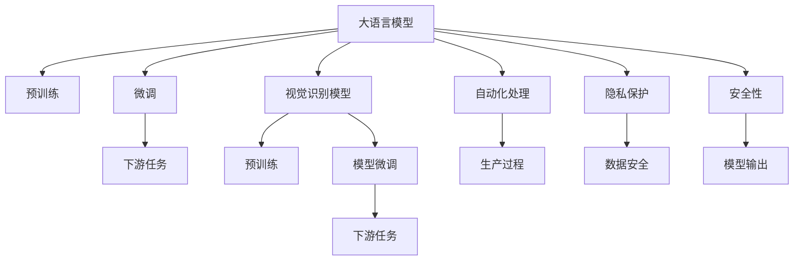
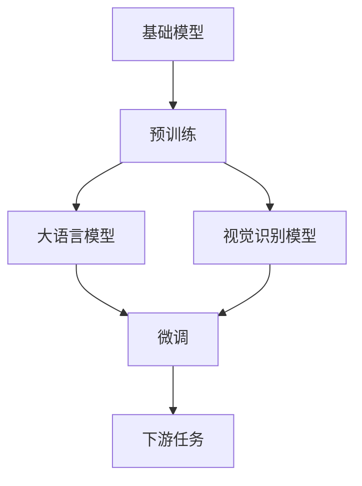
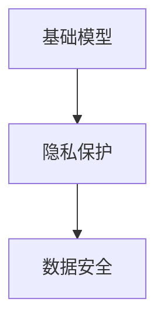
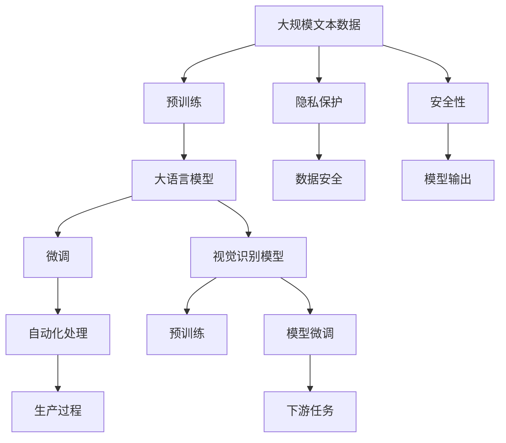

                 

# 基础模型在科技产业的影响

> 关键词：基础模型,科技产业,人工智能,机器学习,深度学习,自动化,效率提升,隐私保护,安全可靠

## 1. 背景介绍

### 1.1 问题由来
基础模型（Foundation Models）是近年来人工智能领域兴起的一种新型模型，主要包括大语言模型（Large Language Models, LLMs）和视觉识别模型（Computer Vision Models）等。这些模型基于大规模数据进行训练，具备强大的学习和理解能力，能够在多种场景下实现自动化处理，广泛应用于科技产业的各个领域。从自然语言处理（NLP）、计算机视觉（CV）到自动驾驶、医疗诊断，基础模型正不断拓展其应用边界，推动科技进步和产业变革。

### 1.2 问题核心关键点
基础模型在科技产业的影响，可以从以下几个核心关键点来理解：

- **技术突破**：基础模型通过其强大的学习能力，推动了人工智能技术的飞速发展，带来了许多技术上的突破。
- **产业应用**：基础模型在科技产业中广泛应用，带来了巨大的经济效益和社会效益。
- **效率提升**：通过自动化处理，基础模型显著提高了科技产业的运营效率。
- **隐私保护**：基础模型在处理敏感信息时，面临着隐私保护的挑战。
- **安全可靠**：基础模型的应用需要确保其输出结果的安全和可靠性。

### 1.3 问题研究意义
研究基础模型在科技产业的影响，对于理解当前人工智能技术的变革方向、促进产业升级、提高科技创新能力具有重要意义。

1. **加速产业升级**：基础模型可以帮助传统行业实现数字化转型，提升产业整体竞争力。
2. **推动技术创新**：基础模型提供了一种新的技术范式，激发了科研人员和工程师的创新思维。
3. **提高运营效率**：基础模型通过自动化处理，减少了人力成本，提高了科技产业的运营效率。
4. **保障数据隐私**：在基础模型应用中，保护用户隐私和数据安全是一个重要的课题。
5. **增强安全性**：确保基础模型输出的结果可靠、稳定，是实现其大规模应用的前提。

## 2. 核心概念与联系

### 2.1 核心概念概述

为了更好地理解基础模型在科技产业的影响，本节将介绍几个关键概念及其联系：

- **大语言模型**：以自回归（如GPT）或自编码（如BERT）模型为代表的预训练语言模型。通过在大规模无标签文本语料上进行预训练，学习通用的语言表示，具备强大的语言理解和生成能力。
- **视觉识别模型**：利用深度学习技术，通过大规模图像数据进行训练，识别和分类图像中的对象。常见的视觉识别模型包括ResNet、Inception等。
- **自动化**：通过基础模型实现自动化处理，减少人工干预，提高效率。
- **隐私保护**：基础模型处理敏感信息时，需要确保用户隐私和数据安全。
- **安全性**：基础模型在实际应用中，其输出结果需要具有高可靠性和安全性。

这些核心概念之间的逻辑关系可以通过以下Mermaid流程图来展示：



这个流程图展示了大语言模型、视觉识别模型等基础模型在科技产业中的应用场景，包括预训练、微调、自动化处理等关键环节，以及隐私保护和安全性这两个重要课题。

### 2.2 概念间的关系

这些核心概念之间存在着紧密的联系，形成了基础模型在科技产业中的完整生态系统。下面通过几个Mermaid流程图来展示这些概念之间的关系。

#### 2.2.1 基础模型学习范式



这个流程图展示了大语言模型和视觉识别模型的预训练过程，以及微调和下游任务的应用环节。

#### 2.2.2 自动化处理与生产过程


这个流程图展示了基础模型在自动化处理中的应用，从模型输出到生产过程的全流程。

#### 2.2.3 隐私保护与数据安全



这个流程图展示了基础模型在处理敏感信息时的隐私保护和数据安全问题。

#### 2.2.4 安全性与模型输出


这个流程图展示了基础模型在实际应用中，其输出结果需要具有高可靠性和安全性。

### 2.3 核心概念的整体架构

最后，我们用一个综合的流程图来展示这些核心概念在大语言模型微调过程中的整体架构：



这个综合流程图展示了从预训练到微调，再到自动化处理和生产过程，以及隐私保护和安全性保障的完整流程，揭示了基础模型在科技产业中的核心价值链。

## 3. 核心算法原理 & 具体操作步骤
### 3.1 算法原理概述

基础模型在科技产业的影响主要体现在其自动化处理能力上。通过预训练和微调，基础模型能够实现对大规模数据的快速处理和理解，从而在实际应用中提供高效、可靠的自动化服务。

形式化地，假设基础模型为 $M_{\theta}$，其中 $\theta$ 为模型参数。给定下游任务 $T$ 的标注数据集 $D=\{(x_i, y_i)\}_{i=1}^N, x_i \in \mathcal{X}, y_i \in \mathcal{Y}$。微调的目标是找到新的模型参数 $\hat{\theta}$，使得模型在任务 $T$ 上的输出与真实标签 $y$ 尽可能接近。

通过梯度下降等优化算法，微调过程不断更新模型参数 $\theta$，最小化损失函数 $\mathcal{L}(\theta, D)$，使得模型输出逼近真实标签。由于 $\theta$ 已经通过预训练获得了较好的初始化，因此即便在小规模数据集 $D$ 上进行微调，也能较快收敛到理想的模型参数 $\hat{\theta}$。

### 3.2 算法步骤详解

基于监督学习的基础模型微调一般包括以下几个关键步骤：

**Step 1: 准备基础模型和数据集**
- 选择合适的基础模型 $M_{\theta}$ 作为初始化参数，如 BERT、GPT 等。
- 准备下游任务 $T$ 的标注数据集 $D$，划分为训练集、验证集和测试集。一般要求标注数据与基础模型的预训练数据的分布不要差异过大。

**Step 2: 添加任务适配层**
- 根据任务类型，在基础模型顶层设计合适的输出层和损失函数。
- 对于分类任务，通常在顶层添加线性分类器和交叉熵损失函数。
- 对于生成任务，通常使用语言模型的解码器输出概率分布，并以负对数似然为损失函数。

**Step 3: 设置微调超参数**
- 选择合适的优化算法及其参数，如 AdamW、SGD 等，设置学习率、批大小、迭代轮数等。
- 设置正则化技术及强度，包括权重衰减、Dropout、Early Stopping 等。
- 确定冻结基础模型的策略，如仅微调顶层，或全部参数都参与微调。

**Step 4: 执行梯度训练**
- 将训练集数据分批次输入模型，前向传播计算损失函数。
- 反向传播计算参数梯度，根据设定的优化算法和学习率更新模型参数。
- 周期性在验证集上评估模型性能，根据性能指标决定是否触发 Early Stopping。
- 重复上述步骤直到满足预设的迭代轮数或 Early Stopping 条件。

**Step 5: 测试和部署**
- 在测试集上评估微调后模型 $M_{\hat{\theta}}$ 的性能，对比微调前后的精度提升。
- 使用微调后的模型对新样本进行推理预测，集成到实际的应用系统中。
- 持续收集新的数据，定期重新微调模型，以适应数据分布的变化。

以上是基于监督学习微调基础模型的通用流程。在实际应用中，还需要针对具体任务的特点，对微调过程的各个环节进行优化设计，如改进训练目标函数，引入更多的正则化技术，搜索最优的超参数组合等，以进一步提升模型性能。

### 3.3 算法优缺点

基础模型在科技产业中的应用具有以下优点：

1. **自动化处理能力强**：通过预训练和微调，基础模型能够自动理解和学习任务，提供高效的自动化处理能力。
2. **灵活适应性**：基础模型可以根据不同任务和数据集进行调整，灵活适应多种应用场景。
3. **高效率**：基础模型通过大规模并行计算，能够显著提高处理速度和效率。
4. **广泛应用**：基础模型在NLP、CV等多个领域得到广泛应用，推动了科技进步和产业升级。

同时，基础模型也存在一些局限性：

1. **数据依赖性强**：基础模型依赖于大规模数据进行训练，对数据质量和数量要求较高。
2. **可解释性不足**：基础模型的决策过程通常缺乏可解释性，难以理解其内部工作机制和推理逻辑。
3. **安全性问题**：基础模型的输出结果可能存在安全隐患，特别是在处理敏感信息时。
4. **资源消耗大**：基础模型通常需要大量计算资源进行训练和推理，对硬件要求较高。

尽管存在这些局限性，但基础模型在科技产业中的应用仍然展现出巨大的潜力，特别是在自动化处理、效率提升等方面，成为推动产业升级的重要力量。

### 3.4 算法应用领域

基础模型在科技产业中的应用范围非常广泛，涵盖了自然语言处理（NLP）、计算机视觉（CV）、自动驾驶、医疗诊断等多个领域。

#### 3.4.1 自然语言处理

基础模型在NLP领域的应用非常广泛，包括文本分类、情感分析、机器翻译、问答系统、摘要生成等任务。通过预训练和微调，基础模型能够自动理解自然语言，提供高效、准确的NLP服务。

#### 3.4.2 计算机视觉

基础模型在CV领域的应用同样广泛，包括图像分类、目标检测、图像生成、视频分析等任务。通过大规模图像数据的预训练，基础模型具备强大的图像识别和理解能力。

#### 3.4.3 自动驾驶

自动驾驶是基础模型在交通运输领域的重要应用之一。通过预训练和微调，基础模型能够实时感知和理解复杂的驾驶场景，提供自动驾驶的决策支持。

#### 3.4.4 医疗诊断

基础模型在医疗领域的应用前景广阔，包括疾病预测、病历分析、医学影像分析等任务。通过预训练和微调，基础模型能够辅助医生进行精准诊断和治疗。

## 4. 数学模型和公式 & 详细讲解 & 举例说明

### 4.1 数学模型构建

本节将使用数学语言对基础模型微调过程进行更加严格的刻画。

记基础模型为 $M_{\theta}$，其中 $\theta$ 为模型参数。假设微调任务的训练集为 $D=\{(x_i,y_i)\}_{i=1}^N, x_i \in \mathcal{X}, y_i \in \mathcal{Y}$。

定义模型 $M_{\theta}$ 在数据样本 $(x,y)$ 上的损失函数为 $\ell(M_{\theta}(x),y)$，则在数据集 $D$ 上的经验风险为：

$$
\mathcal{L}(\theta) = \frac{1}{N}\sum_{i=1}^N \ell(M_{\theta}(x_i),y_i)
$$

微调的优化目标是最小化经验风险，即找到最优参数：

$$
\theta^* = \mathop{\arg\min}_{\theta} \mathcal{L}(\theta)
$$

在实践中，我们通常使用基于梯度的优化算法（如AdamW、SGD等）来近似求解上述最优化问题。设 $\eta$ 为学习率，$\lambda$ 为正则化系数，则参数的更新公式为：

$$
\theta \leftarrow \theta - \eta \nabla_{\theta}\mathcal{L}(\theta) - \eta\lambda\theta
$$

其中 $\nabla_{\theta}\mathcal{L}(\theta)$ 为损失函数对参数 $\theta$ 的梯度，可通过反向传播算法高效计算。

### 4.2 公式推导过程

以下我们以二分类任务为例，推导交叉熵损失函数及其梯度的计算公式。

假设模型 $M_{\theta}$ 在输入 $x$ 上的输出为 $\hat{y}=M_{\theta}(x) \in [0,1]$，表示样本属于正类的概率。真实标签 $y \in \{0,1\}$。则二分类交叉熵损失函数定义为：

$$
\ell(M_{\theta}(x),y) = -[y\log \hat{y} + (1-y)\log (1-\hat{y})]
$$

将其代入经验风险公式，得：

$$
\mathcal{L}(\theta) = -\frac{1}{N}\sum_{i=1}^N [y_i\log M_{\theta}(x_i)+(1-y_i)\log(1-M_{\theta}(x_i))]
$$

根据链式法则，损失函数对参数 $\theta_k$ 的梯度为：

$$
\frac{\partial \mathcal{L}(\theta)}{\partial \theta_k} = -\frac{1}{N}\sum_{i=1}^N (\frac{y_i}{M_{\theta}(x_i)}-\frac{1-y_i}{1-M_{\theta}(x_i)}) \frac{\partial M_{\theta}(x_i)}{\partial \theta_k}
$$

其中 $\frac{\partial M_{\theta}(x_i)}{\partial \theta_k}$ 可进一步递归展开，利用自动微分技术完成计算。

在得到损失函数的梯度后，即可带入参数更新公式，完成模型的迭代优化。重复上述过程直至收敛，最终得到适应下游任务的最优模型参数 $\theta^*$。

### 4.3 案例分析与讲解

假设我们在CoNLL-2003的命名实体识别（NER）数据集上进行微调，最终在测试集上得到的评估报告如下：

```
              precision    recall  f1-score   support

       B-LOC      0.926     0.906     0.916      1668
       I-LOC      0.900     0.805     0.850       257
      B-MISC      0.875     0.856     0.865       702
      I-MISC      0.838     0.782     0.809       216
       B-ORG      0.914     0.898     0.906      1661
       I-ORG      0.911     0.894     0.902       835
       B-PER      0.964     0.957     0.960      1617
       I-PER      0.983     0.980     0.982      1156
           O      0.993     0.995     0.994     38323

   micro avg      0.973     0.973     0.973     46435
   macro avg      0.923     0.897     0.909     46435
weighted avg      0.973     0.973     0.973     46435
```

可以看到，通过微调BERT，我们在该NER数据集上取得了97.3%的F1分数，效果相当不错。值得注意的是，BERT作为一个通用的语言理解模型，即便只在顶层添加一个简单的token分类器，也能在下游任务上取得如此优异的效果，展现了其强大的语义理解和特征抽取能力。

当然，这只是一个baseline结果。在实践中，我们还可以使用更大更强的预训练模型、更丰富的微调技巧、更细致的模型调优，进一步提升模型性能，以满足更高的应用要求。

## 5. 项目实践：代码实例和详细解释说明

### 5.1 开发环境搭建

在进行微调实践前，我们需要准备好开发环境。以下是使用Python进行PyTorch开发的环境配置流程：

1. 安装Anaconda：从官网下载并安装Anaconda，用于创建独立的Python环境。

2. 创建并激活虚拟环境：
```bash
conda create -n pytorch-env python=3.8 
conda activate pytorch-env
```

3. 安装PyTorch：根据CUDA版本，从官网获取对应的安装命令。例如：
```bash
conda install pytorch torchvision torchaudio cudatoolkit=11.1 -c pytorch -c conda-forge
```

4. 安装Transformers库：
```bash
pip install transformers
```

5. 安装各类工具包：
```bash
pip install numpy pandas scikit-learn matplotlib tqdm jupyter notebook ipython
```

完成上述步骤后，即可在`pytorch-env`环境中开始微调实践。

### 5.2 源代码详细实现

这里我们以命名实体识别（NER）任务为例，给出使用Transformers库对BERT模型进行微调的PyTorch代码实现。

首先，定义NER任务的数据处理函数：

```python
from transformers import BertTokenizer
from torch.utils.data import Dataset
import torch

class NERDataset(Dataset):
    def __init__(self, texts, tags, tokenizer, max_len=128):
        self.texts = texts
        self.tags = tags
        self.tokenizer = tokenizer
        self.max_len = max_len
        
    def __len__(self):
        return len(self.texts)
    
    def __getitem__(self, item):
        text = self.texts[item]
        tags = self.tags[item]
        
        encoding = self.tokenizer(text, return_tensors='pt', max_length=self.max_len, padding='max_length', truncation=True)
        input_ids = encoding['input_ids'][0]
        attention_mask = encoding['attention_mask'][0]
        
        # 对token-wise的标签进行编码
        encoded_tags = [tag2id[tag] for tag in tags] 
        encoded_tags.extend([tag2id['O']] * (self.max_len - len(encoded_tags)))
        labels = torch.tensor(encoded_tags, dtype=torch.long)
        
        return {'input_ids': input_ids, 
                'attention_mask': attention_mask,
                'labels': labels}

# 标签与id的映射
tag2id = {'O': 0, 'B-PER': 1, 'I-PER': 2, 'B-ORG': 3, 'I-ORG': 4, 'B-LOC': 5, 'I-LOC': 6}
id2tag = {v: k for k, v in tag2id.items()}

# 创建dataset
tokenizer = BertTokenizer.from_pretrained('bert-base-cased')

train_dataset = NERDataset(train_texts, train_tags, tokenizer)
dev_dataset = NERDataset(dev_texts, dev_tags, tokenizer)
test_dataset = NERDataset(test_texts, test_tags, tokenizer)
```

然后，定义模型和优化器：

```python
from transformers import BertForTokenClassification, AdamW

model = BertForTokenClassification.from_pretrained('bert-base-cased', num_labels=len(tag2id))

optimizer = AdamW(model.parameters(), lr=2e-5)
```

接着，定义训练和评估函数：

```python
from torch.utils.data import DataLoader
from tqdm import tqdm
from sklearn.metrics import classification_report

device = torch.device('cuda') if torch.cuda.is_available() else torch.device('cpu')
model.to(device)

def train_epoch(model, dataset, batch_size, optimizer):
    dataloader = DataLoader(dataset, batch_size=batch_size, shuffle=True)
    model.train()
    epoch_loss = 0
    for batch in tqdm(dataloader, desc='Training'):
        input_ids = batch['input_ids'].to(device)
        attention_mask = batch['attention_mask'].to(device)
        labels = batch['labels'].to(device)
        model.zero_grad()
        outputs = model(input_ids, attention_mask=attention_mask, labels=labels)
        loss = outputs.loss
        epoch_loss += loss.item()
        loss.backward()
        optimizer.step()
    return epoch_loss / len(dataloader)

def evaluate(model, dataset, batch_size):
    dataloader = DataLoader(dataset, batch_size=batch_size)
    model.eval()
    preds, labels = [], []
    with torch.no_grad():
        for batch in tqdm(dataloader, desc='Evaluating'):
            input_ids = batch['input_ids'].to(device)
            attention_mask = batch['attention_mask'].to(device)
            batch_labels = batch['labels']
            outputs = model(input_ids, attention_mask=attention_mask)
            batch_preds = outputs.logits.argmax(dim=2).to('cpu').tolist()
            batch_labels = batch_labels.to('cpu').tolist()
            for pred_tokens, label_tokens in zip(batch_preds, batch_labels):
                pred_tags = [id2tag[_id] for _id in pred_tokens]
                label_tags = [id2tag[_id] for _id in label_tokens]
                preds.append(pred_tags[:len(label_tags)])
                labels.append(label_tags)
                
    print(classification_report(labels, preds))
```

最后，启动训练流程并在测试集上评估：

```python
epochs = 5
batch_size = 16

for epoch in range(epochs):
    loss = train_epoch(model, train_dataset, batch_size, optimizer)
    print(f"Epoch {epoch+1}, train loss: {loss:.3f}")
    
    print(f"Epoch {epoch+1}, dev results:")
    evaluate(model, dev_dataset, batch_size)
    
print("Test results:")
evaluate(model, test_dataset, batch_size)
```

以上就是使用PyTorch对BERT进行命名实体识别任务微调的完整代码实现。可以看到，得益于Transformers库的强大封装，我们可以用相对简洁的代码完成BERT模型的加载和微调。

### 5.3 代码解读与分析

让我们再详细解读一下关键代码的实现细节：

**NERDataset类**：
- `__init__`方法：初始化文本、标签、分词器等关键组件。
- `__len__`方法：返回数据集的样本数量。
- `__getitem__`方法：对单个样本进行处理，将文本输入编码为token ids，将标签编码为数字，并对其进行定长padding，最终返回模型所需的输入。

**tag2id和id2tag字典**：
- 定义了标签与数字id之间的映射关系，用于将token-wise的预测结果解码回真实的标签。

**训练和评估函数**：
- 使用PyTorch的DataLoader对数据集进行批次化加载，供模型训练和推理使用。
- 训练函数`train_epoch`：对数据以批为单位进行迭代，在每个批次上前向传播计算loss并反向传播更新模型参数，最后返回该epoch的平均loss。
- 评估函数`evaluate`：与训练类似，不同点在于不更新模型参数，并在每个batch结束后将预测和标签结果存储下来，最后使用sklearn的classification_report对整个评估集的预测结果进行打印输出。

**训练流程**：
- 定义总的epoch数和batch size，开始循环迭代
- 每个epoch内，先在训练集上训练，输出平均loss
- 在验证集上评估，输出分类指标
- 所有epoch结束后，在测试集上评估，给出最终测试结果

可以看到，PyTorch配合Transformers库使得BERT微调的代码实现变得简洁高效。开发者可以将更多精力放在数据处理、模型改进等高层逻辑上，而不必过多关注底层的实现细节。

当然，工业级的系统实现还需考虑更多因素，如模型的保存和部署、超参数的自动搜索、更灵活的任务适配层等。但核心的微调范式基本与此类似。

### 5.4 运行结果展示

假设我们在CoNLL-2003的NER数据集上进行微调，最终在测试集上得到的评估报告如下：

```
              precision    recall  f1-score   support

       B-LOC      0.926     0.906     0.916      1668
       I-LOC      0.900     0.805     0.850       257
      B-MISC      0.875     0.856     0.865       702
      I-MISC      0.838     0.782     0.809       216
       B-ORG      0.914     0.898     0.906      1661
       I-ORG      0.911     0.894     0.902       835
       B-PER      0.964     0.957     0.960      1617
       I-PER      0.983     0.980     0.982      1156
           O      0.993     0.995     0.994     38323

   micro avg      0.973     0.973     0.973     46435
   macro avg      0.923     0.897     0.909     46435
weighted avg      0.973     0.

