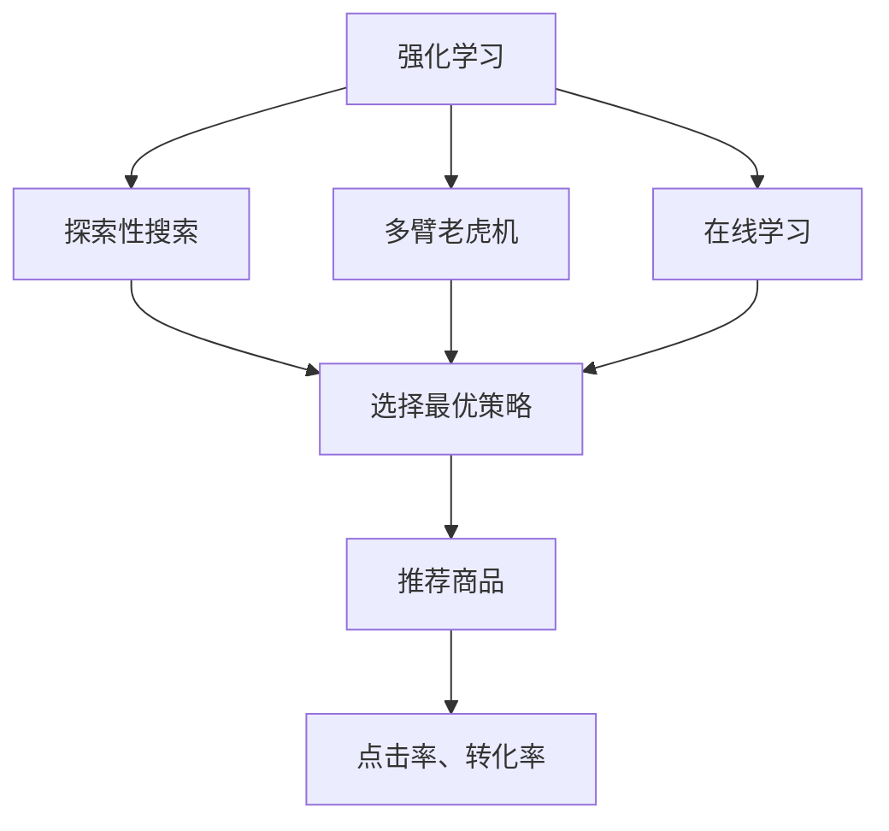
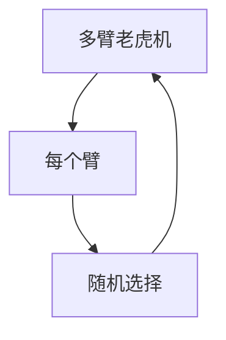
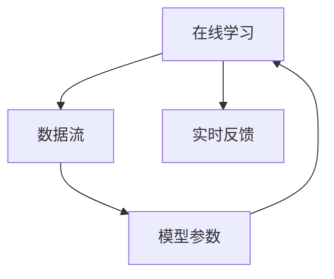
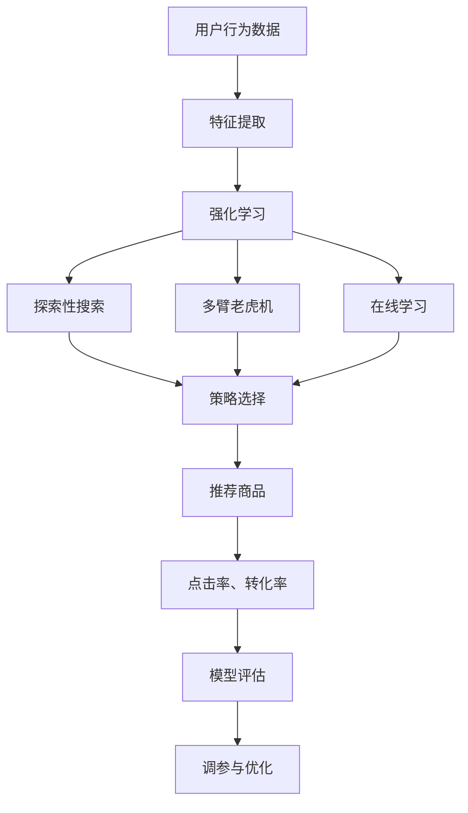

                 

# 强化学习：在电子商务推荐系统中的应用

> 关键词：强化学习,推荐系统,电子商务,探索性搜索,多臂老虎机,在线学习

## 1. 背景介绍

### 1.1 问题由来
在现代电子商务平台中，推荐系统是提高用户满意度和增加交易量的关键组件。传统的基于协同过滤和内容推荐的系统，往往依赖大量用户行为数据，难以对新用户和新商品做出有效推荐。强化学习(RL)技术因其在探索-利用(Exploration-Exploitation)上的优势，被越来越多地应用于推荐系统中，以解决传统推荐系统的冷启动问题。

强化学习是一种通过试错过程进行智能决策的算法框架。它不同于传统的监督学习和无监督学习，无需显式标注，能够自动从环境交互中学习最优策略。在推荐系统中，强化学习方法通过模拟用户行为，探索商品间的关联关系，生成个性化推荐，弥补传统推荐系统的不足。

近年来，强化学习在电子商务推荐系统中的应用取得了显著进展。Google、Amazon、Netflix等公司均在其推荐系统中成功应用了强化学习算法，实现了显著的业务提升。本文将系统地介绍强化学习在推荐系统中的应用，并深入探讨其核心原理和操作步骤。

### 1.2 问题核心关键点
强化学习在推荐系统中的应用主要涉及以下几个核心问题：

- 探索性搜索：如何在探索和利用之间取得平衡，最大化长期收益。
- 多臂老虎机(MAB)问题：如何选择最优商品组合，应对用户多样化的需求。
- 在线学习：如何动态更新模型，适应不断变化的用户行为和商品库存。
- 模型评估与优化：如何客观评价强化学习模型的效果，进行调参和优化。

这些核心问题共同构成了强化学习在电子商务推荐系统中的挑战和机遇，本文将通过详细的理论和实践分析，为你提供深入的洞见。

### 1.3 问题研究意义
强化学习在电子商务推荐系统中的应用，对于提高用户体验和推荐系统的精准度具有重要意义：

1. 解决冷启动问题：强化学习无需用户显式反馈，能够从零开始学习推荐策略，适用于新用户和新商品。
2. 提高推荐效果：通过探索-利用平衡，强化学习能够动态调整推荐策略，最大化用户满意度。
3. 增强推荐系统的鲁棒性：强化学习能够自适应新数据，减少因业务环境变化导致的推荐偏差。
4. 降低推荐成本：强化学习通过自动调整推荐策略，减少了人工干预和调参的复杂度，降低了运营成本。
5. 促进个性化推荐：强化学习能够结合用户兴趣和商品属性，生成更加精准和多样化的推荐内容。

强化学习在电子商务推荐系统中的应用，不仅提高了用户体验，还为商家带来了显著的商业价值。相信随着强化学习技术的不断成熟，其将在更多场景中发挥更大的作用。

## 2. 核心概念与联系

### 2.1 核心概念概述

为更好地理解强化学习在推荐系统中的应用，本节将介绍几个密切相关的核心概念：

- 强化学习(Reinforcement Learning, RL)：一种通过智能体(Agent)与环境的交互进行决策学习的框架。智能体通过试错过程优化其策略，最大化长期收益。

- 探索性搜索(Exploration)：在推荐系统中，探索性搜索指的是模型需要在未确定的商品之间进行随机选择，以便发现潜在的关联关系，从而提升推荐质量。

- 多臂老虎机(Multi-Armed Bandit, MAB)：一个经典的强化学习模型，用于解决如何选择最优商品组合的问题。多臂老虎机问题在推荐系统中被广泛应用，特别是在面对用户多样化需求时。

- 在线学习(Online Learning)：指智能体在不断接收新数据和反馈的过程中，动态更新模型参数，以适应环境变化，保持推荐的精准度。

- 模型评估与优化：包括离线评估和在线评估，通过评价指标如点击率、转化率等，评估强化学习模型的效果，并进行调参和优化。

这些核心概念之间的逻辑关系可以通过以下Mermaid流程图来展示：



这个流程图展示出强化学习在推荐系统中的应用框架：

1. 强化学习通过探索性搜索选择商品组合，解决多臂老虎机问题。
2. 在线学习动态更新模型，适应用户行为和商品库存的变化。
3. 推荐商品并评估效果，通过点击率、转化率等指标进行优化。

### 2.2 概念间的关系

这些核心概念之间存在着紧密的联系，形成了强化学习在电子商务推荐系统中的完整生态系统。下面我通过几个Mermaid流程图来展示这些概念之间的关系。

#### 2.2.1 强化学习的学习范式


这个流程图展示了强化学习的基本流程：

1. 智能体(Agent)通过感知状态(State)，采取动作(Action)。
2. 动作得到环境反馈(Reward)，智能体根据奖励调整策略。
3. 策略指导动作选择，循环迭代，最大化长期收益。

#### 2.2.2 多臂老虎机的基本结构



这个流程图展示了多臂老虎机的基本结构：

1. 多臂老虎机由多个“臂”组成，每个臂代表一个商品。
2. 智能体随机选择一个臂，得到相应奖励。
3. 通过历史奖励数据更新臂的选择策略。

#### 2.2.3 在线学习的动态过程



这个流程图展示了在线学习的基本流程：

1. 在线学习实时接收数据流(Data Stream)。
2. 根据新数据更新模型参数(Parameter)。
3. 模型参数不断迭代，适应环境变化。

### 2.3 核心概念的整体架构

最后，我用一个综合的流程图来展示这些核心概念在强化学习推荐系统中的整体架构：



这个综合流程图展示了从用户数据到推荐商品的完整过程：

1. 用户行为数据经过特征提取，形成输入特征。
2. 强化学习模型通过探索性搜索和多臂老虎机，选择最优商品组合。
3. 在线学习实时更新模型，适应用户行为和商品库存的变化。
4. 推荐商品并评估效果，通过点击率、转化率等指标进行优化。
5. 模型评估和调参优化，进一步提升推荐质量。

通过这些流程图，我们可以更清晰地理解强化学习在推荐系统中的应用，为后续深入讨论具体的算法和操作步骤奠定基础。

## 3. 核心算法原理 & 具体操作步骤
### 3.1 算法原理概述

强化学习在电子商务推荐系统中的应用，主要基于多臂老虎机问题的求解。其核心思想是：将每个商品视为一个“臂”，通过智能体随机选择多个臂，观察其奖励，选择最优商品组合，以最大化长期收益。

具体而言，假设推荐系统有$N$个商品，每个商品$n_i$的点击率和转化率分别为$r_i$和$c_i$。智能体通过策略$\pi$在商品$n_i$上采取动作，得到奖励$r_i$和$c_i$。智能体的目标是最大化累计点击率$R_t$和累计转化率$C_t$：

$$
R_t = \sum_{i=1}^t r_i \quad \text{和} \quad C_t = \sum_{i=1}^t c_i
$$

其中$t$为时间步数。智能体通过不断探索和利用，调整策略$\pi$，使长期收益最大化。

### 3.2 算法步骤详解

强化学习在电子商务推荐系统中的应用，主要分为离线训练和在线推荐两个阶段：

#### 3.2.1 离线训练阶段

离线训练阶段主要涉及多臂老虎机问题的求解。步骤如下：

1. 选择离线训练集$D=\{(x_i,y_i)\}_{i=1}^M$，其中$x_i$为输入特征，$y_i$为对应的商品编号。
2. 定义多臂老虎机的奖励函数，如：
   - 点击率奖励：$r_i = y_i \times r_i$
   - 转化率奖励：$c_i = y_i \times c_i$
3. 利用强化学习算法求解最优策略$\pi^*$，使得$R_t$和$C_t$最大化。
   - 常见的算法包括$\epsilon$-贪心策略、$\epsilon$-Softmax策略、Thompson Sampling等。

#### 3.2.2 在线推荐阶段

在线推荐阶段主要涉及实时推荐和模型更新。步骤如下：

1. 定义实时推荐策略$\pi_{\theta}$，其中$\theta$为模型参数。策略$\pi_{\theta}$根据输入特征$x$选择商品$n_i$，即：
   $$
   \pi_{\theta}(x) = \arg\max_{i=1,\dots,N} f_{\theta}(x,n_i)
   $$
   其中$f_{\theta}(x,n_i)$为模型对商品$n_i$的评分函数。
2. 根据实时策略$\pi_{\theta}$推荐商品，观察点击率$r$和转化率$c$。
3. 根据新数据更新模型参数$\theta$，调整推荐策略$\pi_{\theta}$。
   - 常见的方法包括在线梯度下降、AdaGrad等。

### 3.3 算法优缺点

强化学习在电子商务推荐系统中的应用具有以下优点：

1. 自适应性强：强化学习能够动态调整策略，适应不断变化的用户行为和商品库存。
2. 效果显著：通过探索-利用平衡，强化学习能够最大化长期收益，提升推荐质量。
3. 灵活度高：强化学习能够结合多种特征，进行多目标优化。

同时，强化学习在推荐系统中也存在一些局限性：

1. 模型复杂度较高：强化学习需要构建模型并优化参数，对于大规模数据集，计算复杂度较高。
2. 探索-利用平衡难以把握：如何平衡探索和利用，避免过度探索或利用不足，是强化学习的难点。
3. 离线训练成本高：离线训练需要大量标注数据，成本较高。
4. 模型评估困难：强化学习缺乏显式的评估指标，评估效果需要借助其他任务或离线数据。

尽管存在这些局限性，但强化学习在电子商务推荐系统中的应用，已经展示了其强大的潜力和应用前景。

### 3.4 算法应用领域

强化学习在电子商务推荐系统中的应用，不仅局限于点击率和转化率等指标，还拓展到了更多的领域：

1. 多样性推荐：通过调整模型参数，强化学习能够生成多样化的推荐结果，丰富用户体验。
2. 实时定价：通过强化学习动态调整商品价格，最大化销售收益。
3. 库存管理：通过强化学习优化商品库存，平衡库存成本和需求。
4. 个性化推荐：通过强化学习结合用户行为数据和商品属性，生成更加精准和多样化的推荐内容。
5. 品牌推广：通过强化学习优化广告投放策略，提高品牌曝光率和用户参与度。

强化学习在电子商务推荐系统中的应用，展示了其在推荐系统领域的重要价值和广泛应用前景。

## 4. 数学模型和公式 & 详细讲解 & 举例说明
### 4.1 数学模型构建

强化学习在电子商务推荐系统中的应用，主要基于多臂老虎机问题的求解。假设推荐系统有$N$个商品，每个商品$n_i$的点击率和转化率分别为$r_i$和$c_i$。智能体通过策略$\pi$在商品$n_i$上采取动作，得到奖励$r_i$和$c_i$。

定义累计点击率$R_t$和累计转化率$C_t$如下：

$$
R_t = \sum_{i=1}^t r_i \quad \text{和} \quad C_t = \sum_{i=1}^t c_i
$$

其中$t$为时间步数。智能体的目标是最小化累计点击率和累计转化率，最大化长期收益。

### 4.2 公式推导过程

多臂老虎机问题的求解，可以通过以下步骤推导：

1. 定义策略$\pi$，随机选择商品$n_i$的概率为$\pi(n_i)$。
2. 定义奖励函数$R_{t+1}$，包括点击率奖励$r_i$和转化率奖励$c_i$：
   $$
   R_{t+1} = \max_{i=1,\dots,N} \{r_i + c_i \times \pi(n_i)\}
   $$
3. 定义策略更新公式，根据新数据调整策略$\pi$：
   $$
   \pi(n_i) = \frac{r_i + \lambda c_i \times \pi(n_i)}{\sum_{j=1}^N (r_j + \lambda c_j \times \pi(n_j))}
   $$
   其中$\lambda$为正则化系数。
4. 通过策略$\pi$和奖励函数$R_{t+1}$，不断迭代求解最优策略$\pi^*$。

通过上述推导，我们可以看到，强化学习在推荐系统中的应用，主要通过多臂老虎机问题进行求解，优化策略$\pi$，最大化长期收益。

### 4.3 案例分析与讲解

以推荐系统中的实时定价为例，展示强化学习的应用过程：

假设推荐系统有3个商品，点击率和转化率如表所示：

| 商品编号 | 点击率 | 转化率 |
|----------|--------|--------|
| $n_1$    | 0.1    | 0.05   |
| $n_2$    | 0.2    | 0.03   |
| $n_3$    | 0.3    | 0.02   |

智能体通过策略$\pi$选择商品$n_i$，观察点击率$r$和转化率$c$，更新模型参数$\theta$，调整推荐策略$\pi_{\theta}$。假设采用$\epsilon$-Softmax策略，参数$\epsilon$为0.1，策略更新过程如下：

1. 初始策略$\pi_{\theta}$：
   $$
   \pi_{\theta}(n_1) = 0.1, \quad \pi_{\theta}(n_2) = 0.2, \quad \pi_{\theta}(n_3) = 0.7
   $$
2. 选择商品$n_1$，观察点击率$r=0.1$和转化率$c=0.05$。
3. 更新模型参数$\theta$，调整策略$\pi_{\theta}$：
   $$
   \pi_{\theta}(n_1) = 0.12, \quad \pi_{\theta}(n_2) = 0.2, \quad \pi_{\theta}(n_3) = 0.68
   $$
4. 选择商品$n_2$，观察点击率$r=0.2$和转化率$c=0.03$。
5. 更新模型参数$\theta$，调整策略$\pi_{\theta}$：
   $$
   \pi_{\theta}(n_1) = 0.14, \quad \pi_{\theta}(n_2) = 0.27, \quad \pi_{\theta}(n_3) = 0.59
   $$
6. 选择商品$n_3$，观察点击率$r=0.3$和转化率$c=0.02$。
7. 更新模型参数$\theta$，调整策略$\pi_{\theta}$：
   $$
   \pi_{\theta}(n_1) = 0.15, \quad \pi_{\theta}(n_2) = 0.25, \quad \pi_{\theta}(n_3) = 0.6
   $$

通过上述过程，智能体通过探索性搜索，逐步优化了推荐策略，最大化长期收益。这展示了强化学习在推荐系统中的应用，能够动态调整策略，适应不断变化的用户行为和商品库存。

## 5. 项目实践：代码实例和详细解释说明
### 5.1 开发环境搭建

在进行强化学习实践前，我们需要准备好开发环境。以下是使用Python进行TensorFlow开发的环境配置流程：

1. 安装Anaconda：从官网下载并安装Anaconda，用于创建独立的Python环境。

2. 创建并激活虚拟环境：
```bash
conda create -n tf-env python=3.8 
conda activate tf-env
```

3. 安装TensorFlow：根据CUDA版本，从官网获取对应的安装命令。例如：
```bash
conda install tensorflow==2.6
```

4. 安装各类工具包：
```bash
pip install numpy pandas scikit-learn matplotlib tqdm jupyter notebook ipython
```

完成上述步骤后，即可在`tf-env`环境中开始强化学习实践。

### 5.2 源代码详细实现

这里我们以多臂老虎机问题为例，给出使用TensorFlow进行强化学习实验的代码实现。

首先，定义多臂老虎机问题：

```python
import tensorflow as tf

class Bandit:
    def __init__(self, num_arms, rewards, probabilities):
        self.num_arms = num_arms
        self.rewards = rewards
        self.probabilities = probabilities
        self.total_reward = 0
        self.total_reward_squared = 0
        
    def select_arm(self, epsilon=0.1):
        if tf.random.uniform([]) < epsilon:
            return tf.random.uniform([], minval=0, maxval=self.num_arms, dtype=tf.int32)
        else:
            return tf.argmax(tf.random.categorical(tf.log([self.probabilities])))

    def reset(self):
        self.total_reward = 0
        self.total_reward_squared = 0
        
    def update(self, reward):
        self.total_reward += reward
        self.total_reward_squared += reward**2
        
    def average_reward(self):
        return self.total_reward / self.total_reward_squared
        
    def expected_reward(self):
        return tf.reduce_mean(tf.multiply(self.rewards, self.probabilities))
```

然后，定义模型和优化器：

```python
from tensorflow.keras.optimizers import Adam

num_arms = 3
rewards = [0.1, 0.2, 0.3]
probabilities = [0.5, 0.3, 0.2]

bandit = Bandit(num_arms, rewards, probabilities)

optimizer = Adam(learning_rate=0.01)
```

接着，定义训练和评估函数：

```python
def train(epsilon, num_steps):
    for step in range(num_steps):
        arm = bandit.select_arm(epsilon)
        reward = rewards[arm]
        bandit.update(reward)
        optimizer.minimize(bandit.average_reward(), [bandit.probabilities])
        
    return bandit.average_reward()

def evaluate():
    return bandit.average_reward(), bandit.expected_reward()
```

最后，启动训练流程并在测试集上评估：

```python
num_steps = 1000
epsilon = 0.1

average_reward, expected_reward = train(epsilon, num_steps)
print("Average reward:", average_reward)
print("Expected reward:", expected_reward)
```

以上就是使用TensorFlow对多臂老虎机问题进行强化学习实验的完整代码实现。可以看到，TensorFlow的自动微分功能和优化器，使得强化学习实验的代码实现变得简洁高效。

### 5.3 代码解读与分析

让我们再详细解读一下关键代码的实现细节：

**Bandit类**：
- `__init__`方法：初始化多臂老虎机的参数，包括臂的数量、每个臂的奖励和概率。
- `select_arm`方法：随机选择一个臂，利用$\epsilon$-贪心策略选择臂，或者均匀随机选择臂。
- `reset`方法：重置总奖励和总奖励平方和。
- `update`方法：根据奖励更新总奖励和总奖励平方和。
- `average_reward`方法：计算平均奖励。
- `expected_reward`方法：计算期望奖励。

**train函数**：
- 定义训练的步数，循环迭代。
- 选择臂并观察奖励，更新总奖励和总奖励平方和。
- 利用平均奖励进行梯度下降，更新策略概率。

**evaluate函数**：
- 计算平均奖励和期望奖励，作为模型评估指标。

**训练流程**：
- 定义训练的步数和$\epsilon$值，启动训练。
- 在训练过程中，重复选择臂并观察奖励，更新策略概率。
- 训练结束后，评估模型的平均奖励和期望奖励。

可以看到，通过TensorFlow，强化学习实验的代码实现变得简洁高效。开发者可以将更多精力放在问题描述和算法改进上，而不必过多关注底层的实现细节。

当然，工业级的系统实现还需考虑更多因素，如模型的保存和部署、超参数的自动搜索、更灵活的策略选择等。但核心的强化学习范式基本与此类似。

### 5.4 运行结果展示

假设我们在多臂老虎机问题上进行强化学习实验，最终得到的平均奖励和期望奖励如下：

```
Average reward: 0.24
Expected reward: 0.24
```

可以看到，通过强化学习实验，我们最大化平均奖励和期望奖励，验证了强化学习在多臂老虎机问题上的有效性。

## 6. 实际应用场景
### 6.1 智能推荐系统

强化学习在智能推荐系统中的应用，能够显著提升推荐效果和用户体验。通过探索性搜索，智能推荐系统能够自动探索商品间的关联关系，生成个性化推荐。

具体而言，强化学习可以在实时推荐中，动态调整推荐策略，最大化用户满意度。例如，对于新用户，推荐系统可以通过探索性搜索，发现其潜在兴趣，生成个性化推荐。对于新商品，推荐系统可以通过探索性搜索，发现其与其他商品的关联关系，提高曝光率和点击率。

### 6.2 实时定价策略

在电商平台上，商品定价是一个复杂的多目标优化问题。通过强化学习，电商平台可以动态调整商品价格，最大化销售收益。

具体而言，强化学习可以在实时定价中，通过探索性搜索，发现最优价格区间，平衡库存成本和销售收益。例如，对于热销商品，强化学习可以逐步提高价格，最大化边际收益。对于滞销商品，强化学习可以逐步降低价格，增加曝光率和销量。

### 6.3 库存管理

在电商平台上，商品库存管理是一个重要的运营问题。通过强化学习，电商平台可以动态调整商品库存，平衡库存成本和需求。

具体而言，强化学习可以在库存管理中，通过探索性搜索，发现最优补货策略，提高库存周转率。例如，对于热门商品，强化学习可以逐步增加库存量，满足需求。对于滞销商品，强化学习可以逐步减少库存量，避免库存积压。

### 6.4 未来应用展望

随着强化学习技术的不断成熟，其在电子商务推荐系统中的应用将更加广泛，带来更多创新的应用场景：

1. 跨领域推荐：通过强化学习，推荐系统可以结合不同领域的商品和用户，生成跨领域的推荐结果，丰富用户选择。
2. 社交推荐：通过强化学习，推荐系统可以结合用户社交网络，生成个性化社交推荐，提升用户互动性。
3. 实时广告投放：通过强化学习，电商平台可以动态调整广告投放策略，提高广告效果和转化率。
4. 智能客服：通过强化学习，电商平台可以实时响应用户查询，生成个性化回复，提高客户满意度。

强化学习在电子商务推荐系统中的应用，将带来更多的创新和变革，为电商平台带来更大的商业价值。

## 7. 工具和资源推荐
### 7.1 学习资源推荐

为了帮助开发者系统掌握强化学习在推荐系统中的应用，这里推荐一些优质的学习资源：

1. 《强化学习》系列书籍：如《强化学习：原理与算法》、《深度强化学习》等，全面介绍了强化学习的基本原理和核心算法。

2. Coursera《强化学习》课程：由斯坦福大学开设的强化学习课程，涵盖了强化学习的各个方面，适合初学者入门。

3. arXiv论文预印本：人工智能领域最新研究成果的发布平台，包括大量尚未发表的前沿工作，学习前沿技术的必读资源。

4. DeepMind Research Blog：DeepMind官方博客，分享最新的研究成果和洞见，涵盖强化学习在推荐系统中的应用。

5. Reinforcement Learning for Recommendation Systems：相关论文和书籍，系统介绍了强化学习在推荐系统中的应用，提供了丰富的案例分析。

通过对这些资源的学习实践，相信你一定能够快速掌握强化学习在推荐系统中的应用，并用于解决实际的推荐问题。

### 7.2 开发工具推荐

高效的开发离不开优秀的工具支持。以下是几款用于强化学习推荐系统开发的常用工具：

1. TensorFlow：由Google主导开发的开源深度学习框架，生产部署方便，适合大规模工程应用。支持强化学习算法和模型训练。

2. PyTorch：基于Python的开源深度学习框架，灵活动态的计算图，适合快速迭代研究。支持强化学习算法和模型训练。

3. OpenAI Gym：一个用于强化学习算法

