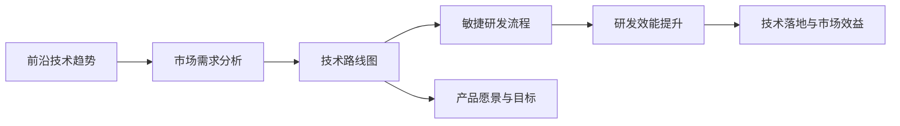
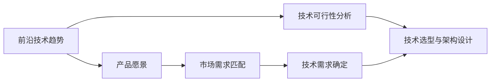
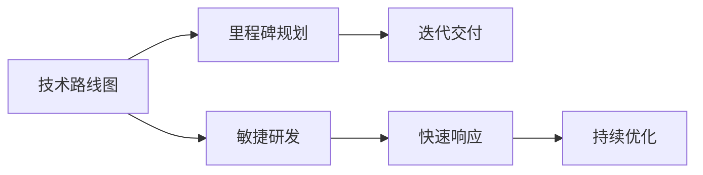
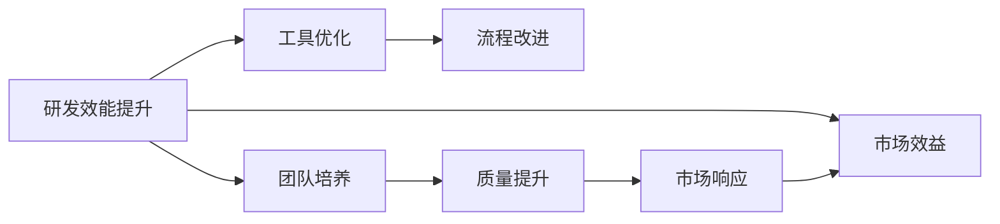
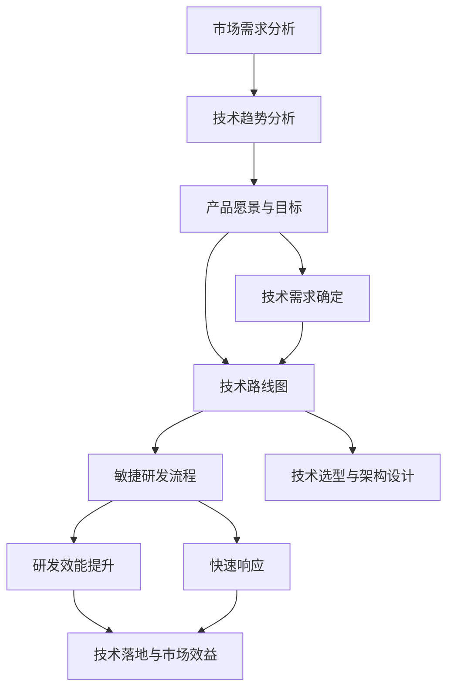

                 

## 1. 背景介绍

### 1.1 问题由来
随着人工智能和软件开发技术的迅猛发展，软件产品的技术路线图规划成为企业实现产品商业化和规模化的关键步骤。然而，当前很多企业仍然在产品规划和技术决策上存在诸多困惑，往往未能紧跟前沿技术趋势，导致产品竞争力不足，市场份额逐渐萎缩。基于此，本文旨在深入分析软件产品技术路线图规划与实施的核心方法和实践，帮助企业实现产品技术的前沿突破和市场成功。

### 1.2 问题核心关键点
软件产品技术路线图规划与实施的核心在于：

- 理解前沿技术趋势与市场需求，确定产品愿景和目标。
- 设计高效的技术架构与研发流程，确保技术可扩展性和产品敏捷性。
- 制定合理的技术路线图，明确各阶段的技术目标和关键里程碑。
- 实现从技术研发到产品商业化的全链路协同，确保技术落地与市场效益。

### 1.3 问题研究意义
正确规划和实施软件产品技术路线图，对于提升企业竞争力，加速产品商业化和规模化具有重要意义：

1. 帮助企业快速响应市场变化，灵活调整产品方向。
2. 指导技术研发与资源配置，提升研发效率和产品质量。
3. 实现技术与市场的有机结合，推动产品快速迭代与优化。
4. 规避技术风险与成本陷阱，确保产品持续增长和市场成功。

## 2. 核心概念与联系

### 2.1 核心概念概述
软件产品技术路线图规划与实施涉及多个核心概念，包括但不限于：

- **前沿技术趋势**：指当前或未来一段时间内计算机科学与工程领域的最新进展和技术方向，如云计算、大数据、人工智能等。
- **市场需求分析**：指对目标市场用户的痛点、需求、竞争情况等的分析和理解。
- **技术路线图**：指基于市场需求和技术趋势，规划和设计软件产品全生命周期的技术架构和研发路径。
- **敏捷研发流程**：指采用迭代和持续交付的方式，实现快速响应市场变化和用户需求。
- **研发效能提升**：指通过工具、流程和团队的优化，提升研发效率和产品质量。

这些核心概念通过以下Mermaid流程图展示其联系：



这个流程图展示了软件产品技术路线图规划与实施的全链路，从技术趋势到市场分析，再到路线图设计、研发流程优化，最终实现产品商业化和技术效益的双赢。

### 2.2 概念间的关系

通过进一步的分解，以下三个核心概念之间的关系更加明晰：

#### 2.2.1 前沿技术趋势与产品愿景


前沿技术趋势为产品愿景的确定提供了方向和依据，通过技术可行性分析和技术选型，确定具体的技术架构和实现方案。

#### 2.2.2 技术路线图与敏捷研发


技术路线图明确了各阶段的技术目标和关键里程碑，通过敏捷研发流程，实现快速迭代和持续交付，确保技术落地与市场效益。

#### 2.2.3 研发效能提升与市场效益


研发效能提升通过优化工具、改进流程和加强团队建设，提高研发效率和产品质量，最终实现市场的快速响应和持续增长。

### 2.3 核心概念的整体架构

最后，我们将所有核心概念融合到一个大图，展示软件产品技术路线图规划与实施的整体架构：



这个整体架构图展示了从市场需求到技术趋势分析，再到产品愿景和技术路线图的确定，通过敏捷研发流程和研发效能提升，最终实现技术落地与市场效益的全链路技术路线图规划与实施过程。

## 3. 核心算法原理 & 具体操作步骤
### 3.1 算法原理概述

软件产品技术路线图规划与实施的原理可以归纳为以下几个关键步骤：

1. **市场需求分析**：通过定量和定性分析，确定目标市场和用户需求。
2. **技术趋势分析**：从技术发展、市场变化和用户反馈等多方面综合分析前沿技术趋势。
3. **产品愿景与目标设定**：基于市场需求和技术趋势，制定具体的产品愿景和目标。
4. **技术路线图设计**：确定各阶段的技术目标和关键里程碑，规划技术选型与架构设计。
5. **敏捷研发流程实施**：采用迭代和持续交付的方式，实现快速响应和市场反馈。
6. **研发效能提升**：通过工具、流程和团队优化，提高研发效率和产品质量。
7. **技术落地与市场效益评估**：定期评估技术路线图实施效果，持续优化和改进。

### 3.2 算法步骤详解

#### 3.2.1 市场需求分析
市场需求分析主要包括两个方面：

- **定量分析**：通过问卷调查、用户反馈、市场报告等数据，量化分析目标市场用户的需求和痛点。
- **定性分析**：通过访谈、焦点小组、用户故事等方式，深入了解用户的需求和期望。

市场需求分析的公式化表示为：

$$
\text{市场需求} = \sum_{i=1}^{n} (\text{用户需求评分}_i \times \text{用户满意度评分}_i)
$$

其中，$n$为调查用户数量，$\text{用户需求评分}_i$和$\text{用户满意度评分}_i$分别为第$i$个用户的评分。

#### 3.2.2 技术趋势分析
技术趋势分析主要分为三个步骤：

1. **技术文献调研**：收集和分析前沿技术论文、会议报告、专利等文献，了解最新的技术进展。
2. **市场动态监控**：通过技术博客、产品发布会、技术论坛等渠道，监测市场上的技术应用和竞争情况。
3. **用户反馈收集**：通过用户调研和产品反馈，收集用户对新技术和新产品的评价和建议。

技术趋势分析的公式化表示为：

$$
\text{技术趋势} = \text{技术文献调研} + \text{市场动态监控} + \text{用户反馈收集}
$$

#### 3.2.3 产品愿景与目标设定
产品愿景与目标的设定主要基于市场需求和技术趋势的综合分析：

1. **产品愿景**：定义产品的长远目标和核心价值，如成为市场领导者、满足用户特定需求等。
2. **产品目标**：设定产品在中短期内的具体目标和里程碑，如提升市场份额、提升用户满意度等。

产品愿景与目标的公式化表示为：

$$
\text{产品愿景} = \text{市场需求} + \text{技术趋势}
$$

$$
\text{产品目标} = \text{产品愿景} \times \text{时间跨度}
$$

#### 3.2.4 技术路线图设计
技术路线图的设计主要包括以下几个步骤：

1. **技术选型与架构设计**：根据产品愿景和目标，选择合适的技术栈和架构方案。
2. **里程碑规划**：确定各阶段的技术目标和关键里程碑，如产品原型、系统测试、市场推广等。
3. **迭代交付计划**：制定每个阶段的迭代交付计划，明确任务和责任。

技术路线图设计的公式化表示为：

$$
\text{技术路线图} = \text{技术选型与架构设计} + \text{里程碑规划} + \text{迭代交付计划}
$$

#### 3.2.5 敏捷研发流程实施
敏捷研发流程的主要实施步骤包括：

1. **迭代计划制定**：根据产品目标和需求，制定迭代计划和任务清单。
2. **持续集成与测试**：实现代码的自动化集成和测试，确保产品质量。
3. **迭代交付与反馈**：定期发布迭代成果，收集用户反馈和市场反馈。

敏捷研发流程的公式化表示为：

$$
\text{敏捷研发流程} = \text{迭代计划制定} + \text{持续集成与测试} + \text{迭代交付与反馈}
$$

#### 3.2.6 研发效能提升
研发效能提升主要通过以下几个方面实现：

1. **工具优化**：选择和使用合适的开发工具和平台，提高开发效率。
2. **流程改进**：优化和规范开发流程，提升项目管理水平。
3. **团队培养**：加强团队建设，提高团队协作和创新能力。

研发效能提升的公式化表示为：

$$
\text{研发效能提升} = \text{工具优化} + \text{流程改进} + \text{团队培养}
$$

#### 3.2.7 技术落地与市场效益评估
技术落地与市场效益评估主要通过以下步骤实现：

1. **市场表现监控**：监测产品市场表现，如销售量、用户增长等。
2. **技术效果评估**：评估技术方案和架构的性能和稳定性。
3. **用户反馈分析**：分析用户反馈，识别和解决问题。

技术落地与市场效益评估的公式化表示为：

$$
\text{技术落地与市场效益评估} = \text{市场表现监控} + \text{技术效果评估} + \text{用户反馈分析}
$$

### 3.3 算法优缺点

软件产品技术路线图规划与实施的算法具有以下优点：

- **系统性**：通过系统性的规划和实施，能够全面考虑市场需求和技术趋势，制定合理的产品目标和路线图。
- **灵活性**：采用敏捷研发流程，能够快速响应市场变化和用户需求，提高产品竞争力和市场适应性。
- **可控性**：通过关键里程碑和迭代交付计划，确保技术落地和市场效益的可控性。

同时，该算法也存在以下缺点：

- **复杂性**：涉及多个环节和复杂的流程，需要较高的管理和协调能力。
- **资源投入大**：前期市场需求分析和技术趋势分析需要大量资源和人力，可能影响项目的快速启动。
- **实施难度大**：需要团队协作和技术积累，对企业的技术和管理能力要求较高。

### 3.4 算法应用领域

软件产品技术路线图规划与实施的算法在多个领域都有广泛应用：

- **企业级软件**：涉及企业信息化、数字化转型等项目，如ERP系统、CRM系统、业务中台等。
- **互联网产品**：涉及电商平台、社交平台、内容平台等，如淘宝、微信、抖音等。
- **物联网应用**：涉及智能家居、智能制造、智慧城市等，如智能音箱、工业4.0、智慧交通等。
- **金融科技产品**：涉及金融信息、支付系统、风险控制等，如支付宝、银行业务系统、保险风控等。
- **医疗健康产品**：涉及电子病历、健康管理、远程医疗等，如电子病历系统、健康监测设备、远程诊疗平台等。

## 4. 数学模型和公式 & 详细讲解 & 举例说明

### 4.1 数学模型构建

软件产品技术路线图规划与实施的数学模型构建主要包括以下几个步骤：

1. **市场需求分析模型**：
   - **输入**：用户调查数据、市场报告、用户反馈等。
   - **输出**：市场需求评分、用户需求评分、用户满意度评分等。

2. **技术趋势分析模型**：
   - **输入**：技术论文、专利、市场动态、用户反馈等。
   - **输出**：技术趋势评分、技术应用评分、技术创新评分等。

3. **产品愿景与目标模型**：
   - **输入**：市场需求评分、技术趋势评分、用户满意度评分等。
   - **输出**：产品愿景评分、产品目标评分、时间跨度评分等。

4. **技术路线图模型**：
   - **输入**：技术选型、架构设计、里程碑规划、迭代交付计划等。
   - **输出**：技术路线图评分、里程碑评分、迭代交付评分等。

5. **敏捷研发流程模型**：
   - **输入**：迭代计划、持续集成、测试计划、交付计划等。
   - **输出**：敏捷研发流程评分、迭代评分、交付评分等。

6. **研发效能提升模型**：
   - **输入**：工具优化、流程改进、团队培养等。
   - **输出**：研发效能提升评分、工具评分、流程评分等。

7. **技术落地与市场效益评估模型**：
   - **输入**：市场表现、技术效果、用户反馈等。
   - **输出**：技术落地评分、市场效益评分、用户反馈评分等。

### 4.2 公式推导过程

#### 4.2.1 市场需求分析模型
市场需求分析模型的公式推导如下：

$$
\text{市场需求} = \sum_{i=1}^{n} (\text{用户需求评分}_i \times \text{用户满意度评分}_i)
$$

其中，$n$为调查用户数量，$\text{用户需求评分}_i$和$\text{用户满意度评分}_i$分别为第$i$个用户的评分。

#### 4.2.2 技术趋势分析模型
技术趋势分析模型的公式推导如下：

$$
\text{技术趋势} = \text{技术文献调研} + \text{市场动态监控} + \text{用户反馈收集}
$$

其中，$\text{技术文献调研}$、$\text{市场动态监控}$、$\text{用户反馈收集}$分别为各部分评分。

#### 4.2.3 产品愿景与目标模型
产品愿景与目标模型的公式推导如下：

$$
\text{产品愿景} = \text{市场需求} + \text{技术趋势}
$$

$$
\text{产品目标} = \text{产品愿景} \times \text{时间跨度}
$$

其中，$\text{市场需求}$、$\text{技术趋势}$、$\text{时间跨度}$分别为各部分评分。

#### 4.2.4 技术路线图模型
技术路线图模型的公式推导如下：

$$
\text{技术路线图} = \text{技术选型与架构设计} + \text{里程碑规划} + \text{迭代交付计划}
$$

其中，$\text{技术选型与架构设计}$、$\text{里程碑规划}$、$\text{迭代交付计划}$分别为各部分评分。

#### 4.2.5 敏捷研发流程模型
敏捷研发流程模型的公式推导如下：

$$
\text{敏捷研发流程} = \text{迭代计划制定} + \text{持续集成与测试} + \text{迭代交付与反馈}
$$

其中，$\text{迭代计划制定}$、$\text{持续集成与测试}$、$\text{迭代交付与反馈}$分别为各部分评分。

#### 4.2.6 研发效能提升模型
研发效能提升模型的公式推导如下：

$$
\text{研发效能提升} = \text{工具优化} + \text{流程改进} + \text{团队培养}
$$

其中，$\text{工具优化}$、$\text{流程改进}$、$\text{团队培养}$分别为各部分评分。

#### 4.2.7 技术落地与市场效益评估模型
技术落地与市场效益评估模型的公式推导如下：

$$
\text{技术落地与市场效益评估} = \text{市场表现监控} + \text{技术效果评估} + \text{用户反馈分析}
$$

其中，$\text{市场表现监控}$、$\text{技术效果评估}$、$\text{用户反馈分析}$分别为各部分评分。

### 4.3 案例分析与讲解

#### 案例一：阿里巴巴的技术路线图规划
阿里巴巴在推进数字化转型过程中，采用了全面的技术路线图规划与实施方法：

1. **市场需求分析**：通过市场调研和用户反馈，确定电商、金融、物流等业务需求。
2. **技术趋势分析**：跟踪云计算、大数据、人工智能等前沿技术进展。
3. **产品愿景与目标设定**：定义成为全球领先的数字化平台和生态系统的愿景，设定市场份额和用户满意度目标。
4. **技术路线图设计**：采用微服务架构、云计算等技术，分阶段推进企业信息化和数字化转型。
5. **敏捷研发流程实施**：通过DevOps平台实现代码自动化集成和测试，实现快速迭代和持续交付。
6. **研发效能提升**：引入DevOps工具、优化流程、加强团队建设，提升研发效率和产品质量。
7. **技术落地与市场效益评估**：监测市场表现和技术效果，通过用户反馈持续优化产品。

阿里巴巴通过系统化的技术路线图规划与实施，实现了业务的快速迭代和市场的持续增长，成为数字化转型的典范。

#### 案例二：特斯拉的自动驾驶技术研发
特斯拉在推进自动驾驶技术研发过程中，采用了敏捷的研发流程和高效的技术落地方法：

1. **市场需求分析**：分析全球对自动驾驶技术的需求和用户痛点。
2. **技术趋势分析**：跟踪计算机视觉、深度学习、感知技术等前沿技术进展。
3. **产品愿景与目标设定**：定义实现完全自动驾驶的目标，设定技术指标和里程碑。
4. **技术路线图设计**：采用深度学习和计算机视觉技术，分阶段推进自动驾驶系统的研发。
5. **敏捷研发流程实施**：通过GitHub、Jira等工具实现代码版本管理和迭代交付。
6. **研发效能提升**：优化工具、改进流程、加强团队协作，提高研发效率和创新能力。
7. **技术落地与市场效益评估**：通过测试和用户反馈，不断优化自动驾驶系统，提升用户体验和市场竞争力。

特斯拉通过敏捷的研发流程和高效的技术落地方法，实现了自动驾驶技术的快速迭代和市场应用，成为自动驾驶领域的领军企业。

## 5. 项目实践：代码实例和详细解释说明

### 5.1 开发环境搭建

#### 5.1.1 工具和平台选择
在开发环境搭建方面，选择和使用合适的工具和平台至关重要：

1. **版本控制工具**：选择Git，通过GitHub、GitLab等平台进行代码管理。
2. **开发工具**：选择IDE如Visual Studio、PyCharm、Eclipse等，提高开发效率。
3. **持续集成工具**：选择Jenkins、Travis CI、GitLab CI等，实现代码自动化集成和测试。
4. **容器化平台**：选择Docker、Kubernetes等，实现应用的容器化和集群管理。
5. **协作工具**：选择Slack、Microsoft Teams、Trello等，促进团队协作和沟通。

#### 5.1.2 开发环境配置

以下是一个简单的开发环境配置示例：

1. **安装Python**：
   ```bash
   sudo apt-get update
   sudo apt-get install python3
   ```

2. **安装Python环境管理工具**：
   ```bash
   sudo apt-get install virtualenv
   ```

3. **创建虚拟环境**：
   ```bash
   virtualenv myenv
   source myenv/bin/activate
   ```

4. **安装依赖包**：
   ```bash
   pip install numpy pandas scikit-learn requests
   ```

5. **开发环境测试**：
   ```python
   import pandas as pd
   df = pd.read_csv('data.csv')
   print(df.head())
   ```

### 5.2 源代码详细实现

#### 5.2.1 需求分析模块
需求分析模块主要通过问卷调查和用户反馈，分析目标市场用户需求：

```python
from typing import Dict

class DemandAnalysis:
    def __init__(self):
        self.demand_data: Dict = {}
    
    def collect_data(self):
        # 问卷调查
        self.demand_data['survey'] = self._survey()
        # 用户反馈
        self.demand_data['feedback'] = self._feedback()
    
    def _survey(self):
        # 问卷调查逻辑
        pass
    
    def _feedback(self):
        # 用户反馈逻辑
        pass
    
    def get_demand_score(self):
        # 计算需求评分
        pass
```

#### 5.2.2 技术趋势分析模块
技术趋势分析模块主要通过技术文献调研、市场动态监控和用户反馈，分析前沿技术趋势：

```python
from typing import Dict

class TechTrendAnalysis:
    def __init__(self):
        self.trend_data: Dict = {}
    
    def collect_data(self):
        # 技术文献调研
        self.trend_data['tech_papers'] = self._tech_papers()
        # 市场动态监控
        self.trend_data['market_news'] = self._market_news()
        # 用户反馈
        self.trend_data['user_feedback'] = self._user_feedback()
    
    def _tech_papers(self):
        # 技术论文调研逻辑
        pass
    
    def _market_news(self):
        # 市场动态监控逻辑
        pass
    
    def _user_feedback(self):
        # 用户反馈逻辑
        pass
    
    def get_trend_score(self):
        # 计算趋势评分
        pass
```

#### 5.2.3 产品愿景与目标设定模块
产品愿景与目标设定模块主要基于市场需求和技术趋势的综合分析，设定产品愿景和目标：

```python
from typing import Dict

class VisionAndGoal:
    def __init__(self):
        self.vision_data: Dict = {}
        self.goal_data: Dict = {}
    
    def set_vision(self, demand_score: int, trend_score: int):
        # 设定产品愿景
        self.vision_data['vision'] = self._set_vision(demand_score, trend_score)
    
    def set_goal(self, vision_score: int, time_span: int):
        # 设定产品目标
        self.goal_data['goal'] = self._set_goal(vision_score, time_span)
    
    def _set_vision(self, demand_score: int, trend_score: int):
        # 设定产品愿景逻辑
        pass
    
    def _set_goal(self, vision_score: int, time_span: int):
        # 设定产品目标逻辑
        pass
```

#### 5.2.4 技术路线图设计模块
技术路线图设计模块主要基于产品愿景和目标，规划技术选型和架构设计，制定迭代交付计划：

```python
from typing import Dict

class TechRoadmap:
    def __init__(self):
        self.roadmap_data: Dict = {}
    
    def set_tech_choices(self, vision_score: int):
        # 设定技术选型
        self.roadmap_data['tech_choices'] = self._set_tech_choices(vision_score)
    
    def set_architecture(self, tech_choices: Dict):
        # 设定架构设计
        self.roadmap_data['architecture'] = self._set_architecture(tech_choices)
    
    def set_milestones(self, vision_score: int):
        # 设定里程碑规划
        self.roadmap_data['milestones'] = self._set_milestones(vision_score)
    
    def set_iteration_plan(self, vision_score: int):
        # 设定迭代交付计划
        self.roadmap_data['iteration_plan'] = self._set_iteration_plan(vision_score)
    
    def _set_tech_choices(self, vision_score: int):
        # 设定技术选型逻辑
        pass
    
    def _set_architecture(self, tech_choices: Dict):
        # 设定架构设计逻辑
        pass
    
    def _set_milestones(self, vision_score: int):
        # 设定里程碑规划逻辑
        pass
    
    def _set_iteration_plan(self, vision_score: int):
        # 设定迭代交付计划逻辑
        pass
```

#### 5.2.5 敏捷研发流程实施模块
敏捷研发流程实施模块主要通过迭代计划、持续集成和迭代交付，实现快速响应和市场反馈：

```python
from typing import Dict

class AgileDevOps:
    def __init__(self):
        self.devops_data: Dict = {}
    
    def set_iteration_plan(self, goal_score: int):
        # 设定迭代计划
        self.devops_data['iteration_plan'] = self._set_iteration_plan(goal_score)
    
    def set_continuous_integration(self, iteration_plan: Dict):
        # 设定持续集成
        self.devops_data['continuous_integration'] = self._set_continuous_integration(iteration_plan)
    
    def set_iteration_delivery(self, iteration_plan: Dict):
        # 设定迭代交付
        self.devops_data['iteration_delivery'] = self._set

