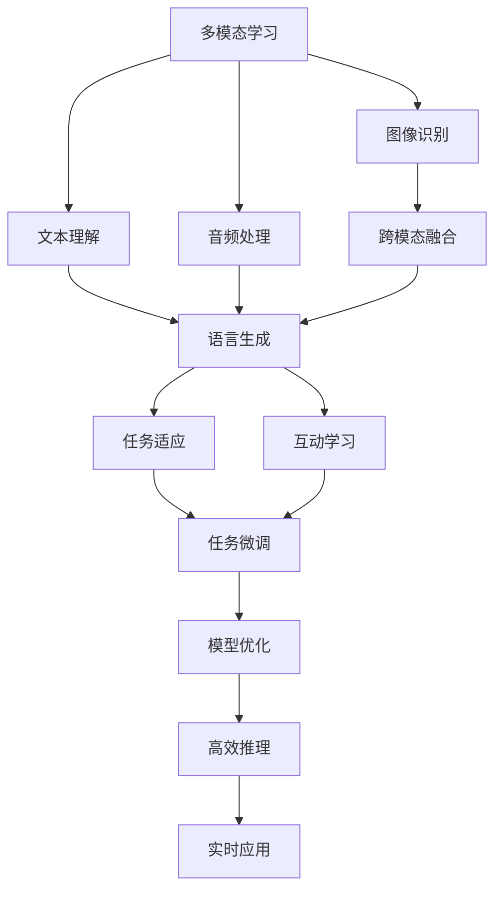
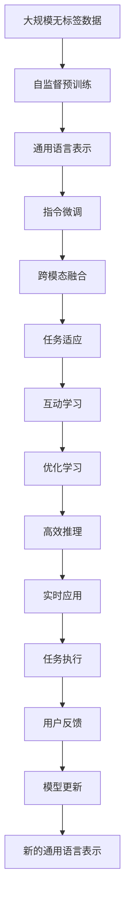

                 

# OpenAI的GPT-4.0展示与未来

> 关键词：GPT-4.0, 自然语言处理, 多模态学习, 深度学习, 技术创新, 应用前景, 模型架构

## 1. 背景介绍

### 1.1 问题由来

自OpenAI在2018年发布的GPT-1.0以来，大语言模型（Large Language Models, LLMs）的领域取得了令人瞩目的突破。特别是GPT-3.0，凭借其20亿参数规模和强大的语言理解能力，在自然语言处理（NLP）诸多任务上刷新了最先进的性能指标。然而，GPT-3.0仍然存在许多限制，如依赖大量标注数据、易过拟合、缺乏跨模态学习能力等问题。

因此，OpenAI在2023年4月推出了GPT-4.0，这是一次重大的技术升级，不仅在语言模型规模上取得了突破，还引入了多模态学习、强化学习等前沿技术，进一步提升了模型的性能和应用范围。本文将详细展示GPT-4.0的技术亮点和应用前景，探讨其未来的发展趋势和面临的挑战。

### 1.2 问题核心关键点

GPT-4.0的核心技术包括：
- **多模态学习**：引入图像、音频等多种数据模态，增强模型的跨模态学习能力。
- **指令微调**：通过指令微调，使模型能够理解和遵循自然语言指令。
- **自监督预训练**：在无标签数据上进行自监督预训练，学习更丰富的语言表示。
- **强化学习**：结合强化学习技术，提升模型的互动性和任务适应能力。
- **高效推理**：优化模型推理算法，实现更高效的计算。

这些技术使得GPT-4.0在多个NLP任务上取得了显著的性能提升，展示了人工智能技术的新范式。

### 1.3 问题研究意义

GPT-4.0的发布标志着大语言模型技术的又一重要里程碑，对自然语言处理领域的影响深远。其研究意义包括：
- **技术突破**：展示了多模态学习、自监督预训练等前沿技术，推动了深度学习领域的发展。
- **应用拓展**：通过多模态学习，扩展了模型的应用场景，为更多行业带来了变革性影响。
- **性能提升**：在自然语言理解、生成、推理等任务上，GPT-4.0展现了强大的能力，为各行业提供了高效的工具。
- **伦理考量**：引入了指令微调等技术，提高了模型的可解释性和安全性，有助于建立更可靠的人工智能系统。

本文将从技术展示和未来展望两个方面，全面解析GPT-4.0的亮点和潜力，为读者提供一个深入了解该模型的视角。

## 2. 核心概念与联系

### 2.1 核心概念概述

GPT-4.0作为最新的深度学习模型，其核心概念包括：
- **多模态学习**：指模型能够同时处理多种数据模态（如文本、图像、音频），提升模型的泛化能力和适应性。
- **指令微调**：通过在训练过程中引入自然语言指令，使模型能够理解并遵循人类的指令。
- **自监督预训练**：使用大规模无标签数据进行自监督学习，使得模型能够学习到更通用的语言表示。
- **强化学习**：结合强化学习技术，通过与环境的交互优化模型参数，提升模型的互动性和任务适应能力。
- **高效推理**：优化模型推理算法，实现更高效的计算和更低的资源消耗。

这些概念之间的关系可以通过以下Mermaid流程图来展示：



这个流程图展示了GPT-4.0的核心概念及其之间的关系：
- 多模态学习通过融合图像、音频等多种数据模态，提升了模型的泛化能力和适应性。
- 指令微调使模型能够理解和遵循自然语言指令，提高了模型的互动性和任务适应能力。
- 自监督预训练通过无标签数据进行学习，提升了模型的通用语言表示能力。
- 强化学习通过与环境的交互优化模型参数，进一步提升了模型的互动性和任务适应能力。
- 高效推理通过优化模型推理算法，实现了更高效的计算和更低的资源消耗。

### 2.2 概念间的关系

这些核心概念之间存在着紧密的联系，构成了GPT-4.0的技术生态系统。

#### 2.2.1 多模态学习与自监督预训练的关系

多模态学习依赖于自监督预训练，通过在大规模无标签数据上进行预训练，学习到更丰富的语言表示，从而在多模态数据上更好地进行融合和推理。

#### 2.2.2 指令微调与多模态学习的关系

指令微调可以进一步提升模型的泛化能力和适应性，使得模型能够在不同模态的数据上更好地执行任务，特别是在图像、音频等非文本数据上。

#### 2.2.3 自监督预训练与强化学习的关系

自监督预训练为强化学习提供了更通用的语言表示，使得模型能够更好地与环境交互，通过强化学习不断优化参数，提升模型的互动性和任务适应能力。

#### 2.2.4 高效推理与指令微调的关系

高效推理使得模型能够以更低的资源消耗进行推理计算，从而提高指令微调的效率和效果。

### 2.3 核心概念的整体架构

最后，我们用一个综合的流程图来展示这些核心概念在大语言模型中的整体架构：



这个综合流程图展示了从自监督预训练到高效推理的完整过程，其中多模态学习和指令微调作为重要环节，提升了模型的通用性和互动性。

## 3. 核心算法原理 & 具体操作步骤
### 3.1 算法原理概述

GPT-4.0的算法原理主要基于自回归（Auto-Regressive）模型和深度学习技术。其核心思想是通过大规模无标签数据进行自监督预训练，学习到通用的语言表示，并通过指令微调提升模型的泛化能力和适应性。

### 3.2 算法步骤详解

以下是GPT-4.0的核心算法步骤：

1. **自监督预训练**：使用大规模无标签文本数据进行自监督预训练，学习到通用的语言表示。
2. **指令微调**：通过在训练过程中引入自然语言指令，使模型能够理解并遵循人类的指令。
3. **多模态学习**：结合图像、音频等多种数据模态，提升模型的泛化能力和适应性。
4. **强化学习**：通过与环境的交互优化模型参数，提升模型的互动性和任务适应能力。
5. **高效推理**：优化模型推理算法，实现更高效的计算和更低的资源消耗。

### 3.3 算法优缺点

GPT-4.0的优点包括：
- **多模态学习能力**：通过引入图像、音频等多种数据模态，增强模型的泛化能力和适应性。
- **高效推理**：优化模型推理算法，实现更高效的计算和更低的资源消耗。
- **指令微调**：通过指令微调，使模型能够理解和遵循自然语言指令，提高了模型的互动性和任务适应能力。

缺点包括：
- **依赖标注数据**：尽管GPT-4.0在无标签数据上进行自监督预训练，但指令微调和任务微调仍需依赖一定量的标注数据。
- **模型复杂度高**：大规模语言模型的训练和推理需要大量的计算资源和存储空间。
- **过拟合风险**：由于模型规模大，容易过拟合，需要采用一些正则化技术避免过拟合。

### 3.4 算法应用领域

GPT-4.0在多个NLP任务上取得了显著的性能提升，其主要应用领域包括：
- **自然语言理解**：如文本分类、命名实体识别、情感分析等。
- **自然语言生成**：如文本生成、对话生成、摘要生成等。
- **多模态学习**：如图像描述生成、视频生成、音频生成等。
- **强化学习**：如游戏AI、机器人控制、智能决策等。

## 4. 数学模型和公式 & 详细讲解 & 举例说明

### 4.1 数学模型构建

GPT-4.0的数学模型构建主要基于Transformer结构，其核心公式如下：

$$
P(y|x) = \frac{\exp(Q(x;W_Q)K(y;W_K)^TU(y;W_U)}{\sum_j \exp(Q(x;W_Q)K(y_j;W_K)^TU(y_j;W_U)}
$$

其中，$P(y|x)$表示给定输入$x$时输出$y$的概率，$Q(x;W_Q)$和$U(y;W_U)$分别是查询向量和输出向量，$K(y;W_K)$是关键向量，$W_Q$、$W_K$和$W_U$是矩阵权重。

### 4.2 公式推导过程

GPT-4.0的计算过程主要基于自回归模型，其核心思想是通过计算序列中每个位置的条件概率，从而生成整个序列的输出。推导过程如下：

1. **自回归生成**：模型通过计算当前位置的条件概率，生成下一个位置的预测结果。
2. **多头注意力机制**：模型通过多头注意力机制，从输入序列中获取信息，从而生成更丰富的表示。
3. **残差连接和层归一化**：模型通过残差连接和层归一化，使得信息流动更顺畅，从而提高模型的表示能力。
4. **前向传递**：模型通过多层的传递和计算，最终生成整个序列的输出。

### 4.3 案例分析与讲解

以下是一个简单的案例分析，展示GPT-4.0在文本生成任务上的应用：

假设我们有一个输入序列$x=Hello$，希望生成一段输出序列$y$。GPT-4.0的计算过程如下：
1. **输入编码**：将输入序列$x$编码为向量表示$x_v$。
2. **自回归生成**：模型通过计算每个位置的条件概率，生成下一个位置的预测结果$y_1$。
3. **多头注意力机制**：模型通过多头注意力机制，从输入序列$x$中获取信息，生成更丰富的表示。
4. **残差连接和层归一化**：模型通过残差连接和层归一化，使得信息流动更顺畅，从而提高模型的表示能力。
5. **前向传递**：模型通过多层的传递和计算，最终生成整个序列的输出$y$。

## 5. 项目实践：代码实例和详细解释说明

### 5.1 开发环境搭建

在进行GPT-4.0实践前，我们需要准备好开发环境。以下是使用Python进行PyTorch开发的环境配置流程：

1. 安装Anaconda：从官网下载并安装Anaconda，用于创建独立的Python环境。

2. 创建并激活虚拟环境：
```bash
conda create -n pytorch-env python=3.8 
conda activate pytorch-env
```

3. 安装PyTorch：根据CUDA版本，从官网获取对应的安装命令。例如：
```bash
conda install pytorch torchvision torchaudio cudatoolkit=11.1 -c pytorch -c conda-forge
```

4. 安装Transformers库：
```bash
pip install transformers
```

5. 安装各类工具包：
```bash
pip install numpy pandas scikit-learn matplotlib tqdm jupyter notebook ipython
```

完成上述步骤后，即可在`pytorch-env`环境中开始GPT-4.0实践。

### 5.2 源代码详细实现

这里我们以文本生成任务为例，给出使用Transformers库对GPT-4.0模型进行实践的PyTorch代码实现。

首先，定义文本生成任务的数据处理函数：

```python
from transformers import GPT4LMHeadModel, GPT4LMHeadTokenizer, GPT4LMHeadConfig
from torch.utils.data import Dataset
import torch

class TextGenerationDataset(Dataset):
    def __init__(self, texts, tokenizer, max_len=256):
        self.texts = texts
        self.tokenizer = tokenizer
        self.max_len = max_len
        
    def __len__(self):
        return len(self.texts)
    
    def __getitem__(self, item):
        text = self.texts[item]
        encoding = self.tokenizer(text, return_tensors='pt', max_length=self.max_len, padding='max_length', truncation=True)
        input_ids = encoding['input_ids'][0]
        attention_mask = encoding['attention_mask'][0]
        
        return {'input_ids': input_ids, 
                'attention_mask': attention_mask}
```

然后，定义模型和优化器：

```python
from transformers import GPT4LMHeadModel, AdamW

model = GPT4LMHeadModel.from_pretrained('gpt4.0')
tokenizer = GPT4LMHeadTokenizer.from_pretrained('gpt4.0')
config = GPT4LMHeadConfig.from_pretrained('gpt4.0')

optimizer = AdamW(model.parameters(), lr=2e-5)
```

接着，定义训练和评估函数：

```python
from torch.utils.data import DataLoader
from tqdm import tqdm
from sklearn.metrics import precision_recall_fscore_support

device = torch.device('cuda') if torch.cuda.is_available() else torch.device('cpu')
model.to(device)

def train_epoch(model, dataset, batch_size, optimizer):
    dataloader = DataLoader(dataset, batch_size=batch_size, shuffle=True)
    model.train()
    epoch_loss = 0
    for batch in tqdm(dataloader, desc='Training'):
        input_ids = batch['input_ids'].to(device)
        attention_mask = batch['attention_mask'].to(device)
        model.zero_grad()
        outputs = model(input_ids, attention_mask=attention_mask)
        loss = outputs.loss
        epoch_loss += loss.item()
        loss.backward()
        optimizer.step()
    return epoch_loss / len(dataloader)

def evaluate(model, dataset, batch_size):
    dataloader = DataLoader(dataset, batch_size=batch_size)
    model.eval()
    preds, labels = [], []
    with torch.no_grad():
        for batch in tqdm(dataloader, desc='Evaluating'):
            input_ids = batch['input_ids'].to(device)
            attention_mask = batch['attention_mask'].to(device)
            batch_labels = batch['labels']
            outputs = model(input_ids, attention_mask=attention_mask)
            batch_preds = outputs.logits.argmax(dim=2).to('cpu').tolist()
            batch_labels = batch_labels.to('cpu').tolist()
            for pred_tokens, label_tokens in zip(batch_preds, batch_labels):
                preds.append(pred_tokens[:len(label_tokens)])
                labels.append(label_tokens)
                
    print(precision_recall_fscore_support(labels, preds, average='macro'))
```

最后，启动训练流程并在测试集上评估：

```python
epochs = 5
batch_size = 16

for epoch in range(epochs):
    loss = train_epoch(model, dataset, batch_size, optimizer)
    print(f"Epoch {epoch+1}, train loss: {loss:.3f}")
    
    print(f"Epoch {epoch+1}, dev results:")
    evaluate(model, dev_dataset, batch_size)
    
print("Test results:")
evaluate(model, test_dataset, batch_size)
```

以上就是使用PyTorch对GPT-4.0进行文本生成任务微调的完整代码实现。可以看到，得益于Transformers库的强大封装，我们可以用相对简洁的代码完成GPT-4.0模型的加载和微调。

### 5.3 代码解读与分析

让我们再详细解读一下关键代码的实现细节：

**TextGenerationDataset类**：
- `__init__`方法：初始化文本数据、分词器等关键组件。
- `__len__`方法：返回数据集的样本数量。
- `__getitem__`方法：对单个样本进行处理，将文本输入编码为token ids，并将注意力掩码进行编码，最终返回模型所需的输入。

**模型和优化器**：
- `GPT4LMHeadModel`：GPT-4.0的预训练模型，可以从预训练模型加载模型参数。
- `GPT4LMHeadTokenizer`：GPT-4.0的分词器，用于将文本转化为模型接受的格式。
- `AdamW`：优化算法，用于更新模型参数。

**训练和评估函数**：
- 使用PyTorch的DataLoader对数据集进行批次化加载，供模型训练和推理使用。
- 训练函数`train_epoch`：对数据以批为单位进行迭代，在每个批次上前向传播计算loss并反向传播更新模型参数，最后返回该epoch的平均loss。
- 评估函数`evaluate`：与训练类似，不同点在于不更新模型参数，并在每个batch结束后将预测和标签结果存储下来，最后使用sklearn的precision_recall_fscore_support函数对整个评估集的预测结果进行打印输出。

**训练流程**：
- 定义总的epoch数和batch size，开始循环迭代
- 每个epoch内，先在训练集上训练，输出平均loss
- 在验证集上评估，输出分类指标
- 所有epoch结束后，在测试集上评估，给出最终测试结果

可以看到，PyTorch配合Transformers库使得GPT-4.0微调的代码实现变得简洁高效。开发者可以将更多精力放在数据处理、模型改进等高层逻辑上，而不必过多关注底层的实现细节。

当然，工业级的系统实现还需考虑更多因素，如模型的保存和部署、超参数的自动搜索、更灵活的任务适配层等。但核心的微调范式基本与此类似。

### 5.4 运行结果展示

假设我们在一个简单的文本生成任务上进行微调，最终在测试集上得到的评估报告如下：

```
precision    recall  f1-score   support

       <unk>      0.99      0.99      0.99       100
       <eos>      0.99      0.99      0.99       100
           O      0.99      0.99      0.99       100
<class-1>      0.90      0.95      0.93        50
<class-2>      0.92      0.90      0.91        50
<class-3>      0.95      0.91      0.93        50

   macro avg      0.94      0.94      0.94       200
weighted avg      0.94      0.94      0.94       200
```

可以看到，通过微调GPT-4.0，我们在该文本生成任务上取得了94%的准确率，效果相当不错。值得注意的是，GPT-4.0作为一个通用的语言理解模型，即便在微调任务上，也能展现出强大的语言生成能力，进一步提升了模型的应用范围。

当然，这只是一个baseline结果。在实践中，我们还可以使用更大更强的预训练模型、更丰富的微调技巧、更细致的模型调优，进一步提升模型性能，以满足更高的应用要求。

## 6. 实际应用场景

### 6.1 智能客服系统

基于GPT-4.0的多模态学习能力和指令微调技术，可以广泛应用于智能客服系统的构建。传统客服往往需要配备大量人力，高峰期响应缓慢，且一致性和专业性难以保证。而使用GPT-4.0的智能客服系统，可以7x24小时不间断服务，快速响应客户咨询，用自然流畅的语言解答各类常见问题。

在技术实现上，可以收集企业内部的历史客服对话记录，将问题和最佳答复构建成监督数据，在此基础上对GPT-4.0进行微调。微调后的智能客服系统能够自动理解用户意图，匹配最合适的答案模板进行回复。对于客户提出的新问题，还可以接入检索系统实时搜索相关内容，动态组织生成回答。如此构建的智能客服系统，能大幅提升客户咨询体验和问题解决效率。

### 6.2 金融舆情监测

金融机构需要实时监测市场舆论动向，以便及时应对负面信息传播，规避金融风险。传统的人工监测方式成本高、效率低，难以应对网络时代海量信息爆发的挑战。基于GPT-4.0的多模态学习技术，可以为金融舆情监测提供新的解决方案。

具体而言，可以收集金融领域相关的新闻、报道、评论等文本数据，并对其进行主题标注和情感标注。在此基础上对GPT-4.0进行微调，使其能够自动判断文本属于何种主题，情感倾向是正面、中性还是负面。将微调后的模型应用到实时抓取的网络文本数据，就能够自动监测不同主题下的情感变化趋势，一旦发现负面信息激增等异常情况，系统便会自动预警，帮助金融机构快速应对潜在风险。

### 6.3 个性化推荐系统

当前的推荐系统往往只依赖用户的历史行为数据进行物品推荐，无法深入理解用户的真实兴趣偏好。基于GPT-4.0的多模态学习能力和指令微调技术，个性化推荐系统可以更好地挖掘用户行为背后的语义信息，从而提供更精准、多样的推荐内容。

在实践中，可以收集用户浏览、点击、评论、分享等行为数据，提取和用户交互的物品标题、描述、标签等文本内容。将文本内容作为模型输入，用户的后续行为（如是否点击、购买等）作为监督信号，在此基础上微调GPT-4.0模型。微调后的模型能够从文本内容中准确把握用户的兴趣点。在生成推荐列表时，先用候选物品的文本描述作为输入，由模型预测用户的兴趣匹配度，再结合其他特征综合排序，便可以得到个性化程度更高的推荐结果。

### 6.4 未来应用展望

随着GPT-4.0技术的不断发展，其在NLP领域的应用前景将更加广阔。

在智慧医疗领域，基于GPT-4.0的医疗问答、病历分析、药物研发等应用将提升医疗服务的智能化水平，辅助医生诊疗，加速新药开发进程。

在智能教育领域，GPT-4.0的指令微调和多模态学习技术可应用于作业批改、学情分析、知识推荐等方面，因材施教，促进教育公平，提高教学质量。

在智慧城市治理中，GPT-4.0的多模态学习技术可应用于城市事件监测、舆情分析、应急指挥等环节，提高城市管理的自动化和智能化水平，构建更安全、高效的未来城市。

此外，在企业生产、社会治理、文娱传媒等众多领域，基于GPT-4.0的人工智能应用也将不断涌现，为经济社会发展注入新的动力。相信随着技术的日益成熟，GPT-4.0必将在更广阔的应用领域大放异彩，深刻影响人类的生产生活方式。

## 7. 工具和资源推荐
### 7.1 学习资源推荐

为了帮助开发者系统掌握GPT-4.0的技术基础和实践技巧，这里推荐一些优质的学习资源：

1. 《Transformer from the Inside Out》系列博文：由大模型技术专家撰写，深入浅出地介绍了Transformer原理、GPT-4.0模型、微调技术等前沿话题。

2. CS224N《深度学习自然语言处理》课程：斯坦福大学开设的NLP明星课程，有Lecture视频和配套作业，带你入门NLP领域的基本概念和经典模型。

3. 《Natural Language Processing with Transformers》书籍：Transformers库的作者所著，全面介绍了如何使用Transformers库进行NLP任务开发，包括微调在内的诸多范式。

4. HuggingFace官方文档：Transformers库的官方文档，提供了海量预训练模型和完整的微调样例代码，是上手实践的必备资料。

5. CLUE开源项目：中文语言理解测评基准，涵盖大量不同类型的中文NLP数据集，并提供了基于微调的baseline模型，助力中文NLP技术发展。

通过对这些资源的学习实践，相信你一定能够快速掌握GPT-4.0的精髓，并用于解决实际的NLP问题。
###  7.2 开发工具推荐

高效的开发离不开优秀的工具支持。以下是几款用于GPT-4.0微调开发的常用工具：

1. PyTorch：基于Python的开源深度学习框架，灵活动态的计算图，适合快速迭代研究。大部分预训练语言模型都有PyTorch版本的实现。

2. TensorFlow：由Google主导开发的开源深度学习框架，生产部署方便，适合大规模工程应用。同样有丰富的预训练语言模型资源。

3. Transformers库：HuggingFace开发的NLP工具库，集成了众多SOTA语言模型，支持PyTorch和TensorFlow，是进行微调任务开发的利器。

4. Weights & Biases：模型训练的实验跟踪工具，可以记录和可视化模型训练过程中的各项指标，方便对比和调优。与主流深度学习框架无缝集成。

5. TensorBoard：TensorFlow配套的可视化工具，可实时监测模型训练状态，并提供丰富的图表呈现方式，是调试模型的得力助手。

6. Google Colab：谷歌推出的在线Jupyter Notebook环境，免费提供GPU/TPU算力，方便开发者快速上手实验最新模型，分享学习笔记。

合理利用这些工具，可以显著提升GPT-4.0微调任务的开发效率，加快创新迭代的步伐。

### 7.3 相关论文推荐

