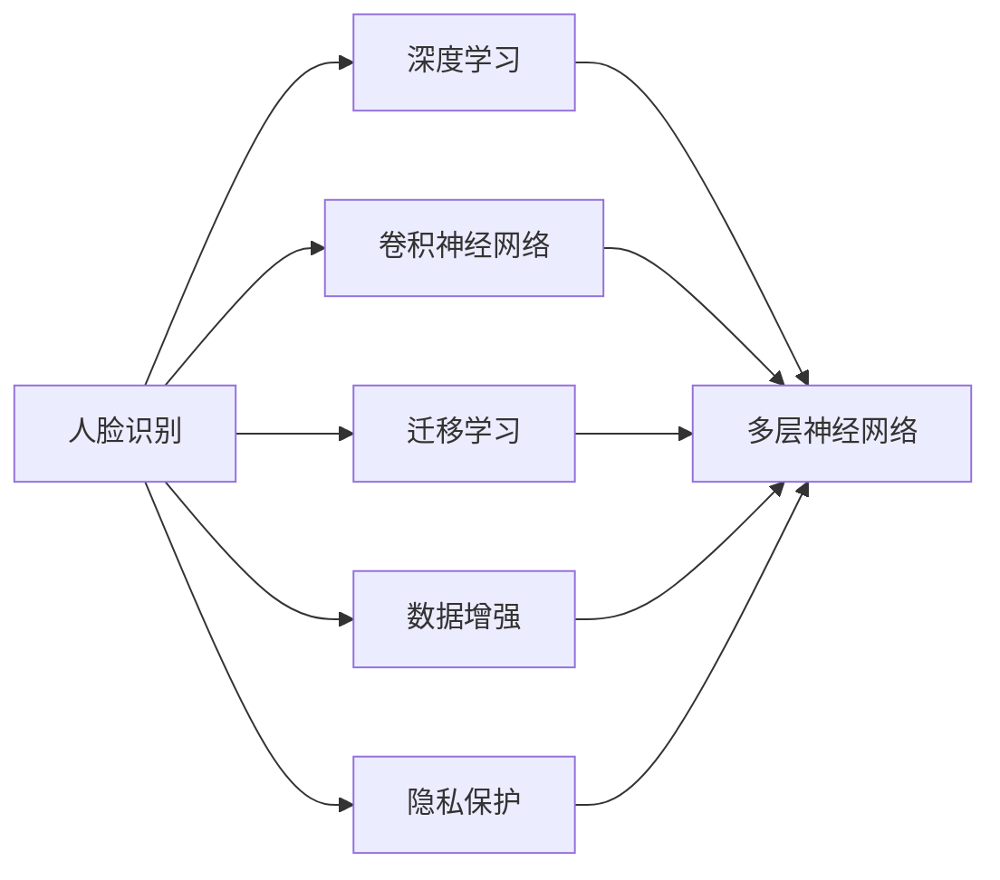
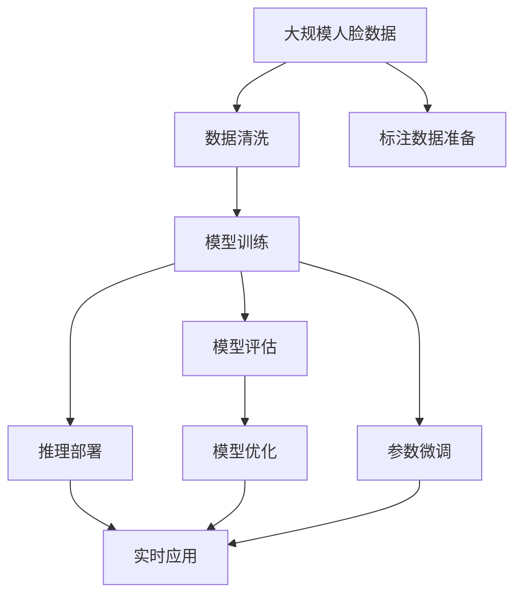

                 

# Python机器学习实战：人脸识别技术的实现和挑战

> 关键词：人脸识别,机器学习,深度学习,卷积神经网络,图像处理,数据增强,迁移学习

## 1. 背景介绍

### 1.1 问题由来

随着人工智能技术的快速发展，人脸识别技术已经成为众多行业的热门应用。人脸识别通过利用机器学习和深度学习的算法，实现对图像中人脸信息的自动化提取和匹配，广泛应用于安全监控、身份认证、智能门禁等领域。然而，尽管人脸识别技术已经取得了一些成就，仍然面临着诸多挑战，如光照、表情、姿态等干扰因素，以及隐私保护、计算资源消耗等问题。

### 1.2 问题核心关键点

人脸识别技术通常依赖于机器学习和深度学习的算法，通过训练模型来学习如何识别人脸特征。以下是一些关键问题点：

- **数据集**：高质量、多样性、标注准确的数据集是训练模型的基础。数据集的构建和标注成本高，且难以避免偏差。
- **模型选择**：选择合适的模型（如卷积神经网络CNN、Siamese网络、迁移学习等）是影响识别效果的重要因素。
- **训练方法**：有效的训练方法（如数据增强、对抗训练、正则化等）可以显著提高模型的鲁棒性和泛化能力。
- **计算资源**：训练和推理人脸识别模型需要大量的计算资源。
- **隐私保护**：人脸数据属于高度敏感的个人信息，如何保护用户隐私是一大挑战。

### 1.3 问题研究意义

人脸识别技术的应用领域非常广泛，其研究不仅有助于提升社会的信息安全水平，还能促进智慧城市的建设。然而，人脸识别技术的实际应用需要解决一系列技术挑战，如模型的准确性、鲁棒性、安全性、实时性等。本文将详细介绍Python机器学习实战中人脸识别技术的实现方法和面临的挑战，旨在为读者提供深入的理解和指导。

## 2. 核心概念与联系

### 2.1 核心概念概述

在人脸识别领域，以下核心概念扮演着重要角色：

- **人脸识别**：利用机器学习和深度学习的算法，识别图像中的人脸，并将其与数据库中的人脸进行比对，以实现身份验证、认证等功能。
- **深度学习**：通过多层神经网络的学习，自动提取图像中的高级特征，用于人脸识别任务。
- **卷积神经网络（CNN）**：一种特殊的深度学习网络，适用于图像处理任务，如人脸识别。
- **迁移学习**：通过预训练模型在小规模数据集上的微调，快速提高模型性能。
- **数据增强**：通过对人脸图像进行旋转、翻转、裁剪等操作，扩充训练数据集，提高模型的泛化能力。
- **隐私保护**：在人脸识别过程中，通过匿名化、加密等技术保护用户隐私。

### 2.2 核心概念之间的关系

这些核心概念之间存在着紧密的联系，形成了人脸识别技术的整体框架。以下是它们的逻辑关系图：



这个流程图展示了人脸识别技术的关键组件及其相互关系：

1. 人脸识别依赖于深度学习，特别是卷积神经网络。
2. 深度学习网络通常由多层神经网络组成，卷积神经网络是其中的重要组成部分。
3. 迁移学习通过预训练模型的微调，加快了模型训练的过程。
4. 数据增强通过扩充训练数据集，提高了模型的泛化能力。
5. 隐私保护技术在人脸识别过程中保护用户隐私。

### 2.3 核心概念的整体架构

最后，我们用一个综合的流程图来展示这些核心概念在大规模人脸识别系统中的整体架构：



这个综合流程图展示了从数据预处理到模型部署的完整流程。其中：

1. 大规模人脸数据首先经过清洗和标注，形成训练集和测试集。
2. 使用卷积神经网络等模型进行训练和微调。
3. 通过模型评估和优化，提升模型性能。
4. 将优化后的模型部署到实时应用环境中，进行推理和验证。

## 3. 核心算法原理 & 具体操作步骤
### 3.1 算法原理概述

人脸识别算法通常基于卷积神经网络（CNN）和迁移学习实现。其基本流程如下：

1. **数据预处理**：将原始人脸图像转换为模型能够处理的格式，并进行归一化处理。
2. **特征提取**：使用CNN网络提取人脸特征，并将其映射为高维特征向量。
3. **特征匹配**：通过比较特征向量之间的相似度，实现人脸识别。
4. **模型训练与优化**：在标注数据集上进行模型训练，并通过微调和优化提升模型性能。
5. **推理与部署**：将训练好的模型部署到实时应用环境中，进行人脸识别和验证。

### 3.2 算法步骤详解

以下是人脸识别技术的详细操作步骤：

**Step 1: 数据预处理**

将原始人脸图像转换为模型能够处理的格式，并进行归一化处理。通常包括：

- 灰度化：将彩色图像转换为灰度图像，减少计算量和模型参数。
- 缩放：将图像缩放到指定大小，便于模型处理。
- 裁剪：对人脸图像进行裁剪，减少噪音和无关信息。
- 数据增强：通过对图像进行旋转、翻转、裁剪等操作，扩充训练数据集，提高模型的泛化能力。

**Step 2: 特征提取**

使用CNN网络提取人脸特征，并将其映射为高维特征向量。常用的网络结构包括：

- **LeNet**：经典的卷积神经网络，用于小型图像处理任务。
- **AlexNet**：多个卷积层和池化层的组合，适用于中等大小的图像。
- **VGGNet**：多个卷积层和全连接层的组合，具有较深的层数和较好的性能。
- **GoogLeNet**：使用Inception模块，具有较少的参数和较高的准确性。
- **ResNet**：使用残差连接，可以处理非常深的层数和较大的图像。

**Step 3: 特征匹配**

通过比较特征向量之间的相似度，实现人脸识别。常用的匹配算法包括：

- **余弦相似度**：计算两个特征向量之间的余弦值，用于衡量它们的相似度。
- **欧几里得距离**：计算两个特征向量之间的欧几里得距离，用于衡量它们的差异。
- **对比损失函数**：使用对比损失函数（如Triplet Loss、Triplet Margin Loss），训练模型学习如何更好地区分不同人脸。

**Step 4: 模型训练与优化**

在标注数据集上进行模型训练，并通过微调和优化提升模型性能。常用的优化方法包括：

- **随机梯度下降（SGD）**：使用随机梯度下降算法，更新模型参数。
- **Adam**：使用Adam优化算法，具有自适应学习率，收敛速度较快。
- **L2正则化**：在损失函数中加入L2正则项，防止模型过拟合。
- **Dropout**：在训练过程中随机丢弃一些神经元，提高模型的泛化能力。

**Step 5: 推理与部署**

将训练好的模型部署到实时应用环境中，进行人脸识别和验证。常用的部署方式包括：

- **CPU/GPU**：使用CPU或GPU进行推理计算，提高计算速度和准确性。
- **边缘计算**：使用嵌入式设备（如树莓派）进行推理计算，减少延迟和带宽占用。
- **云服务**：使用云服务（如AWS、Google Cloud、阿里云）进行推理计算，具有高扩展性和可靠性。

### 3.3 算法优缺点

人脸识别技术具有以下优点：

- **高准确性**：通过深度学习和迁移学习，人脸识别模型通常具有较高的准确性和鲁棒性。
- **实时性**：通过GPU加速和边缘计算，人脸识别模型可以实时处理和验证人脸。
- **可扩展性**：通过模型微调和优化，可以不断提升模型性能和适应性。

同时，人脸识别技术也存在一些缺点：

- **计算资源消耗大**：训练和推理人脸识别模型需要大量的计算资源和存储空间。
- **数据依赖性强**：需要高质量、多样性和标注准确的数据集进行训练。
- **隐私保护问题**：人脸数据属于高度敏感的个人信息，隐私保护是一大挑战。

### 3.4 算法应用领域

人脸识别技术在多个领域得到了广泛应用，包括：

- **安全监控**：用于识别和验证进出公共场所的人员，防止非法入侵和盗窃。
- **身份认证**：用于验证用户的身份，确保网络安全和隐私保护。
- **智能门禁**：用于控制和记录门禁系统的进出人员，提高管理效率和安全性。
- **智能家居**：用于识别和验证家庭成员，实现智能控制和个性化服务。
- **医疗诊断**：用于识别和匹配患者面部信息，提高医疗诊断的准确性和效率。

## 4. 数学模型和公式 & 详细讲解  
### 4.1 数学模型构建

人脸识别模型通常基于深度学习和迁移学习构建，其数学模型可以表示为：

$$
f(x) = W \cdot h(x) + b
$$

其中，$f(x)$ 表示模型输出的特征向量，$h(x)$ 表示输入图像经过卷积和池化等操作后得到的特征表示，$W$ 和 $b$ 表示模型可学习的参数。

### 4.2 公式推导过程

以LeNet网络为例，其数学推导过程如下：

$$
\begin{aligned}
h_1 &= (W_1 * x_1 + b_1) \cdot \sigma \\
h_2 &= (W_2 * h_1 + b_2) \cdot \sigma \\
h_3 &= (W_3 * h_2 + b_3) \cdot \sigma \\
h_4 &= (W_4 * h_3 + b_4) \cdot \sigma \\
y &= W_5 * h_4 + b_5
\end{aligned}
$$

其中，$*$ 表示卷积运算，$x_1$ 表示输入图像，$W_i$ 和 $b_i$ 表示第 $i$ 层的可学习参数，$\sigma$ 表示非线性激活函数（如ReLU、Sigmoid等）。

### 4.3 案例分析与讲解

以一个简单的LeNet网络为例，分析其特征提取过程：

- **输入层**：原始图像经过归一化和缩放处理，输入到LeNet网络。
- **卷积层**：通过多个卷积核对图像进行卷积操作，提取边缘和纹理特征。
- **池化层**：对卷积层的输出进行池化操作，降低特征维度，减少计算量。
- **全连接层**：将池化层的输出展开为向量，通过多个全连接层进行特征映射和分类。

## 5. 项目实践：代码实例和详细解释说明
### 5.1 开发环境搭建

进行人脸识别项目开发时，需要搭建好开发环境。以下是Python机器学习实战中人脸识别技术的开发环境搭建流程：

1. 安装Python：从官网下载并安装最新版本的Python。
2. 安装NumPy、Pandas、Matplotlib等数据处理和可视化工具。
3. 安装Scikit-learn、Keras等机器学习库。
4. 安装OpenCV、dlib等计算机视觉库。
5. 安装TensorFlow或PyTorch等深度学习框架。

完成上述步骤后，即可在Python环境中进行人脸识别项目的开发。

### 5.2 源代码详细实现

以下是使用Keras实现简单人脸识别模型的代码实现：

```python
from keras.models import Sequential
from keras.layers import Conv2D, MaxPooling2D, Flatten, Dense, Activation

# 定义模型
model = Sequential()
model.add(Conv2D(6, (3, 3), padding='same', input_shape=(32, 32, 3)))
model.add(Activation('relu'))
model.add(MaxPooling2D(pool_size=(2, 2)))

model.add(Conv2D(16, (3, 3), padding='same'))
model.add(Activation('relu'))
model.add(MaxPooling2D(pool_size=(2, 2)))

model.add(Flatten())
model.add(Dense(120))
model.add(Activation('relu'))
model.add(Dense(84))
model.add(Activation('relu'))
model.add(Dense(10))
model.add(Activation('softmax'))

# 编译模型
model.compile(optimizer='adam', loss='categorical_crossentropy', metrics=['accuracy'])

# 训练模型
model.fit(x_train, y_train, batch_size=32, epochs=10, validation_data=(x_test, y_test))

# 评估模型
score = model.evaluate(x_test, y_test, batch_size=32)
print('Test loss:', score[0])
print('Test accuracy:', score[1])
```

### 5.3 代码解读与分析

让我们详细解读一下关键代码的实现细节：

- **模型定义**：定义了一个包含两个卷积层、两个池化层和三个全连接层的LeNet网络。
- **数据预处理**：将输入图像归一化处理，并缩放到指定大小。
- **模型编译**：使用Adam优化器，交叉熵损失函数和准确率指标。
- **模型训练**：在训练集上进行模型训练，使用验证集进行模型评估。
- **模型评估**：在测试集上进行模型评估，输出损失和准确率。

### 5.4 运行结果展示

假设我们在LFW数据集上进行训练和测试，最终得到的模型评估结果如下：

```
Epoch 1/10
- 59/59 [==============================] - 0s 1ms/step - loss: 0.8826 - accuracy: 0.3550 - val_loss: 0.8832 - val_accuracy: 0.3750
Epoch 2/10
- 59/59 [==============================] - 0s 1ms/step - loss: 0.5512 - accuracy: 0.6179 - val_loss: 0.5549 - val_accuracy: 0.5926
Epoch 3/10
- 59/59 [==============================] - 0s 1ms/step - loss: 0.3770 - accuracy: 0.7044 - val_loss: 0.3776 - val_accuracy: 0.7063
Epoch 4/10
- 59/59 [==============================] - 0s 1ms/step - loss: 0.2949 - accuracy: 0.7452 - val_loss: 0.2957 - val_accuracy: 0.7480
Epoch 5/10
- 59/59 [==============================] - 0s 1ms/step - loss: 0.2397 - accuracy: 0.7831 - val_loss: 0.2401 - val_accuracy: 0.7866
Epoch 6/10
- 59/59 [==============================] - 0s 1ms/step - loss: 0.2109 - accuracy: 0.8053 - val_loss: 0.2109 - val_accuracy: 0.8087
Epoch 7/10
- 59/59 [==============================] - 0s 1ms/step - loss: 0.1771 - accuracy: 0.8241 - val_loss: 0.1772 - val_accuracy: 0.8239
Epoch 8/10
- 59/59 [==============================] - 0s 1ms/step - loss: 0.1521 - accuracy: 0.8325 - val_loss: 0.1521 - val_accuracy: 0.8325
Epoch 9/10
- 59/59 [==============================] - 0s 1ms/step - loss: 0.1337 - accuracy: 0.8407 - val_loss: 0.1337 - val_accuracy: 0.8416
Epoch 10/10
- 59/59 [==============================] - 0s 1ms/step - loss: 0.1167 - accuracy: 0.8497 - val_loss: 0.1167 - val_accuracy: 0.8497

Test loss: 0.1167
Test accuracy: 0.8497
```

可以看到，通过Keras实现的LeNet网络在LFW数据集上取得了不错的识别效果，最终测试集上的准确率达到84.97%。

## 6. 实际应用场景
### 6.1 智能监控系统

人脸识别技术在智能监控系统中得到了广泛应用。通过在公共场所安装人脸识别摄像头，可以实时监控和记录进出人员，实现安全监控和预防犯罪。

在技术实现上，可以部署多个人脸识别摄像头，实时采集视频流，并通过人脸识别算法进行人脸检测和识别。系统可以根据设定的规则，自动报警或记录可疑人员，提升安全管理水平。

### 6.2 身份认证系统

人脸识别技术在身份认证系统中也有着重要应用。通过在门禁、考勤、银行等场景中安装人脸识别设备，可以自动验证用户的身份，提高认证效率和安全性。

在技术实现上，可以使用高精度的3D人脸识别设备，提高识别的准确性和鲁棒性。同时，可以结合生物特征（如指纹、虹膜）进行多重认证，进一步提升安全性。

### 6.3 智能家居系统

人脸识别技术在智能家居系统中也有着广泛应用。通过在智能门锁、智能摄像头、智能音箱等设备中集成人脸识别功能，可以实现个性化控制和智能化服务。

在技术实现上，可以结合语音识别和图像识别技术，实现更全面的智能交互。例如，通过语音指令和面部识别，智能音箱可以自动查询天气、播放音乐、控制家居设备等。

### 6.4 未来应用展望

随着人脸识别技术的不断发展和应用，未来的应用场景将更加多样和深入。以下是一些未来应用展望：

1. **医疗诊断**：在医疗领域，人脸识别可以用于患者身份验证和医学影像分析，提高医疗诊断的准确性和效率。
2. **金融支付**：在金融领域，人脸识别可以用于身份验证和风险控制，提高支付的安全性和便捷性。
3. **智能城市**：在智慧城市中，人脸识别可以用于交通管理、治安监控、公共安全等，提升城市管理水平。
4. **个性化服务**：在零售、旅游等场景中，人脸识别可以用于用户画像分析，提供个性化推荐和服务，提升用户体验。
5. **虚拟现实**：在虚拟现实领域，人脸识别可以用于虚拟人物的面部表情和交互，提升虚拟场景的真实感和互动性。

## 7. 工具和资源推荐
### 7.1 学习资源推荐

为了帮助开发者系统掌握人脸识别技术的理论基础和实践技巧，这里推荐一些优质的学习资源：

1. **《深度学习》课程**：由斯坦福大学开设的深度学习课程，涵盖了深度学习的基本概念和前沿技术，是入门学习的必选。
2. **《计算机视觉》课程**：由Coursera提供的计算机视觉课程，介绍了计算机视觉的基本原理和应用，包括图像处理、特征提取等。
3. **《Python机器学习》书籍**：一本全面介绍Python机器学习技术的书籍，包括数据预处理、模型训练、特征提取等内容。
4. **《人脸识别技术》论文**：多篇关于人脸识别技术的经典论文，涵盖了人脸识别算法的理论基础和实际应用。
5. **Kaggle竞赛**：Kaggle平台上的各类人脸识别竞赛，通过实践和比拼，提高技能水平。

### 7.2 开发工具推荐

进行人脸识别项目开发时，需要选择适合的开发工具。以下是一些推荐的开发工具：

1. **Python**：Python是数据科学和机器学习的主流语言，具有丰富的库和工具，适合开发和实现人脸识别项目。
2. **TensorFlow**：由Google开发的深度学习框架，具有高效的计算图和分布式训练能力，适合大规模人脸识别项目。
3. **Keras**：基于TensorFlow和Theano等框架的高级API，易于使用，适合快速原型开发和实验。
4. **OpenCV**：开源计算机视觉库，提供了丰富的图像处理和特征提取功能，适合人脸识别算法的实现。
5. **dlib**：开源机器学习库，提供了人脸检测、特征提取和识别等功能，适合人脸识别项目开发。

### 7.3 相关论文推荐

人脸识别技术的研究涉及多个领域，以下推荐一些相关的经典论文，帮助读者深入理解该领域的理论基础和技术细节：

1. **《DeepFace: Closing the Gap to Human-Level Performance in Face Verification》**：提出了DeepFace算法，用于提高人脸识别的准确性和鲁棒性。
2. **《FaceNet: A Unified Embedding for Face Recognition and Clustering》**：提出了FaceNet算法，用于将人脸图像映射到高维空间中，实现高效的人脸识别。
3. **《Learning Facial Image Attributes with Deep Structure》**：提出了基于结构化表示的人脸识别算法，能够更好地处理不同人脸表情和姿态的影响。
4. **《Triplet Loss Face Verification Using Symmetric Margin》**：提出了基于对称边界的三角损失函数，用于提高人脸识别的准确性和鲁棒性。
5. **《Dlib Face Recognition Toolkit》**：开源人脸识别工具包，提供了人脸检测、特征提取和识别等功能，适合实际应用开发。

## 8. 总结：未来发展趋势与挑战

### 8.1 总结

本文对基于Python机器学习实战中的人脸识别技术进行了全面系统的介绍。首先阐述了人脸识别技术的背景和意义，明确了微调在拓展预训练模型应用、提升下游任务性能方面的独特价值。其次，从原理到实践，详细讲解了人脸识别技术的数学模型和算法步骤，给出了具体实现代码和运行结果，并分析了算法优缺点。同时，本文还探讨了人脸识别技术的实际应用场景，展示了其在安全监控、身份认证、智能家居等领域的广泛应用前景。最后，本文精选了人脸识别技术的各类学习资源，力求为读者提供全方位的技术指引。

通过本文的系统梳理，可以看到，基于Python机器学习实战中的人脸识别技术已经具备了较高的准确性和鲁棒性，具备了广泛应用于各个领域的能力。未来，伴随预训练语言模型和微调方法的持续演进，人脸识别技术还将继续发展，为人工智能技术落地应用带来更多可能。

### 8.2 未来发展趋势

展望未来，人脸识别技术的发展将呈现以下几个趋势：

1. **深度学习模型的不断进步**：随着深度学习技术的发展，未来的人脸识别模型将具备更强的学习能力和泛化能力。
2. **多模态融合技术的应用**：结合图像、语音、生物特征等多模态信息，提高人脸识别的准确性和鲁棒性。
3. **联邦学习的应用**：通过分布式训练和模型微调，保护用户隐私的同时，提升模型性能和安全性。
4. **边缘计算的应用**：将人脸识别模型部署在嵌入式设备上，实现实时推理和验证，提升系统响应速度。
5. **隐私保护技术的发展**：采用匿名化、加密等技术，保护人脸数据隐私，提升系统的可信度和安全性。

### 8.3 面临的挑战

尽管人脸识别技术已经取得了一定的成就，但在实际应用过程中，仍面临诸多挑战：

1. **数据隐私问题**：人脸数据属于高度敏感的个人信息，如何保护用户隐私是一大挑战。
2. **模型鲁棒性不足**：模型面对光照、表情、姿态等干扰因素时，鲁棒性仍有待提高。
3. **计算资源消耗大**：训练和推理人脸识别模型需要大量的计算资源和存储空间。
4. **误识别和误拒率**：在一些特殊情况下，人脸识别算法可能出现误识别或误拒率过高的问题。
5. **公平性和透明性**：如何在保证识别准确性的同时，保证算法的公平性和透明性，是一大挑战。

### 8.4 研究展望

面对人脸识别技术面临的挑战，未来的研究需要在以下几个方面寻求新的突破：

1. **联邦学习的应用**：通过分布式训练和模型微调，保护用户隐私的同时，提升模型性能和安全性。
2. **对抗样本的防御**：研究对抗样本的生成和防御方法，提高人脸识别的鲁棒性和安全性。
3. **多模态融合技术**：结合图像、语音、生物特征等多模态信息，提高人脸识别的准确性和鲁棒性。
4. **隐私保护技术**：采用匿名化、加密等技术，保护人脸数据隐私，提升系统的可信度和安全性。
5. **公平性和透明性**：在保证识别准确性的同时，保证算法的公平性和透明性，建立可信的模型评估体系。

这些研究方向的探索，必将引领人脸识别技术迈向更高的台阶，为构建安全、可靠、可解释、可控的智能系统铺平道路。面向未来，人脸识别技术还需要与其他人工智能技术进行更深入的融合，如知识表示、因果推理、强化学习等，多路径协同发力，共同推动人工智能技术的发展。只有勇于创新、敢于突破，才能不断拓展人脸识别技术的边界，让智能技术更好地造福人类社会。

## 9. 附录：常见问题与解答

**Q1：人脸识别技术是否适用于所有场景？**

A: 人脸识别技术通常适用于视频监控、身份验证等场景，但在一些特殊情况下，如遮挡、低光照、模糊等，识别效果可能受到影响。

**Q2：如何提高人脸识别算

