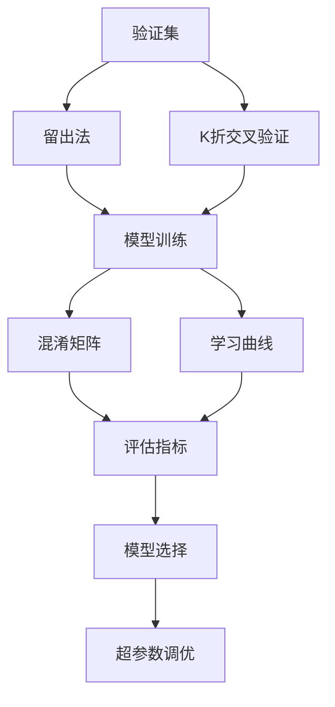

                 

# Python机器学习实战：模型评估与验证的最佳策略

> 关键词：Python, 机器学习, 模型评估, 验证策略, 模型选择, 超参数调优

## 1. 背景介绍

在机器学习领域，构建高性能模型并非终点，更关键的在于验证和评估模型的泛化能力，确保其在实际应用中的表现。模型评估与验证是机器学习中不可或缺的步骤，旨在通过严格的实验设计，检验模型在未知数据上的泛化能力，从而为模型的应用部署提供科学依据。本文将深入探讨机器学习中的模型评估与验证策略，旨在帮助读者掌握最佳实践，提升模型选择与调优的效率。

### 1.1 问题由来

随着机器学习模型的不断成熟，模型选择与评估已成为机器学习实践中最为关键的环节之一。尤其在面对复杂多变的实际应用场景时，如何选择合适的模型、如何设置合理的验证集、如何评估模型的泛化能力等问题，始终困扰着许多数据科学家和工程师。而良好的模型评估与验证策略，不仅可以提升模型性能，还能在一定程度上避免过拟合和欠拟合等常见问题，加速模型的迭代优化。

### 1.2 问题核心关键点

模型评估与验证的核心目标在于，通过一系列精心设计的实验，尽可能客观地评估模型的泛化能力。这包括：
- 选择合适的评估指标和数据集。
- 采用合理的交叉验证策略，减少随机性。
- 设置合适的验证集大小，保证泛化能力。
- 考虑模型选择、调参等关键环节，优化模型性能。

本文将围绕这些核心点，系统阐述机器学习中的模型评估与验证策略，为实践者提供实用的参考。

## 2. 核心概念与联系

### 2.1 核心概念概述

在机器学习中，模型评估与验证涉及多个关键概念，包括但不限于：

- 验证集(Validation Set)：用于模型评估的独立数据集，模型在验证集上的表现作为评估依据。
- 交叉验证(Cross-Validation)：通过将数据集拆分成多个互斥子集，轮流在各个子集上进行模型训练与验证，以提高评估结果的稳定性。
- 留出法(Hold-Out)：最简单的一种验证策略，将数据集分为训练集和验证集，训练集用于模型拟合，验证集用于模型评估。
- 网格搜索(Grid Search)：一种常用的超参数调优方法，通过在预设的超参数网格中搜索最优组合，提高模型性能。
- K折交叉验证(K-Fold CV)：一种常见的交叉验证方法，将数据集分为K个互斥子集，每次用K-1个子集训练，剩余1个子集验证，重复K次。
- 学习曲线(Learning Curve)：通过绘制模型在不同训练集大小下的性能曲线，直观展示模型的学习情况和泛化能力。
- 混淆矩阵(Confusion Matrix)：用于分类任务的性能评估，展示模型在不同类别上的预测表现。

这些概念之间相互关联，共同构成了机器学习中模型评估与验证的完整框架。通过理解这些核心概念，我们可以更好地把握模型评估与验证的最佳实践。

### 2.2 概念间的关系

以下通过一个简单的Mermaid流程图，展示这些核心概念之间的关系：



这个流程图展示了模型评估与验证过程中各个关键步骤及其相互关系：

1. 将数据集划分为训练集和验证集，通过留出法或K折交叉验证策略，进行模型训练和验证。
2. 计算模型在验证集上的性能，通过混淆矩阵、学习曲线等可视化工具，进一步评估模型泛化能力。
3. 根据模型评估结果，选择合适的模型和参数，进行超参数调优。
4. 最终选择最优模型，部署应用于实际任务。

### 2.3 核心概念的整体架构

在机器学习实践中，模型评估与验证是一个循环迭代的过程，通过不断的模型选择与优化，逐步提高模型在实际应用中的性能。


## 3. 核心算法原理 & 具体操作步骤

### 3.1 算法原理概述

机器学习模型评估与验证的核心在于构建一个数据驱动的闭环反馈系统。通过将数据集划分为训练集和验证集，在验证集上进行模型评估，并根据评估结果调整模型参数或选择不同的模型，最终选择最优模型应用于实际任务。

模型评估的常见方法包括留出法、交叉验证等，而模型验证则通过混淆矩阵、学习曲线等指标进行。通过合理设计评估和验证策略，可以最大程度地避免过拟合和欠拟合，确保模型在实际应用中的泛化能力。

### 3.2 算法步骤详解

基于机器学习模型评估与验证的原理，以下是详细的具体操作步骤：

#### 3.2.1 数据准备

- **数据预处理**：包括数据清洗、特征工程、标准化等步骤，确保数据的质量和一致性。
- **数据划分**：将数据集划分为训练集、验证集和测试集。训练集用于模型拟合，验证集用于模型选择和调优，测试集用于最终的性能评估。
- **模型选择**：基于问题类型（如回归、分类等）选择合适的机器学习模型，如线性回归、决策树、随机森林、支持向量机、神经网络等。

#### 3.2.2 模型训练与评估

- **模型拟合**：在训练集上使用优化算法（如梯度下降、Adam等）对模型进行训练，直至收敛。
- **模型验证**：在验证集上评估模型性能，如使用均方误差、准确率、精确度、召回率、F1分数等指标。
- **模型选择**：根据验证集上的性能评估结果，选择最优模型进行后续测试。

#### 3.2.3 模型调优

- **超参数调优**：通过网格搜索、随机搜索等方法，在模型参数空间中寻找最优参数组合，提高模型性能。
- **交叉验证**：使用K折交叉验证策略，进一步验证模型在不同数据子集上的表现，减少随机性。

#### 3.2.4 模型测试

- **模型测试**：在测试集上最终评估模型性能，如使用AUC-ROC曲线、均方误差等指标。
- **结果分析**：分析模型测试结果，评估模型在实际应用中的表现，确定模型的可部署性。

### 3.3 算法优缺点

模型评估与验证方法具有以下优点：
- 能够客观地评估模型在未知数据上的泛化能力。
- 通过交叉验证等策略，减少模型评估的随机性。
- 模型调优能够提高模型的泛化能力和应用性能。

同时，这些方法也存在一些缺点：
- 数据划分可能导致模型评估结果具有偏差。
- 交叉验证等策略会增加计算复杂度。
- 模型调优过程可能耗时较长，需要大量计算资源。

### 3.4 算法应用领域

模型评估与验证方法广泛应用于各类机器学习任务，包括但不限于：

- 回归问题：如房价预测、股票价格预测等，评估模型预测值的准确性。
- 分类问题：如垃圾邮件分类、情感分析等，评估模型在不同类别上的预测性能。
- 聚类问题：如市场细分、用户群体分析等，评估模型对数据的聚类能力。
- 降维问题：如主成分分析、独立成分分析等，评估模型在降维后的数据重构能力。

## 4. 数学模型和公式 & 详细讲解 & 举例说明

### 4.1 数学模型构建

在机器学习中，常用的模型评估与验证数学模型包括：

- 回归问题：均方误差(MSE)、平均绝对误差(MAE)、R平方等指标。
- 分类问题：准确率、精确度、召回率、F1分数等指标。
- 聚类问题：轮廓系数、Calinski-Harabasz指数等指标。

### 4.2 公式推导过程

以回归问题的均方误差为例，推导过程如下：

设训练集为 $\{(x_1, y_1), (x_2, y_2), \ldots, (x_n, y_n)\}$，其中 $x_i$ 为自变量，$y_i$ 为因变量，模型为 $f(x)$，均方误差定义为：

$$
MSE = \frac{1}{n} \sum_{i=1}^{n} (y_i - f(x_i))^2
$$

其中 $n$ 为样本数量。均方误差越小，说明模型拟合越好。

### 4.3 案例分析与讲解

假设我们有一组房价数据，每个数据点包含房屋面积和价格两个特征，目标任务是预测房价。我们可以选择多个回归模型进行训练，如线性回归、岭回归、Lasso回归等。使用交叉验证等策略，评估每个模型在不同数据子集上的性能，最终选择性能最优的模型进行测试。

假设模型在验证集上的均方误差为 $MSE_{cv}$，我们选择性能最好的模型进行最终测试，假设测试集为 $\{(x_1', y_1'), (x_2', y_2'), \ldots, (x_n', y_n')\}$，测试集上的均方误差为 $MSE_{test}$，则评估模型在未知数据上的泛化能力。

## 5. 项目实践：代码实例和详细解释说明

### 5.1 开发环境搭建

在Python中使用scikit-learn库进行模型评估与验证，需要以下步骤：

1. **安装依赖**：
```bash
pip install scikit-learn numpy pandas matplotlib
```

2. **数据准备**：
```python
import pandas as pd
from sklearn.model_selection import train_test_split

# 加载数据
data = pd.read_csv('house_prices.csv')

# 数据清洗
data = data.dropna()

# 划分数据集
X = data.drop('price', axis=1)
y = data['price']

X_train, X_test, y_train, y_test = train_test_split(X, y, test_size=0.2, random_state=42)
```

3. **模型选择**：
```python
from sklearn.linear_model import LinearRegression

# 初始化模型
model = LinearRegression()

# 训练模型
model.fit(X_train, y_train)

# 预测测试集
y_pred = model.predict(X_test)

# 评估模型
from sklearn.metrics import mean_squared_error

mse = mean_squared_error(y_test, y_pred)
print(f'均方误差: {mse:.2f}')
```

### 5.2 源代码详细实现

以下是一个简单的线性回归模型评估与验证的完整代码实现，包括模型选择、训练、验证、测试等步骤：

```python
import pandas as pd
from sklearn.model_selection import train_test_split
from sklearn.linear_model import LinearRegression
from sklearn.metrics import mean_squared_error

# 加载数据
data = pd.read_csv('house_prices.csv')

# 数据清洗
data = data.dropna()

# 划分数据集
X = data.drop('price', axis=1)
y = data['price']

X_train, X_test, y_train, y_test = train_test_split(X, y, test_size=0.2, random_state=42)

# 初始化模型
model = LinearRegression()

# 训练模型
model.fit(X_train, y_train)

# 预测测试集
y_pred = model.predict(X_test)

# 评估模型
mse = mean_squared_error(y_test, y_pred)
print(f'均方误差: {mse:.2f}')

# 交叉验证
from sklearn.model_selection import cross_val_score

scores = cross_val_score(model, X_train, y_train, cv=5)
print(f'交叉验证均方误差: {scores.mean():.2f}')
```

### 5.3 代码解读与分析

这段代码的核心步骤如下：

1. 数据加载与清洗：使用Pandas库加载数据，并进行数据清洗，去除缺失值。
2. 数据划分：使用train_test_split函数将数据集划分为训练集和测试集。
3. 模型初始化与训练：初始化线性回归模型，并使用训练集数据拟合模型。
4. 模型预测与评估：在测试集上进行模型预测，并计算均方误差。
5. 交叉验证：使用cross_val_score函数进行5折交叉验证，计算模型在各个数据子集上的均方误差，平均结果即为模型的性能指标。

### 5.4 运行结果展示

假设交叉验证均方误差为0.05，则说明模型在训练集和测试集上都能较好地预测房价，具有较好的泛化能力。

## 6. 实际应用场景

### 6.1 智能推荐系统

在智能推荐系统中，模型评估与验证策略尤为关键。推荐系统需要评估不同模型在用户行为数据上的预测性能，选择最优模型进行后续优化和部署。

在实际操作中，可以采用交叉验证策略，评估模型在不同用户行为数据子集上的表现，选择性能最好的模型进行迭代优化。通过不断的模型选择与调优，提高推荐系统的个性化推荐能力，提升用户体验。

### 6.2 金融风险预测

在金融风险预测中，模型评估与验证策略同样重要。金融风险预测任务需要评估模型在不同金融市场数据子集上的表现，选择最优模型进行风险预测。

在实际操作中，可以采用网格搜索等策略，调整模型参数和超参数，评估模型在不同数据子集上的表现。通过不断的模型选择与调优，提高模型在金融市场预测中的准确性和稳定性。

### 6.3 医疗疾病预测

在医疗疾病预测中，模型评估与验证策略同样重要。医疗疾病预测任务需要评估模型在不同患者数据子集上的表现，选择最优模型进行疾病预测。

在实际操作中，可以采用交叉验证策略，评估模型在不同患者数据子集上的表现，选择性能最好的模型进行后续优化。通过不断的模型选择与调优，提高模型在疾病预测中的准确性和可靠性。

## 7. 工具和资源推荐

### 7.1 学习资源推荐

为了帮助读者掌握模型评估与验证的最佳策略，以下推荐一些优质的学习资源：

1. 《Python机器学习》书籍：由Sebastian Raschka和Vahid Mirjalili所著，全面介绍了Python在机器学习中的应用，包括模型评估与验证等核心内容。
2. scikit-learn官方文档：scikit-learn库的官方文档，提供了丰富的机器学习模型和评估指标的详细使用指南。
3. Kaggle数据集与竞赛：Kaggle平台提供了大量的机器学习数据集和竞赛，读者可以在实战中学习和实践模型评估与验证策略。
4. Coursera《机器学习》课程：由斯坦福大学Andrew Ng教授主讲，系统介绍了机器学习的基本原理和评估指标。
5. Udacity《机器学习工程师纳米学位》：提供了完整的机器学习项目实战和评估方法指导。

### 7.2 开发工具推荐

模型评估与验证涉及大量数据处理和计算，以下是一些推荐的开发工具：

1. Jupyter Notebook：一个交互式的编程环境，适合进行数据探索和模型评估。
2. Google Colab：一个免费的GPU和TPU支持的环境，适合进行大规模模型评估。
3. Visual Studio Code：一个功能强大的编程编辑器，支持Python和scikit-learn库的集成开发。
4. PyCharm：一个强大的IDE，支持Python和机器学习库的全面开发。
5. TensorBoard：一个可视化工具，可以实时监测模型训练和评估结果。

### 7.3 相关论文推荐

模型评估与验证技术的发展离不开学界的持续研究。以下是几篇奠基性的相关论文，推荐阅读：

1. "Evaluating the Suitability of Cross-Validation and Bootstrap for Checking Model Assumptions and Learning Curve Analysis" 论文：探讨了交叉验证和自助法在模型评估中的适用性和局限性。
2. "A practical guide to cross-validation" 论文：提供了详细实用的交叉验证策略，帮助读者在实际应用中正确使用。
3. "Model validation strategies for deep learning: a critical review" 论文：综述了深度学习模型评估与验证的常用方法和策略，提供了全面的指导。
4. "Grid search and its relationship with the reinforcement learning" 论文：探讨了网格搜索在超参数调优中的应用和优化策略。

## 8. 总结：未来发展趋势与挑战

### 8.1 研究成果总结

模型评估与验证是机器学习实践中的重要环节，其核心目标在于评估模型在未知数据上的泛化能力。通过合理的实验设计和策略选择，能够最大程度地减少过拟合和欠拟合的风险，提升模型性能。

### 8.2 未来发展趋势

未来的模型评估与验证策略将更加注重自动化和智能化：

1. **自动化评估**：自动化评估工具将进一步发展，帮助数据科学家和工程师快速获取模型评估结果，减少人工干预。
2. **模型融合**：融合多模型的评估结果，提高评估结果的稳定性和可靠性。
3. **元学习**：通过元学习技术，自动优化评估策略，提升模型选择和调优的效率。

### 8.3 面临的挑战

尽管模型评估与验证技术已经取得了长足进步，但仍然面临一些挑战：

1. **数据质量**：数据清洗和预处理的质量直接影响模型评估结果的准确性。
2. **模型复杂度**：复杂的模型需要更多的计算资源和时间，评估过程可能变得耗时。
3. **超参数调优**：超参数调优是模型评估与验证中的关键环节，需要大量的计算资源和人工干预。
4. **模型泛化**：模型在测试集上的泛化能力是一个重要的评估指标，但难以准确评估。

### 8.4 研究展望

未来的研究需要在以下几个方面寻求新的突破：

1. **自动化评估方法**：开发自动化的模型评估与验证工具，提高评估效率和准确性。
2. **模型融合技术**：研究融合多模型的评估方法，提高模型评估的稳定性和可靠性。
3. **元学习框架**：探索元学习技术，实现自动化调优和评估策略的优化。
4. **模型公平性**：在评估过程中加入公平性指标，确保模型在各类数据上的公平性。

总之，模型评估与验证技术在未来仍有巨大的发展空间，需要数据科学家和工程师不断探索和创新，才能更好地推动机器学习的应用和发展。

## 9. 附录：常见问题与解答

**Q1: 什么是模型评估与验证？**

A: 模型评估与验证是机器学习中用于评估模型性能的策略。通过在验证集上对模型进行评估，选择最优模型，并在测试集上最终评估模型性能，确保模型在未知数据上的泛化能力。

**Q2: 如何选择合适的评估指标？**

A: 评估指标的选择应根据具体问题和数据类型而定。回归问题通常使用均方误差、平均绝对误差等指标；分类问题通常使用准确率、精确度、召回率、F1分数等指标；聚类问题通常使用轮廓系数、Calinski-Harabasz指数等指标。

**Q3: 如何处理过拟合和欠拟合问题？**

A: 过拟合问题通常通过增加训练数据、正则化、交叉验证等方法解决；欠拟合问题通常通过增加模型复杂度、增加训练时间等方法解决。

**Q4: 如何优化模型调优过程？**

A: 可以使用网格搜索、随机搜索、贝叶斯优化等方法进行超参数调优，通过交叉验证等策略评估模型性能，逐步优化模型参数。

**Q5: 如何提高模型评估的稳定性？**

A: 可以通过增加数据集大小、使用更多的验证集、引入元学习技术等方法提高模型评估的稳定性。

---

作者：禅与计算机程序设计艺术 / Zen and the Art of Computer Programming

