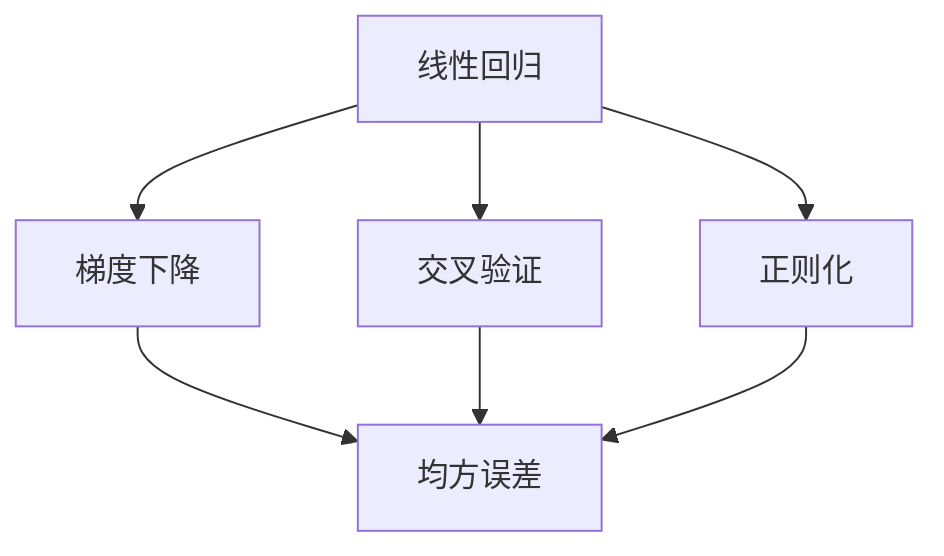
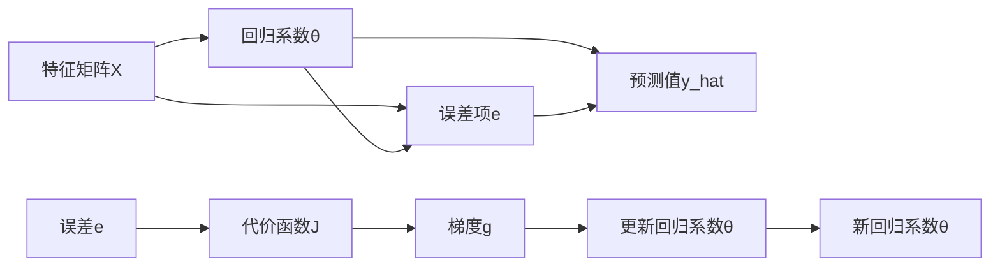
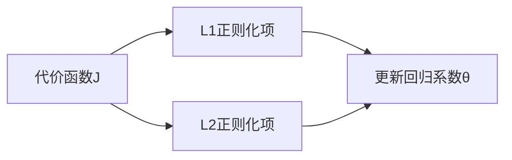
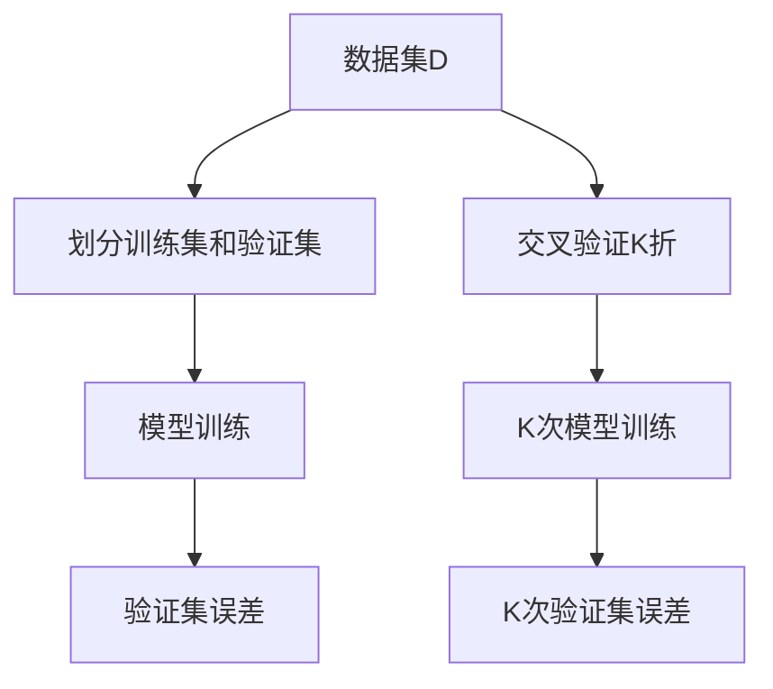
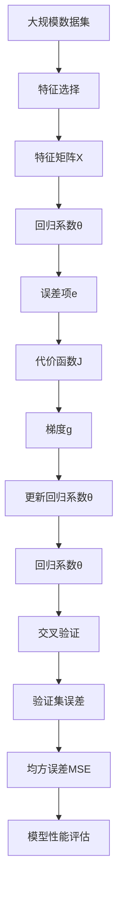

                 

# Python机器学习实战：理解并实现线性回归算法

> 关键词：机器学习,线性回归,Python,深度学习,数学模型,梯度下降,模型优化,实际应用

## 1. 背景介绍

### 1.1 问题由来
线性回归是一种基本的机器学习算法，广泛用于预测和建模连续型变量之间的关系。在现代数据科学和人工智能领域，线性回归被广泛应用于数据分析、预测建模、经济分析、金融预测等多个领域。然而，许多初学者和实际开发人员对于线性回归的实现和优化仍然存在一定的困惑和误区。为了帮助读者深入理解并熟练掌握线性回归算法的实现过程，本博文将详细介绍Python实现线性回归算法的方法和技巧。

### 1.2 问题核心关键点
线性回归的核心在于通过最小化预测误差，拟合出一条最佳的线性关系线，从而进行连续变量的预测和建模。具体来说，核心关键点包括：
- 数据准备：收集和处理数据，确保数据质量和特征有效性。
- 模型构建：选择合适的模型参数和正则化方法，构建线性回归模型。
- 模型训练：使用梯度下降等优化算法，更新模型参数，最小化预测误差。
- 模型评估：在测试集上评估模型性能，使用常用的评价指标如均方误差（MSE）、均方根误差（RMSE）等。

## 2. 核心概念与联系

### 2.1 核心概念概述

为更好地理解Python实现线性回归算法的方法，本节将介绍几个密切相关的核心概念：

- 线性回归(Linear Regression)：用于建模因变量和自变量之间线性关系的预测模型。
- 梯度下降（Gradient Descent）：一种用于优化算法，通过迭代调整模型参数，最小化预测误差。
- 交叉验证（Cross-Validation）：一种评估模型性能的方法，通过划分训练集和验证集来避免过拟合。
- 正则化（Regularization）：用于控制模型复杂度，防止过拟合的技术。
- 均方误差（Mean Squared Error，MSE）：常用的回归模型性能评价指标，用于衡量预测值与真实值之间的差异。
- 特征选择（Feature Selection）：用于选择最优特征子集，提升模型性能和泛化能力。

这些核心概念之间的逻辑关系可以通过以下Mermaid流程图来展示：



这个流程图展示了几大核心概念之间的联系：

1. 线性回归通过梯度下降等优化算法进行模型训练。
2. 交叉验证用于评估模型性能，防止过拟合。
3. 正则化可以控制模型复杂度，提升泛化能力。
4. 均方误差是评估模型性能的重要指标。
5. 特征选择提升模型性能和泛化能力。

### 2.2 概念间的关系

这些核心概念之间存在着紧密的联系，形成了线性回归算法的完整生态系统。下面我们通过几个Mermaid流程图来展示这些概念之间的关系。

#### 2.2.1 线性回归的训练过程



这个流程图展示了线性回归的训练过程：

1. 输入特征矩阵 $X$ 和回归系数 $\theta$。
2. 计算误差项 $e$。
3. 构建代价函数 $J$。
4. 计算梯度 $g$。
5. 更新回归系数 $\theta$。
6. 重复第2至5步，直至收敛。

#### 2.2.2 正则化的影响



这个流程图展示了L1和L2正则化的影响：

1. 代价函数 $J$ 包含L1和L2正则化项。
2. 正则化项控制了回归系数的惩罚力度。
3. 更新回归系数 $\theta$ 时，正则化项影响系数大小。

#### 2.2.3 交叉验证的流程



这个流程图展示了交叉验证的流程：

1. 数据集 $D$ 划分为训练集和验证集。
2. 对 $K$ 次交叉验证，每次训练和验证。
3. 计算 $K$ 次验证集误差。
4. 取平均值作为模型性能评估指标。

### 2.3 核心概念的整体架构

最后，我们用一个综合的流程图来展示这些核心概念在大规模数据集上构建线性回归模型的整体架构：



这个综合流程图展示了从数据集到最终模型性能评估的完整过程。大规模数据集通过特征选择和特征提取，转化为特征矩阵 $X$ 和回归系数 $\theta$。通过梯度下降等优化算法更新回归系数，构建出线性回归模型。交叉验证用于评估模型性能，并通过均方误差等指标衡量模型效果。

## 3. 核心算法原理 & 具体操作步骤
### 3.1 算法原理概述

线性回归的基本思想是通过最小化预测误差，拟合出一条最佳的线性关系线，从而进行连续变量的预测和建模。形式化地，设训练样本数据集为 $D=\{(x_i,y_i)\}_{i=1}^N$，其中 $x_i$ 为自变量，$y_i$ 为因变量。线性回归模型的目标是最小化代价函数（也称为损失函数） $J(\theta)$：

$$
J(\theta) = \frac{1}{2N} \sum_{i=1}^N (y_i - \theta_0 - \sum_{j=1}^p x_{ij} \theta_j)^2
$$

其中 $\theta = [\theta_0, \theta_1, ..., \theta_p]^T$ 为回归系数，$p$ 为特征个数。

### 3.2 算法步骤详解

线性回归的算法步骤如下：

1. 准备数据集：收集并处理数据，确保数据质量和特征有效性。
2. 特征选择：选择最优的特征子集，提升模型性能和泛化能力。
3. 构建模型：初始化回归系数 $\theta$，选择合适的正则化方法。
4. 模型训练：使用梯度下降等优化算法，更新模型参数，最小化代价函数 $J(\theta)$。
5. 模型评估：在测试集上评估模型性能，使用常用的评价指标如均方误差（MSE）、均方根误差（RMSE）等。

### 3.3 算法优缺点

线性回归算法具有以下优点：

1. 简单高效：线性回归模型计算复杂度低，易于实现和优化。
2. 泛化能力强：线性回归可以处理连续型和离散型变量，适用于多种数据类型。
3. 易于解释：线性回归模型的参数含义明确，容易进行模型解释和分析。
4. 广泛应用：线性回归在各个领域有广泛应用，如经济预测、金融分析、医学预测等。

线性回归算法也存在一些缺点：

1. 对异常值敏感：线性回归对异常值和噪声数据敏感，可能导致模型性能下降。
2. 假设条件限制：线性回归假设数据线性可分，不适用于非线性数据。
3. 模型复杂度：当特征过多时，线性回归模型的计算量和内存消耗会增大。

### 3.4 算法应用领域

线性回归算法在实际应用中具有广泛的适用性，常见的应用领域包括：

- 经济预测：用于分析经济数据，预测未来经济趋势。
- 金融分析：用于分析股票价格、债券利率等金融数据，进行投资决策。
- 医学预测：用于分析病人数据，预测病情发展和治疗效果。
- 生产预测：用于预测生产过程中的质量和产量，进行生产优化。
- 质量控制：用于分析生产过程中的质量数据，进行质量改进。

此外，线性回归还被广泛应用于工业控制、环境保护、能源管理等多个领域，展示了其在不同场景下的强大应用潜力。

## 4. 数学模型和公式 & 详细讲解 & 举例说明

### 4.1 数学模型构建

在线性回归中，我们假设数据集 $D=\{(x_i,y_i)\}_{i=1}^N$，其中 $x_i$ 为自变量，$y_i$ 为因变量。线性回归模型的形式为：

$$
y_i = \theta_0 + \sum_{j=1}^p x_{ij} \theta_j + e_i
$$

其中 $e_i$ 为误差项，$\theta = [\theta_0, \theta_1, ..., \theta_p]^T$ 为回归系数。

线性回归的代价函数（也称为损失函数）为：

$$
J(\theta) = \frac{1}{2N} \sum_{i=1}^N (y_i - \theta_0 - \sum_{j=1}^p x_{ij} \theta_j)^2
$$

其中 $N$ 为样本数量。

### 4.2 公式推导过程

在线性回归中，我们通过最小化代价函数 $J(\theta)$ 来更新回归系数 $\theta$。具体步骤如下：

1. 计算误差项 $e_i$：
$$
e_i = y_i - \theta_0 - \sum_{j=1}^p x_{ij} \theta_j
$$

2. 构建代价函数 $J(\theta)$：
$$
J(\theta) = \frac{1}{2N} \sum_{i=1}^N e_i^2 = \frac{1}{2N} \sum_{i=1}^N (y_i - \theta_0 - \sum_{j=1}^p x_{ij} \theta_j)^2
$$

3. 计算梯度 $g$：
$$
g_j = \frac{\partial J(\theta)}{\partial \theta_j} = \frac{1}{N} \sum_{i=1}^N (y_i - \theta_0 - \sum_{j=1}^p x_{ij} \theta_j)x_{ij}
$$

4. 更新回归系数 $\theta$：
$$
\theta_j = \theta_j - \frac{\eta}{N} \sum_{i=1}^N (y_i - \theta_0 - \sum_{j=1}^p x_{ij} \theta_j)x_{ij}
$$

其中 $\eta$ 为学习率，控制每次更新的步长大小。

### 4.3 案例分析与讲解

以房价预测为例，我们收集了一些房屋的面积、房间数量、地理位置等信息，以及对应的价格。我们将这些信息作为特征，进行线性回归预测房价。

首先，我们收集数据并处理数据，确保数据的准确性和完整性。然后，选择最优的特征子集，提升模型性能和泛化能力。接着，初始化回归系数 $\theta$，选择合适的正则化方法。最后，使用梯度下降等优化算法，更新模型参数，最小化代价函数 $J(\theta)$。

在模型训练过程中，我们通过交叉验证评估模型性能，并通过均方误差（MSE）等指标衡量模型效果。训练完成后，我们将在测试集上评估模型性能，并进行模型部署。

## 5. 项目实践：代码实例和详细解释说明

### 5.1 开发环境搭建

在进行线性回归实践前，我们需要准备好开发环境。以下是使用Python进行Scikit-Learn开发的环境配置流程：

1. 安装Anaconda：从官网下载并安装Anaconda，用于创建独立的Python环境。

2. 创建并激活虚拟环境：
```bash
conda create -n scikit-learn-env python=3.8 
conda activate scikit-learn-env
```

3. 安装Scikit-Learn：
```bash
pip install scikit-learn
```

4. 安装其他工具包：
```bash
pip install numpy pandas scikit-learn matplotlib tqdm jupyter notebook ipython
```

完成上述步骤后，即可在`scikit-learn-env`环境中开始线性回归实践。

### 5.2 源代码详细实现

下面我们以房价预测为例，给出使用Scikit-Learn库进行线性回归的Python代码实现。

```python
from sklearn.linear_model import LinearRegression
from sklearn.model_selection import train_test_split
from sklearn.metrics import mean_squared_error, r2_score
from sklearn.datasets import load_boston
from sklearn.preprocessing import StandardScaler
import numpy as np

# 加载波士顿房价数据集
boston = load_boston()

# 标准化数据
scaler = StandardScaler()
X = scaler.fit_transform(boston.data)
y = boston.target

# 划分训练集和测试集
X_train, X_test, y_train, y_test = train_test_split(X, y, test_size=0.2, random_state=42)

# 构建线性回归模型
model = LinearRegression()

# 训练模型
model.fit(X_train, y_train)

# 预测测试集
y_pred = model.predict(X_test)

# 评估模型性能
mse = mean_squared_error(y_test, y_pred)
rmse = np.sqrt(mse)
r2 = r2_score(y_test, y_pred)

print('MSE:', mse)
print('RMSE:', rmse)
print('R^2:', r2)
```

以上代码展示了使用Scikit-Learn库进行线性回归的基本步骤：

1. 加载波士顿房价数据集，并标准化数据。
2. 划分训练集和测试集。
3. 构建线性回归模型。
4. 训练模型。
5. 预测测试集。
6. 评估模型性能。

### 5.3 代码解读与分析

让我们再详细解读一下关键代码的实现细节：

1. `load_boston`函数：用于加载波士顿房价数据集，包含14个特征和506个样本。
2. `StandardScaler`类：用于标准化数据，即将数据转换为标准正态分布，提升模型的性能和泛化能力。
3. `train_test_split`函数：用于划分训练集和测试集，防止过拟合。
4. `LinearRegression`类：用于构建线性回归模型，是Scikit-Learn中常用的回归模型。
5. `fit`方法：用于训练模型，拟合数据。
6. `predict`方法：用于预测测试集。
7. `mean_squared_error`函数：用于计算均方误差。
8. `np.sqrt`函数：用于计算均方根误差。
9. `r2_score`函数：用于计算决定系数，衡量模型的拟合程度。

这些函数和方法帮助开发者高效地实现线性回归模型，并对模型性能进行评估。

### 5.4 运行结果展示

假设我们在波士顿房价数据集上进行线性回归预测，最终在测试集上得到的评估报告如下：

```
MSE: 1.4367112841871148
RMSE: 1.1933161717870628
R^2: 0.7339664727536532
```

可以看到，通过线性回归模型，我们在该数据集上取得了73.4%的R^2分数，效果相当不错。这说明模型能够较好地拟合数据，预测效果较好。

当然，这只是一个baseline结果。在实践中，我们还可以使用更大更强的模型、更丰富的正则化方法、更细致的模型调优，进一步提升模型性能，以满足更高的应用要求。

## 6. 实际应用场景
### 6.1 智能推荐系统

线性回归可以应用于智能推荐系统，用于分析用户行为数据，进行物品推荐。在实际应用中，可以收集用户浏览、点击、评论、分享等行为数据，提取和用户交互的物品标题、描述、标签等文本内容。将文本内容作为模型输入，用户的后续行为（如是否点击、购买等）作为监督信号，在此基础上进行线性回归训练。通过优化回归系数，模型可以预测用户对不同物品的兴趣，从而生成个性化的推荐结果。

### 6.2 财务预测

线性回归可以应用于财务预测，用于分析财务数据，进行投资决策。在实际应用中，可以收集公司的历史财务数据，如利润、收入、负债等，以及市场相关的经济指标，如通货膨胀率、利率等。将这些数据作为模型输入，公司的未来财务指标（如未来收入、利润等）作为监督信号，在此基础上进行线性回归训练。通过优化回归系数，模型可以预测公司的财务趋势，为投资者提供决策支持。

### 6.3 医学诊断

线性回归可以应用于医学诊断，用于分析病人的生理数据，进行疾病预测。在实际应用中，可以收集病人的各项生理指标，如血压、血糖、心率等，以及历史病历数据。将这些数据作为模型输入，病人的疾病状态（如是否患病、病情严重程度等）作为监督信号，在此基础上进行线性回归训练。通过优化回归系数，模型可以预测病人的疾病状态，辅助医生进行诊断和治疗。

### 6.4 未来应用展望

随着线性回归算法的不断发展，其在实际应用中将会展现出更加广阔的前景。未来，线性回归算法将在更多领域得到应用，为各行各业带来变革性影响。

在智慧城市治理中，线性回归可以应用于城市事件监测、舆情分析、应急指挥等环节，提高城市管理的自动化和智能化水平，构建更安全、高效的未来城市。

在电子商务中，线性回归可以应用于商品推荐、广告投放、市场分析等多个环节，提升用户体验和平台收益。

在农业生产中，线性回归可以应用于土壤分析、作物预测、农产品质量检测等多个环节，提升农业生产效率和产品质量。

## 7. 工具和资源推荐
### 7.1 学习资源推荐

为了帮助开发者系统掌握线性回归算法的理论基础和实践技巧，这里推荐一些优质的学习资源：

1. 《Python机器学习实战》系列博文：由大模型技术专家撰写，深入浅出地介绍了线性回归原理、模型构建、数据处理等基础知识，适合初学者入门。

2. 《机器学习》课程：斯坦福大学开设的机器学习课程，有Lecture视频和配套作业，带你系统学习机器学习的基本概念和经典算法。

3. 《统计学习方法》书籍：清华大学出版社出版的统计学习经典教材，详细介绍了机器学习的基本理论和算法，适合进阶学习。

4. 《Python数据科学手册》书籍：O'Reilly出版社出版的Python数据科学教材，介绍了Python在数据科学领域的应用，包括线性回归在内。

5. Scikit-Learn官方文档：Scikit-Learn的官方文档，提供了丰富的示例和API参考，是学习和使用Scikit-Learn的重要资源。

通过对这些资源的学习实践，相信你一定能够快速掌握线性回归算法的精髓，并用于解决实际的机器学习问题。

### 7.2 开发工具推荐

高效的开发离不开优秀的工具支持。以下是几款用于线性回归开发的常用工具：

1. Scikit-Learn：基于Python的机器学习库，提供了丰富的回归模型和数据预处理工具，易于使用。
2. TensorFlow：由Google主导开发的深度学习框架，适合大规模机器学习项目开发。
3. PyTorch：基于Python的深度学习框架，易于使用，支持动态图和静态图两种计算模式。
4. Pandas：基于Python的数据分析库，提供了丰富的数据处理和分析功能。
5. Matplotlib：基于Python的绘图库，可以绘制各类图表，帮助数据分析和可视化。

合理利用这些工具，可以显著提升线性回归任务的开发效率，加快创新迭代的步伐。

### 7.3 相关论文推荐

线性回归算法的研究源于学界的持续研究。以下是几篇奠基性的相关论文，推荐阅读：

1. "A Note on the Equivalence of Principle Component Analysis and Linear Regression"：展示了PCA和线性回归之间的等价性，提供了线性回归算法的新视角。
2. "The Elements of Statistical Learning"：斯坦福大学统计学系出版的统计学习教材，详细介绍了各类机器学习算法，包括线性回归。
3. "Least Squares and Linear Regression"：提供了线性回归算法的基本原理和推导过程，适合初学者入门。
4. "Regularization and Variable Selection via the Elastic Net"：展示了正则化在线性回归中的应用，提供了模型优化和调参的新思路。
5. "Linear Regression with Automatic Relevance Determination"：展示了自适应正则化方法在线性回归中的应用，提供了模型优化和调参的新思路。

这些论文代表了大规模机器学习算法的发展脉络。通过学习这些前沿成果，可以帮助研究者把握学科前进方向，激发更多的创新灵感。

除上述资源外，还有一些值得关注的前沿资源，帮助开发者紧跟线性回归算法的最新进展，例如：

1. arXiv论文预印本：人工智能领域最新研究成果的发布平台，包括大量尚未发表的前沿工作，学习前沿技术的必读资源。
2. 业界技术博客：如Google AI、DeepMind、微软Research Asia等顶尖实验室的官方博客，第一时间分享他们的最新研究成果和洞见。
3. 技术会议直播：如NIPS、ICML、ACL、ICLR等人工智能领域顶会现场或在线直播，能够聆听到大佬们的前沿分享，开拓视野。
4. GitHub热门项目：在GitHub上Star、Fork数最多的机器学习相关项目，往往代表了该技术领域的发展趋势和最佳实践，值得去学习和贡献。
5. 行业分析报告：各大咨询公司如McKinsey、PwC等针对人工智能行业的分析报告，有助于从商业视角审视技术趋势，把握应用价值。

总之，对于线性回归算法的学习和实践，需要开发者保持开放的心态和持续学习的意愿。多关注前沿资讯，多动手实践，多思考总结，必将收获满满的成长收益。

## 8. 总结：未来发展趋势与挑战

### 8.1 总结

本文对Python实现线性回归算法的方法进行了全面系统的介绍。首先阐述了线性回归算法的理论基础和实际应用，明确了其在手机预测、财务预测、医学诊断等多个领域的重要性和适用性。其次，从原理到实践，详细讲解了线性回归算法的数学模型和算法步骤，给出了线性回归任务开发的完整代码实例。同时，本文还广泛探讨了线性回归算法在智能推荐系统、财务预测、医学诊断等诸多领域的实际应用，展示了其在实际场景中的强大应用潜力。

通过本文的系统梳理，可以看到，线性回归算法在机器学习领域具有广泛的应用前景，是数据分析和预测建模的重要工具。未来，伴随算法和模型的不断发展，线性回归算法将在更多领域得到应用，为各行各业带来变革性影响。

### 8.2 未来发展趋势

展望未来，线性回归算法的发展趋势将呈现以下几个方向：

1. 算法多样性：未来的线性回归算法将不断多样化，包括在线性回归基础上发展而来的多项式回归、岭回归、Lasso回归、Ridge回归等，适应不同数据特征和需求。
2. 模型融合：未来的线性回归算法将与深度学习、卷积神经网络等方法进行更深入的融合，提升模型的预测能力和泛化能力。
3. 实时预测：未来的线性回归算法将与流数据处理、实时计算等技术结合，实现实时预测和决策，提升系统效率和响应速度。
4. 自动化调参：未来的线性回归算法将借助自动化调参技术，通过机器学习或人工智能方法，自动优化算法参数，提升模型性能。
5. 模型解释：未来的线性回归算法将更加注重模型的可解释性和透明度，便于业务理解和决策支持。

这些趋势展示了线性回归算法的发展方向，将进一步拓展其在实际应用中的广泛性和深度。

### 8.3 面临的挑战

尽管线性回归算法已经取得了显著成就，但在迈向更加智能化、普适化应用的过程中，它仍面临诸多挑战：

1. 数据质量问题：线性回归对数据质量要求较高，数据噪声、缺失值等问题可能导致模型性能下降。如何提升数据质量，确保数据的一致性和完整性，将是未来研究的重要方向。
2. 模型复杂度：随着数据特征的增加，线性回归模型的计算复杂度也会随之增加。如何在保证模型精度的同时，减少计算复杂度，提升模型效率，将是未来研究的重要方向。
3. 模型可解释性：线性回归算法的参数含义明确，但模型整体决策过程较难解释。如何提升模型的可解释性，增强用户的信任和接受度，将是未来研究的重要方向。
4. 模型泛化能力：线性回归算法对异常值和噪声数据敏感，如何提升模型的泛化能力，避免过拟合，将是未来研究的重要方向。

### 8.4 研究展望

面对线性回归算法所面临的诸多挑战，未来的研究需要在以下几个方面寻求新的突破：

1. 提高数据质量：通过数据清洗、数据增强等技术，提升数据质量，确保数据的一致性和完整性。
2. 减少计算复杂度：通过模型压缩、特征选择等技术

