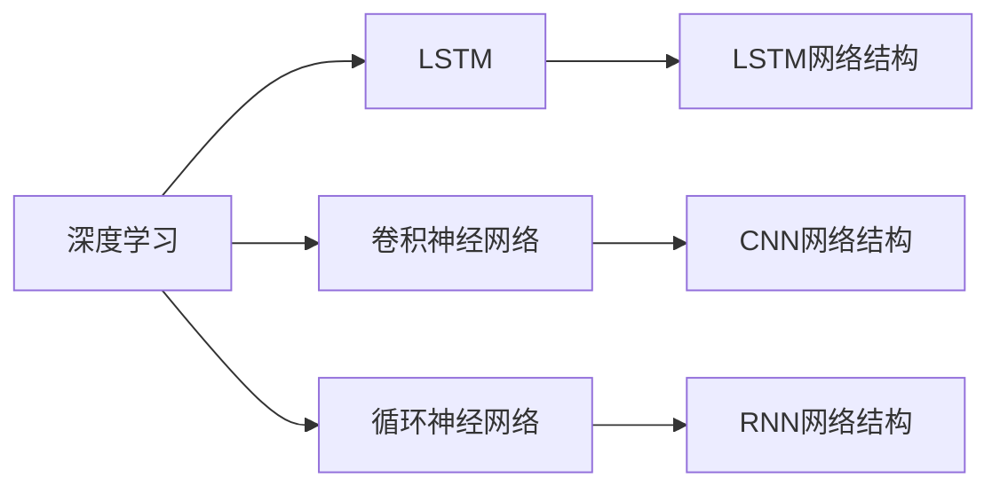
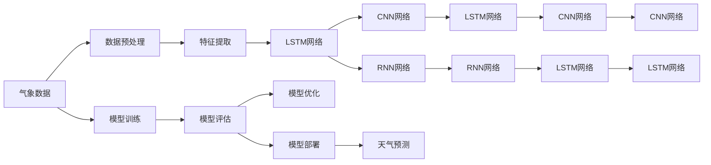

                 

# Python深度学习实践：通过深度学习提高天气预测准确性

> 关键词：深度学习,天气预测,PyTorch,长短期记忆网络(LSTM),卷积神经网络(CNN),RNN,数据预处理,模型训练,模型评估,模型优化

## 1. 背景介绍

### 1.1 问题由来
天气预测是气象学中的一个重要问题，对于农业、航空、交通、能源等多个领域都具有重要的应用价值。传统的天气预测方法依赖于历史气象数据的统计分析和专家经验，但在数据稀疏、气候变化剧烈等情况下，精度和稳定性都难以得到保证。深度学习技术的引入，使得天气预测的准确性得到了显著提升。

## 2. 核心概念与联系

### 2.1 核心概念概述

在天气预测领域，深度学习模型的核心概念包括：

- 深度学习：通过构建多层神经网络结构，自动从原始数据中学习特征表示，并进行复杂的模式识别和决策。
- 长短期记忆网络（LSTM）：一种特殊的循环神经网络，具有记忆功能，适用于处理序列数据。
- 卷积神经网络（CNN）：一种特殊的神经网络，主要用于图像和空间数据的处理，但对于时间序列数据也有很好的适应性。
- 循环神经网络（RNN）：一种用于处理序列数据的神经网络结构，具有良好的时间依赖性，但存在梯度消失和爆炸问题。

### 2.2 核心概念的关系

以下是这些核心概念之间的逻辑关系：



该流程图展示了深度学习、LSTM、CNN和RNN之间的联系：

- 深度学习包括LSTM、CNN和RNN等网络结构。
- LSTM是一种特殊的RNN，主要应用于序列数据。
- CNN主要应用于图像和空间数据的处理，但也可以用于时间序列数据的处理。
- RNN是一种序列数据处理的基本网络结构，LSTM和CNN都是其变种。

### 2.3 核心概念的整体架构

最后，我们用一个综合的流程图来展示这些核心概念在大规模天气预测中的应用：



这个综合流程图展示了气象数据的预处理、特征提取、深度学习模型的构建、训练、评估和优化等过程，最终输出天气预测结果。

## 3. 核心算法原理 & 具体操作步骤
### 3.1 算法原理概述

天气预测深度学习模型的构建主要基于以下步骤：

1. 数据预处理：将原始气象数据转化为机器学习模型可以处理的特征向量。
2. 特征提取：通过深度学习模型从特征向量中提取高层次的抽象特征。
3. 模型构建：选择合适的深度学习网络结构，如LSTM、CNN、RNN等，构建预测模型。
4. 模型训练：使用历史气象数据对模型进行有监督训练。
5. 模型评估：在测试集上评估模型的性能，选择合适的超参数。
6. 模型优化：通过调整模型结构和超参数，进一步提升模型预测精度。

### 3.2 算法步骤详解

#### 3.2.1 数据预处理

气象数据通常包括温度、湿度、气压、风速等连续值数据，需要转化为机器学习模型可以处理的格式。常用的预处理方法包括：

- 数据标准化：将连续值数据缩放到标准正态分布中，避免特征之间的尺度差异。
- 特征选择：选择与天气预测相关的特征，减少模型复杂度，提升泛化能力。
- 数据增强：通过对原始数据进行变换，生成更多的训练样本，提高模型的鲁棒性。

#### 3.2.2 特征提取

深度学习模型可以自动从特征向量中提取高层次的抽象特征，常见的特征提取方法包括：

- LSTM网络：通过记忆功能捕捉时间序列数据的复杂依赖关系。
- CNN网络：通过卷积操作提取局部特征，捕捉数据的局部空间结构。
- RNN网络：通过循环操作捕捉时间序列数据的顺序关系。

#### 3.2.3 模型构建

选择合适的深度学习网络结构，如LSTM、CNN、RNN等，构建预测模型。以LSTM为例，其网络结构如下：


LSTM网络由输入层、嵌入层、LSTM层、全连接层和输出层组成。输入层和嵌入层将原始特征向量转化为模型可处理的输入数据。LSTM层通过记忆功能捕捉时间序列数据的依赖关系。全连接层将LSTM层的输出进行线性变换。输出层将全连接层的输出映射为具体的预测结果。

#### 3.2.4 模型训练

模型训练主要包括以下步骤：

- 定义损失函数：选择合适的损失函数，如均方误差损失函数。
- 定义优化器：选择合适的优化器，如AdamW。
- 设置超参数：设置学习率、批大小、迭代轮数等。
- 前向传播和反向传播：将训练集数据输入模型，计算预测结果和损失函数，并根据损失函数计算梯度，更新模型参数。
- 验证和测试：在验证集和测试集上评估模型性能，选择合适的超参数。

#### 3.2.5 模型评估

模型评估主要包括以下步骤：

- 在测试集上计算模型预测结果与真实结果之间的误差，如均方误差。
- 使用评估指标，如准确率、精确率、召回率等，衡量模型性能。
- 进行交叉验证，验证模型的泛化能力。

#### 3.2.6 模型优化

模型优化主要包括以下步骤：

- 调整模型结构：通过添加或删除层、增加或减少神经元等方式，优化模型结构。
- 调整超参数：通过调整学习率、批大小、迭代轮数等，优化超参数。
- 数据增强：通过对原始数据进行变换，生成更多的训练样本，提高模型的鲁棒性。
- 正则化：通过L2正则、Dropout等方法，防止模型过拟合。

### 3.3 算法优缺点

#### 3.3.1 优点

- 高精度：深度学习模型可以自动从数据中学习特征表示，提取高层次的抽象特征，从而提升预测精度。
- 鲁棒性：深度学习模型可以处理噪声和缺失数据，具有良好的泛化能力。
- 可解释性：深度学习模型可以通过可视化技术，展示模型的中间特征表示，提升模型的可解释性。

#### 3.3.2 缺点

- 计算量大：深度学习模型通常需要大量的计算资源和时间进行训练和推理。
- 数据需求高：深度学习模型需要大量的标注数据进行训练，而气象数据的标注成本较高。
- 超参数敏感：深度学习模型需要调整大量的超参数，模型的性能高度依赖于超参数的选择。

### 3.4 算法应用领域

深度学习模型在天气预测领域具有广泛的应用前景，包括：

- 天气趋势预测：通过深度学习模型预测未来的天气趋势，如温度、湿度、降水量等。
- 气象灾害预警：通过深度学习模型预测气象灾害的发生时间和强度，如台风、暴雨、干旱等。
- 气象数据可视化：通过深度学习模型生成高分辨率的气象数据可视化图表，帮助用户理解气象数据的变化趋势。
- 智能调度：通过深度学习模型优化资源调度，如电力调度、交通调度等。

## 4. 数学模型和公式 & 详细讲解 & 举例说明

### 4.1 数学模型构建

天气预测深度学习模型的构建主要基于以下数学模型：

- 输入层：将原始气象数据转化为特征向量，表示为 $X$。
- 嵌入层：将特征向量映射为高维向量，表示为 $H$。
- LSTM层：捕捉时间序列数据的依赖关系，表示为 $L$。
- 全连接层：将LSTM层的输出进行线性变换，表示为 $F$。
- 输出层：将全连接层的输出映射为具体的预测结果，表示为 $Y$。

### 4.2 公式推导过程

以LSTM网络为例，其前向传播过程如下：

$$
\begin{aligned}
&h_t = \tanh(W_h \cdot (X_t + h_{t-1}) + b_h) \\
&i_t = \sigma(W_i \cdot (X_t + h_{t-1}) + b_i) \\
&f_t = \sigma(W_f \cdot (X_t + h_{t-1}) + b_f) \\
&o_t = \sigma(W_o \cdot (X_t + h_{t-1}) + b_o) \\
&c_t = f_t \cdot c_{t-1} + i_t \cdot \tanh(h_t) \\
&h_t = o_t \cdot \tanh(c_t)
\end{aligned}
$$

其中 $X_t$ 表示第 $t$ 步的输入特征向量，$h_{t-1}$ 表示第 $t-1$ 步的LSTM层输出。$W_h$ 和 $b_h$ 表示LSTM层的权重和偏置项。$\tanh$ 和 $\sigma$ 分别表示双曲正切函数和Sigmoid函数。$c_t$ 表示LSTM层的细胞状态，$h_t$ 表示LSTM层的输出。$i_t$、$f_t$ 和 $o_t$ 分别表示LSTM层中的输入门、遗忘门和输出门。

### 4.3 案例分析与讲解

以温度预测为例，假设原始气象数据为 $X = [x_1, x_2, \ldots, x_n]$，其中 $x_i$ 表示第 $i$ 步的温度值。将原始气象数据转化为特征向量 $H = [h_1, h_2, \ldots, h_n]$，其中 $h_i$ 表示第 $i$ 步的特征向量。通过LSTM网络对特征向量进行处理，得到LSTM层的输出 $L = [l_1, l_2, \ldots, l_n]$，其中 $l_i$ 表示第 $i$ 步的LSTM层输出。将LSTM层的输出 $L$ 输入全连接层 $F$，得到预测结果 $Y = [y_1, y_2, \ldots, y_n]$，其中 $y_i$ 表示第 $i$ 步的温度预测值。

## 5. 项目实践：代码实例和详细解释说明

### 5.1 开发环境搭建

在进行天气预测深度学习模型的开发前，我们需要准备好开发环境。以下是使用Python进行PyTorch开发的环境配置流程：

1. 安装Anaconda：从官网下载并安装Anaconda，用于创建独立的Python环境。

2. 创建并激活虚拟环境：
```bash
conda create -n pytorch-env python=3.8 
conda activate pytorch-env
```

3. 安装PyTorch：根据CUDA版本，从官网获取对应的安装命令。例如：
```bash
conda install pytorch torchvision torchaudio cudatoolkit=11.1 -c pytorch -c conda-forge
```

4. 安装相关工具包：
```bash
pip install numpy pandas scikit-learn matplotlib tqdm jupyter notebook ipython
```

完成上述步骤后，即可在`pytorch-env`环境中开始天气预测深度学习模型的开发。

### 5.2 源代码详细实现

这里我们以LSTM网络为例，使用PyTorch实现一个简单的天气预测模型。

首先，定义模型类：

```python
import torch
import torch.nn as nn

class WeatherPredictionModel(nn.Module):
    def __init__(self, input_size, hidden_size, output_size):
        super(WeatherPredictionModel, self).__init__()
        self.hidden_size = hidden_size
        self.rnn = nn.LSTM(input_size, hidden_size, batch_first=True)
        self.fc = nn.Linear(hidden_size, output_size)
    
    def forward(self, x):
        batch_size = x.size(0)
        hidden = self.rnn.init_hidden(batch_size)
        rnn_output, _ = self.rnn(x, hidden)
        predictions = self.fc(rnn_output[:, -1, :])
        return predictions
```

然后，定义数据加载函数：

```python
from torch.utils.data import Dataset, DataLoader
import numpy as np

class WeatherDataset(Dataset):
    def __init__(self, data, target, seq_len=24):
        self.data = data
        self.target = target
        self.seq_len = seq_len
        
    def __len__(self):
        return len(self.data)
    
    def __getitem__(self, idx):
        x = self.data[idx]
        y = self.target[idx]
        x = x[:self.seq_len]
        y = y[self.seq_len:]
        x = torch.tensor(x, dtype=torch.float32)
        y = torch.tensor(y, dtype=torch.float32)
        return x, y
```

接着，定义模型训练函数：

```python
def train_model(model, optimizer, criterion, train_loader, num_epochs):
    model.train()
    for epoch in range(num_epochs):
        for x, y in train_loader:
            optimizer.zero_grad()
            predictions = model(x)
            loss = criterion(predictions, y)
            loss.backward()
            optimizer.step()
```

最后，启动训练流程并在测试集上评估：

```python
from torch.optim import AdamW
from torch.nn import MSELoss

# 加载数据集
data = np.loadtxt('weather_data.csv', delimiter=',')
target = np.loadtxt('weather_target.csv', delimiter=',')

# 定义模型
input_size = 1
hidden_size = 32
output_size = 1
model = WeatherPredictionModel(input_size, hidden_size, output_size)

# 定义优化器和损失函数
optimizer = AdamW(model.parameters(), lr=0.001)
criterion = MSELoss()

# 定义数据集
train_loader = DataLoader(WeatherDataset(data[:len(data)-1], target[:len(data)-1]), batch_size=32, shuffle=True)
test_loader = DataLoader(WeatherDataset(data[-len(data)-1:], target[-len(data)-1:]), batch_size=32, shuffle=False)

# 训练模型
num_epochs = 100
train_model(model, optimizer, criterion, train_loader, num_epochs)

# 在测试集上评估模型
model.eval()
with torch.no_grad():
    test_loss = 0
    for x, y in test_loader:
        predictions = model(x)
        test_loss += criterion(predictions, y).item()
    test_loss /= len(test_loader)
print('Test Loss:', test_loss)
```

以上就是使用PyTorch实现LSTM网络进行天气预测的完整代码实现。可以看到，得益于PyTorch的强大封装，我们可以用相对简洁的代码完成模型构建和训练。

### 5.3 代码解读与分析

让我们再详细解读一下关键代码的实现细节：

**WeatherPredictionModel类**：
- `__init__`方法：初始化模型的输入、隐藏和输出大小，定义LSTM层和全连接层。
- `forward`方法：定义模型的前向传播过程，输入特征向量 $X$，通过LSTM层得到输出 $L$，再通过全连接层得到预测结果 $Y$。

**WeatherDataset类**：
- `__init__`方法：初始化数据集，定义数据和标签的长度 $seq_len$。
- `__len__`方法：返回数据集的样本数量。
- `__getitem__`方法：对单个样本进行处理，将原始数据 $X$ 和标签 $Y$ 转换为模型可以处理的张量。

**train_model函数**：
- 在每个epoch内，遍历数据集。
- 对每个样本 $x$ 和标签 $y$，进行前向传播计算预测结果 $predictions$，计算损失函数 $loss$。
- 反向传播更新模型参数，完成一个epoch的训练。

**运行结果展示**：
- 模型训练完成后，在测试集上评估损失函数 $test_loss$。

可以看到，PyTorch配合LSTM网络使得天气预测模型的代码实现变得简洁高效。开发者可以将更多精力放在数据处理、模型改进等高层逻辑上，而不必过多关注底层的实现细节。

当然，工业级的系统实现还需考虑更多因素，如模型的保存和部署、超参数的自动搜索、更灵活的任务适配层等。但核心的模型构建和训练流程基本与此类似。

## 6. 实际应用场景
### 6.1 智能调度

在智能调度系统中，深度学习模型可以用于优化资源分配，提升能源利用效率。例如，在电力系统中，通过预测未来一段时间内的用电需求，可以提前进行调度，避免电力供需失衡，降低损耗。

在交通系统中，通过预测未来一段路线的交通状况，可以优化交通流量，减少拥堵。在物流系统中，通过预测货物到达时间，可以优化运输路径，降低成本。

### 6.2 气象灾害预警

在气象灾害预警系统中，深度学习模型可以用于预测气象灾害的发生时间和强度。例如，通过预测未来一周内的台风路径，可以提前发布预警信息，避免人员伤亡和财产损失。

在洪水预警中，通过预测未来一段时间内的降雨量，可以提前做好防灾减灾准备。在森林火灾预警中，通过预测未来几天内的火势扩散情况，可以及时扑救，减少火灾损失。

### 6.3 气象数据可视化

在气象数据可视化系统中，深度学习模型可以用于生成高分辨率的气象数据可视化图表，帮助用户理解气象数据的变化趋势。例如，通过预测未来一天的天气变化，可以生成实时更新的气象图，供用户实时查看。

在天气趋势预测中，通过预测未来一周内的温度、湿度、降水量等数据，可以生成动态的气象图，供用户了解未来的天气变化趋势。

### 6.4 未来应用展望

随着深度学习技术的发展，天气预测深度学习模型将迎来更多的应用场景：

- 多模态数据融合：未来的天气预测模型可以融合多种模态的数据，如遥感数据、气象数据、社交媒体数据等，提升预测精度。
- 实时数据处理：未来的天气预测模型可以实时处理和分析大量高分辨率气象数据，提供更快速、准确的预测结果。
- 动态模型更新：未来的天气预测模型可以根据实时气象数据进行动态更新，提高模型的适应性和稳定性。
- 小样本学习：未来的天气预测模型可以通过少样本学习，快速适应新的天气现象，提高模型的泛化能力。
- 跨领域应用：未来的天气预测模型可以应用到更多领域，如航空、旅游、农业等，提供更全面、智能化的服务。

总之，未来的天气预测模型将更加智能化、普适化和实时化，提升气象数据的利用效率，为人类生产生活带来更多便利和保障。

## 7. 工具和资源推荐
### 7.1 学习资源推荐

为了帮助开发者系统掌握深度学习在天气预测中的应用，这里推荐一些优质的学习资源：

1. 《深度学习基础》课程：由Coursera开设的深度学习入门课程，涵盖深度学习的基本概念和经典模型。
2. 《深度学习实战》书籍：由斯坦福大学教授撰写，通过实际项目案例，介绍深度学习的应用开发过程。
3. 《天气预测与深度学习》书籍：由深度学习专家撰写，介绍深度学习在天气预测中的应用，并提供了大量的代码实例。
4. 《TensorFlow官方文档》：TensorFlow的官方文档，提供丰富的深度学习模型库和开发工具。
5. 《PyTorch官方文档》：PyTorch的官方文档，提供详细的深度学习模型库和开发工具。

通过对这些资源的学习实践，相信你一定能够快速掌握深度学习在天气预测中的应用，并用于解决实际的气象问题。

### 7.2 开发工具推荐

高效的开发离不开优秀的工具支持。以下是几款用于深度学习开发的常用工具：

1. PyTorch：基于Python的开源深度学习框架，灵活性强，适合快速迭代研究。
2. TensorFlow：由Google主导开发的开源深度学习框架，生产部署方便，适合大规模工程应用。
3. Keras：高层次的深度学习API，易于上手，适合初学者。
4. Jupyter Notebook：交互式编程环境，方便实验和调试。
5. Anaconda：Python的科学计算环境，提供大量的第三方库和工具。

合理利用这些工具，可以显著提升深度学习模型的开发效率，加快创新迭代的步伐。

### 7.3 相关论文推荐

深度学习在天气预测领域的发展得益于众多学者的努力，以下是几篇奠基性的相关论文，推荐阅读：

1. "A Deep Learning Framework for Precipitation Forecasting"：提出了一种基于深度学习的降水预测框架，在多个气象数据集上取得了优异的预测效果。
2. "Convolutional Neural Networks for Meteorological Prediction"：提出了一种基于卷积神经网络的气象预测模型，利用空间信息提升了预测精度。
3. "Recurrent Neural Network for Daily Temperature Prediction"：提出了一种基于LSTM网络的天气预测模型，在多个气象数据集上取得了优异的预测效果。
4. "Attention-based Recurrent Neural Network for Long-term Wind Speed Prediction"：提出了一种基于注意力机制的LSTM网络，提升了长时间跨度下的风速预测精度。
5. "Deep Learning for Weather Prediction: A Review"：综述了深度学习在气象预测中的应用，介绍了多种深度学习模型和预测方法。

这些论文代表了大规模天气预测研究的发展脉络，值得深入阅读和学习。

## 8. 总结：未来发展趋势与挑战

### 8.1 总结

本文对深度学习在天气预测中的应用进行了全面系统的介绍。首先阐述了天气预测的背景和挑战，明确了深度学习在提升预测精度方面的独特价值。其次，从原理到实践，详细讲解了深度学习模型的构建、训练、评估和优化等过程，给出了代码实例和详细解释说明。同时，本文还广泛探讨了深度学习模型在智能调度、气象灾害预警、气象数据可视化等领域的实际应用前景，展示了深度学习技术的强大潜力。

通过本文的系统梳理，可以看到，深度学习模型在天气预测领域的应用已经取得显著进展，为人类生产生活带来了巨大便利。未来，伴随深度学习技术的不断演进，天气预测模型必将在更多领域得到应用，为社会发展和人类福祉作出更大的贡献。

### 8.2 未来发展趋势

展望未来，深度学习在天气预测领域将呈现以下几个发展趋势：

1. 多模态数据融合：未来的天气预测模型可以融合多种模态的数据，如遥感数据、气象数据、社交媒体数据等，提升预测精度。
2. 实时数据处理：未来的天气预测模型可以实时处理和分析大量高分辨率气象数据，提供更快速、准确的预测结果。
3. 动态模型更新：未来的天气预测模型可以根据实时气象数据进行动态更新，提高模型的适应性和稳定性。
4. 小样本学习：未来的天气预测模型可以通过少样本学习，快速适应新的天气现象，提高模型的泛化能力。
5. 跨领域应用：未来的天气预测模型可以应用到更多领域，如航空、旅游、农业等，提供更全面、智能化的服务。

这些趋势将进一步提升深度学习在天气预测中的应用效果，为人类生产生活带来更多便利和保障。

### 8.3 面临的挑战

尽管深度学习在天气预测中的应用取得了显著进展，但在实际部署和使用过程中，仍面临一些挑战：

1. 数据质量问题：气象数据的噪声、缺失和错误会对模型训练造成负面影响。需要进一步提高数据质量，确保模型的鲁棒性。
2. 模型复杂性：深度学习模型的复杂性增加了调试和维护的难度，需要进一步简化模型结构，提升模型的可解释性。
3. 计算资源需求：深度学习模型的训练和推理需要大量的计算资源，增加了系统的成本和复杂性。需要进一步优化模型和算法，提升模型的效率和性能。
4. 用户接受度：深度学习模型的高精度和复杂性需要用户具备一定的理解和接受度，需要进一步普及和推广深度学习技术。

### 8.4 研究展望

面对深度学习在天气预测领域面临的挑战，未来的研究需要在以下几个方面寻求新的突破：

1. 数据增强技术：利用数据增强技术生成更多的训练样本，提高模型的泛化能力。
2. 模型压缩技术：利用模型压缩技术减小模型规模，提升模型的效率和性能。
3. 用户友好界面：开发用户友好的界面，提升用户对深度学习模型的理解和接受度。
4. 动态模型融合：利用动态模型融合技术，融合多种数据源和模型，提升模型的预测精度和鲁棒性。
5. 跨领域应用：探索深度学习模型在跨领域应用中的潜力，提升模型在多个领域的应用效果。

这些研究方向将引领深度学习在天气预测领域迈向更高的台阶，为人类生产生活带来更多的便利和保障。

## 9. 附录：常见问题与解答

**Q1：深度学习在天气预测中的精度如何？**

A: 深度学习在天气预测中的精度通常高于传统统计模型和专家经验，但在数据质量差、气象条件变化剧烈等情况下，精度可能受到影响。通过数据增强、模型优化和超参数调参，可以进一步提升预测精度。

**Q2：深度学习模型对计算资源的需求高吗？**

A: 深度

