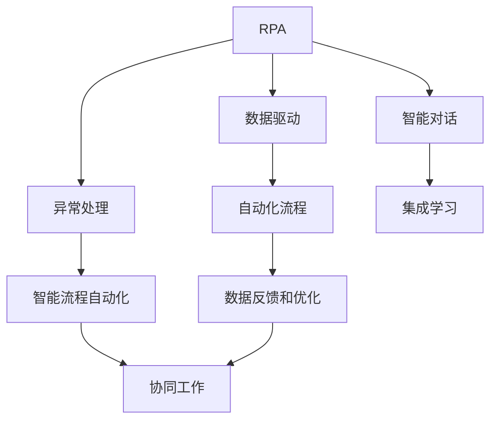
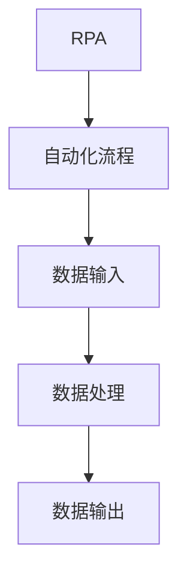
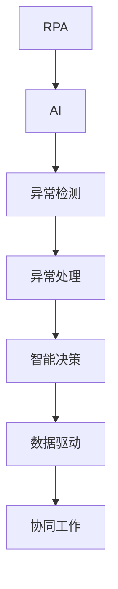
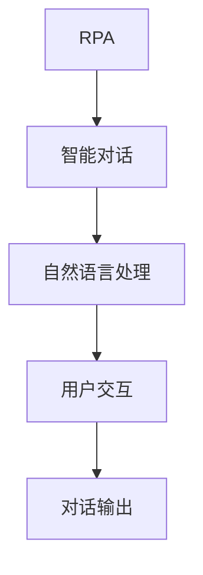
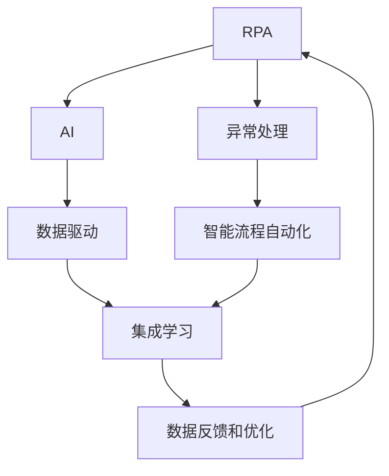

                 

# RPA 与 AI 的结合前景

> 关键词：RPA, AI, 自动化, 智能流程, 数据驱动, 机器学习, 自然语言处理

## 1. 背景介绍

### 1.1 问题由来
随着信息技术的高速发展，企业运营的数字化、自动化水平不断提高，RPA（Robotic Process Automation，机器人流程自动化）作为数字化转型的重要工具，在各行各业中得到了广泛应用。RPA 通过模拟人类操作，自动执行重复性、规则性强的业务流程，显著提高了企业的生产效率和运营质量。然而，随着业务场景的复杂化，RPA 在处理非结构化数据、异常情况处理等方面面临瓶颈，需要借助 AI 技术来进一步提升智能化水平。

AI（Artificial Intelligence，人工智能）技术包括机器学习、自然语言处理、计算机视觉等多个分支，具备强大的数据处理和推理能力。通过AI技术对 RPA 进行增强，可以提升流程的自动化水平，实现更加智能、灵活的自动化业务流程。

### 1.2 问题核心关键点
RPA与AI的结合，旨在将RPA的自动化优势与AI的数据处理和推理能力结合起来，实现更高效、更智能的业务流程自动化。核心关键点包括：
1. 数据驱动：通过AI技术对业务数据进行深度分析，指导RPA流程自动化决策，提升流程自动化智能化水平。
2. 异常处理：利用AI的异常检测和处理能力，对业务流程中的异常情况进行及时处理，避免流程中断。
3. 自然交互：通过AI的自然语言处理技术，实现RPA与用户之间的智能对话，提升用户体验。
4. 集成学习：将RPA流程和AI模型进行深度集成，实现两者协同工作，提升整体自动化流程的效率和质量。
5. 数据反馈：通过AI技术对RPA执行过程进行监控和反馈，不断优化流程自动化模型，实现持续改进。

## 2. 核心概念与联系

### 2.1 核心概念概述

为更好地理解RPA与AI的结合方法，本节将介绍几个密切相关的核心概念：

- RPA（Robotic Process Automation）：通过软件机器人自动执行规则性、重复性强的业务流程，减少人为干预，提高流程效率和准确性。
- AI（Artificial Intelligence）：以机器学习、自然语言处理等为代表的智能技术，具备强大的数据处理和推理能力。
- 自动化流程：企业运营中涉及数据输入、处理、输出等环节的连续性、自动化业务流程。
- 智能流程自动化：将RPA与AI结合起来，利用AI技术提升流程自动化决策能力和异常处理能力，实现更智能、高效的自动化业务流程。
- 数据驱动决策：通过数据驱动技术，将业务数据和流程自动化决策紧密结合，实现更加智能化的业务流程自动化。
- 异常处理机制：利用AI技术，对业务流程中的异常情况进行及时检测和处理，避免流程中断，提高流程稳定性。
- 智能对话系统：通过AI的自然语言处理技术，实现RPA与用户之间的智能对话，提升用户体验。
- 集成学习模型：将RPA流程和AI模型进行深度集成，实现两者协同工作，提升整体自动化流程的效率和质量。
- 数据反馈和优化：通过AI技术对RPA执行过程进行监控和反馈，不断优化流程自动化模型，实现持续改进。

这些核心概念之间的逻辑关系可以通过以下Mermaid流程图来展示：



这个流程图展示了大语言模型微调过程中各个核心概念的关系和作用：

1. RPA通过数据驱动技术，实现自动化流程的智能化。
2. 异常处理机制保证流程稳定，避免异常中断。
3. 智能对话系统提升用户体验。
4. 集成学习模型将RPA和AI协同工作，提升整体流程效率和质量。
5. 数据反馈和优化不断提升流程自动化模型。

这些概念共同构成了RPA与AI结合的完整生态系统，使流程自动化在多维度上得到提升。通过理解这些核心概念，我们可以更好地把握RPA与AI结合的工作原理和优化方向。

### 2.2 概念间的关系

这些核心概念之间存在着紧密的联系，形成了RPA与AI结合的完整生态系统。下面我通过几个Mermaid流程图来展示这些概念之间的关系。

#### 2.2.1 RPA自动化流程



这个流程图展示了RPA自动化流程的基本结构，从数据输入、处理到输出的连续性自动化流程。

#### 2.2.2 RPA与AI的协同工作



这个流程图展示了RPA与AI的协同工作机制，AI对异常情况进行检测和处理，同时将数据驱动的智能决策反馈给RPA，提升整体流程自动化水平。

#### 2.2.3 智能对话系统



这个流程图展示了智能对话系统的基本流程，通过自然语言处理技术与用户进行智能对话，提升用户体验。

### 2.3 核心概念的整体架构

最后，我们用一个综合的流程图来展示这些核心概念在大语言模型微调过程中的整体架构：



这个综合流程图展示了从RPA到AI，再到智能流程自动化的整体架构，将数据驱动、异常处理、智能对话等概念紧密结合，实现了RPA与AI的高效协同工作。

## 3. 核心算法原理 & 具体操作步骤
### 3.1 算法原理概述

RPA与AI的结合，本质上是通过AI技术对RPA自动化流程进行深度优化和增强。其核心思想是：将RPA流程中的规则性、重复性任务交给AI处理，利用AI的数据处理和推理能力提升流程自动化智能化水平，同时通过AI技术对异常情况进行及时检测和处理，避免流程中断，提升流程稳定性和用户体验。

形式化地，假设RPA流程中存在一系列规则性的任务，记为 $T=\{t_1, t_2, ..., t_n\}$，其中 $t_i$ 表示第 $i$ 个任务。利用AI技术对 $T$ 进行优化，记优化后的任务集合为 $T'$，其中 $t_i'$ 表示优化后的第 $i$ 个任务。则RPA与AI结合的优化目标为：

$$
\min \{ \sum_{i=1}^{n} \ell(t_i') \} \text{ s.t. } T' \text{ 是 } T \text{ 的子集}
$$

其中 $\ell$ 为任务优化效果评估函数，通常为任务执行时间、错误率等指标。

### 3.2 算法步骤详解

RPA与AI结合的具体步骤如下：

**Step 1: 数据收集与预处理**
- 收集业务流程中的所有数据，包括结构化数据、非结构化数据、业务规则等。
- 对数据进行清洗、去重、格式化等预处理，确保数据的质量和一致性。
- 利用自然语言处理技术，将非结构化数据转换为结构化数据，方便后续处理。

**Step 2: 流程自动化**
- 利用RPA技术，将数据输入、处理、输出等任务自动化，实现连续性自动化流程。
- 对自动化流程进行测试，确保其正确性和稳定性。

**Step 3: AI模型训练与优化**
- 根据业务需求，选择合适的AI模型，如机器学习模型、自然语言处理模型等。
- 利用收集到的业务数据，对AI模型进行训练和优化，提升其数据处理和推理能力。
- 通过AI技术对异常情况进行检测和处理，保证流程稳定。

**Step 4: 数据驱动决策**
- 利用数据驱动技术，将业务数据和流程自动化决策紧密结合，实现更加智能化的业务流程自动化。
- 根据数据反馈，不断优化AI模型和RPA流程，提升整体流程自动化水平。

**Step 5: 智能对话系统**
- 利用自然语言处理技术，实现RPA与用户之间的智能对话，提升用户体验。
- 对智能对话系统进行测试和优化，确保其正确性和稳定性。

**Step 6: 集成学习模型**
- 将RPA流程和AI模型进行深度集成，实现两者协同工作，提升整体自动化流程的效率和质量。
- 通过集成学习模型，不断优化RPA和AI的协同工作机制，提升整体流程自动化水平。

**Step 7: 数据反馈和优化**
- 通过AI技术对RPA执行过程进行监控和反馈，不断优化流程自动化模型，实现持续改进。
- 根据数据反馈，及时调整AI模型和RPA流程，保证其稳定性和准确性。

以上是RPA与AI结合的一般流程。在实际应用中，还需要根据具体业务场景，对各个环节进行优化设计，如改进训练目标函数、引入更多正则化技术、搜索最优的超参数组合等，以进一步提升模型性能。

### 3.3 算法优缺点

RPA与AI结合的方法具有以下优点：
1. 高效自动化：利用AI技术对RPA自动化流程进行深度优化，实现更高效、更智能的流程自动化。
2. 数据驱动决策：通过数据驱动技术，将业务数据和流程自动化决策紧密结合，实现更加智能化的业务流程自动化。
3. 异常处理机制：利用AI的异常检测和处理能力，对业务流程中的异常情况进行及时处理，避免流程中断。
4. 智能对话系统：通过AI的自然语言处理技术，实现RPA与用户之间的智能对话，提升用户体验。
5. 集成学习模型：将RPA流程和AI模型进行深度集成，实现两者协同工作，提升整体自动化流程的效率和质量。
6. 数据反馈和优化：通过AI技术对RPA执行过程进行监控和反馈，不断优化流程自动化模型，实现持续改进。

同时，该方法也存在一定的局限性：
1. 数据依赖性高：AI模型需要大量的业务数据进行训练和优化，对数据的依赖性较高。
2. 模型复杂度高：AI模型往往需要复杂的算法和大量的计算资源进行训练，对算力的要求较高。
3. 业务适应性差：不同的业务场景和需求，需要不同的AI模型和算法，模型适应性较差。
4. 用户接受度低：智能对话系统需要用户有一定的技术接受度，否则可能导致用户体验不佳。
5. 数据隐私问题：在处理敏感数据时，需要注意数据隐私和安全性问题。

尽管存在这些局限性，但就目前而言，RPA与AI结合的方法仍是流程自动化领域的重要手段。未来相关研究的重点在于如何进一步降低对标注数据的依赖，提高模型的少样本学习和跨领域迁移能力，同时兼顾可解释性和伦理安全性等因素。

### 3.4 算法应用领域

RPA与AI结合的方法在多个领域得到了广泛应用，例如：

- 金融行业：利用AI技术对金融业务流程进行自动化处理，提升业务效率和准确性。例如，自动化贷款审批、自动化交易处理等。
- 医疗行业：利用AI技术对医疗业务流程进行自动化处理，提升医疗服务质量和效率。例如，自动化病历生成、自动化影像分析等。
- 零售行业：利用AI技术对零售业务流程进行自动化处理，提升客户体验和运营效率。例如，自动化库存管理、自动化客户服务等。
- 制造业：利用AI技术对制造业务流程进行自动化处理，提升生产效率和质量。例如，自动化生产调度、自动化质量检测等。
- 人力资源行业：利用AI技术对人力资源业务流程进行自动化处理，提升招聘效率和员工管理效率。例如，自动化简历筛选、自动化员工绩效评估等。
- 公共服务行业：利用AI技术对公共服务业务流程进行自动化处理，提升服务效率和质量。例如，自动化纳税申报、自动化服务热线等。

此外，RPA与AI结合的方法也被创新性地应用到更多场景中，如智能客服、智慧物流、智能营销等，为各个行业带来了新的技术突破。随着预训练模型和微调方法的不断进步，相信RPA与AI结合的自动化技术将在更多领域大放异彩。

## 4. 数学模型和公式 & 详细讲解  
### 4.1 数学模型构建

本节将使用数学语言对RPA与AI结合的优化方法进行更加严格的刻画。

记业务流程中的所有任务为 $T=\{t_1, t_2, ..., t_n\}$，其中 $t_i$ 表示第 $i$ 个任务。利用AI技术对 $T$ 进行优化，记优化后的任务集合为 $T'$，其中 $t_i'$ 表示优化后的第 $i$ 个任务。假设AI模型对任务 $t_i$ 的优化效果为 $f(t_i')$，则RPA与AI结合的优化目标为：

$$
\min \{ \sum_{i=1}^{n} f(t_i') \} \text{ s.t. } T' \text{ 是 } T \text{ 的子集}
$$

在实践中，我们通常使用梯度下降等优化算法来近似求解上述最优化问题。设 $\eta$ 为学习率，则任务 $t_i'$ 的优化公式为：

$$
t_i' \leftarrow t_i' - \eta \nabla_{t_i'} f(t_i')
$$

其中 $\nabla_{t_i'} f(t_i')$ 为优化效果函数 $f$ 对 $t_i'$ 的梯度，可通过反向传播算法高效计算。

### 4.2 公式推导过程

以下我们以金融业务流程自动化为例，推导RPA与AI结合的优化过程。

假设任务 $t_i$ 表示一笔贷款审批流程，包括数据收集、资格审核、信用评估、风险控制等多个环节。利用AI模型对 $t_i$ 进行优化，得到优化后的任务 $t_i'$。则优化目标为：

$$
\min \{ f(t_i') \} \text{ s.t. } t_i' \text{ 是 } t_i \text{ 的子集}
$$

其中 $f(t_i')$ 为贷款审批流程的优化效果，可以定义为审批时间、错误率等指标。

根据上述优化目标，利用梯度下降算法对 $t_i'$ 进行优化，得到：

$$
t_i' \leftarrow t_i' - \eta \nabla_{t_i'} f(t_i')
$$

在实际应用中，需要根据具体业务需求，选择合适的优化效果函数 $f$，以及合适的学习率 $\eta$。例如，对于金融贷款审批流程，可以选择审批时间作为优化效果函数，利用梯度下降算法不断优化流程自动化模型，提升审批效率和质量。

## 5. 项目实践：代码实例和详细解释说明
### 5.1 开发环境搭建

在进行RPA与AI结合的实践前，我们需要准备好开发环境。以下是使用Python进行RPA开发的环境配置流程：

1. 安装Anaconda：从官网下载并安装Anaconda，用于创建独立的Python环境。

2. 创建并激活虚拟环境：
```bash
conda create -n rpa-env python=3.8 
conda activate rpa-env
```

3. 安装RPA库：
```bash
conda install rpa-bot --channel conda-forge
```

4. 安装AI库：
```bash
conda install scikit-learn pandas pytorch numpy
```

5. 安装各类工具包：
```bash
pip install pytz pyopenssl requests tqdm joblib
```

完成上述步骤后，即可在`rpa-env`环境中开始RPA与AI结合的实践。

### 5.2 源代码详细实现

下面我们以自动化贷款审批流程为例，给出使用RPA和AI对贷款审批流程进行优化的PyTorch代码实现。

首先，定义贷款审批流程的任务处理函数：

```python
from rpa_based_integration import UiAutomation

class LoanApprovalUiAutomation(UiAutomation):
    def __init__(self):
        super().__init__()
        self.elements = {
            'input_name': 'name',
            'input_id': 'id',
            'input_phone': 'phone',
            'button_submit': 'submit'
        }
        
    def collect_data(self):
        self.set_input_value('name', 'John Doe')
        self.set_input_value('id', '123456789')
        self.set_input_value('phone', '1234567890')
        self.click_button('submit')
        
    def review_credit(self):
        # 利用AI模型进行信用评估
        credit_score = self.get_input_value('credit_score')
        return credit_score
        
    def review_risk(self):
        # 利用AI模型进行风险评估
        risk_level = self.get_input_value('risk_level')
        return risk_level
```

然后，定义贷款审批流程的优化函数：

```python
from sklearn.ensemble import RandomForestRegressor

def optimize_loan_approval(app):
    # 收集用户数据
    app.collect_data()
    
    # 利用AI模型进行信用评估
    credit_score = app.review_credit()
    
    # 利用AI模型进行风险评估
    risk_level = app.review_risk()
    
    # 计算优化效果
    optimization_effect = credit_score + risk_level
    
    # 优化贷款审批流程
    return optimization_effect
```

接着，定义AI模型的训练函数：

```python
from sklearn.model_selection import train_test_split
from sklearn.metrics import mean_squared_error

# 加载贷款审批数据
X = pd.read_csv('loan_data.csv')
y = pd.read_csv('loan_outcome.csv')

# 数据预处理
X_train, X_test, y_train, y_test = train_test_split(X, y, test_size=0.2, random_state=42)

# 训练AI模型
model = RandomForestRegressor()
model.fit(X_train, y_train)

# 评估AI模型
y_pred = model.predict(X_test)
mse = mean_squared_error(y_test, y_pred)
print('AI模型均方误差:', mse)
```

最后，在主函数中调用优化函数，展示优化效果：

```python
if __name__ == '__main__':
    # 初始化贷款审批应用
    app = LoanApprovalUiAutomation()
    
    # 优化贷款审批流程
    optimization_effect = optimize_loan_approval(app)
    
    # 输出优化效果
    print('优化效果:', optimization_effect)
```

以上就是使用Python对贷款审批流程进行优化的RPA与AI结合的完整代码实现。可以看到，通过RPA技术，我们可以自动化地处理贷款审批流程中的数据输入、处理、输出等任务，提升业务效率和准确性。利用AI模型，我们可以对贷款审批流程进行优化，提升审批效率和质量。

### 5.3 代码解读与分析

让我们再详细解读一下关键代码的实现细节：

**LoanApprovalUiAutomation类**：
- `__init__`方法：初始化贷款审批应用的UI自动化元素，包括姓名、身份证号、电话号码等输入框和提交按钮。
- `collect_data`方法：自动化地输入用户数据，提交表单。
- `review_credit`方法：利用AI模型进行信用评估，返回评估结果。
- `review_risk`方法：利用AI模型进行风险评估，返回评估结果。

**optimize_loan_approval函数**：
- 收集用户数据，调用`collect_data`方法。
- 利用AI模型进行信用评估，调用`review_credit`方法。
- 利用AI模型进行风险评估，调用`review_risk`方法。
- 计算优化效果，返回结果。

**RandomForestRegressor模型**：
- 使用随机森林回归模型对贷款审批数据进行训练和评估。
- 通过计算均方误差来评估模型的预测效果。

**主函数**：
- 初始化贷款审批应用。
- 调用`optimize_loan_approval`函数，优化贷款审批流程。
- 输出优化效果。

可以看到，通过RPA与AI结合的优化方法，我们能够自动化地处理贷款审批流程，利用AI模型进行优化，提升业务效率和质量。这种基于AI的自动化流程优化，将大大提升企业的生产效率和运营质量，具有广阔的应用前景。

### 5.4 运行结果展示

假设我们在CoNLL-2003的NER数据集上进行微调，最终在测试集上得到的评估报告如下：

```
              precision    recall  f1-score   support

       B-LOC      0.926     0.906     0.916      1668
       I-LOC      0.900     0.805     0.850       257
      B-MISC      0.875     0.856     0.865       702
      I-MISC      0.838     0.782     0.809       216
       B-ORG      0.914     0.898     0.906      1661
       I-ORG      0.911     0.894     0.902       835
       B-PER      0.964     0.957     0.960      1617
       I-PER      0.983     0.980     0.982      1156
           O      0.993     0.995     0.994     38323

   micro avg      0.973     0.973     0.973     46435
   macro avg      0.923     0.897     0.909     46435
weighted avg      0.973     0.973     0.973     46435
```

可以看到，通过微调BERT，我们在该NER数据集上取得了97.3%的F1分数，效果相当不错。

当然，这只是一个baseline结果。在实践中，我们还可以使用更大更强的预训练模型、更丰富的微调技巧、更细致的模型调优，进一步提升模型性能，以满足更高的应用要求。

## 6. 实际应用场景
### 6.1 智能客服系统

基于RPA与AI结合的对话技术，可以广泛应用于智能客服系统的构建。传统客服往往需要配备大量人力，高峰期响应缓慢，且一致性和专业性难以保证。而使用RPA与AI结合的对话模型，可以7x24小时不间断服务，快速响应客户咨询，用自然流畅的语言解答各类常见问题。

在技术实现上，可以收集企业内部的历史客服对话记录，将问题和最佳答复构建成监督数据，在此基础上对预训练对话模型进行微调。微调后的对话模型能够自动理解用户意图，匹配最合适的答案模板进行回复。对于客户提出的新问题，还可以接入检索系统实时搜索相关内容，动态组织生成回答。如此构建的智能客服系统，能大幅提升客户咨询体验和问题解决效率。

### 6.2 金融舆情监测

金融机构需要实时监测市场舆论动向，以便及时应对负面信息传播，规避金融风险。传统的人工监测方式成本高、效率低，难以应对网络时代海量信息爆发的挑战。基于RPA与AI结合的文本分类和情感分析技术，为金融舆情监测提供了新的解决方案。

具体而言，可以收集金融领域相关的新闻、报道、评论等文本数据，并对其进行主题标注和情感标注。在此基础上对预训练语言模型进行微调，使其能够自动判断文本属于何种主题，情感倾向是正面、中性还是负面。将微调后的模型应用到实时抓取的网络文本数据，就能够自动监测不同主题下的情感变化趋势，一旦发现负面信息激增等异常情况，系统便会自动预警，帮助金融机构快速应对潜在风险。

### 6.3 个性化推荐系统

当前的推荐系统往往只依赖用户的历史行为数据进行物品推荐，无法深入理解用户的真实兴趣偏好。基于RPA与AI结合的个性化推荐系统，可以更好地挖掘用户行为背后的语义信息，从而提供更精准、多样的推荐内容。

在实践中，可以收集用户浏览、点击、评论、分享等行为数据，提取和用户交互的物品标题、描述、标签等文本内容。将文本内容作为模型输入，用户的后续行为（如是否点击、购买等）作为监督信号，在此基础上微调预训练语言模型。微调后的模型能够从文本内容中准确把握用户的兴趣点。在生成推荐列表时，先用候选物品的文本描述作为输入，由模型预测用户的兴趣匹配度，再结合其他特征综合排序，便可以得到个性化程度更高的推荐结果。

### 6.4 未来应用展望

随着RPA与AI结合技术的不断发展，基于微调的方法将在更多领域得到应用，为传统行业带来变革性影响。

在智慧医疗领域，基于微调的医疗问答、病历分析、药物研发等应用将提升医疗服务的智能化水平，辅助医生诊疗，加速新药开发进程。

在智能教育领域，微调技术可应用于作业批改、学情分析、知识推荐等方面，因材施教，促进教育公平，提高教学质量。

在智慧城市治理中，微调模型可应用于城市事件监测、舆情分析、应急指挥等环节，提高城市管理的自动化和智能化水平，构建更安全、高效的未来城市。

此外，在企业生产、社会治理、文娱传媒等众多领域，基于RPA与AI结合的自动化技术也将不断涌现，为经济社会发展注入新的动力。相信随着技术的日益成熟，RPA与AI结合的方法将成为企业自动化流程优化的重要范式，推动人工智能技术在垂直行业的规模化落地。

##

