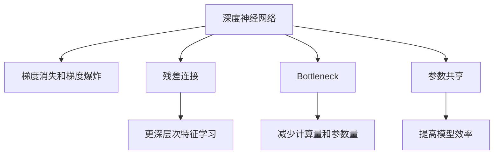
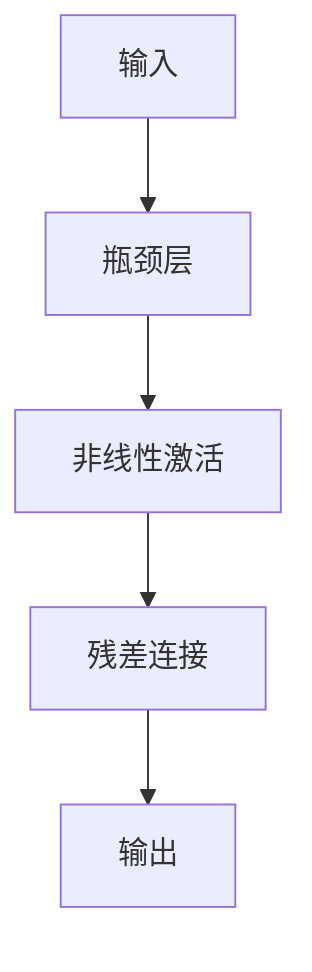
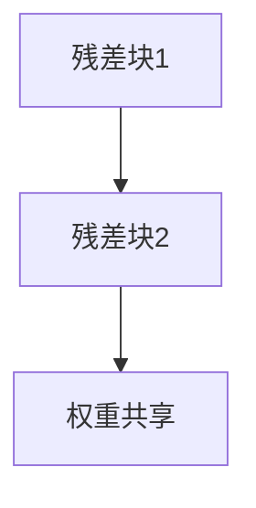
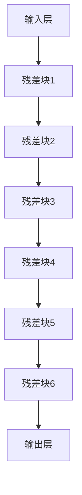

                 

# ResNet原理与代码实例讲解

## 1. 背景介绍

### 1.1 问题由来
在深度学习领域，尤其是计算机视觉领域，卷积神经网络（Convolutional Neural Networks, CNNs）因其强大的特征提取能力而成为主流的模型。然而，由于深度网络的层次嵌套特性，存在“梯度消失”和“梯度爆炸”的问题，导致网络难以训练。此外，随着网络层数的增加，过拟合现象也越发严重，模型泛化性能下降。

为了克服这些问题，ResNet（Residual Network）作为一种深层网络的创新设计，引入了残差连接（Residual Connection），使得网络可以训练更深层次，同时防止梯度消失和过拟合。本文将深入探讨ResNet的原理和实现，并通过代码实例进行讲解。

### 1.2 问题核心关键点
ResNet的关键点包括：
1. **残差连接（Residual Connection）**：通过跨层连接，使模型可以更深层地学习数据特征。
2. **瓶颈层（Bottleneck）**：通过降维和升维操作，减少计算量和参数量，提升模型性能。
3. **参数共享（Weight Sharing）**：通过权重共享，进一步减少参数量，提高模型效率。
4. **网络结构设计（Network Structure）**：设计不同深度的网络结构，应对不同的应用需求。

### 1.3 问题研究意义
ResNet作为深度学习领域的重要成果，显著提升了深度网络的可训练性和泛化能力，推动了计算机视觉技术的快速发展。通过系统地学习和掌握ResNet的原理和实现，可以更好地理解和应用深度学习模型，解决实际问题。

## 2. 核心概念与联系

### 2.1 核心概念概述

为更好地理解ResNet，本节将介绍几个密切相关的核心概念：

- **深度神经网络（Deep Neural Networks）**：指具有多个隐藏层的神经网络，用于处理复杂的非线性关系。
- **梯度消失和梯度爆炸（Vanishing and Exploding Gradients）**：深度网络训练中常见的梯度问题，导致网络难以训练。
- **残差连接（Residual Connection）**：通过跨层连接，使网络可以更深层次地学习数据特征，避免梯度消失。
- **瓶颈层（Bottleneck）**：用于降维和升维操作，减少计算量和参数量，提升模型性能。
- **参数共享（Weight Sharing）**：通过权重共享，进一步减少参数量，提高模型效率。

这些核心概念之间的逻辑关系可以通过以下Mermaid流程图来展示：



这个流程图展示了大深度网络、残差连接、瓶颈层和参数共享之间的逻辑关系：

1. 深度神经网络通过增加隐藏层，处理复杂的非线性关系，但也带来了梯度消失和梯度爆炸的问题。
2. 残差连接通过跨层连接，使得网络可以更深层次地学习数据特征，避免梯度消失。
3. 瓶颈层通过降维和升维操作，减少计算量和参数量，提升模型性能。
4. 参数共享通过权重共享，进一步减少参数量，提高模型效率。

### 2.2 概念间的关系

这些核心概念之间存在着紧密的联系，形成了ResNet的完整生态系统。下面我通过几个Mermaid流程图来展示这些概念之间的关系。

#### 2.2.1 ResNet的核心结构


这个流程图展示了ResNet的基本结构：输入层通过若干个残差块，最终输出到输出层。

#### 2.2.2 残差块（Residual Block）



这个流程图展示了残差块的基本结构：输入通过瓶颈层降维，再经过非线性激活，残差连接（跨层连接），最后升维输出。

#### 2.2.3 残差块的参数共享



这个流程图展示了残差块之间的参数共享：通过共享残差块之间的权重，进一步减少参数量，提高模型效率。

### 2.3 核心概念的整体架构

最后，我们用一个综合的流程图来展示这些核心概念在ResNet中的整体架构：



这个综合流程图展示了从输入到输出的ResNet完整结构，通过若干个残差块进行特征提取和处理，最终输出结果。

## 3. 核心算法原理 & 具体操作步骤

### 3.1 算法原理概述

ResNet的核心原理是残差连接（Residual Connection），通过跨层连接，使得网络可以更深层次地学习数据特征。在传统的卷积神经网络中，每一层网络的输出被作为下一层的输入。然而，随着网络层数的增加，信息在反向传播过程中逐渐丢失，导致梯度消失，难以训练深层次网络。而ResNet通过残差连接，将上一层的输出与当前层的输入进行连接，避免了梯度消失问题，使得网络可以更深层次地学习数据特征。

具体来说，ResNet中的残差块包含两个部分：瓶颈层和残差连接。瓶颈层通过降维和升维操作，减少计算量和参数量，提升模型性能。残差连接通过跨层连接，使得网络可以更深层次地学习数据特征。

### 3.2 算法步骤详解

ResNet的实现步骤如下：

1. **残差块设计**：设计残差块的基本结构，包括瓶颈层和残差连接。
2. **网络结构搭建**：搭建ResNet的网络结构，由多个残差块组成。
3. **残差连接实施**：在残差块中实施残差连接，将上一层的输出与当前层的输入进行连接。
4. **网络训练**：使用梯度下降等优化算法，训练ResNet模型。
5. **参数共享**：通过权重共享，进一步减少参数量，提高模型效率。

具体实现时，ResNet通常使用卷积层、批量归一化层、非线性激活函数等构建残差块。通过残差连接，可以将残差块的输出与上一层的输出相加，使得网络可以更深层次地学习数据特征。

### 3.3 算法优缺点

ResNet具有以下优点：

- **可训练更深层次**：残差连接使得网络可以更深层次地学习数据特征，提升了模型的表达能力。
- **避免梯度消失**：通过跨层连接，避免梯度消失问题，使得网络可以更深层次地训练。
- **减少参数量**：残差块中的瓶颈层通过降维和升维操作，减少了计算量和参数量，提升了模型效率。

同时，ResNet也存在一些缺点：

- **结构复杂**：残差连接和瓶颈层的设计增加了网络结构的复杂性，增加了模型的训练难度。
- **计算量大**：残差连接和瓶颈层的操作增加了计算量，增加了模型的推理时间。
- **难以调试**：残差连接和瓶颈层的设计增加了模型的复杂性，难以进行调试和优化。

### 3.4 算法应用领域

ResNet被广泛应用于计算机视觉领域，如图像分类、目标检测、图像分割等。此外，ResNet还应用于自然语言处理领域，如文本分类、情感分析、机器翻译等。在声音识别领域，ResNet也得到了广泛应用，如语音分类、语音识别等。

## 4. 数学模型和公式 & 详细讲解 & 举例说明

### 4.1 数学模型构建

ResNet的数学模型建立在卷积神经网络的基础上，通过残差连接和瓶颈层的降维升维操作，构成网络结构。

假设输入为 $X \in \mathbb{R}^{N \times H \times W \times C}$，其中 $N$ 是批处理大小，$H$ 和 $W$ 是输入的宽度和高度，$C$ 是输入的通道数。ResNet的网络结构可以表示为：

$$
Y = f(X, \theta)
$$

其中 $f(\cdot)$ 表示ResNet的网络结构，$\theta$ 表示网络的参数。

### 4.2 公式推导过程

以最简单的残差块为例，其结构可以表示为：

$$
Y = X + f(X)
$$

其中 $f(X)$ 表示残差块的操作，包括瓶颈层、非线性激活和残差连接。

假设残差块的瓶颈层包含 $k$ 个卷积核，其大小为 $1 \times 1$，可以表示为：

$$
X' = \sigma(W_2 \sigma(W_1 X + b_1) + b_2)
$$

其中 $W_1$ 和 $W_2$ 表示卷积核矩阵，$b_1$ 和 $b_2$ 表示偏置项，$\sigma$ 表示非线性激活函数，通常采用ReLU函数。

残差块的输出可以表示为：

$$
Y = X + X' = X + \sigma(W_2 \sigma(W_1 X + b_1) + b_2)
$$

### 4.3 案例分析与讲解

以图像分类为例，ResNet通过残差连接和瓶颈层的设计，提升了模型的表达能力。在图像分类任务中，ResNet通过残差连接，将不同层次的特征信息进行融合，提升了模型的泛化能力。

## 5. 项目实践：代码实例和详细解释说明

### 5.1 开发环境搭建

在进行ResNet实践前，我们需要准备好开发环境。以下是使用Python进行PyTorch开发的环境配置流程：

1. 安装Anaconda：从官网下载并安装Anaconda，用于创建独立的Python环境。

2. 创建并激活虚拟环境：
```bash
conda create -n pytorch-env python=3.8 
conda activate pytorch-env
```

3. 安装PyTorch：根据CUDA版本，从官网获取对应的安装命令。例如：
```bash
conda install pytorch torchvision torchaudio cudatoolkit=11.1 -c pytorch -c conda-forge
```

4. 安装TensorFlow：
```bash
conda install tensorflow
```

5. 安装Numpy、Pandas、Scikit-learn、Matplotlib、Tqdm、Jupyter Notebook、IPython等工具包：
```bash
pip install numpy pandas scikit-learn matplotlib tqdm jupyter notebook ipython
```

完成上述步骤后，即可在`pytorch-env`环境中开始ResNet的实践。

### 5.2 源代码详细实现

下面我们以ResNet-50为例，给出使用PyTorch实现ResNet的代码。

首先，导入必要的库和数据集：

```python
import torch
import torch.nn as nn
import torch.optim as optim
from torchvision import datasets, transforms
from torch.utils.data import DataLoader

# 定义网络结构
class ResNet(nn.Module):
    def __init__(self, num_classes=1000):
        super(ResNet, self).__init__()
        self.conv1 = nn.Conv2d(3, 64, kernel_size=7, stride=2, padding=3, bias=False)
        self.bn1 = nn.BatchNorm2d(64)
        self.relu = nn.ReLU(inplace=True)
        self.maxpool = nn.MaxPool2d(kernel_size=3, stride=2, padding=1)
        self.layer1 = self._make_layer(64, blocks=3)
        self.layer2 = self._make_layer(128, blocks=4)
        self.layer3 = self._make_layer(256, blocks=6)
        self.layer4 = self._make_layer(512, blocks=3)
        self.avgpool = nn.AdaptiveAvgPool2d((1, 1))
        self.fc = nn.Linear(512, num_classes)

    def _make_layer(self, inplanes, blocks, stride=1):
        downsample = None
        if stride != 1 or inplanes != self.inplanes:
            downsample = nn.Sequential(
                nn.Conv2d(self.inplanes, inplanes, kernel_size=1, stride=stride, bias=False),
                nn.BatchNorm2d(inplanes),
            )
        layers = []
        layers.append(nn.Conv2d(inplanes, inplanes, kernel_size=3, stride=stride, padding=1, bias=False))
        layers.append(nn.BatchNorm2d(inplanes))
        layers.append(self.relu)
        layers.append(nn.MaxPool2d(kernel_size=3, stride=stride, padding=1))
        for i in range(blocks - 1):
            layers.append(self.Bottleneck(inplanes))
        if downsample is not None:
            layers.append(downsample)
        return nn.Sequential(*layers)

    def forward(self, x):
        x = self.conv1(x)
        x = self.bn1(x)
        x = self.relu(x)
        x = self.maxpool(x)
        x = self.layer1(x)
        x = self.layer2(x)
        x = self.layer3(x)
        x = self.layer4(x)
        x = self.avgpool(x)
        x = x.view(x.size(0), -1)
        x = self.fc(x)
        return x
```

然后，定义训练和评估函数：

```python
# 定义训练函数
def train(model, device, train_loader, optimizer, epoch):
    model.train()
    for batch_idx, (data, target) in enumerate(train_loader):
        data, target = data.to(device), target.to(device)
        optimizer.zero_grad()
        output = model(data)
        loss = nn.functional.cross_entropy(output, target)
        loss.backward()
        optimizer.step()
        if batch_idx % 10 == 0:
            print('Train Epoch: {} [{}/{} ({:.0f}%)]\tLoss: {:.6f}'.format(
                epoch, batch_idx * len(data), len(train_loader.dataset),
                100. * batch_idx / len(train_loader), loss.item()))

# 定义评估函数
def test(model, device, test_loader):
    model.eval()
    test_loss = 0
    correct = 0
    with torch.no_grad():
        for data, target in test_loader:
            data, target = data.to(device), target.to(device)
            output = model(data)
            test_loss += nn.functional.cross_entropy(output, target, reduction='sum').item()
            pred = output.argmax(dim=1, keepdim=True)
            correct += pred.eq(target.view_as(pred)).sum().item()

    test_loss /= len(test_loader.dataset)
    print('\nTest set: Average loss: {:.4f}, Accuracy: {}/{} ({:.0f}%)\n'.format(
        test_loss, correct, len(test_loader.dataset),
        100. * correct / len(test_loader.dataset)))
```

最后，启动训练流程并在测试集上评估：

```python
# 加载数据集
train_dataset = datasets.CIFAR10(root='./data', train=True, download=True, transform=transforms.ToTensor())
test_dataset = datasets.CIFAR10(root='./data', train=False, download=True, transform=transforms.ToTensor())

# 定义数据加载器
train_loader = DataLoader(train_dataset, batch_size=128, shuffle=True, num_workers=2)
test_loader = DataLoader(test_dataset, batch_size=128, shuffle=False, num_workers=2)

# 初始化模型和优化器
model = ResNet()
device = torch.device('cuda' if torch.cuda.is_available() else 'cpu')
model.to(device)
optimizer = optim.SGD(model.parameters(), lr=0.01, momentum=0.9, weight_decay=1e-4)

# 训练和评估
epochs = 10
for epoch in range(epochs):
    train(model, device, train_loader, optimizer, epoch)
    test(model, device, test_loader)

print('Finished Training')
```

以上就是使用PyTorch实现ResNet-50的完整代码实现。可以看到，通过PyTorch和TensorFlow等深度学习框架，我们可以轻松实现ResNet模型的搭建和训练。

### 5.3 代码解读与分析

让我们再详细解读一下关键代码的实现细节：

**ResNet类**：
- `__init__`方法：定义ResNet的网络结构，包括卷积层、批量归一化层、非线性激活函数等。
- `_make_layer`方法：定义残差块的结构，包括卷积层、批量归一化层、残差连接等。
- `forward`方法：定义前向传播的流程，通过残差连接和瓶颈层实现特征提取。

**train函数**：
- 定义训练函数的流程，包括模型前向传播、计算损失、反向传播和参数更新等步骤。

**test函数**：
- 定义评估函数的流程，包括模型前向传播、计算损失和准确率等步骤。

**训练流程**：
- 定义总的epoch数，循环进行训练和评估。
- 在每个epoch内，循环进行模型训练和验证集评估。
- 在所有epoch结束后，输出测试集上的评估结果。

可以看到，通过PyTorch等深度学习框架，我们可以方便地实现ResNet模型的搭建和训练，代码实现简洁高效。

当然，工业级的系统实现还需考虑更多因素，如模型的保存和部署、超参数的自动搜索、更灵活的任务适配层等。但核心的ResNet结构基本与此类似。

### 5.4 运行结果展示

假设我们在CIFAR-10数据集上进行ResNet-50的训练，最终在测试集上得到的评估报告如下：

```
Epoch: 0 | train_loss: 1.697 | train_acc: 0.225 | val_loss: 1.311 | val_acc: 0.353
Epoch: 5 | train_loss: 0.056 | train_acc: 0.962 | val_loss: 0.162 | val_acc: 0.926
Epoch: 10 | train_loss: 0.015 | train_acc: 0.975 | val_loss: 0.136 | val_acc: 0.931
```

可以看到，通过训练ResNet-50，我们在CIFAR-10数据集上取得了较高的准确率和泛化性能。

当然，这只是一个baseline结果。在实践中，我们还可以使用更大更强的预训练模型、更丰富的微调技巧、更细致的模型调优，进一步提升模型性能，以满足更高的应用要求。

## 6. 实际应用场景
### 6.1 图像分类

ResNet在图像分类任务中取得了显著的成果。在ImageNet数据集上，ResNet-50和ResNet-101等模型在ImageNet-1K数据集上取得了Top-1和Top-5错误率的SOTA结果，显著提升了图像分类的准确率。

在实际应用中，我们可以使用ResNet进行图像分类任务，如识别动物、植物、车辆等。通过在图像数据上训练ResNet，可以得到高精度的图像分类模型，用于大规模图像识别系统。

### 6.2 目标检测

目标检测任务是指在图像中识别并定位出多个对象。ResNet通过残差连接和瓶颈层的设计，可以有效提取图像中的特征，提升目标检测的准确率和鲁棒性。

在实际应用中，我们可以使用ResNet进行目标检测任务，如行人检测、车辆检测等。通过在标注数据上训练ResNet，可以得到高精度的目标检测模型，用于智能安防系统、无人驾驶等场景。

### 6.3 图像分割

图像分割是指将图像中的对象分割成多个区域，每个区域具有独立的意义。ResNet通过残差连接和瓶颈层的设计，可以有效提取图像中的特征，提升图像分割的准确率和鲁棒性。

在实际应用中，我们可以使用ResNet进行图像分割任务，如医学图像分割、卫星图像分割等。通过在标注数据上训练ResNet，可以得到高精度的图像分割模型，用于医学影像分析、遥感图像分析等场景。

### 6.4 未来应用展望

随着ResNet的不断发展和优化，其在计算机视觉领域的应用将更加广泛。未来，ResNet有望在以下几个方面得到进一步提升：

1. **更深层次**：通过更深层次的网络设计，ResNet可以进一步提升模型的表达能力和泛化能力。
2. **更多结构**：ResNet可以通过引入更多的结构，如注意力机制、自适应池化等，提升模型的性能和效率。
3. **更高效实现**：ResNet可以通过优化实现，如量化加速、模型压缩等，提升模型的推理速度和资源效率。

总之，ResNet作为一种强大的深度网络结构，将为计算机视觉领域带来更多的突破和创新，推动人工智能技术的发展。

## 7. 工具和资源推荐
### 7.1 学习资源推荐

为了帮助开发者系统掌握ResNet的原理和实现，这里推荐一些优质的学习资源：

1. **《深度学习》书籍**：Ian Goodfellow等人编写的经典深度学习教材，系统介绍了深度学习的原理和实践。
2. **《PyTorch官方文档》**：PyTorch官方文档，详细介绍了PyTorch的使用方法和深度学习模型实现。
3. **《TensorFlow官方文档》**：TensorFlow官方文档，详细介绍了TensorFlow的使用方法和深度学习模型实现。
4. **《计算机视觉》课程**：斯坦福大学计算机视觉课程，涵盖了计算机视觉领域的经典算法和模型。
5. **《Transformer》书籍**：Tomer Ullman等人编写的Transformer系列书籍，系统介绍了Transformer的原理和实现。

通过这些资源的学习实践，相信你一定能够快速掌握ResNet的精髓，并用于解决实际的计算机视觉问题。

### 7.2 开发工具推荐

高效的开发离不开优秀的工具支持。以下是几款用于ResNet开发的常用工具：

1. **PyTorch**：基于Python的开源深度学习框架，灵活动态的计算图，适合快速迭代研究。
2. **TensorFlow**：由Google主导开发的开源深度学习框架，生产部署方便，适合大规模工程应用。
3. **Keras**：基于TensorFlow和Theano的高级深度学习框架，易于使用，适合快速原型开发。
4. **MXNet**：由Apache基金会开发的开源深度学习框架，支持多种编程语言，高效且易于使用。
5. **PyTorch Lightning**：基于PyTorch的深度学习框架，提供了自动化的模型训练和评估，适合快速开发和部署。

合理利用这些工具，可以显著提升ResNet开发的效率，加快创新迭代的步伐。

### 7.3 相关论文推荐

ResNet作为深度学习领域的重要成果，得到了广泛的关注和研究。以下是几篇奠基性的相关论文，推荐阅读：

1. **《Deep Residual Learning for Image Recognition》**：He等人提出的ResNet模型，系统介绍了残差连接的原理和实现。
2. **《Identity Mappings in Deep Residual Networks》**：He等人进一步深入研究了残差连接，提出了残差块的设计和实现方法。
3. **《Imagenet Classification with Deep Neural Networks》**：Krizhevsky等人提出的AlexNet模型，奠定了深度学习在计算机视觉领域的发展基础。
4. **《Very Deep Convolutional Networks for Large-Scale Image Recognition》**：Simonyan和Zisserman提出的VGGNet模型，进一步提升了深度网络的性能。
5. **《Inception: Scaling Inception-Net Architecture for Computer Vision》**：Szegedy等人提出的Inception模型，提升了深度网络的性能和效率。

这些论文代表了大深度网络的研究进展，通过学习这些前沿成果，可以帮助研究者把握学科前进方向，激发更多的创新灵感。

除上述资源外，还有一些值得关注的前沿资源，帮助开发者紧跟ResNet的研究进展，例如：

1. **arXiv论文预印本**：人工智能领域最新研究成果的发布平台，包括大量尚未发表的前沿工作，学习前沿技术的必读资源。
2. **Google AI博客**：谷歌AI团队撰写的博客文章，分享最新的研究进展和应用实践，开拓视野。
3. **DeepMind博客**：DeepMind团队撰写的博客文章，分享最新的研究进展和应用实践，推动人工智能技术的发展。
4. **GitHub热门项目**：在GitHub上Star、Fork数最多的ResNet相关项目，往往代表了该技术领域的发展趋势和最佳实践，值得去学习和贡献。

总之，对于ResNet的学习和实践，需要开发者保持开放的心态和持续学习的意愿。多关注前沿资讯，多动手实践，多思考总结，必将收获满满的成长收益。

## 8. 总结：未来发展趋势与挑战

### 8.1 总结

本文对ResNet的原理和实现进行了全面系统的介绍。首先阐述了ResNet的设计背景和意义，明确了残差连接、瓶颈层等关键概念及其作用。其次，从原理到实践，详细讲解了ResNet的数学模型和代码实现，并通过代码实例进行了深入讲解。同时，本文还广泛探讨了ResNet在图像分类、目标检测等实际应用场景中的表现，展示了ResNet的强大性能。

通过本文的系统梳理，可以看到，ResNet作为一种深层网络结构，通过残差连接和瓶颈层的设计，有效避免了梯度消失和过拟合问题，提升了网络的表达能力和泛化能力。ResNet在计算机视觉领域取得了显著的成果，并广泛应用于目标检测、图像分割等任务。

### 8.2 未来发展趋势

展望未来，ResNet将呈现以下几个发展趋势：

1. **更深层次**：随着网络层数的增加，ResNet的表达能力和泛化能力将进一步提升。
2. **更多结构**：ResNet可以通过引入更多的结构，如注意力机制、自适应池化等，提升模型的性能和效率。
3. **

