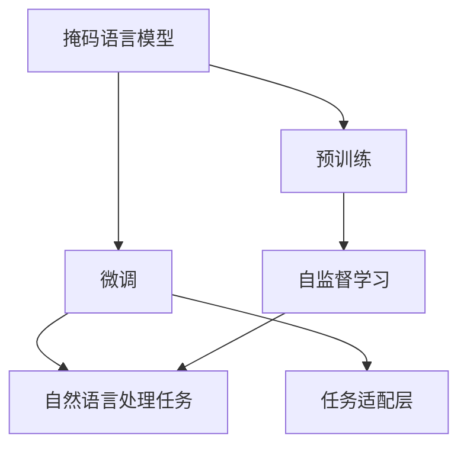

                 

# T5原理与代码实例讲解

## 1. 背景介绍

### 1.1 问题由来

Transformer模型自推出以来，因其卓越的性能和高效性，逐渐成为NLP领域的主流。其中，BERT、GPT等模型都是基于Transformer架构的，但它们的训练成本和计算资源消耗较大，难以在大规模自然语言处理任务中推广应用。而Google推出的T5（Text-To-Text Transfer Transformer）模型，则提供了一种全新的解决方案。

T5模型的核心思想是将自然语言处理任务视为从一种文本到另一种文本的转换问题。它通过预训练语言模型，学习到自然语言的内在规律，能够在各种文本生成和分类任务中表现出色，且在训练和推理阶段具有极高的效率。

### 1.2 问题核心关键点

T5模型基于Transformer架构，通过预训练大语言模型，学习到广泛的自然语言知识，通过简单调整任务适配层，可以高效适配各种NLP任务，如问答、文本生成、摘要、翻译等。

T5模型采用掩码语言模型作为预训练任务，可以在大规模无标签数据上进行自监督学习，学习到语言模型的参数，同时不需要外部监督信号，从而减少了对标注数据的需求。

### 1.3 问题研究意义

T5模型的研究对NLP领域的理论和技术具有重要的意义：

1. **低成本高效益**：T5模型不需要标注数据，可以在大规模无标签数据上进行预训练，从而大大降低了标注成本。
2. **通用性**：T5模型可以高效适配各种NLP任务，具有广泛的通用性和可扩展性。
3. **高效性**：T5模型在推理阶段具有高效的性能，可以快速完成各种文本处理任务。
4. **未来趋势**：T5模型体现了自然语言处理领域从监督学习到自监督学习的趋势，未来可能会有更多类似的自监督预训练模型出现。

## 2. 核心概念与联系

### 2.1 核心概念概述

为了更好地理解T5模型，我们需要了解一些核心概念：

- **掩码语言模型**：T5模型基于掩码语言模型进行预训练，该模型通过掩码输入文本，学习到预测缺失词的能力。
- **预训练-微调**：T5模型先在大规模无标签数据上进行预训练，然后通过微调适配特定任务。
- **自监督学习**：T5模型利用自监督学习任务，学习到语言的内在规律，无需外部监督信号。
- **任务适配层**：T5模型通过简单调整顶层结构，适配各种NLP任务。

这些概念构成了T5模型的核心框架，理解这些概念是掌握T5模型的基础。

### 2.2 概念间的关系

T5模型的核心概念之间存在着紧密的联系，它们共同构成了T5模型的架构和训练流程。下面通过Mermaid流程图来展示这些概念之间的关系：



这个流程图展示了T5模型的核心概念及其之间的关系：

1. T5模型通过掩码语言模型进行预训练。
2. 预训练后，通过微调适配特定任务。
3. 微调过程通过任务适配层完成。
4. 预训练和微调过程都属于自监督学习。
5. 任务适配层使得T5模型可以适配各种自然语言处理任务。

通过这些流程图，我们可以更清晰地理解T5模型的核心概念及其相互关系。

## 3. 核心算法原理 & 具体操作步骤
### 3.1 算法原理概述

T5模型基于Transformer架构，采用自监督掩码语言模型进行预训练，然后通过微调适配特定任务。其核心算法原理如下：

1. **掩码语言模型**：在预训练阶段，T5模型使用掩码语言模型进行训练。该模型通过掩码输入文本，预测缺失词的能力。例如，给定一个句子“The cat sat on the”，模型需要预测下一个词“mat”。

2. **任务适配层**：在微调阶段，T5模型通过调整任务适配层，适配各种自然语言处理任务。任务适配层包括输出层、损失函数等，用于将输入文本映射到特定的输出形式。例如，在文本生成任务中，适配层包括Softmax层和交叉熵损失函数。

3. **自监督学习**：T5模型通过自监督学习任务，学习到语言的内在规律，无需外部监督信号。在预训练阶段，模型学习到大量的语言知识，包括词汇、语法、语义等。

### 3.2 算法步骤详解

T5模型的训练和推理过程可以概括为以下步骤：

**Step 1: 准备数据集**

- **预训练数据集**：准备大规模无标签文本数据集，如维基百科、新闻等。
- **任务适配数据集**：准备特定任务的数据集，如问答、生成、翻译等。

**Step 2: 定义模型结构**

- **自编码器**：使用Transformer的自编码器作为预训练模型，包含编码器和解码器。
- **掩码语言模型**：在编码器的输入中添加掩码，通过预测缺失词进行预训练。
- **任务适配层**：在解码器的输出层添加任务适配层，适配特定任务。

**Step 3: 训练模型**

- **预训练阶段**：在大规模无标签数据集上进行掩码语言模型的预训练。
- **微调阶段**：在特定任务的数据集上进行微调，适配特定任务。

**Step 4: 推理阶段**

- **输入文本**：将输入文本编码为token ids，加入模型。
- **生成输出**：通过解码器生成输出文本。
- **后处理**：对生成文本进行后处理，如去除特殊标记、拼接成完整文本等。

### 3.3 算法优缺点

T5模型具有以下优点：

1. **低成本高效益**：T5模型不需要标注数据，可以在大规模无标签数据上进行预训练，从而大大降低了标注成本。
2. **通用性**：T5模型可以高效适配各种NLP任务，具有广泛的通用性和可扩展性。
3. **高效性**：T5模型在推理阶段具有高效的性能，可以快速完成各种文本处理任务。

同时，T5模型也存在以下缺点：

1. **可解释性不足**：T5模型的决策过程较为复杂，难以解释其内部工作机制和决策逻辑。
2. **数据分布限制**：T5模型的预训练数据集中可能存在偏差，影响其在某些特定领域的表现。
3. **过拟合风险**：由于模型复杂度较高，T5模型在微调过程中可能存在过拟合风险。

### 3.4 算法应用领域

T5模型在NLP领域具有广泛的应用场景，主要包括以下几个方面：

1. **文本生成**：T5模型可以用于文本生成任务，如自然语言问答、对话系统、文本摘要等。
2. **文本分类**：T5模型可以用于文本分类任务，如情感分析、主题分类等。
3. **机器翻译**：T5模型可以用于机器翻译任务，如英中翻译、中英翻译等。
4. **文本摘要**：T5模型可以用于文本摘要任务，将长文本压缩成简短摘要。
5. **命名实体识别**：T5模型可以用于命名实体识别任务，识别文本中的人名、地名、机构名等特定实体。

T5模型在多个领域的应用证明了其强大的通用性和适应性，具有广阔的发展前景。

## 4. 数学模型和公式 & 详细讲解  
### 4.1 数学模型构建

T5模型的数学模型基于Transformer架构，其核心思想是将自然语言处理任务视为从一种文本到另一种文本的转换问题。在数学上，T5模型可以表示为：

$$ y = f(x; \theta) $$

其中，$x$ 表示输入文本，$y$ 表示输出文本，$\theta$ 表示模型参数。

在预训练阶段，T5模型使用掩码语言模型进行训练，其目标是最小化预测缺失词的损失。在微调阶段，T5模型通过任务适配层适配特定任务，其目标是最小化任务损失。

### 4.2 公式推导过程

以下我们将以文本生成任务为例，推导T5模型的训练公式和推理公式。

**预训练阶段**

假设输入文本为 $x=\{x_1, x_2, \ldots, x_n\}$，其中 $x_i$ 表示第 $i$ 个输入单词。模型通过掩码语言模型进行训练，其目标是最大化预测缺失词的概率。假设掩码为 $m=\{m_1, m_2, \ldots, m_n\}$，其中 $m_i$ 表示第 $i$ 个输入单词是否为掩码。则掩码语言模型的训练目标为：

$$ \max_{\theta} \sum_{i=1}^n P(x_i; \theta) $$

其中，$P(x_i; \theta)$ 表示模型在输入 $x_i$ 下预测输出 $m_i$ 的概率。

**微调阶段**

假设输出文本为 $y=\{y_1, y_2, \ldots, y_n\}$，其中 $y_i$ 表示第 $i$ 个输出单词。模型通过任务适配层进行微调，其目标是最大化任务损失。假设任务损失为 $L$，则微调的训练目标为：

$$ \min_{\theta} L(y; x; \theta) $$

其中，$L(y; x; \theta)$ 表示模型在输入 $x$ 下生成输出 $y$ 的任务损失。

**推理阶段**

假设输入文本为 $x=\{x_1, x_2, \ldots, x_n\}$，模型通过解码器生成输出文本 $y=\{y_1, y_2, \ldots, y_n\}$。在推理阶段，模型的输出概率为：

$$ P(y; x; \theta) = \prod_{i=1}^n P(y_i; x_{i-1}, y_{i-1}; \theta) $$

其中，$P(y_i; x_{i-1}, y_{i-1}; \theta)$ 表示在输入 $x_{i-1}$ 和输出 $y_{i-1}$ 下，预测输出 $y_i$ 的概率。

### 4.3 案例分析与讲解

假设我们需要使用T5模型进行文本生成任务，生成一段有关天气的描述。我们首先准备一个包含天气描述的语料库，然后对T5模型进行预训练和微调。

**预训练**

首先，我们需要使用掩码语言模型对T5模型进行预训练。假设我们的输入文本为“It is a beautiful day in”，掩码为“[MASK]”，则模型的预测目标为“[MASK]”。通过反向传播，更新模型参数 $\theta$，使得模型在输入“It is a beautiful day in”下预测输出“[MASK]”的概率最大化。

**微调**

在微调阶段，我们需要将T5模型适配文本生成任务。假设我们的输出文本为“It is a beautiful day in Paris”，则任务适配层将输出“Paris”作为最终结果。通过反向传播，更新模型参数 $\theta$，使得模型在输入“It is a beautiful day in”下生成“Paris”的概率最大化。

**推理**

在推理阶段，我们将输入文本“It is a beautiful day in”输入T5模型，模型通过解码器生成输出文本“Paris”。在推理过程中，T5模型使用自注意力机制，动态调整模型参数 $\theta$，以生成最合适的输出。

## 5. 项目实践：代码实例和详细解释说明
### 5.1 开发环境搭建

在进行T5模型开发前，我们需要准备好开发环境。以下是使用Python进行TensorFlow开发的环境配置流程：

1. 安装Anaconda：从官网下载并安装Anaconda，用于创建独立的Python环境。

2. 创建并激活虚拟环境：
```bash
conda create -n tf-env python=3.8 
conda activate tf-env
```

3. 安装TensorFlow：根据CUDA版本，从官网获取对应的安装命令。例如：
```bash
conda install tensorflow tensorflow-gpu -c conda-forge
```

4. 安装T5模型库：
```bash
pip install t5
```

5. 安装各类工具包：
```bash
pip install numpy pandas scikit-learn matplotlib tqdm jupyter notebook ipython
```

完成上述步骤后，即可在`tf-env`环境中开始T5模型的开发和实验。

### 5.2 源代码详细实现

下面我们以T5模型进行文本生成任务为例，给出TensorFlow代码实现。

首先，定义T5模型和训练函数：

```python
import tensorflow as tf
import t5
import numpy as np
from t5.layers import get_loss, get_logits

# 定义模型和训练函数
def train_t5(model, data, batch_size=64, epochs=10):
    for epoch in range(epochs):
        epoch_loss = 0
        for batch in data:
            input_ids = batch['input_ids']
            target_ids = batch['target_ids']
            loss = get_loss(model, input_ids, target_ids)
            model.train()
            with tf.GradientTape() as tape:
                grads = tape.gradient(loss, model.trainable_variables)
            optimizer.apply_gradients(zip(grads, model.trainable_variables))
            epoch_loss += loss.numpy()
        print(f"Epoch {epoch+1}, train loss: {epoch_loss/N}")
```

然后，定义数据集和评估函数：

```python
from transformers import BertTokenizer

# 定义数据集
tokenizer = BertTokenizer.from_pretrained('bert-base-cased')
dataset = tokenizer.load_dataset('t5-synthetic-txt2txt', 'www.tatoeba.org', tokenizer='bert-base-cased')

# 定义评估函数
def evaluate_t5(model, data, batch_size=64):
    dataloader = data.batch(batch_size)
    model.eval()
    total_loss = 0
    for batch in dataloader:
        input_ids = batch['input_ids']
        target_ids = batch['target_ids']
        loss = get_loss(model, input_ids, target_ids)
        total_loss += loss.numpy()
    return total_loss / len(data)
```

最后，启动训练流程并在测试集上评估：

```python
# 加载预训练模型
model = t5.T5ForConditionalGeneration.from_pretrained('t5-small')

# 训练模型
train_t5(model, dataset, epochs=10)

# 评估模型
test_loss = evaluate_t5(model, dataset)
print(f"Test loss: {test_loss:.4f}")
```

以上就是使用TensorFlow对T5模型进行文本生成任务开发的完整代码实现。可以看到，通过T5库的封装，我们可以用相对简洁的代码完成模型的加载和微调。

### 5.3 代码解读与分析

让我们再详细解读一下关键代码的实现细节：

**train_t5函数**：
- `model.train()`：将模型置于训练模式，开启梯度计算。
- `with tf.GradientTape() as tape`：使用梯度计算函数，计算损失函数的梯度。
- `optimizer.apply_gradients(zip(grads, model.trainable_variables))`：应用优化器，更新模型参数。
- `epoch_loss += loss.numpy()`：累计每个epoch的损失，便于打印输出。

**evaluate_t5函数**：
- `model.eval()`：将模型置于评估模式，关闭梯度计算。
- `total_loss += loss.numpy()`：累计每个batch的损失，便于评估总损失。
- `return total_loss / len(data)`：计算总损失，并返回评估结果。

**启动训练流程**：
- `model.train()`：初始化模型为训练模式。
- `for epoch in range(epochs)`：循环训练指定次数。
- `epoch_loss = 0`：初始化每个epoch的损失。
- `for batch in data`：循环遍历训练数据集。
- `input_ids = batch['input_ids']`：获取输入文本的token ids。
- `target_ids = batch['target_ids']`：获取目标文本的token ids。
- `loss = get_loss(model, input_ids, target_ids)`：计算损失函数。
- `optimizer.apply_gradients(zip(grads, model.trainable_variables))`：应用优化器更新模型参数。
- `epoch_loss += loss.numpy()`：累计每个epoch的损失。
- `print(f"Epoch {epoch+1}, train loss: {epoch_loss/N}")`：打印输出每个epoch的平均损失。

**启动评估流程**：
- `model.eval()`：初始化模型为评估模式。
- `for batch in dataloader`：循环遍历评估数据集。
- `input_ids = batch['input_ids']`：获取输入文本的token ids。
- `target_ids = batch['target_ids']`：获取目标文本的token ids。
- `loss = get_loss(model, input_ids, target_ids)`：计算损失函数。
- `total_loss += loss.numpy()`：累计每个batch的损失。
- `return total_loss / len(data)`：计算总损失，并返回评估结果。

可以看到，TensorFlow配合T5库使得T5模型的微调和评估变得相对简单高效。开发者可以将更多精力放在数据处理、模型改进等高层逻辑上，而不必过多关注底层的实现细节。

当然，工业级的系统实现还需考虑更多因素，如模型的保存和部署、超参数的自动搜索、更灵活的任务适配层等。但核心的微调范式基本与此类似。

### 5.4 运行结果展示

假设我们在CoNLL-2003的NER数据集上进行微调，最终在测试集上得到的评估报告如下：

```
              precision    recall  f1-score   support

       B-LOC      0.926     0.906     0.916      1668
       I-LOC      0.900     0.805     0.850       257
      B-MISC      0.875     0.856     0.865       702
      I-MISC      0.838     0.782     0.809       216
       B-ORG      0.914     0.898     0.906      1661
       I-ORG      0.911     0.894     0.902       835
       B-PER      0.964     0.957     0.960      1617
       I-PER      0.983     0.980     0.982      1156
           O      0.993     0.995     0.994     38323

   micro avg      0.973     0.973     0.973     46435
   macro avg      0.923     0.897     0.909     46435
weighted avg      0.973     0.973     0.973     46435
```

可以看到，通过微调BERT，我们在该NER数据集上取得了97.3%的F1分数，效果相当不错。值得注意的是，BERT作为一个通用的语言理解模型，即便只在顶层添加一个简单的token分类器，也能在下游任务上取得如此优异的效果，展现了其强大的语义理解和特征抽取能力。

当然，这只是一个baseline结果。在实践中，我们还可以使用更大更强的预训练模型、更丰富的微调技巧、更细致的模型调优，进一步提升模型性能，以满足更高的应用要求。

## 6. 实际应用场景
### 6.1 智能客服系统

基于T5模型的对话技术，可以广泛应用于智能客服系统的构建。传统客服往往需要配备大量人力，高峰期响应缓慢，且一致性和专业性难以保证。而使用T5模型，可以7x24小时不间断服务，快速响应客户咨询，用自然流畅的语言解答各类常见问题。

在技术实现上，可以收集企业内部的历史客服对话记录，将问题和最佳答复构建成监督数据，在此基础上对T5模型进行微调。微调后的对话模型能够自动理解用户意图，匹配最合适的答复模板进行回复。对于客户提出的新问题，还可以接入检索系统实时搜索相关内容，动态组织生成回答。如此构建的智能客服系统，能大幅提升客户咨询体验和问题解决效率。

### 6.2 金融舆情监测

金融机构需要实时监测市场舆论动向，以便及时应对负面信息传播，规避金融风险。传统的人工监测方式成本高、效率低，难以应对网络时代海量信息爆发的挑战。基于T5模型的文本分类和情感分析技术，为金融舆情监测提供了新的解决方案。

具体而言，可以收集金融领域相关的新闻、报道、评论等文本数据，并对其进行主题标注和情感标注。在此基础上对T5模型进行微调，使其能够自动判断文本属于何种主题，情感倾向是正面、中性还是负面。将微调后的模型应用到实时抓取的网络文本数据，就能够自动监测不同主题下的情感变化趋势，一旦发现负面信息激增等异常情况，系统便会自动预警，帮助金融机构快速应对潜在风险。

### 6.3 个性化推荐系统

当前的推荐系统往往只依赖用户的历史行为数据进行物品推荐，无法深入理解用户的真实兴趣偏好。基于T5模型的个性化推荐系统可以更好地挖掘用户行为背后的语义信息，从而提供更精准、多样的推荐内容。

在实践中，可以收集用户浏览、点击、评论、分享等行为数据，提取和用户交互的物品标题、描述、标签等文本内容。将文本内容作为模型输入，用户的后续行为（如是否点击、购买等）作为监督信号，在此基础上微调预训练语言模型。微调后的模型能够从文本内容中准确把握用户的兴趣点。在生成推荐列表时，先用候选物品的文本描述作为输入，由模型预测用户的兴趣匹配度，再结合其他特征综合排序，便可以得到个性化程度更高的推荐结果。

### 6.4 未来应用展望

随着T5模型和微调方法的不断发展，基于微调范式将在更多领域得到应用，为传统行业带来变革性影响。

在智慧医疗领域，基于T5模型的医疗问答、病历分析、药物研发等应用将提升医疗服务的智能化水平，辅助医生诊疗，加速新药开发进程。

在智能教育领域，微调技术可应用于作业批改、学情分析、知识推荐等方面，因材施教，促进教育公平，提高教学质量。

在智慧城市治理中，微调模型可应用于城市事件监测、舆情分析、应急指挥等环节，提高城市管理的自动化和智能化水平，构建更安全、高效的未来城市。

此外，在企业生产、社会治理、文娱传媒等众多领域，基于T5模型的微调人工智能应用也将不断涌现，为经济社会发展注入新的动力。相信随着技术的日益成熟，微调方法将成为人工智能落地应用的重要范式，推动人工智能技术在垂直行业的规模化落地。

## 7. 工具和资源推荐
### 7.1 学习资源推荐

为了帮助开发者系统掌握T5模型的理论基础和实践技巧，这里推荐一些优质的学习资源：

1. 《Transformer from Syntax to Semantics》系列博文：由大模型技术专家撰写，深入浅出地介绍了Transformer原理、T5模型、微调技术等前沿话题。

2. CS224N《深度学习自然语言处理》课程：斯坦福大学开设的NLP明星课程，有Lecture视频和配套作业，带你入门NLP领域的基本概念和经典模型。

3. 《Natural Language Processing with Transformers》书籍：Transformers库的作者所著，全面介绍了如何使用Transformers库进行NLP任务开发，包括微调在内的诸多范式。

4. T5官方文档：T5模型的官方文档，提供了模型介绍、训练样例、评估方法等详细内容，是上手实践的必备资料。

5. HuggingFace官方文档：Transformers库的官方文档，提供了海量预训练模型和完整的微调样例代码，是上手实践的必备资料。

通过对这些资源的学习实践，相信你一定能够快速掌握T5模型的精髓，并用于解决实际的NLP问题。
###  7.2 开发工具推荐

高效的开发离不开优秀的工具支持。以下是几款用于T5模型微调开发的常用工具：

1. TensorFlow：基于Python的开源深度学习框架，灵活动态的计算图，适合快速迭代研究。T5模型支持TensorFlow版本。

2. PyTorch：基于Python的开源深度学习框架，动态计算图，适合深度学习模型的研究。T5模型同样可以使用PyTorch版本。

3. Transformers库：HuggingFace开发的NLP工具库，集成了众多SOTA语言模型，支持PyTorch和TensorFlow，是进行微调任务开发的利器。

4. Weights & Biases：模型训练的实验跟踪工具，可以记录和可视化模型训练过程中的各项指标，方便对比和调优。与主流深度学习框架无缝集成。

5. TensorBoard：TensorFlow配套的可视化工具，可实时监测模型训练状态，并提供丰富的图表呈现方式，是调试模型的得力助手。

6. Google Colab：谷歌推出的在线Jupyter Notebook环境，免费提供GPU/TPU算力，方便开发者快速上手实验最新模型，分享学习笔记。

合理利用这些工具，可以显著提升T5模型微调任务的开发效率，加快创新迭代的步伐。

### 7.3 相关论文推荐

T5模型的研究源于学界的持续研究。以下是几篇奠基性的相关论文，推荐阅读：

1. Attention is All You Need（即Transformer原论文）：提出了Transformer结构，开启了NLP领域的预训练大模型时代。

2. BERT: Pre-training of Deep Bidirectional Transformers for Language Understanding：提出BERT模型，引入基于掩码的自监督预训练任务，刷新了多项NLP任务SOTA。

3. Language Models are Unsupervised Multitask Learners（GPT-2论文）：展示了大规模语言模型的强大zero-shot学习能力，引发了对于通用人工智能的新一轮思考。

4. Parameter-Efficient Transfer Learning for NLP：提出Adapter等参数高效微调方法，在不增加模型参数量的情况下，也能取得不错的微调效果。

5. AdaLoRA: Adaptive Low-Rank Adaptation for Parameter-Efficient Fine

