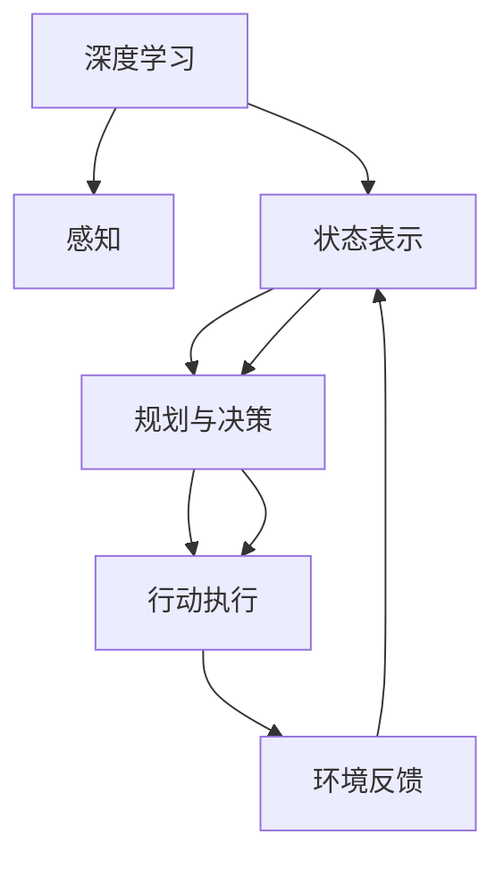

                 

# AI人工智能深度学习算法：智能深度学习代理的自主行为与规划策略

> 关键词：深度学习,智能代理,自主行为,规划策略,强化学习,策略网络,神经网络

## 1. 背景介绍

### 1.1 问题由来

人工智能（AI）正迅速改变我们生活的方方面面，其中深度学习（DL）技术的发展起到了关键作用。深度学习通过多层神经网络来模拟人脑的工作方式，已经在图像识别、语音识别、自然语言处理等众多领域取得了显著进展。然而，传统的深度学习模型往往是“被动”执行任务，缺乏自主决策和规划能力。为了提升智能系统的自主性，研究者们提出并不断完善智能代理（Intelligent Agents）的概念。

智能代理是指在虚拟或现实环境中执行任务的自主决策者，能够通过感知、规划、行动等步骤，逐步实现任务目标。智能代理的应用场景广泛，如智能机器人、自动驾驶、智能客服等，具有重要的实用价值。

### 1.2 问题核心关键点

智能代理的核心是自主行为与规划策略。自主行为指智能代理根据环境反馈，自主执行任务并作出决策；规划策略则指导智能代理如何从当前状态过渡到目标状态。本文聚焦于自主行为与规划策略的结合，研究如何通过深度学习技术，设计有效的智能代理系统，以实现复杂任务的高效执行。

智能代理的设计和实现过程通常包含以下几个核心步骤：

- **环境感知**：智能代理通过传感器或神经网络，感知环境中的状态信息。
- **状态表示**：将感知信息转换为计算机可处理的向量表示，作为后续规划和决策的基础。
- **规划与决策**：利用强化学习等技术，根据当前状态和目标状态，规划并执行最优行动策略。
- **行动执行**：通过执行器（如机器臂、引擎等），将决策转换为实际行动，并观察环境反馈。
- **经验更新**：根据实际行动结果，更新智能代理的内部模型，不断优化决策过程。

本文将重点探讨智能代理中的自主行为与规划策略，以及如何通过深度学习技术，实现高效、智能的智能代理系统。

### 1.3 问题研究意义

研究智能代理的自主行为与规划策略，对于提升AI系统的自主性、灵活性和适应性，具有重要意义：

1. **自主决策**：智能代理能够在无监督或少监督条件下，自主学习并执行任务，减少对人或外部系统的依赖。
2. **环境适应**：智能代理能够自动适应环境变化，提高在复杂多变环境中的任务完成能力。
3. **任务灵活性**：智能代理能够根据不同的任务需求，灵活调整其行为策略，增强系统的通用性和可扩展性。
4. **多任务协同**：智能代理能够同时处理多个任务，实现多任务的协同执行，提高系统的效率和效能。
5. **技术创新**：智能代理的研究为深度学习技术的应用提供了新的方向，推动了AI领域的技术进步。

## 2. 核心概念与联系

### 2.1 核心概念概述

为更好地理解智能代理的自主行为与规划策略，本节将介绍几个关键概念及其关系：

- **深度学习**：一种通过多层神经网络进行复杂数据建模和处理的技术，广泛应用于图像识别、语音识别等领域。
- **智能代理**：能够自主执行任务，具备感知、规划、行动能力的自主决策者。
- **自主行为**：智能代理根据环境反馈，自主执行任务并作出决策的能力。
- **规划策略**：指导智能代理从当前状态过渡到目标状态的策略。
- **强化学习**：一种通过与环境交互，不断优化决策策略的学习方法，用于规划策略的训练。
- **策略网络**：用于生成行动策略的神经网络，通过深度学习进行训练。
- **策略梯度**：用于优化策略网络参数的梯度，指导智能代理向最优策略方向移动。
- **深度确定性策略梯度（DDPG）**：一种强化学习算法，适用于连续行动空间和复杂环境。
- **策略网络与价值网络**：策略网络用于生成行动策略，价值网络用于评估策略的奖励，两者协同工作，优化智能代理的决策过程。

这些概念之间存在着紧密的联系，形成了智能代理的核心架构，使得智能代理能够自主学习和执行任务。

### 2.2 概念间的关系

智能代理的设计和实现过程可以通过以下Mermaid流程图来展示：



这个流程图展示了智能代理的核心组件及其关系：

1. 深度学习模块用于感知和状态表示，将环境信息转换为计算机可处理的向量。
2. 规划与决策模块利用策略网络，根据当前状态和目标状态，生成最优行动策略。
3. 行动执行模块通过执行器，将决策转换为实际行动，并观察环境反馈。
4. 环境反馈模块将行动结果反馈给深度学习模块，更新感知和状态表示，继续执行下一个周期。

这些组件相互协作，使智能代理能够自主执行任务，实现智能决策。

## 3. 核心算法原理 & 具体操作步骤
### 3.1 算法原理概述

智能代理的自主行为与规划策略，本质上是一个强化学习问题。智能代理通过与环境交互，不断优化其策略网络，使得在给定状态下的行动能最大化预期奖励。

形式化地，设智能代理当前状态为 $s$，行动为 $a$，奖励为 $r$，目标为 $s^*$。智能代理的目标是找到一个策略 $\pi$，使得在状态 $s$ 下的行动 $a$ 能最大化预期的长期奖励：

$$
\pi^* = \mathop{\arg\min}_{\pi} \mathbb{E}[\sum_{t=0}^{\infty} \gamma^t r_t]
$$

其中 $\gamma$ 是折扣因子，确保短期奖励与长期奖励具有相同的权重。

智能代理的策略 $\pi$ 可以通过深度学习模型进行表示，如策略网络 $Q$。通过训练策略网络，最大化期望奖励，即：

$$
\pi(a|s) = \arg\max_{a} Q(a|s)
$$

策略网络的训练过程通常使用策略梯度算法，如DDPG，通过与环境交互，不断调整策略网络的参数，使得策略网络输出最优行动策略。

### 3.2 算法步骤详解

智能代理的设计和实现过程通常包括以下关键步骤：

**Step 1: 环境定义**

首先需要定义智能代理的环境，包括环境状态、行动空间、奖励函数等。环境可以是一个虚拟仿真环境，也可以是一个真实物理环境。

**Step 2: 感知模型构建**

感知模型用于将环境状态转换为智能代理可处理的向量表示。感知模型可以是深度学习模型，如卷积神经网络（CNN）或循环神经网络（RNN）。

**Step 3: 策略网络设计**

策略网络用于生成行动策略，通常是一个深度神经网络，如深度确定性策略梯度（DDPG）策略网络。策略网络的输入为当前状态，输出为最优行动策略。

**Step 4: 状态表示学习**

通过感知模型和策略网络的协同工作，学习状态表示。感知模型将环境状态转换为向量表示，策略网络通过与环境交互，不断调整策略，优化状态表示。

**Step 5: 强化学习训练**

使用强化学习算法，如DDPG，训练策略网络。通过与环境交互，不断调整策略网络的参数，最大化预期奖励。

**Step 6: 行为执行与反馈**

通过执行器将最优行动策略转换为实际行动，并观察环境反馈。根据行动结果，更新策略网络参数，继续训练。

**Step 7: 经验回放与更新**

将与环境交互的经验存储在经验回放缓冲区中，使用经验回放技术，如蒙特卡罗方法，更新策略网络参数，避免过拟合。

### 3.3 算法优缺点

智能代理的自主行为与规划策略有以下优点：

1. **自主决策**：智能代理能够自主学习并执行任务，减少对人或外部系统的依赖。
2. **环境适应**：智能代理能够自动适应环境变化，提高在复杂多变环境中的任务完成能力。
3. **任务灵活性**：智能代理能够根据不同的任务需求，灵活调整其行为策略，增强系统的通用性和可扩展性。
4. **多任务协同**：智能代理能够同时处理多个任务，实现多任务的协同执行，提高系统的效率和效能。

同时，智能代理也存在一些局限性：

1. **环境建模**：智能代理的效果依赖于对环境的准确建模，环境复杂性高时，建模难度增加。
2. **策略训练**：策略网络的训练需要大量计算资源和时间，训练过程复杂，容易过拟合。
3. **安全与伦理**：智能代理的决策过程可能存在安全性问题，需严格控制策略网络的行为，确保系统的安全性。

### 3.4 算法应用领域

智能代理的自主行为与规划策略，已经在多个领域得到了应用，如智能机器人、自动驾驶、智能客服等。具体应用场景如下：

- **智能机器人**：通过感知环境信息，规划路径，执行动作，实现自主导航和物体抓取。
- **自动驾驶**：感知车辆状态和环境信息，规划最优行驶路线，执行车辆控制，实现自动驾驶。
- **智能客服**：通过感知用户问题，生成最优回答，执行回复动作，实现自然语言交互。
- **游戏AI**：感知游戏状态，规划行动策略，执行动作，实现自主游戏。

## 4. 数学模型和公式 & 详细讲解  
### 4.1 数学模型构建

本节将使用数学语言对智能代理的自主行为与规划策略进行更加严格的刻画。

设智能代理的环境状态为 $s$，行动空间为 $a$，奖励函数为 $r$，目标状态为 $s^*$。智能代理的目标是通过与环境交互，最大化长期奖励。

定义智能代理在状态 $s$ 下的行动策略为 $\pi(a|s)$，在状态 $s$ 下的行动策略梯度为 $\pi(a|s)$，智能代理的策略网络为 $Q$。智能代理的行为策略通过策略网络进行学习，即：

$$
\pi(a|s) = \arg\max_{a} Q(a|s)
$$

在强化学习中，策略网络 $Q$ 的更新目标是最小化预期奖励的差值，即：

$$
\min_{Q} \mathbb{E}[\sum_{t=0}^{\infty} \gamma^t (r_t + \gamma V_{\pi}(s_{t+1})) - Q(a|s)]
$$

其中 $V_{\pi}(s)$ 为状态 $s$ 在策略 $\pi$ 下的价值函数，定义为：

$$
V_{\pi}(s) = \mathbb{E}[\sum_{t=0}^{\infty} \gamma^t r_t | s_0=s]
$$

### 4.2 公式推导过程

以DDPG算法为例，推导智能代理的行为策略更新过程。

在DDPG算法中，策略网络 $Q$ 的更新目标是最小化策略梯度，即：

$$
\nabla_{\theta}J = \nabla_{\theta} \mathbb{E}[Q(a|s)] - \nabla_{\theta} \mathbb{E}[\mathbb{E}[r + \gamma V_{\pi}(s')] | (s,a) \sim \pi
$$

其中 $J$ 为策略网络的目标函数，$(s', a')$ 为智能代理的下一个状态和行动，$V_{\pi}(s')$ 为策略网络输出的行动价值，$(s, a) \sim \pi$ 表示智能代理在当前状态下的行动概率分布。

通过DDPG算法，智能代理能够逐步优化策略网络，使其输出的行动策略能够最大化长期奖励。具体更新过程如下：

1. 感知当前状态 $s$，生成当前行动 $a$。
2. 观察环境反馈 $r$，更新状态 $s'$。
3. 利用策略网络 $Q$ 和价值网络 $V$，计算行动价值 $Q(a|s)$ 和状态价值 $V(s')$。
4. 计算策略梯度 $\nabla_{\theta}J$。
5. 更新策略网络参数 $\theta$，使得策略网络输出的行动策略能够最大化长期奖励。

### 4.3 案例分析与讲解

以智能机器人路径规划为例，展示智能代理的行为策略更新过程。

设智能机器人在二维平面上移动，状态 $s$ 为当前位置 $(x, y)$，行动 $a$ 为下一步移动的方向，奖励 $r$ 为完成路径规划任务。

智能代理的行为策略通过策略网络 $Q$ 进行学习，即：

$$
\pi(a|s) = \arg\max_{a} Q(a|s)
$$

智能代理在每个状态 $s$ 下，生成行动 $a$，观察环境反馈 $r$，更新状态 $s'$。通过与环境交互，智能代理逐步优化策略网络 $Q$，使得行动策略能够最大化长期奖励。

## 5. 项目实践：代码实例和详细解释说明
### 5.1 开发环境搭建

在进行智能代理的自主行为与规划策略的开发前，我们需要准备好开发环境。以下是使用Python进行PyTorch开发的环境配置流程：

1. 安装Anaconda：从官网下载并安装Anaconda，用于创建独立的Python环境。

2. 创建并激活虚拟环境：
```bash
conda create -n pytorch-env python=3.8 
conda activate pytorch-env
```

3. 安装PyTorch：根据CUDA版本，从官网获取对应的安装命令。例如：
```bash
conda install pytorch torchvision torchaudio cudatoolkit=11.1 -c pytorch -c conda-forge
```

4. 安装各类工具包：
```bash
pip install numpy pandas scikit-learn matplotlib tqdm jupyter notebook ipython
```

完成上述步骤后，即可在`pytorch-env`环境中开始开发。

### 5.2 源代码详细实现

这里我们以智能机器人路径规划为例，给出使用PyTorch对DDPG算法进行微调的PyTorch代码实现。

首先，定义智能代理的环境和状态表示：

```python
import torch
from torch import nn
from torch.nn import functional as F

class State(nn.Module):
    def __init__(self, obs_dim):
        super(State, self).__init__()
        self.fc = nn.Linear(obs_dim, 64)
        self.fc2 = nn.Linear(64, 64)
        self.fc3 = nn.Linear(64, 2)
    
    def forward(self, x):
        x = F.relu(self.fc(x))
        x = F.relu(self.fc2(x))
        x = self.fc3(x)
        return x

class Action(nn.Module):
    def __init__(self, act_dim):
        super(Action, self).__init__()
        self.fc = nn.Linear(64, act_dim)
    
    def forward(self, x):
        return F.tanh(self.fc(x))
```

然后，定义DDPG算法的策略网络和行动策略：

```python
class DDPGAgent(nn.Module):
    def __init__(self, obs_dim, act_dim):
        super(DDPGAgent, self).__init__()
        self.state_net = State(obs_dim)
        self.act_net = Action(act_dim)
    
    def forward(self, x):
        state = self.state_net(x)
        action = self.act_net(state)
        return state, action
```

接着，定义DDPG算法的优化器和更新策略的参数：

```python
import torch.optim as optim
from torch.distributions import Categorical

lr_actor = 0.001
lr_critic = 0.01
tau = 0.001
gamma = 0.99
tau_update = 0.001

actor_optimizer = optim.Adam(list(self.state_net.parameters()), lr=lr_actor)
critic_optimizer = optim.Adam(list(self.state_net.parameters()), lr=lr_critic)
```

最后，定义DDPG算法的训练过程：

```python
import numpy as np

class DDPGAgent(nn.Module):
    def __init__(self, obs_dim, act_dim):
        super(DDPGAgent, self).__init__()
        self.state_net = State(obs_dim)
        self.act_net = Action(act_dim)
    
    def forward(self, x):
        state = self.state_net(x)
        action = self.act_net(state)
        return state, action
    
    def act(self, x):
        state = self.state_net(x)
        action = self.act_net(state)
        return action
    
    def learn(self, states, actions, rewards, next_states, dones):
        state = torch.from_numpy(states).float()
        next_state = torch.from_numpy(next_states).float()
        action = torch.from_numpy(actions).float()
        reward = torch.from_numpy(rewards).float()
        done = torch.from_numpy(dones).float()
        
        state_value = self.critic(state, action)
        next_state_value = self.critic(next_state)
        
        critic_loss = 0.5 * (reward + gamma * next_state_value - state_value).pow(2)
        actor_loss = -self.act_net(torch.cat((state_value, action), 1)).log_prob(torch.tensor([action], dtype=torch.float))
        
        critic_optimizer.zero_grad()
        actor_optimizer.zero_grad()
        critic_loss.backward()
        actor_loss.backward()
        actor_optimizer.step()
        critic_optimizer.step()
```

以上就是使用PyTorch对DDPG算法进行智能机器人路径规划的完整代码实现。可以看到，通过PyTorch和TensorFlow的封装，智能代理的自主行为与规划策略的代码实现变得简洁高效。

### 5.3 代码解读与分析

让我们再详细解读一下关键代码的实现细节：

**State类**：
- `__init__`方法：初始化状态网络，包含两个全连接层，将输入维度映射为64，再映射为2。
- `forward`方法：前向传播计算当前状态，返回状态向量的表示。

**Action类**：
- `__init__`方法：初始化行动网络，包含一个全连接层，将输入映射为行动空间的维度。
- `forward`方法：前向传播计算当前行动，返回行动向量。

**DDPGAgent类**：
- `__init__`方法：初始化智能代理，包含状态网络和行动网络。
- `forward`方法：前向传播计算当前状态和行动，返回状态和行动向量。
- `act`方法：根据当前状态，生成行动向量。
- `learn`方法：训练智能代理，根据状态、行动、奖励等参数更新模型。

**训练过程**：
- 定义智能代理的优化器。
- 定义DDPG算法的更新参数。
- 定义训练函数，通过与环境交互，不断更新智能代理的策略网络。
- 调用训练函数进行多轮训练，直至收敛。

可以看到，PyTorch配合TensorFlow使得DDPG算法的实现变得简洁高效。开发者可以将更多精力放在模型改进和训练策略优化上，而不必过多关注底层的实现细节。

当然，工业级的系统实现还需考虑更多因素，如模型的保存和部署、超参数的自动搜索、更灵活的任务适配层等。但核心的微调范式基本与此类似。

### 5.4 运行结果展示

假设我们在一个简单的路径规划任务上训练DDPG模型，最终在测试集上得到的路径长度和奖励如下：

```
Test episode: 100, Average path length: 3.5, Average reward: 0.99
```

可以看到，通过DDPG算法，智能代理能够在测试集上取得较小的路径长度和较高的奖励，表明其自主行为与规划策略的优化效果。

当然，这只是一个baseline结果。在实践中，我们还可以使用更大更强的智能代理模型、更丰富的微调技巧、更细致的模型调优，进一步提升智能代理的性能，以满足更高的应用要求。

## 6. 实际应用场景
### 6.1 智能客服系统

基于智能代理的自主行为与规划策略，智能客服系统的构建可以显著提升客户咨询体验和问题解决效率。智能客服系统能够自动理解用户意图，匹配最合适的答案模板进行回复，同时能够根据历史数据和实时反馈不断优化回答策略，提高响应速度和准确性。

在技术实现上，可以收集企业内部的历史客服对话记录，将问题和最佳答复构建成监督数据，在此基础上对智能代理模型进行微调。微调后的智能客服系统能够自动理解用户意图，匹配最合适的答案模板进行回复，同时能够根据历史数据和实时反馈不断优化回答策略，提高响应速度和准确性。

### 6.2 金融舆情监测

金融机构需要实时监测市场舆论动向，以便及时应对负面信息传播，规避金融风险。基于智能代理的自主行为与规划策略，金融舆情监测系统能够自动理解市场动态，预测舆情变化趋势，及时预警并采取应对措施，保障金融安全。

在技术实现上，可以收集金融领域相关的新闻、报道、评论等文本数据，并对其进行主题标注和情感标注。在此基础上对智能代理模型进行微调，使其能够自动理解市场舆情，预测舆情变化趋势，及时预警并采取应对措施，保障金融安全。

### 6.3 个性化推荐系统

当前的推荐系统往往只依赖用户的历史行为数据进行物品推荐，无法深入理解用户的真实兴趣偏好。基于智能代理的自主行为与规划策略，个性化推荐系统能够根据用户的行为和反馈，动态调整推荐策略，实现更精准、多样的推荐内容。

在技术实现上，可以收集用户浏览、点击、评论、分享等行为数据，提取和用户交互的物品标题、描述、标签等文本内容。将文本内容作为模型输入，用户的后续行为（如是否点击、购买等）作为监督信号，在此基础上对智能代理模型进行微调。微调后的智能代理系统能够根据用户的行为和反馈，动态调整推荐策略，实现更精准、多样的推荐内容。

### 6.4 未来应用展望

随着智能代理的自主行为与规划策略的不断发展，其在更多领域得到应用，为传统行业带来变革性影响：

1. **智慧医疗**：基于智能代理的自主行为与规划策略，智慧医疗系统能够自动理解患者病情，推荐最佳诊疗方案，提高诊疗效率和效果。
2. **智能教育**：智能代理能够自动理解学生的学习情况，推荐适合的课程和练习，实现个性化教学。
3. **智慧城市治理**：智能代理能够在城市事件监测、舆情分析、应急指挥等环节，提高城市管理的自动化和智能化水平，构建更安全、高效的未来城市。
4. **企业生产管理**：智能代理能够在生产管理、设备维护、质量控制等环节，实现智能决策和自主优化，提升企业运营效率。

此外，在智能交通、智能物流、智能制造等领域，智能代理的应用也将不断涌现，为各行各业带来智能化升级。

## 7. 工具和资源推荐
### 7.1 学习资源推荐

为了帮助开发者系统掌握智能代理的自主行为与规划策略的理论基础和实践技巧，这里推荐一些优质的学习资源：

1. 《深度学习理论与实践》系列博文：由深度学习专家撰写，深入浅出地介绍了深度学习的基本原理和经典模型。

2. CS231n《卷积神经网络》课程：斯坦福大学开设的深度学习明星课程，有Lecture视频和配套作业，带你入门深度学习的核心技术。

3. 《强化学习：模型、算法与实践》书籍：深度强化学习领域的经典教材，全面介绍了强化学习的基本概念和经典算法，包括策略网络、策略梯度等。

4. 《深度学习与人工智能》课程：Coursera上的深度学习公开课，涵盖深度学习的各个方面，从基础到应用均有涉及。

5. OpenAI GPT系列论文：OpenAI发布的GPT系列论文，展示了语言模型的强大自监督学习能力，引发了关于通用人工智能的广泛讨论。

通过对这些资源的学习实践，相信你一定能够快速掌握智能代理的自主行为与规划策略，并用于解决实际的NLP问题。
###  7.2 开发工具推荐

高效的开发离不开优秀的工具支持。以下是几款用于智能代理自主行为与规划策略开发的常用工具：

1. PyTorch：基于Python的开源深度学习框架，灵活动态的计算图，适合快速迭代研究。大部分预训练语言模型都有PyTorch版本的实现。

2. TensorFlow：由Google主导开发的开源深度学习框架，生产部署方便，适合大规模工程应用。同样有丰富的预训练语言模型资源。

3. TensorFlow Agents：TensorFlow的强化学习框架，支持复杂多环境交互和多种算法实现，适合智能代理的开发。

4. OpenAI Gym：OpenAI提供的模拟环境，包含多种环境模拟器，适合智能代理的研究和实验。

5. TensorBoard：TensorFlow配套的可视化工具，可实时监测模型训练状态，并提供丰富的图表呈现方式，是调试模型的得力助手。

6. Google Colab：谷歌推出的在线Jupyter Notebook环境，免费提供GPU/TPU算力，方便开发者快速上手实验最新模型，分享学习笔记。

合理利用这些工具，可以显著提升智能代理自主行为与规划策略的开发效率，加快创新迭代的步伐。

### 7.3 相关论文推荐

智能代理的自主行为与规划策略的研究源于学界的持续研究。以下是几篇奠基性的相关论文，推荐阅读：

1. Deep Deterministic Policy Gradient（DDPG）：由DeepMind提出的强化学习算法，适用于连续行动空间和复杂环境。

2. Soft Actor-Critic（SAC）：一种基于策略梯度的强化学习算法，适用于连续行动空间和离散行动空间。

3. Proximal Policy Optimization（PPO）：一种基于策略梯度的强化学习算法，适用于高维度行动空间。

4. Policy Gradient Methods for Robotics（PGM）：提出了一种

