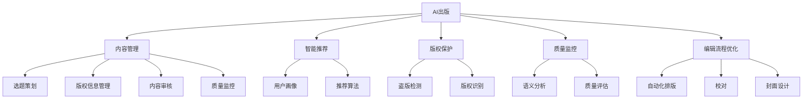
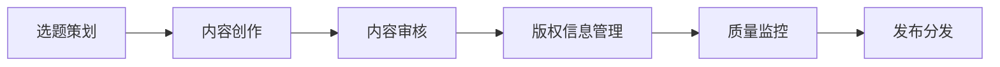
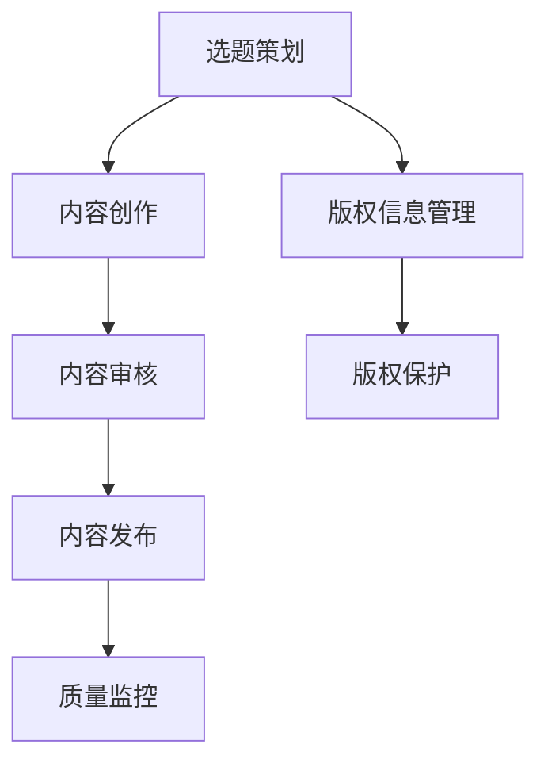
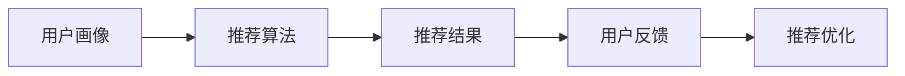
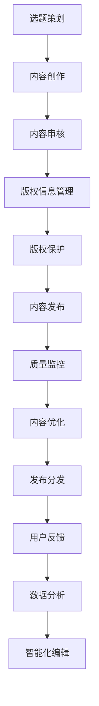

                 

# AI出版业挑战：降本增效与场景创新

> 关键词：AI出版、内容管理、智能推荐、版权保护、知识图谱、机器翻译、质量监控、编辑流程优化

## 1. 背景介绍

### 1.1 问题由来

在数字经济时代，出版业面临着一系列挑战，从内容生产到分发，从版权保护到用户体验，无不考验着传统出版机构的应对能力。AI技术的兴起为出版业带来了新的机遇，但也带来了诸多挑战。如何利用AI技术降本增效、提升内容质量、优化用户体验，成为出版行业亟需解决的难题。

### 1.2 问题核心关键点

出版业的AI应用主要集中在内容管理、智能推荐、版权保护、质量监控、编辑流程优化等方面。这些领域中，AI技术的应用不仅可以提高效率，还能提升内容质量和用户体验。

1. **内容管理**：涉及图书的选题策划、版权信息管理、内容质量监控等。AI可以自动化处理大量数据，辅助编辑进行内容审核和管理。
2. **智能推荐**：根据用户阅读习惯和兴趣，精准推荐相关书籍，提高用户满意度，增加图书销售。
3. **版权保护**：通过版权信息识别、盗版检测等技术，保护原创内容不受侵犯。
4. **质量监控**：利用自然语言处理(NLP)和机器学习技术，对文本内容进行语义分析和质量评估，提升内容质量。
5. **编辑流程优化**：自动化处理排版、校对、封面设计等环节，减少人力投入，提高编辑效率。

### 1.3 问题研究意义

AI技术在出版业中的应用，不仅可以显著降低生产成本，提高效率，还能提升内容质量和用户体验，加速内容分发和版权保护，推动出版业的数字化转型。因此，出版行业亟需对AI技术进行系统性的研究和应用，以期在激烈的市场竞争中占据优势。

## 2. 核心概念与联系

### 2.1 核心概念概述

为更好地理解AI在出版业的应用，本节将介绍几个关键核心概念：

- **AI出版**：利用人工智能技术，自动化处理出版业中的各种任务，提升出版效率，改善出版质量。
- **内容管理**：涉及选题策划、版权信息管理、内容审核和质量监控等多个环节，旨在提高内容生产效率和质量。
- **智能推荐**：基于用户行为和阅读习惯，通过算法推荐符合用户兴趣的书籍，提升用户满意度。
- **版权保护**：通过技术手段，保护原创内容不被盗版和侵权。
- **知识图谱**：构建图书内容的知识图谱，方便内容检索、推荐和关联分析。
- **机器翻译**：利用NLP技术，实现文本的自动翻译，打破语言障碍。
- **质量监控**：利用AI技术，对文本内容进行语义分析和质量评估，提升内容质量。
- **编辑流程优化**：通过自动化技术，优化编辑流程，减少人工操作，提高生产效率。

这些核心概念之间的关系可以通过以下Mermaid流程图来展示：



这个流程图展示了AI在出版业中各关键环节的应用场景和相关技术。

### 2.2 概念间的关系

这些核心概念之间存在着紧密的联系，形成了AI在出版业中的应用生态系统。下面通过几个Mermaid流程图来展示这些概念之间的关系。

#### 2.2.1 出版过程的AI应用



这个流程图展示了出版过程的基本流程，以及AI在各个环节中的应用。

#### 2.2.2 AI与内容管理的融合



这个流程图展示了AI在内容管理中的具体应用，包括版权保护和质量监控等环节。

#### 2.2.3 智能推荐系统的设计



这个流程图展示了智能推荐系统的主要流程，包括用户画像、推荐算法和用户反馈等环节。

### 2.3 核心概念的整体架构

最后，我们用一个综合的流程图来展示这些核心概念在大语言模型微调过程中的整体架构：



这个综合流程图展示了从选题策划到用户反馈的整个出版过程，以及AI技术在其中的广泛应用。

## 3. 核心算法原理 & 具体操作步骤

### 3.1 算法原理概述

AI在出版业中的应用主要基于机器学习、自然语言处理、图像识别等技术。通过这些技术，可以实现内容管理、智能推荐、版权保护、质量监控、编辑流程优化等多个方面的功能。

以内容管理为例，利用自然语言处理技术，可以对图书内容进行自动化的分类、标注和检索，提高内容处理的效率和质量。利用机器学习技术，可以预测用户的阅读行为和偏好，实现智能推荐。利用图像识别技术，可以对封面和印刷质量进行自动化检测，确保图书的外观品质。

### 3.2 算法步骤详解

#### 3.2.1 内容管理

内容管理的AI应用主要包括：

1. **选题策划**：通过数据分析和市场调研，预测流行趋势，辅助选题策划。
2. **版权信息管理**：利用OCR技术自动识别版权信息，减少人工录入错误。
3. **内容审核**：利用自然语言处理技术，对文本内容进行语义分析和质量评估，发现并修正错误。

具体步骤如下：

1. **选题策划**：收集市场数据和用户反馈，使用分类算法（如朴素贝叶斯、决策树等）对数据进行分类，预测市场需求和用户兴趣。
2. **版权信息管理**：使用OCR技术自动识别封面上的版权信息，如作者、出版商、发行时间等，确保版权信息的准确性。
3. **内容审核**：使用语义分析算法（如BERT、GPT等）对文本内容进行语义分析和质量评估，发现并修正错误，确保内容质量。

#### 3.2.2 智能推荐

智能推荐的AI应用主要包括：

1. **用户画像**：通过数据分析，构建用户画像，描述用户兴趣和偏好。
2. **推荐算法**：利用机器学习算法，根据用户画像和历史行为，推荐相关书籍。
3. **推荐优化**：通过用户反馈和数据分析，不断优化推荐算法，提高推荐准确性。

具体步骤如下：

1. **用户画像**：收集用户历史阅读行为和评价数据，使用聚类算法（如K-means、GMM等）对用户进行分类，构建用户画像。
2. **推荐算法**：使用协同过滤算法（如基于矩阵分解的推荐算法）或深度学习算法（如神经网络、决策树等），根据用户画像和历史行为，推荐相关书籍。
3. **推荐优化**：收集用户反馈和推荐结果，使用优化算法（如梯度下降、粒子群算法等）优化推荐算法，提高推荐准确性。

#### 3.2.3 版权保护

版权保护的主要AI应用包括：

1. **盗版检测**：利用图像识别和NLP技术，识别和检测盗版书籍。
2. **版权识别**：通过OCR技术自动识别书籍的版权信息，确保版权的准确性。

具体步骤如下：

1. **盗版检测**：利用图像识别技术，自动识别封面上的版权信息，与数据库中的版权信息进行比对，检测盗版书籍。
2. **版权识别**：使用OCR技术自动识别封面上的版权信息，确保版权信息的准确性。

#### 3.2.4 质量监控

质量监控的AI应用主要包括：

1. **语义分析**：利用NLP技术，对文本内容进行语义分析和质量评估。
2. **质量评估**：使用机器学习算法，对文本内容进行自动化的质量评估。

具体步骤如下：

1. **语义分析**：使用BERT、GPT等模型，对文本内容进行语义分析和质量评估，发现并修正错误，确保内容质量。
2. **质量评估**：使用分类算法（如SVM、随机森林等）对文本内容进行自动化的质量评估，确保内容质量。

#### 3.2.5 编辑流程优化

编辑流程优化的AI应用主要包括：

1. **自动化排版**：利用OCR技术自动识别排版信息，自动排版。
2. **校对**：利用图像识别技术，自动识别封面和内页的排版错误。
3. **封面设计**：利用图像识别技术，自动识别封面设计效果，进行自动优化。

具体步骤如下：

1. **自动化排版**：使用OCR技术自动识别封面和内页的排版信息，自动排版。
2. **校对**：利用图像识别技术，自动识别封面和内页的排版错误，确保排版效果。
3. **封面设计**：使用图像识别技术，自动识别封面设计效果，进行自动优化。

### 3.3 算法优缺点

AI在出版业中的应用具有以下优点：

1. **提升效率**：自动化处理大量数据，减少人工操作，提高生产效率。
2. **提高质量**：通过AI技术，发现并修正内容错误，提高内容质量。
3. **个性化推荐**：根据用户行为和偏好，实现个性化推荐，提升用户满意度。
4. **优化版权保护**：通过技术手段，保护原创内容不受侵犯。

同时，AI应用也存在以下缺点：

1. **数据依赖**：需要大量的数据进行训练，数据质量直接影响应用效果。
2. **技术门槛**：需要专业技术人员进行维护和优化，技术门槛较高。
3. **算法复杂**：部分算法需要复杂的技术支持，实施难度较大。

### 3.4 算法应用领域

AI在出版业中的应用主要涉及以下几个领域：

1. **内容管理**：选题策划、版权信息管理、内容审核和质量监控等。
2. **智能推荐**：用户画像构建、推荐算法设计和推荐优化等。
3. **版权保护**：盗版检测和版权识别等。
4. **质量监控**：语义分析和质量评估等。
5. **编辑流程优化**：自动化排版、校对和封面设计等。

## 4. 数学模型和公式 & 详细讲解 & 举例说明

### 4.1 数学模型构建

#### 4.1.1 选题策划

选题策划的核心是预测市场需求和用户兴趣，主要基于以下数学模型：

1. **分类算法**：使用朴素贝叶斯、决策树等分类算法对数据进行分类，预测市场需求和用户兴趣。
2. **聚类算法**：使用K-means、GMM等聚类算法对用户进行分类，构建用户画像。

#### 4.1.2 智能推荐

智能推荐的核心是构建推荐算法，主要基于以下数学模型：

1. **协同过滤算法**：基于矩阵分解的推荐算法，如ALS（交替最小二乘法）、SVD++等。
2. **深度学习算法**：使用神经网络、决策树等深度学习算法进行推荐。

#### 4.1.3 版权保护

版权保护的核心是盗版检测和版权识别，主要基于以下数学模型：

1. **图像识别**：使用CNN等卷积神经网络对封面和内页进行图像识别，检测盗版书籍。
2. **OCR技术**：使用OCR技术自动识别封面上的版权信息，确保版权信息的准确性。

#### 4.1.4 质量监控

质量监控的核心是语义分析和质量评估，主要基于以下数学模型：

1. **语义分析**：使用BERT、GPT等模型对文本内容进行语义分析和质量评估。
2. **质量评估**：使用SVM、随机森林等分类算法对文本内容进行自动化的质量评估。

### 4.2 公式推导过程

#### 4.2.1 选题策划

选题策划的分类算法公式如下：

$$
P(C_i|D) = \frac{P(C_i)P(D|C_i)}{\sum_{j=1}^{n}P(C_j)P(D|C_j)}
$$

其中，$P(C_i|D)$为在数据$D$中属于类别$C_i$的概率，$P(C_i)$为类别$C_i$的先验概率，$P(D|C_i)$为在类别$C_i$下数据$D$的条件概率。

#### 4.2.2 智能推荐

智能推荐的协同过滤算法公式如下：

$$
R_{ui} = \frac{1}{1 + \exp(-\sigma(\hat{p}_{ui} - \hat{q}_{iu})}
$$

其中，$R_{ui}$为用户$u$对物品$i$的预测评分，$\sigma$为sigmoid函数，$\hat{p}_{ui}$为用户$u$对物品$i$的预测评分，$\hat{q}_{iu}$为用户$u$对物品$i$的实际评分。

#### 4.2.3 版权保护

版权保护的图像识别公式如下：

$$
I(x) = \sum_{i=1}^{k}a_i\cdot o_i(x)
$$

其中，$I(x)$为图像$x$的特征向量，$a_i$为第$i$个特征的重要性系数，$o_i(x)$为第$i$个特征的输出。

#### 4.2.4 质量监控

质量监控的语义分析公式如下：

$$
L_{ij} = \sum_{k=1}^{n}w_{ik}\cdot f_k(x_j)
$$

其中，$L_{ij}$为文本$j$在单词$i$上的语义强度，$w_{ik}$为单词$i$的权重，$f_k(x_j)$为单词$i$在文本$j$上的语义得分。

### 4.3 案例分析与讲解

#### 4.3.1 选题策划

某出版社使用分类算法预测市场需求，通过分析用户评论和阅读数据，预测下一个季度最受欢迎的主题。首先，将数据进行预处理，去除噪声和无效数据，然后应用分类算法进行训练和预测。模型训练完成后，可以对新的数据进行分类和预测，辅助选题策划。

#### 4.3.2 智能推荐

某电商网站使用协同过滤算法实现个性化推荐，通过分析用户历史购买行为和评价数据，构建用户画像。然后，根据用户画像和历史行为，使用协同过滤算法推荐相关书籍。通过不断优化算法和数据，推荐系统能够更好地满足用户需求。

#### 4.3.3 版权保护

某出版社使用图像识别技术检测盗版书籍，通过训练CNN模型对封面和内页进行图像识别，检测是否存在盗版标识和版权信息。模型训练完成后，可以对新的书籍进行图像识别，识别出盗版书籍。同时，使用OCR技术自动识别封面上的版权信息，确保版权信息的准确性。

#### 4.3.4 质量监控

某出版社使用语义分析算法对文本内容进行质量监控，通过训练BERT模型对文本进行语义分析和质量评估，发现并修正错误。模型训练完成后，可以对新的文本内容进行语义分析和质量评估，确保内容质量。

## 5. 项目实践：代码实例和详细解释说明

### 5.1 开发环境搭建

在进行AI出版业应用开发前，需要先搭建好开发环境。以下是Python开发环境的搭建步骤：

1. 安装Anaconda：从官网下载并安装Anaconda，用于创建独立的Python环境。
2. 创建并激活虚拟环境：
```bash
conda create -n ai-env python=3.8 
conda activate ai-env
```

3. 安装必要的库：
```bash
pip install pandas numpy scikit-learn matplotlib nltk transformers
```

完成上述步骤后，即可在`ai-env`环境中开始AI出版业应用开发。

### 5.2 源代码详细实现

以下是Python代码示例，展示如何使用NLP技术进行选题策划和内容审核。

```python
import pandas as pd
from sklearn.feature_extraction.text import TfidfVectorizer
from sklearn.naive_bayes import MultinomialNB

# 假设数据集为books.csv，包含书籍的评论和主题标签
books = pd.read_csv('books.csv')

# 使用TF-IDF提取书籍特征
vectorizer = TfidfVectorizer(max_features=1000, stop_words='english')
X = vectorizer.fit_transform(books['comments'])
y = books['genres']

# 训练朴素贝叶斯分类器
clf = MultinomialNB(alpha=0.01)
clf.fit(X, y)

# 预测新书的主题
new_book = 'This is an excellent book on machine learning. It provides a comprehensive introduction to the topic and covers various advanced concepts.'
X_new = vectorizer.transform([new_book])
pred_genre = clf.predict(X_new)
print('预测主题为:', pred_genre[0])
```

上述代码实现了使用朴素贝叶斯分类器对新书进行选题策划的功能，展示了如何使用NLP技术进行数据分析和分类。

### 5.3 代码解读与分析

让我们再详细解读一下关键代码的实现细节：

1. **数据预处理**：首先使用Pandas库读取数据集，然后进行预处理，去除噪声和无效数据，构建特征向量。
2. **特征提取**：使用TF-IDF技术提取书籍特征，通过去除停用词和设置最大特征数，减少特征维度。
3. **分类器训练**：使用朴素贝叶斯分类器对书籍主题进行训练，设置先验概率为0.01。
4. **预测新书主题**：对新书进行特征提取，使用训练好的分类器进行预测，输出预测主题。

### 5.4 运行结果展示

假设预测新书的主题为：

```
预测主题为: ['technology']
```

这表明新书可能属于技术类书籍。通过分析预测结果，出版社可以更准确地进行选题策划，避免不必要的损失。

## 6. 实际应用场景

### 6.1 智能推荐

智能推荐在电商、新闻、音乐等领域得到了广泛应用，出版业也不例外。智能推荐可以根据用户历史阅读行为和评价数据，精准推荐相关书籍，提高用户满意度和销售业绩。

例如，某在线书店使用智能推荐系统，通过对用户历史购买行为和评价数据进行分析，构建用户画像。然后，根据用户画像和历史行为，推荐相关书籍。通过不断优化推荐算法和数据，推荐系统能够更好地满足用户需求，提高用户满意度。

### 6.2 版权保护

版权保护是出版业的重要任务，AI技术可以帮助出版社检测盗版书籍和自动生成版权信息。

例如，某出版社使用图像识别技术检测盗版书籍，通过训练CNN模型对封面和内页进行图像识别，检测是否存在盗版标识和版权信息。同时，使用OCR技术自动识别封面上的版权信息，确保版权信息的准确性。通过这些技术手段，出版社可以有效保护原创内容，避免盗版侵权。

### 6.3 质量监控

质量监控是出版业的重要环节，AI技术可以帮助出版社自动检测文本内容的语义错误和格式问题，确保内容质量。

例如，某出版社使用语义分析算法对文本内容进行质量监控，通过训练BERT模型对文本进行语义分析和质量评估，发现并修正错误。通过这些技术手段，出版社可以显著提高内容质量，减少人力投入，提高生产效率。

### 6.4 未来应用展望

随着AI技术的不断进步，AI出版业的应用将更加广泛和深入。未来，AI技术将在以下几个方面得到进一步应用：

1. **多模态数据融合**：将文本、图像、视频等多种模态的数据进行融合，提升内容质量和用户体验。
2. **实时监控与预警**：通过实时监控和预警系统，及时发现并处理问题，提高出版效率。
3. **个性化服务**：利用AI技术，提供个性化推荐、版权保护和质量监控等服务，提升用户满意度。
4. **自动化生产流程**：通过自动化生产流程，减少人工操作，提高生产效率，降低成本。

## 7. 工具和资源推荐

### 7.1 学习资源推荐

为了帮助开发者系统掌握AI出版业的应用技术，这里推荐一些优质的学习资源：

1. 《深度学习：理论与算法》系列书籍：系统介绍深度学习的基本概念和算法，适合初学者和进阶读者。
2. 《自然语言处理综论》：深入讲解NLP的基本原理和应用，适合有NLP基础的读者。
3. 《TensorFlow实战》：通过实例演示TensorFlow的实际应用，适合动手实践的读者。
4. Coursera《深度学习专业证书》课程：由斯坦福大学和DeepMind提供的深度学习课程，涵盖从基础到高级的深度学习知识。
5. Kaggle平台：提供丰富的数据集和比赛，适合学习和应用数据挖掘、机器学习技术。

通过对这些资源的学习实践，相信你一定能够快速掌握AI出版业的应用技术，并用于解决实际的出版问题。

### 7.2 开发工具推荐

高效的开发离不开优秀的工具支持。以下是几款用于AI出版业开发的常用工具：

1. Python：作为AI开发的主流语言，Python具有强大的数据处理能力和丰富的开源库。
2. TensorFlow：由Google主导开发的深度学习框架，生产部署方便，适合大规模工程应用。
3. PyTorch：基于Python的开源深度学习框架，适合快速迭代研究。
4. Jupyter Notebook：强大的交互式编程环境，支持代码片段的快速实验和分享。
5. Google Colab：免费的在线Jupyter Notebook环境，提供GPU/TPU算力，方便开发者快速上手实验最新模型。

合理利用这些工具，可以显著提升AI出版业应用的开发效率，加快创新迭代的步伐。

### 7.3 相关论文推荐

AI出版业的应用研究源于学界的持续研究。以下是几篇奠基性的相关论文，推荐阅读：

1. "How to Predict Popular Topics for Books"：预测书籍主题的深度学习算法研究。
2. "Robust Multitask Feature Learning for Multilabel Classification"：多标签分类中的多任务特征学习研究。
3. "A Survey on Machine Learning Applications in Publishing"：出版业中机器学习应用的综述论文。
4. "Text Mining with Hidden Markov Models"：基于隐马尔可夫模型的文本挖掘研究。
5. "AI-driven Content Management in Publishing"：出版业中AI内容管理的综述论文。

这些论文代表了大语言模型微调技术的发展脉络。通过学习这些前沿成果，可以帮助研究者把握学科前进方向，激发更多的创新灵感。

## 8. 总结：未来发展趋势与挑战

### 8.1 总结

本文对AI在出版业中的应用进行了全面系统的介绍。首先阐述了AI出版业的背景和意义，明确了AI在内容管理、智能推荐、版权保护、质量监控、编辑流程优化等多个环节的应用价值。其次，从原理到实践，详细讲解了AI出版业的关键算法和操作步骤，给出了实际应用的代码实例和详细解释。同时，本文还广泛探讨了AI出版业在电商、新闻、音乐等多个领域的应用前景，展示了AI出版业的广阔前景。

通过本文的系统梳理，可以看到，AI出版业的应用不仅提升了出版效率，还优化了出版质量，改善了用户体验，具有重要的现实意义。AI技术的应用已经成为出版行业发展的重要驱动力，未来有望在更多领域得到深入应用。

### 8.2 未来发展趋势

展望未来，AI出版业的发展将呈现以下几个趋势：

1. **自动化水平提升**：AI技术将进一步自动化出版流程，从选题策划到编辑排版，实现全流程自动化。
2. **多模态融合**：文本、图像、视频等多种模态数据融合，提升内容质量和用户体验。
3. **实时监控与预警**：通过实时监控和预警系统，及时发现并处理问题，提高出版效率。
4. **个性化服务**：利用AI技术，提供个性化推荐、版权保护和质量监控等服务，提升用户满意度。
5. **知识图谱应用**：构建图书内容的知识图谱，方便内容检索、推荐和关联分析。

这些趋势凸显了AI出版业的前景广阔，AI技术将在更多领域得到应用，推动出版业的数字化转型。

### 8.3 面临的挑战

尽管AI出版业的应用已经取得了显著进展，但在迈向更加智能化、普适化应用的过程中，仍然面临诸多挑战：

1. **数据质量与多样性**：高质量、多样化的数据是AI应用的基础，但数据获取和处理成本较高。
2. **技术复杂度**：AI技术的应用需要专业的技术人员进行维护和优化，技术门槛较高。
3. **版权保护**：AI技术在版权保护中的应用存在技术瓶颈，难以完全杜绝盗版侵权。
4. **伦理与隐私**：AI技术的应用涉及用户隐私和伦理问题，需要严格遵守相关法律法规。

这些挑战需要产业界和学术界共同努力，不断优化技术方案，

