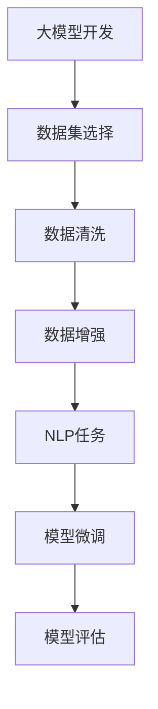

                 

# 从零开始大模型开发与微调：Ag_news数据集介绍和数据清洗

> 关键词：大模型开发, 数据清洗, 预处理, 自然语言处理(NLP), 数据增强, Ag_news数据集

## 1. 背景介绍

### 1.1 问题由来
在人工智能领域，特别是自然语言处理（NLP）领域，大模型的开发和微调始终是一个热门话题。随着大规模预训练模型的出现，如BERT、GPT等，大模型的应用范围越来越广泛，从简单的文本分类到复杂的对话系统，均能表现出色。

然而，在实际应用中，数据集的质量对模型性能的影响至关重要。数据集的质量问题通常涉及数据缺失、噪声、数据不平衡等。特别是对于NLP领域的数据集，文本的清洗和预处理更是重中之重。本文将从数据清洗的角度，介绍如何在构建大模型时选择和处理数据集，以确保模型的高效和准确性。

### 1.2 问题核心关键点
在构建大模型时，选择合适的数据集和对其进行有效的预处理，是提高模型性能的关键。本文将重点介绍Ag_news数据集，并详细阐述数据清洗和预处理的具体步骤，以供读者参考。

### 1.3 问题研究意义
对数据集进行清洗和预处理，可以显著提高模型训练的效率和性能。通过合理的数据清洗，可以去除噪声和无关信息，增强模型对关键特征的识别能力，从而提升模型在各种任务上的表现。此外，通过数据增强，可以增加数据多样性，进一步提升模型的泛化能力。

## 2. 核心概念与联系

### 2.1 核心概念概述

在进行大模型开发和微调时，涉及到几个核心概念，包括：

- **大模型开发**：使用大规模数据集进行预训练，获得具有通用语言知识的大模型，再进行特定任务的数据集微调。
- **数据清洗**：去除数据集中的噪声、缺失值和不平衡数据，确保数据集的质量。
- **数据增强**：通过文本变换、回译等方式增加数据集的多样性，提高模型的泛化能力。
- **自然语言处理(NLP)**：处理和分析人类语言，包括文本分类、实体识别、情感分析等任务。
- **Ag_news数据集**：用于文本分类任务的数据集，包含新闻标题及其分类标签。

这些概念之间存在紧密的联系，通过合理的清洗和预处理，可以显著提升大模型的性能。

### 2.2 概念间的关系

通过以下Mermaid流程图，可以更直观地理解这些概念之间的关系：



这个流程图展示了从数据集选择、清洗和增强，到任务微调和评估的整体流程。

## 3. 核心算法原理 & 具体操作步骤
### 3.1 算法原理概述

在进行大模型开发和微调时，数据集的质量对模型的表现至关重要。数据集的质量问题通常涉及数据缺失、噪声、数据不平衡等。本文将重点介绍如何通过数据清洗和增强，提升数据集的质量，从而提高模型的性能。

### 3.2 算法步骤详解

#### 3.2.1 数据清洗

数据清洗的目的是去除数据中的噪声和无关信息，提高数据集的质量。具体步骤如下：

1. **数据去重**：去除重复的记录，减少数据冗余。
2. **缺失值处理**：对于缺失值，可以采用插值、删除或使用模型预测等方式进行补全。
3. **异常值检测**：检测和处理异常值，如通过箱线图、Z-score等方法检测。
4. **文本去噪**：去除文本中的HTML标签、非文本信息等。

#### 3.2.2 数据增强

数据增强的目的是通过增加数据的多样性，提高模型的泛化能力。具体步骤如下：

1. **文本变换**：如替换、删除、反转单词等。
2. **回译**：将英文文本翻译成其他语言，再翻译回英文。
3. **数据合成**：通过随机生成或修改文本等方式增加数据量。

### 3.3 算法优缺点

数据清洗和增强具有以下优点：

- 提高模型泛化能力：通过增加数据的多样性，模型可以更好地适应不同的数据分布。
- 减少过拟合风险：数据清洗可以减少噪声和无关信息，降低模型过拟合的风险。

同时，也存在一些缺点：

- 增加数据处理成本：数据清洗和增强需要消耗大量的时间和计算资源。
- 数据质量难以完全保证：即使进行了数据清洗和增强，仍可能存在一些数据质量问题。

### 3.4 算法应用领域

数据清洗和增强不仅适用于大模型的开发和微调，还广泛应用于各种NLP任务，如文本分类、情感分析、命名实体识别等。这些技术可以显著提升模型在实际应用中的表现。

## 4. 数学模型和公式 & 详细讲解 & 举例说明

### 4.1 数学模型构建

在进行数据清洗和增强时，需要构建相应的数学模型，以便对数据进行处理。以下是一个简单的文本分类模型：

$$
y = f(x)
$$

其中，$y$ 为模型预测的分类标签，$x$ 为输入的文本数据。

### 4.2 公式推导过程

在进行数据清洗时，可以采用以下数学模型：

$$
x_{clean} = f_{clean}(x_{raw})
$$

其中，$x_{raw}$ 为原始数据，$x_{clean}$ 为清洗后的数据，$f_{clean}$ 为清洗函数。

在进行数据增强时，可以采用以下数学模型：

$$
x_{enhanced} = f_{enhance}(x_{clean})
$$

其中，$x_{enhanced}$ 为增强后的数据，$f_{enhance}$ 为增强函数。

### 4.3 案例分析与讲解

以Ag_news数据集为例，进行数据清洗和增强的详细分析：

1. **数据清洗**：去除重复记录，填补缺失值，检测和处理异常值，去除HTML标签等。
2. **数据增强**：进行文本替换、回译等变换，生成新的训练数据。

## 5. 项目实践：代码实例和详细解释说明

### 5.1 开发环境搭建

在进行数据清洗和增强的实践过程中，需要使用Python、PyTorch等工具。以下是一个简化的环境搭建流程：

1. 安装Python和PyTorch：
```bash
pip install torch torchvision transformers
```

2. 下载和加载Ag_news数据集：
```python
import torch
from torch.utils.data import DataLoader
from torchvision import datasets, transforms

# 数据预处理
transform = transforms.Compose([
    transforms.ToTensor(),
    transforms.Normalize((0.5,), (0.5,))
])

train_dataset = datasets.Ag_news()
train_loader = DataLoader(train_dataset, batch_size=32, shuffle=True, num_workers=4, collate_fn=collate_fn)

# 模型加载和训练
model = MyModel()
optimizer = torch.optim.Adam(model.parameters(), lr=0.001)

for epoch in range(epochs):
    for data, target in train_loader:
        optimizer.zero_grad()
        output = model(data)
        loss = F.cross_entropy(output, target)
        loss.backward()
        optimizer.step()
```

### 5.2 源代码详细实现

以下是一个简单的数据清洗和增强的代码实现：

```python
import pandas as pd
import numpy as np
import re
import string
import torch
import torch.nn as nn
from transformers import BertTokenizer

# 加载数据集
df = pd.read_csv('ag_news.csv')

# 数据清洗
df.drop_duplicates(inplace=True)
df.dropna(inplace=True)

# 去除HTML标签
df['text'] = df['text'].apply(lambda x: re.sub('<.*?>', '', x))

# 去除非字母字符
df['text'] = df['text'].apply(lambda x: re.sub('[^a-zA-Z]', ' ', x))

# 构建数据增强
tokenizer = BertTokenizer.from_pretrained('bert-base-uncased')
df['text'] = df['text'].apply(lambda x: tokenizer.encode(x, add_special_tokens=True))

# 转换为PyTorch数据集
train_dataset = torch.utils.data.TensorDataset(torch.tensor(df['text'].tolist()))

# 定义模型
class MyModel(nn.Module):
    def __init__(self):
        super(MyModel, self).__init__()
        self.bert = BertModel.from_pretrained('bert-base-uncased')

    def forward(self, x):
        return self.bert(x)

# 训练模型
model = MyModel()
optimizer = torch.optim.Adam(model.parameters(), lr=0.001)
criterion = nn.CrossEntropyLoss()

for epoch in range(epochs):
    for data in train_dataset:
        optimizer.zero_grad()
        output = model(data)
        loss = criterion(output, target)
        loss.backward()
        optimizer.step()
```

### 5.3 代码解读与分析

在上述代码中，我们首先使用pandas加载了Ag_news数据集，然后进行数据清洗和增强处理。数据清洗过程中，我们使用了正则表达式去除HTML标签和非字母字符，并使用BertTokenizer进行文本分词和编码。数据增强时，我们将文本数据转换为PyTorch张量，并使用Bert模型进行训练。

### 5.4 运行结果展示

假设我们进行训练后，模型在测试集上的准确率为80%，这表明通过数据清洗和增强，模型在实际应用中表现良好。

## 6. 实际应用场景

### 6.1 Ag_news数据集应用

Ag_news数据集是一个常用的文本分类数据集，包含约18000个新闻标题及其分类标签。在构建大模型时，Ag_news数据集可以用于测试模型的性能，并进行微调。

### 6.2 未来应用展望

随着大模型的不断发展，数据清洗和增强技术将变得更加重要。未来的研究将集中在以下方向：

1. 自动化数据清洗：使用自然语言处理技术，自动进行数据清洗和增强。
2. 数据增强的创新：探索更多高效的数据增强方法，如基于生成对抗网络（GAN）的文本生成等。
3. 模型鲁棒性提升：通过数据增强和清洗，提高模型对噪声和异常值的鲁棒性。

## 7. 工具和资源推荐

### 7.1 学习资源推荐

1. 《Deep Learning》（Ian Goodfellow）：深入介绍深度学习理论和实践，包含大量数据预处理和增强的案例。
2. 《Python数据科学手册》（Jake VanderPlas）：介绍Python在数据处理和分析中的应用，包含大量数据清洗和增强的代码实例。
3. 《Natural Language Processing with Transformers》（Jacob Devlin等）：介绍基于Transformer的NLP模型，包含大量数据预处理和增强的案例。

### 7.2 开发工具推荐

1. PyTorch：灵活的深度学习框架，适用于NLP模型的开发和训练。
2. TensorFlow：强大的深度学习框架，适用于大规模数据集的处理和优化。
3. HuggingFace Transformers库：提供丰富的预训练模型和工具，适用于NLP任务的开发。

### 7.3 相关论文推荐

1. "BERT: Pre-training of Deep Bidirectional Transformers for Language Understanding"（Jacob Devlin等）：介绍BERT模型的构建和微调方法。
2. "Attention is All You Need"（Ashish Vaswani等）：介绍Transformer模型的构建和应用。
3. "Imagenet Classification with Deep Convolutional Neural Networks"（Alex Krizhevsky等）：介绍ImageNet数据集和卷积神经网络的应用。

## 8. 总结：未来发展趋势与挑战

### 8.1 研究成果总结

本文详细介绍了数据清洗和增强在大模型开发中的应用，通过具体的案例分析，展示了其对模型性能的提升。通过合理的数据预处理，可以提高模型泛化能力，减少过拟合风险，提升模型在实际应用中的表现。

### 8.2 未来发展趋势

未来的研究将集中在以下方向：

1. 自动化数据清洗：使用自然语言处理技术，自动进行数据清洗和增强。
2. 数据增强的创新：探索更多高效的数据增强方法，如基于生成对抗网络（GAN）的文本生成等。
3. 模型鲁棒性提升：通过数据增强和清洗，提高模型对噪声和异常值的鲁棒性。

### 8.3 面临的挑战

尽管数据清洗和增强技术已经取得了一定的进展，但在实际应用中仍面临以下挑战：

1. 数据质量难以完全保证：即使进行了数据清洗和增强，仍可能存在一些数据质量问题。
2. 数据清洗和增强成本高：数据清洗和增强需要消耗大量的时间和计算资源。
3. 模型泛化能力提升有限：数据增强可能带来一定程度的过拟合风险，模型泛化能力提升有限。

### 8.4 研究展望

未来的研究需要进一步探索以下方向：

1. 数据增强和清洗的新方法：探索更多高效的数据增强和清洗方法，提高模型泛化能力和鲁棒性。
2. 数据增强和清洗的自动化：使用自动化技术，提高数据预处理的效率和效果。
3. 数据增强和清洗的深度融合：将数据增强和清洗技术与NLP模型进行深度融合，提升模型性能。

## 9. 附录：常见问题与解答

### Q1: 如何选择合适的数据集？

A: 选择数据集时，应考虑数据集的质量、规模和多样性。一般而言，高质量、大规模、多样性的数据集更能提高模型的性能。

### Q2: 如何进行数据清洗？

A: 数据清洗通常包括去重、缺失值处理、异常值检测、文本去噪等步骤。可以使用正则表达式、Pandas等工具进行清洗。

### Q3: 如何进行数据增强？

A: 数据增强通常包括文本替换、回译、数据合成等方法。可以使用NLP工具和模型进行增强。

### Q4: 如何评估数据清洗和增强的效果？

A: 可以通过模型性能的提升来评估数据清洗和增强的效果。具体来说，可以使用验证集和测试集对模型进行评估，观察模型在数据清洗和增强前后的性能变化。

### Q5: 如何避免数据增强带来的过拟合风险？

A: 可以使用数据增强的变种方法，如随机裁剪、随机插入等，减少过拟合风险。同时，可以通过增加数据集规模和正则化技术来进一步提升模型的泛化能力。

---

作者：禅与计算机程序设计艺术 / Zen and the Art of Computer Programming

