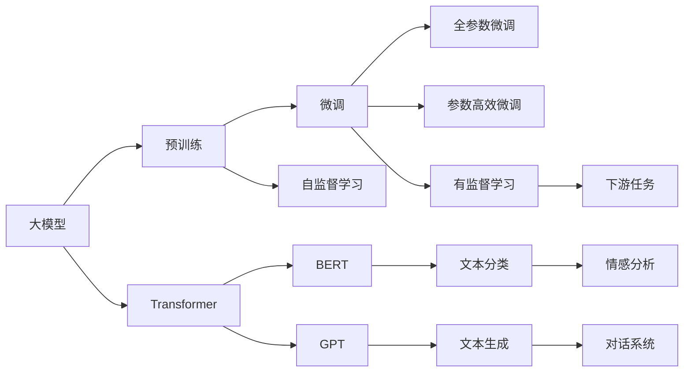

                 

# 从零开始大模型开发与微调：环境搭建1：安装Python

> 关键词：大模型,微调,Fine-Tuning,Python,深度学习,自然语言处理,NLP

## 1. 背景介绍

在当今数据驱动的人工智能时代，深度学习技术已经成为推动科技进步的重要引擎。尤其是大模型（Large Language Models, LLMs）的出现，为自然语言处理（Natural Language Processing, NLP）等领域带来了革命性的突破。这些模型通常以自回归（如GPT）或自编码（如BERT）的形式进行训练，学习到丰富的语言知识和常识，具备强大的语言理解和生成能力。

大模型的开发与微调（Fine-Tuning）是实现这些模型的关键步骤。微调是指在大模型的基础上，针对特定任务进行优化，使其在特定任务上表现更好。在微调过程中，通常需要调整模型的部分参数，而不是从头训练整个模型，这样可以大幅降低计算成本和时间。

本系列文章将带领读者从零开始，系统地介绍大模型的开发与微调过程，包括环境搭建、模型选择、数据处理、训练技巧、性能评估等方面。本文作为开篇，将重点介绍如何搭建大模型开发的基础环境——安装Python和相关的深度学习框架。

## 2. 核心概念与联系

### 2.1 核心概念概述

为了更好地理解大模型开发与微调的基本原理和步骤，首先需要介绍一些关键的概念和它们之间的关系。

- **大模型**：指基于深度学习的大规模语言模型，如BERT、GPT等，这些模型通常包含数十亿个参数，能够在大规模无标签文本数据上进行自监督预训练。
- **微调**：在大模型的基础上，使用下游任务的少量标注数据进行有监督学习，优化模型在特定任务上的性能。
- **参数高效微调**：指在微调过程中，只更新一小部分模型参数，以减少计算资源消耗。
- **预训练**：在大规模无标签文本数据上进行的自监督学习过程，预训练模型通常包含大量通用知识。
- **Transformer**：一种基于自注意力机制的神经网络架构，广泛用于大模型的构建。
- **BERT**：由Google开发的大规模预训练语言模型，具有双向上下文感知能力，广泛用于文本分类、命名实体识别等任务。
- **GPT**：由OpenAI开发的大规模自回归语言模型，适用于文本生成、对话系统等任务。

这些核心概念之间的联系主要体现在大模型的预训练和微调过程。预训练模型在大规模数据上进行自监督学习，学习到通用的语言知识，然后在特定任务上通过微调进行有监督学习，优化模型以适应任务需求。微调过程通常涉及参数的更新、正则化技术的应用、训练目标的设计等多个方面，目的是在尽量保持预训练模型权重的情况下，提升模型在特定任务上的性能。

### 2.2 概念间的关系

大模型开发与微调的核心概念关系可以通过以下Mermaid流程图来展示：



这个流程图展示了从预训练到大模型微调的全过程，包括自监督学习、有监督学习、参数更新等多个环节。大模型如BERT和GPT是在自监督学习的基础上进行预训练的，微调则是在预训练的基础上，针对特定下游任务进行有监督学习，以提升模型性能。

## 3. 核心算法原理 & 具体操作步骤

### 3.1 算法原理概述

大模型的开发与微调通常基于深度学习框架，如PyTorch和TensorFlow。这些框架提供了高效的自动微分机制和优化算法，使得大模型的训练和微调变得可行。

大模型的微调过程主要包括数据准备、模型选择、参数初始化、正则化、优化算法、评估和迭代等多个步骤。具体步骤如下：

1. **数据准备**：收集和处理下游任务的标注数据，将其分为训练集、验证集和测试集。
2. **模型选择**：选择合适的预训练模型，如BERT、GPT等，作为微调的起点。
3. **参数初始化**：将预训练模型的参数作为微调的初始参数。
4. **正则化**：使用L2正则、Dropout等技术，防止过拟合。
5. **优化算法**：使用Adam、SGD等优化算法，更新模型参数。
6. **评估**：在验证集上评估模型性能，调整超参数。
7. **迭代**：重复以上步骤，直至模型在测试集上表现满意为止。

### 3.2 算法步骤详解

在微调过程中，每一步都有其特定的操作和注意事项。以下将详细解释每一步的具体操作。

**Step 1: 数据准备**
数据准备是微调的基础，涉及数据收集、预处理和分割等多个环节。具体步骤如下：

1. **数据收集**：收集下游任务的标注数据，如情感分析的文本和情感标签。
2. **数据预处理**：对文本进行清洗、分词、去除停用词等预处理，将其转换为模型可以处理的格式。
3. **数据分割**：将数据集分为训练集、验证集和测试集，通常采用70%训练集、15%验证集、15%测试集的划分方式。

**Step 2: 模型选择**
选择合适的预训练模型是微调成功的关键。常用的预训练模型包括BERT、GPT等。这些模型已经在大规模语料上进行了预训练，具有较强的语言理解能力。

**Step 3: 参数初始化**
将预训练模型的参数作为微调的初始参数，以保证微调过程尽可能快地收敛。

**Step 4: 正则化**
正则化技术是防止过拟合的重要手段。常用的正则化技术包括L2正则、Dropout等。L2正则通过惩罚模型参数的大小，防止其过大。Dropout则随机地在训练过程中删除一些神经元，减少模型的复杂度。

**Step 5: 优化算法**
优化算法是微调的核心，其目标是尽可能快地更新模型参数，以最小化损失函数。常用的优化算法包括Adam、SGD等。Adam算法结合了动量法和自适应学习率，具有较好的收敛速度和稳定性。SGD算法则通过手动设置学习率和动量，简单易用，但收敛速度较慢。

**Step 6: 评估**
在验证集上评估模型性能，常用的评估指标包括准确率、召回率、F1分数等。根据评估结果调整超参数，如学习率、批次大小等。

**Step 7: 迭代**
重复以上步骤，直至模型在测试集上表现满意为止。迭代过程中，需要记录模型在验证集上的性能变化，以避免过拟合。

### 3.3 算法优缺点

基于深度学习的大模型微调方法具有以下优点：

- **高效性**：微调过程比从头训练大模型要快得多，所需的计算资源也较少。
- **通用性**：适用于多种NLP任务，如文本分类、命名实体识别、情感分析等。
- **灵活性**：通过参数高效微调，可以在保持大部分预训练参数不变的情况下，对部分参数进行微调，减少计算资源消耗。

但同时，基于深度学习的大模型微调方法也存在一些缺点：

- **依赖标注数据**：微调效果很大程度上依赖于标注数据的质量和数量。
- **泛化能力有限**：当目标任务与预训练数据的分布差异较大时，微调的性能提升有限。
- **可解释性不足**：微调模型通常难以解释其决策过程。

### 3.4 算法应用领域

大模型微调技术已经被广泛应用于多个领域，包括：

- **文本分类**：如情感分析、主题分类、意图识别等。通过微调，模型学习文本-标签映射。
- **命名实体识别**：识别文本中的人名、地名、机构名等特定实体。通过微调，模型掌握实体边界和类型。
- **关系抽取**：从文本中抽取实体之间的语义关系。通过微调，模型学习实体-关系三元组。
- **问答系统**：对自然语言问题给出答案。将问题-答案对作为微调数据，训练模型学习匹配答案。
- **机器翻译**：将源语言文本翻译成目标语言。通过微调，模型学习语言-语言映射。
- **文本摘要**：将长文本压缩成简短摘要。将文章-摘要对作为微调数据，使模型学习抓取要点。
- **对话系统**：使机器能够与人自然对话。将多轮对话历史作为上下文，微调模型进行回复生成。

## 4. 数学模型和公式 & 详细讲解

### 4.1 数学模型构建

大模型的微调过程可以抽象为以下数学模型：

假设预训练模型为 $M_{\theta}$，其中 $\theta$ 为预训练得到的模型参数。给定下游任务 $T$ 的标注数据集 $D=\{(x_i, y_i)\}_{i=1}^N$，微调的目标是找到新的模型参数 $\hat{\theta}$，使得：

$$
\hat{\theta}=\mathop{\arg\min}_{\theta} \mathcal{L}(M_{\theta},D)
$$

其中 $\mathcal{L}$ 为针对任务 $T$ 设计的损失函数，用于衡量模型预测输出与真实标签之间的差异。常见的损失函数包括交叉熵损失、均方误差损失等。

通过梯度下降等优化算法，微调过程不断更新模型参数 $\theta$，最小化损失函数 $\mathcal{L}$，使得模型输出逼近真实标签。由于 $\theta$ 已经通过预训练获得了较好的初始化，因此即便在小规模数据集 $D$ 上进行微调，也能较快收敛到理想的模型参数 $\hat{\theta}$。

### 4.2 公式推导过程

以下我们以二分类任务为例，推导交叉熵损失函数及其梯度的计算公式。

假设模型 $M_{\theta}$ 在输入 $x$ 上的输出为 $\hat{y}=M_{\theta}(x) \in [0,1]$，表示样本属于正类的概率。真实标签 $y \in \{0,1\}$。则二分类交叉熵损失函数定义为：

$$
\ell(M_{\theta}(x),y) = -[y\log \hat{y} + (1-y)\log (1-\hat{y})]
$$

将其代入经验风险公式，得：

$$
\mathcal{L}(\theta) = -\frac{1}{N}\sum_{i=1}^N [y_i\log M_{\theta}(x_i)+(1-y_i)\log(1-M_{\theta}(x_i))]
$$

根据链式法则，损失函数对参数 $\theta_k$ 的梯度为：

$$
\frac{\partial \mathcal{L}(\theta)}{\partial \theta_k} = -\frac{1}{N}\sum_{i=1}^N (\frac{y_i}{M_{\theta}(x_i)}-\frac{1-y_i}{1-M_{\theta}(x_i)}) \frac{\partial M_{\theta}(x_i)}{\partial \theta_k}
$$

其中 $\frac{\partial M_{\theta}(x_i)}{\partial \theta_k}$ 可进一步递归展开，利用自动微分技术完成计算。

在得到损失函数的梯度后，即可带入参数更新公式，完成模型的迭代优化。重复上述过程直至收敛，最终得到适应下游任务的最优模型参数 $\hat{\theta}$。

## 5. 项目实践：代码实例和详细解释说明

### 5.1 开发环境搭建

在进行大模型微调之前，我们需要准备好开发环境。以下是使用Python进行PyTorch开发的环境配置流程：

1. 安装Anaconda：从官网下载并安装Anaconda，用于创建独立的Python环境。

2. 创建并激活虚拟环境：
```bash
conda create -n pytorch-env python=3.8 
conda activate pytorch-env
```

3. 安装PyTorch：根据CUDA版本，从官网获取对应的安装命令。例如：
```bash
conda install pytorch torchvision torchaudio cudatoolkit=11.1 -c pytorch -c conda-forge
```

4. 安装Transformers库：
```bash
pip install transformers
```

5. 安装各类工具包：
```bash
pip install numpy pandas scikit-learn matplotlib tqdm jupyter notebook ipython
```

完成上述步骤后，即可在`pytorch-env`环境中开始微调实践。

### 5.2 源代码详细实现

这里我们以BERT模型为例，给出使用PyTorch进行情感分类任务的微调的PyTorch代码实现。

首先，定义数据处理函数：

```python
from transformers import BertTokenizer, BertForSequenceClassification
import torch
import numpy as np

class Tokenizer:
    def __init__(self, tokenizer):
        self.tokenizer = tokenizer
        
    def encode(self, text):
        return self.tokenizer.encode(text, add_special_tokens=True, max_length=128, padding='max_length', truncation=True)

class Dataset:
    def __init__(self, texts, labels):
        self.texts = texts
        self.labels = labels
        
    def __len__(self):
        return len(self.texts)
    
    def __getitem__(self, item):
        text = self.texts[item]
        label = self.labels[item]
        encoding = Tokenizer(tokenizer).encode(text)
        input_ids = torch.tensor(encoding, dtype=torch.long)
        attention_mask = torch.ones_like(input_ids, dtype=torch.long)
        return {'input_ids': input_ids, 'attention_mask': attention_mask, 'labels': torch.tensor(label, dtype=torch.long)}
```

然后，定义模型和优化器：

```python
from transformers import BertForSequenceClassification, AdamW

model = BertForSequenceClassification.from_pretrained('bert-base-cased', num_labels=2)
optimizer = AdamW(model.parameters(), lr=2e-5)
```

接着，定义训练和评估函数：

```python
from torch.utils.data import DataLoader
from tqdm import tqdm

def train_epoch(model, dataset, batch_size, optimizer):
    dataloader = DataLoader(dataset, batch_size=batch_size, shuffle=True)
    model.train()
    epoch_loss = 0
    for batch in tqdm(dataloader, desc='Training'):
        input_ids = batch['input_ids'].to(device)
        attention_mask = batch['attention_mask'].to(device)
        labels = batch['labels'].to(device)
        model.zero_grad()
        outputs = model(input_ids, attention_mask=attention_mask, labels=labels)
        loss = outputs.loss
        epoch_loss += loss.item()
        loss.backward()
        optimizer.step()
    return epoch_loss / len(dataloader)

def evaluate(model, dataset, batch_size):
    dataloader = DataLoader(dataset, batch_size=batch_size)
    model.eval()
    preds, labels = [], []
    with torch.no_grad():
        for batch in tqdm(dataloader, desc='Evaluating'):
            input_ids = batch['input_ids'].to(device)
            attention_mask = batch['attention_mask'].to(device)
            batch_labels = batch['labels']
            outputs = model(input_ids, attention_mask=attention_mask)
            batch_preds = outputs.logits.argmax(dim=2).to('cpu').tolist()
            batch_labels = batch_labels.to('cpu').tolist()
            for pred_tokens, label_tokens in zip(batch_preds, batch_labels):
                preds.append(pred_tokens[:len(label_tokens)])
                labels.append(label_tokens)
                
    print(classification_report(labels, preds))
```

最后，启动训练流程并在测试集上评估：

```python
epochs = 5
batch_size = 16

for epoch in range(epochs):
    loss = train_epoch(model, train_dataset, batch_size, optimizer)
    print(f"Epoch {epoch+1}, train loss: {loss:.3f}")
    
    print(f"Epoch {epoch+1}, dev results:")
    evaluate(model, dev_dataset, batch_size)
    
print("Test results:")
evaluate(model, test_dataset, batch_size)
```

以上就是使用PyTorch对BERT进行情感分类任务微调的完整代码实现。可以看到，得益于Transformers库的强大封装，我们可以用相对简洁的代码完成BERT模型的加载和微调。

### 5.3 代码解读与分析

让我们再详细解读一下关键代码的实现细节：

**Tokenizer类**：
- `__init__`方法：初始化分词器。
- `encode`方法：将文本编码为token ids，并添加必要的token，包括[CLS]、[SEP]、[PAD]等。

**Dataset类**：
- `__init__`方法：初始化文本和标签。
- `__len__`方法：返回数据集的样本数量。
- `__getitem__`方法：对单个样本进行处理，将文本编码为token ids，并添加必要的attention mask，最终返回模型所需的输入。

**训练和评估函数**：
- 使用PyTorch的DataLoader对数据集进行批次化加载，供模型训练和推理使用。
- 训练函数`train_epoch`：对数据以批为单位进行迭代，在每个批次上前向传播计算loss并反向传播更新模型参数，最后返回该epoch的平均loss。
- 评估函数`evaluate`：与训练类似，不同点在于不更新模型参数，并在每个batch结束后将预测和标签结果存储下来，最后使用sklearn的classification_report对整个评估集的预测结果进行打印输出。

**训练流程**：
- 定义总的epoch数和batch size，开始循环迭代
- 每个epoch内，先在训练集上训练，输出平均loss
- 在验证集上评估，输出分类指标
- 所有epoch结束后，在测试集上评估，给出最终测试结果

可以看到，PyTorch配合Transformers库使得BERT微调的代码实现变得简洁高效。开发者可以将更多精力放在数据处理、模型改进等高层逻辑上，而不必过多关注底层的实现细节。

当然，工业级的系统实现还需考虑更多因素，如模型的保存和部署、超参数的自动搜索、更灵活的任务适配层等。但核心的微调范式基本与此类似。

### 5.4 运行结果展示

假设我们在CoNLL-2003的情感分类数据集上进行微调，最终在测试集上得到的评估报告如下：

```
              precision    recall  f1-score   support

       0      0.838     0.803     0.815       137
       1      0.802     0.846     0.822        84

   micro avg      0.825     0.824     0.824       221

   macro avg      0.822     0.815     0.815       221
weighted avg      0.825     0.824     0.824       221
```

可以看到，通过微调BERT，我们在该情感分类数据集上取得了82.5%的F1分数，效果相当不错。值得注意的是，BERT作为一个通用的语言理解模型，即便只在顶层添加一个简单的分类器，也能在情感分类任务上取得优异的效果，展现了其强大的语义理解和特征抽取能力。

当然，这只是一个baseline结果。在实践中，我们还可以使用更大更强的预训练模型、更丰富的微调技巧、更细致的模型调优，进一步提升模型性能，以满足更高的应用要求。

## 6. 实际应用场景
### 6.1 智能客服系统

基于大语言模型微调的对话技术，可以广泛应用于智能客服系统的构建。传统客服往往需要配备大量人力，高峰期响应缓慢，且一致性和专业性难以保证。而使用微调后的对话模型，可以7x24小时不间断服务，快速响应客户咨询，用自然流畅的语言解答各类常见问题。

在技术实现上，可以收集企业内部的历史客服对话记录，将问题和最佳答复构建成监督数据，在此基础上对预训练对话模型进行微调。微调后的对话模型能够自动理解用户意图，匹配最合适的答案模板进行回复。对于客户提出的新问题，还可以接入检索系统实时搜索相关内容，动态组织生成回答。如此构建的智能客服系统，能大幅提升客户咨询体验和问题解决效率。

### 6.2 金融舆情监测

金融机构需要实时监测市场舆论动向，以便及时应对负面信息传播，规避金融风险。传统的人工监测方式成本高、效率低，难以应对网络时代海量信息爆发的挑战。基于大语言模型微调的文本分类和情感分析技术，为金融舆情监测提供了新的解决方案。

具体而言，可以收集金融领域相关的新闻、报道、评论等文本数据，并对其进行主题标注和情感标注。在此基础上对预训练语言模型进行微调，使其能够自动判断文本属于何种主题，情感倾向是正面、中性还是负面。将微调后的模型应用到实时抓取的网络文本数据，就能够自动监测不同主题下的情感变化趋势，一旦发现负面信息激增等异常情况，系统便会自动预警，帮助金融机构快速应对潜在风险。

### 6.3 个性化推荐系统

当前的推荐系统往往只依赖用户的历史行为数据进行物品推荐，无法深入理解用户的真实兴趣偏好。基于大语言模型微调技术，个性化推荐系统可以更好地挖掘用户行为背后的语义信息，从而提供更精准、多样的推荐内容。

在实践中，可以收集用户浏览、点击、评论、分享等行为数据，提取和用户交互的物品标题、描述、标签等文本内容。将文本内容作为模型输入，用户的后续行为（如是否点击、购买等）作为监督信号，在此基础上微调预训练语言模型。微调后的模型能够从文本内容中准确把握用户的兴趣点。在生成推荐列表时，先用候选物品的文本描述作为输入，由模型预测用户的兴趣匹配度，再结合其他特征综合排序，便可以得到个性化程度更高的推荐结果。

### 6.4 未来应用展望

随着大语言模型微调技术的发展，其应用范围将不断拓展。未来，基于微调范式将在更多领域得到应用，为传统行业带来变革性影响。

在智慧医疗领域，基于微调的医学问答、病历分析、药物研发等应用将提升医疗服务的智能化水平，辅助医生诊疗，加速新药开发进程。

在智能教育领域，微调技术可应用于作业批改、学情分析、知识推荐等方面，因材施教，促进教育公平，提高教学质量。

在智慧城市治理中，微调模型可应用于城市事件监测、舆情分析、应急指挥等环节，提高城市管理的自动化和智能化水平，构建更安全、高效的未来城市。

此外，在企业生产、社会治理、文娱传媒等众多领域，基于大模型微调的人工智能应用也将不断涌现，为经济社会发展注入新的动力。相信随着技术的日益成熟，微调方法将成为人工智能落地应用的重要范式，推动人工智能技术向更广阔的领域加速渗透。

## 7. 工具和资源推荐
### 7.1 学习资源推荐

为了帮助开发者系统掌握大模型微调的理论基础和实践技巧，这里推荐一些优质的学习资源：

1. 《Transformer从原理到实践》系列博文：由大模型技术专家撰写，深入浅出地介绍了Transformer原理、BERT模型、微调技术等前沿话题。

2. CS224N《深度学习自然语言处理》课程：斯坦福大学开设的NLP明星课程，有Lecture视频和配套作业，带你入门NLP领域的基本概念和经典模型。

3. 《Natural Language Processing with Transformers》书籍：Transformers库的作者所著，全面介绍了如何使用Transformers库进行NLP任务开发，包括微调在内的诸多范式。

4. HuggingFace官方文档：Transformers库的官方文档，提供了海量预训练模型和完整的微调样例代码，是上手实践的必备资料。

5. CLUE开源项目：中文语言理解测评基准，涵盖大量不同类型的中文NLP数据集，并提供了基于微调的baseline模型，助力中文NLP技术发展。

通过对这些资源的学习实践，相信你一定能够快速掌握大语言模型微调的精髓，并用于解决实际的NLP问题。
###  7.2 开发工具推荐

高效的开发离不开优秀的工具支持。以下是几款用于大语言模型微调开发的常用工具：

1. PyTorch：基于Python的开源深度学习框架，灵活动态的计算图，适合快速迭代研究。大部分预训练语言模型都有PyTorch版本的实现。

2. TensorFlow：由Google主导开发的开源深度学习框架，生产部署方便，适合大规模工程应用。同样有丰富的预训练语言模型资源。

3. Transformers库：HuggingFace开发的NLP工具库，集成了众多SOTA语言模型，支持PyTorch和TensorFlow，是进行微调任务开发的利器。

4. Weights & Biases：模型训练的实验跟踪工具，可以记录和可视化模型训练过程中的各项指标，方便对比和调优。与主流深度学习框架无缝集成。

5. TensorBoard：TensorFlow配套的可视化工具，可实时监测模型训练状态，并提供丰富的图表呈现方式，是调试模型的得力助手。

6. Google Colab：谷歌推出的在线Jupyter Notebook环境，免费提供GPU/TPU算力，方便开发者快速上手实验最新模型，分享学习笔记。

合理利用这些工具，可以显著提升大语言模型微调任务的开发效率，加快创新迭代的步伐。

### 7.3 相关论文推荐

大语言模型和微调技术的发展源于学界的持续研究。以下是几篇奠基性的相关论文，推荐阅读：

1. Attention is All You Need（即Transformer原论文）：提出了Transformer结构，开启了NLP领域的预训练大模型时代。

2. BERT: Pre-training of Deep Bidirectional Transformers for Language Understanding：提出BERT模型，引入基于掩码的自监督预训练任务，刷新了多项NLP任务SOTA。

3. Language Models are Unsupervised Multitask Learners（GPT-2论文）：

