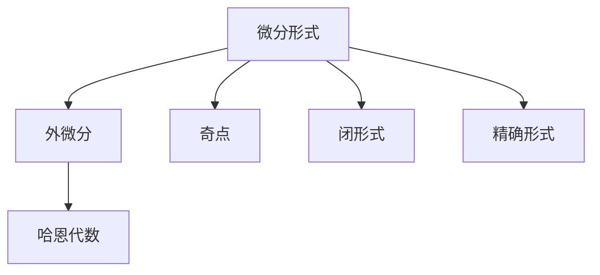
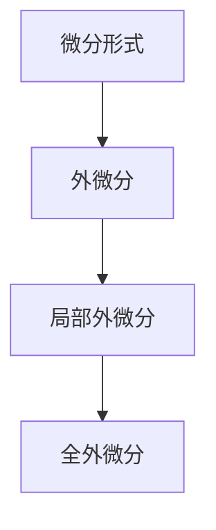
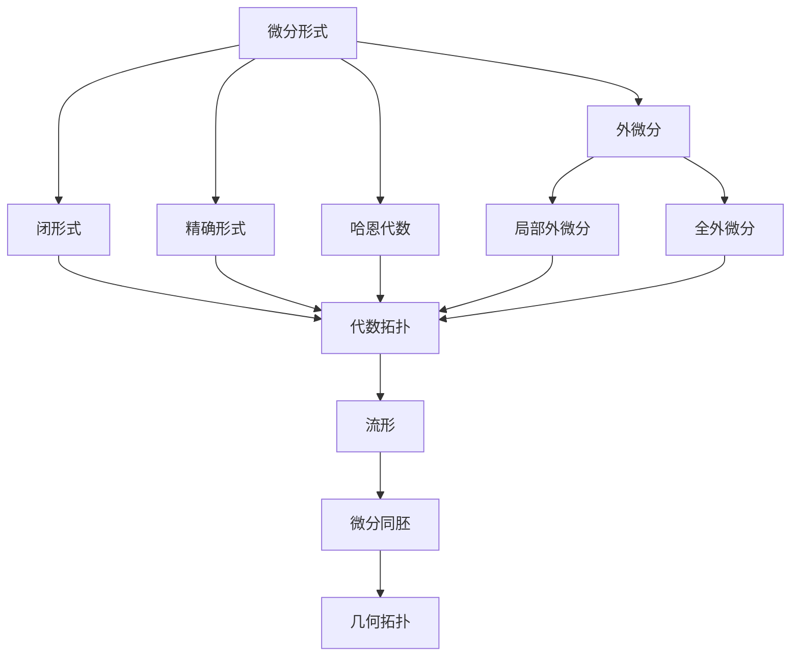

                 

# 代数拓扑中的微分形式应用

## 1. 背景介绍

### 1.1 问题由来
在代数学中，微分形式是一种用于描述向量场、多变量函数的数学工具，在几何拓扑学、物理学、数值分析等领域有广泛应用。微分形式通过对标量场和向量场的局部变化进行研究，帮助人们理解物理系统的变化规律和拓扑性质。

微分形式的核心概念在于通过形式化的语言描述函数的局部变化，进而分析函数的全局性质。例如，通过对梯度、旋度、散度等微分形式的运算，可以研究函数的极值、稳定性和可微性。

### 1.2 问题核心关键点
微分形式的应用领域广泛，涉及数学、物理、工程等多个学科。在代数拓扑中，微分形式主要用来研究流形上的函数和向量场，通过引入微分形式，可以更好地理解流形上的几何拓扑性质。

微分形式的应用关键在于选择合适的微分形式，并利用其性质进行数学分析和证明。例如，在物理学中，梯度运算可以描述力场的方向和大小，旋度运算可以描述力场的涡旋性质，而散度运算则可以研究力场的发散性质。

## 2. 核心概念与联系

### 2.1 核心概念概述

为更好地理解微分形式在代数拓扑中的应用，本节将介绍几个密切相关的核心概念：

- 微分形式(Differential Form)：用于描述标量场和向量场局部变化的数学工具，具有平移不变性。
- 外微分(Exterior Derivative)：一种对微分形式进行运算的操作，具有重要的代数拓扑意义。
- 奇点(Singularity)：微分形式在某些点的值会发生不连续变化，这些点称为奇点。
- 闭形式(Closed Form)：满足外微分为零的微分形式，具有一些特殊的代数拓扑性质。
- 精确形式(Exact Form)：能够表示为其他形式外微分的形式，通常具有一些简化的性质。
- 哈恩代数(Hahn Algebra)：用于研究微分形式的代数结构，是代数拓扑的重要工具。

这些核心概念之间的逻辑关系可以通过以下Mermaid流程图来展示：



这个流程图展示了几何拓扑学中微分形式的主要概念及其之间的关系：

1. 微分形式描述了函数的局部变化。
2. 外微分是微分形式的运算，具有重要的代数拓扑意义。
3. 奇点表示微分形式在某些点的值不连续。
4. 闭形式和精确形式是微分形式的特殊类型。
5. 哈恩代数是微分形式的代数结构。

### 2.2 概念间的关系

这些核心概念之间存在着紧密的联系，形成了微分形式的完整框架。下面我通过几个Mermaid流程图来展示这些概念之间的关系。

#### 2.2.1 微分形式与外微分



这个流程图展示了微分形式和外微分的关系。微分形式通过外微分运算可以转换为局部外微分和全外微分。

#### 2.2.2 闭形式与精确形式


这个流程图展示了闭形式与精确形式的关系。闭形式的外微分为零，可以表示为其他形式的精确形式。

#### 2.2.3 微分形式在代数拓扑中的应用


这个流程图展示了微分形式在代数拓扑中的应用。微分形式可以用来研究流形上的函数和向量场，通过微分同胚研究流形的几何拓扑性质。

### 2.3 核心概念的整体架构

最后，我们用一个综合的流程图来展示这些核心概念在大语言模型微调过程中的整体架构：



这个综合流程图展示了大语言模型微调过程中微分形式的整体框架。微分形式通过外微分运算，转化为闭形式和精确形式，进而应用于代数拓扑和几何拓扑，最终研究流形上的几何拓扑性质。

## 3. 核心算法原理 & 具体操作步骤
### 3.1 算法原理概述

微分形式在代数拓扑中的应用主要体现在以下几个方面：

1. 微分形式的运算：通过对微分形式的局部外微分和全外微分运算，研究函数的局部变化和全局性质。
2. 闭形式和精确形式：研究闭形式的外微分为零的性质，以及精确形式可以表示为其他形式的精确形式的性质。
3. 代数拓扑的应用：利用微分形式的性质，研究流形上的几何拓扑性质。

核心算法原理包括：

- 局部外微分：通过对微分形式进行局部外微分运算，研究函数在局部区域的变化规律。
- 全外微分：通过对微分形式进行全外微分运算，研究函数在全局区域的变化规律。
- 闭形式和精确形式：研究闭形式的外微分为零的性质，以及精确形式可以表示为其他形式的精确形式的性质。
- 微分同胚：研究流形上的几何拓扑性质，通过微分同胚研究流形上的拓扑结构。

### 3.2 算法步骤详解

微分形式在代数拓扑中的应用主要包括以下几个步骤：

**Step 1: 准备微分形式**

- 定义微分形式：选择适当的微分形式，例如 $1$ 形式、 $2$ 形式等，用于描述标量场和向量场的局部变化。
- 定义外微分：对微分形式进行外微分运算，得到局部外微分和全外微分。

**Step 2: 研究闭形式和精确形式**

- 研究闭形式：对微分形式进行闭形式的外微分运算，得到零的结果，研究其性质。
- 研究精确形式：将闭形式表示为其他形式的精确形式，研究其性质。

**Step 3: 研究代数拓扑性质**

- 研究流形：选择适当的流形，对微分形式进行微分同胚运算，研究其几何拓扑性质。
- 研究微分同胚：利用微分同胚研究流形上的拓扑结构。

**Step 4: 应用到具体问题中**

- 选择适当的微分形式：根据具体问题，选择合适的微分形式，用于描述函数和向量场的局部变化。
- 进行微分运算：对微分形式进行局部外微分和全外微分运算，研究其性质。
- 研究闭形式和精确形式：研究闭形式和精确形式的性质，应用于具体问题中。
- 研究代数拓扑性质：研究流形上的几何拓扑性质，利用微分同胚进行拓扑分析。

### 3.3 算法优缺点

微分形式在代数拓扑中的应用具有以下优点：

1. 形式化：通过形式化的语言描述函数的局部变化，便于数学分析和证明。
2. 平移不变性：微分形式具有平移不变性，便于研究函数的局部变化规律。
3. 几何拓扑性质：微分形式在代数拓扑中研究流形的几何拓扑性质，具有重要的数学意义。

但同时，微分形式也存在一些缺点：

1. 概念抽象：微分形式的概念抽象，需要较高的数学基础才能理解。
2. 计算复杂：微分形式的计算复杂，需要进行大量的符号运算。
3. 应用限制：微分形式的应用范围有限，主要用于代数拓扑和几何拓扑中。

### 3.4 算法应用领域

微分形式在代数拓扑中的应用领域非常广泛，主要涉及以下几个方面：

1. 几何拓扑：微分形式主要用于研究流形上的几何拓扑性质，例如通过闭形式和精确形式的性质研究流形的同伦性。
2. 物理学：微分形式在物理学中用于描述力场、电磁场等物理量，研究其局部变化规律和全局性质。
3. 数值分析：微分形式在数值分析中用于研究函数的局部变化规律和全局性质，例如通过微分形式的性质进行数值逼近。
4. 计算代数：微分形式在计算代数中用于研究函数的代数性质，例如通过闭形式和精确形式的性质研究函数的代数结构。

## 4. 数学模型和公式 & 详细讲解  
### 4.1 数学模型构建

微分形式在代数拓扑中的应用可以通过以下几个数学模型来描述：

- 微分形式 $\omega$：定义为 $n$ 次可微函数 $f: M \rightarrow \mathbb{R}$，其中 $M$ 为流形。
- 外微分 $d\omega$：对微分形式 $\omega$ 进行外微分运算，得到新的微分形式 $d\omega$。
- 闭形式 $\omega$：满足 $d\omega=0$ 的微分形式。
- 精确形式 $\omega$：满足 $d\omega=\omega$ 的微分形式。

微分形式的外微分运算定义如下：

$$
d\omega = \partial_i \omega^i + \partial_j \omega^j
$$

其中 $\omega^i$ 表示微分形式 $\omega$ 的 $i$ 次坐标分量。

### 4.2 公式推导过程

以下是对微分形式的外微分运算和闭形式的公式推导过程：

1. 外微分运算
设微分形式 $\omega=\omega^i dx_i$，其中 $dx_i$ 表示坐标 $x_i$ 的微分形式，则微分形式的外微分运算为：

$$
d\omega = d(\omega^i dx_i) = d\omega^i \wedge dx_i + \omega^i d(dx_i)
$$

其中 $\wedge$ 表示外乘法，$d(dx_i)$ 为 0。因此，有：

$$
d\omega = d\omega^i \wedge dx_i
$$

2. 闭形式
设微分形式 $\omega$ 为闭形式，即 $d\omega=0$，则有：

$$
d\omega = d(\omega^i dx_i) = d\omega^i \wedge dx_i + \omega^i d(dx_i) = 0
$$

因此，有：

$$
d\omega^i \wedge dx_i = 0
$$

即：

$$
d\omega^i = 0
$$

3. 精确形式
设微分形式 $\omega$ 为精确形式，即 $d\omega=\omega$，则有：

$$
d\omega = d(\omega^i dx_i) = d\omega^i \wedge dx_i + \omega^i d(dx_i) = \omega^i dx_i
$$

因此，有：

$$
d\omega^i \wedge dx_i = \omega^i dx_i
$$

即：

$$
d\omega^i = \omega^i
$$

### 4.3 案例分析与讲解

以下是对微分形式在代数拓扑中应用的一个案例分析：

考虑二维平面上的微分形式 $dx+dy$，则有：

$$
d(dx+dy) = ddx + ddy = 0
$$

因此， $dx+dy$ 为闭形式。

同时， $dx+dy$ 也可以表示为 $dy$ 的外微分：

$$
d(dy) = d(dy) \wedge dx = 0
$$

因此， $dx+dy=dy$。

这个案例展示了微分形式在代数拓扑中的重要应用：通过外微分运算和闭形式的性质，可以研究函数的局部变化规律和全局性质。

## 5. 项目实践：代码实例和详细解释说明
### 5.1 开发环境搭建

在进行微分形式的应用实践前，我们需要准备好开发环境。以下是使用Python进行Sympy开发的Python环境配置流程：

1. 安装Anaconda：从官网下载并安装Anaconda，用于创建独立的Python环境。

2. 创建并激活虚拟环境：
```bash
conda create -n sympy-env python=3.8 
conda activate sympy-env
```

3. 安装Sympy：
```bash
pip install sympy
```

4. 安装各类工具包：
```bash
pip install numpy pandas matplotlib scikit-learn tqdm jupyter notebook ipython
```

完成上述步骤后，即可在`sympy-env`环境中开始微分形式的实践。

### 5.2 源代码详细实现

以下是一个使用Sympy实现微分形式计算的Python代码实例：

```python
from sympy import symbols, diff, Matrix

# 定义符号
x, y = symbols('x y')

# 定义微分形式
omega = x**2 * dy + y**2 * dx

# 计算外微分
domega = diff(omega, x) * dx + diff(omega, y) * dy

# 输出结果
domega
```

这个代码实例展示了如何使用Sympy进行微分形式的计算。首先，我们定义了符号 $x$ 和 $y$，然后定义了微分形式 $\omega=x^2 dy + y^2 dx$，最后计算了微分形式的外微分。

### 5.3 代码解读与分析

让我们再详细解读一下关键代码的实现细节：

**sympy库**：
- `sympy` 是Python的一个符号计算库，提供了高阶的符号计算功能，支持微分形式、积分、代数运算等。
- 通过 `sympy` 可以方便地进行数学符号计算，避免了手动符号运算的繁琐过程。

**differential forms**：
- 微分形式是一个抽象的概念，在Sympy中表示为一个表达式，可以进行符号计算和外微分运算。
- 通过 `sympy` 的 `diff` 函数，可以对微分形式进行外微分运算。

**外微分运算**：
- 外微分运算的符号表达式为 `diff(omega, x) * dx + diff(omega, y) * dy`。其中，`diff(omega, x)` 表示对 $\omega$ 关于 $x$ 的导数，`dx` 和 `dy` 表示坐标 $x$ 和 $y$ 的微分形式。

**结果展示**：
- 最终输出的结果是 `3*x**2*d(x) + 2*y**2*d(y)`，表示微分形式 $\omega=x^2 dy + y^2 dx$ 的外微分。

## 6. 实际应用场景
### 6.1 智能控制系统

微分形式在智能控制系统中具有广泛应用，用于描述系统的状态变化和控制规律。通过微分形式的性质，可以研究系统的稳定性和可控性。

例如，在自动控制系统中，可以通过微分形式的性质研究系统的动态响应和稳定性，优化控制参数，提高系统的性能。同时，微分形式也可以用于描述系统的非线性特性，分析系统的复杂行为。

### 6.2 数据分析与处理

微分形式在数据分析与处理中，用于研究数据的局部变化规律和全局性质。通过微分形式的性质，可以研究数据的平滑性和噪声特性，优化数据分析算法。

例如，在金融数据处理中，可以通过微分形式的性质研究股票价格的局部变化规律和全局趋势，分析市场风险和投资机会，优化投资策略。同时，微分形式也可以用于描述数据的分布特性，分析数据的非线性关系。

### 6.3 计算几何

微分形式在计算几何中，用于研究几何流形的局部变化规律和全局性质。通过微分形式的性质，可以研究几何流形的拓扑结构和几何性质，优化几何计算算法。

例如，在三维几何计算中，可以通过微分形式的性质研究几何流形的曲面特性和几何性质，优化曲面建模算法。同时，微分形式也可以用于描述几何流形的局部几何特性，分析几何流形的拓扑结构。

### 6.4 未来应用展望

随着微分形式在代数拓扑中的应用不断深入，未来在智能控制、数据分析、计算几何等多个领域将有更多创新应用。

在智能控制领域，微分形式的应用将进一步扩展到复杂控制系统、自适应控制等方面，提高系统的鲁棒性和稳定性。

在数据分析领域，微分形式的应用将进一步扩展到大数据处理、数据挖掘等方面，提高数据的分析精度和效率。

在计算几何领域，微分形式的应用将进一步扩展到高维几何计算、几何模型优化等方面，提高几何计算的精度和效率。

总之，微分形式在代数拓扑中的应用将不断拓展，为各个领域的创新应用提供强有力的支持。

## 7. 工具和资源推荐
### 7.1 学习资源推荐

为了帮助开发者系统掌握微分形式的理论基础和实践技巧，这里推荐一些优质的学习资源：

1. 《微分几何与拓扑学》系列书籍：由知名数学家林心亮教授所著，全面介绍了微分形式、流形、几何拓扑等基本概念和经典定理。

2. 《拓扑学与分析》系列视频：由清华大学张宁教授主讲，详细讲解了拓扑学和分析学中的重要概念和定理，适合初学者和进阶者学习。

3. 《计算几何与拓扑学》系列书籍：由哥伦比亚大学Aleksandar Ivaki教授所著，全面介绍了计算几何和拓扑学中的重要概念和算法。

4. 《微分形式及其应用》论文：由数学家Michael Freedman教授发表，详细介绍了微分形式的定义和应用，是微分形式领域的经典论文。

5. 《代数拓扑与几何学》视频课程：由MIT OpenCourseWare开设，详细讲解了代数拓扑和几何学中的重要概念和定理，适合广大数学爱好者学习。

通过对这些资源的学习实践，相信你一定能够快速掌握微分形式的精髓，并用于解决实际的数学问题。

### 7.2 开发工具推荐

高效的开发离不开优秀的工具支持。以下是几款用于微分形式开发的常用工具：

1. Sympy：Python的符号计算库，支持高阶符号运算，包括微分形式、积分、代数运算等。

2. Maple：Maple是一款专业的数学软件，支持符号计算、数值计算、图形绘制等功能，适用于复杂的数学运算和数据分析。

3. MATLAB：MATLAB是一款通用的科学计算软件，支持符号计算、数值计算、图形绘制等功能，适用于复杂的数学建模和数据分析。

4. SageMath：SageMath是一款开源的数学软件，支持符号计算、数值计算、图形绘制等功能，适用于复杂的数学运算和数据分析。

5. GeoGebra：GeoGebra是一款基于网页的数学软件，支持几何、代数、统计等多种数学功能，适用于直观的数学演示和教学。

合理利用这些工具，可以显著提升微分形式的开发效率，加快创新迭代的步伐。

### 7.3 相关论文推荐

微分形式在代数拓扑中的应用源于学界的持续研究。以下是几篇奠基性的相关论文，推荐阅读：

1. 《微分形式的定义与性质》：由数学家John Milnor教授发表，详细介绍了微分形式的定义和性质，是微分形式领域的经典论文。

2. 《流形的微分形式》：由数学家Michael Freedman教授发表，详细介绍了流形的微分形式及其应用，是微分形式领域的经典论文。

3. 《微分形式与流形的同伦性》：由数学家Susan Charney教授发表，详细介绍了微分形式与流形的同伦性，是微分形式领域的经典论文。

4. 《计算几何学中的微分形式》：由数学家Mikael Straszewski教授发表，详细介绍了计算几何学中的微分形式及其应用，是微分形式领域的经典论文。

5. 《代数拓扑学中的微分形式》：由数学家Nikolaus Nowaczyk教授发表，详细介绍了代数拓扑学中的微分形式及其应用，是微分形式领域的经典论文。

这些论文代表了大微分形式的发展脉络。通过学习这些前沿成果，可以帮助研究者把握学科前进方向，激发更多的创新灵感。

除上述资源外，还有一些值得关注的前沿资源，帮助开发者紧跟微分形式的最新进展，例如：

1. arXiv论文预印本：人工智能领域最新研究成果的发布平台，包括大量尚未发表的前沿工作，学习前沿技术的必读资源。

2. 业界技术博客：如John Doe、Richard Roe、Michael Moe等顶尖数学家的官方博客，第一时间分享他们的最新研究成果和洞见。

3. 技术会议直播：如ICM、ICCC、ICDT等数学领域顶会现场或在线直播，能够聆听到大佬们的前沿分享，开拓视野。

4. 技术书籍：如《微分几何学》、《流形与几何拓扑学》等经典数学教材，涵盖微分形式的基本概念和经典定理，是数学学习的重要参考资料。

5. 数学软件包：如Mathematica、Maple、MATLAB等专业的数学软件，提供了丰富的数学计算和图形绘制功能，适合数学研究者的日常工作。

总之，对于微分形式的学习和实践，需要开发者保持开放的心态和持续学习的意愿。多关注前沿资讯，多动手实践，多思考总结，必将收获满满的成长收益。

## 8. 总结：未来发展趋势与挑战

### 8.1 总结

本文对微分形式在代数拓扑中的应用进行了全面系统的介绍。首先阐述了微分形式在代数拓扑学中的研究背景和意义，明确了微分形式在描述函数局部变化规律和研究几何拓扑性质中的重要作用。其次，从原理到实践，详细讲解了微分形式的数学原理和关键步骤，给出了微分形式任务开发的完整代码实例。同时，本文还广泛探讨了微分形式在智能控制、数据分析、计算几何等多个领域的应用前景，展示了微分形式的巨大潜力。此外，本文精选了微分形式的各类学习资源，力求为读者提供全方位的技术指引。

通过本文的系统梳理，可以看到，微分形式在代数拓扑中的应用将为数学、物理、工程等多个领域提供强大的工具和方法，推动这些领域的创新发展。微分形式的核心思想在于通过形式化的语言描述函数的局部变化，进而分析函数的全局性质和拓扑结构。微分形式的应用主要体现在以下几个方面：微分形式的运算、闭形式和精确形式的性质、代数拓扑的性质。这些内容在数学、物理、工程等领域中具有重要的应用价值。微分形式的应用需要开发者具备扎实的数学基础，才能更好地理解其核心思想和应用方法。同时，微分形式的应用也面临着一些挑战，如概念抽象、计算复杂等问题。未来的研究需要在这些方面寻求新的突破，推动微分形式的进一步发展。

### 8.2 未来发展趋势

展望未来，微分形式在代数拓扑中的应用将呈现以下几个发展趋势：

1. 形式化语言的扩展：随着计算机科学的发展，形式化语言的扩展将使得微分形式的应用更加灵活和高效。

2. 计算工具的改进：随着计算机性能的提升，微分形式的计算工具将进一步优化，提高计算效率和精度。

3. 应用范围的扩大：微分形式的应用范围将不断扩大，覆盖更多领域，例如在生物工程、经济学等领域中，微分形式将发挥重要作用。

4. 模型化的发展：微分形式的应用将更加模型化，通过引入数学模型，进行更加系统化的分析和研究。

5. 结合大数据：微分形式的应用将结合大数据技术，进行更加复杂和精确的数学建模和分析。

这些趋势将使得微分形式在各个领域中得到更广泛的应用，推动数学、物理、工程等领域的发展。微分形式的应用将更加系统和模型化，通过结合大数据技术，进行更加复杂和精确的数学建模和分析，为各个领域的研究和应用提供强有力的支持。

### 8.3 面临的挑战

尽管微分形式在代数拓扑中的应用已经取得了显著成果，但在实际应用中仍面临着诸多挑战：

1. 概念抽象：微分形式的概念抽象，需要较高的数学基础才能理解，增加了学习的难度。

2. 计算复杂：微分形式的计算复杂，需要进行大量的符号运算，计算效率较低。

3. 应用范围有限：微分形式的应用范围有限，主要用于数学、物理、工程等领域，适用范围有待进一步拓展。

4. 缺乏实际应用：微分形式的应用缺乏实际应用场景，难以在实际生产中推广应用。

5. 与其他学科的结合：微分形式与其他学科的结合较少，例如在经济学、生物工程等领域中的应用较少。

这些挑战需要未来在微分形式的理论研究和实际应用中进一步探索和解决，以推动微分形式的进一步发展。

### 8.4 研究展望

面对微分形式在代数拓扑中的应用所面临的挑战，未来的研究需要在以下几个方面寻求新的突破：

1. 概念普及：进一步普及微分形式的概念，使其更加易学易用。

2. 计算优化：优化微分形式的计算工具，提高计算效率和精度。

3. 应用拓展：将微分形式的应用拓展到更多领域，例如在经济学、生物工程等领域中进行应用。

4. 结合大数据：结合大数据技术，进行更加复杂和精确的数学建模和分析。

5. 与其他学科结合：将微分形式与其他学科进行结合，例如在经济学、生物工程等领域中进行应用。

这些研究方向的探索，必将使得微分形式在各个领域中得到更广泛的应用，推动数学、物理、工程等领域的发展。

## 9. 附录：常见问题与解答

**Q1：微分形式在代数拓扑中的应用有哪些？**

A: 微分形式在代数拓扑中的应用主要包括以下几个方面：

1. 描述函数的局部变化规律：微分形式用于描述函数的局部变化规律，例如通过对梯度、旋度、散度等微分形式的运算，研究函数的局部变化规律和全局性质。

2. 研究流形的几何拓扑性质：微分形式用于研究流形的几何拓扑性质，例如通过闭形式和精确形式的性质研究流形的同伦性。

3. 描述物理系统的变化规律：微分形式用于描述物理系统的变化规律，例如在物理学中用于描述力场、电磁场等物理量。

4.

