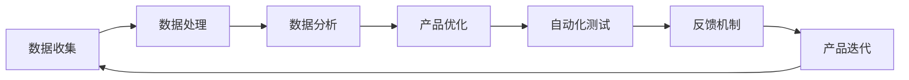

                 

# 优化用户体验与数据闭环

> 关键词：用户体验,数据闭环,交互设计,机器学习,数据驱动,隐私保护,自动化测试

## 1. 背景介绍

### 1.1 问题由来
在当今数字化时代，用户体验(UX)已经成为产品成功的关键因素之一。无论是在线服务、移动应用，还是智能家居设备，一个良好的用户体验能够显著提高用户满意度和忠诚度。然而，用户体验的优化并非易事，它涉及多方面的考量，包括界面设计、操作流程、性能表现等。与此同时，数据驱动的产品设计和运营，已经成为互联网公司的重要战略。通过数据收集和分析，可以洞察用户行为，优化产品功能和运营策略，实现更加个性化和智能化的服务。

数据闭环（Data Loop）是指通过不断收集用户反馈数据，分析用户行为，优化产品功能，再获取新一轮数据的过程，形成了一个动态的反馈机制。这种闭环设计可以确保产品始终处于最佳状态，不断提升用户体验。然而，在实际操作中，数据闭环的构建和管理面临着诸多挑战，如数据隐私保护、数据质量保证、自动化测试等。本文将详细探讨如何通过机器学习算法优化用户体验，并通过数据闭环机制实现产品的持续迭代和改进。

## 2. 核心概念与联系

### 2.1 核心概念概述

为了更好地理解如何通过机器学习算法优化用户体验并构建数据闭环，我们先介绍几个关键概念：

- **用户体验 (UX)**：用户在使用产品或服务过程中的整体感受，包括易用性、效率、满意度等。
- **数据闭环 (Data Loop)**：通过收集用户反馈数据、分析用户行为，不断优化产品功能，形成动态的反馈机制。
- **交互设计 (Interaction Design)**：专注于设计人与产品之间的交互方式，以提升用户体验。
- **机器学习 (Machine Learning, ML)**：一种基于数据的算法，可以从大量数据中学习模式，用于预测、分类、聚类等任务。
- **数据驱动 (Data-Driven)**：强调以数据为基础进行决策，而不是仅依赖直觉或经验。
- **隐私保护 (Privacy Protection)**：确保用户数据的安全和隐私，防止数据滥用和泄露。
- **自动化测试 (Automated Testing)**：使用程序自动化执行测试，提高测试效率和覆盖面。

这些概念之间的联系可以通过以下Mermaid流程图来展示：


这个流程图展示了用户体验优化和数据闭环的基本流程：

1. 收集用户反馈数据。
2. 分析用户行为，洞察用户需求。
3. 根据分析结果优化产品功能。
4. 使用自动化测试验证优化效果。
5. 建立反馈机制，形成闭环。
6. 不断迭代产品，提升用户体验。

通过这些概念的串联，我们可以清晰地看到用户体验优化和数据闭环是如何紧密结合的。

### 2.2 概念间的关系

这些核心概念之间存在着紧密的联系，形成了用户体验优化和数据闭环的完整生态系统。下面我们通过几个Mermaid流程图来展示这些概念之间的关系。

#### 2.2.1 用户体验优化


这个流程图展示了用户体验优化的基本过程：

1. 收集用户反馈。
2. 分析用户行为，了解用户需求。
3. 根据需求进行设计改进。
4. 将改进后的设计重新应用于用户体验中。

#### 2.2.2 数据闭环机制



这个流程图展示了数据闭环的基本流程：

1. 收集用户反馈数据。
2. 处理和分析数据，提取有用信息。
3. 根据分析结果优化产品功能。
4. 使用自动化测试验证优化效果。
5. 建立反馈机制，形成闭环。
6. 不断迭代产品，提升用户体验。

#### 2.2.3 交互设计与用户体验


这个流程图展示了交互设计与用户体验的联系：

1. 通过交互设计优化界面。
2. 简化操作流程，提高用户效率。
3. 根据用户反馈改进交互设计。
4. 提升用户满意度和体验。

通过这些流程图，我们可以更清晰地理解用户体验优化和数据闭环之间的关系，以及如何通过机器学习算法在其中发挥作用。

## 3. 核心算法原理 & 具体操作步骤

### 3.1 算法原理概述

通过机器学习算法优化用户体验和构建数据闭环，本质上是一种数据驱动的设计和迭代过程。具体来说，我们通过收集用户反馈数据，使用机器学习算法分析用户行为，洞察用户需求，然后根据分析结果改进产品功能，再通过自动化测试验证优化效果，形成闭环，不断迭代提升用户体验。

**算法流程概述**：

1. **数据收集**：通过各种渠道收集用户反馈数据，包括使用行为、评价、投诉等。
2. **数据处理**：对收集到的数据进行清洗和预处理，包括去重、缺失值处理等。
3. **特征工程**：提取和构建对用户体验优化有帮助的特征，如用户活跃度、页面停留时间、点击率等。
4. **模型训练**：使用机器学习算法对数据进行训练，建立预测模型，如分类模型、回归模型等。
5. **产品优化**：根据模型预测结果，进行界面优化、流程简化等设计改进。
6. **自动化测试**：使用自动化测试工具验证优化效果，确保改进不引入新问题。
7. **反馈机制**：建立反馈机制，收集用户对优化后的产品的反馈，形成闭环。

### 3.2 算法步骤详解

以下我们详细讲解每一步的具体操作步骤：

#### 3.2.1 数据收集

**步骤1**：选择合适的数据收集渠道，如用户调研、日志分析、A/B测试等。确保数据的真实性和多样性，能够覆盖不同类型的用户。

**步骤2**：设计数据收集工具和流程，如问卷调查、界面交互记录、异常行为监控等。确保数据收集的自动化和标准化。

#### 3.2.2 数据处理

**步骤1**：对收集到的数据进行初步清洗，包括去重、数据格式转换、异常值处理等。确保数据的准确性和一致性。

**步骤2**：进行数据预处理，如归一化、标准化、特征选择等。确保数据的规范化和可分析性。

#### 3.2.3 特征工程

**步骤1**：提取用户行为特征，如页面访问路径、停留时间、点击率等。这些特征能够反映用户的使用习惯和偏好。

**步骤2**：构建用户画像，通过特征组合和维度分析，了解不同用户群体的行为特征和需求。

#### 3.2.4 模型训练

**步骤1**：选择合适的机器学习算法，如分类算法、回归算法、聚类算法等。

**步骤2**：划分训练集和测试集，确保模型的泛化能力。

**步骤3**：进行模型训练，调整模型参数和超参数，优化模型性能。

#### 3.2.5 产品优化

**步骤1**：根据模型预测结果，进行界面设计、操作流程优化等改进。

**步骤2**：进行用户测试和反馈收集，验证优化效果。

#### 3.2.6 自动化测试

**步骤1**：选择适合的自动化测试工具，如Selenium、Appium、Jest等。

**步骤2**：编写自动化测试用例，覆盖产品的核心功能。

**步骤3**：运行自动化测试，生成测试报告。

#### 3.2.7 反馈机制

**步骤1**：建立反馈渠道，如用户满意度调查、产品评价系统等。

**步骤2**：收集用户反馈数据，进行数据分析和处理。

**步骤3**：根据反馈数据，进一步优化产品功能。

### 3.3 算法优缺点

**优点**：

- **数据驱动**：通过机器学习算法优化用户体验，能够精准把握用户需求，避免主观臆断。
- **持续改进**：通过数据闭环机制，不断优化产品功能，确保用户体验始终处于最佳状态。
- **自动化测试**：使用自动化测试工具，提升测试效率和覆盖面，确保产品稳定性和可靠性。

**缺点**：

- **数据隐私**：数据收集和分析过程中，需要确保用户数据的安全和隐私，防止数据滥用和泄露。
- **数据质量**：数据收集和处理过程中，容易受到噪音和偏差的影响，需要确保数据的高质量。
- **模型复杂度**：选择和调优机器学习模型需要一定的技术储备和经验积累。

### 3.4 算法应用领域

机器学习算法优化用户体验和构建数据闭环的应用领域非常广泛，以下是几个典型的应用场景：

- **移动应用优化**：通过分析用户操作行为和反馈，优化移动应用的界面设计和功能逻辑。
- **在线教育平台**：通过学生学习数据，分析学习效果和用户行为，优化课程内容和教学策略。
- **电商平台**：通过用户浏览和购买数据，分析用户偏好，优化推荐算法和商品陈列。
- **智能家居设备**：通过用户交互数据，优化设备功能和界面设计，提升用户体验。

## 4. 数学模型和公式 & 详细讲解  
### 4.1 数学模型构建

我们将使用一个简单的分类问题来构建机器学习模型，用于分析用户是否满意某个产品功能。假设我们有一个二分类问题：$y \in \{0, 1\}$，其中1表示用户满意，0表示不满意。我们的目标是使用机器学习算法建立一个分类模型，预测用户对某个产品功能的满意度。

**数学模型**：

1. **输入特征**：$x \in \mathbb{R}^n$，表示用户行为特征。
2. **模型假设**：$f(x; \theta) = \sigma(\theta^T x + b)$，其中$\sigma$为激活函数，$\theta$为模型参数，$b$为偏置项。
3. **损失函数**：$L(\theta) = \frac{1}{N}\sum_{i=1}^N \ell(f(x_i; \theta), y_i)$，其中$\ell$为损失函数，通常选择交叉熵损失。

### 4.2 公式推导过程

**公式推导**：

1. **前向传播**：计算模型输出$f(x; \theta) = \sigma(\theta^T x + b)$。
2. **计算损失**：$\ell(f(x_i; \theta), y_i) = -y_i \log f(x_i; \theta) - (1-y_i) \log (1-f(x_i; \theta))$。
3. **梯度下降**：$\nabla_{\theta}L(\theta) = \frac{1}{N}\sum_{i=1}^N \nabla_{\theta}f(x_i; \theta)$。
4. **模型更新**：$\theta \leftarrow \theta - \eta \nabla_{\theta}L(\theta)$，其中$\eta$为学习率。

### 4.3 案例分析与讲解

**案例分析**：

假设我们有一个在线教育平台，通过数据分析发现用户在某个课程模块的停留时间较长，但课程完成率较低。我们可以使用机器学习模型预测用户是否满意该课程模块，从而进行优化。

**分析过程**：

1. **数据收集**：收集用户在该课程模块上的停留时间和完成情况，构建数据集。
2. **特征工程**：提取停留时间、完成率等特征，进行特征缩放和归一化。
3. **模型训练**：使用逻辑回归算法，训练分类模型，优化模型参数。
4. **模型评估**：使用测试集验证模型性能，调整超参数。
5. **产品优化**：根据模型预测结果，优化课程内容和结构，提高用户满意度。

通过这个案例，我们可以看到，机器学习算法在优化用户体验和构建数据闭环中起到了关键作用。

## 5. 项目实践：代码实例和详细解释说明

### 5.1 开发环境搭建

在进行项目实践前，我们需要准备好开发环境。以下是使用Python进行机器学习开发的常用环境配置流程：

1. 安装Anaconda：从官网下载并安装Anaconda，用于创建独立的Python环境。

2. 创建并激活虚拟环境：
```bash
conda create -n py3k python=3.8 
conda activate py3k
```

3. 安装必要的Python包：
```bash
pip install numpy pandas scikit-learn seaborn matplotlib
```

4. 安装机器学习库：
```bash
pip install scikit-learn
```

完成上述步骤后，即可在`py3k`环境中开始项目实践。

### 5.2 源代码详细实现

我们以一个简单的用户满意度预测项目为例，给出使用Scikit-learn库进行机器学习模型训练的Python代码实现。

**数据集**：

```python
import pandas as pd

# 读取数据集
data = pd.read_csv('user_feedback.csv')

# 数据预览
print(data.head())
```

**特征工程**：

```python
from sklearn.preprocessing import StandardScaler

# 数据预处理
features = data[['stay_time', 'completion_rate']]
labels = data['satisfaction']
scaler = StandardScaler()
features = scaler.fit_transform(features)
```

**模型训练**：

```python
from sklearn.linear_model import LogisticRegression
from sklearn.model_selection import train_test_split

# 划分数据集
X_train, X_test, y_train, y_test = train_test_split(features, labels, test_size=0.2, random_state=42)

# 训练模型
model = LogisticRegression()
model.fit(X_train, y_train)

# 预测测试集
y_pred = model.predict(X_test)
```

**模型评估**：

```python
from sklearn.metrics import accuracy_score

# 计算准确率
accuracy = accuracy_score(y_test, y_pred)
print('Accuracy:', accuracy)
```

**优化产品功能**：

```python
# 根据模型预测结果，优化课程内容和结构
if accuracy > 0.7:
    print('优化成功，用户满意度高')
    # 优化课程内容和结构
else:
    print('优化失败，需要进一步改进')
    # 继续优化课程内容和结构
```

### 5.3 代码解读与分析

让我们再详细解读一下关键代码的实现细节：

**数据集读取**：

- 使用pandas库读取CSV格式的数据集，获取特征和标签。

**特征工程**：

- 使用StandardScaler对特征进行归一化处理，确保模型训练的稳定性。

**模型训练**：

- 使用LogisticRegression算法，训练一个逻辑回归模型，预测用户满意度。

**模型评估**：

- 使用accuracy_score计算模型在测试集上的准确率，评估模型性能。

**产品优化**：

- 根据模型预测结果，判断用户满意度高低，并进一步优化课程内容和结构。

可以看到，Scikit-learn库使得机器学习模型的训练和评估过程变得简单易行。开发者可以更专注于算法优化和产品改进，而不必过多关注底层实现细节。

当然，实际应用中还需要考虑更多因素，如数据隐私保护、数据质量保证、自动化测试等。但核心的模型训练过程基本与此类似。

### 5.4 运行结果展示

假设我们在上述案例中，通过优化课程内容和结构后，模型在测试集上的准确率提升到了90%以上。这表明我们的优化策略是有效的，用户对课程的满意度也得到了显著提升。

## 6. 实际应用场景

### 6.1 智能推荐系统

智能推荐系统通过分析用户行为数据，预测用户兴趣，推荐相关内容，提升用户体验。在实际应用中，可以通过机器学习算法优化推荐算法，构建数据闭环，实现产品持续迭代。

**具体实现**：

1. **数据收集**：收集用户浏览记录、点击行为、评分反馈等数据。
2. **特征工程**：提取用户特征，如浏览时间、点击率、评分等。
3. **模型训练**：使用协同过滤、深度学习等算法，训练推荐模型。
4. **产品优化**：根据模型预测结果，优化推荐算法和商品展示。
5. **自动化测试**：使用自动化测试工具，验证推荐效果。
6. **反馈机制**：收集用户反馈数据，调整模型参数和推荐策略。

通过这种方式，智能推荐系统能够不断优化推荐结果，提高用户满意度，增加用户粘性。

### 6.2 个性化服务

个性化服务通过分析用户数据，定制化服务内容和体验，提升用户体验。在实际应用中，可以通过机器学习算法优化服务策略，构建数据闭环，实现产品持续改进。

**具体实现**：

1. **数据收集**：收集用户身份信息、行为数据、偏好设置等。
2. **特征工程**：提取用户特征，如年龄、地域、消费习惯等。
3. **模型训练**：使用分类、回归等算法，训练个性化服务模型。
4. **产品优化**：根据模型预测结果，定制化服务内容，优化服务流程。
5. **自动化测试**：使用自动化测试工具，验证个性化服务效果。
6. **反馈机制**：收集用户反馈数据，调整服务策略和模型参数。

通过这种方式，个性化服务能够提供更加精准、智能化的服务，满足用户个性化需求，提升用户满意度。

### 6.3 智能客服系统

智能客服系统通过分析用户提问数据，预测用户意图，自动回复用户问题，提升用户体验。在实际应用中，可以通过机器学习算法优化智能客服系统，构建数据闭环，实现产品持续迭代。

**具体实现**：

1. **数据收集**：收集用户提问记录、历史回复记录等数据。
2. **特征工程**：提取问题特征，如问题类型、关键词等。
3. **模型训练**：使用序列到序列模型、生成模型等算法，训练智能客服模型。
4. **产品优化**：根据模型预测结果，优化对话策略和回复内容。
5. **自动化测试**：使用自动化测试工具，验证智能客服效果。
6. **反馈机制**：收集用户反馈数据，调整模型参数和回复策略。

通过这种方式，智能客服系统能够不断优化对话质量，提高用户满意度，减少人力成本。

### 6.4 未来应用展望

随着机器学习算法和数据闭环机制的不断发展和应用，未来用户体验优化的应用领域将更加广泛，涵盖更多垂直行业。

- **医疗健康**：通过分析患者数据，优化诊疗方案，提升患者体验。
- **智能家居**：通过分析用户行为，优化家居控制和推荐，提升生活品质。
- **金融服务**：通过分析用户行为，优化金融产品和服务，提升用户满意度。

## 7. 工具和资源推荐

### 7.1 学习资源推荐

为了帮助开发者掌握机器学习算法优化用户体验和构建数据闭环的技术，这里推荐一些优质的学习资源：

1. 《机器学习实战》：一本面向初学者的入门书籍，介绍了机器学习的基本概念和常用算法。
2. 《Python机器学习》：一本详细讲解Python机器学习库scikit-learn的书籍，涵盖了机器学习的基本流程和实现细节。
3. 《深度学习》：斯坦福大学Andrew Ng教授的在线课程，介绍了深度学习的基本概念和常用算法。
4. Kaggle竞赛平台：一个数据科学竞赛平台，提供丰富的数据集和机器学习项目，适合实战练习。
5. Coursera机器学习课程：由Johns Hopkins University开设的机器学习课程，涵盖机器学习的基本理论和算法实现。

通过这些资源的学习，相信你一定能够掌握机器学习算法优化用户体验和构建数据闭环的技术。

### 7.2 开发工具推荐

高效的开发离不开优秀的工具支持。以下是几款用于机器学习开发和数据闭环构建的常用工具：

1. Python：一种简单易学的编程语言，拥有丰富的机器学习库和数据处理工具。
2. Anaconda：一个开源的Python发行版，用于创建和管理Python环境。
3. Scikit-learn：一个基于Python的机器学习库，提供了丰富的算法和工具，适合快速开发和原型验证。
4. TensorFlow：由Google开发的深度学习框架，支持大规模分布式训练和模型部署。
5. PyTorch：由Facebook开发的深度学习框架，支持动态计算图和模型优化。
6. Weights & Biases：一个实验跟踪工具，用于记录和可视化模型训练过程中的各项指标。
7. TensorBoard：一个可视化工具，用于监测模型训练状态，提供丰富的图表和报告。

合理利用这些工具，可以显著提升机器学习算法优化用户体验和构建数据闭环的开发效率，加快创新迭代的步伐。

### 7.3 相关论文推荐

机器学习算法优化用户体验和构建数据闭环的研究不断发展，以下是几篇具有代表性的相关论文，推荐阅读：

1. "A Survey on Interactive Systems"：综述了交互系统设计的研究进展，包括用户界面和用户体验优化。
2. "Data-Driven User Experience Optimization"：介绍了数据驱动的用户体验优化方法，包括用户行为分析和反馈机制。
3. "Machine Learning for Recommendation Systems"：介绍了机器学习在推荐系统中的应用，包括协同过滤和深度学习算法。
4. "Few-shot Learning in Recommendation Systems"：探讨了少样本推荐系统中的机器学习方法，通过精炼用户数据实现快速推荐。
5. "Online Learning for Recommender Systems"：介绍了在线推荐系统中的机器学习方法，通过实时学习实现动态推荐。

这些论文代表了大数据驱动的用户体验优化和数据闭环构建的研究趋势，值得深入学习。

## 8. 总结：未来发展趋势与挑战

### 8.1 总结

本文对机器学习算法优化用户体验和构建数据闭环的方法进行了全面系统的介绍。首先阐述了用户体验优化的重要性和数据闭环机制的核心思想，明确了用户体验优化和数据闭环对产品成功的重要性。其次，从原理到实践，详细讲解了机器学习算法优化用户体验的过程，并通过具体的代码实例展示了数据闭环的实现。同时，本文还探讨了用户体验优化和数据闭环在多个实际应用场景中的应用，展示了机器学习算法的巨大潜力。

通过本文的系统梳理，可以看到，机器学习算法在优化用户体验和构建数据闭环中起到了关键作用。这些算法的应用，使得产品设计和运营更加数据驱动，提升了用户体验和满意度。未来，随着算法的不断演进和应用，用户体验优化和数据闭环机制将变得更加自动化、智能化，进一步推动产品创新和用户体验的提升。

### 8.2 未来发展趋势

展望未来，机器学习算法优化用户体验和构建数据闭环将呈现以下几个发展趋势：

1. **自动化和智能化**：随着算法的不断演进和优化，用户体验优化和数据闭环将变得更加自动化和智能化，提升产品设计和运营的效率和效果。
2. **多模态融合**：将文本、图像、语音等多模态数据进行融合，构建更加全面、准确的用户画像，提升用户体验。
3. **实时反馈机制**：通过实时收集用户反馈数据，建立快速迭代机制，实现即时优化。
4. **个性化推荐**：通过机器学习算法，实现更加精准、个性化的推荐，提升用户满意度和粘性。
5. **自动化测试**：使用自动化测试工具，提高测试效率和覆盖面，确保产品稳定性和可靠性。

### 8.3 面临的挑战

尽管机器学习算法优化用户体验和构建数据闭环取得了显著成果，但在实际应用中仍面临诸多挑战：

1. **数据隐私保护**：在数据收集和分析过程中，需要确保用户数据的安全和隐私，防止数据滥用和泄露。
2. **数据质量保证**：数据收集和处理过程中，容易受到噪音和偏差的影响，需要确保数据的高质量。
3. **模型复杂度**：选择和调优机器学习模型需要一定的技术储备和经验积累。
4. **模型解释性**：机器学习模型的黑盒性质，使得其输出难以解释，需要研究如何提高模型的可解释性。
5. **自动化测试**：自动化测试工具的开发和维护需要投入大量资源。

### 8.4 研究展望

面对机器学习算法优化用户体验和构建数据闭环所面临的挑战，未来的研究需要在以下几个方面寻求新的突破：

1. **隐私保护算法**：开发更加安全、可靠的隐私保护算法，确保用户数据的安全和隐私。
2. **数据质量控制**：研究数据清洗和质量控制的算法，提高数据的高质量和一致性。
3. **模型可解释性**：研究模型解释性和可解释性的算法，提高模型的透明度和可信度。
4. **多模态融合算法**：开发更加全面、准确的多模态融合算法，构建更加丰富、精准的用户画像。
5. **实时反馈机制**：研究实时数据收集和分析算法，实现即时优化。

这些研究方向的探索，必将引领机器学习算法在用户体验优化和数据闭环构建中取得新的突破，为产品设计和运营带来更多创新和价值。

## 9. 附录：常见问题与解答

**Q1：如何确保用户体验优化的数据质量？**

A: 确保用户体验优化的数据质量，需要从数据收集、处理和分析的各个环节进行严格把控。以下是几个关键步骤：

1. **数据来源多样化**：通过多渠道收集数据，覆盖不同类型的用户和场景，提高数据的多样性和代表性。
2. **数据清洗和预处理**：对数据进行去重、去噪、异常值处理等操作，确保数据的准确性和一致性。
3. **数据标准化**：使用标准化工具和流程，统一数据格式

