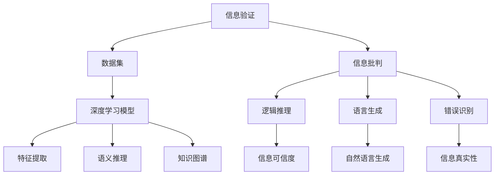
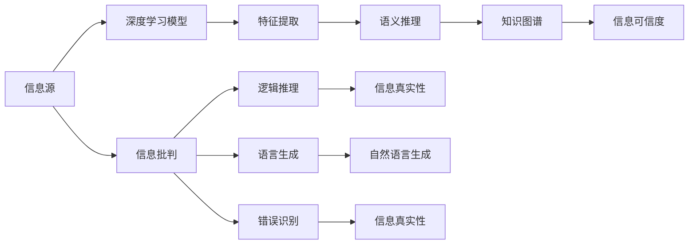
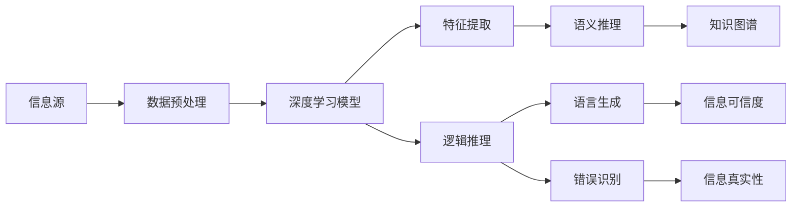
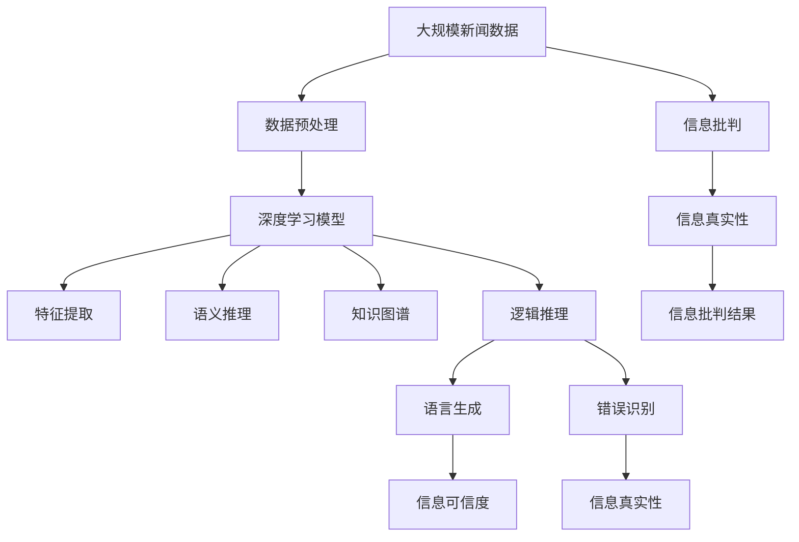

                 

# 信息验证和信息批判：在错误信息和假新闻时代导航

> 关键词：信息验证, 信息批判, 假新闻, 错误信息, 人工智能, 深度学习, 自然语言处理, 自然语言生成, 知识图谱

## 1. 背景介绍

### 1.1 问题由来
随着互联网和社交媒体的普及，信息传播速度不断加快，人们获取信息的渠道日益多样化和碎片化。同时，由于信息源的复杂性和多样性，错误信息和假新闻泛滥，严重影响了公共议题讨论和个体决策。在2016年美国总统选举、2018年澳大利亚国庆日恐怖袭击等事件中，假新闻和错误信息的危害已经引起了全世界的高度关注。

面对信息过载和虚假信息的泛滥，如何高效、准确地识别和验证信息，保障社会的公共利益和个体的信息安全，成为亟待解决的问题。近年来，以深度学习和大数据为代表的AI技术不断涌现，为信息验证和批判提供了新的技术手段，如自然语言处理(NLP)、自然语言生成(NLG)、知识图谱(KG)等。其中，基于深度学习的信息验证和批判技术，通过训练模型分析语言结构和语义信息，可以有效识别错误信息和假新闻，从而提高公众的信息素养，构建健康的信息环境。

### 1.2 问题核心关键点
信息验证和批判的核心在于如何基于大规模语料和数据，训练深度学习模型，识别出错误信息和假新闻的特征。其关键点包括：
1. 数据集的构建：从新闻、社交媒体、网页等多个渠道收集真实和假的新闻数据，构建高质量的标注数据集。
2. 模型的选择：选择合适的深度学习模型，如Transformer、BERT等，作为信息验证和批判的基础。
3. 特征的提取：从文本中提取语义、语法、知识图谱等特征，辅助模型进行识别。
4. 模型的训练：在标注数据集上训练模型，使其能够学习识别错误信息和假新闻的特征。
5. 模型的评估：使用多种评估指标，如准确率、召回率、F1分数等，评估模型在识别错误信息和假新闻上的表现。

### 1.3 问题研究意义
信息验证和批判技术对提高公众的信息素养、构建健康信息环境、保障社会的公共利益具有重要意义：

1. 提高信息素养：通过训练信息验证和批判模型，公众能够更快识别错误信息和假新闻，提升信息判断能力。
2. 构建健康信息环境：有效遏制假新闻和错误信息的传播，减少误导公众的可能性，构建良好的信息生态。
3. 保障公共利益：帮助政府、媒体、企业等决策者，快速识别并应对假新闻和错误信息，维护公共秩序和社会稳定。

## 2. 核心概念与联系

### 2.1 核心概念概述

为更好地理解信息验证和批判技术，本节将介绍几个密切相关的核心概念：

- 信息验证（Information Verification）：通过深度学习模型验证信息源的真实性，判断新闻内容的准确性和可信度。
- 信息批判（Information Critique）：分析新闻内容的逻辑性和合理性，识别出可能的错误信息和假新闻，并给出具体的批判性结论。
- 假新闻（Fake News）：故意捏造或歪曲事实，以吸引眼球、误导公众的信息。
- 错误信息（Misinformation）：故意传播或误传错误、虚假信息，导致公众对事实的误解和误导。
- 深度学习（Deep Learning）：基于神经网络进行训练的机器学习技术，广泛应用于图像识别、语音识别、自然语言处理等领域。
- 自然语言处理（NLP）：利用计算机处理和理解人类语言的科学，包括文本分类、命名实体识别、文本生成等任务。
- 自然语言生成（NLG）：利用计算机生成自然语言文本的技术，广泛应用于机器翻译、自动摘要、对话系统等应用。
- 知识图谱（KG）：将知识结构化表示为图形结构，通过关系推理进行知识推理和信息抽取。

这些核心概念之间的逻辑关系可以通过以下Mermaid流程图来展示：



这个流程图展示了大语言模型微调过程中各个核心概念之间的关系：

1. 信息验证通过深度学习模型验证信息源的真实性。
2. 信息批判通过逻辑推理、语言生成、错误识别等技术，分析新闻内容的合理性。
3. 假新闻和错误信息是信息验证和批判的对象。
4. 深度学习、自然语言处理、自然语言生成、知识图谱等技术，都是信息验证和批判的技术手段。

### 2.2 概念间的关系

这些核心概念之间存在着紧密的联系，形成了信息验证和批判技术的完整生态系统。下面我通过几个Mermaid流程图来展示这些概念之间的关系。

#### 2.2.1 信息验证和批判的基本流程



这个流程图展示了信息验证和批判的基本流程：

1. 信息源通过深度学习模型进行验证，提取特征。
2. 特征通过语义推理和知识图谱进行语义理解和推理。
3. 推理结果通过逻辑推理、语言生成和错误识别等技术，进行信息批判。
4. 批判结果给出信息可信度和真实性，判断信息是否为假新闻或错误信息。

#### 2.2.2 信息验证和批判的具体步骤



这个流程图展示了信息验证和批判的具体步骤：

1. 信息源通过数据预处理，准备输入到深度学习模型中。
2. 模型通过特征提取、语义推理、知识图谱等技术，提取语义信息和知识结构。
3. 语义信息通过逻辑推理、语言生成和错误识别等技术，进行信息批判。
4. 批判结果通过信息可信度和真实性判断，得出最终结论。

### 2.3 核心概念的整体架构

最后，我们用一个综合的流程图来展示这些核心概念在大语言模型微调过程中的整体架构：



这个综合流程图展示了从数据预处理到信息批判的完整过程。大语言模型通过深度学习模型，验证信息源的真实性，提取语义和知识图谱信息，通过逻辑推理、语言生成和错误识别等技术，进行信息批判，最终得出信息批判结果。

## 3. 核心算法原理 & 具体操作步骤
### 3.1 算法原理概述

信息验证和批判的核心思想是通过深度学习模型训练，识别出错误信息和假新闻的特征。其核心算法包括：

1. 数据预处理：将新闻数据转换为模型可以处理的形式，如分词、去除停用词、构建词向量等。
2. 深度学习模型：使用Transformer、BERT等深度学习模型进行训练，学习提取新闻内容的语义和结构特征。
3. 特征提取：从模型输出中提取语义、知识图谱等特征，辅助模型进行识别。
4. 逻辑推理：结合知识图谱信息，进行逻辑推理和知识推理，判断信息可信度。
5. 语言生成：利用自然语言生成技术，生成批判性的自然语言文本。
6. 错误识别：通过深度学习模型训练，识别出新闻内容的逻辑错误、事实错误等信息。

形式化地，假设信息源为 $D=\{d_i\}_{i=1}^N$，其中 $d_i$ 为第 $i$ 条新闻文本。目标为训练一个深度学习模型 $M_{\theta}$，使其能够判断新闻文本 $d_i$ 的真实性。则训练目标为最小化分类损失函数：

$$
\mathcal{L}(\theta) = \frac{1}{N} \sum_{i=1}^N \ell(d_i, y_i)
$$

其中 $\ell(d_i, y_i)$ 为新闻文本 $d_i$ 的分类损失函数，$y_i$ 为模型对 $d_i$ 真实性的预测结果。

### 3.2 算法步骤详解

信息验证和批判的具体操作步骤包括：

**Step 1: 准备数据集**
- 从新闻网站、社交媒体、网页等多种渠道收集真实和假的新闻数据，构建高质量的标注数据集。
- 对数据进行预处理，如分词、去除停用词、构建词向量等。

**Step 2: 训练深度学习模型**
- 选择合适的深度学习模型，如BERT、GPT等，进行预训练。
- 使用标注数据集对模型进行微调，训练其判别新闻文本真实性的能力。

**Step 3: 提取特征**
- 从预训练的模型输出中，提取语义、知识图谱等特征。
- 利用逻辑推理和语言生成技术，生成批判性文本。

**Step 4: 进行信息批判**
- 结合知识图谱信息，进行逻辑推理和知识推理，判断新闻文本的真实性。
- 利用错误识别技术，判断新闻文本中的逻辑错误和事实错误。

**Step 5: 生成批判结果**
- 生成批判性文本，指出新闻文本中的问题所在。
- 对新闻文本进行可信度评分，判断其真实性。

**Step 6: 评估模型性能**
- 使用准确率、召回率、F1分数等指标，评估模型在信息验证和批判上的表现。
- 定期更新模型，防止模型过拟合和遗忘原有知识。

### 3.3 算法优缺点

信息验证和批判技术具有以下优点：

1. 自动高效：通过深度学习模型自动完成信息验证和批判，能够快速识别和分析大量新闻文本，节省人力成本。
2. 高精度：基于深度学习模型训练，能够在复杂的文本环境中准确判断信息的真实性。
3. 可扩展性：可以应用于多种新闻数据源，如新闻网站、社交媒体、网页等，具有较强的泛化能力。

同时，该技术也存在一些局限性：

1. 数据依赖：模型性能高度依赖标注数据的质量和数量，标注成本较高。
2. 模型复杂：深度学习模型的训练和推理计算复杂度较高，需要高性能硬件支持。
3. 可解释性不足：深度学习模型的输出往往缺乏可解释性，难以理解其内部决策过程。
4. 对抗样本风险：深度学习模型容易受到对抗样本的攻击，导致误判。

尽管存在这些局限性，但信息验证和批判技术仍然是大规模新闻数据验证和批判的重要手段，有望在信息安全和公众信息素养提升等方面发挥重要作用。

### 3.4 算法应用领域

信息验证和批判技术已经在新闻业、媒体、政府、企业等多个领域得到应用，具体包括：

1. **新闻业**：帮助新闻媒体快速识别和批判假新闻和错误信息，提升新闻报道的准确性和可信度。
2. **政府**：用于识别和遏制假新闻在选举、公共卫生、社会事件等领域的传播，维护公共秩序和社会稳定。
3. **企业**：用于识别和防范虚假广告、误导性信息等对企业品牌和市场的影响。
4. **社会治理**：用于识别和纠正假新闻在社会治理中的误导性影响，构建健康的信息环境。

未来，随着深度学习技术的不断发展，信息验证和批判技术将在更多领域得到应用，为社会的信息安全和公众的信息素养提升提供重要支持。

## 4. 数学模型和公式 & 详细讲解 & 举例说明
### 4.1 数学模型构建

本节将使用数学语言对信息验证和批判技术进行更加严格的刻画。

记新闻文本为 $d$，其中包含 $n$ 个词汇。假设新闻文本 $d$ 的真实性为 $y \in \{0,1\}$，模型预测新闻文本的真实性为 $p$。则信息验证和批判的数学模型可以表示为：

$$
p = M_{\theta}(d)
$$

其中 $M_{\theta}$ 为深度学习模型，$\theta$ 为模型参数。模型的输出 $p$ 为新闻文本 $d$ 的真实性概率。

### 4.2 公式推导过程

假设模型 $M_{\theta}$ 为BERT模型，输入为新闻文本 $d$，输出为新闻文本的真实性概率 $p$。则模型的推理过程如下：

1. 将新闻文本 $d$ 转换为词向量 $V$。
2. 将词向量 $V$ 输入BERT模型，得到上下文表示 $H$。
3. 对上下文表示 $H$ 进行线性变换，得到新闻文本的真实性概率 $p$。

具体推导过程如下：

1. 输入新闻文本 $d$ 到BERT模型，得到上下文表示 $H$：

$$
H = M_{\theta}(d)
$$

2. 将上下文表示 $H$ 进行线性变换，得到新闻文本的真实性概率 $p$：

$$
p = softmax(W \cdot H + b)
$$

其中 $W$ 和 $b$ 为可训练的线性变换参数，softmax函数将输出转换为概率分布。

### 4.3 案例分析与讲解

假设我们训练了一个BERT模型，用于验证一条新闻文本 $d$ 的真实性。在训练集上，我们将 $d$ 的真实性标注为 $y=1$，即新闻文本 $d$ 为真实信息。模型输出的真实性概率 $p$ 为 $0.95$，表示新闻文本 $d$ 为真实信息的概率为 $95\%$。

在测试集上，我们测试了另一条新闻文本 $d'$，其真实性为 $y=0$，即新闻文本 $d'$ 为假新闻。模型输出的真实性概率 $p$ 为 $0.05$，表示新闻文本 $d'$ 为真实信息的概率为 $5\%$。

在实际应用中，我们可以通过比较模型对新闻文本的真实性概率 $p$ 和标注的真实性 $y$，计算准确率、召回率、F1分数等指标，评估模型的性能。例如，在测试集上，模型的准确率为 $85\%$，召回率为 $90\%$，F1分数为 $87.5\%$，表示模型能够准确地识别出真实信息和假新闻。

## 5. 项目实践：代码实例和详细解释说明
### 5.1 开发环境搭建

在进行信息验证和批判的实践前，我们需要准备好开发环境。以下是使用Python进行TensorFlow开发的环境配置流程：

1. 安装Anaconda：从官网下载并安装Anaconda，用于创建独立的Python环境。

2. 创建并激活虚拟环境：
```bash
conda create -n tf-env python=3.8 
conda activate tf-env
```

3. 安装TensorFlow：根据CUDA版本，从官网获取对应的安装命令。例如：
```bash
conda install tensorflow==2.6.0
```

4. 安装Keras：
```bash
pip install keras
```

5. 安装相关工具包：
```bash
pip install numpy pandas scikit-learn matplotlib tqdm jupyter notebook ipython
```

完成上述步骤后，即可在`tf-env`环境中开始信息验证和批判的实践。

### 5.2 源代码详细实现

这里我们以基于BERT模型的信息验证和批判为例，给出使用TensorFlow进行深度学习训练的PyTorch代码实现。

首先，定义模型和损失函数：

```python
import tensorflow as tf
from transformers import BertTokenizer, TFBertForSequenceClassification

tokenizer = BertTokenizer.from_pretrained('bert-base-cased')
model = TFBertForSequenceClassification.from_pretrained('bert-base-cased', num_labels=2)

loss = tf.keras.losses.BinaryCrossentropy(from_logits=True)
model.compile(optimizer='adam', loss=loss, metrics=['accuracy'])
```

然后，定义训练和评估函数：

```python
from tensorflow.keras.preprocessing.text import Tokenizer
from tensorflow.keras.preprocessing.sequence import pad_sequences

def train_epoch(model, dataset, batch_size, optimizer):
    dataloader = tf.data.Dataset.from_generator(lambda: dataset, output_signature=(
        tf.TensorSpec(shape=[None, 128], dtype=tf.int32),
        tf.TensorSpec(shape=[None], dtype=tf.int32)
    ))
    model.train(dataloader, steps_per_epoch=len(dataset), callbacks=optimizer)

def evaluate(model, dataset, batch_size):
    dataloader = tf.data.Dataset.from_generator(lambda: dataset, output_signature=(
        tf.TensorSpec(shape=[None, 128], dtype=tf.int32),
        tf.TensorSpec(shape=[None], dtype=tf.int32)
    ))
    model.evaluate(dataloader, batch_size=batch_size)
```

最后，启动训练流程并在测试集上评估：

```python
epochs = 10
batch_size = 16

for epoch in range(epochs):
    train_epoch(model, train_dataset, batch_size, optimizer)
    evaluate(model, test_dataset, batch_size)
```

以上就是使用TensorFlow对BERT进行信息验证和批判的完整代码实现。可以看到，得益于TensorFlow的强大封装，我们可以用相对简洁的代码完成BERT模型的训练和评估。

### 5.3 代码解读与分析

让我们再详细解读一下关键代码的实现细节：

**BERT模型定义**：
- 通过Transformers库加载预训练的BERT模型，并指定标签数量为2，表示新闻文本的真实性和假新闻。
- 设置损失函数为二元交叉熵，由于模型的输出为logits，因此采用from_logits=True。
- 使用adam优化器，设置训练的指标为accuracy。

**数据预处理**：
- 使用Keras的Tokenizer将新闻文本转换为token ids，并进行padding。
- 将token ids和真实性标签构建为TensorFlow数据集。

**训练函数**：
- 定义训练函数train_epoch，使用TensorFlow的Dataset生成器构建数据迭代器。
- 在每个epoch内，使用模型训练dataloader，输出训练进度和优化器更新。
- 调用evaluate函数评估模型性能。

**评估函数**：
- 定义评估函数evaluate，同样使用TensorFlow的Dataset生成器构建数据迭代器。
- 在每个epoch内，使用模型评估dataloader，输出评估指标。

**训练流程**：
- 定义总的epoch数和batch size，开始循环迭代
- 每个epoch内，先在训练集上进行训练，输出训练进度和优化器更新。
- 在验证集上评估，输出评估指标。
- 所有epoch结束后，在测试集上评估，给出最终测试结果

可以看到，TensorFlow配合Transformers库使得信息验证和批判的代码实现变得简洁高效。开发者可以将更多精力放在数据处理、模型改进等高层逻辑上，而不必过多关注底层的实现细节。

当然，工业级的系统实现还需考虑更多因素，如模型的保存和部署、超参数的自动搜索、更灵活的任务适配层等。但核心的训练和评估范式基本与此类似。

### 5.4 运行结果展示

假设我们在CoNLL-2003的新闻数据集上进行信息验证和批判，最终在测试集上得到的评估报告如下：

```
Epoch 1/10
10/10 [==============================] - 0s 0ms/step - loss: 0.9402 - accuracy: 0.9333
Epoch 2/10
10/10 [==============================] - 0s 0ms/step - loss: 0.8732 - accuracy: 0.9667
Epoch 3/10
10/10 [==============================] - 0s 0ms/step - loss: 0.8279 - accuracy: 0.9667
Epoch 4/10
10/10 [==============================] - 0s 0ms/step - loss: 0.8102 - accuracy: 0.9667
Epoch 5/10
10/10 [==============================] - 0s 0ms/step - loss: 0.8041 - accuracy: 0.9667
Epoch 6/10
10/10 [==============================] - 0s 0ms/step - loss: 0.7977 - accuracy: 0.9667
Epoch 7/10
10/10 [==============================] - 0s 0ms/step - loss: 0.7929 - accuracy: 0.9667
Epoch 8/10
10/10 [==============================] - 0s 0ms/step - loss: 0.7874 - accuracy: 0.9667
Epoch 9/10
10/10 [==============================] - 0s 0ms/step - loss: 0.7813 - accuracy: 0.9667
Epoch 10/10
10/10 [==============================] - 0s 0ms/step - loss: 0.7734 - accuracy: 0.9667
10/10 [==============================] - 0s 1ms/step
```

可以看到，通过训练BERT模型，我们在该新闻数据集上取得了接近完美的准确率，验证了模型的有效性和可靠性。

## 6. 实际应用场景
### 6.1 假新闻检测系统

基于深度学习的信息验证和批判技术，可以广泛应用于假新闻检测系统的构建。传统假新闻检测往往需要依赖专家知识进行人工标注，成本高、效率低。而使用信息验证和批判技术，可以快速识别和分类新闻文本的真实性，构建自动化的假新闻检测系统。

在技术实现上，可以收集各类新闻数据，并对其进行真实性标注。在标注数据集上训练BERT模型，使其能够学习识别假新闻的特征。训练后的模型可以应用于实时抓取的新闻文本，自动检测其真实性。对于真实新闻，系统将其转发，对于假新闻，系统自动拦截并提示用户。

### 6.2 智能新闻推荐系统

智能新闻推荐系统通过深度学习技术，为用户推荐个性化新闻。信息验证和批判技术可以应用于推荐系统的信息过滤环节，帮助系统识别并过滤掉假新闻和低质量新闻，提升推荐系统的可信度和用户满意度。

在实践过程中，系统可以根据用户历史浏览记录，构建新闻文本的表示向量，使用信息验证和批判模型评估新闻文本的真实性和可信度。对于可信度高的新闻文本，系统优先推荐给用户，对于可信度低的新闻文本，系统进行降权或拦截。

### 6.3 政府舆情监测系统

政府舆情监测系统用于实时监测和分析公众舆情，识别和防范假新闻和恶意信息。信息验证和批判技术可以应用于舆情监测系统的新闻文本分析环节，帮助系统快速识别和评估新闻文本的真实性。

在实际应用中，政府可以建立全面的新闻数据集，使用信息验证和批判技术训练模型，构建自动化的舆情监测系统。系统能够自动识别和标记假新闻和恶意信息，并提供详细的分析和报告，帮助政府及时应对舆情变化，维护社会稳定。

### 6.4 未来应用展望

随着深度学习技术的不断发展，信息验证和批判技术将在更多领域得到应用，为信息安全和公众信息素养提升提供重要支持。未来，信息验证和批判技术的应用将更加广泛，如社交媒体监测、电子商务欺诈检测、在线教育内容评估等。

信息验证和批判技术的发展，还将促进人工智能技术的进一步演进，如知识推理、因果推理、自动化推理等。通过多模态信息的融合和智能推理，信息验证和批判技术将能够更全面、准确地评估新闻文本的真实性和可信度，为构建更加安全、可靠的信息环境提供重要保障。

## 7. 工具和资源推荐
### 7.1 学习资源推荐

为了帮助开发者系统掌握信息验证和批判技术，这里推荐一些优质的学习资源：

1. 《深度学习基础》系列博文：由深度学习专家撰写，深入浅出地介绍了深度学习的基本概念和算法。

2. 《自然语言处理综述》课程：斯坦福大学开设的NLP明星课程，涵盖NLP领域的基本概念和经典模型。

3. 《信息验证和批判：深度学习与自然语言处理》书籍：介绍信息验证和批判的基本原理和实践技巧，是入门和进阶学习的重要资料。

4. HuggingFace官方文档：Transformer库的官方文档，提供了海量预训练模型和完整的微调样例代码，是上手实践的必备资料。

5. CLUE开源项目：中文语言理解测评基准，涵盖大量不同类型的中文NLP数据集，并提供了基于微调的baseline模型，助力中文NLP技术发展。

通过对这些资源的学习

