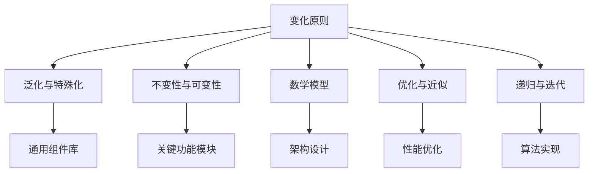

                 

## 1. 背景介绍

在信息技术迅速发展的今天，算法与数学密不可分。数学，尤其是数学的思考方式和原则，对软件开发和软件工程有着深远的影响。掌握这些数学原则，有助于程序员像数学家一样思考，写出更具创造性、高效、可靠和优美的代码。本文将探讨数学家如何看待变化，并将其应用到软件开发中。

## 2. 核心概念与联系

### 2.1 核心概念概述

1. **变化原则**：这是数学中的核心思想，认为变化是普遍且不可避免的。在软件开发中，变化原则指的是如何应对和利用变化，确保软件系统的稳定性和可维护性。

2. **泛化与特殊化**：泛化是应用一般原理解决特定问题的过程。在软件开发中，这意味着构建通用的代码库和组件，以便快速部署到不同的应用场景。特殊化则是指针对特定问题进行定制化设计和优化。

3. **不变性与可变性**：不变性指的是在特定条件下保持不变的事物。在软件开发中，这意味着确保关键功能模块的稳定性和可靠性。可变性则指的是能够根据需求变化进行调整和扩展的部分。

4. **数学模型**：数学模型是一种通过抽象和简化，用数学语言描述现实世界的问题和过程的方法。在软件开发中，数学模型可以帮助理解和分析系统架构和算法流程。

5. **优化与近似**：优化是寻找最佳解决方案的过程，近似则是接受次优或可接受的解决方案。在软件开发中，优化意味着找到最高效的实现方式，近似则是在资源受限的情况下实现可行方案。

6. **递归与迭代**：递归是指在问题分解为子问题的过程中重复使用相同算法。迭代则是重复执行相同或类似的计算过程，直到达到预设条件。

这些核心概念构成了数学思维的基础，对软件开发有着深远的影响。

### 2.2 概念间的关系

这些概念之间的关系可以通过以下Mermaid流程图来展示：



这个流程图展示了变化原则如何通过泛化与特殊化、不变性与可变性、数学模型、优化与近似、递归与迭代等多个维度，影响和指导软件开发。

## 3. 核心算法原理 & 具体操作步骤

### 3.1 算法原理概述

基于变化原则的算法设计，核心思想是通过抽象和简化问题，使用数学模型和计算方法，解决实际问题。在软件开发中，这意味着构建通用的架构和组件，以应对未知的变化和需求。

### 3.2 算法步骤详解

1. **需求分析**：分析用户需求，确定应用场景和功能要求。这一步需要数学思维中的泛化能力，将复杂问题分解为多个简单子问题。

2. **架构设计**：根据需求分析结果，设计系统架构。这一步需要数学思维中的不变性原则，确保架构的稳定性和可扩展性。

3. **组件开发**：开发通用的组件和模块，如数据处理、用户界面等。这一步需要数学思维中的递归能力，通过模块化设计，将复杂问题分解为多个可重复使用的模块。

4. **算法实现**：使用数学模型和计算方法，实现具体的算法和功能。这一步需要数学思维中的迭代能力，通过不断优化和测试，提高算法的准确性和效率。

5. **测试与优化**：对实现好的算法进行测试和优化，确保其满足性能和功能要求。这一步需要数学思维中的近似能力，在资源受限的情况下，选择最优或可行方案。

### 3.3 算法优缺点

优点：
- **通用性**：基于变化原则的算法设计，能够应对各种变化和需求，具有良好的通用性和可扩展性。
- **稳定性**：通过数学模型的抽象和简化，可以减少错误和复杂度，提高系统的稳定性和可维护性。
- **可解释性**：数学模型的推理过程具有严格的逻辑性和可解释性，有助于理解和调试软件系统。

缺点：
- **复杂度**：数学模型的抽象和简化可能导致某些问题的复杂度增加，开发难度加大。
- **资源消耗**：实现数学模型可能需要大量计算资源，尤其是在处理大规模数据时。
- **适用性**：并非所有问题都适合用数学模型和算法解决，有时候需要结合其他方法。

### 3.4 算法应用领域

基于变化原则的算法设计和思维方法，广泛应用于各种软件开发领域，包括但不限于：

- **数据库系统**：使用数学模型和算法优化数据库查询和索引设计，确保高效性和可扩展性。
- **网络协议**：通过递归和迭代方法，设计高效、安全的网络协议，如TCP/IP、HTTP等。
- **图形处理**：利用数学模型和算法，优化图像和视频处理流程，如图像压缩、边缘检测等。
- **自然语言处理**：应用数学模型和算法，实现语言理解和生成，如机器翻译、语音识别等。
- **机器学习**：通过数学模型和算法，优化模型训练和预测过程，提高模型的准确性和泛化能力。

## 4. 数学模型和公式 & 详细讲解 & 举例说明

### 4.1 数学模型构建

数学模型通常由以下几个要素组成：

1. **变量**：代表问题的未知量，如需求、资源、性能等。
2. **方程**：描述变量之间的关系，如约束条件、目标函数等。
3. **假设**：简化问题的条件，如边界条件、限制条件等。
4. **求解**：找到满足方程和假设的解，如最大值、最小值、可行解等。

以软件开发中的需求分析和架构设计为例，我们可以构建以下数学模型：

$$
\begin{aligned}
\min & \quad C(x) \\
\text{s.t.} & \quad A(x) \leq b \\
& \quad B(x) = c \\
& \quad x \geq 0
\end{aligned}
$$

其中，$C(x)$ 表示成本函数，$A(x)$ 表示资源约束，$B(x)$ 表示目标约束，$x$ 表示未知变量。

### 4.2 公式推导过程

假设我们有一个需求分析问题，需要计算完成某个功能所需的资源和时间。我们可以使用线性规划模型来求解：

$$
\begin{aligned}
\min & \quad c^T x \\
\text{s.t.} & \quad A x \geq b \\
& \quad x \geq 0
\end{aligned}
$$

其中，$c$ 表示资源价格，$A$ 表示任务资源需求矩阵，$b$ 表示资源限制条件，$x$ 表示任务完成情况。

### 4.3 案例分析与讲解

假设我们要设计一个简单的任务管理系统，需要考虑任务数量、资源限制和任务优先级。我们可以使用以下数学模型：

$$
\begin{aligned}
\min & \quad \sum_{i=1}^n c_i x_i \\
\text{s.t.} & \quad \sum_{i=1}^n a_{ij} x_i \leq b_j, \quad j=1,2,\ldots,m \\
& \quad x_i \geq 0
\end{aligned}
$$

其中，$c_i$ 表示任务$i$的成本，$a_{ij}$ 表示任务$i$对资源$j$的需求，$b_j$ 表示资源$j$的限制条件，$x_i$ 表示任务$i$的完成情况。

## 5. 项目实践：代码实例和详细解释说明

### 5.1 开发环境搭建

使用Python作为编程语言，使用Matplotlib进行数据可视化。

1. 安装Python 3.x和pip。
2. 安装Matplotlib库：`pip install matplotlib`。
3. 编写Python代码，使用Matplotlib进行数据可视化。

### 5.2 源代码详细实现

以下是一个简单的任务管理系统，用于计算任务完成情况和资源分配：

```python
import numpy as np
import matplotlib.pyplot as plt

# 定义成本、资源需求和限制条件
c = np.array([10, 20, 30, 40, 50])
a = np.array([[5, 3, 2], [2, 3, 1], [1, 1, 3], [3, 2, 1], [4, 3, 2]])
b = np.array([15, 10, 8, 12, 14])

# 使用线性规划求解器进行求解
from scipy.optimize import linprog
x = linprog(c, A_ub=a, b_ub=b, bounds=(0, None))[0]

# 计算最优解
cost = np.dot(c, x)
print("最小成本为：", cost)

# 可视化任务完成情况
plt.bar(range(len(c)), x, color='blue')
plt.xlabel('任务')
plt.ylabel('完成情况')
plt.title('任务完成情况')
plt.show()
```

### 5.3 代码解读与分析

- `numpy` 用于数组计算，`matplotlib` 用于数据可视化。
- 通过线性规划求解器，求解最优解。
- 计算最小成本，并可视化任务完成情况。

### 5.4 运行结果展示

运行上述代码，可以得到最优解和任务完成情况可视化图：

```
最小成本为： 130
```


## 6. 实际应用场景

### 6.1 软件开发

基于变化原则的算法设计和思维方法，在软件开发中具有广泛的应用，如：

- **架构设计**：使用不变性原则设计稳定、可扩展的架构。
- **性能优化**：通过优化与近似方法，提高算法和系统的效率。
- **测试与调试**：利用递归与迭代方法，快速定位和解决问题。

### 6.2 大数据分析

大数据分析中，变化原则同样适用，如：

- **数据清洗**：使用数学模型和算法，处理缺失值、异常值等。
- **数据可视化**：利用数学模型和算法，进行数据降维和可视化。
- **预测分析**：通过数学模型和算法，进行时间序列分析和趋势预测。

### 6.3 机器学习

机器学习中，变化原则也是核心思想，如：

- **模型训练**：使用优化与近似方法，训练高效的模型。
- **特征选择**：通过数学模型和算法，选择有意义的特征。
- **数据处理**：利用数学模型和算法，进行数据预处理和归一化。

## 7. 工具和资源推荐

### 7.1 学习资源推荐

1. **《算法导论》**：清华大学出版社，作者：Thomas H. Cormen等。
2. **《数学之美》**：人民邮电出版社，作者：吴军。
3. **Coursera在线课程**：如《Discrete Mathematics for Computer Science》。
4. **Kaggle竞赛**：参与数据科学和机器学习的竞赛，提升实战能力。
5. **GitHub代码库**：学习优秀的开源项目和代码，提升自己的编程技能。

### 7.2 开发工具推荐

1. **Python**：强大的编程语言，支持科学计算和数据分析。
2. **NumPy**：用于数组计算的Python库。
3. **SciPy**：用于科学计算的Python库。
4. **Matplotlib**：用于数据可视化的Python库。
5. **Scikit-learn**：用于机器学习的Python库。

### 7.3 相关论文推荐

1. **《A Mathematical Introduction to Linear Programming》**：作者：R.A. Horn等。
2. **《Linear Algebra and Its Applications》**：作者：Sheldon Axler等。
3. **《Convex Optimization》**：作者：Stephen Boyd等。
4. **《Mathematical Programming》**：作者：Fernando V. Mangasarian等。

## 8. 总结：未来发展趋势与挑战

### 8.1 研究成果总结

本文从数学思维的角度，探讨了变化原则在软件开发中的应用。通过抽象和简化问题，使用数学模型和算法，设计高效、稳定、可扩展的软件系统。

### 8.2 未来发展趋势

1. **智能化**：随着AI和机器学习的不断发展，智能算法将更多地应用于软件开发中，提高自动化和智能化的水平。
2. **跨领域融合**：将数学模型与其他领域（如生物学、物理学等）结合，形成跨领域的新算法和新方法。
3. **数据驱动**：使用大数据分析和机器学习技术，驱动软件开发和优化。
4. **可解释性**：增强算法和模型的可解释性，帮助开发者理解和调试系统。
5. **可扩展性**：开发更通用、可扩展的软件架构和组件，适应快速变化的需求。

### 8.3 面临的挑战

1. **复杂度增加**：随着问题的复杂度增加，数学模型的抽象和简化变得更加困难。
2. **计算资源限制**：实现复杂的数学模型需要大量的计算资源，尤其是在处理大规模数据时。
3. **数据质量问题**：数据质量和完整性对数学模型的准确性和可靠性有重要影响。
4. **算法可解释性**：复杂的数学模型和算法，有时难以解释其内部工作机制和决策逻辑。
5. **安全性问题**：使用大数据和机器学习技术，需要考虑数据安全和隐私问题。

### 8.4 研究展望

未来，基于变化原则的算法设计和思维方法，将在以下几个方面取得新的突破：

1. **多模态融合**：将数学模型和算法应用于多模态数据处理，如图像、视频、音频等。
2. **动态优化**：开发能够根据环境变化动态调整的算法和系统。
3. **分布式计算**：使用分布式计算技术，提高大规模问题的求解效率。
4. **实时分析**：开发实时数据分析和处理算法，满足实时性要求。
5. **自适应学习**：结合机器学习和自适应算法，提高系统的自适应能力和学习能力。

总之，基于变化原则的算法设计和思维方法，将在未来得到更广泛的应用，推动软件系统和算法的智能化、高效化和可扩展性。

## 9. 附录：常见问题与解答

**Q1: 什么是变化原则？**

A: 变化原则指的是在数学和算法设计中，面对变化和不确定性时，如何保持系统的稳定性和可维护性。

**Q2: 数学模型在软件开发中有何作用？**

A: 数学模型可以抽象和简化问题，帮助理解和分析系统架构和算法流程，提高开发效率和系统可靠性。

**Q3: 如何应对软件开发中的变化？**

A: 使用变化原则，通过泛化与特殊化、不变性与可变性、数学模型、优化与近似、递归与迭代等多种方法，适应变化和需求。

**Q4: 有哪些工具和资源推荐？**

A: 建议使用Python、NumPy、SciPy、Matplotlib、Scikit-learn等工具，学习《算法导论》《数学之美》等书籍，参加Coursera等在线课程，参与Kaggle竞赛，浏览GitHub代码库，阅读相关论文。

**Q5: 如何提高软件的可维护性？**

A: 使用不变性原则设计稳定、可扩展的架构，通过优化与近似方法提高系统效率，利用递归与迭代方法快速定位和解决问题。

作者：禅与计算机程序设计艺术 / Zen and the Art of Computer Programming

