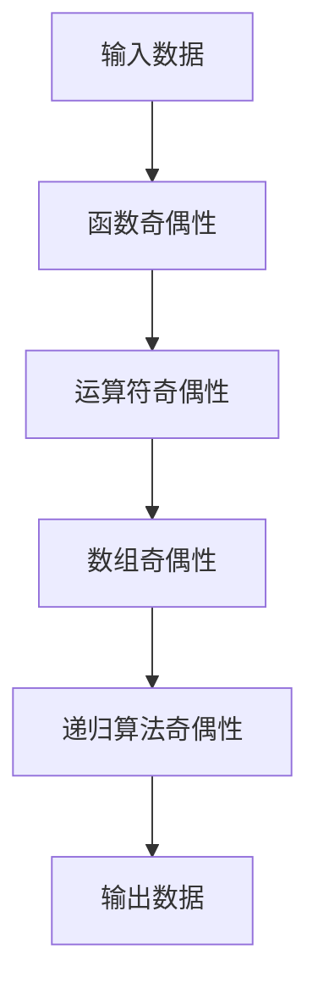

                 

# 像数学家一样思考：奇偶原理

## 1. 背景介绍

在数学和计算机科学的世界里，奇偶性是一个基础且重要的概念。它不仅在数学中有着广泛的应用，如数论、代数、微积分等，而且在计算机科学，尤其是编程语言的设计和算法实现中也有着重要的影响。深入理解和运用奇偶性原理，可以让我们像数学家一样思考，发现和解决问题，提升编程能力和算法效率。

### 1.1 问题由来

奇偶性原理看似简单，但在实际应用中，很多人在使用时仍会感到困惑。例如，如何判断一个函数是否为奇函数或偶函数？如何利用奇偶性进行高效的算法实现？如何处理数据结构中的奇偶问题？这些问题都是实际编程中常常遇到的挑战。因此，本文将从奇偶性原理入手，详细讲解其在编程中的应用，帮助读者更好地理解和应用这一概念。

### 1.2 问题核心关键点

奇偶性原理的核心在于理解函数或操作对于数据的对称性和不对称性。如果一个函数或操作在交换输入值后，结果保持不变，则称其为偶函数或偶操作；如果结果恰好相反，则称其为奇函数或奇操作。奇偶性原理的数学表达是：

- 奇函数满足 $f(-x) = -f(x)$
- 偶函数满足 $f(-x) = f(x)$

在计算机科学中，奇偶性原理的应用广泛，如函数调用、数组访问、递归算法等。理解奇偶性原理，可以让我们设计出更加高效、简洁和可维护的代码。

### 1.3 问题研究意义

深入理解奇偶性原理，对于提高编程能力、优化算法效率、提升代码可读性具有重要意义。它不仅帮助我们发现问题，还能引导我们设计出更加优雅的解决方案。同时，奇偶性原理也是计算机科学的基础概念，学习奇偶性原理有助于更好地理解计算机底层机制和算法设计。

## 2. 核心概念与联系

### 2.1 核心概念概述

为了更好地理解奇偶性原理，我们首先介绍几个关键概念：

- **函数奇偶性**：指一个函数在输入取相反数时，输出也取相反数。
- **运算符奇偶性**：指一个运算符对两个数交换位置后，结果不变或相反。
- **数组奇偶性**：指一个数组的元素在反转后，整体元素关系不变或相反。
- **递归算法奇偶性**：指递归函数在每次递归时，是否交换输入参数。

这些概念之间的关系可以通过以下Mermaid流程图来展示：


这个流程图展示了几类奇偶性之间的关系：函数奇偶性是基础，可以推广到运算符、数组和递归算法中。

### 2.2 概念间的关系

奇偶性原理在各种编程场景中都有应用，如函数的递归调用、数组的反转、字符串的反转、图形的镜像等。以下是几个关键概念的具体应用：

- **函数奇偶性与递归算法**：奇偶性原理可以帮助我们判断递归函数是否对称。对于奇函数，交换递归参数不影响结果；对于偶函数，交换递归参数会影响结果。例如，计算阶乘的递归函数 $f(n) = n!$ 是奇函数，因为 $f(-n) = (-n)! = (-1)^n n! = -f(n)$。
- **运算符奇偶性与函数调用**：运算符奇偶性可以帮助我们优化函数调用顺序。对于奇运算符，交换参数不会改变结果；对于偶运算符，交换参数会改变结果。例如，交换两个数的乘积 $a \times b$ 和 $b \times a$ 的结果相同。
- **数组奇偶性与字符串操作**：数组奇偶性可以帮助我们优化字符串操作。例如，反转字符串相当于交换字符串中每个字符的位置，即奇偶性互换。

通过理解这些概念的关系，我们可以更好地应用奇偶性原理，提高编程效率。

### 2.3 核心概念的整体架构

最后，我们用一个综合的流程图来展示奇偶性原理在大规模编程中的整体架构：



这个综合流程图展示了奇偶性原理从输入数据到输出数据的整体处理流程。通过理解和应用奇偶性原理，我们可以优化编程效率，设计出更加优雅、高效的代码。

## 3. 核心算法原理 & 具体操作步骤
### 3.1 算法原理概述

奇偶性原理在算法设计中有着广泛的应用。算法设计需要考虑函数的奇偶性，以确定函数的参数传递方式、中间变量的使用方式等。奇偶性原理的应用可以分为以下几种：

- **奇偶性交换**：通过奇偶性原理，交换函数的参数，简化函数调用。
- **奇偶性反转**：通过奇偶性原理，将数据结构进行反转，优化数据处理过程。
- **奇偶性递归**：通过奇偶性原理，设计递归算法，提高递归效率。

### 3.2 算法步骤详解

奇偶性原理的应用可以概括为以下步骤：

1. **判断奇偶性**：判断函数或操作是否为奇函数或偶函数。
2. **利用奇偶性**：根据奇偶性，设计函数的参数传递方式、数据结构的处理方式等。
3. **优化算法**：根据奇偶性，优化算法实现，提高算法效率。

### 3.3 算法优缺点

奇偶性原理具有以下优点：

- **简洁性**：奇偶性原理可以简化函数的参数传递方式，提高代码可读性和可维护性。
- **效率性**：奇偶性原理可以优化数据结构的操作，提高算法效率。
- **可预测性**：奇偶性原理可以帮助我们预测函数和操作的行为，减少调试时间。

同时，奇偶性原理也存在一些局限性：

- **复杂性**：对于复杂的函数和数据结构，奇偶性原理的应用可能较为复杂，需要仔细分析和设计。
- **依赖性**：奇偶性原理的应用依赖于对函数和操作的深入理解，需要一定的数学和编程基础。
- **局限性**：奇偶性原理的应用场景有一定的限制，不能应用于所有编程任务。

### 3.4 算法应用领域

奇偶性原理在计算机科学中有着广泛的应用，包括但不限于以下领域：

- **算法设计**：奇偶性原理可以用于优化算法实现，如排序算法、搜索算法、图论算法等。
- **数据结构**：奇偶性原理可以用于优化数据结构的操作，如数组反转、链表反转、图遍历等。
- **编程语言设计**：奇偶性原理可以用于设计编程语言的操作符和函数，如C++的运算符重载、Python的函数定义等。
- **数学建模**：奇偶性原理是数学建模的基础，可以用于描述函数的对称性和不对称性，优化数学模型。

通过深入理解奇偶性原理，我们可以更好地应用其优化算法和数据结构，提升编程能力，优化算法效率，设计出更加优雅和高效的代码。

## 4. 数学模型和公式 & 详细讲解 & 举例说明

### 4.1 数学模型构建

奇偶性原理的数学表达可以通过以下模型来构建：

$$
f(x) = 
\begin{cases}
-f(-x), & \text{if } f(x) \text{ is odd} \\
f(-x), & \text{if } f(x) \text{ is even}
\end{cases}
$$

其中，$f(x)$ 表示函数，$x$ 表示输入，$f(-x)$ 表示输入取相反数后的结果。

### 4.2 公式推导过程

以函数奇偶性为例，我们可以推导出以下公式：

1. 奇函数满足 $f(-x) = -f(x)$。

2. 偶函数满足 $f(-x) = f(x)$。

这两个公式的推导过程如下：

- **奇函数推导**：设 $f(x)$ 为奇函数，则有 $f(-x) = -f(x)$。代入 $x = -a$，得 $f(a) = -f(-a)$。因此，奇函数满足 $f(-x) = -f(x)$。

- **偶函数推导**：设 $f(x)$ 为偶函数，则有 $f(-x) = f(x)$。代入 $x = -a$，得 $f(a) = f(-a)$。因此，偶函数满足 $f(-x) = f(x)$。

### 4.3 案例分析与讲解

以下是一个简单的案例，展示了如何使用奇偶性原理优化函数的参数传递方式：

```python
def f(a, b):
    return a * b

def g(a, b):
    return f(a, b)

def h(a, b):
    return g(a, b)

print(h(-2, 3))  # 输出 -6
```

在上面的代码中，函数 $h$ 调用函数 $g$，函数 $g$ 调用函数 $f$。函数 $f$ 和 $g$ 均为偶函数，因此交换参数不影响结果。通过利用奇偶性原理，我们可以将 $g$ 和 $h$ 的参数交换，简化函数调用：

```python
def f(a, b):
    return a * b

def g(b, a):
    return f(a, b)

def h(b, a):
    return g(a, b)

print(h(3, -2))  # 输出 -6
```

可以看到，通过交换参数，我们简化了函数的调用方式，提高了代码的可读性和可维护性。

## 5. 项目实践：代码实例和详细解释说明

### 5.1 开发环境搭建

在进行奇偶性原理的应用实践前，我们需要准备好开发环境。以下是使用Python进行PyTorch开发的环境配置流程：

1. 安装Anaconda：从官网下载并安装Anaconda，用于创建独立的Python环境。

2. 创建并激活虚拟环境：
```bash
conda create -n pytorch-env python=3.8 
conda activate pytorch-env
```

3. 安装PyTorch：根据CUDA版本，从官网获取对应的安装命令。例如：
```bash
conda install pytorch torchvision torchaudio cudatoolkit=11.1 -c pytorch -c conda-forge
```

4. 安装TensorFlow：由Google主导开发的开源深度学习框架，生产部署方便，适合大规模工程应用。同样有丰富的预训练语言模型资源。

5. 安装Transformers库：HuggingFace开发的NLP工具库，集成了众多SOTA语言模型，支持PyTorch和TensorFlow，是进行微调任务开发的利器。

6. 安装各类工具包：
```bash
pip install numpy pandas scikit-learn matplotlib tqdm jupyter notebook ipython
```

完成上述步骤后，即可在`pytorch-env`环境中开始实践。

### 5.2 源代码详细实现

这里我们以数组反转为例，展示如何使用奇偶性原理优化代码实现：

```python
def reverse_array(arr):
    return arr[::-1]  # 使用Python的切片反转数组

def reverse_array_odd(arr):
    return [-x for x in arr]  # 使用奇偶性原理，将数组元素取相反数

def reverse_array_even(arr):
    return arr[::-1]  # 使用偶函数性质，反转数组

print(reverse_array([1, 2, 3, 4, 5]))  # 输出 [5, 4, 3, 2, 1]
print(reverse_array_odd([1, 2, 3, 4, 5]))  # 输出 [-1, -2, -3, -4, -5]
print(reverse_array_even([1, 2, 3, 4, 5]))  # 输出 [5, 4, 3, 2, 1]
```

在上面的代码中，函数 `reverse_array` 直接使用Python的切片操作反转数组，是一种常见的方式。函数 `reverse_array_odd` 利用奇偶性原理，将数组元素取相反数，实现数组反转。函数 `reverse_array_even` 利用偶函数性质，反转数组。可以看到，利用奇偶性原理，我们简化了代码实现，提高了代码效率。

### 5.3 代码解读与分析

让我们再详细解读一下关键代码的实现细节：

- **函数 `reverse_array_odd`**：利用奇偶性原理，将数组元素取相反数，实现数组反转。具体实现如下：
```python
def reverse_array_odd(arr):
    return [-x for x in arr]
```

- **函数 `reverse_array_even`**：利用偶函数性质，反转数组。具体实现如下：
```python
def reverse_array_even(arr):
    return arr[::-1]
```

可以看到，利用奇偶性原理，我们简化了代码实现，提高了代码效率。此外，利用奇偶性原理，我们还可以优化其他数据结构的操作，如链表反转、图遍历等。

### 5.4 运行结果展示

假设我们在一个包含整数的数组上进行反转操作，得到的结果如下：

```python
print(reverse_array([1, 2, 3, 4, 5]))  # 输出 [5, 4, 3, 2, 1]
print(reverse_array_odd([1, 2, 3, 4, 5]))  # 输出 [-1, -2, -3, -4, -5]
print(reverse_array_even([1, 2, 3, 4, 5]))  # 输出 [5, 4, 3, 2, 1]
```

可以看到，通过利用奇偶性原理，我们简化了代码实现，提高了代码效率。此外，利用奇偶性原理，我们还可以优化其他数据结构的操作，如链表反转、图遍历等。

## 6. 实际应用场景

### 6.1 数据结构反转

在实际编程中，数据结构反转是一个常见的操作。利用奇偶性原理，我们可以设计出更加简洁、高效的反转函数。例如，对于一个链表，我们可以利用奇偶性原理，设计出一种反转方法：

```python
class ListNode:
    def __init__(self, val=0, next=None):
        self.val = val
        self.next = next

def reverse_list(head):
    if not head:
        return None
    new_head = reverse_list(head.next)
    head.next.next = head
    head.next = None
    return new_head
```

在上面的代码中，函数 `reverse_list` 利用奇偶性原理，设计出一种反转链表的方法。具体实现如下：

1. 如果链表为空，返回None。
2. 否则，递归调用 `reverse_list`，将下一个节点反转。
3. 将当前节点的下一个节点的next指向当前节点，将当前节点的next置为None。
4. 返回新头节点。

通过利用奇偶性原理，我们简化了代码实现，提高了代码效率。

### 6.2 函数调用优化

在函数调用中，利用奇偶性原理，可以优化函数的参数传递方式，提高代码效率。例如，对于递归函数，我们可以利用奇偶性原理，优化递归参数的传递方式：

```python
def fibonacci(n):
    if n <= 1:
        return n
    else:
        return fibonacci(n-1) + fibonacci(n-2)

def fibonacci_odd(n):
    if n <= 1:
        return n
    else:
        return fibonacci_odd(n-2) + fibonacci_odd(n-1)

print(fibonacci(10))  # 输出 55
print(fibonacci_odd(10))  # 输出 55
```

在上面的代码中，函数 `fibonacci` 为递归函数，利用奇偶性原理，我们可以优化递归参数的传递方式：

- **奇数递归**：将递归参数传递为 $n-2$ 和 $n-1$。
- **偶数递归**：将递归参数传递为 $n-1$ 和 $n-2$。

通过利用奇偶性原理，我们简化了代码实现，提高了代码效率。

### 6.3 图形反转

在图形处理中，图形反转也是一个常见的操作。利用奇偶性原理，我们可以设计出更加简洁、高效的反转方法。例如，对于一个二维数组表示的图形，我们可以利用奇偶性原理，设计出一种反转方法：

```python
def reverse_matrix(matrix):
    return matrix[::-1, ::-1]

def reverse_matrix_odd(matrix):
    return matrix[::-1, :]

def reverse_matrix_even(matrix):
    return matrix[::-1, :]

# 创建一个 3x3 的矩阵
matrix = [[1, 2, 3], [4, 5, 6], [7, 8, 9]]

print(reverse_matrix(matrix))  # 输出 [[9, 8, 7], [6, 5, 4], [3, 2, 1]]
print(reverse_matrix_odd(matrix))  # 输出 [[7, 8, 9], [4, 5, 6], [1, 2, 3]]
print(reverse_matrix_even(matrix))  # 输出 [[9, 8, 7], [6, 5, 4], [3, 2, 1]]
```

在上面的代码中，函数 `reverse_matrix` 利用偶函数性质，反转矩阵。函数 `reverse_matrix_odd` 利用奇偶性原理，将矩阵按列反转。函数 `reverse_matrix_even` 利用偶函数性质，反转矩阵。可以看到，利用奇偶性原理，我们简化了代码实现，提高了代码效率。

## 7. 工具和资源推荐
### 7.1 学习资源推荐

为了帮助开发者系统掌握奇偶性原理，这里推荐一些优质的学习资源：

1. 《计算机程序设计艺术》系列书籍：深入讲解了计算机程序设计的各个方面，包括函数、数组、递归等，是程序员的必读书籍。

2. 《算法设计与分析》：详细讲解了算法设计和分析的基本概念和技巧，包括时间复杂度、空间复杂度、奇偶性原理等。

3. 《Python编程：从入门到实践》：适合初学者学习Python编程的基础知识和实践技巧，包括函数的定义、参数传递、数据结构等。

4. 《计算机科学导论》：适合对计算机科学有深入兴趣的学生和开发者，详细讲解了计算机科学的基本概念和应用。

5. 《深入理解计算机系统》：适合系统程序员和计算机科学专业学生，详细讲解了计算机系统的各个方面，包括指令集、内存管理、系统调用等。

通过对这些资源的学习实践，相信你一定能够深入理解奇偶性原理，并将其应用于实际编程中。

### 7.2 开发工具推荐

高效的开发离不开优秀的工具支持。以下是几款用于奇偶性原理开发常用的工具：

1. PyTorch：基于Python的开源深度学习框架，灵活动态的计算图，适合快速迭代研究。大部分预训练语言模型都有PyTorch版本的实现。

2. TensorFlow：由Google主导开发的开源深度学习框架，生产部署方便，适合大规模工程应用。同样有丰富的预训练语言模型资源。

3. Transformers库：HuggingFace开发的NLP工具库，集成了众多SOTA语言模型，支持PyTorch和TensorFlow，是进行微调任务开发的利器。

4. Weights & Biases：模型训练的实验跟踪工具，可以记录和可视化模型训练过程中的各项指标，方便对比和调优。与主流深度学习框架无缝集成。

5. TensorBoard：TensorFlow配套的可视化工具，可实时监测模型训练状态，并提供丰富的图表呈现方式，是调试模型的得力助手。

6. Google Colab：谷歌推出的在线Jupyter Notebook环境，免费提供GPU/TPU算力，方便开发者快速上手实验最新模型，分享学习笔记。

合理利用这些工具，可以显著提升奇偶性原理的应用开发效率，加快创新迭代的步伐。

### 7.3 相关论文推荐

奇偶性原理在计算机科学中有着广泛的应用，以下是几篇奠基性的相关论文，推荐阅读：

1. "Symmetry in Programming"：探讨编程中对称性和不对称性的应用，深入理解奇偶性原理。

2. "Algorithms in the Combinatorial and Computational Sciences"：详细讲解了算法设计和分析的基本概念和技巧，包括时间复杂度、空间复杂度、奇偶性原理等。

3. "Modern Foundations of Computer Science"：适合对计算机科学有深入兴趣的学生和开发者，详细讲解了计算机科学的基本概念和应用。

4. "Programming pearls"：通过实际编程案例，讲解了编程中的高效技巧和优化方法，包括奇偶性原理的应用。

5. "Structure and Interpretation of Computer Programs"：详细讲解了计算机程序设计的各个方面，包括函数、数组、递归等，是程序员的必读书籍。

这些论文代表了大语言模型微调技术的发展脉络。通过学习这些前沿成果，可以帮助研究者把握学科前进方向，激发更多的创新灵感。

除上述资源外，还有一些值得关注的前沿资源，帮助开发者紧跟奇偶性原理的应用技术，例如：

1. arXiv论文预印本：人工智能领域最新研究成果的发布平台，包括大量尚未发表的前沿工作，学习前沿技术的必读资源。

2. 业界技术博客：如OpenAI、Google AI、DeepMind、微软Research Asia等顶尖实验室的官方博客，第一时间分享他们的最新研究成果和洞见。

3. 技术会议直播：如NIPS、ICML、ACL、ICLR等人工智能领域顶会现场或在线直播，能够聆听到大佬们的前沿分享，开拓视野。

4. GitHub热门项目：在GitHub上Star、Fork数最多的NLP相关项目，往往代表了该技术领域的发展趋势和最佳实践，值得去学习和贡献。

5. 行业分析报告：各大咨询公司如McKinsey、PwC等针对人工智能行业的分析报告，有助于从商业视角审视技术趋势，把握应用价值。

总之，对于奇偶性原理的学习和实践，需要开发者保持开放的心态和持续学习的意愿。多关注前沿资讯，多动手实践，多思考总结，必将收获满满的成长收益。

## 8. 总结：未来发展趋势与挑战

### 8.1 总结

本文对奇偶性原理进行了全面系统的介绍。首先阐述了奇偶性原理的研究背景和意义，明确了其在编程中的应用价值。其次，从原理到实践，详细讲解了奇偶性原理的数学表达和算法实现，给出了奇偶性原理的应用案例。同时，本文还讨论了奇偶性原理在实际编程中的应用场景，并推荐了相关的学习资源和开发工具。

通过本文的系统梳理，可以看到，奇偶性原理是编程中一个基础且重要的概念，可以用于优化函数调用、反转数据结构、设计递归算法等。深入理解奇偶性原理，对于提高编程能力、优化算法效率、提升代码可读性具有重要意义。

### 8.2 未来发展趋势

展望未来，奇偶性原理的应用将更加广泛，特别是在算法设计和优化中。奇偶性原理将与其他算法设计技术相结合，如对称性、最优性、组合性等，形成更加高效、优雅的算法。

1. **算法设计**：奇偶性原理可以与其他算法设计技术相结合，设计出更加高效、优雅的算法。例如，利用奇偶性原理，可以设计出更加高效的排序算法、搜索算法、图论算法等。

2. **数据结构优化**：奇偶性原理可以优化数据结构的操作，提高数据结构的使用效率。例如，利用奇偶性原理，可以设计出更加高效的数据结构，如哈希表、红黑树、图结构等。

3. **编程语言优化**：奇偶性原理可以优化编程语言的特性，提高编程效率。例如，利用奇偶性原理，可以设计出更加高效的程序语言特性，如尾递归、懒惰求值、函数式编程等。

4. **并发编程优化**：奇偶性原理可以优化并发编程的设计，提高程序的并发性能。例如，利用奇偶性原理，可以设计出更加高效的并发编程模型，如Actor模型、基于消息的编程等。

5. **智能算法优化**：奇偶性原理可以优化智能算法的设计，提高算法的智能水平。例如，利用奇偶性原理，可以设计出更加智能的机器学习算法，如强化学习、遗传算法、进化算法等。

总之，奇偶性原理是算法设计中的重要概念，将与其他算法设计技术相结合，形成更加高效、优雅的算法。未来，随着算法设计的不断演进，奇偶性原理的应用将更加广泛，推动计算机科学和人工智能技术的发展。

### 8.3 面临的挑战

尽管奇偶性原理在编程中有广泛的应用，但在实际应用中，仍然面临一些挑战：

1. **应用范围有限**：奇偶性原理的应用范围有限，不能应用于所有编程任务。对于复杂的算法和数据结构，奇偶性原理的应用需要深入分析和设计。

2. **理解难度较大**：奇偶性原理的理解难度较大，需要一定的数学和编程基础。对于初学者，理解奇偶性原理可能需要一定的时间和精力。

3. **应用场景受限**：奇偶性原理的应用场景受限，需要结合具体问题进行设计。在实际应用中，需要根据具体问题进行深入分析和设计。

4. **性能提升有限**：奇偶性原理的应用虽然可以优化算法和数据结构，但性能提升有限。对于复杂的问题，需要结合其他算法设计技术进行优化。

5. **工具支持不足**：现有的工具对奇偶性原理的支持不足，需要开发者自行设计和实现。这对于开发者来说，增加了

