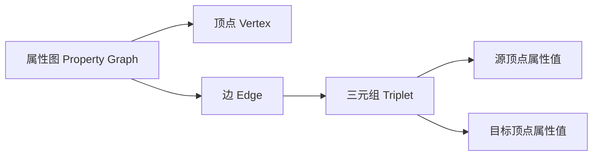
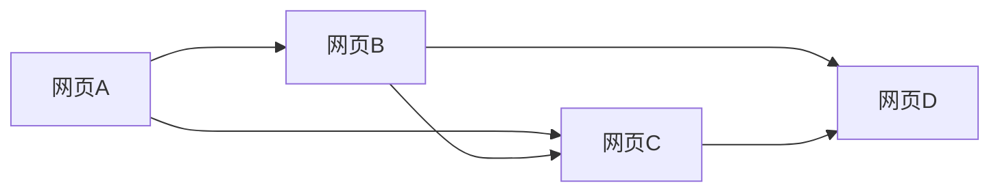

# Spark GraphX原理与代码实例讲解

## 1. 背景介绍

### 1.1 问题的由来

在当今大数据时代，图形结构数据无处不在。社交网络、Web链接、交通网络、生物网络等领域都可以抽象为图形结构进行建模和分析。传统的关系型数据库系统难以高效处理这种复杂的图形结构数据。因此，针对图形结构数据的高效处理和分析成为了一个迫切的需求。

### 1.2 研究现状

图计算是一个活跃的研究领域,已经出现了多种图计算系统和框架,如Pregel、GraphLab、Giraph等。Apache Spark是一个流行的大数据处理框架,它提供了GraphX作为图计算的扩展库。GraphX基于Spark的RDD(Resilient Distributed Dataset)抽象,提供了一种高效的图形数据结构和图并行计算模型。

### 1.3 研究意义

GraphX作为Spark生态系统中的图计算框架,具有以下优势:

1. **高效性**:基于Spark的RDD抽象,可以充分利用内存计算和容错机制,提高计算效率。
2. **可扩展性**:可以在大规模分布式集群上运行,处理大规模图形数据。
3. **易用性**:提供了丰富的图形操作API,简化了图形数据处理过程。
4. **统一性**:与Spark无缝集成,可以与Spark的其他组件(如SparkSQL、MLlib等)协同工作。

因此,深入研究GraphX的原理和实践对于高效处理图形结构数据具有重要意义。

### 1.4 本文结构

本文将从以下几个方面全面介绍GraphX:

1. 核心概念与联系
2. 核心算法原理与具体操作步骤
3. 数学模型和公式详细讲解与案例分析
4. 项目实践:代码实例和详细解释说明
5. 实际应用场景
6. 工具和资源推荐
7. 总结:未来发展趋势与挑战
8. 附录:常见问题与解答

## 2. 核心概念与联系

GraphX将图形数据抽象为由属性图(Property Graph)表示,包含以下核心概念:

1. **顶点(Vertex)**: 表示图中的节点实体,具有唯一ID和属性值。
2. **边(Edge)**: 表示顶点之间的关系,具有源顶点ID、目标顶点ID和属性值。
3. **三元组(Triplet)**: 由一条边及其源顶点和目标顶点属性值组成。
4. **属性图(Property Graph)**: 由顶点和边组成,用于表示图形结构数据。

这些概念之间的关系如下Mermaid流程图所示:



GraphX基于Spark的RDD抽象构建,将属性图分解为顶点RDD和边RDD,支持各种图形操作和图并行计算。

## 3. 核心算法原理 & 具体操作步骤

### 3.1 算法原理概述

GraphX的核心算法原理是基于消息传递的"顶点程序"(Vertex Program)模型,灵感来自于Google的Pregel系统。该模型将图形计算抽象为一系列迭代的"超步"(Superstep),每个超步包含以下三个阶段:

1. **顶点计算阶段**: 每个顶点并行执行用户定义的函数,可以基于自身状态和接收到的消息更新自身状态。
2. **消息传递阶段**: 每个顶点可以向其他顶点发送消息。
3. **消息组合阶段**: 对于同一目标顶点的多条消息,GraphX会自动进行组合(如求和)。

该模型可以表示多种经典图算法,如PageRank、连通分量、最短路径等。

### 3.2 算法步骤详解

以PageRank算法为例,其在GraphX中的实现步骤如下:

1. **初始化图形数据**:构建顶点RDD和边RDD,每个顶点的初始PR值为1/N(N为顶点总数)。
2. **定义顶点程序**:
   - 顶点计算阶段:每个顶点根据收到的PR值求和计算新的PR值。
   - 消息传递阶段:每个顶点将自身PR值除以出边数,并向所有邻居发送消息。
3. **执行迭代计算**:重复执行顶点程序,直至收敛或达到最大迭代次数。
4. **输出结果**:最终每个顶点的PR值即为PageRank值。

### 3.3 算法优缺点

GraphX基于Spark的RDD抽象,因此具有以下优点:

1. **容错性**:基于RDD的容错机制,可以自动恢复失败任务。
2. **内存计算**:充分利用内存进行计算,提高效率。
3. **可扩展性**:可以在大规模分布式集群上运行。

但也存在一些缺点:

1. **迭代效率**:每次迭代都需要重新构建RDD,开销较大。
2. **内存限制**:对于超大规模图形数据,可能会受限于集群内存容量。

### 3.4 算法应用领域

GraphX的"顶点程序"模型可以表示多种经典图算法,广泛应用于以下领域:

1. **社交网络分析**: 如PageRank、社区发现、影响力传播等。
2. **Web链接分析**: 如网页排名、链接预测等。
3. **推荐系统**: 如协同过滤、相似度计算等。
4. **交通网络分析**: 如路径规划、交通流量预测等。
5. **生物网络分析**: 如基因调控网络、蛋白质相互作用网络等。

## 4. 数学模型和公式 & 详细讲解 & 举例说明

### 4.1 数学模型构建

PageRank算法的核心思想是通过网页之间的链接结构,计算每个网页的重要性排名。其数学模型如下:

设有N个网页,构建一个NxN的超链接矩阵M,其中$M_{ij}$表示从网页i到网页j的链接数。令$p_i$表示网页i的PageRank值,则PageRank模型可表示为:

$$p_i = \frac{1-d}{N} + d\sum_{j\in B_i}\frac{p_j}{L(j)}$$

其中:
- $d$是阻尼系数(damping factor),通常取值0.85
- $B_i$是指向网页i的所有网页集合
- $L(j)$是网页j的出链接数

该模型的直观解释是:一个网页的PageRank值由两部分组成,一部分来自所有网页的均匀概率$\frac{1}{N}$,另一部分来自所有链入该网页的其他网页的PageRank值之和。

### 4.2 公式推导过程

我们可以将上述PageRank模型写成矩阵形式:

$$\vec{p} = \frac{1-d}{N}\vec{e} + dM^T\vec{p}$$

其中$\vec{p}$是PageRank值向量,$\vec{e}$是全1向量,M是超链接矩阵。

该方程可以进一步化简为:

$$\vec{p} = (1-d)(I - dM^T)^{-1}\vec{e}$$

其中I是单位矩阵。该公式给出了PageRank值向量$\vec{p}$的解析解。

在实际计算中,通常采用迭代方法求解,即不断更新$\vec{p}$直至收敛:

$$\vec{p}^{(k+1)} = \frac{1-d}{N}\vec{e} + dM^T\vec{p}^{(k)}$$

这种迭代方式就是GraphX中PageRank算法的实现原理。

### 4.3 案例分析与讲解

考虑一个简单的网页链接示例:



其超链接矩阵M为:

$$M = \begin{bmatrix}
0 & 1 & 1 & 0\
0 & 0 & 1 & 1\
0 & 0 & 0 & 1\
0 & 0 & 0 & 0
\end{bmatrix}$$

令阻尼系数$d=0.85$,初始PageRank值向量$\vec{p}^{(0)}=\begin{bmatrix}\frac{1}{4}&\frac{1}{4}&\frac{1}{4}&\frac{1}{4}\end{bmatrix}$,则第一次迭代后:

$$\vec{p}^{(1)} = \frac{1-0.85}{4}\begin{bmatrix}1\1\1\1\end{bmatrix} + 0.85\begin{bmatrix}0.5\0.5\0.25\0\end{bmatrix} = \begin{bmatrix}0.2375\0.2375\0.3125\0.2125\end{bmatrix}$$

可以看出,网页C由于被多个网页链入,因此PageRank值较高。通过多次迭代,PageRank值将收敛到稳定值。

### 4.4 常见问题解答

1. **为什么需要阻尼系数d?**

阻尼系数d的引入是为了避免"环路捕获"(rank sink)问题。如果d=1,则一旦进入环路,PageRank值就无法流出,会导致其他网页的PageRank值为0。引入(1-d)可以保证每个网页都有一定的基础PageRank值,避免环路捕获。

2. **PageRank值是否与网页内容相关?**

PageRank算法只考虑网页之间的链接结构,与网页内容无关。因此,PageRank值只能反映网页的重要性或流行程度,而不能直接反映网页内容的质量。

3. **PageRank值如何应用于网页排名?**

PageRank值只是网页排名的一个重要因素,搜索引擎通常会综合考虑多个因素(如网页内容相关性、用户反馈等)来确定最终的网页排名。

## 5. 项目实践:代码实例和详细解释说明

### 5.1 开发环境搭建

1. 安装Apache Spark,版本>=2.3.0
2. 安装Scala编程环境,版本>=2.11
3. 导入GraphX库:`spark-shell --packages graphframes:graphframes:0.8.1-spark3.0-s_2.12`

### 5.2 源代码详细实现

```scala
import org.apache.spark.graphx._
import org.apache.spark.rdd.RDD

// 构建图形数据
val vertices: RDD[(VertexId, String)] = sc.parallelize(Array((1L, "A"), (2L, "B"), (3L, "C"), (4L, "D")))
val edges: RDD[Edge[Double]] = sc.parallelize(Array(Edge(1L, 2L, 1.0), Edge(1L, 3L, 1.0), Edge(2L, 3L, 1.0), Edge(2L, 4L, 1.0), Edge(3L, 4L, 1.0)))
val graph: Graph[String, Double] = Graph(vertices, edges)

// 定义PageRank算法
def staticPageRank(graph: Graph[String, Double], numIters: Int, resetProb: Double = 0.15): Graph[Double, Double] = {
  val initialPageRank: Double = 1.0 / graph.numVertices
  val initialGraph: Graph[Double, Double] = graph.mapVertices((vid, attr) => initialPageRank)

  def sendMessageSum(triplet: TripletFields[Double, Double]): Iterator[(VertexId, Double)] = {
    triplet.sendToDst(triplet.srcAttr / triplet.dstAttr.size)
  }

  def vertexProgram(id: VertexId, attr: Double, msgSum: Double): Double = {
    resetProb + (1.0 - resetProb) * msgSum
  }

  Pregel(initialGraph, initialPageRank, numIters)(vertexProgram, sendMessageSum, triplet => Iterator.empty)
    .mapVertices((vid, attr) => attr)
}

// 执行PageRank算法
val numIters = 10
val resetProb = 0.15
val pageRankGraph = staticPageRank(graph, numIters, resetProb)

// 输出结果
println(pageRankGraph.vertices.collect().mkString("\n"))
```

### 5.3 代码解读与分析

1. 首先构建图形数据,包括顶点RDD和边RDD。

2. 定义`staticPageRank`函数,实现PageRank算法:
   - 使用`Graph.mapVertices`初始化每个顶点的PageRank值为$\frac{1}{N}$。
   - 定义`sendMessageSum`函数,实现消息传递阶段,每个顶点将自身PageRank值