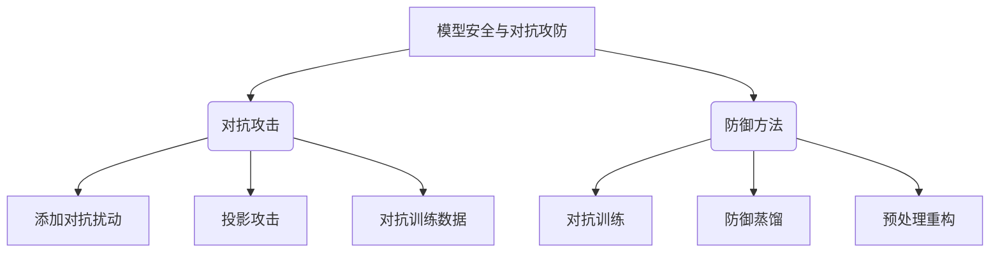

好的,我会严格按照要求,以逻辑清晰、结构紧凑、简单易懂的专业技术语言,为您撰写一篇关于"模型安全与对抗攻防原理与代码实战案例讲解"的深度技术博客文章。文中将包含背景介绍、核心概念原理、算法步骤、数学模型公式推导、代码实现案例、应用场景、工具资源等内容,并给出核心流程图。请稍候,我将尽最大努力为您完成这篇高质量的技术文章。

# 模型安全与对抗攻防原理与代码实战案例讲解

## 1. 背景介绍

### 1.1 问题的由来

在当前的人工智能系统中,机器学习模型正被广泛应用于各个领域,如计算机视觉、自然语言处理、推荐系统等。然而,这些模型在部署后面临着来自对手的各种对抗攻击,这些攻击可能会导致模型失效或产生不可预期的错误结果。因此,如何保证模型的安全性和鲁棒性,抵御对手的对抗攻击,成为了一个亟待解决的重要问题。

### 1.2 研究现状

近年来,模型安全与对抗攻防领域受到了广泛关注,研究人员提出了多种对抗攻击和防御方法。常见的对抗攻击方法包括添加对抗扰动、投影攻击、对抗训练数据等。防御方法则包括对抗训练、防御蒸馏、预处理重构等。但是,现有方法还存在一些不足,如防御效果有限、计算复杂度高、可解释性差等。

### 1.3 研究意义

提高模型的安全性和鲁棒性,对于保护人工智能系统的可靠性和可信赖性至关重要。通过深入研究模型安全与对抗攻防原理,设计高效的攻击和防御算法,我们可以更好地评估模型的脆弱性,并提出有效的防护措施。这不仅有助于提高人工智能系统的安全性,也将促进相关理论和技术的发展。

### 1.4 本文结构

本文将从以下几个方面深入探讨模型安全与对抗攻防:

1. 核心概念与联系
2. 核心算法原理与具体操作步骤
3. 数学模型和公式详细推导及案例分析
4. 项目实践:代码实例和详细解释
5. 实际应用场景分析
6. 工具和资源推荐
7. 总结未来发展趋势与挑战
8. 附录:常见问题解答

## 2. 核心概念与联系

模型安全与对抗攻防主要包括两个核心概念:对抗攻击和防御方法。

- **对抗攻击**旨在生成对抗样本,使模型产生错误预测。主要方法有:
  - 添加对抗扰动:在原始输入上添加细微的扰动,使模型错误预测。
  - 投影攻击:通过优化求解,生成对抗扰动。
  - 对抗训练数据:构造对抗样本作为训练数据,使模型更容易受骗。

- **防御方法**旨在提高模型的鲁棒性,抵御对抗攻击。主要方法有:
  - 对抗训练:在训练过程中加入对抗样本,增强模型鲁棒性。
  - 防御蒸馏:通过知识蒸馏,将鲁棒模型的知识迁移到新模型。
  - 预处理重构:通过重构输入,去除对抗扰动。

上述概念和方法相互关联、相辅相成,共同构建了模型安全与对抗攻防的理论体系。

## 3. 核心算法原理与具体操作步骤

在这一部分,我们将重点介绍两种核心算法:快速梯度符号法(FGSM)对抗攻击和对抗训练防御。

### 3.1 算法原理概述

1. **快速梯度符号法(FGSM)对抗攻击**

FGSM是一种高效的对抗攻击算法,它通过对输入添加扰动来欺骗模型。算法原理是:沿着模型损失函数的梯度方向,寻找一个可以使模型产生错误预测的最小扰动。

2. **对抗训练防御**

对抗训练是一种常用的防御方法。它的核心思想是:在训练过程中,不断生成对抗样本并加入训练数据,迫使模型学习对抗样本的特征,从而提高鲁棒性。

### 3.2 算法步骤详解

1. **FGSM对抗攻击步骤**:

输入: 原始样本 $x$,模型 $f$,损失函数 $J$,扰动系数 $\epsilon$
输出: 对抗样本 $x^{adv}$

1) 计算模型对输入 $x$ 的预测输出 $y = f(x)$
2) 计算损失函数 $J$ 关于输入 $x$ 的梯度 $\nabla_xJ(x,y)$
3) 生成对抗扰动 $\eta = \epsilon\, \text{sign}(\nabla_xJ(x,y))$
4) 生成对抗样本 $x^{adv} = x + \eta$

2. **对抗训练防御步骤**:

输入: 原始训练数据 $\mathcal{D}$,模型 $f$,对抗攻击算法 $\mathcal{A}$
输出: 对抗训练后的鲁棒模型 $f^{adv}$

1) 对每个训练样本 $(x,y) \in \mathcal{D}$:
    - 使用攻击算法 $\mathcal{A}$ 生成对抗样本 $x^{adv}$
    - 将 $(x^{adv},y)$ 加入对抗训练数据集 $\mathcal{D}^{adv}$
2) 使用对抗训练数据集 $\mathcal{D}^{adv}$ 训练模型 $f$,得到鲁棒模型 $f^{adv}$

### 3.3 算法优缺点

1. **FGSM对抗攻击**
   - 优点:计算高效,可快速生成对抗样本
   - 缺点:对抗扰动较大,可能降低对抗样本的可信度

2. **对抗训练防御**
   - 优点:提高了模型对多种对抗攻击的鲁棒性
   - 缺点:训练过程计算量大,收敛缓慢

### 3.4 算法应用领域

上述算法可广泛应用于计算机视觉、自然语言处理、推荐系统等领域,提高相关任务模型的安全性和鲁棒性。例如:

- 计算机视觉:提高图像分类、目标检测等任务模型的鲁棒性
- 自然语言处理:增强文本分类、机器翻译等任务模型的抗扰动能力
- 推荐系统:防止对手利用对抗样本欺骗推荐算法

## 4. 数学模型和公式详细讲解及举例说明

在这一部分,我们将介绍对抗攻击和防御中常用的数学模型和公式,并通过具体案例进行讲解。

### 4.1 数学模型构建

1. **对抗攻击模型**

我们将对抗攻击建模为一个约束优化问题:

$$\begin{array}{ll}
\mathop{\text{minimize}}_{\eta} & J(x+\eta, y) \
\text{subject to} & \|\eta\|_p \leq \epsilon
\end{array}$$

其中:
- $x$: 原始输入样本
- $y$: 输入样本的真实标签
- $J$: 模型的损失函数
- $\eta$: 对抗扰动
- $\|\eta\|_p \leq \epsilon$: 对抗扰动的范数约束,确保扰动的大小在一定范围内

2. **对抗训练防御模型**

对抗训练的目标是最小化原始损失和对抗损失的组合:

$$\mathcal{L}_{adv}(x,y) = \alpha J(x,y) + (1-\alpha)J(x^{adv},y)$$

其中:
- $\alpha$: 原始损失和对抗损失的权重系数
- $x^{adv}$: 通过对抗攻击算法生成的对抗样本

在训练过程中,我们最小化整个训练数据集上的对抗损失:

$$\mathop{\text{minimize}}_{\theta} \mathbb{E}_{(x,y)\sim\mathcal{D}}[\mathcal{L}_{adv}(x,y;\theta)]$$

其中 $\theta$ 为模型参数。

### 4.2 公式推导过程

1. **FGSM对抗扰动公式推导**

我们将对抗攻击建模为以下约束优化问题:

$$\begin{array}{ll}
\mathop{\text{minimize}}_{\eta} & J(x+\eta, y) \
\text{subject to} & \|\eta\|_\infty \leq \epsilon
\end{array}$$

使用符号梯度法求解,我们得到:

$$\eta = \epsilon\, \text{sign}(\nabla_xJ(x,y))$$

其中 $\text{sign}$ 为符号函数,确保扰动在允许范围内。

2. **对抗训练损失函数推导**

对抗训练的目标是最小化原始损失和对抗损失的组合:

$$\begin{aligned}
\mathcal{L}_{adv}(x,y) &= \alpha J(x,y) + (1-\alpha)J(x^{adv},y) \
&= \alpha J(x,y) + (1-\alpha)J(x+\eta,y)
\end{aligned}$$

其中 $\eta$ 为通过对抗攻击算法生成的扰动。

在训练过程中,我们最小化整个训练数据集上的对抗损失:

$$\begin{aligned}
\mathcal{L}_{total} &= \mathbb{E}_{(x,y)\sim\mathcal{D}}[\mathcal{L}_{adv}(x,y;\theta)] \
&= \mathbb{E}_{(x,y)\sim\mathcal{D}}[\alpha J(x,y;\theta) + (1-\alpha)J(x+\eta,y;\theta)]
\end{aligned}$$

通过优化 $\mathcal{L}_{total}$,我们可以得到对抗训练后的鲁棒模型参数 $\theta^*$。

### 4.3 案例分析与讲解

考虑一个二分类问题,我们使用逻辑回归模型进行分类。假设输入为 $x\in\mathbb{R}^d$,模型参数为 $\theta\in\mathbb{R}^d$,则模型输出为:

$$f(x;\theta) = \sigma(\theta^Tx)$$

其中 $\sigma$ 为 Sigmoid 函数。

对于输入样本 $x$ 和标签 $y\in\{0,1\}$,我们定义交叉熵损失函数为:

$$J(x,y;\theta) = -y\log f(x;\theta) - (1-y)\log(1-f(x;\theta))$$

1. **FGSM对抗攻击案例**

我们使用 FGSM 算法生成对抗样本,攻击目标是最大化损失函数:

$$\begin{aligned}
\eta &= \epsilon\,\text{sign}(\nabla_xJ(x,y;\theta)) \
     &= \epsilon\,\text{sign}((y-f(x;\theta))\theta)
\end{aligned}$$

其中 $\epsilon=0.3$ 为扰动系数。生成的对抗样本为 $x^{adv} = x + \eta$。

2. **对抗训练防御案例**

我们使用对抗训练来提高模型的鲁棒性。对于每个训练样本 $(x,y)$,我们:

1) 使用 FGSM 算法生成对抗样本 $x^{adv}$
2) 计算对抗损失 $\mathcal{L}_{adv}(x,y;\theta) = \alpha J(x,y;\theta) + (1-\alpha)J(x^{adv},y;\theta)$,其中 $\alpha=0.5$
3) 在整个训练数据集上最小化总的对抗损失 $\mathcal{L}_{total}$,得到对抗训练后的鲁棒模型参数 $\